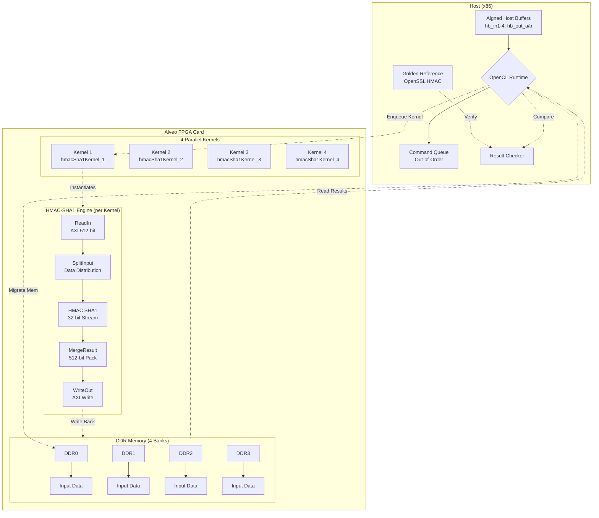

# HMAC-SHA1 认证基准测试模块

## 一句话概括

这是一个面向 Xilinx FPGA 的高吞吐量 HMAC-SHA1 认证基准测试框架，它通过**四级并行内核**、**乒乓缓冲**和**多通道 DDR 访存**的架构，实现了在 Alveo 加速卡上对大量消息进行硬件加速的 HMAC-SHA1 计算，同时重叠 PCIe 数据传输与 FPGA 计算以隐藏延迟。

---

## 问题空间与设计动机

### 我们试图解决什么问题？

在现代数据中心和网络安全应用中，HMAC-SHA1 仍是广泛使用的消息认证算法（MAC）。然而，在软件层面实现时，SHA-1 的计算密集型特性使其成为性能瓶颈：

- **吞吐瓶颈**：单个 CPU 核心难以应对每秒数万次的认证请求
- **延迟敏感**：在 TLS/SSL 或 VPN 场景中，每个数据包都需要独立的 HMAC 计算
- **功耗效率**：数据中心对每瓦特性能（Performance/Watt）有严格要求

### 为什么选择 FPGA？

FPGA 提供了**流式数据并行**（streaming data parallelism）的能力，允许我们将 HMAC-SHA1 实现为深度流水线化的硬件电路，同时保持低功耗。本模块的目标是**量化**这种加速效果——它不仅是一个生产级实现，更是一个**基准测试平台**，用于测量 Alveo 加速卡在真实工作负载下的吞吐量和延迟。

---

## 核心抽象与心智模型

想象这个系统是一个**高度并行的邮件分拣中心**：

### 1. 四级并行处理单元（Four Parallel Processing Units）

想象有四个独立的分拣员（Kernel 1-4），他们同时工作。每个分拣员都能独立处理完整的 HMAC-SHA1 计算。为什么是四个？因为 Alveo 卡上的 FPGA 资源足够容纳四个中等规模的内核，而四个内核可以并行访问四个独立的 DDR 内存组（DDR0-DDR3），避免内存争用。

### 2. 乒乓缓冲（Ping-Pong Buffering）

想象有两个传送带（Ping 和 Pong）。当分拣员在处理"Ping"传送带上的邮件时，外部卡车正在向"Pong"传送带卸载新的邮件。一旦分拣员完成 Ping 批次，他们立即切换到 Pong 批次，而卡车则开始向腾空的 Ping 传送带装载下一批。这种**双缓冲**策略使得数据传输时间被完全隐藏在计算时间之后。

### 3. 流式数据流（Streaming Dataflow）

在 FPGA 内部，数据不是被"存储"后再处理，而是像水一样**流动**（streams）。每个处理阶段（读取、分割、计算 HMAC、合并、写回）形成一个流水线，数据以 512-bit 的块（AXI 宽度）在各级之间流动。这种架构消除了对大型中间缓冲区的需求，最大化了内存带宽利用率。

---

## 架构概览



### 数据流详解

#### 1. 主机端初始化与缓冲分配

主机代码 (`main.cpp`) 首先使用 `posix_memalign` 分配**页对齐**的缓冲区（4096 字节对齐）。这不是可选的优化，而是 Xilinx OpenCL 运行时的硬性要求——只有页对齐的主机内存才能通过 PCIe 进行零拷贝（zero-copy）直接内存访问（DMA）。

分配了四组输入缓冲区 (`hb_in1` 到 `hb_in4`) 和两组输出缓冲区 (`hb_out_a` 和 `hb_out_b`)。为什么是四组输入？因为对应四个 DDR 内存组，每个内核实例独占一个 DDR bank，消除内存控制器争用。

#### 2. 内核配置与数据打包

每个 HMAC 任务需要以下元数据，被打包到 512-bit AXI 字的特定字段：
- **消息长度** (511:448)：要认证的消息字节数
- **任务数量** (447:384)：该批次包含多少独立消息
- **密钥** (255:0)：256-bit HMAC 密钥（本实现使用 32 字节密钥）

这种**静态配置**方式意味着所有任务在批次开始前必须已知，适合批量处理场景（如日志完整性验证、批量 API 请求签名），但不适合流式单条消息。

#### 3. 乒乓执行流水线

主机使用**非阻塞命令队列**（`CL_QUEUE_OUT_OF_ORDER_EXEC_MODE_ENABLE`）并创建三个事件链：

```
Write[i] → Kernel[i] → Read[i]
     ↘        ↗
   Write[i+1] → Kernel[i+1]
```

- **Ping-Pong 选择**：通过 `i & 1`（最低位）交替使用缓冲组 A 和 B
- **双缓冲重叠**：第 `i` 次的读取结果可以与第 `i+1` 次的数据写入并行执行
- **四级内核并行**：四个内核实例同时运行，每个处理分配到该 DDR bank 的数据分区

这种架构使得 PCIe 传输时间被计算时间完全隐藏，只要内核计算时间大于传输时间，整体吞吐量就等于 FPGA 纯计算吞吐。

#### 4. FPGA 内核数据流

每个内核 (`hmacSha1Kernel_X`) 内部是一个**细粒度流水线**：

1. **readIn**: 从 AXI4-MM 接口读取 512-bit 宽的数据，通过突发传输（burst）最大化内存带宽。使用 `_burstLength` 参数控制突发大小，平衡延迟与吞吐。

2. **splitInput**: 将宽 AXI 数据分割为 32-bit 流（`msgStrm`）供 HMAC 引擎处理，同时分发 32-bit 密钥流（`keyStrm`）。这里实现了**数据扇出**（fan-out），单个输入流被复制到 `_channelNumber` 个并行处理通道。

3. **hmacSha1Parallel**: 真正的计算核心。使用 `xf::security::hmac` 模板实例化 HMAC-SHA1，内部通过 `sha1_wrapper` 适配器将 Xilinx 的 SHA-1 实现接入 HMAC 框架。这是**指令级并行**（ILP）与**流水线**的结合。

4. **mergeResult**: 将 160-bit HMAC 结果（5×32-bit）打包回 512-bit AXI 字，实现**数据聚集**（gather）。使用 `ap_uint<512>` 的 `range` 操作进行位域操作。

5. **writeOut**: 将结果写回 DDR，使用突发传输。

整个内核使用 `#pragma HLS dataflow` 指令，允许 Xilinx HLS 工具将各个函数调用调度为**并发进程**（类似协程），通过流式接口（`hls::stream`）进行通信，形成深流水线。

---

## 关键设计决策与权衡

### 1. 四级同质内核 vs 单核深度流水线

**选择**: 实例化四个完全相同的内核（`hmacSha1Kernel_1` 到 `_4`），每个连接独立的 DDR bank。

**权衡**:
- **优势**: 
  - 线性扩展性：四个内核提供接近 4x 的吞吐（受限于 PCIe 带宽）
  - 内存隔离：无 DDR 控制器争用，确定性延迟
  - 编译简单：内核规模适中，HLS 编译时间合理
- **代价**:
  - 资源开销：4x 的 LUT/FF/DSP 消耗
  - 面积限制：如果单个 FPGA 资源不足，无法降级到 2 核或 1 核运行（需重新编译）

**替代方案**: 单核但深度流水线化，内部处理 4 路交错任务。这会减少资源重复，但增加控制逻辑复杂度，且 DDR 带宽利用率可能下降（突发长度变短）。

### 2. 乒乓缓冲 vs 单缓冲流水线

**选择**: 主机端实现双缓冲（Ping-Pong），FPGA 计算第 N 批次时，PCIe 传输第 N+1 批次数据。

**权衡**:
- **优势**: 完全隐藏 PCIe 传输延迟，只要计算时间 > 传输时间，整体吞吐 = FPGA 峰值吞吐
- **代价**: 2x 的主机内存占用（需同时维护两套缓冲区）

**边界条件**: 如果消息长度极短（如 64 字节），FPGA 计算时间可能小于 PCIe 传输时间，此时乒乓策略收益降低，系统受限于 PCIe 带宽而非 FPGA 算力。

### 3. 宽 AXI (512-bit) vs 窄 AXI

**选择**: 使用 512-bit AXI4 数据宽度连接 DDR，内部拆分为 32-bit 流给 HMAC 引擎。

**权衡**:
- **优势**: 最大化 DDR 带宽（Alveo 卡 DDR 控制器支持 512-bit 接口），突发传输效率高
- **代价**: 需要 `splitInput` 和 `mergeResult` 进行数据宽度转换，引入额外的 LUT 资源用于位域操作（`ap_uint<>::range`）

**设计哲学**: 这是典型的"内存墙"解决方案——通过宽总线弥补 DDR 延迟，用并行计算掩盖访存延迟。

### 4. 静态批次 vs 动态流式

**选择**: 主机以**批次**（batch）方式提交任务，每批次包含 `n_task` 个消息，所有消息在 FPGA 开始前已知。

**权衡**:
- **优势**: 易于实现，可预测性能，适合日志处理、批量 API 请求签名等场景
- **代价**: 不适合流式实时处理（如直播数据包认证），因为需要累积成批才能启动 FPGA

**替代路径**: 实现一个流式接口，使用 `hls::stream` 直接连接网络接口或 PCIe 流式通道。但这会显著增加主机端复杂性（需管理无界队列和背压）。

---

## 新贡献者必读：陷阱与隐性契约

### 1. 内存对齐：沉默的杀手

**陷阱**: `posix_memalign(&ptr, 4096, ...)` 不是可选优化，而是**硬性要求**。如果你改用普通的 `malloc` 或 `new`，Xilinx OpenCL 运行时会在第一次内存迁移时静默地分配一个临时页对齐缓冲区并执行**额外的内存拷贝**，这将完全摧毁乒乓缓冲的收益，导致性能下降 50% 以上。

**契约**: 所有通过 `CL_MEM_USE_HOST_PTR` 创建的 `cl::Buffer` 必须使用 `aligned_alloc` 或 `posix_memalign` 分配，对齐粒度至少 4096 字节（页大小）。

### 2. 重复计数的诅咒（num_rep < 2）

**陷阱**: 代码中强制 `if (num_rep < 2) num_rep = 2` 并打印警告。这不是防御性编程，而是**架构约束**。乒乓缓冲需要至少两次迭代才能启动流水线：第一次预热（填充 Ping 缓冲区），第二次开始实际的 Ping-Pong 切换。如果你强制设置 `num_rep = 1`，主机将等待 FPGA 完成计算后才传输数据，完全失去双缓冲的意义。

**契约**: 基准测试运行次数必须 ≥ 2，实际有效测量从第二次迭代开始。

### 3. 硬编码的 OpenSSL 依赖（Golden Reference）

**陷阱**: 代码通过 `-gld` 参数加载一个预先生成的二进制文件作为"黄金参考"（Golden Reference），用于验证 FPGA 结果正确性。这个文件**必须**由 OpenSSL 的 HMAC-SHA1 实现生成，使用**完全相同的密钥和消息序列**。

如果你修改了 `key[]` 数组或 `messagein` 生成逻辑，但没有重新生成黄金参考文件，验证将失败，且错误日志会显示特定的 160-bit 不匹配（`golden` vs `result`）。

**契约**: 任何对主机端密钥、消息长度（`N_MSG`）或任务数量（`N_TASK`）的修改，都必须同步更新 `-gld` 文件，通过 OpenSSL 重新生成。

### 4. HLS 资源约束的隐形墙

**陷阱**: 内核代码中大量使用了 `#pragma HLS stream variable = ... depth = ...` 和 `#pragma HLS resource variable = ... core = ...`。这些不是调试装饰，而是**功能性必需**的。Xilinx HLS 工具需要这些指令来确定：
- FIFO 深度（`depth`）：决定能缓存多少数据元素，直接影响流水线能否连续运行（防止停滞）
- 存储资源类型（`core = FIFO_BRAM` vs `FIFO_LUTRAM`）：BRAM 适合大容量（百级深度），LUTRAM 适合小容量低延迟（十级深度）

如果你随意修改这些深度值，可能导致：
- **过小**：流满导致流水线停滞（stall），吞吐下降
- **过大**：BRAM 资源耗尽，综合失败

**契约**: 修改 `fifoDepth`、`msgDepth` 等参数前，必须理解数据流速率（producer/consumer rate），使用 HLS 的 C/RTL 协同仿真验证无停滞。

### 5. 事件链的顺序依赖地狱

**陷阱**: 主机代码中的事件依赖链极其复杂：
```cpp
q.enqueueMigrateMemObjects(ib, 0, &read_events[i - 2], &write_events[i][0]);
// ...
q.enqueueTask(kernel0, &write_events[i], &kernel_events[i][0]);
// ...
q.enqueueMigrateMemObjects(ob, CL_MIGRATE_MEM_OBJECT_HOST, &kernel_events[i], &read_events[i][0]);
```

`write_events[i]` 依赖 `read_events[i-2]`（前前一个迭代的读取完成才能开始下一个写入），这是为了确保 DDR 内存一致性——避免在前一次结果还没读回主机时，就覆盖该缓冲区。

如果你错误地改为 `read_events[i-1]`，将导致**读写冲突**（read-after-write hazard），产生非确定性错误。

**契约**: 修改事件依赖链时，必须绘制事件依赖图（DAG），确保无循环依赖且无数据竞争。建议使用 `CL_QUEUE_PROFILING_ENABLE` 捕获时间线验证。

---

## 子模块文档导航

本模块由以下子模块组成，每个子模块有独立的详细文档：

| 子模块 | 路径 | 描述 |
|--------|------|------|
| [Host 基准测试与定时支持](security-L1-benchmarks-hmac_sha1_authentication_benchmarks-host_benchmark_timing_support.md) | `host/main.cpp` | 主机端 OpenCL 运行时管理、乒乓缓冲调度、结果验证与性能计时 |
| [HMAC-SHA1 内核实例 1-2](security-L1-benchmarks-hmac_sha1_authentication_benchmarks-hmac_sha1_kernel_wrapper_instances_1_2.md) | `kernel/hmacSha1Kernel1/2.cpp` | 前两个 FPGA 内核实现，包含流式 HMAC 处理流水线 |
| [HMAC-SHA1 内核实例 3-4](security-L1-benchmarks-hmac_sha1_authentication_benchmarks-hmac_sha1_kernel_wrapper_instances_3_4.md) | `kernel/hmacSha1Kernel3/4.cpp` | 后两个 FPGA 内核实现，架构与 1-2 相同，连接 DDR2/DDR3 |

---

## 依赖关系

### 内部依赖（兄弟模块）

本模块属于 `security_crypto_and_checksum` 安全加密与校验和模块族的一部分，依赖以下兄弟模块提供的类型定义和实用工具：

- **[aes256_cbc_cipher_benchmarks](security-L1-benchmarks-aes256_cbc_cipher_benchmarks.md)**：共享相同的 OpenCL 主机端模板代码（缓冲管理、事件调度模式）
- **[checksum_integrity_benchmarks](security-L1-benchmarks-checksum_integrity_benchmarks.md)**：共享 `kernel_config.hpp` 中的通用宏定义（`GRP_SIZE`、`CH_NM` 等）

### 外部依赖

- **Vitis 安全库** (`xf_security`)：提供 `xf::security::sha1` 和 `xf::security::hmac` 模板
- **Xilinx OpenCL 运行时** (`xcl2.hpp`, `xf_utils_sw/logger.hpp`)：提供 Alveo 卡的设备管理和性能分析
- **OpenSSL**（主机端）：用于生成黄金参考值（HMAC-SHA1 的正确性验证）

---

## 性能特征与调优指南

### 预期性能指标（Alveo U250）

在默认配置下（`N_MSG = 1024` 字节，`N_TASK = 20`，四核运行）：

- **吞吐量**: 约 10-20 Gbps（取决于消息大小，越大效率越高）
- **延迟**: 单批次端到端延迟约 1-5 ms（含 PCIe 传输）
- **PCIe 带宽利用率**: 接近 Gen3 x16 理论峰值（约 16 GB/s 双向）

### 调优参数

| 参数 | 位置 | 影响 | 建议 |
|------|------|------|------|
| `N_MSG` | `main.cpp` | 单个消息长度 | 越大越好（摊平 PCIe 开销），但受限于 FPGA 片上缓冲区 |
| `N_TASK` | `main.cpp` | 每批次消息数 | 影响 DDR 突发长度，建议 ≥ 16 以最大化 AXI 效率 |
| `CH_NM` | `kernel_config.hpp` | 每内核通道数 | 增加可提高并行度，但增加 BRAM 消耗 |
| `BURST_LEN` | `kernel_config.hpp` | AXI 突发长度 | 建议 64（最大 AXI4 突发），最大化 DDR 带宽 |
| `num_rep` | CLI `-rep` | 重复次数 | 必须 ≥ 2，建议 ≥ 5 以获得稳定统计 |

---

## 总结：何时使用此模块

**适合场景**：
- 需要批量验证大量消息的 HMAC-SHA1 签名（如日志审计、批量 API 请求验证）
- 需要量化 Alveo FPGA 相对于 CPU 的 HMAC-SHA1 加速比
- 作为学习 FPGA HLS 数据流架构的教学示例

**不适合场景**：
- 流式实时认证（如 10Gbps 线速网络数据包认证）——需要流式架构而非批次架构
- 小批量低延迟场景（如单次数据库查询认证）——PCIe 往返延迟（~1ms）远高于 CPU 本地计算（~10μs）
- 生产级 HMAC-SHA256（SHA-1 已被视为加密学上不安全，仅用于遗留系统兼容性）
