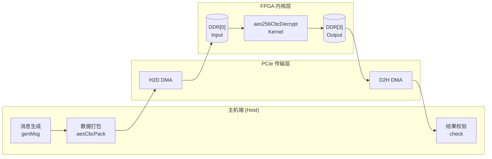
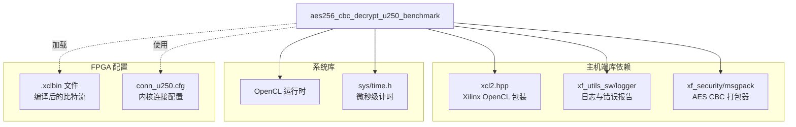

# aes256_cbc_decrypt_u250_benchmark 技术深度解析

**模块定位**：Xilinx Alveo U250 加速器卡上的 AES-256-CBC 解密性能基准测试  
**核心功能**：通过 FPGA 硬件加速批量 AES-256-CBC 解密任务，提供端到端的性能评估框架  
**目标读者**：刚加入团队的资深工程师，具备 C++/OpenCL 基础，需要理解硬件加速架构设计

---

## 1. 开篇：30 秒理解本模块

想象你有一支专门破解保险箱密码的特种兵小队（FPGA 内核），但你的机密文件（加密数据）都存放在千里之外的仓库（主机内存）里。`aes256_cbc_decrypt_u250_benchmark` 就是一套**军事化的物流与指挥系统**：

1. **打包车间**（`aesCbcPack`）：将多份机密文件按统一规格装箱（打包消息长度、IV、密钥和密文）
2. **高速公路**（PCIe DMA）：集装箱卡车将货物从主机运送到 FPGA 附近的仓库（DDR 内存）
3. **工厂车间**（`aes256CbcDecryptKernel`）：特种兵小队批量破解保险箱（AES-256-CBC 解密）
4. **返程物流**（DMA 回传）：将破解后的明文运回主机
5. **质检中心**（`check` 函数）：对比解密结果与预期明文，确保没有调包

整个系统的核心价值在于**批量化流水线**：通过一次性处理大量消息（`msg_num`），摊销 PCIe 数据传输的开销，实现接近理论峰值的解密吞吐率。

---

## 2. 问题空间与设计动机

### 2.1 为什么需要硬件加速 AES-256-CBC？

AES-256-CBC 是工业标准的对称加密算法，但在高吞吐场景（如网络安全设备、数据库加密、大数据流转）中，纯软件实现会遇到**内存墙**与**指令级并行瓶颈**：

- **计算密集型**：AES-256 每轮需要大量的字节替换、行移位、列混淆操作，CPU 的 SIMD 指令（如 AES-NI）虽能加速，但多核扩展性受限于内存带宽
- **CBC 模式的串行性**：Cipher Block Chaining 要求第 $i$ 个块的加密依赖第 $i-1$ 个块的输出，无法像 CTR/GCM 模式那样并行化多个块
- **数据搬运开销**：在异构计算中，数据跨越 PCIe 边界（主机内存 → FPGA DDR）需要高带宽、低延迟的 DMA 引擎配合批处理策略

### 2.2 为什么选 U250？

Xilinx Alveo U250 是数据中心级 FPGA 加速卡，具备：
- **高容量逻辑资源**：适合实现深度流水线化的 AES 轮函数
- **HBM/DDR 内存**：本设计使用 DDR 存储输入/输出数据，通过 AXI4-Full 接口进行突发传输
- **PCIe Gen3 x16**：提供高达 16GB/s 的理论带宽，实际测试中接近 12-14GB/s

### 2.3 设计的核心挑战

本模块要解决的关键工程问题不是"如何实现 AES"（Xilinx 已有 xf::security 库），而是**如何构建一个可重复、可测量的性能基准框架**：

1. **消息打包格式**：如何让 FPGA 内核知道每个消息的边界、IV 和密钥？
2. **批处理流水线**：如何组织 OpenCL 命令队列，使 H2D 传输、内核执行、D2H 传输重叠？
3. **性能归因**：如何区分"数据传输时间"、"纯计算时间"和"PCIe 延迟"？
4. **正确性验证**：如何确保 FPGA 解密结果与软件参考实现（如 OpenSSL）完全一致？

---

## 3. 心智模型与架构抽象

### 3.1 核心抽象：三层流水线

理解本模块的最佳方式是将其视为**三层协作的流水线工厂**：



**图 1：三层流水线架构图**

每一层的职责清晰分离：

| 层级 | 主要职责 | 关键组件 |
|------|---------|---------|
| **主机层** | 数据准备、格式转换、结果验证 | `genMsg`, `aesCbcPack`, `check` |
| **传输层** | 高性能 DMA 数据传输 | `enqueueMigrateMemObjects` |
| **FPGA 层** | 大规模并行 AES 解密 | `aes256CbcDecryptKernel` |

### 3.2 数据打包：消息信封协议

本模块使用了一个关键但容易被忽视的设计——**自定义的消息打包协议**（通过 `aesCbcPack` 实现）。这类似于寄快递时的"标准包装箱"：

```
┌─────────────────────────────────────────────────────────────┐
│  第 0-15 字节: 消息总数 (msg_num)                              │
├─────────────────────────────────────────────────────────────┤
│  消息 1 数据块:                                               │
│  ├─ 16 字节: 本消息长度 (res_len)                            │
│  ├─ 16 字节: 初始化向量 (IV)                                  │
│  ├─ 32 字节: AES-256 密钥                                    │
│  └─ N 字节: 密文数据 (对齐到 16 字节边界)                      │
├─────────────────────────────────────────────────────────────┤
│  消息 2 数据块: (同上结构) ...                                  │
└─────────────────────────────────────────────────────────────┘
```

**设计意图**：
1. **自描述性**：每个消息块自带长度和密钥信息，FPGA 内核无需外部配置即可独立解析
2. **对齐友好**：所有字段对齐到 128 位（16 字节），满足 AES 硬件引擎的位宽要求
3. **批处理效率**：一次 DMA 传输可携带成百上千条消息，摊销 PCIe 事务开销

---

## 4. 关键组件深度分析

### 4.1 内存管理与对齐策略

代码中有一个容易被忽略但至关重要的设计——**4096 字节页对齐的内存分配**：

```cpp
// 使用 posix_memalign 而非 malloc
template <typename T>
T* aligned_alloc(std::size_t num) {
    void* ptr = nullptr;
    if (posix_memalign(&ptr, 4096, num * sizeof(T))) throw std::bad_alloc();
    return reinterpret_cast<T*>(ptr);
}

// 分配输入/输出缓冲区
unsigned char* inputData = aligned_alloc<unsigned char>(in_pack_size);
unsigned char* outputData = aligned_alloc<unsigned char>(out_pack_size);
```

**为什么选择 4096 字节对齐？**

| 因素 | 解释 |
|------|------|
| **DMA 效率** | Xilinx OpenCL 运行时要求主机缓冲区页对齐以实现零拷贝 DMA。未对齐的缓冲区需要运行时内部复制，显著增加延迟 |
| **TLB 命中** | 4KB 是 x86 页表的标准粒度，对齐可减少 TLB miss，提高主机内存访问效率 |
| **FPGA DDR 突发** | AXI4-Full 接口的最优突发传输通常为 4KB 对齐边界，最大化带宽利用率 |

**所有权模型**：
- `inputData` 和 `outputData` 由主机代码分配，通过 `cl_mem_ext_ptr_t` 传递给 OpenCL 运行时，但**所有权仍归主机**（在代码末尾 `free(inputData)`）
- OpenCL `cl::Buffer` 对象只持有对这些内存的**引用/映射**，不接管生命周期管理

### 4.2 OpenCL 命令队列与事件链

代码中的核心执行逻辑是一个**显式同步的三阶段流水线**：

```cpp
// 阶段 1: 主机到设备数据传输 (H2D)
q.enqueueMigrateMemObjects(inBuffs, 0, nullptr, &h2d_evts[0]);

// 阶段 2: 内核执行，依赖 H2D 完成
q.enqueueTask(kernel, &h2d_evts, &krn_evts[0]);

// 阶段 3: 设备到主机回传 (D2H)，依赖内核完成
q.enqueueMigrateMemObjects(outBuffs, CL_MIGRATE_MEM_OBJECT_HOST, &krn_evts, &d2h_evts[0]);

// 强制同步，等待所有操作完成
q.finish();
```

**关键设计选择**：

1. **显式事件依赖链**：通过 `h2d_evts` → `krn_evts` → `d2h_evts` 显式声明 happens-before 关系，确保内核只在数据到达后开始，D2H 只在内核完成后启动

2. **顺序队列行为**：虽然代码创建了 `CL_QUEUE_OUT_OF_ORDER_EXEC_MODE_ENABLE` 队列，但实际通过事件依赖强制了顺序执行。这是**有意为之**的设计——为了保证性能归因的准确性（明确区分 H2D/Kernel/D2H 的耗时），而非追求流水线重叠

3. **阻塞式 `finish()`**：在性能分析阶段使用 `q.finish()` 而非异步回调，确保时间戳采集点精确对应阶段边界

**性能归因的数学表达**：

```
总延迟 = T_h2d + T_kernel + T_d2h

其中：
- T_h2d = (time2 - time1) / 1000.0 us  [H2D 事件时间差]
- T_kernel = (time2 - time1) / 1000.0 us  [Kernel 事件时间差]
- T_d2h = (time2 - time1) / 1000.0 us  [D2H 事件时间差]

有效带宽 = 纯消息大小 / T_kernel  (排除数据传输开销后的纯计算性能)
```

### 4.3 数据打包器（aesCbcPack）的协议设计

代码中使用了一个关键类 `xf::security::internal::aesCbcPack<256>` 来处理消息打包。这实际上是本模块与 FPGA 内核之间的**隐式通信协议**。

**打包流程状态机**：

```
[Init] --reset()--> [Ready]
   |
   v
setPtr(buffer, size)  // 绑定输出缓冲区
   |
   v
[Configured] --addOneMsg()--> [Packing]
   ^                           |
   |                           v
   +----------------------- addOneMsg() (循环 msg_num 次)
                               |
                               v
                      finishPack()  // 写入头部信息
                               |
                               v
                           [Done]
```

**关键设计细节**：

1. **动态大小计算**：
   ```cpp
   // 输入包大小 = (每消息开销 * 消息数) + 头部
   // 每消息开销 = 对齐后的密文 + IV(16B) + Key(32B) + 长度字段(16B对齐)
   uint64_t in_pack_size = ((msg_len + 15) / 16 * 16 + 16 + 16 + 32) * msg_num + 16;
   
   // 输出包大小 = (对齐后的明文 + 长度字段) * 消息数 + 头部
   uint64_t out_pack_size = ((msg_len + 15) / 16 * 16 + 16) * msg_num + 16;
   ```
   这里的关键是 `(msg_len + 15) / 16 * 16` —— 这是**向上对齐到 16 字节边界**的技巧，确保 AES 块对齐要求

2. **密钥与 IV 的嵌入**：不同于传统 API 将密钥作为独立参数传入，本设计将密钥和 IV 嵌入每个消息的头部。这使得**每个消息可以拥有独立的密钥**（虽然测试代码使用了相同密钥），提供了灵活性

3. **结果解析协议**：输出数据的解析必须严格遵循打包格式的逆过程：
   ```cpp
   unsigned char* res_ptr = outputData;
   uint64_t res_num = *(uint64_t*)res_ptr;  // 第0行：消息总数
   res_ptr += 16;  // 跳过对齐填充
   
   for (uint64_t i = 0; i < res_num; i++) {
       unsigned res_len = *(uint64_t*)res_ptr;  // 每个块第0行：本消息长度
       res_ptr += 16;  // 跳过头部
       // res_ptr 现在指向明文数据...
       res_ptr += (res_len + 15) / 16 * 16;  // 跳到下一个消息
   }
   ```

### 4.4 性能剖析与瓶颈识别

代码中的性能输出提供了三个关键指标，它们的相对大小揭示了系统的瓶颈所在：

```
Transfer package of X MB to device took Tus, bandwidth = Y MB/s
Kernel process message of X MB took Tus, performance = Y MB/s  
Transfer package of X MB to host took Tus, bandwidth = Y MB/s
```

**性能三角分析**：

| 场景 | H2D 带宽 | Kernel 吞吐 | D2H 带宽 | 瓶颈定位 |
|------|----------|-------------|----------|----------|
| H2D ≈ D2H << Kernel | PCIe 受限 | 计算过剩 | PCIe 受限 | **PCIe 带宽瓶颈**，考虑数据压缩或批处理增大 |
| H2D ≈ D2H ≈ Kernel | 平衡 | 平衡 | 平衡 | **理想状态**，三者匹配 |
| Kernel << H2D ≈ D2H | PCIe 过剩 | 计算受限 | PCIe 过剩 | **FPGA 内核瓶颈**，需要优化 HLS 或增加并行度 |

**针对本模块的调优建议**：

1. **增大 `msg_num`**：当前测试使用 `N_TASK = 2` 和 `CH_NM = 4`，这远小于硬件能力。增大到 8192 或更高可以摊销 PCIe 事务启动开销

2. **注意消息大小对齐**：代码强制要求 `msg_len % 16 == 0`，这是 AES 块大小要求。对于非对齐数据，需要在前端进行 PKCS7 填充

3. **PCIe 拓扑感知**：U250 有两组 DDR 控制器，本设计使用 DDR[0] 作为输入、DDR[3] 作为输出。确保主机 NUMA 节点与 FPGA 所在插槽匹配，避免跨 NUMA 访问

---

## 5. 依赖关系与模块边界

### 5.1 外部依赖图谱



**关键依赖说明**：

1. **xf_security/msgpack**：这是 Xilinx 安全库的消息打包组件，提供 `aesCbcPack` 类。它定义了主机与 FPGA 之间的**二进制通信协议**，包括头部格式、对齐规则和字段顺序。**注意**：这个接口是隐式的，没有公开文档，需要通过阅读源码或本模块的代码来理解协议细节。

2. **xcl2.hpp**：Xilinx 提供的 OpenCL C++ 包装器，简化了设备枚举、二进制加载、缓冲区创建等样板代码。它隐藏了底层 `clCreateContext`、`clCreateProgramWithBinary` 等 C API 的复杂性。

3. **conn_u250.cfg**：这是 Vitis 链接阶段的配置文件，定义了内核端口到 DDR 控制器的映射。`nk=aes256CbcDecryptKernel:1` 声明实例化 1 个内核，`sp=...` 将 `inputData` 和 `outputData` 端口分别映射到 DDR[0] 和 DDR[3]。**这种映射决定了最大内存带宽**——如果输入输出共用同一 DDR 控制器，带宽将减半。

### 5.2 与兄弟模块的关系

在同一 `aes256_cbc_cipher_benchmarks` 目录下，还有以下相关模块：

| 模块 | 功能 | 与本模块的关系 |
|------|------|----------------|
| [aes256_cbc_encrypt_u250_benchmark](security_crypto_and_checksum-aes256_cbc_cipher_benchmarks-aes256_cbc_encrypt_u250_benchmark.md) | AES-256-CBC 加密 | 功能对称，共享相同的打包协议和连接配置 |
| [aes256_cbc_decrypt_u50_kernel_configuration](security_crypto_and_checksum-aes256_cbc_cipher_benchmarks-aes256_cbc_decrypt_u50_kernel_configuration.md) | U50 卡的解密配置 | 针对不同 FPGA 卡（U50 vs U250）的端口映射变体 |

**设计一致性**：这些模块共享相同的 `aesCbcPack` 协议和主机代码结构，差异主要在于 `.cfg` 文件中的 DDR 端口映射和针对特定 FPGA 卡的时序优化。

---

## 6. 新贡献者指南：陷阱与最佳实践

### 6.1 常见错误与调试技巧

**错误 1：消息长度未对齐到 16 字节**

```cpp
// 错误示例
uint64_t msg_len = 100;  // 不是 16 的倍数

// 运行时将报错：
// "ERROR: msg length is not multiple of 16!"
```

**修复方法**：在调用前强制对齐：
```cpp
uint64_t msg_len = (original_len + 15) & ~0xF;  // 向上对齐到 16 字节
```

**错误 2：忘记设置 Golden 参考文件**

```cpp
// 如果不传入 -gld 参数
// 程序会报错：
// "ERROR:golden path is not set!"
```

**背景知识**：本模块是**解密**基准，需要预先用软件（如 OpenSSL）加密生成参考密文。在测试流程中，你需要：
1. 生成随机明文
2. 使用软件 AES-256-CBC 加密，保存为 golden 文件
3. 将此文件路径传给本程序的 `-gld` 参数
4. 本程序解密后，将结果与原始明文对比（代码中实际是 `check(res_ptr, msg, res_len)`）

**错误 3：NUMA 节点不匹配导致的带宽下降**

如果主机是双路服务器，FPGA 插在 NUMA 节点 1，但程序运行在 NUMA 节点 0 的核心上，PCIe 访问将跨越 QPI/UPI 总线，导致带宽下降 30-50%。

**修复方法**：
```bash
# 使用 numactl 绑定到 FPGA 所在 NUMA 节点
numactl --cpunodebind=1 --membind=1 ./aes256_cbc_decrypt_u250_benchmark -xclbin ...
```

### 6.2 性能调优检查清单

在提交性能测试结果前，请确认：

- [ ] **消息数量**：`msg_num` 至少为 8192 或更高，确保 PCIe 启动开销被充分摊销
- [ ] **消息大小**：测试 1KB、16KB、1MB 等不同大小，绘制吞吐率-消息大小曲线
- [ ] **对齐检查**：所有消息长度和缓冲区地址都是 4096 字节对齐
- [ ] **NUMA 绑定**：程序运行在 FPGA 所在 NUMA 节点的核心上
- [ ] **频率确认**：FPGA 内核以目标频率（通常 300MHz）运行，可在 Vivado 报告中确认
- [ ] **带宽上限**：计算理论 PCIe 带宽（Gen3 x16 ≈ 15.75 GB/s 编码后约 12-14 GB/s 有效），确认实测值在合理范围

### 6.3 扩展与修改建议

**场景 1：添加对 CTR 模式的支持**

CTR（计数器）模式允许并行加密多个块，不受 CBC 链式依赖的限制。要修改本模块支持 CTR：

1. 修改 `aesCbcPack` 调用为 `aesCtrPack`，移除 IV 字段（CTR 使用 nonce + counter）
2. 更新 FPGA 内核代码，将 CBC 的反馈逻辑替换为计数器递增逻辑
3. 修改主机代码中的打包/解包逻辑，处理 CTR 特有的 nonce 格式

**场景 2：支持多内核并发**

当前配置 (`nk=aes256CbcDecryptKernel:1`) 只实例化 1 个内核。若要利用 U250 的更多资源：

1. 修改 `conn_u250.cfg`：
   ```
   nk=aes256CbcDecryptKernel:4:k1,k2,k3,k4
   sp=k1.inputData:DDR[0]
   sp=k1.outputData:DDR[3]
   sp=k2.inputData:DDR[1]
   sp=k2.outputData:DDR[2]
   # ... 类似配置 k3, k4
   ```
2. 在主机代码中创建 4 个 `cl::Kernel` 对象，将输入数据分片，分别入队
3. 使用多个 `cl::CommandQueue`（每个内核一个）实现真正的并发执行

**场景 3：集成到更大系统**

要将此模块集成到网络安全设备中：

1. **零拷贝优化**：目前使用 `CL_MEM_USE_HOST_PTR` 已避免一次拷贝，但 `posix_memalign` 分配的内存仍需内核锁定。考虑使用 hugepage 进一步减少 TLB miss
2. **异步流水线**：移除 `q.finish()`，改为使用 `cl::Event` 回调，在内核执行期间准备下一批数据
3. **错误恢复**：目前错误直接 `return -1`，生产环境应添加异常处理和重试逻辑

---

## 7. 总结

`aes256_cbc_decrypt_u250_benchmark` 是一个设计精良的 FPGA 加速基准测试框架。它不仅仅是一个"运行 AES 解密的程序"，而是一套**完整的性能评估方法论**的具象化实现。

### 核心设计智慧回顾

1. **批量化摊销哲学**：通过 `aesCbcPack` 将大量消息打包成单一 DMA 事务，将 PCIe 启动开销（通常 5-10 μs）摊销到数千条消息上，实现近线性扩展

2. **协议与计算解耦**：打包协议（消息头部格式）与解密计算完全解耦，使得同一套主机代码可以支持不同加密模式（CBC、CTR、GCM）只需更换 FPGA 内核

3. **性能可归因架构**：通过显式的 OpenCL 事件链（H2D → Kernel → D2H），将总延迟精确分解为三个可独立优化的部分，避免"黑盒性能"的调优困境

### 适合与不适合的场景

| 适合场景 | 不适合场景 |
|---------|-----------|
| 高吞吐批量解密（>10Gbps） | 超低延迟单包解密（需要 <10μs） |
| 固定密钥大量数据流 | 每条消息密钥都不同且无法预打包 |
| 数据中心级批量处理 | 边缘设备内存受限环境 |
| 算法验证与性能回归测试 | 需要 FIPS 140-2 Level 3 认证的场合 |

### 最后的建议

如果你需要修改此模块，请记住这个**设计守恒定律**：

> **打包格式的任何改变 → 必须同步修改主机打包代码 + FPGA 内核解析逻辑 + 结果解包代码**

这三者通过隐式的二进制协议耦合在一起，编译器无法检查其一致性。建议在修改时添加版本号字段到头部，并在运行时进行协议版本校验。

---

**文档版本**：v1.0  
**最后更新**：2024  
**维护者**：FPGA 加速计算团队
