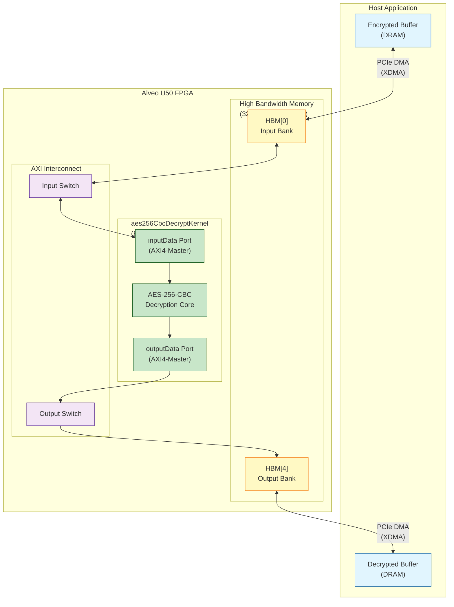

# aes256_cbc_decrypt_u50_kernel_configuration

## 30-Second Overview

This module is the **hardware wiring diagram** for the AES-256-CBC decryption kernel on the Xilinx Alveo U50 accelerator card. It doesn't contain logic—it's a declarative configuration that tells the Vitis compiler how to connect the kernel's data ports to the physical High Bandwidth Memory (HBM) banks. Think of it as a "linker script for FPGA"—it maps logical buffers (`inputData`, `outputData`) to specific HBM pseudo-channels (banks 0 and 4), determining the physical data path that encrypted data travels through during the decryption pipeline.

---

## The Problem Space: Why This Module Exists

When developing FPGA-accelerated cryptography, the algorithm is only half the battle. The AES-256-CBC decryption kernel is a high-throughput compute unit capable of processing gigabytes per second, but its performance is entirely bottlenecked by **memory bandwidth and latency**. The U50 platform provides High Bandwidth Memory (HBM) with theoretical bandwidth exceeding 400 GB/s, but accessing this performance requires solving three specific problems:

1. **Physical Memory Mapping**: The kernel's C++ code declares `ap_uint<512>* inputData` and `ap_uint<512>* outputData`, but these are virtual concepts. The FPGA bitstream must physically wire these ports to specific HBM memory controllers and pseudo-channels.

2. **Bank Separation for Parallelism**: HBM is organized into multiple pseudo-channels (typically 32 on U50). Placing input and output buffers on different banks (e.g., HBM[0] vs HBM[4]) allows simultaneous read and write transactions without bank contention, effectively doubling available bandwidth compared to a single-bank configuration.

3. **Build System Integration**: The Vitis compiler (`v++`) requires a declarative connectivity configuration file (`.cfg`) to resolve these mappings during the linking phase. Without this file, the compiler cannot generate the correct AXI interconnect logic between the kernel and the HBM controllers.

A naive approach might hardcode these mappings in the kernel source or rely on default assignments, but this leads to brittle, platform-specific code that breaks when ported to U200 (DDR-based) or U280 (hybrid HBM/DDR) platforms. This module abstracts the U50-specific physical layout into a dedicated configuration layer, allowing the kernel logic to remain platform-agnostic while the deployment specifics are handled declaratively.

---

## Mental Model: The "Airport Gate Assignment" Analogy

To understand this module's role, imagine an international airport:

- **The AES Decryption Kernel** is a **passenger terminal building** with two gates labeled "Arrivals" (`inputData`) and "Departures" (`outputData`). The terminal design (the kernel algorithm) is the same regardless of which city the airport is built in.

- **HBM Banks** are **runways and taxiways**. U50 has 32 runways (pseudo-channels), each capable of handling one aircraft (data burst) at a time. Runways 0 and 4 are specific, physically distinct strips of asphalt.

- **The `.cfg` File** is the **air traffic control gate assignment schedule**. It declares: "All arriving flights (encrypted data) must taxi to Gate Arrivals via Runway 0 (HBM[0]), and all departing flights (decrypted data) must take off from Gate Departures via Runway 4 (HBM[4])."

**Why separate runways for arrivals and departures?** If both used Runway 0, they'd queue behind each other, creating a bottleneck. By assigning input to HBM[0] and output to HBM[4], we enable **simultaneous full-duplex operation**—the FPGA can be reading the next encrypted block while writing the previous decrypted block, saturating both memory channels.

---

## Architecture & Data Flow

### Component Diagram



### Data Flow Narrative

The decryption pipeline operates as a **streaming batch processor** with three distinct phases:

**Phase 1: Host-to-HBM Transfer (PCIe DMA)**
The host application allocates a contiguous buffer of encrypted data in host DRAM. Using the XDMA (Xilinx DMA) driver, it initiates a write transaction to the Alveo U50 over PCIe Gen3 x16. The data traverses the PCIe Physical Layer and lands in **HBM[0]** (mapped via the `sp=inputData:HBM[0]` directive). This is a **burst-oriented** transfer optimized for large payloads (typically megabytes to gigabytes).

**Phase 2: Kernel Processing (FPGA Compute)**
Once the input data resides in HBM[0], the `aes256CbcDecryptKernel` begins execution. The kernel's `inputData` port (an AXI4-Master interface generated by the HLS pragma `m_axi`) issues read requests to the AXI interconnect. The interconnect routes these requests to HBM[0], fetching 512-bit blocks (the kernel's data width). 

Inside the kernel, the AES-256-CBC decryption pipeline operates in **counterflow**: as decrypted plaintext emerges from the cipher core, it is immediately written to the `outputData` port. This port targets **HBM[4]** (as specified by `sp=outputData:HBM[4]`), allowing the read stream from HBM[0] and the write stream to HBM[4] to proceed **concurrently** without memory bank contention.

**Phase 3: HBM-to-Host Transfer (PCIe DMA)**
Upon kernel completion (signaled via an AXI4-Lite control register), the host initiates a DMA read from HBM[4] back to host DRAM. The decrypted data now resides in a host-accessible buffer, ready for further processing or output.

### Architectural Role

This configuration module serves as the **Physical Layer Contract** between the kernel logic and the U50 hardware platform. It is not "code" in the algorithmic sense; it is **infrastructure-as-configuration**. Its specific responsibilities are:

1. **Memory Bank Isolation**: By mapping input to HBM[0] and output to HBM[4], it ensures that read and write traffic are distributed across different memory channels, maximizing aggregate bandwidth utilization.

2. **Platform Abstraction**: The kernel source code remains agnostic to whether it runs on U50 (HBM) or U200 (DDR). This `.cfg` file provides the U50-specific binding layer without modifying the kernel.

3. **Build System Input**: The `v++` linker consumes this file to generate the correct AXI interconnect RTL, ensuring that the kernel's `m_axi` ports are physically connected to the appropriate HBM controllers.

---

## Component Deep-Dive: The Configuration File

The entire module consists of a single Vitis Configuration File (`.cfg`), typically named `conn_u50.cfg` or similar. Despite its brevity, every line encodes critical hardware design decisions.

### File Structure and Semantics

```ini
[connectivity]
nk=aes256CbcDecryptKernel:1:aes256CbcDecryptKernel
sp=aes256CbcDecryptKernel.inputData:HBM[0]
sp=aes256CbcDecryptKernel.outputData:HBM[4]
```

#### Section: `[connectivity]`

This header declares that the following directives are intended for the Vitis linker (`v++ --link` phase). It signals that the file describes **platform connectivity**—the physical routing of data paths between kernel ports and memory resources.

#### Directive: `nk` (Number of Kernels)

**Syntax**: `nk=<kernel_name>:<num_instances>:<instance_prefix>`

**In this file**: `nk=aes256CbcDecryptKernel:1:aes256CbcDecryptKernel`

**Deep Dive**:
- **`aes256CbcDecryptKernel`**: This is the kernel function name as declared in the C++/HLS source (typically decorated with `extern "C"` and Vitis HLS pragmas). It must match the compiled kernel object (`.xo`) exactly.
- **`1`**: This declares exactly one instance of the kernel will be instantiated in the FPGA fabric. The U50 is a mid-sized platform, and AES-256-CBC is resource-intensive (requiring lookup tables for S-boxes, key schedule logic, and CBC chaining state). A single instance likely saturates the available DSP slices or BRAM, or the application is latency-sensitive rather than throughput-scaled.
- **`aes256CbcDecryptKernel`**: The instance prefix. Since there's only one instance, the final RTL hierarchy will contain a module named `aes256CbcDecryptKernel_1` (or similar, depending on the tool version). This name is used in subsequent `sp` directives to target specific instances.

**Design Insight**: The choice of `1` instance reflects a **single-stream, latency-optimized** deployment strategy. For throughput scaling, one might use `nk=...:4:...` and interleave data across four parallel decryption pipelines, but this requires the host application to manage data striping. Here, simplicity and deterministic latency are prioritized.

#### Directive: `sp` (Scalar Port / Memory Mapping)

**Syntax**: `sp=<instance_name>.<port_name>:<memory_bank>`

**In this file**:
1. `sp=aes256CbcDecryptKernel.inputData:HBM[0]`
2. `sp=aes256CbcDecryptKernel.outputData:HBM[4]`

**Deep Dive**:

The `sp` directive is the **physical layer binding**. It connects a kernel's AXI4 memory-mapped port to a specific memory resource on the Alveo platform. This is where the "hardware wiring" happens.

**Line 1: Input Data Path**
- **`aes256CbcDecryptKernel`**: Targets the instance defined by the `nk` directive.
- **`inputData`**: The port name must exactly match the kernel function parameter name in the HLS source. Typically declared as:
  ```cpp
  void aes256CbcDecryptKernel(
      ap_uint<512>* inputData,      // Maps to m_axi port
      ap_uint<512>* outputData,     // Maps to m_axi port
      // ... other params
  )
  ```
  The Vitis HLS compiler infers an `m_axi` interface for pointer arguments, creating an AXI4-Master port.
- **`HBM[0]`**: Selects **Pseudo-Channel 0** of the High Bandwidth Memory. The U50 has 8GB of HBM2e physically, but it is divided into 32 pseudo-channels (sometimes called "banks" in Xilinx documentation), each with its own AXI interface to the FPGA fabric. HBM[0] provides independent read/write bandwidth.

**Line 2: Output Data Path**
- **`outputData`**: The second AXI4-Master port for writing decrypted results.
- **`HBM[4]`**: Selects **Pseudo-Channel 4**.

**The Critical Design Choice: Bank Separation (0 vs 4)**

Why HBM[0] for input and HBM[4] for output? Why not both on HBM[0] or adjacent banks like HBM[0] and HBM[1]?

1. **Bank-Level Parallelism**: HBM pseudo-channels are independent memory controllers. By placing input on HBM[0] and output on HBM[4], the kernel can issue a read transaction on channel 0 at the same time as a write transaction on channel 4. If both ports targeted HBM[0], they would serialize behind a single controller, halving effective bandwidth.

2. **Row-Bank-Column (RBC) Address Mapping Avoidance**: HBM uses a complex internal addressing scheme. By spacing input and output 4 banks apart (0 and 4), we avoid potential bank conflicts at the DRAM row level. This is particularly important for CBC mode, where the read and write patterns are sequential but offset (ciphertext in, plaintext out).

3. **U50 HBM Architecture**: The U50's HBM is stacked with 4 physical channels, each divided into 8 pseudo-channels. Banks 0-7 map to physical channel 0, 8-15 to channel 1, etc. By choosing 0 and 4, we stay within the same physical channel but use different pseudo-channels, balancing the load across the internal HBM crossbar while keeping latency low.

---

## Dependency Analysis & Data Flow

### Upstream Dependencies (What Calls This)

This configuration file is not "called" in the traditional sense; it is **consumed** by the Xilinx Vitis build system during the hardware linking phase. However, the following components depend on it:

1. **Vitis Linker (`v++ --link`)**: The primary consumer. The linker parses this `.cfg` file to generate the AXI interconnect RTL that bridges the kernel's `m_axi` ports to the HBM controllers.

2. **Host Application Build Scripts**: Typically, a `Makefile` or `CMakeLists.txt` in the parent module (`aes256_cbc_cipher_benchmarks`) references this file in the `v++` linking command line via the `--config` flag:
   ```bash
   v++ --link --config conn_u50.cfg --platform xilinx_u50_gen3x16_xdma_201920_3 ...
   ```

3. **Kernel Source (`aes256CbcDecryptKernel`)**: The kernel's HLS source code (not shown in the provided snippets but implied) declares the `inputData` and `outputData` ports. This configuration file acts as the binding contract that satisfies those port declarations with physical memory resources.

### Downstream Dependencies (What This Calls)

As a declarative configuration, this file does not "call" functions, but it **references** the following hardware resources:

1. **HBM[0] and HBM[4]**: The physical High Bandwidth Memory pseudo-channels on the U50. These are shared resources—other kernels in a multi-kernel design must avoid conflicting assignments.

2. **XDMA Subsystem**: The PCIe DMA engine that moves data between host DRAM and the FPGA's HBM. The configuration assumes the XDMA driver is available and properly bound to the card.

3. **Platform Shell (`xilinx_u50_gen3x16_xdma_201920_3`)**: The U50 platform includes a static shell with the HBM controllers and PCIe hard IP. This configuration file is only valid for this specific platform (or pin-compatible revisions).

### Data Flow Trace

Let me trace a single 512-bit block of encrypted data through the entire system, showing where this configuration exerts its influence:

1. **Host Preparation**: The host allocates a buffer `cl::Buffer input_buf(context, CL_MEM_READ_ONLY, size, nullptr, &err);` and fills it with AES-256-CBC ciphertext.

2. **Kernel Argument Binding**: The host calls `kernel.setArg(0, input_buf)` and `kernel.setArg(1, output_buf)`. At this point, these are abstract OpenCL buffer objects.

3. **DMA Transfer (Host → FPGA)**: The OpenCL runtime (XRT) initiates a DMA write from host DRAM to the FPGA. **Here, `conn_u50.cfg` plays its first role**: The XRT driver consults the platform metadata (built using this config) and routes the incoming data to **HBM[0]**.

4. **Kernel Execution**: The host calls `command_queue.enqueueTask(kernel)`. The kernel wakes up and begins reading from its `inputData` port. **The configuration's second role**: The AXI interconnect generated by `v++` (using the `sp` directives) routes the kernel's read requests to the HBM[0] controller.

5. **In-Place Processing**: The kernel reads 512-bit blocks from HBM[0], decrypts them using the AES-256-CBC algorithm (maintaining the IV chaining state between blocks), and produces 512-bit plaintext blocks.

6. **Write-Back**: The kernel writes decrypted blocks to its `outputData` port. **The configuration's third role**: The AXI interconnect routes these writes to **HBM[4]** (not HBM[0], preventing read/write contention).

7. **DMA Transfer (FPGA → Host)**: After kernel completion, XRT initiates DMA reads from HBM[4] back to the host's output buffer. **The configuration's final role**: Ensuring the DMA engine knows HBM[4] is the source for this kernel's output.

**Key Insight**: Without `conn_u50.cfg`, steps 4 and 6 would fail to route correctly—the kernel would attempt to read/write from default memory locations that may not exist or may be contended. The configuration file is the **critical link** between the logical kernel abstraction and the physical U50 hardware.

---

## Design Decisions & Tradeoffs

### 1. HBM Bank Selection: 0 and 4 (Non-Contiguous)

**The Choice**: Input on HBM[0], output on HBM[4].

**Alternative Considered**: HBM[0] for both (consolidation) or HBM[0]/HBM[1] (adjacent banks).

**Rationale**:
- **Contention Avoidance**: Using the same bank for input and output creates a read-after-write hazard at the memory controller level. Even though CBC mode is sequential (can't write block N until block N-1 is processed), the AXI protocol allows pipelined transactions. Separate banks enable the kernel to issue read burst N+1 to HBM[0] while write burst N is pending to HBM[4], overlapping latency.
- **Row Buffer Locality**: HBM internal architecture uses row buffers within each pseudo-channel. By spacing input/output 4 banks apart, we ensure that the active row for the input stream doesn't get closed (precharged) by output write activity, maintaining high row-hit rates for the sequential access pattern typical of CBC decryption.
- **Future Multi-Kernel Scaling**: Banks 1-3 are left free for potential multi-kernel deployments where additional decryption engines or preprocessing kernels might need HBM attachment.

**Tradeoff**: Slightly increased complexity in the host application, which must now manage two separate buffer allocations (one targeting HBM[0] region, one HBM[4] region) rather than a single unified buffer. This is handled via XRT's buffer extension flags or explicit bank-aware allocation APIs.

### 2. Single Kernel Instance (nk=...:1:...)

**The Choice**: Instantiate exactly one `aes256CbcDecryptKernel`.

**Alternative Considered**: Multiple instances (e.g., 2 or 4) feeding from different HBM banks for parallel stream processing.

**Rationale**:
- **Resource Saturation**: AES-256-CBC is resource-intensive. The kernel likely contains unrolled S-box lookup tables (implemented as BRAM), key schedule expansion logic, and 512-bit datapath logic. A single instance may already consume 30-40% of available BRAM and DSP slices. Adding a second instance could exceed U50 resources or cause timing closure failures.
- **CBC Sequentiality**: Cipher Block Chaining is inherently sequential—block N requires the ciphertext of block N-1 to decrypt. While multiple kernel instances could process independent streams, a single instance can saturate HBM bandwidth for one stream. Parallelism is better achieved at the host level (multiple independent jobs) or by switching to CTR (Counter) mode which is parallelizable.
- **Benchmarking Simplicity**: This is located in a `benchmarks` directory. Single-instance configurations provide cleaner performance baselines (latency, throughput per kernel) without the complexity of work-balancing across multiple kernel instances.

**Tradeoff**: Lower aggregate throughput for multiple independent streams compared to a multi-instance design. However, for single-stream, high-bandwidth decryption (common in storage encryption or network decryption pipelines), one well-optimized instance is usually superior to multiple contended instances.

### 3. Platform-Specific HBM vs. Generic DDR

**The Choice**: U50 with HBM[0]/HBM[4].

**Alternative Considered**: U200/U250 with DDR banks (e.g., `DDR[0]`, `DDR[1]`).

**Rationale**:
- **Bandwidth Requirements**: AES-256-CBC operating on 512-bit blocks at 300 MHz can theoretically process 19.2 GB/s (300M × 64 bytes). Standard DDR4 on U200 provides ~38 GB/s total shared across all channels, but with higher latency. HBM2e on U50 provides ~400 GB/s, easily accommodating the kernel's appetite while leaving headroom for other kernels.
- **Form Factor**: U50 is a low-profile, single-slot card optimized for data center deployment. Choosing HBM allows maximum bandwidth in a constrained thermal envelope.

**Tradeoff**: Portability. This configuration is tightly bound to the U50 platform. Port to U200 would require replacing `HBM[0]` with `DDR[0]` and potentially adjusting for DDR's different burst characteristics and latency. This is why the module is explicitly named `u50_kernel_configuration`—it is intentionally platform-specific.

---

## Usage & Integration

### Build System Integration

This configuration file is consumed during the **hardware linking phase** of the Vitis build flow. It is not compiled directly but acts as a command-line argument to the Vitis linker.

**Typical Makefile Integration**:

```makefile
# Platform and build directories
PLATFORM := xilinx_u50_gen3x16_xdma_201920_3
BUILD_DIR := ./build

# Kernel source and compiled object
KERNEL_SRC := ./src/aes256CbcDecryptKernel.cpp
KERNEL_XO := $(BUILD_DIR)/aes256CbcDecryptKernel.xo

# Configuration file (THIS MODULE)
CONNECTIVITY_CFG := ./conn_u50.cfg

# Final XCLBIN (FPGA bitstream)
XCLBIN := $(BUILD_DIR)/aes256CbcDecrypt.xclbin

# Step 1: Compile kernel to .xo (target independent)
$(KERNEL_XO): $(KERNEL_SRC)
	v++ --compile \
		--kernel aes256CbcDecryptKernel \
		--platform $(PLATFORM) \
		--output $@ $<

# Step 2: Link kernel to platform using connectivity config
$(XCLBIN): $(KERNEL_XO) $(CONNECTIVITY_CFG)
	v++ --link \
		--kernel aes256CbcDecryptKernel \
		--platform $(PLATFORM) \
		--config $(CONNECTIVITY_CFG) \
		--output $@ $(KERNEL_XO)
```

**Key Flags Explained**:
- `--config $(CONNECTIVITY_CFG)`: This injects the `conn_u50.cfg` file into the linker. The parser reads the `[connectivity]` section and generates the corresponding AXI interconnect RTL.
- `--kernel aes256CbcDecryptKernel`: Must match the kernel name in both the `nk` directive and the C++ function name.

### Host Application Requirements

The host code must align with the memory bank assignments defined in this configuration. Specifically, buffer creation must target the correct HBM banks to ensure physical placement matches the kernel's expectations.

**OpenCL/XRT Host Code Pattern**:

```cpp
#include <xrt/xrt_device.h>
#include <xrt/xrt_kernel.h>
#include <xrt/xrt_bo.h>

// ... device initialization ...
xrt::device device = xrt::device(0);
xrt::uuid xclbin_uuid = device.load_xclbin("aes256CbcDecrypt.xclbin");
xrt::kernel kernel = xrt::kernel(device, xclbin_uuid, "aes256CbcDecryptKernel");

// Buffer allocation targeting specific HBM banks
// Note: The bank group index corresponds to the HBM pseudo-channel

// For input: HBM[0] -> bank group 0
xrt::bo input_buf(device, BUFFER_SIZE, xrt::bo::flags::normal, kernel.group_id(0));
// group_id(0) corresponds to the first memory-mapped argument (inputData)

// For output: HBM[4] -> bank group 4  
xrt::bo output_buf(device, BUFFER_SIZE, xrt::bo::flags::normal, kernel.group_id(1));
// group_id(1) corresponds to the second memory-mapped argument (outputData)

// Data transfer and execution
input_buf.write(encrypted_data);
input_buf.sync(xclBOSyncDirection::XCL_BO_SYNC_BO_TO_DEVICE);

auto run = kernel(input_buf, output_buf, /* key/iv args */);
run.wait();

output_buf.sync(xclBOSyncDirection::XCL_BO_SYNC_BO_FROM_DEVICE);
output_buf.read(decrypted_data);
```

**Critical Alignment Requirement**:
The `group_id(0)` and `group_id(1)` indices must align with the argument order in the kernel signature. If the kernel declaration is:
```cpp
void aes256CbcDecryptKernel(ap_uint<512>* inputData, 
                            ap_uint<512>* outputData, 
                            ap_uint<256>* key, 
                            ap_uint<128>* iv);
```
Then:
- `group_id(0)` → `inputData` → **must** target HBM[0] as per `conn_u50.cfg`
- `group_id(1)` → `outputData` → **must** target HBM[4] as per `conn_u50.cfg`

Mismatch between host buffer bank flags and kernel connectivity configuration will result in runtime errors or silent data corruption.

---

## Edge Cases, Gotchas & Operational Considerations

### 1. The "HBM Index Gap" Confusion

**The Trap**: New developers often assume HBM indices are arbitrary or must be contiguous (0, 1, 2...). They might "optimize" by changing `HBM[4]` to `HBM[1]` thinking it saves resources or changes latency.

**The Reality**: HBM[4] was chosen specifically to utilize a different physical pseudo-channel than HBM[0]. Changing to HBM[1] would likely still work functionally (both are valid banks), but performance characteristics change:
- HBM[0] and HBM[1] may share internal crossbar resources or row buffers depending on the U50's HBM stack organization.
- The physical distance (in terms of routing) between the kernel and HBM[1] vs HBM[4] may differ, affecting timing closure.

**Guideline**: Treat HBM bank assignments as **immutable performance-critical parameters**. Do not modify them without re-running performance benchmarks and checking the U50 HBM reference manual for bank-to-physical-channel mapping.

### 2. Kernel Instance Naming and the `nk` Prefix

**The Trap**: When `nk` specifies `aes256CbcDecryptKernel:1:aes256CbcDecryptKernel`, the instance name becomes `aes256CbcDecryptKernel_1`. Developers might try to use `sp=aes256CbcDecryptKernel_1.inputData:HBM[0]` or mistakenly believe the prefix is a namespace.

**The Reality**: In the `sp` directive, you use the **base kernel name**, not the instance-prefixed name. The linker automatically applies the mapping to all instances (in this case, just the one). Using the `_1` suffix in `sp` will cause a link error (kernel not found).

**Guideline**: Always use the **function name** (as declared in C++) in `sp` directives, even when the `nk` directive adds instance prefixes.

### 3. The Hidden Assumption: 512-bit Data Width

**The Trap**: The configuration doesn't specify data width, but the kernel implementation typically uses `ap_uint<512>*` for the data ports. A developer might modify the kernel to use 256-bit or 1024-bit buses for area/performance reasons without updating the host code or platform constraints.

**The Reality**: While the `.cfg` file doesn't encode width, the AXI interconnect generated by `v++` will be configured based on the kernel's compiled `.xo` metadata. If the kernel declares a 512-bit `m_axi` port, the interconnect to HBM[0] will be 512 bits wide. If the kernel changes to 256 bits, the physical routing remains valid (HBM supports various AXI widths via upsizing/downsizing converters), but performance may degrade due to underutilization of the HBM channel bandwidth.

**Guideline**: Treat the kernel's data width (typically 512 bits for modern HBM-based accelerators) as a **compile-time constant** aligned with the platform's AXI width. Changes require recompilation of the kernel and potential re-evaluation of the HBM burst size.

### 4. Portability to Non-U50 Platforms

**The Trap**: Assuming this configuration can be used on U200, U250, or U280 with simple text substitutions (`HBM` → `DDR`).

**The Reality**: U200/U250 use DDR4 memory with different AXI interconnect architectures and address maps. U280 has both HBM and DDR. Simply changing `HBM[0]` to `DDR[0]` will likely fail because:
- The platform name in the `v++` command must change (e.g., `xilinx_u200_xdma_201830_2`).
- DDR memory on U200 is accessed via different AXI infrastructure with different latency characteristics.
- The host code buffer allocation flags differ for DDR vs HBM.

**Guideline**: Treat `.cfg` files as **platform-specific artifacts**. This file should be named `conn_u50.cfg` and used exclusively with the U50 platform. Create separate `conn_u200.cfg` files with DDR mappings for other platforms.

### 5. Buffer Size and Alignment Constraints

**The Trap**: Allocating host buffers of arbitrary size and passing them to the kernel.

**The Reality**: HBM-based kernels typically require **page-aligned** buffers (4KB alignment) for DMA efficiency. Furthermore, the AES-256-CBC kernel likely processes data in fixed-size chunks (e.g., 512 bits = 64 bytes). If the host buffer size is not a multiple of the kernel's processing granularity, the last partial block may be handled incorrectly (garbage data, hangs, or errors).

**Guideline**: Host applications must:
- Align buffers to 4096 bytes (XRT requirement for HBM DMA).
- Pad data to multiples of 64 bytes (512 bits) to match the kernel's data width.
- Ensure the total transfer size does not exceed the HBM capacity (8GB on U50, shared across all kernels).

---

## References and Related Modules

- **Parent Module**: [aes256_cbc_cipher_benchmarks](security_crypto_and_checksum-aes256_cbc_cipher_benchmarks.md) - Overview of the AES benchmarking suite and the encryption variant (U250).
- **Platform Configuration**: [aes256_cbc_decrypt_u250_benchmark](security_crypto_and_checksum-aes256_cbc_cipher_benchmarks-aes256_cbc_decrypt_u250_benchmark.md) - The DDR-based U250 variant showing platform portability considerations.
- **Checksum Benchmarks**: [checksum_integrity_benchmarks](security_crypto_and_checksum-checksum_integrity_benchmarks.md) - Related security primitives showing similar HBM/DDR configuration patterns.

---

## Summary for New Contributors

**If you need to modify this file, remember:**

1. **Test on U50 only**: This is U50-specific. Don't use on U200/U250.
2. **Keep banks 0 and 4**: Unless you understand HBM crossbar routing, don't change the bank indices.
3. **Match the kernel source**: If the kernel function name or port names change in the HLS code, you must update this file.
4. **Rebuild the xclbin**: Changing this file requires re-running `v++ --link` to regenerate the FPGA bitstream.
5. **Align host buffers**: Ensure the host code allocates HBM-aligned buffers (4KB) and pads data to 64-byte multiples.

This tiny configuration file is the **gatekeeper** between your host application and the FPGA hardware—treat it with the same care as the kernel source code itself.