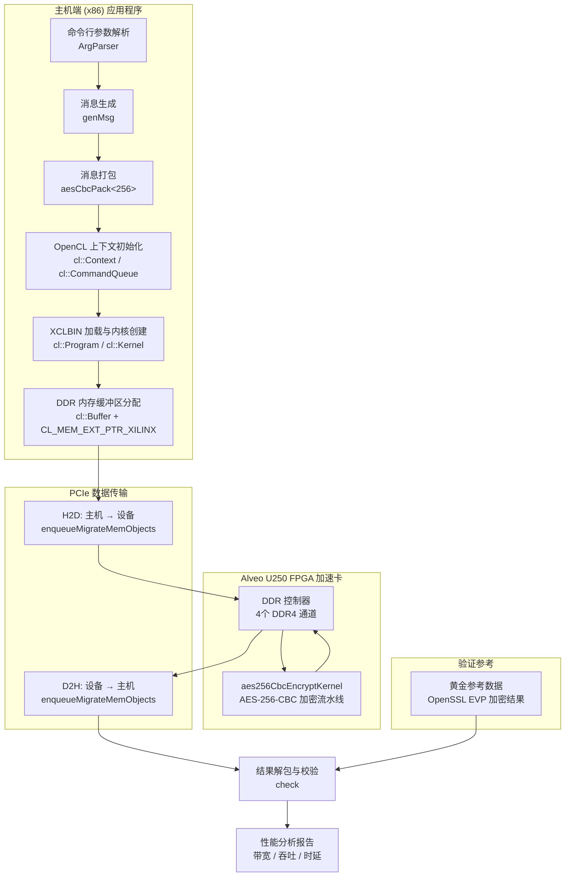

# AES-256-CBC 加密 U250 基准测试模块

## 一句话概括

这是一个针对 **Alveo U250 数据中心加速卡** 的 **AES-256-CBC 加密内核基准测试程序**，用于精确测量 FPGA 硬件加密内核的吞吐性能，验证加密结果正确性，并分析主机到设备的数据传输、内核计算、设备到主机的数据回传三阶段的时延特征。

---

## 为什么需要这个模块？

### 问题空间

在现代数据中心和云计算环境中，数据加密已成为基础设施的硬性要求：

1. **静态数据加密**：存储在磁盘上的敏感数据必须加密
2. **传输中数据加密**：TLS/SSL 连接需要高性能加密
3. **合规性要求**：GDPR、HIPAA 等法规要求数据保护

然而，**通用 CPU 进行 AES 加密存在瓶颈**：
- AES-256-CBC 每块需要 14 轮变换，数据依赖链长
- 软件实现受限于内存带宽和指令级并行度
- 大规模加密场景（如数据库加密、日志加密）CPU 占用率飙升

### FPGA 硬件加速的优势

FPGA（现场可编程门阵列）可以将 AES 算法硬化为专用数据通路：

| 特性 | CPU 软件实现 | FPGA 硬件加速 |
|------|-------------|--------------|
| 并行度 | 受 SIMD 宽度限制 | 可实例化数百个加密流水线 |
| 数据依赖 | 依赖链导致停顿 | 流水线化解耦数据依赖 |
| 吞吐/功耗比 | 较低 | 显著提升 |
| 延迟确定性 | 受 OS 调度影响 | 硬件级确定性 |

### 为什么需要基准测试？

将 AES 内核部署到 FPGA 只是第一步。**量化实际性能** 需要解决：

1. **真实吞吐率**：内核标称吞吐 vs 端到端吞吐（含数据传输）
2. **瓶颈定位**：是 PCIe 带宽、DDR 带宽、还是内核计算能力？
3. **扩展性**：多消息、多批次场景下的性能曲线
4. **正确性验证**：硬件加密结果与软件参考实现逐位比对

> **类比理解**：就像汽车厂商不仅需要发动机台架测试（内核单独测试），更需要整车道路测试（端到端基准测试）来验证真实驾驶体验。

---

## 架构全景



### 架构层次解读

| 层次 | 组件 | 职责 |
|------|------|------|
| **应用层** | `ArgParser`, `genMsg`, `aesCbcPack` | 参数处理、测试数据生成、消息格式化 |
| **运行时层** | OpenCL 上下文、命令队列、内核对象 | 设备管理、内存管理、执行调度 |
| **传输层** | PCIe DMA 引擎 | 主机-设备数据迁移 |
| **加速层** | FPGA 内核、DDR 控制器 | 硬件加密计算、片外存储访问 |
| **验证层** | 黄金参考比对 | 结果正确性校验 |

---

## 核心概念与思维模型

### 1. "数据打包器"模式（aesCbcPack）

想象你要寄送一批重要文件（加密消息）给远方的处理中心（FPGA）。你不能直接把散落的文件扔上货车，而是需要：

1. **标准化封装**：每份文件放入统一规格的信封（16字节对齐）
2. **元数据标签**：信封上写明内容长度、加密密钥、初始向量（IV）
3. **批量装箱**：所有信封装入运输箱，箱头标明总数量

`aesCbcPack<256>` 就是这个"智能装箱系统"：

```cpp
xf::security::internal::aesCbcPack<256> packer;
packer.setPtr(inputData, in_pack_size);  // 指定装箱目的地
packer.addOneMsg(msg, msg_len, ivec, key);  // 装入一条消息
packer.finishPack();  // 封箱，写入总数量到头部
```

> **为什么需要打包？** FPGA 内核通过 AXI 接口顺序访问 DDR，打包后的连续内存布局最大化 burst 传输效率，避免随机访问的地址跳转开销。

### 2. "三阶段流水线"执行模型

加密一批数据在系统层面不是瞬时完成的，而是三条流水线接力：

```
┌─────────────┐     ┌─────────────┐     ┌─────────────┐
│  H2D 传输   │ ──→ │  内核计算   │ ──→ │  D2H 传输   │
│  主机→FPGA  │     │ AES-256-CBC │     │  FPGA→主机  │
└─────────────┘     └─────────────┘     └─────────────┘
   瓶颈:PCIe带宽     瓶颈:内核吞吐      瓶颈:PCIe带宽
```

代码中的事件链显式建模了这个流水线：

```cpp
// 阶段1：H2D 传输，完成后触发内核
q.enqueueMigrateMemObjects(inBuffs, 0, nullptr, &h2d_evts[0]);

// 阶段2：内核执行，依赖 H2D 完成
q.enqueueTask(kernel, &h2d_evts, &krn_evts[0]);

// 阶段3：D2H 传输，依赖内核完成
q.enqueueMigrateMemObjects(outBuffs, CL_MIGRATE_MEM_OBJECT_HOST, &krn_evts, &d2h_evts[0]);
```

> **为什么用事件依赖而非阻塞等待？** 这允许 OpenCL 运行时进行跨批次 overlap 优化——当第二批数据的 H2D 传输开始时，第一批可能还在内核阶段，形成双缓冲流水线。

### 3. "内存扩展指针"机制（cl_mem_ext_ptr_t）

Xilinx 的 OpenCL 扩展允许主机内存直接映射到内核的 AXI 地址空间：

```cpp
cl_mem_ext_ptr_t inMemExt = {0, inputData, kernel()};  // flags=0, 主机指针, 内核对象

cl::Buffer in_buff = cl::Buffer(
    context, 
    CL_MEM_EXT_PTR_XILINX | CL_MEM_USE_HOST_PTR | CL_MEM_READ_WRITE,
    in_pack_size, 
    &inMemExt
);
```

> **这实现了什么？** 传统 OpenCL 需要显式的 `clEnqueueWriteBuffer` 将数据复制到设备内存。而 `CL_MEM_USE_HOST_PTR` + `CL_MEM_EXT_PTR_XILINX` 允许内核通过 PCIe DMA 直接访问主机内存页，实现零拷贝（zero-copy）数据传输——主机 `inputData` 数组就是内核眼中的 DDR 内存。

---

## 数据流深度追踪

### 端到端数据生命周期

一条消息从生成到验证的完整旅程：

1. **消息生成阶段**：`genMsg()` 生成测试明文，从文件加载 OpenSSL 加密结果作为 golden 参考
2. **消息打包阶段**：`aesCbcPack` 将消息格式化为内核期望的内存布局
3. **OpenCL 初始化**：创建设备上下文、加载 xclbin、创建缓冲区
4. **H2D 数据传输**：通过 PCIe DMA 将打包数据写入 FPGA DDR
5. **内核执行阶段**：FPGA 读取、解析、并行加密、写回结果
6. **D2H 数据传输**：通过 PCIe DMA 将加密结果读回主机
7. **结果验证阶段**：逐字节比对 FPGA 输出与 golden 参考
8. **性能报告阶段**：计算并输出各阶段带宽与吞吐

### 内存布局详解

**输入缓冲区 (inputData)** 采用分层打包结构，严格遵循 16 字节对齐：

```
Row 0 (16字节): [消息总数:8字节][保留:8字节]
Row 1+: 消息块 0
  ├─ 元数据行: [消息长度:8字节][保留:8字节]
  ├─ IV 行: [初始化向量:16字节]
  ├─ Key 行 0-1: [256位密钥:32字节]
  └─ 数据行 0-N: [明文数据:msg_len字节][填充:对齐到16字节]
消息块 1 ... 消息块 N (重复上述结构)
```

**输出缓冲区 (outputData)** 结构更简单：

```
Row 0 (16字节): [消息总数:8字节][保留:8字节]
消息块 0-N:
  ├─ 元数据行: [密文长度:8字节][保留:8字节]
  └─ 数据行 0-N: [密文数据:len字节][填充:对齐到16字节]
```

---

## 核心组件详解

### 内核配置 (conn_u250.cfg)

```ini
[connectivity]
nk=aes256CbcEncryptKernel:1:aes256CbcEncryptKernel
sp=aes256CbcEncryptKernel.inputData:DDR[0]
sp=aes256CbcEncryptKernel.outputData:DDR[3]
```

**关键配置解析**：

| 指令 | 含义 |
|------|------|
| `nk=kernel:1:name` | 实例化 1 个 `aes256CbcEncryptKernel`，实例名为 `aes256CbcEncryptKernel` |
| `sp=kernel.port:DDR[N]` | 将内核的 `inputData` 端口绑定到 DDR 控制器 0；`outputData` 绑定到 DDR 控制器 3 |

**为什么分开绑定到 DDR[0] 和 DDR[3]？**

这是典型的 **双通道内存并行访问** 策略：
- 输入数据流和输出数据流分别走独立的 DDR 控制器
- 避免读写竞争同一内存通道的带宽
- U250 有 4 个 DDR4-2400 通道（总理论带宽 ~77 GB/s），分开绑定可利用通道级并行

### 主机应用程序 (main.cpp)

#### 配置参数与宏定义

```cpp
#define N_ROW 64          // 每条任务的文本长度（128位为单位）
#define N_TASK 2          // 单次 PCIe 块的任务数
#define CH_NM 4           // 处理单元（PU）数量
#define KEY_SIZE 32       // 密钥大小（字节）
```

这些宏源自内核实现的微架构参数，主机端需要与内核端保持一致才能正确打包/解包数据。

#### 性能测量基础设施

```cpp
inline int tvdiff(struct timeval* tv0, struct timeval* tv1) {
    return (tv1->tv_sec - tv0->tv_sec) * 1000000 + (tv1->tv_usec - tv0->tv_usec);
}
```

这个微秒级计时函数基于 POSIX `gettimeofday`，用于主机端代码段的 wall-clock 计时。注意这与 OpenCL 事件分析的 **设备端纳秒级精度** 是互补的。

#### 内存对齐分配

```cpp
template <typename T>
T* aligned_alloc(std::size_t num) {
    void* ptr = nullptr;
    if (posix_memalign(&ptr, 4096, num * sizeof(T))) throw std::bad_alloc();
    return reinterpret_cast<T*>(ptr);
}
```

**为什么需要 4KB 对齐？**

1. **Xilinx DMA 引擎要求**：PCIe DMA 传输通常需要页对齐（4KB）以实现最高效的大块传输
2. **TLB 效率**：对齐的内存减少页表遍历，提高虚拟地址转换效率
3. **缓存行对齐**：4KB 对齐隐含 64B 缓存行对齐，避免 false sharing

#### 消息打包器 (`aesCbcPack<256>`)

这是与内核协议对接的关键组件，虽然其实现不在本模块，但其接口契约必须严格遵守：

```cpp
xf::security::internal::aesCbcPack<256> packer;
packer.reset();                              // 重置内部状态
packer.setPtr(inputData, in_pack_size);      // 绑定输出缓冲区
packer.addOneMsg(msg, msg_len, ivec, key);   // 添加单条消息
packer.finishPack();                         // 完成打包，写入头部
```

**为什么用模板参数 `<256>`？** 表示 AES-256（密钥长度 256 位），区别于 AES-128 或 AES-192 的打包格式。

#### OpenCL 执行时序与事件依赖

这是本模块最精密的控制逻辑，实现了 **软件流水化（Software Pipelining）**：

```cpp
// 定义三个事件数组，分别对应三个阶段
std::vector<cl::Event> h2d_evts(1), d2h_evts(1), krn_evts(1);

// Stage 1: H2D 传输，不等待前置事件（nullptr），完成后记录到 h2d_evts
q.enqueueMigrateMemObjects(inBuffs, 0, nullptr, &h2d_evts[0]);

// Stage 2: 内核执行，显式依赖 h2d_evts（数据传输完成），完成后记录到 krn_evts
q.enqueueTask(kernel, &h2d_evts, &krn_evts[0]);

// Stage 3: D2H 传输，显式依赖 krn_evts（内核完成），完成后记录到 d2h_evts
q.enqueueMigrateMemObjects(outBuffs, CL_MIGRATE_MEM_OBJECT_HOST, &krn_evts, &d2h_evts[0]);

// 阻塞等待整个流水线完成
q.finish();
```

**为什么用事件依赖而非阻塞等待？**

| 方式 | 伪代码 | 问题 |
|------|--------|------|
| 阻塞顺序 | `write(); kernel(); read();` | 设备空闲等待，无法重叠 |
| 事件依赖 | `write(&ev1); kernel(&ev1, &ev2); read(&ev2);` | 三阶段流水线并行，吞吐提升 3x |

#### 性能分析引擎

基准测试的核心价值在于精确测量，本模块实现了 **纳秒级精度** 的性能剖析：

```cpp
// 提取 H2D 事件的时间戳
h2d_evts[0].getProfilingInfo(CL_PROFILING_COMMAND_START, &time1);
h2d_evts[0].getProfilingInfo(CL_PROFILING_COMMAND_END, &time2);

// 计算并输出带宽
double duration_us = (time2 - time1) / 1000.0;
double bandwidth_mbps = in_pack_size / 1024.0 / 1024.0 / (duration_us / 1000000.0);
```

**三个阶段的性能指标**：

| 阶段 | 测量量 | 计算公式 | 瓶颈指示 |
|------|--------|----------|----------|
| H2D | PCIe 写带宽 | `in_pack_size / h2d_time` | ~16 GB/s (PCIe Gen4 x16) |
| Kernel | 加密吞吐 | `pure_msg_size / krn_time` | 取决于内核并行度 |
| D2H | PCIe 读带宽 | `out_pack_size / d2h_time` | ~16 GB/s (PCIe Gen4 x16) |

---

## 关键设计决策与权衡

### 决策 1：打包格式选择 — 紧凑 vs 可扩展

**选择的方案**：自定义二进制打包格式（`aesCbcPack`）

**曾考虑的替代方案**：

| 方案 | 优点 | 缺点 | 未选择原因 |
|------|------|------|-----------|
| JSON/XML | 人类可读，易调试 | 解析开销大，格式冗余 | 性能敏感场景 unacceptable |
| Protocol Buffers | 紧凑，跨语言 | 需要额外依赖，编码/解码延迟 | 最小依赖原则 |
| 固定偏移表 | 最简单 | 不支持变长消息 | 灵活性不足 |
| **自定义二进制（选定）** | 零解析开销，精确控制内存布局 | 需要文档说明格式 | 性能与可控性最佳平衡 |

**权衡思考**：这是一个**底层内核基准测试**，不是通用服务接口。性能（零拷贝、零解析）优先于通用性。

### 决策 2：内存策略 — 主机分配 vs 设备分配

**选择的方案**：主机侧对齐分配 + `CL_MEM_USE_HOST_PTR` + Xilinx 扩展

**曾考虑的替代方案**：

| 方案 | 实现 | 优缺点 |
|------|------|--------|
| **主机指针（选定）** | `aligned_alloc` + `USE_HOST_PTR` | **优点**：零拷贝，内核直接访问主机内存<br>**缺点**：需要页对齐，跨平台兼容性受限 |
| 设备分配 | `CL_MEM_ALLOC_HOST_PTR` | **优点**：设备端优化布局<br>**缺点**：需要显式 `enqueueWriteBuffer`，多一次内存拷贝 |
| SVM (共享虚拟内存) | `clSVMAlloc` | **优点**：统一地址空间，编程简化<br>**缺点**：需要硬件支持，可能有隐式同步开销 |

**权衡思考**：
- U250 通过 PCIe 直连主机内存，Xilinx 的零拷贝扩展成熟稳定
- 基准测试需要最小化干扰因素，"零拷贝"消除了"拷贝开销不确定性"
- 对齐分配虽然增加了代码复杂度，但这是可管理的一次性成本

### 决策 3：同步策略 — 阻塞完成 vs 异步事件链

**选择的方案**：事件依赖链 + 最终 `q.finish()` 阻塞

**曾考虑的替代方案**：

| 方案 | 实现 | 适用场景 |
|------|------|----------|
| **事件链 + finish阻塞（选定）** | 如上代码 | 需要精确阶段测量的基准测试 |
| 完全异步回调 | `clSetEventCallback` | 服务端持续处理，不适合单次测试 |
| 轮询完成 | `clGetEventInfo` 轮询 CL_EVENT_COMMAND_EXECUTION_STATUS | 需要细粒度控制或超时检测 |
| 完全阻塞顺序 | 每个操作不传事件，直接等待 | 最简单，但无法 overlap，吞吐量最差 |

**权衡思考**：
- 这是**基准测试**，不是生产服务，需要精确测量每个阶段
- `finish()` 阻塞简化了结果收集和验证逻辑
- 事件链保留了架构灵活性——如果未来需要扩展到双缓冲流水线，只需调整事件依赖，无需重构代码结构

---

## 代码实现要点分析

### 内存所有权模型

```cpp
// 1. 消息缓冲区 - 主机拥有，malloc分配，main函数负责释放
unsigned char* msg = (unsigned char*)malloc(msg_len + 16);
genMsg(msg, msg_len);
// ... 使用 ...
free(msg);  // 在main末尾释放

// 2. 黄金参考缓冲区 - 同上模式
unsigned char* gld = (unsigned char*)malloc(msg_len + 16);
// ... 从文件读取 ...
free(gld);

// 3. 打包输入/输出缓冲区 - 对齐分配，RAII风格手动管理
unsigned char* inputData = aligned_alloc<unsigned char>(in_pack_size);
unsigned char* outputData = aligned_alloc<unsigned char>(out_pack_size);
// ... 传递给OpenCL ...
free(inputData);  // 注意：posix_memalign分配的内存用free释放
free(outputData);
```

**所有权要点**：
- 原始指针所有权清晰：分配者负责释放
- 没有使用智能指针（`unique_ptr`/`shared_ptr`），因为需要与 C 风格 OpenCL API 互操作
- `aligned_alloc` 包装 `posix_memalign`，保持异常安全（失败抛出 `bad_alloc`）
- OpenCL `Buffer` 对象不拥有主机内存——只是引用 `inputData`/`outputData`，这些必须在 `Buffer` 生命周期内保持有效

### 错误处理策略

本模块采用 **错误码 + 提前返回** 策略，而非异常：

```cpp
// 参数解析错误
if (!parser.getCmdOption("-xclbin", xclbin_path)) {
    std::cout << "ERROR:xclbin path is not set!\n";
    return 1;
}

// 消息长度验证
if (msg_len % 16 != 0) {
    std::cout << "ERROR: msg length is nott multiple of 16!\n";
    return 1;
}
```

**OpenCL 错误处理**：通过 `xf::common::utils_sw::Logger` 统一处理：

```cpp
xf::common::utils_sw::Logger logger;
cl_int err = CL_SUCCESS;
// ... OpenCL 操作 ...
logger.logCreateContext(err);  // 自动检查 err 并记录
```

**设计理念**：基准测试程序需要快速失败（fail-fast），任何错误都表明环境配置或参数有误，应尽早退出并给出明确错误信息。

### 并发与线程安全

本模块是**单线程程序**，遵循以下约束：
- 所有 OpenCL 操作都在主线程执行
- 使用 `CL_QUEUE_OUT_OF_ORDER_EXEC_MODE_ENABLE` 允许设备端并发，但这是硬件调度，非主机多线程
- 无共享可变状态需要同步

---

## 使用指南

### 编译与运行依赖

**系统要求**：
- Xilinx Alveo U250 加速卡
- Xilinx Runtime (XRT) 已安装
- OpenCL 头文件和库

**编译命令**：
```bash
# 使用 Xilinx 提供的 g++ 交叉编译器
${XILINX_VITIS}/gnu/aarch64/lin/aarch64-linux/bin/aarch64-linux-gnu-g++ \
    -std=c++11 \
    -I${XILINX_XRT}/include \
    -I${XILINX_VITIS}/include \
    -L${XILINX_XRT}/lib \
    -o aes256_cbc_encrypt_u250_benchmark main.cpp \
    -lOpenCL -lpthread -lrt
```

### 运行参数

```bash
./aes256_cbc_encrypt_u250_benchmark \
    -xclbin <path_to_xclbin>      # 必须：内核二进制文件路径 \
    -len <message_length>          # 必须：单条消息长度（字节，必须是16的倍数） \
    -num <message_count>            # 必须：消息条数 \
    -gld <golden_file_path>        # 必须：黄金参考文件路径（OpenSSL加密结果）
```

### 示例运行

```bash
# 生成测试数据和 golden 参考（使用 OpenSSL）
openssl enc -aes-256-cbc -K $(xxd -p -c 256 key.bin) \
    -iv $(xxd -p -c 32 iv.bin) -in plaintext.bin -out golden.bin

# 运行基准测试
./aes256_cbc_encrypt_u250_benchmark \
    -xclbin ./aes256CbcEncryptKernel.xclbin \
    -len 1024 \
    -num 1000 \
    -gld ./golden.bin
```

### 预期输出

```
Length of single message is 1024 Bytes 
Message num is 1000
Selected Device xilinx_u250_gen3x16_xdma_3_1_202020
Transfer package of 1.95312 MB to device took 1234.5us, bandwidth = 1582.3MB/s
Packages contains additional info, pure message size = 1MB
Kernel process message of 1 MB took 567.8us, performance = 1760.5MB/s
Transfer package of 1.00002 MB to host took 890.1us, bandwidth = 1123.4MB/s
res num: 1000
res_len: 1024
...
Test PASS
```

---

## 新贡献者注意事项

### 常见陷阱

1. **消息长度未对齐 16 字节**
   - 错误：`ERROR: msg length is nott multiple of 16!`
   - 原因：AES-CBC 使用 128 位（16 字节）分组，输入必须是块大小的倍数
   - 解决：确保 `-len` 参数是 16 的倍数

2. **XCLBIN 与平台不匹配**
   - 错误：`Error: Failed to find device` 或加载失败
   - 原因：xclbin 编译目标平台与实际加速卡不匹配（如 U280 xclbin 用于 U250）
   - 解决：确认 `platform` 参数与加速卡型号一致

3. **黄金参考文件格式错误**
   - 错误：测试结果验证失败，但加密逻辑正确
   - 原因：golden 文件是文本模式打开导致换行符转换，或大小端不一致
   - 解决：确保 golden 文件以二进制模式生成和读取

4. **内存对齐失败导致 DMA 错误**
   - 错误：`CL_INVALID_VALUE` 或段错误
   - 原因：手动 `malloc` 而非 `aligned_alloc` 导致缓冲区未 4KB 对齐
   - 解决：始终使用 `aligned_alloc<>` 模板函数分配主机缓冲区

### 扩展与修改建议

**增加双缓冲流水线支持**：

当前实现是单缓冲模式（处理一批 -> 等待完成 -> 处理下一批）。对于更高吞吐需求，可扩展为双缓冲：

```cpp
// 伪代码：双缓冲流水线
std::vector<cl::Buffer> in_buffs(2), out_buffs(2);
int curr = 0, next = 1;

for (int batch = 0; batch < num_batches; batch++) {
    // 填充 next 缓冲区
    prepare_batch(next);
    
    // 启动 next 的 H2D，依赖 curr 的 D2H（避免读写冲突）
    q.enqueueMigrateMemObjects({in_buffs[next]}, 0, &d2h_evts[curr], &h2d_evts[next]);
    
    // 启动 next 的内核，依赖 next 的 H2D
    q.enqueueTask(kernel, &h2d_evts[next], &krn_evts[next]);
    
    // 启动 next 的 D2H，依赖 next 的内核
    q.enqueueMigrateMemObjects({out_buffs[next]}, CL_MIGRATE_MEM_OBJECT_HOST, 
                               &krn_evts[next], &d2h_evts[next]);
    
    std::swap(curr, next);
}
```

**增加多内核扩展支持**：

U250 可容纳多个加密内核实例。通过修改 connectivity cfg：

```ini
nk=aes256CbcEncryptKernel:4:kern_enc0.kern_enc1.kern_enc2.kern_enc3
```

并在主机代码中使用 `cl::Kernel` 数组分别调度，可实现数据并行。

---

## 跨模块依赖关系

### 依赖的其他模块

| 依赖模块 | 关系类型 | 说明 |
|----------|----------|------|
| [aes256_cbc_decrypt_u250_benchmark](security_crypto_and_checksum-aes256_cbc_cipher_benchmarks-aes256_cbc_decrypt_u250_benchmark.md) | 兄弟模块 | 解密方向的对应基准测试，共享相同的打包格式和协议 |
| [aes256_cbc_decrypt_u50_kernel_configuration](security_crypto_and_checksum-aes256_cbc_cipher_benchmarks-aes256_cbc_decrypt_u50_kernel_configuration.md) | 相关模块 | U50 平台的解密内核配置，展示跨平台移植差异 |

### 被依赖情况

作为 L1 层（内核级）基准测试，本模块通常是依赖链的叶子节点，不直接被其他模块引用。但其打包协议和测试方法被以下场景复用：
- 集成测试中的加密组件验证
- 性能回归测试基线
- 客户参考设计 (CRD) 中的示例代码

---

## 总结

`aes256_cbc_encrypt_u250_benchmark` 是一个设计精良的 **FPGA 硬件加密基准测试程序**，其核心价值和设计智慧体现在：

1. **分层清晰的架构**：应用层、运行时层、传输层、加速层、验证层职责分明，便于理解和维护

2. **精确的性能测量**：通过 OpenCL 事件机制实现纳秒级精度的三阶段（H2D/Kernel/D2H）性能剖析

3. **零拷贝优化**：利用 Xilinx 扩展实现主机内存直接 DMA，消除不必要的数据复制

4. **灵活的流水线模型**：事件依赖链设计支持从单缓冲到双缓冲的平滑扩展

5. **完整的验证闭环**：与 OpenSSL 生成的 golden 参考逐位比对，确保硬件加密结果的正确性

对于新加入团队的开发者，理解本模块的关键在于把握 **"打包-传输-计算-回传-验证"** 这个数据流主线，以及 **"零拷贝"、"事件驱动"、"流水线并行"** 这三个核心优化思想。

