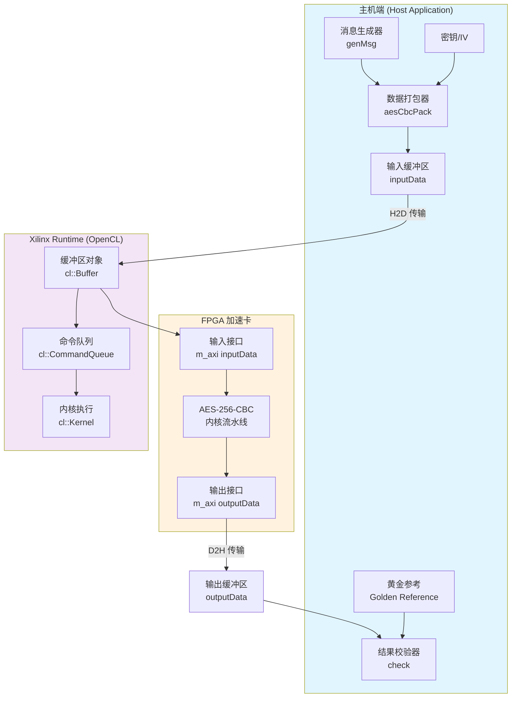

# AES-256-CBC 密码学基准测试模块

## 概述

**aes256_cbc_cipher_benchmarks** 是一个基于 Xilinx FPGA 的 AES-256-CBC 加解密性能基准测试框架。它解决了在数据中心场景下对大批量敏感数据进行硬件加速加密的核心需求——传统的 CPU 加密方案在处理 TLS/SSL 卸载、数据库加密、文件系统加密等场景时，往往成为吞吐瓶颈。

想象这个模块如同一个**高速数字信封工厂**：主机端（Host）负责准备待加密的信件（明文数据）、密钥和初始化向量，将它们打包成 FPGA 内核能够理解的格式；FPGA 内核则像一条高度并行的装配线，以纳秒级的延迟对数据块进行 AES-256-CBC 变换；最后结果回流到主机进行验证。整个流程的设计哲学是**"批量化处理 + 零拷贝传输"**——通过将多个小消息打包成大的 DMA 缓冲区，摊销 PCIe 传输开销，从而最大化有效吞吐。

该模块同时支持 **Alveo U250**（DDR 内存架构）和 **U50**（HBM 高带宽内存架构）两种平台，通过连接配置文件（`.cfg`）抽象底层内存拓扑差异，使上层主机代码保持平台无关性。

---

## 架构概览

### 系统拓扑与数据流



### 核心组件职责

| 组件层级 | 组件名称 | 架构角色 | 核心职责 |
|---------|---------|---------|---------|
| **主机应用层** | `main.cpp` (Encrypt/Decrypt) | 编排器 (Orchestrator) | 命令行解析、内存分配、数据打包、XRT 运行时管理、性能计时、结果验证 |
| **打包协议层** | `xf::security::internal::aesCbcPack<256>` | 序列化器 (Serializer) | 将变长消息、IV、密钥打包成 16 字节对齐的 FPGA 友好格式，处理字节序和对齐 |
| **连接抽象层** | `.cfg` 文件 (U250/U50) | 硬件抽象层 (HAL) | 定义内核端口到物理内存（DDR/HBM）的映射，屏蔽平台差异 |
| **FPGA 内核层** | `aes256CbcEncryptKernel` / `aes256CbcDecryptKernel` | 计算引擎 (Compute Engine) | 实现 AES-256-CBC 算法的硬件流水线，处理 128 位数据块，利用流水线并行和循环展开实现高吞吐 |

### 端到端数据流详解

以**加密流程**为例，数据流如下：

1. **消息生成阶段**：`genMsg()` 使用固定模式填充测试数据（重复 `0x60-0x6f` 序列），确保数据可预测且易于验证。消息长度必须为 16 的倍数（AES 块大小），由命令行参数 `-len` 控制。

2. **数据打包阶段**：`aesCbcPack<256>` 类实现了一种**批量消息协议**。每个消息块包含：
   - 8 字节消息长度（64 位，16 字节对齐存储）
   - 16 字节初始化向量（IV）
   - 32 字节 AES-256 密钥
   - 变长消息数据（填充至 16 字节对齐）
   
   包头（Row[0]）存储消息总数 `msg_num`。这种打包方式允许 FPGA 内核以**流式方式**连续处理多个消息，避免 per-message 的 PCIe 往返开销。

3. **XRT 运行时阶段**：主机使用 Xilinx Runtime (XRT) OpenCL  API 与 FPGA 交互：
   - `cl::Buffer` 创建零拷贝缓冲区，使用 `CL_MEM_USE_HOST_PTR` 和 `CL_MEM_EXT_PTR_XILINX` 扩展直接关联主机内存与 FPGA 物理地址。
   - `enqueueMigrateMemObjects` 执行 H2D（Host-to-Device）传输，将打包数据写入 FPGA 连接的 DDR/HBM。
   - `enqueueTask` 启动内核执行，加密流水线开始处理数据。
   - 第二个 `enqueueMigrateMemObjects` 执行 D2H（Device-to-Host）传输，将结果读回主机。

4. **性能分析阶段**：使用 OpenCL 事件（`cl::Event`）和内建性能计数器（`CL_PROFILING_COMMAND_START/END`），分别测量：
   - H2D 传输带宽（PCIe 有效吞吐）
   - 内核执行时间（纯加密性能，MB/s）
   - D2H 传输带宽

5. **结果验证阶段**：解密流程类似，但输出与原始明文 `msg` 对比；加密流程则与预计算的 `gld`（Golden Reference）文件对比。`check()` 函数逐字节比较，报告不匹配位置。

---

## 关键设计决策与权衡

### 1. 批量打包协议 vs. 单消息传输

**决策**：采用 `aesCbcPack` 将多个消息打包成单个 DMA 缓冲区，而非为每个消息发起独立的 PCIe 传输。

**权衡分析**：
- **优势**：摊销 PCIe 事务开销（TLP 头开销、中断延迟），显著提升小消息吞吐；FPGA 内核以流式方式处理，内部流水线保持满载。
- **代价**：增加主机端 CPU 开销（打包/解包），需要额外内存拷贝（尽管使用 `posix_memalign` 优化对齐）；延迟增加（必须等待一批消息收集完成）。
- **适用场景**：数据中心加密场景（TLS 卸载、磁盘加密）通常涉及大批量数据，此设计完美契合。

### 2. 平台抽象：DDR vs. HBM 连接配置

**决策**：通过独立的 `.cfg` 文件支持 U250 (DDR) 和 U50 (HBM)，保持主机代码平台无关。

**配置对比**：
- **U250 (Alveo U250)**：
  ```cfg
  sp=aes256CbcEncryptKernel.inputData:DDR[0]
  sp=aes256CbcEncryptKernel.outputData:DDR[3]
  ```
  使用 DDR4 内存，容量大（64GB），适合大消息批量处理。

- **U50 (Alveo U50)**：
  ```cfg
  sp=aes256CbcDecryptKernel.inputData:HBM[0]
  sp=aes256CbcDecryptKernel.outputData:HBM[4]
  ```
  使用 HBM2 内存，带宽极高（约 460 GB/s），适合高吞吐流式处理。

**权衡**：这种抽象允许相同的主机二进制通过不同的 xclbin 和 cfg 文件运行在异构硬件上，但要求内核端口命名一致。

### 3. 内存管理：对齐分配与零拷贝

**决策**：使用 `posix_memalign(4096)` 进行页对齐内存分配，配合 `CL_MEM_USE_HOST_PTR` 实现零拷贝数据传输。

**技术细节**：
- **对齐要求**：Xilinx FPGA 的 DMA 引擎通常需要 4KB 页对齐的物理地址以实现高效分散-聚集（scatter-gather）。
- **零拷贝机制**：`CL_MEM_USE_HOST_PTR` 告诉 XRT 使用主机提供的指针作为内核访问的内存，避免额外的设备内存分配和 `memcpy`。
- **显式迁移**：`enqueueMigrateMemObjects` 触发 DMA 传输，将数据从 CPU 缓存刷新到 FPGA 连接的内存（DDR/HBM）。

**权衡**：增加了主机代码复杂性（需要管理对齐内存），但显著降低了延迟和 CPU 负载。

### 4. 性能计量策略

**决策**：使用 OpenCL 事件分析（`CL_PROFILING_COMMAND_START/END`）分别测量 H2D、内核执行、D2H 三个阶段。

**价值**：
- 能够区分**传输瓶颈**与**计算瓶颈**：如果 H2D 时间占主导，需要优化 PCIe 传输或增加批处理大小；如果内核时间占主导，需要优化 HLS 内核流水线。
- 计算**有效吞吐**：`pure_msg_size / kernel_time` 给出实际的加密吞吐（MB/s），排除包头和填充开销。

---

## 子模块概览

本模块包含三个主要的子模块，分别对应不同的平台配置和加解密方向：

### [aes256_cbc_encrypt_u250_benchmark](security_crypto_and_checksum-aes256_cbc_cipher_benchmarks-aes256_cbc_encrypt_u250_benchmark.md)

针对 **Alveo U250 加速卡** 的 AES-256-CBC **加密** 基准测试。包含 U250 平台特定的连接配置（DDR 内存映射）和主机端加密测试程序。该子模块负责将明文数据通过 FPGA 内核加密为密文，并与预计算的黄金参考（Golden Reference）进行比对验证。详细实现请参阅 [aes256_cbc_encrypt_u250_benchmark 子模块文档](security_crypto_and_checksum-aes256_cbc_cipher_benchmarks-aes256_cbc_encrypt_u250_benchmark.md)。

### [aes256_cbc_decrypt_u250_benchmark](security_crypto_and_checksum-aes256_cbc_cipher_benchmarks-aes256_cbc_decrypt_u250_benchmark.md)

针对 **Alveo U250 加速卡** 的 AES-256-CBC **解密** 基准测试。与加密子模块对称，但执行逆向操作：接收密文数据，通过 FPGA 内核解密，恢复原始明文，并与原始生成的测试消息进行逐字节比对。共享相同的主机代码逻辑，但连接至不同的解密内核实例。详细实现请参阅 [aes256_cbc_decrypt_u250_benchmark 子模块文档](security_crypto_and_checksum-aes256_cbc_cipher_benchmarks-aes256_cbc_decrypt_u250_benchmark.md)。

### [aes256_cbc_decrypt_u50_kernel_configuration](security_crypto_and_checksum-aes256_cbc_cipher_benchmarks-aes256_cbc_decrypt_u50_kernel_configuration.md)

针对 **Alveo U50 加速卡**（HBM 版本）的 AES-256-CBC **解密** 内核连接配置。与 U250 版本相比，此配置将内核端口映射至 **HBM（高带宽内存）** 而非 DDR，利用 U50 更高的内存带宽（约 460 GB/s）实现极致的流式解密吞吐。该子模块专注于硬件连接抽象，使相同的主机代码能够在 U50 平台上无需修改即可运行。详细实现请参阅 [aes256_cbc_decrypt_u50_kernel_configuration 子模块文档](security_crypto_and_checksum-aes256_cbc_cipher_benchmarks-aes256_cbc_decrypt_u50_kernel_configuration.md)。

---

## 跨模块依赖与系统集成

### 上游依赖（本模块依赖的外部组件）

| 依赖模块 | 用途 | 集成方式 |
|---------|------|---------|
| **Xilinx Runtime (XRT)** | OpenCL 运行时、设备管理、内存迁移 | 头文件 `<xcl2.hpp>`，链接 XRT 库 |
| **Vitis 安全库 (xf_security)** | `aesCbcPack` 打包协议实现 | 头文件 `"xf_security/msgpack.hpp"` |
| **Vitis 通用工具库 (xf_utils_sw)** | 日志记录与错误处理 | 头文件 `"xf_utils_sw/logger.hpp"` |
| **OpenCL 头文件** | OpenCL C++ 绑定 (`cl::Buffer`, `cl::Kernel` 等) | 系统提供的 OpenCL 头文件 |

### 下游依赖（依赖本模块的组件）

本模块作为 **L1 基准测试**（Level 1 Benchmark），主要面向以下下游使用场景：

1. **持续集成 (CI) 性能回归测试**：在 Vitis 安全库的持续集成流程中，本模块作为加密 IP 的性能基线，确保 HLS 内核优化不会引入性能退化。

2. **客户参考设计 (Customer Reference Design)**：作为 Xilinx 安全加速解决方案的示例代码，供客户理解如何将 `xf_security` 库集成到自己的 OpenCL 应用中。

3. **竞品性能对标 (Competitive Benchmarking)**：与 Intel QAT、NVIDIA GPU 加密库等进行吞吐量和延迟对比的行业标准测试工具。

### 模块边界与接口契约

**对外接口（主机应用程序命令行）**：

本模块通过命令行参数与外部环境交互，这是主要的用户契约界面：

| 参数 | 必填 | 含义 | 约束条件 |
|------|------|------|---------|
| `-xclbin <path>` | 是 | FPGA 比特流文件路径 | 必须与目标平台（U250/U50）和方向（Encrypt/Decrypt）匹配 |
| `-len <bytes>` | 是 | 单条消息长度 | 必须是 16 的倍数（AES 块对齐） |
| `-num <count>` | 是 | 消息批次数 | 决定总处理数据量 |
| `-gld <path>` | 是 | 黄金参考文件路径 | 加密模式使用（与输出比对），解密模式忽略 |

**内部契约（打包协议）**：

`aesCbcPack` 定义了主机与 FPGA 之间的私有数据契约，违反此契约将导致内核解析错误：

1. **对齐要求**：所有数据结构按 16 字节（128 位，一个 AES 块）对齐。
2. **包头格式**：第 0 行（Row[0]）存储 64 位消息数量（`msg_num`），剩余字节保留。
3. **消息块格式**：每个消息顺序存储，包含：
   - 8 字节长度字段（64 位，16 字节对齐存储）
   - 16 字节 IV
   - 32 字节 AES-256 密钥
   - N 字节消息数据（N 是 16 的倍数）
4. **输出格式**：与输入类似，但仅包含长度字段和密文/明文数据，不包含密钥和 IV。

---

## 新贡献者注意事项

### 1. 隐式对齐契约（常见崩溃源）

**陷阱**：使用标准 `malloc` 分配 `inputData` 或 `outputData` 看起来能工作，但在某些 PCIe 配置下会导致**静默数据损坏**或**段错误**。

**正确做法**：始终使用 `aligned_alloc<unsigned char>(size)`（内部使用 `posix_memalign(&ptr, 4096, ...)`）。4096 字节对齐确保：
- XRT 可以进行零拷贝映射（Zero-Copy Mapping）
- FPGA DMA 引擎的分散-聚集列表（Scatter-Gather List）效率最大化
- 避免内核驱动中的额外内存拷贝

### 2. 消息长度约束（解密失败根因）

**陷阱**：传入 `-len` 参数不是 16 的倍数时，程序会打印错误并退出。但在修改测试用例时，容易忽略 AES-CBC 的**块对齐要求**。

**背景**：AES-256 以 128 位（16 字节）为操作单位。CBC 模式要求：
- 加密前：明文必须是块大小的整数倍（通过 PKCS#7 等填充方案实现，但本基准测试要求调用方确保对齐）
- 解密后：需去除填充，但本模块的 FPGA 内核通常输出原始块，由主机处理填充

### 3. 黄金参考文件生成（加密验证依赖）

**陷阱**：运行加密基准测试时，`-gld` 指定的文件必须与测试参数（相同的消息内容、密钥、IV）预计算匹配。

**代码中的线索**：在加密 `main.cpp` 中，有一段被注释掉的 OpenSSL 代码：
```cpp
/*
EVP_EncryptInit(&ctx, EVP_aes_256_cbc(), key, ivec);
EVP_EncryptUpdate(&ctx, gld, &outlen1, msg, msg_len);
EVP_EncryptFinal(&ctx, gld + outlen1, &outlen2);
*/
```

**操作建议**：使用 OpenSSL CLI 预先生成黄金参考：
```bash
openssl enc -aes-256-cbc -K <hex_key> -iv <hex_iv> -in plaintext.bin -out golden.bin
```

### 4. 平台配置混淆（U250 vs U50）

**陷阱**：混淆 `.cfg` 文件和 `.xclbin` 文件的对应关系会导致内核启动失败或静默的内存越界。

**平台差异速查**：

| 特性 | U250 (DDR) | U50 (HBM) |
|------|-----------|-----------|
| 内存类型 | DDR4 | HBM2 |
| 连接语法 | `DDR[0]`, `DDR[3]` | `HBM[0]`, `HBM[4]` |
| 带宽 | ~77 GB/s | ~460 GB/s |
| 适用场景 | 大容量批处理 | 高吞吐流式处理 |

**检查点**：运行前确认 `-xclbin` 路径中的平台名称（`u250` vs `u50`）与 `.cfg` 文件一致。

### 5. 性能解读陷阱（带宽计算基准）

**陷阱**：直接比较 "Transfer bandwidth" 和 "Kernel performance" 两个数字时，容易混淆**总线带宽**与**有效加密吞吐**。

**计算逻辑辨析**：

1. **传输带宽（H2D/D2H）**：计算包含**打包开销**（IV、密钥、长度字段）
   ```
   Bandwidth = in_pack_size / transfer_time
   ```
   
2. **内核性能（Kernel Performance）**：仅计算**纯消息数据**，排除打包开销
   ```
   Performance = pure_msg_size / kernel_time
   ```

**优化启示**：如果 `in_pack_size` 远大于 `pure_msg_size`，说明每批次消息数量不足（`-num` 太小）或单条消息太短（`-len` 太小），导致协议头开销占比过高。建议调整参数使 `pure_msg_size / in_pack_size > 0.8`。

---

## 扩展与定制指南

### 添加新平台支持

若需适配新的 Alveo 卡（如 U280、U55C）：

1. **创建新的 `.cfg` 文件**：复制现有配置，修改 `sp=` 行以匹配新平台的内存拓扑（DDR 银行索引或 HBM 堆索引）。

2. **重新编译内核**：使用 Vitis 编译器（`v++`）针对新平台的 `part` 和 `platform` 参数重新生成 `.xclbin`。

3. **主机代码无需修改**：只要保持内核名称（`aes256CbcEncryptKernel`/`aes256CbcDecryptKernel`）和端口签名一致，现有 `main.cpp` 可直接使用新的 `.xclbin`。

### 集成到生产系统

本模块当前为**L1 基准测试**（纯性能测试），生产集成需注意：

1. **错误处理增强**：当前代码在 XRT 调用失败时记录日志但继续执行，生产环境应添加异常处理和回退到软件加密的路径。

2. **并发支持**：当前 `main.cpp` 为单线程串行处理。多线程场景需为每个线程创建独立的 `cl::CommandQueue` 和缓冲区，或实现请求队列 + 线程池模式。

3. **密钥管理**：当前密钥硬编码或从命令行传入。生产环境应集成 HSM（硬件安全模块）或密钥管理系统（KMS），通过 `s_axilite` 接口动态加载密钥。

---

## 总结

**aes256_cbc_cipher_benchmarks** 模块是 Xilinx 安全加速库的基础性能验证工具，其设计体现了 FPGA 加速计算的典型范式：**批量化摊销开销、零拷贝内存管理、平台抽象与硬件细节分离**。理解本模块的打包协议、XRT 运行时机制和平台配置模型，是进行更复杂的加密流水线（如 AES-GCM、RSA、ECC）开发的基础。

对于新贡献者，务必关注**内存对齐**、**消息长度约束**和**平台配置匹配**三大陷阱；对于性能优化，重点监控**打包开销占比**和**PCIe 带宽利用率**两个关键指标。
