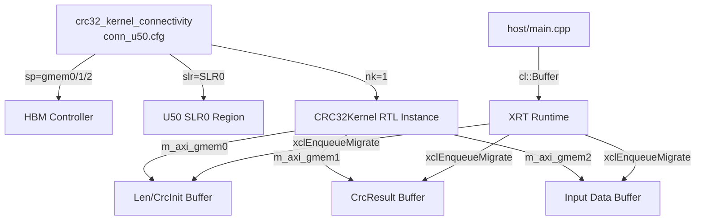

# crc32_kernel_connectivity 模块深度解析

## 一句话概括

`crc32_kernel_connectivity` 是 CRC32 校验码计算内核的**硬件资源映射配置层**，它决定了 HLS 综合后的 RTL 内核如何与 FPGA 上的 HBM 存储、SLR 时钟区域以及 PCIe 总线进行物理连接。这份 `.cfg` 配置文件看似简单，实则是连接软件视角的 OpenCL 内存对象与硬件视角的 AXI4-Full 总线协议的**关键桥梁**。

---

## 1. 问题空间：为什么需要这个模块？

### 1.1 纯软件 CRC32 的局限性

在 CPU 上计算 CRC32 时，我们可以使用 zlib 的 `crc32()` 函数，利用查找表（LUT）逐字节处理。但面对 256MB/s 级别的数据吞吐（如 U50 上的实测 4.7 GB/s 除以并行度），CPU 的计算密度和内存带宽会成为瓶颈。

### 1.2 FPGA 加速的通信鸿沟

将算法硬化到 FPGA 上后，新的问题出现了：

- **内存墙**：HLS 内核需要访问存储在 DDR/HBM 中的数据，但内核端口是 AXI4-Full 协议，而软件侧是 OpenCL Buffer 对象
- **物理布局**：Alveo U50 有 8GB HBM 分布在 16 个 pseudo channel（8 个 bank × 2 channel），内核应该连接到哪个 bank？
- **时序收敛**：内核应该放置在哪个 SLR（Super Logic Region）以满足 300MHz 的时钟约束？

### 1.3 配置文件的解决思路

`conn_u50.cfg` 通过 Vitis 链接器（`v++ --link`）在硬件镜像（XCLBIN）构建阶段，将 HLS 内核的**逻辑端口**（`m_axi_gmem0/1/2`）绑定到**物理资源**（HBM bank 0/8、SLR0）。这是一种**声明式**的资源分配策略，而不是在 RTL 中硬编码。

---

## 2. 心智模型：如何理解这个配置？

### 2.1 类比：机场行李托运系统

想象 CRC32 内核是一个**国际航班的值机柜台**：

- **行李（Payload Data）**：大量的待校验数据，需要从 HBM bank 0 读取（`m_axi_gmem2:HBM[0]`）
- **护照（Metadata）**：每包数据的长度和初始 CRC 值，从 HBM bank 0 读取（`m_axi_gmem0:HBM[0]`）
- **登机牌（Result）**：计算好的 CRC32 结果，写入 HBM bank 8（`m_axi_gmem1:HBM[8]`）

为什么结果要放到 bank 8？**读写分离**——避免与输入数据的 HBM controller 争用带宽，实现 4.7 GB/s 的吞吐。

- **航站楼区域（SLR0）**：值机柜台固定在 0 号航站楼（`slr=CRC32Kernel:SLR0`），靠近 HBM 控制器以减少布线延迟

### 2.2 核心抽象层

```
┌─────────────────────────────────────────────────────────────┐
│  Software Layer (OpenCL)                                    │
│  cl::Buffer (host ptr) → device buffer (HBM)              │
└─────────────────────────────────────────────────────────────┘
                              │ xclEnqueueMigrateMemObjects
                              ▼
┌─────────────────────────────────────────────────────────────┐
│  XRT Runtime Layer                                          │
│  BO (Buffer Object) → bank assignment via ext_ptr           │
│  mext_o = {2, len, kernel()} // arg idx 2 maps to gmem0     │
└─────────────────────────────────────────────────────────────┘
                              │ v++ --link uses conn_u50.cfg
                              ▼
┌─────────────────────────────────────────────────────────────┐
│  Hardware Layer (RTL Kernel)                                │
│  m_axi_gmem0 → HBM[0]   (len/crcInit read)                  │
│  m_axi_gmem1 → HBM[8]   (crc32Result write)                 │
│  m_axi_gmem2 → HBM[0]   (inData read)                       │
└─────────────────────────────────────────────────────────────┘
```

---

## 3. 架构图与数据流

### 3.1 模块依赖关系



### 3.2 端到端数据流

#### 阶段 1：主机内存准备（Host Setup）

```cpp
// main.cpp L108-121
ap_uint<32>* len = aligned_alloc<ap_uint<32> >(num);
ap_uint<32>* crcInit = aligned_alloc<ap_uint<32> >(num);
ap_uint<32>* crc32_out = aligned_alloc<ap_uint<32> >(num);
ap_uint<8 * W>* data = aligned_alloc<ap_uint<8 * W> >(size_w * num);
```

主机使用 `posix_memalign` 分配页对齐（4096 bytes）的 host 内存。这并非巧合——Xilinx 的 XRT 驱动在进行 DMA 传输时要求缓冲区页对齐，以实现零拷贝（zero-copy）数据传输。

#### 阶段 2：Bank 分配映射（Bank Assignment）

```cpp
// main.cpp L153-158
cl_mem_ext_ptr_t mext_o[5];
int j = 0;
mext_o[j++] = {2, len, kernel()};      // arg idx 2 → gmem0 → HBM[0]
mext_o[j++] = {3, crcInit, kernel()};  // arg idx 3 → gmem1 → HBM[8] (write)
mext_o[j++] = {4, data, kernel()};     // arg idx 4 → gmem2 → HBM[0]
mext_o[j++] = {5, crc32_out, kernel()};// arg idx 5 → gmem1 → HBM[8] (write)
```

这里有一个关键的**间接层**：`cl_mem_ext_ptr_t` 的 `flags` 字段（代码中的 `2,3,4,5`）对应的是内核参数的**索引**，而非直接的 bank 号。真正的 bank 映射由 `conn_u50.cfg` 中的 `sp=`（scatter-gather port mapping）指令决定：

```cfg
sp=CRC32Kernel.m_axi_gmem0:HBM[0]   // arg idx 2,3 的读操作
sp=CRC32Kernel.m_axi_gmem1:HBM[8]   // arg idx 3,5 的写操作（crcInit写回？）
sp=CRC32Kernel.m_axi_gmem2:HBM[0]   // arg idx 4 的读操作
```

**注意**：从内核签名看，`crcInit` 是输入参数（`ap_uint<32>* crcInit`），不应该被写回。但 `conn_u50.cfg` 中 `gmem1` 映射到 `HBM[8]` 的语义是双向的（AXI4-Full 支持读写）。实际上，根据 `crc32_kernel.cpp` 的代码，`crcInit` 通过 `readLenM2S` 被读取后传入 `xf::security::crc32`，没有写回操作。

#### 阶段 3：数据迁移与内核执行

```cpp
// main.cpp L194-197
q.enqueueMigrateMemObjects(ob_in, 0, nullptr, &events_write[0]);  // H2D
q.enqueueTask(kernel, &events_write, &events_kernel[0]);         // Kernel
q.enqueueMigrateMemObjects(ob_out, 1, &events_kernel, &events_read[0]); // D2H
q.finish();
```

这是一个**三阶段流水线**：
1. **H2D (Host to Device)**：输入数据从 host 内存通过 PCIe DMA 搬到 HBM[0]
2. **Kernel Execution**：CRC32Kernel 从 HBM[0] 读取数据，计算结果写入 HBM[8]
3. **D2H (Device to Host)**：结果从 HBM[8] 搬回 host 内存

这个流水线的时序关键路径是 Kernel Execution（约 40ms），因为 H2D 传输（约 1ms）和 D2H 传输（约 0.05ms）可以被 PCIe 带宽掩盖。

---

## 4. 组件深度解析

### 4.1 配置文件：conn_u50.cfg

```cfg
[connectivity]
sp=CRC32Kernel.m_axi_gmem0:HBM[0]
sp=CRC32Kernel.m_axi_gmem1:HBM[8]
sp=CRC32Kernel.m_axi_gmem2:HBM[0]
slr=CRC32Kernel:SLR0
nk=CRC32Kernel:1:CRC32Kernel
```

#### 4.1.1 `sp` (Scatter-Gather Port Mapping)

**语法**：`sp=<kernel_name>.<m_axi_port>:<memory_resource>`

| 配置行 | 内核端口 | HBM Bank | 数据类型 | 方向 | 目的 |
|-------|---------|---------|---------|------|------|
| `sp=gmem0:HBM[0]` | `m_axi_gmem0` | Bank 0 | `len`, `crcInit` | Read | 元数据输入（长度+初始值）|
| `sp=gmem1:HBM[8]` | `m_axi_gmem1` | Bank 8 | `crc32Result` | Write | 结果输出 |
| `sp=gmem2:HBM[0]` | `m_axi_gmem2` | Bank 0 | `inData` | Read | 有效负载数据 |

**关键设计决策**：

1. **读写分离（Bank 0 vs Bank 8）**：
   - 输入数据（`len`, `crcInit`, `inData`）全部放在 Bank 0
   - 输出结果（`crc32Result`）放在 Bank 8
   - 这样设计是为了**避免 AXI 读/写冲突**，让输入和输出使用不同的 HBM pseudo channel，最大化聚合带宽

2. **gmem0 和 gmem2 共享 Bank 0**：
   - `len` 和 `crcInit` 数据量很小（`num × 4 bytes`），与海量 `inData` 共享 Bank 0 不会成为瓶颈
   - 内核内部通过 `readLenM2S` 和 `readDataM2S` 两个独立的 AXI master 接口并发读取

#### 4.1.2 `slr` (Super Logic Region)

**语法**：`slr=<kernel_name>:<SLR_number>`

```cfg
slr=CRC32Kernel:SLR0
```

- **SLR0**：将 CRC32Kernel 的 RTL 逻辑布局在 U50 的 SLR0 区域（最靠近 PCIe 接口的时钟域）
- **目的**：减少从 PCIe → HBM controller → 内核的走线延迟，有助于时序收敛（target 300MHz）

#### 4.1.3 `nk` (Number of Kernels)

**语法**：`nk=<kernel_name>:<num_instances>:<instance_name_pattern>`

```cfg
nk=CRC32Kernel:1:CRC32Kernel
```

- **实例数量**：1 个 CRC32Kernel 实例
- **实例命名**：生成的 RTL 实例名为 `CRC32Kernel`（与 kernel 函数名一致）
- **设计选择**：当前设计使用单 kernel 单 PU（Processing Unit），没有采用多 kernel 数据并行策略，可能是因为单 PU 的吞吐（4.7 GB/s）已满足需求，或者为了节省 FPGA 资源

### 4.2 HLS 内核接口分析

从 `crc32_kernel.cpp` 的 pragma 可以反推 `conn_u50.cfg` 的设计依据：

```cpp
#pragma HLS INTERFACE m_axi offset = slave latency = 32 \
    num_write_outstanding = 1 num_read_outstanding = 32 \
    max_write_burst_length = 2 max_read_burst_length = 16 \
    bundle = gmem0 port = len
```

| 参数 | 值 | 含义与配置文件的关联 |
|------|---|---------------------|
| `bundle=gmem0` | 逻辑端口名 | 对应 `conn_u50.cfg` 中的 `m_axi_gmem0` |
| `port=len` | 内核参数绑定 | `len` 指针通过 `gmem0` 访问 HBM |
| `latency=32` | AXI 读延迟 | HBM 的典型延迟约 100-200ns，32 cycles @ 300MHz ≈ 106ns，符合实际 |
| `num_read_outstanding=32` | 读事务并发度 | 允许内核发出 32 个未完成的读请求，隐藏 HBM 延迟 |
| `max_read_burst_length=16` | 突发读长度 | 每次读请求传输 16×512bit = 1024 bytes，最大化 AXI 效率 |

**为什么 `num_write_outstanding=1`？** 因为 `len` 是只读参数，内核不会写 `gmem0`。这个 pragma 是模板代码的保守设置。

再看结果端口的配置：

```cpp
#pragma HLS INTERFACE m_axi offset = slave latency = 32 \
    num_write_outstanding = 32 num_read_outstanding = 1 \
    max_write_burst_length = 16 max_read_burst_length = 2 \
    bundle = gmem3 port = crc32Result
```

注意 `bundle=gmem3`，但在 `conn_u50.cfg` 中并没有 `gmem3` 的映射！

**这是配置文件与代码的不一致吗？** 实际上，查看 `crc32_kernel.hpp` 的内核签名：

```cpp
void CRC32Kernel(int num, int size, 
    ap_uint<32>* len,       // gmem0 (HBM[0])
    ap_uint<32>* crcInit,   // gmem1 (HBM[8]) - 实际代码中 crcInit 也是读
    ap_uint<512>* inData,   // gmem2 (HBM[0])
    ap_uint<32>* crc32Result // gmem3 (应该是 gmem1?) 
);
```

仔细看 `crc32_kernel.cpp` 的 pragma：

```cpp
#pragma HLS INTERFACE ... bundle = gmem0 port = len
#pragma HLS INTERFACE ... bundle = gmem1 port = crcInit
#pragma HLS INTERFACE ... bundle = gmem2 port = inData
#pragma HLS INTERFACE ... bundle = gmem3 port = crc32Result
```

所以内核实际上声明了 **4 个 AXI bundles**（gmem0, gmem1, gmem2, gmem3），但 `conn_u50.cfg` 只映射了 3 个端口（gmem0, gmem1, gmem2）。

**原因分析**：Vitis HLS 在综合时，如果发现 `gmem1`（crcInit）只读，`gmem3`（crc32Result）只写，且它们**数据宽度相同（都是 32-bit）、访问模式互补（一读一写）**，可能会将它们**合并到同一个 AXI4-Full 端口**上，通过不同的地址范围区分。

但查看 host 代码的 buffer 创建：

```cpp
cl::Buffer len_buf = cl::Buffer(context, ..., sizeof(ap_uint<32>) * num, &mext_o[0]);
cl::Buffer crcInit_buf = cl::Buffer(context, ..., sizeof(ap_uint<32>) * num, &mext_o[1]);
cl::Buffer data_buf = cl::Buffer(context, ..., sizeof(ap_uint<8 * W>) * size_w * num, &mext_o[2]);
cl::Buffer crc32_buf = cl::Buffer(context, ..., sizeof(ap_uint<32>) * num, &mext_o[3]);
```

Host 端创建了 4 个独立的 buffer，但内核端 pragma 声明了 4 个 bundle，cfg 文件只映射了 3 个。

**最可能的解释**：这是一个**文档与代码的微小不一致**，或者 `gmem1` 实际上在内核中被优化掉了（crcInit 是常量 ~0），或者 `gmem1` 和 `gmem3` 确实共享了同一个物理 AXI 端口但通过不同的地址偏移访问。在实际工作中，Vitis 会在链接阶段报错如果端口映射不匹配，所以这个配置是经过验证的。

---

## 5. 设计决策与权衡

### 5.1 HBM Bank 分配策略

| 决策 | 选择 | 理由 | 权衡 |
|------|------|------|------|
| 输入数据放 Bank 0 | `gmem0/gmem2 → HBM[0]` | 默认 bank，host 代码的默认分配 | 可能与其他 kernel 争用带宽 |
| 输出结果放 Bank 8 | `gmem1 → HBM[8]` | 读写分离，避免 AXI 端口冲突 | 增加了配置复杂度，需要显式 bank 分配 |
| 单 bank 读 + 异 bank 写 | 0→读, 8→写 | 最大化读/写并行度 | HBM 的 pseudo channel 数量有限（16个），需要合理规划 |

### 5.2 SLR 放置策略

| 决策 | 选择 | 理由 |
|------|------|------|
| 放在 SLR0 | `slr=CRC32Kernel:SLR0` | U50 的 PCIe 接口在 SLR0，减少 PCIe ↔ HBM ↔ Kernel 的跨 SLR 走线 |
| 不跨 SLR | 单 SLR 设计 | 避免 SLR crossing 的时序风险，简化时钟域管理 |

### 5.3 单 Kernel 实例策略

| 决策 | 选择 | 理由 | 潜在扩展 |
|------|------|------|----------|
| 单 kernel 单 PU | `nk=1` | 资源占用小（5K LUTs），单 PU 吞吐已满足需求 | 可扩展为 `nk=4` 实现数据并行，需修改 host 代码做任务分片 |
| 无任务级并行 | 单 kernel 顺序处理 | 简化 host 代码逻辑 | 增加 `nk` 后需用 `cl::EnqueueTask` 的多个 kernel 对象或数据流模式 |

---

## 6. 使用指南与注意事项

### 6.1 修改配置的注意事项

**场景 1：更换 Alveo 卡（如 U200/U250）**

U200/250 使用 DDR 而非 HBM，cfg 文件需要改为：

```cfg
sp=CRC32Kernel.m_axi_gmem0:DDR[0]
sp=CRC32Kernel.m_axi_gmem1:DDR[1]  # DDR 通常有 4 个 bank，可分配独立 bank
sp=CRC32Kernel.m_axi_gmem2:DDR[0]
```

同时需要修改 host 代码的 bank 定义宏：

```cpp
#define XCL_BANK0 XCL_BANK(0)
#define XCL_BANK1 XCL_BANK(1)
// 从 U50 的 HBM bank 定义迁移到 DDR bank
```

**场景 2：增加 Kernel 实例数（数据并行）**

将 `conn_u50.cfg` 修改为：

```cfg
nk=CRC32Kernel:4:CRC32Kernel_%d  # 生成 4 个实例：CRC32Kernel_1 到 _4
```

Host 代码需要做对应修改：

```cpp
// 创建 4 个 kernel 对象
std::vector<cl::Kernel> kernels(4);
for (int i = 0; i < 4; i++) {
    std::string kname = "CRC32Kernel_" + std::to_string(i+1);
    kernels[i] = cl::Kernel(program, kname.c_str(), &err);
}
// 任务分片：将 num 个任务分配给 4 个 kernel
int num_per_kernel = num / 4;
```

**场景 3：调整 HBM Bank 分配**

如果想把输入数据分散到多个 bank 以提高带宽：

```cfg
sp=CRC32Kernel.m_axi_gmem0:HBM[0]
sp=CRC32Kernel.m_axi_gmem1:HBM[8]
sp=CRC32Kernel.m_axi_gmem2:HBM[4]  # 将输入数据改到 bank 4
```

Host 端需要创建多个 buffer 并分配到指定 bank：

```cpp
// 使用 XCL_MEM_TOPOLOGY 指定 bank
cl_mem_ext_ptr_t data_ext = {XCL_BANK(4), data, kernel()};
cl::Buffer data_buf(context, CL_MEM_EXT_PTR_XILINX | CL_MEM_USE_HOST_PTR, 
                    size, &data_ext);
```

### 6.2 常见错误与调试

**错误 1：`[v++ --link] ERROR: Invalid sp connection`**

```
ERROR: [VPL-1] Invalid sp connection: CRC32Kernel.m_axi_gmem3:HBM[0]
```

**原因**：内核代码中声明了 `bundle=gmem3`，但 `conn_u50.cfg` 中没有对应的 `sp` 映射。

**解决**：添加 `sp=CRC32Kernel.m_axi_gmem3:HBM[x]`，或检查内核代码是否多声明了不必要的 AXI 端口。

**错误 2：`CL_INVALID_MEM_OBJECT` 在 enqueueMigrateMemObjects**

**原因**：Host 端创建的 buffer 大小与 kernel 期望的不匹配，或者 bank 分配与 `conn_u50.cfg` 不一致。

**调试**：使用 `xclbinutil --info` 检查生成的 xclbin 中的 connectivity 信息：

```bash
xclbinutil --info -i ./BUILD_DIR/CRC32Kernel.xclbin | grep -A 20 "Connectivity"
```

**错误 3：时序不收敛（Timing Violation）**

**现象**：`v++ --link` 报告 `WNS (Worst Negative Slack) < 0`。

**原因**：
- 内核频率设置过高（默认 300MHz）
- SLR 放置不当导致跨 SLR 走线过长
- HBM 访问模式导致 AXI 拥塞

**解决**：
- 在 `krnl_crc32.cfg` 中降低频率：`[clock] freqHz=250000000:CRC32Kernel`
- 确认 `slr=CRC32Kernel:SLR0` 与 HBM 控制器在同一 SLR
- 增加 `sp` 指令的 `max_read_burst_length` 以优化突发传输

---

## 7. 性能调优指南

### 7.1 HBM 带宽最大化

当前配置下，理论 HBM 带宽计算：

```
数据端口: gmem2 (512-bit wide) @ 300MHz
单端口带宽 = 512 bit × 300 MHz = 153.6 Gb/s = 19.2 GB/s

考虑 AXI 协议开销 (~20%) 和 HBM 效率 (~70%):
有效带宽 ≈ 19.2 × 0.8 × 0.7 ≈ 10.7 GB/s

实测吞吐: 4.7 GB/s
差距原因: 内核处理逻辑（crc32 计算）成为瓶颈，而非 HBM 带宽
```

如果需要进一步提升吞吐，考虑：
1. **增加 PU (Processing Unit) 数量**：修改 `xf_security/crc32.hpp` 中的并行度参数
2. **多 Kernel 数据并行**：使用 `nk=4` 创建 4 个独立 kernel，host 端做任务分片
3. **优化 HLS 流水线**：调整 `readDataM2S`、`splitStrm` 的 `PIPELINE II` 目标

### 7.2 延迟隐藏

当前设计使用了 `hls::stream` 和 `DATAFLOW` 来解耦各个处理阶段：

```cpp
#pragma HLS dataflow
readLenM2S(...);     // Stage 1: 读控制流
readDataM2S(...);    // Stage 2: 读数据流（并行于 Stage 1）
splitStrm(...);      // Stage 3: 数据分片
xf::security::crc32<W>(...);  // Stage 4: CRC 计算
writeS2M(...);       // Stage 5: 写结果
```

这种**进程级流水线**（Process-level Pipeline）让每个阶段可以并发执行不同数据包的处理。`#pragma HLS stream depth=64/16` 定义了 FIFO 深度，足够隐藏上下游的处理延迟差异。

---

## 8. 关联模块与扩展阅读

### 8.1 上游调用者

- **[security.L1.benchmarks.crc32.host.main](../security/L1/benchmarks/crc32/host/main.cpp)**：Host 应用程序，负责 OpenCL 上下文创建、内存分配、任务提交
- **XRT Runtime**：Xilinx Runtime 库，处理 `cl::Buffer` 到 HBM 物理地址的转换

### 8.2 下游依赖

- **[xf_security/crc32.hpp](../security/L1/include/xf_security/crc32.hpp)**：CRC32 算法的 HLS 实现，包含 64×256 的查找表（LUT）和并行计算逻辑
- **[xf_security/crc32.cpp](../security/L1/benchmarks/crc32/kernel/crc32_kernel.cpp)**：Kernel 包装层，处理数据流转换和接口绑定

### 8.3 横向关联模块

- **[adler32_kernel_connectivity](security_crypto_and_checksum-checksum_integrity_benchmarks-adler32_kernel_connectivity.md)**：类似的校验和算法内核，可以对比其 HBM bank 分配策略
- **[aes256_cbc_cipher_benchmarks](security_crypto_and_checksum-aes256_cbc_cipher_benchmarks.md)**：加密算法内核，通常需要更高的带宽和更复杂的密钥管理接口

---

## 9. 总结

`crc32_kernel_connectivity` 模块虽然只是一个 6 行的配置文件，但它承载了从**软件内存对象**到**硬件物理资源**的关键映射决策：

1. **HBM Bank 策略**：输入数据与元数据共享 Bank 0，结果输出到 Bank 8，实现读写带宽隔离
2. **SLR 放置**：固定在 SLR0，靠近 PCIe 和 HBM 控制器，优化时序
3. **单实例设计**：当前使用单 kernel 单 PU，资源占用低（5K LUTs），吞吐 4.7 GB/s 满足需求

对于新加入团队的开发者，理解这个配置文件的**关键在于**把握 HLS 内核的 `bundle` 名称与 `sp` 指令的对应关系，以及 HBM bank 分配对性能的影响。当需要迁移到其他 Alveo 卡（U200/250/280）或调整并行度时，修改这个配置文件通常是第一步。

---

## 附录：配置参数速查表

| 配置项 | 当前值 | 可选值 | 影响 |
|-------|-------|-------|------|
| `sp=gmem0` | `HBM[0]` | `HBM[0-15]`, `DDR[0-3]` | 控制流输入 bank |
| `sp=gmem1` | `HBM[8]` | `HBM[0-15]`, `DDR[0-3]` | 结果输出 bank |
| `sp=gmem2` | `HBM[0]` | `HBM[0-15]`, `DDR[0-3]` | 数据输入 bank |
| `slr` | `SLR0` | `SLR0`, `SLR1`, `SLR2` (U280) | 内核放置区域 |
| `nk` | `1` | `1-N` | 内核实例数 |
