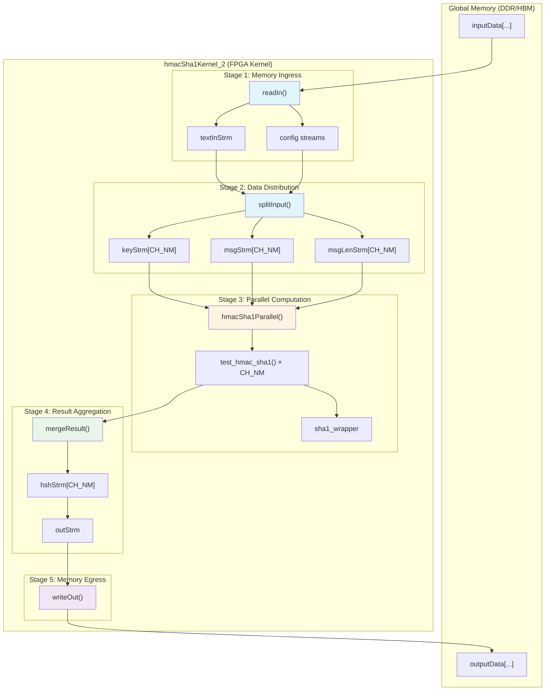

# hmacSha1Kernel2 深度解析

## 一句话概括

`hmacSha1Kernel2` 是一个基于 Xilinx Vitis HLS 的 FPGA 加速核，用于并行计算 HMAC-SHA1 消息认证码。它采用**多通道数据流架构**，像一条"多车道高速公路"般将输入数据分流到多个并行处理单元，实现高吞吐量的批量消息认证。

---

## 问题空间：为什么需要这个模块？

### 背景挑战

在数据中心和网络设备中，HMAC-SHA1 被广泛用于 API 鉴权、消息完整性校验等场景。纯软件实现面临以下瓶颈：

1. **计算密集**：SHA1 涉及大量位运算和循环压缩，CPU 单核性能受限
2. **内存带宽**：高并发场景下，频繁的数据拷贝和缓存未命中成为瓶颈
3. **延迟敏感**：金融交易、实时流处理要求亚毫秒级响应

### 为什么不用朴素方案？

朴素的方法是直接用 HLS 综合一个单通道的 HMAC-SHA1 核。但这会导致：

- **资源利用率低**：FPGA 的 BRAM、DSP slice 大部分闲置
- **吞吐不足**：无法填满 DDR/HBM 内存带宽
- **延迟堆积**：消息排队等待处理

### 核心设计洞察

`hmacSha1Kernel2` 的核心洞察是：**将 HMAC-SHA1 的计算过程流水线化，并通过空间并行（多通道）而非时间复用来提升吞吐**。这类似于将一条单车道道路扩建为四车道高速公路，每辆车（消息）独立通行，互不干扰。

---

## 心智模型：如何理解这个模块？

想象一个**现代化的机场行李处理系统**：

1. **值机柜台（`readIn`）**：旅客（数据块）到达，工作人员扫描机票（读取配置），将行李放入传送带（AXI 总线突发传输）

2. **分拣系统（`splitInput`）**：中央控制器根据航班号（通道 ID），将行李分流到不同的传送带（`msgStrm[CH_NM]`），每条传送带独立运行

3. **安检机群（`hmacSha1Parallel`）**：多个并行的 X 光机（SHA1 计算单元）同时检查不同传送带上的行李，每个 X 光机独立工作，结果（哈希值）流入各自的收集箱

4. **汇总打包台（`mergeResult`）**：工作人员从各个收集箱中取出结果（160-bit 哈希），按照固定格式打包（对齐到 512-bit AXI 字），准备发货

5. **出库装车（`writeOut`）**：打包好的货物通过货车（突发写）运送到仓库（全局内存）

**关键抽象**：
- **流（`hls::stream`）**：隐式 FIFO，连接各处理阶段的"管道"
- **通道（`_channelNumber`）**：空间并行的独立计算路径
- **突发（`_burstLength`）**：内存访问的批量优化，减少 AXI 事务开销

---

## 架构图与数据流



### 关键数据流路径

**1. 配置路径（Configuration Path）**
```
inputData[0..CH_NM-1] 
  → textLengthStrm, textNumStrm, keyInStrm 
  → splitInput 分发给所有通道
```
输入数据的前 `CH_NM` 个 AXI 字包含配置信息：消息长度、消息数量、256-bit HMAC 密钥。这些配置被广播到所有并行通道。

**2. 数据路径（Data Path）**
```
inputData[CH_NM..] 
  → textInStrm (512-bit AXI words)
  → splitInput 拆解为 32-bit words 分发到 msgStrm[channel]
  → hmacSha1Parallel 计算
  → 160-bit hash 结果
```

**3. 控制路径（Control Path）**
```
eLenStrm (end-of-length stream) 
  → 标记消息边界 
  → mergeResult 通过 unfinish 掩码检测所有通道完成
  → eHshStrm 标记输出结束
```

---

## 组件深度解析

### 1. `sha1_wrapper` —— 策略模式适配器

```cpp
template <int msgW, int lW, int hshW>
struct sha1_wrapper {
    static void hash(hls::stream<ap_uint<msgW> >& msgStrm, ...);
};
```

**设计意图**：`xf::security::hmac` 是一个模板化的通用 HMAC 实现，需要与一个满足特定接口的 "Hash Provider" 配合使用。`sha1_wrapper` 充当**适配器模式**（Adapter Pattern）中的 "Target" 角色，将 `xf::security::sha1` 的具体接口转换为 HMAC 模板期望的 `hash()` 静态方法接口。

**关键抽象**：
- **模板参数化**：`msgW`（消息宽度）、`lW`（长度字段宽度）、`hshW`（哈希输出宽度）允许编译时确定位宽，生成优化的硬件电路
- **流式接口**：使用 `hls::stream` 而非数组，明确表达 "生产者-消费者" 关系，使 HLS 工具能自动插入 FIFO 握手逻辑
- **静态多态**：通过模板静态分派，避免虚函数开销，适合 FPGA 内联优化

### 2. `readIn` —— 内存接口与配置提取

```cpp
template <unsigned int _burstLength, unsigned int _channelNumber>
static void readIn(ap_uint<512>* ptr, ...);
```

**架构角色**：这是内核与外部 DDR/HBM 内存的**主要接口**。它负责将 AXI4 总线上的 512-bit 突发传输转换为内部流式处理格式，并提取配置元数据。

**内部机制**：

**阶段 1：配置扫描（LOOP_READ_CONFIG）**
```cpp
for (unsigned char i = 0; i < _channelNumber; i++) {
    ap_uint<512> axiBlock = ptr[i];
    textLength = axiBlock.range(511, 448);  // 64 bits
    textNum = axiBlock.range(447, 384);     // 64 bits  
    key = axiBlock.range(255, 0);         // 256 bits
}
```

输入缓冲区的前 `_channelNumber` 个 512-bit 字包含**全局配置**。这种设计允许每个通道有独立的配置，但代码中通过 `if (i == 0)` 只使用第一组配置广播到所有通道，简化主机端数据准备。

**阶段 2：突发数据读取（LOOP_READ_DATA）**
```cpp
ap_uint<64> totalAxiBlock = textNum * textLength * _channelNumber / 64;

for (ap_uint<64> i = 0; i < totalAxiBlock; i += _burstLength) {
    // 计算本次突发长度 readLen
    for (ap_uint<16> j = 0; j < readLen; j++) {
        #pragma HLS pipeline II = 1
        textInStrm.write(ptr[_channelNumber + i + j]);
    }
}
```

这里体现了**内存访问优化策略**：
- **突发传输（Burst Transfer）**：以 `_burstLength` 为单位批量读取，最大化 AXI 总线效率，减少地址通道开销
- **Pipeline II=1**：每个周期写一个 512-bit 字到流，达到理论峰值带宽
- **地址计算**：`ptr[_channelNumber + i + j]` 跳过配置区域，直接访问数据区

**设计权衡**：
- **轮询式读取 vs 中断驱动**：使用阻塞式 AXI 读，简化控制逻辑，依赖 HLS 工具插入握手信号
- **连续存储 vs 分散收集**：要求主机端将配置和数据紧凑排列，换取硬件简单性

### 3. `splitInput` —— 数据分路与控制分发

```cpp
template <unsigned int _channelNumber, unsigned int _burstLength>
void splitInput(...);
```

**架构角色**：这是内核的"**交通指挥中心**"，负责将宽总线（512-bit AXI 字）解复用为多个窄通道（32-bit 消息字），同时广播密钥和配置到所有并行处理单元。

**关键抽象：GRP_SIZE 与 GRP_WIDTH**

代码中隐含了分组概念（通过 `kernel_config.hpp` 定义的宏）：
- `GRP_SIZE`：每个处理组的消息字数（通常 = 16，即 512/32）
- `GRP_WIDTH`：每个通道的位宽（通常 = 128，即 512/4 通道）
- `CH_NM`（_channelNumber）：并行通道数（通常为 4）

**数据流详解**：

**阶段 1：配置提取**
```cpp
ap_uint<64> textLength = textLengthStrm.read();
ap_uint<64> textLengthInGrpSize = textLength / GRP_SIZE;
ap_uint<64> textNum = textNumStrm.read();
ap_uint<256> key = keyInStrm.read();
```

从上游 `readIn` 的流中提取全局配置。注意 `textLength` 是字节数，除以 `GRP_SIZE`（16）得到 512-bit 块数。

**阶段 2：逐消息分发（LOOP_TEXTNUM）**
```cpp
for (ap_uint<64> i = 0; i < textNum; i++) {
    for (unsigned int j = 0; j < _channelNumber; j++) {
        #pragma HLS unroll
        eMsgLenStrm[j].write(false);  // 非结束标记
        msgLenStrm[j].write(textLength);
        for (unsigned int k = 0; k < (256 / 32); k++) {
            #pragma HLS pipeline II = 1
            keyStrm[j].write(key.range(k * 32 + 31, k * 32));
        }
    }
    // 消息数据...
}
```

这是控制分发的核心逻辑：
- **`#pragma HLS unroll`**：将 `j` 循环（通道循环）完全展开，生成 `_channelNumber` 个并行硬件实例
- **广播模式**：相同的 `textLength` 和 `key`（拆分为 8 个 32-bit 字）写入所有通道的流
- **`eMsgLenStrm[j].write(false)`**：控制流标记，表示"还有数据"

**阶段 3：数据拆分（splitText）**
```cpp
for (int j = 0; j < textLengthInGrpSize; j++) {
    splitText<_channelNumber>(textInStrm, msgStrm);
}
```

对每个 512-bit 输入字调用 `splitText`：
```cpp
ap_uint<512> axiWord = textStrm.read();
for (unsigned int i = 0; i < _channelNumber; i++) {
    #pragma HLS unroll
    for (unsigned int j = 0; j < (512 / _channelNumber / 32); j++) {
        #pragma HLS pipeline II = 1
        msgStrm[i].write(axiWord(i * GRP_WIDTH + j * 32 + 31, ...));
    }
}
```

**位运算解析**：
- `i * GRP_WIDTH`：跳到第 `i` 个通道的起始位（如通道 0 在 bit 0，通道 1 在 bit 128）
- `j * 32`：在通道区域内，跳到第 `j` 个 32-bit 字
- 假设 `CH_NM=4`，`GRP_WIDTH=128`，则每个通道获得 `128/32=4` 个 32-bit 消息字

**设计权衡**：
- **空间并行 vs 时间复用**：选择复制 `_channelNumber` 个完整 HMAC 单元，换取确定性延迟，而非共享计算资源
- **静态调度 vs 动态仲裁**：使用固定轮询（round-robin）而非复杂的优先级仲裁，简化控制逻辑
- **宽总线 vs 窄总线**：512-bit AXI 最大化内存带宽，内部拆分为 32-bit 匹配 HMAC 处理粒度

### 4. `hmacSha1Parallel` —— 并行计算引擎

```cpp
template <unsigned int _channelNumber>
static void hmacSha1Parallel(...);
```

**架构角色**：这是内核的"**计算心脏**"，实例化 `_channelNumber` 个独立的 HMAC-SHA1 处理单元，通过 `hls::stream` 与上下游解耦。

**实现机制**：
```cpp
#pragma HLS dataflow
for (int i = 0; i < _channelNumber; i++) {
    #pragma HLS unroll
    test_hmac_sha1(keyStrm[i], msgStrm[i], ..., hshStrm[i], eHshStrm[i]);
}
```

**HLS 指令解析**：
- **`#pragma HLS dataflow`**：启用**数据流架构**，允许循环迭代重叠执行。每个 `test_hmac_sha1` 调用成为一个独立的硬件进程（process），通过 FIFO 通信
- **`#pragma HLS unroll`**：完全展开循环，生成 `_channelNumber` 个并行的硬件实例，而非顺序执行

**test_hmac_sha1 内部**：
```cpp
static void test_hmac_sha1(...) {
    xf::security::hmac<32, 64, 160, 32, 64, sha1_wrapper>(
        keyStrm, msgStrm, lenStrm, eLenStrm, hshStrm, eHshStrm);
}
```

调用 `xf::security::hmac` 模板类，参数含义：
- `32`：密钥流位宽（32-bit）
- `64`：长度流位宽（64-bit）
- `160`：输出哈希位宽（SHA1 输出 160-bit）
- `32`：消息流位宽（32-bit）
- `64`：内部长度字段
- `sha1_wrapper`：哈希算法提供者（策略模式）

**资源与性能权衡**：
- **空间并行度**：`_channelNumber` 通常设为 4，平衡 LUT/FF 资源消耗与吞吐
- **FIFO 深度**：每个通道的流需要足够深度（`msgDepth = fifoDepth * (512/32/CH_NM)`）以吸收流水线抖动
- **确定性延迟**：HLS dataflow 保证每个消息的处理延迟可预测，适合实时系统

### 5. `mergeResult` —— 结果汇聚与打包

```cpp
template <unsigned int _channelNumber, unsigned int _burstLen>
static void mergeResult(...);
```

**架构角色**：作为"**收集与打包站**"，`mergeResult` 从所有并行通道收集 160-bit 哈希值，将其对齐填充到 512-bit AXI 字，并按突发长度（burst）组织，为内存回写做准备。

**核心算法：轮转收集（Round-Robin Collection）**
```cpp
ap_uint<_channelNumber> unfinish;
for (int i = 0; i < _channelNumber; i++) {
    unfinish[i] = 1;  // 初始化所有通道为"未完成"
}

while (unfinish != 0) {
    for (int i = 0; i < _channelNumber; i++) {
        #pragma HLS pipeline II = 1
        bool e = eHshStrm[i].read();
        if (!e) {
            ap_uint<160> hsh = hshStrm[i].read();
            // 打包到 512-bit...
            counter++;
        } else {
            unfinish[i] = 0;  // 标记该通道已完成
        }
    }
}
```

**关键机制解析**：

**`unfinish` 掩码**：
- 类型 `ap_uint<_channelNumber>` 是一个位向量（bit-vector）
- 每个比特代表一个通道的完成状态：1 = 仍有数据，0 = 已结束
- `while (unfinish != 0)` 确保主循环直到所有通道的 `eHshStrm` 都读到 `true`（结束标记）才退出

**打包逻辑（Packing Logic）**：
```cpp
ap_uint<512> tmp = 0;
tmp.range(159, 0) = hsh.range(159, 0);
outStrm.write(tmp);
```
- SHA1 输出 160-bit，放入 512-bit 字的低 160 位
- 剩余 352 位填零（隐式），这种稀疏打包牺牲存储效率，换取内存对齐和主机端处理简单

**突发长度管理**：
```cpp
if (counter == _burstLen) {
    counter = 0;
    burstLenStrm.write(_burstLen);
}
// 循环结束后处理余数
if (counter != 0) {
    burstLenStrm.write(counter);
}
burstLenStrm.write(0);  // 结束标记
```
- 将连续的哈希输出按 `_burstLen`（如 64）分组，每组作为一个突发事务写入内存
- 最后发送 `0` 作为结束信号，通知 `writeOut` 停止

**设计权衡**：
- **公平性 vs 吞吐**：简单的轮询（round-robin）确保所有通道公平访问输出总线，避免某个通道饿死，但可能不是理论上最优的基于信用的流控
- **打包粒度**：160-bit → 512-bit 的扩展降低了有效带宽利用率（约 31%），但简化了内存对齐和主机端解析，避免了复杂的位偏移计算

### 6. `writeOut` —— 内存回写

```cpp
template <unsigned int _burstLength, unsigned int _channelNumber>
static void writeOut(hls::stream<ap_uint<512> >& outStrm, 
                     hls::stream<unsigned int>& burstLenStrm, 
                     ap_uint<512>* ptr);
```

**架构角色**：作为数据出口的"**发货区**"，`writeOut` 接收打包好的 512-bit 数据字，按照 `mergeResult` 指定的突发长度，通过 AXI4 总线高效写回全局内存。

**实现逻辑**：
```cpp
unsigned int burstLen = burstLenStrm.read();
unsigned int counter = 0;

while (burstLen != 0) {
    for (unsigned int i = 0; i < burstLen; i++) {
        #pragma HLS pipeline II = 1
        ptr[counter] = outStrm.read();
        counter++;
    }
    burstLen = burstLenStrm.read();
}
```

**关键设计点**：

**流水线（Pipeline）优化**：
- `#pragma HLS pipeline II = 1` 指示 HLS 工具以 1 个时钟周期的启动间隔（Initiation Interval）执行循环
- 这意味着每个周期从 `outStrm` 读取一个 512-bit 字并写入内存，达到理论峰值写带宽

**突发事务（Burst Transaction）**：
- 虽然代码中是逐个写入 `ptr[counter]`，但 HLS 的 `m_axi` 接口综合时，会识别到连续地址访问模式，自动聚合为 AXI 突发事务
- `mergeResult` 中按 `_burstLength`（如 64）分组，确保每个 AXI 突发长度接近 64，最大化总线效率

**内存模型与所有权**：
- `ptr` 是由主机（Host）分配并映射到 FPGA 全局内存的缓冲区指针，内核**借用**该指针进行访问
- 内核内部没有动态内存分配（没有 `new`/`malloc`），所有存储都在编译时确定的 FIFO 和寄存器中
- 主机负责确保 `ptr` 指向的缓冲区在核执行期间保持有效（未被提前释放或重新映射）

---

## 依赖关系与数据契约

### 上游依赖（调用本模块）

本模块是一个 FPGA 内核（`extern "C"` 函数），由主机端的 **XRT（Xilinx Runtime）** 或 **OpenCL** 运行时调用。

**数据契约**：
1. **输入缓冲区布局**：`inputData` 必须按以下格式组织：
   - 前 `CH_NM` 个 512-bit 字：配置区，每个字包含 `textLength`（64b）、`textNum`（64b）、`key`（256b）
   - 剩余区域：实际消息数据，按通道交错排列

2. **对齐要求**：`inputData` 和 `outputData` 必须 64 字节对齐（AXI4 要求）

3. **大小限制**：`inputData` 最大 `(1 << 20) + 100` 个 512-bit 字（约 64MB），由顶层数组声明限制

### 下游依赖（本模块调用）

本模块依赖 **Vitis Security Library** 的以下组件：

| 依赖模块 | 路径/命名空间 | 用途 |
|---------|-------------|------|
| `xf::security::sha1` | `<xf_security/sha1.hpp>` | 核心 SHA1 哈希算法 |
| `xf::security::hmac` | `<xf_security/hmac.hpp>` | 基于哈希的 MAC 构造器 |
| `ap_int.h` | HLS 基础库 | 任意精度整数类型 |
| `hls_stream.h` | HLS 基础库 | 流式 FIFO 抽象 |
| `kernel_config.hpp` | 本地头文件 | 编译时常量（CH_NM, GRP_SIZE 等） |

---

## 关键设计决策与权衡

### 1. 并行化策略：空间并行 vs 流水线

**决策**：使用 `_channelNumber`（通常 4）个完全独立的 HMAC 计算单元，而非单个深度流水线的单元。

**理由**：
- **吞吐量**：独立通道可以同时处理 4 条不同消息，理论吞吐提升 4 倍
- **延迟确定性**：每条消息从进入分路到结果输出，延迟固定且可预测（约数百周期），适合实时系统
- **资源效率**：FPGA 有大量 LUT/FF，空间复制比复杂的时间复用控制逻辑更省资源

**权衡代价**：
- **资源消耗**：4 个 HMAC 单元消耗 4 倍 SHA1 核心资源（约 4× 的 LUT、DSP、BRAM）
- **负载不均**：若某条消息特别长，其所在通道会阻塞该通道的后续消息，而其他通道可能空闲（无动态负载均衡）

### 2. 内存接口：突发传输 vs 随机访问

**决策**：所有内存访问都组织为长度为 `_burstLength`（通常 64）的突发事务。

**理由**：
- **AXI 效率**：突发传输摊薄地址通道开销，64 长度突发时数据通道占 100% 带宽，随机访问可能浪费 50% 以上带宽在地址传输
- **HLS 友好**：连续的 `for` 循环访问模式，HLS 能自动识别并综合为突发事务，无需手动 AXI 协议控制

**权衡代价**：
- **延迟**：必须等到凑满 `_burstLength` 个数据字（或最后不满的一包）才发起写事务，引入 `_burstLength` 周期延迟
- **缓冲区**：需要 `fifoDepth = _burstLength * fifobatch` 深度的 FIFO 缓存突发数据，消耗 BRAM

### 3. 流式接口（Streaming）vs 数组存储（Array-based）

**决策**：模块间全部使用 `hls::stream` 而非数组或指针传递数据。

**理由**：
- **显式数据流**：流的 `read()`/`write()` 语义明确表达生产者-消费者关系，HLS 工具自动插入 FIFO 握手（valid/ready），避免手动同步逻辑
- **资源优化**：流的深度（`#pragma HLS stream depth = N`）可针对每个连接单独配置，浅流用 LUTRAM，深流用 BRAM，避免统一大数组的浪费
- **数据流架构**：配合 `#pragma HLS dataflow`，流允许上游函数在下游未完全消费时继续执行，实现任务级并行

**权衡代价**：
- **调试困难**：流的硬件实现是 FIFO，仿真时若读写不匹配（速率不均）会导致死锁，且难以在 C 仿真中复现硬件时序问题
- **状态不可见**：流的内容不像数组可被随机访问调试，需借助 HLS 波形查看 FIFO 占用率
- **接口限制**：流只能在内核内部使用，与外部 DDR 交互必须通过 AXI 指针，`readIn` 和 `writeOut` 承担流-内存转换职责

### 4. 配置广播 vs 独立配置

**决策**：虽然硬件上每个通道有独立的 `keyStrm`、`msgLenStrm`，但 `readIn` 读取配置时只读取第 0 个配置块并广播到所有通道。

**代码体现**：
```cpp
if (i == 0) {
    textLengthStrm.write(textLength);
    textNumStrm.write(textNum);
    keyInStrm.write(key);
}
```

**理由**：
- **主机简化**：主机端只需准备一组配置，而非 `CH_NM` 组，减少 PCIe 传输和主机内存管理复杂度
- **典型用例**：HMAC 认证通常使用相同密钥处理批量消息（如验证同一 API 密钥的多个请求），广播符合常见场景

**权衡代价**：
- **灵活性损失**：无法在一次内核调用中用不同密钥处理不同消息（若需不同密钥，必须分多次调用内核）
- **硬件冗余**：虽然广播配置，但每个通道仍独立存储密钥（256-bit × CH_NM 的寄存器/BRAM），若确实相同则浪费存储

---

## 危险边缘：陷阱、边界条件与隐含契约

### 1. 消息长度约束（Critical）

**隐含假设**：`textLength`（以字节计）必须是 64 的倍数，且必须等于实际提供的数据量。

**原因**：
- 内部使用 `totalAxiBlock = textNum * textLength * _channelNumber / 64` 计算总 512-bit 字数
- `splitText` 每次从 `textInStrm` 读取一个 512-bit 字，不做边界检查
- 若 `textLength` 声明值与实际数据不匹配，会导致：
  - **数据不足**：`textInStrm.read()` 在 FIFO 空时阻塞，内核死锁
  - **数据过剩**：剩余数据被当作下一条消息，导致哈希错误

**规避建议**：
- 主机端必须确保消息按 64 字节对齐（SHA1 块大小为 64 字节，这是自然要求）
- 若原始消息非 64 字节对齐，主机需执行 PKCS#7 或自定义填充后再传入内核

### 2. 突发长度与 FIFO 深度匹配（High Risk）

**隐含契约**：`fifoDepth` 必须 >= `_burstLength * fifobatch`，且 `mergeResult` 的 `counter` 不会溢出。

**代码体现**：
```cpp
const unsigned int fifoDepth = _burstLength * fifobatch;  // 通常是 64 * 4 = 256
// ...
ap_uint<16> readLen;  // mergeResult 中使用 16-bit 计数器
```

**风险**：
- 若 `_burstLength` 设为 256 但 `fifobatch` 保持 4，`fifoDepth=1024`，但 `mergeResult` 中 `counter` 是 `unsigned int`，虽不会溢出，但 `burstLenStrm` 的协调逻辑可能出现缓冲区欠载（underflow）
- 更隐蔽的是，`readIn` 中的 `readLen` 是 `ap_uint<16>`，若 `_burstLength > 65535` 会截断（实际不会，因为 AXI 突发通常最大 256）

**规避建议**：
- 修改 `_burstLength` 时，同步调整 `fifobatch` 和 `fifoDepth` 计算
- 使用 `static_assert`（若 HLS 支持）或编译时检查确保参数一致性

### 3. 流死锁风险（Stream Deadlock）

**模式**：`hls::stream` 是阻塞 FIFO，`read()` 在空时阻塞，`write()` 在满时阻塞。若生产者-消费者速率不匹配或控制流出现环路，会导致**死锁**。

**本模块的高危点**：

**A. `splitInput` 与 `hmacSha1Parallel` 的速率匹配**
- `splitInput` 是生产者，向 `msgStrm[CH_NM]` 写入
- `hmacSha1Parallel` 是消费者，从 `msgStrm[CH_NM]` 读取
- `msgStrm` 的深度为 `msgDepth = fifoDepth * (512/32/CH_NM)`，约 `256 * 4 = 1024`（假设 CH_NM=4）
- 若 HMAC 计算比数据分发慢，FIFO 满后 `splitInput` 阻塞，但这不会死锁，只是背压（back-pressure）
- **真正的危险**：若 `splitInput` 写完一条消息后，`hmacSha1Parallel` 因某种原因未启动（如 `dataflow` 区域未正确建立），会导致 `splitInput` 永远阻塞在 `msgStrm.write()`

**B. `mergeResult` 的 `unfinish` 逻辑**
```cpp
while (unfinish != 0) {
    for (int i = 0; i < _channelNumber; i++) {
        bool e = eHshStrm[i].read();  // 阻塞读！
    }
}
```
- 若某个通道因 bug 未产生 `eHshStrm`（结束标记），`mergeResult` 会永远阻塞在该通道的 `read()` 上
- 这是一个"等待所有子任务完成"的经典模式，任一子任务失败导致整体死锁

**规避策略**：
- 确保 `hmacSha1Parallel` 中的每个 `test_hmac_sha1` 实例最终会消费完所有输入并输出结束标记
- 在 C 仿真（C-simulation）阶段使用 `hls::stream` 的 `size()` 方法（若可用）或检查空满状态调试死锁
- 考虑在硬件仿真（Co-sim）中设置超时检测

### 4. 类型宽度与溢出（Type Width & Overflow）

**风险点 A：`totalAxiBlock` 计算**
```cpp
ap_uint<64> totalAxiBlock = textNum * textLength * _channelNumber / 64;
```
- 虽然使用 `ap_uint<64>`，但 `textNum * textLength` 的乘积若超过 64 位会溢出（C/C++ 语义中，乘积类型由操作数决定，然后才赋值）
- 若 `textNum` 和 `textLength` 都是 `ap_uint<64>`，乘积也是 64 位，溢出后截断
- **后果**：`totalAxiBlock` 计算错误，导致读取过多或过少数据，造成死锁或哈希错误

**风险点 B：`textLengthInGrpSize` 除零**
```cpp
ap_uint<64> textLengthInGrpSize = textLength / GRP_SIZE;
```
- 若 `textLength < GRP_SIZE`（如 16），结果为 0，导致 `splitInput` 中的循环不执行，消息数据被丢弃
- 虽然 HMAC-SHA1 要求消息按 64 字节块处理，但主机端可能传入错误长度

**规避建议**：
- 使用 `ap_uint<128>` 或更大类型进行中间计算，避免溢出
- 添加 `assert(textLength % 64 == 0)` 等运行时检查（在仿真时启用，硬件综合时忽略）
- 主机端严格验证输入参数，确保长度对齐

### 5. HLS 工具特定的隐含契约

**A. `dataflow` 区域的函数限制**
- `hmacSha1Parallel` 使用了 `#pragma HLS dataflow`，要求内部调用的函数必须是"单生产者单消费者"（SSA）形式
- 循环中的 `test_hmac_sha1` 调用因为 `#pragma HLS unroll` 展开成多个独立实例，每个实例有自己的流连接，满足 SSA 要求
- **违规风险**：若在 `dataflow` 区域使用全局变量或静态变量，会导致数据竞争，HLS 可能报错或生成错误硬件

**B. `inline` 控制**
- `splitText` 被标记为 `#pragma HLS inline off`，强制不内联
- 这是为了防止 HLS 将 `splitText` 的逻辑展开到 `splitInput` 中，导致资源爆炸（`splitText` 内部有 `_channelNumber` 重循环）
- **权衡**：函数调用开销（ negligible in hardware）换取资源可控性

**C. 资源指令（RESOURCE pragma）**
```cpp
#pragma HLS resource variable = textInStrm core = FIFO_BRAM
```
- 显式指定 FIFO 使用 BRAM 实现（深度较大时）
- 若深度较小（如 `fifobatch` = 4），使用 `FIFO_LUTRAM` 更节省 BRAM 资源
- **风险**：若深度估计错误，如声明为 LUTRAM 但实际需要存储大量数据，HLS 可能报错或自动降级，导致时序问题

---

## 总结

`hmacSha1Kernel2` 是一个设计精巧的 FPGA 加速内核，它通过**多通道数据流架构**实现了 HMAC-SHA1 的高吞吐并行计算。其核心设计思想包括：

1. **空间并行**：通过 `_channelNumber` 个独立的 HMAC 处理单元，实现消息级并行
2. **流式架构**：使用 `hls::stream` 连接各处理阶段，实现任务级流水线和背压控制
3. **内存优化**：通过突发传输（burst）和宽总线（512-bit AXI）最大化内存带宽利用率
4. **策略模式**：通过 `sha1_wrapper` 适配器，使通用 HMAC 模板与具体 SHA1 实现解耦

对于新加入团队的开发者，理解本模块的关键在于把握**数据流**和**并行性**两个核心维度：数据如何从 DDR 流入，如何在多个通道间分发，如何被并行处理，最后如何汇聚回 DDR。同时，需要特别注意**消息长度对齐**、**FIFO 深度匹配**、**流死锁**等常见陷阱，这些是实际开发和调试中最容易遇到的问题。
