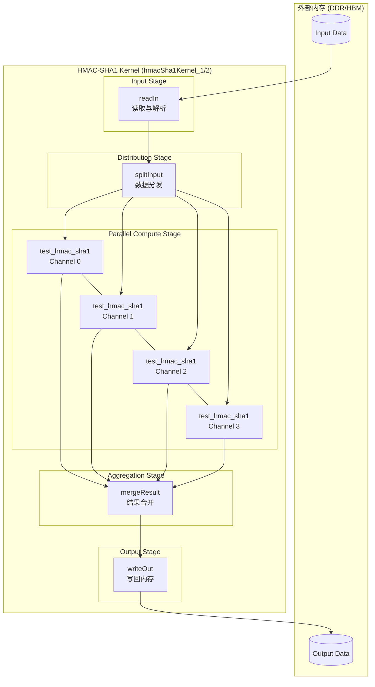
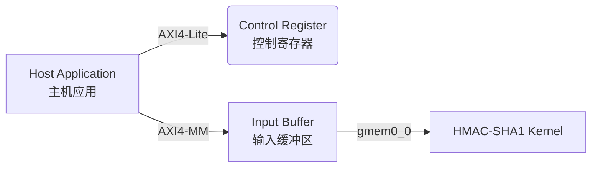
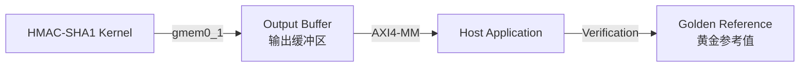
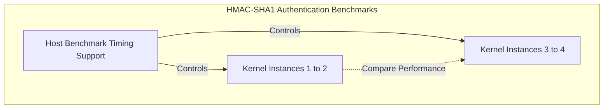

# HMAC-SHA1 Kernel Wrapper 实例 1 & 2 技术深度解析

## 一句话概述

本模块是一对**高吞吐量的 FPGA HMAC-SHA1 加密引擎**，采用**多通道数据流架构**将大规模消息认证计算并行化。想象成一个拥有多个独立收银台的超市——每个通道（channel）独立处理自己的顾客（消息块），共享入口和出口，但通过流水线设计确保整体吞吐最大化。

---

## 问题背景与设计动机

### 我们试图解决什么问题？

在数据中心和网络安全场景中，**HMAC-SHA1**（Hash-based Message Authentication Code）是验证数据完整性和真实性的核心算法。软件实现的瓶颈在于：

1. **计算密集型**：SHA-1 涉及大量位运算和循环，CPU 单核吞吐有限
2. **延迟敏感**：网络安全应用要求微秒级响应
3. **批量处理需求**：需要同时处理成千上万条消息

### 为什么选择 FPGA？

FPGA（现场可编程门阵列）允许我们构建**专用数据通路**，将算法展开成深度流水线，实现**指令级并行 + 数据级并行**的双重加速。

---

## 核心抽象与心智模型

### 架构隐喻：现代化流水线工厂

想象一个处理包裹的自动化工厂：

```
┌─────────────────────────────────────────────────────────────────────┐
│                    HMAC-SHA1 并行处理流水线                          │
├─────────────────────────────────────────────────────────────────────┤
│                                                                     │
│  ┌──────────┐    ┌──────────┐    ┌──────────────────────────┐    │
│  │  卸货区   │───▶│  分拣台   │───▶│  并行处理工作站 (多通道)  │    │
│  │ (readIn) │    │(split)   │    │  ┌────┐┌────┐┌────┐┌────┐ │    │
│  └──────────┘    └──────────┘    │  │CH0 ││CH1 ││CH2 ││CH3 │ │    │
│                                  │  └────┘└────┘└────┘└────┘ │    │
│                                  └──────────┬─────────────────┘    │
│                                             │                      │
│                                             ▼                      │
│                                  ┌──────────────────────────┐     │
│                                  │      质检打包台           │     │
│                                  │   (mergeResult)          │     │
│                                  └──────────┬───────────────┘     │
│                                             │                      │
│                                             ▼                      │
│                                  ┌──────────────────────────┐     │
│                                  │      发货装车区           │     │
│                                  │    (writeOut)            │     │
│                                  └──────────────────────────┘     │
│                                                                     │
└─────────────────────────────────────────────────────────────────────┘
```

**各区域职责**：

1. **卸货区 (readIn)**：从外部内存（DDR/HBM）批量读取原始数据，解析配置信息和消息块
2. **分拣台 (splitInput)**：将大数据块拆分为多个独立流，分发给不同处理通道
3. **并行工作站 (hmacSha1Parallel)**：多个独立通道并行执行 HMAC-SHA1 计算，互不影响
4. **质检打包 (mergeResult)**：收集各通道的输出结果，按突发长度（burst）打包
5. **发货装车 (writeOut)**：将结果批量写回外部内存

### 关键抽象概念

| 概念 | 解释 | 类比 |
|------|------|------|
| **Channel (通道)** | 独立的 HMAC-SHA1 计算单元，可并行处理不同消息 | 工厂里的独立工作台 |
| **Stream (流)** | HLS 提供的 FIFO 数据结构，用于模块间通信 | 传送带 |
| **Burst (突发)** | 一次性传输的连续数据块，优化内存带宽 | 集装箱 |
| **Dataflow (数据流)** | HLS 编译指示，允许函数级流水线并行 | 流水线作业 |
| **Pipeline (流水线)** | 指令级并行，每个时钟周期启动新操作 | 汽车装配线 |

---

## 架构详解与数据流

### 整体架构图



### 端到端数据流详解

#### 阶段 1：内存读取与配置解析 (readIn)

```cpp
template <unsigned int _burstLength, unsigned int _channelNumber>
static void readIn(ap_uint<512>* ptr, ...)
```

**数据流**：
1. **配置块读取**：前 `_channelNumber` 个 512-bit AXI 块包含配置信息
   - `textLength` (64-bit)：每条消息的字节数
   - `textNum` (64-bit)：消息总数
   - `key` (256-bit)：HMAC 密钥
   
2. **数据块读取**：剩余部分是实际的消息数据，按突发长度 `_burstLength` 批量读取

**内存访问优化**：
- 使用突发传输（burst）最大化 AXI 总线带宽
- 双通道内存配置（`gmem0_0` 和 `gmem0_1`）分离读写，避免冲突

#### 阶段 2：数据分发与流式拆分 (splitInput)

```cpp
template <unsigned int _channelNumber, unsigned int _burstLength>
void splitInput(...)
```

**核心逻辑**：
1. **长度信息广播**：将 `textLength` 广播到所有 `_channelNumber` 个通道的 `msgLenStrm`
2. **密钥分发**：将 256-bit 密钥拆分为 8 个 32-bit 字，写入每个通道的 `keyStrm`
3. **消息轮询分发**：通过 `splitText` 将 512-bit AXI 数据轮询分发给各通道
   - 每个通道每次获得 `GRP_WIDTH` 位数据（通常为 32 位）
   - 采用循环方式确保负载均衡

**流控制信号**：
- `eMsgLenStrm`：标记消息边界（`false` 表示有效消息，`true` 表示结束）

#### 阶段 3：并行 HMAC-SHA1 计算 (hmacSha1Parallel)

```cpp
template <unsigned int _channelNumber>
static void hmacSha1Parallel(...)
```

**并行架构**：
- `#pragma HLS dataflow`：启用函数级数据流，允许同时执行多个 `test_hmac_sha1`
- `#pragma HLS unroll`：完全展开循环，为每个通道创建独立的硬件实例

**核心算法链**：
1. **SHA-1 包装器**：`sha1_wrapper` 将 `xf::security::sha1` 适配为 HMAC 所需的接口
2. **HMAC 计算**：`xf::security::hmac` 实现 RFC 2104 标准 HMAC 算法
   - 内部执行两次 SHA-1 计算（inner hash + outer hash）
   - 输出 160-bit (20-byte) 认证标签

**数学表达**：
$$\text{HMAC}(K, m) = H((K' \oplus \text{opad}) \parallel H((K' \oplus \text{ipad}) \parallel m))$$

其中 $H$ 为 SHA-1，$K'$ 为填充后的密钥，$\oplus$ 为异或，$\parallel$ 为连接。

#### 阶段 4：结果合并与突发打包 (mergeResult)

```cpp
template <unsigned int _channelNumber, unsigned int _burstLen>
static void mergeResult(...)
```

**轮询合并策略**：
- 使用 `unfinish` 位掩码跟踪各通道完成状态
- 轮询所有通道的 `eHshStrm`，收集完成的 160-bit HMAC 结果
- 将 160-bit 结果嵌入 512-bit AXI 数据包（高位补零）

**突发长度管理**：
- 累积结果直至达到 `_burstLen`（通常为 64）
- 生成 `burstLenStrm` 控制写回节奏
- 最后刷新剩余数据（`counter != 0`）并发送终止符（`burstLen = 0`）

#### 阶段 5：内存写回 (writeOut)

```cpp
template <unsigned int _burstLength, unsigned int _channelNumber>
static void writeOut(...)
```

**AXI 写优化**：
- 根据 `burstLenStrm` 批量写回结果
- 维护 `counter` 指针跟踪写入位置
- 零拷贝设计：数据从 `outStrm` 直接流向 AXI 总线

---

## 关键设计决策与权衡

### 1. 多通道并行 vs 单通道深度流水线

**选择**：多通道（`CH_NM` 通常为 4 或 8）空间并行

**权衡分析**：

| 方案 | 优势 | 劣势 | 适用场景 |
|------|------|------|----------|
| **多通道并行** (当前设计) | 吞吐随通道数线性增长；各通道独立，易负载均衡 | 资源消耗大（每个通道独立 SHA-1 逻辑）；面积随通道数增长 | 高吞吐、低延迟要求；资源充足的 Alveo/U50 等平台 |
| **单通道深度流水线** | 资源消耗固定；时钟频率可能更高 | 吞吐受限于单通道处理能力；无法并行处理多消息 | 资源受限场景；串行数据流 |
| **混合架构** | 折中方案 | 复杂度最高；调优困难 | 特定负载模式 |

**设计意图**：针对数据中心级加速卡（如 Xilinx Alveo U50/U55C），利用其丰富的 LUT/FF/BRAM 资源，通过空间并行最大化吞吐。

### 2. HLS 数据流 (Dataflow) vs 顺序执行

**选择**：全程使用 `#pragma HLS dataflow`

**技术原理**：
- Dataflow 允许函数级流水线，前一个函数的输出产生后即可被下一个函数消费，无需等待整个函数完成
- 形成"波前"执行模式：读入 → 分发 → 计算 → 合并 → 写出 重叠执行

**权衡**：
- **优势**：吞吐提升接近理论上限（由最慢阶段决定）
- **代价**：增加缓冲区深度（`FIFO_BRAM` 资源）；静态调度增加编译时间；调试复杂度上升

### 3. AXI 突发传输策略

**选择**：显式突发管理（`_burstLength` 模板参数，通常为 64）

**内存访问模式**：
- 读：预读取 `_burstLength` 个 512-bit 块到流缓冲区
- 写：累积 `_burstLength` 个结果后一次性写回

**硬件原理**：
- AXI4 协议中，突发传输（burst）通过减少地址通道握手开销提升有效带宽
- 公式：有效带宽 = (数据量) / (地址延迟 + 数据传输时间)
- 突发长度为 64 时，地址开销分摊到 64 个数据块，效率 >95%

### 4. 任务并行度与资源约束

**关键参数**：`CH_NM`（通道数）、`GRP_SIZE`（分组大小）、`BURST_LEN`（突发长度）

**资源-性能权衡曲线**：

```
吞吐 (GMAC/s)
    │
    │         ●─────────── 饱和区 (内存带宽瓶颈)
    │        ╱
    │       ╱
    │      ╱ 线性增长区
    │     ╱
    │    ╱
    │   ╱
    │  ╱
    │ ╱
    │╱ 启动区 (单通道限制)
    └─────────────────────── 通道数 (CH_NM)
      1  2  3  4  6  8  12 16
```

**设计选择依据**：
- 当前选择 `CH_NM=4` 或 `8`，处于线性增长区，未达到内存饱和
- 若未来平台提供更高 HBM 带宽，可增加通道数至饱和区边界

---

## 模块交互与依赖关系

### 上游依赖（输入来源）



**依赖模块**：
- **Host Benchmark Timing Support** ([host_benchmark_timing_support](security_crypto_and_checksum-hmac_sha1_authentication_benchmarks-host_benchmark_timing_support.md))：提供主机端 OpenCL/XRT 运行时，负责内核启动、缓冲区管理和性能计时
- **GZip Host Library Core** (间接依赖)：提供底层内存管理和 AXI 传输优化

### 下游依赖（输出去向）



**数据契约**：
- 输出格式：每个 HMAC 结果为 160-bit (20 bytes)，嵌入 512-bit AXI 字的高 160 位，低 352 位补零
- 顺序保证：输出顺序与输入消息顺序一致（按消息批次轮询通道）

### 同级模块（其他 HMAC 实例）



**关系说明**：
- **Instances 3-4** ([hmac_sha1_kernel_wrapper_instances_3_4](security_crypto_and_checksum-hmac_sha1_authentication_benchmarks-hmac_sha1_kernel_wrapper_instances_3_4.md)) 是功能相同的另一组内核实例，用于对比不同配置下的性能，或同时运行更多通道
- 两组实例共享同一个主机运行时和计时基础设施

---

## 关键实现细节与注意事项

### 1. HLS 编译指示（Pragma）策略

代码中大量使用 HLS pragma 指导硬件生成，这是理解行为的关键：

```cpp
#pragma HLS dataflow
// 允许函数级流水线并行，形成处理波前

#pragma HLS pipeline II = 1
// 流水线化循环，启动间隔 (Initiation Interval) 为 1 周期

#pragma HLS unroll
// 完全展开循环，创建并行硬件实例

#pragma HLS stream variable = ... depth = ...
#pragma HLS resource variable = ... core = FIFO_BRAM
// 将流映射到 BRAM 实现的 FIFO，指定深度
```

**资源映射策略**：
- **大深度流**（如 `textInStrm`, `msgStrm`, `outStrm`）：使用 `FIFO_BRAM`，利用 Block RAM 的大容量（通常 512-36K 深度）
- **小深度流**（如控制流 `eMsgLenStrm`）：使用 `FIFO_LUTRAM`，利用 LUT RAM 的快速访问和低容量（通常 < 128 深度）

### 2. 参数化设计与模板元编程

模块使用 C++ 模板实现高度可配置性：

```cpp
template <unsigned int _burstLength, unsigned int _channelNumber>
```

**关键模板参数**：
- `_channelNumber` (CH_NM)：并行通道数，决定硬件并行度
- `_burstLength` (BURST_LEN)：内存突发长度，决定内存效率
- `msgW` (消息宽度)：通常为 32-bit，影响流位宽
- `hshW` (哈希宽度)：160-bit (SHA-1 输出)

**配置约束**：
- `GRP_WIDTH = 512 / CH_NM`：必须整除，确保 512-bit AXI 数据均匀分配
- `textLength` 必须是 `GRP_SIZE` 的倍数：确保消息边界对齐

### 3. 流控制与死锁避免

HLS 数据流编程中最危险的陷阱是**死锁**（Deadlock），通常由于 FIFO 深度不足或读取顺序不当导致。

**本模块的流控制策略**：

1. **深度计算**：
   ```cpp
   const unsigned int fifoDepth = _burstLength * fifobatch;  // 通常 64 * 4 = 256
   const unsigned int msgDepth = fifoDepth * (512 / 32 / CH_NM);  // 考虑通道拆分
   ```

2. **顺序保证**：
   - `splitInput` 按顺序轮询写入各通道
   - `mergeResult` 按轮询顺序读取各通道（round-robin）
   - 这确保了即使各通道处理延迟不同，也不会出现饥饿或乱序

3. **结束信号传播**：
   - `eMsgLenStrm`（end-of-message length stream）使用 `bool` 类型标记消息边界
   - `false` 表示有效消息开始，`true` 表示所有消息结束
   - 该信号从 `splitInput` 传播到各通道的 HMAC 计算，再到 `mergeResult`

### 4. 精度与定长算术

**任意精度整数**（`ap_uint<N>`）是 HLS 编程的核心：

```cpp
ap_uint<512> axiBlock;   // 512-bit AXI 数据字
ap_uint<256> key;        // 256-bit HMAC 密钥
ap_uint<160> hsh;        // 160-bit SHA-1 输出
ap_uint<64> textLength;  // 64-bit 长度字段
```

**位域操作**：
```cpp
// 从 512-bit 块中提取字段
textLength = axiBlock.range(511, 448);  // 高 64 位
textNum = axiBlock.range(447, 384);     // 次高 64 位
key = axiBlock.range(255, 0);           // 低 256 位
```

**类型转换安全**：
- 所有位宽在编译期确定，无运行时溢出风险
- 显式的 `range()` 操作避免隐式类型转换导致的截断

### 5. 潜在陷阱与调试建议

#### 陷阱 1：DATAFLOW 违规

**症状**：HLS 编译报错或仿真死锁
**原因**：Dataflow 要求函数间通过 FIFO/流通信，若存在：
- 数组/指针传递（非流式）
- 条件执行导致流读写次数不匹配
-  feedback 循环（当前函数依赖自己的前一个输出）

**检查点**：
```cpp
// 确保所有跨函数通信使用 hls::stream
hls::stream<ap_uint<512>> textInStrm;  // ✅ 正确
ap_uint<512> buffer[256];              // ❌ 错误，会导致 dataflow 违规
```

#### 陷阱 2：FIFO 深度不足

**症状**：运行时的死锁（Deadlock），仿真停滞在某个流读写处
**原因**：上游产生数据快于下游消费，且 FIFO 已满导致阻塞

**计算公式**：
```cpp
// 最小深度 = (生产者峰值速率 - 消费者平均速率) * 突发时间
// 保守策略：深度 = 2 * _burstLength 或更大
```

**调试技巧**：
在 HLS 仿真中启用 FIFO 深度检查：
```cpp
// 在 testbench 中
#define HLS_STREAM_SYNTHESIS
#include <hls_stream.h>
// 运行时会报告 FIFO 满/空状态
```

#### 陷阱 3：通道数与数据位宽不匹配

**症状**：`splitText` 中的位域访问越界，或编译期断言失败
**约束检查**：
```cpp
// 必须满足：512 % (CH_NM * 32) == 0
// 例如：CH_NM=4 时，每组 512/(4*32) = 4 个 32-bit 字
static_assert(512 % (CH_NM * 32) == 0, "Invalid channel configuration");
```

#### 陷阱 4：HLS 接口协议违规

**症状**：硬件协同仿真挂起，或 AXI 总线错误
**AXI 协议要点**：
- `m_axi` 接口要求地址对齐（通常为 512-bit/64-byte 对齐）
- 突发长度 `max_read_burst_length = 64` 必须与代码中的 `_burstLength` 匹配
- 地址偏移计算必须考虑 `_channelNumber` 个配置块

**验证点**：
```cpp
// 确保 ptr 对齐
ap_uint<512>* inputData __attribute__((aligned(64)));

// 总数据量计算
// config 部分: _channelNumber * 512 bits
// data 部分: textNum * textLength * _channelNumber bytes
```

---

## 性能特征与调优指南

### 理论吞吐模型

**参数定义**：
- $f_{clk}$：内核时钟频率（通常为 200-300 MHz）
- $N_{ch}$：通道数 (`CH_NM`)
- $L_{msg}$：单条消息长度（bytes）
- $T_{sha1}$：处理 64-byte 块的周期数（SHA-1 核心延迟）

**吞吐公式**：

$$\text{Throughput} = \min\left(\frac{N_{ch} \cdot f_{clk}}{T_{sha1} \cdot \lceil L_{msg}/64 \rceil}, \text{Memory Bandwidth}\right)$$

**瓶颈分析**：
1. **计算瓶颈**：当消息较长（> 1KB）时，SHA-1 计算成为瓶颈，增加 $N_{ch}$ 可线性提升吞吐
2. **内存瓶颈**：当消息较短（< 256 bytes）时，AXI 总线延迟和协议开销主导，此时应减小 `_burstLength` 以降低延迟

### 资源消耗预估

基于 Xilinx Virtex UltraScale+ 或 Alveo 平台：

| 资源类型 | 单通道估算 | 4 通道总计 | 备注 |
|---------|-----------|-----------|------|
| **LUT** | ~15K | ~60K | 组合逻辑，SHA-1 核心占主要部分 |
| **FF** | ~12K | ~48K | 触发器，流水线寄存器 |
| **BRAM** | ~4 (36Kb) | ~16 | 流缓冲区，主要由 `msgStrm` 和 `outStrm` 消耗 |
| **URAM** | 0-2 | 0-8 | 大深度 FIFO 备选（若 BRAM 不足）|
| **DSP** | 0 | 0 | SHA-1 为位运算，无需乘法器 |

**资源优化建议**：
- 若 BRAM 紧张，可将小深度流（如 `eMsgLenStrm`）映射到 `FIFO_LUTRAM` 或 `FIFO_SRL`（Shift Register LUT）
- 若 LUT 紧张，可减少 `_channelNumber` 或降低 SHA-1 核心的展开因子

### 时钟频率调优

**目标频率**：250-300 MHz（对应 4-3.33 ns 时钟周期）

**关键路径分析**：
1. **SHA-1 核心组合逻辑**：`sha1_wrapper` 中的压缩函数涉及多轮位运算，可能形成长组合路径
2. **跨通道仲裁**：`mergeResult` 中的轮询逻辑若过于复杂，可能成为瓶颈

**优化策略**：
- 在 `xf::security::sha1` 中插入额外流水线级（若库支持）
- 使用 `#pragma HLS pipeline II=1 rewind` 提升循环吞吐
- 对 `mergeResult` 的轮询逻辑使用 `ap_uint` 位操作替代条件分支

---

## 测试、验证与调试

### 验证策略

**1. 黄金参考比对 (Golden Reference)**

使用 OpenSSL 或标准 HMAC-SHA1 实现生成参考值：

```cpp
#include <openssl/hmac.h>

// 计算参考值
unsigned char* result = HMAC(EVP_sha1(), 
                             key, key_len, 
                             message, msg_len, 
                             NULL, NULL);
// 与 FPGA 输出比对
```

**2. 测试向量覆盖**

必须覆盖的边界条件：
- **短消息**：1 byte, 55 bytes (SHA-1 块边界 - 1), 56 bytes (边界), 64 bytes (正好一块)
- **长消息**：1KB, 1MB (测试突发长度边界)
- **多消息边界**：`textNum` 为 1, 2, 1000 (测试循环逻辑)
- **密钥边界**：256-bit 全零, 全一, 随机值

**3. 协仿真 (Co-simulation)**

使用 Vitis HLS 或 Vivado HLS 的 C/RTL 协同仿真：

```bash
# HLS 命令行流程
vitis_hls -f hls_script.tcl

# hls_script.tcl 关键内容
open_project hmac_sha1_prj
set_top hmacSha1Kernel_1
add_files hmacSha1Kernel1.cpp
add_files -tb testbench.cpp
open_solution "solution1"
set_part {xcu50-fsvh2104-2-e}
csim_design  # C 仿真
syn_design   # 综合
cosim_design # C/RTL 协同仿真
```

### 常见问题排查

#### 问题 1：C 仿真通过，但 RTL 协同仿真挂死

**症状**：`cosim_design` 无限运行，无输出
**可能原因**：
1. **FIFO 深度不足**：C 仿真中 `hls::stream` 默认无限深度，RTL 中 FIFO 满导致死锁
   - **解决**：检查所有 `#pragma HLS stream depth=` 是否足够，特别是跨数据流边界的流

2. **数据流死锁**：存在反馈路径或条件执行导致流读写次数不匹配
   - **解决**：确保 `dataflow` 区域内每个流被且仅被读写一次，无条件分支跳过读写

3. **AXI 协议违规**：地址不对齐或突发长度超出设置
   - **解决**：检查 `m_axi` 接口的 `max_read_burst_length` 与代码中 `_burstLength` 匹配

#### 问题 2：结果与黄金参考不一致

**症状**：HMAC 输出值错误
**排查步骤**：
1. **检查输入数据**：确认 `splitText` 的位域提取是否正确，特别是小端/大端转换
   - `ap_uint` 使用小端序（bit 0 为 LSB），但 AXI 总线通常按字节大端传输

2. **检查密钥处理**：HMAC 要求密钥预处理（若超过块大小则先哈希），确认 `xf::security::hmac` 是否正确实现

3. **检查消息长度**：`textLength` 的单位是字节，但 `msgLenStrm` 传递给 HMAC 的可能需要位或字，确认单位转换

#### 问题 3：资源利用率过高，综合失败

**症状**：BRAM 或 LUT 利用率 > 100%
**优化策略**：
1. **减少通道数**：降低 `CH_NM` 从 8 到 4 或 2
2. **减小 FIFO 深度**：降低 `fifobatch` 或 `_burstLength`，但需确保不死锁
3. **优化流资源**：将小深度流改为 `FIFO_LUTRAM` 或 `FIFO_SRL`（使用 LUT 作为移位寄存器）
4. **共享资源**：若通道间密钥相同，考虑共享密钥扩展逻辑（但会牺牲部分并行性）

---

## 扩展与定制指南

### 添加新的哈希算法支持

若需支持 HMAC-SHA256（256-bit 输出）：

1. **创建新包装器**：
```cpp
template <int msgW, int lW, int hshW>
struct sha256_wrapper {
    static void hash(hls::stream<ap_uint<msgW>>& msgStrm,
                     hls::stream<ap_uint<64>>& lenStrm,
                     hls::stream<bool>& eLenStrm,
                     hls::stream<ap_uint<256>>& hshStrm,  // 改为 256-bit
                     hls::stream<bool>& eHshStrm) {
        xf::security::sha256<msgW>(msgStrm, lenStrm, eLenStrm, hshStrm, eHshStrm);
    }
};
```

2. **修改 HMAC 调用**：
```cpp
// 原：160-bit 输出
xf::security::hmac<32, 64, 160, 32, 64, sha1_wrapper>(...);
// 新：256-bit 输出
xf::security::hmac<32, 64, 256, 32, 64, sha256_wrapper>(...);
```

3. **调整输出流位宽**：
```cpp
// 原：160-bit
hls::stream<ap_uint<160>> hshStrm[_channelNumber];
// 新：256-bit
hls::stream<ap_uint<256>> hshStrm[_channelNumber];
```

4. **更新 mergeResult**：
```cpp
// 将 256-bit 结果嵌入 512-bit AXI 字
tmp.range(255, 0) = hsh.range(255, 0);
```

### 支持可变长度消息

当前实现假设所有消息长度相同（`textLength` 为常数）。支持变长消息需：

1. **修改输入格式**：每条消息前添加长度字段
2. **动态拆分逻辑**：在 `splitInput` 中根据每消息长度调整 `splitText` 调用次数
3. **长度流扩展**：`msgLenStrm` 变为每消息一个条目，而非每批次一个

**复杂度**：高，需重写控制逻辑并验证无死锁。

### 与其他加密模块集成

若需在同一 FPGA 上并行运行 AES 和 HMAC：

1. **内存空间划分**：使用不同的 AXI 基地址或不同的 HBM 通道
2. **主机调度**：使用 Xilinx XRT 的异步执行队列，重叠数据传输和计算
3. **数据依赖**：若 AES 输出是 HMAC 输入，使用设备内直接内存访问（D2D）避免主机中转

---

## 子模块文档

本模块包含两个功能相同的内核实现，分别位于以下子模块中：

### [hmacSha1Kernel1](./security_crypto_and_checksum-hmac_sha1_authentication_benchmarks-hmac_sha1_kernel_wrapper_instances_1_2-hmacSha1Kernel1.md)

- **文件**：`security/L1/benchmarks/hmac_sha1/kernel/hmacSha1Kernel1.cpp`
- **顶函数**：`hmacSha1Kernel_1`
- **核心组件**：`sha1_wrapper` 结构体

### [hmacSha1Kernel2](./security_crypto_and_checksum-hmac_sha1_authentication_benchmarks-hmac_sha1_kernel_wrapper_instances_1_2-hmacSha1Kernel2.md)

- **文件**：`security/L1/benchmarks/hmac_sha1/kernel/hmacSha1Kernel2.cpp`
- **顶函数**：`hmacSha1Kernel_2`
- **核心组件**：`sha1_wrapper` 结构体

> **注意**：两个内核文件内容相同，提供两个独立实例以便进行多内核并发测试或资源利用率对比。

---

## 附录：关键配置宏与常量

代码中依赖的配置宏（应在 `kernel_config.hpp` 或编译命令中定义）：

| 宏 | 典型值 | 含义 |
|----|--------|------|
| `CH_NM` | 4 | 并行通道数 (_channelNumber) |
| `BURST_LEN` | 64 | AXI 突发长度 (_burstLength) |
| `GRP_SIZE` | 16 | 消息分组大小（32-bit 字数） |
| `GRP_WIDTH` | 512/CH_NM | 每通道数据位宽 |

**AXI 接口配置**（由 pragma 定义）：
- 总线宽度：512-bit
- 突发模式：INCR（增量突发）
- 最大突发长度：64（对应 4KB 边界）
- 读写 outstanding：16 个事务
- 延迟：64 周期（指示预取深度）
