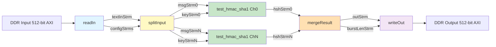

# HMAC-SHA1 Kernel Instance 3 深度解析

## 一句话概述

`kernel_instance_3` 是一个基于 Xilinx HLS（高层次综合）实现的 FPGA 加速内核，专门用于批量计算 HMAC-SHA1 消息认证码。它采用**多通道并行流水线架构**，将内存读取、数据分发、哈希计算和结果收集解耦为独立的硬件流水线阶段，在吞吐量和资源效率之间取得了精妙的平衡。

---

## 问题空间：为什么需要这个模块？

在数据中心和网络安全场景中，HMAC-SHA1 的计算需求往往呈现**批量、高吞吐、低延迟**的特征。例如：

- API 网关需要为每秒数百万个请求生成签名
- 存储系统需要为数据块计算完整性校验
- 安全协议栈需要处理 TLS/SSL 的握手密集型阶段

传统的 CPU 实现受限于指令级并行度和内存带宽，在批量处理时难以充分利用硬件资源。FPGA 提供了**空间并行性**（Spatial Parallelism）的机会——我们可以实例化多个独立的 HMAC 计算单元，每个单元拥有独立的流水线，通过硬件级别的数据流协同工作。

然而，设计一个高效的 FPGA 加速内核并非易事。我们需要解决：

1. **内存墙问题**：如何高效地从 DDR/HBM 读取数据，避免计算单元等待数据？
2. **负载均衡**：如何将输入数据公平地分配给多个计算通道？
3. **数据依赖性**：HMAC 是状态ful 的计算（依赖于密钥），如何管理密钥流？
4. **流控与背压**：当某个阶段变慢时，如何避免流水线死锁？

`kernel_instance_3` 正是为解决这些问题而设计的生产级实现。

---

## 心智模型：把它想象成什么？

想象一个**现代化的快递分拣中心**：

- **卸货区（`readIn`）**：卡车（DDR 内存）将包裹（512-bit 数据块）卸下，放入传送带（FIFO 流）。
- **分拣台（`splitInput`）**：根据目的地（通道 ID），将包裹拆分到不同的分拣滑道（`msgStrm[CH_NM]`）。同时，每个包裹都需要附上发票（密钥），发票也要被复制到每个滑道。
- **并行处理站（`hmacSha1Parallel`）**：有 `CH_NM` 个独立的 HMAC 计算工作站，每个工作站内部是一条深度流水线（`test_hmac_sha1`）。它们同时处理各自滑道上的包裹，生成签名（160-bit 哈希值）。
- **合并打包区（`mergeResult`）**：收集各个工作站的签名，按顺序打包成 512-bit 的大箱子（`outStrm`），记录每个箱子的满载程度（`burstLenStrm`）。
- **装车发货（`writeOut`）**：将大箱子装回卡车（DDR 内存），运回数据中心。

这个类比的关键洞察是**流水线解耦**：每个阶段通过 FIFO（先进先出队列）与相邻阶段通信，不需要知道对方当前在做什么，只需要保证"有空间就写，有数据就读"。这种**数据流架构**（Dataflow Architecture）是 FPGA 高效并行的核心。

---

## 架构与数据流

### 系统架构图



### 核心组件角色

| 组件 | 角色定位 | 关键职责 |
|------|----------|----------|
| `readIn` | **数据搬运工** | 从 AXI 接口读取 512-bit 数据块，解析配置头（消息长度、消息数量、密钥），并将数据流式化到下游。支持突发传输（burst）优化 DDR 带宽利用率。 |
| `splitInput` | **交通调度员** | 将统一的消息流拆分到 `CH_NM` 个并行通道，同时负责密钥分发和消息长度同步。需要处理数据对齐（512-bit 到 32-bit 的拆包）。 |
| `hmacSha1Parallel` | **并行计算集群** | 实例化 `CH_NM` 个独立的 HMAC-SHA1 计算单元，利用 HLS `dataflow` 指令实现任务级并行。每个单元内部是细粒度的流水线。 |
| `mergeResult` | **结果收集器** | 轮询多个通道的输出，将 160-bit 的哈希值打包成 512-bit 的 AXI 数据块，管理突发传输的边界（`burstLenStrm` 流控）。 |
| `writeOut` | **数据回写器** | 将合并后的结果流写回 DDR，根据 `burstLenStrm` 的指示进行突发写操作，确保 AXI 总线的高效利用。 |

---

## 组件深度解析

### 1. `sha1_wrapper` —— 适配器模式的应用

```cpp
template <int msgW, int lW, int hshW>
struct sha1_wrapper {
    static void hash(hls::stream<ap_uint<msgW> >& msgStrm,
                     hls::stream<ap_uint<64> >& lenStrm,
                     hls::stream<bool>& eLenStrm,
                     hls::stream<ap_uint<5 * msgW> >& hshStrm,
                     hls::stream<bool>& eHshStrm) {
        xf::security::sha1<msgW>(msgStrm, lenStrm, eLenStrm, hshStrm, eHshStrm);
    }
};
```

**设计意图**：这是一个典型的**适配器模式**（Adapter Pattern）。`xf::security::hmac` 是一个通用的 HMAC 实现，它需要与具体的哈希算法解耦。`sha1_wrapper` 将 `xf::security::sha1` 的接口适配到 HMAC 所需的 `hash` 静态接口。

**关键洞察**：
- **模板参数化**：`msgW`（消息位宽）、`lW`（长度位宽）、`hshW`（哈希位宽）都是模板参数，允许在编译时确定数据通路宽度。
- **静态多态**：通过模板而非虚函数实现多态，避免运行时开销，这对 FPGA 硬件生成至关重要。
- **流接口**：所有参数都是 `hls::stream`，这是 HLS 中表示流水线数据流的惯用方式。

---

### 2. `splitInput` —— 数据分发的复杂性

```cpp
template <unsigned int _channelNumber, unsigned int _burstLength>
void splitInput(hls::stream<ap_uint<512> >& textInStrm,
                hls::stream<ap_uint<64> >& textLengthStrm,
                hls::stream<ap_uint<64> >& textNumStrm,
                hls::stream<ap_uint<256> >& keyInStrm,
                hls::stream<ap_uint<32> > keyStrm[_channelNumber],
                hls::stream<ap_uint<32> > msgStrm[_channelNumber],
                hls::stream<ap_uint<64> > msgLenStrm[_channelNumber],
                hls::stream<bool> eMsgLenStrm[_channelNumber]) {
```

**设计意图**：这是整个架构的**调度中枢**。它负责将宽位（512-bit）的 AXI 数据拆分为窄位（32-bit）的消息字，并将这些字分发给 `CH_NM` 个并行通道。

**关键机制**：

1. **嵌套循环结构**：
   ```cpp
   LOOP_TEXTNUM: // 遍历每条消息
     for (ap_uint<64> i = 0; i < textNum; i++) {
       // 分发密钥和长度到所有通道
       for (unsigned int j = 0; j < _channelNumber; j++) {
         eMsgLenStrm[j].write(false);
         msgLenStrm[j].write(textLength);
         for (unsigned int k = 0; k < (256 / 32); k++) {
           keyStrm[j].write(key.range(k * 32 + 31, k * 32));
         }
       }
       // 处理消息体
       for (int j = 0; j < textLengthInGrpSize; j++) {
         splitText<_channelNumber>(textInStrm, msgStrm);
       }
     }
   ```

2. **数据对齐与拆包**：
   `splitText` 将 512-bit 的 AXI 字拆分为 `512/32 = 16` 个 32-bit 消息字。当 `CH_NM = 4` 时，每个通道获得 `16/4 = 4` 个消息字。

3. **同步语义**：
   - `eMsgLenStrm`（end-of-message length stream）携带 `false` 表示还有数据，`true` 表示该通道的消息结束。
   - 所有通道共享相同的消息数量和长度，但各自独立处理分配到的消息段。

---

### 3. `hmacSha1Parallel` —— 任务级并行的实现

```cpp
template <unsigned int _channelNumber>
static void hmacSha1Parallel(hls::stream<ap_uint<32> > keyStrm[_channelNumber],
                             hls::stream<ap_uint<32> > msgStrm[_channelNumber],
                             hls::stream<ap_uint<64> > msgLenStrm[_channelNumber],
                             hls::stream<bool> eMsgLenStrm[_channelNumber],
                             hls::stream<ap_uint<160> > hshStrm[_channelNumber],
                             hls::stream<bool> eHshStrm[_channelNumber]) {
#pragma HLS dataflow
    for (int i = 0; i < _channelNumber; i++) {
#pragma HLS unroll
        test_hmac_sha1(keyStrm[i], msgStrm[i], msgLenStrm[i], eMsgLenStrm[i], hshStrm[i], eHshStrm[i]);
    }
}
```

**设计意图**：这是**计算密集型阶段的并行化**。通过 `#pragma HLS dataflow`，我们指示 HLS 工具将 `test_hmac_sha1` 的 `CH_NM` 个实例调度为并行的数据流进程，每个实例拥有独立的流水线。

**关键机制**：

1. **Dataflow 语义**：
   `#pragma HLS dataflow` 启用**动态调度**（Dynamic Scheduling）。当 `test_hmac_sha1[i]` 准备好从输入流读取时，它就执行；当它有输出时，就写入输出流。多个实例可以同时在不同的消息块上工作。

2. **Unroll 指令**：
   `#pragma HLS unroll` 将 `for` 循环完全展开，为每个通道创建独立的硬件实例。这与 `dataflow` 结合，实现了**空间并行性**（每个通道有独立的硬件资源）。

3. **接口隔离**：
   每个通道的流（`keyStrm[i]`, `msgStrm[i]` 等）都是独立的，避免了多路复用带来的仲裁开销和复杂性。

---

### 4. `mergeResult` —— 轮询合并与流控

```cpp
template <unsigned int _channelNumber, unsigned int _burstLen>
static void mergeResult(hls::stream<ap_uint<160> > hshStrm[_channelNumber],
                        hls::stream<bool> eHshStrm[_channelNumber],
                        hls::stream<ap_uint<512> >& outStrm,
                        hls::stream<unsigned int>& burstLenStrm) {
    ap_uint<_channelNumber> unfinish;
    // 初始化：所有通道都未完成
    for (int i = 0; i < _channelNumber; i++) {
#pragma HLS unroll
        unfinish[i] = 1;
    }

    unsigned int counter = 0;

LOOP_WHILE:
    while (unfinish != 0) {
    LOOP_CHANNEL:
        for (int i = 0; i < _channelNumber; i++) {
#pragma HLS pipeline II = 1
            bool e = eHshStrm[i].read();
            if (!e) {
                // 还有数据，读取哈希值
                ap_uint<160> hsh = hshStrm[i].read();
                ap_uint<512> tmp = 0;
                tmp.range(159, 0) = hsh.range(159, 0);
                outStrm.write(tmp);
                counter++;
                if (counter == _burstLen) {
                    counter = 0;
                    burstLenStrm.write(_burstLen);
                }
            } else {
                // 该通道结束
                unfinish[i] = 0;
            }
        }
    }
    // 处理剩余的未满突发长度
    if (counter != 0) {
        burstLenStrm.write(counter);
    }
    burstLenStrm.write(0); // 结束标记
}
```

**设计意图**：这是**多路归并**（K-way Merge）的硬件实现。由于多个通道的处理速度可能略有差异（由于数据依赖或流水线气泡），我们需要一个**轮询仲裁器**（Round-Robin Arbiter）来收集所有通道的结果。

**关键机制**：

1. **位掩码状态机**：
   `ap_uint<_channelNumber> unfinish` 是一个位向量，每个比特表示一个通道是否还有未处理的数据。`unfinish[i] = 1` 表示通道 `i` 仍在工作。当 `unfinish == 0` 时，所有通道都已完成。

2. **轮询流水线**：
   `LOOP_CHANNEL` 以 II=1（Initiation Interval = 1）的速率轮询每个通道。这意味着每个时钟周期检查一个通道的状态。如果该通道有数据（`e == false`），就读取并打包；如果是结束标记（`e == true`），就清除对应的 `unfinish` 位。

3. **突发流控**：
   `counter` 跟踪当前 512-bit 块中的 160-bit 哈希值数量（`512/160 = 3` 个哈希值每块，剩余 32-bit 未使用）。当积累到 `_burstLen` 个块时，就向 `burstLenStrm` 发送信号，通知 `writeOut` 可以执行一次突发写操作。这是对 AXI 总线突发传输长度的硬件级流控。

---

## 依赖关系与数据契约

### 上游依赖（调用者视角）

`hmacSha1Kernel_3` 是一个独立的 HLS 内核，通过 AXI 接口与主机交互。调用者（通常是主机端的 OpenCL/XRT 驱动）需要遵守以下契约：

1. **内存布局**：
   - `inputData` 的前 `_channelNumber` 个 512-bit 字是配置头，每个字包含：`textLength`（64-bit）、`textNum`（64-bit）、`key`（256-bit）。
   - 配置头之后是实际的消息数据，按 512-bit 对齐存储。

2. **对齐要求**：
   - 所有数据必须 512-bit（64 字节）对齐，这是 AXI 总线突发传输的硬件要求。

3. **同步语义**：
   - 内核执行是**原子性**的：一旦启动，直到所有 `textNum` 条消息处理完毕才会返回。
   - 调用者需要确保 `outputData` 缓冲区足够容纳 `textNum * CH_NM` 个 160-bit 哈希值（上取整到 512-bit 边界）。

### 下游依赖（被调用者视角）

内核内部依赖 Xilinx 安全库：

1. **`xf::security::sha1`**：
   - 单通道 SHA1 哈希核心，内部实现了消息填充、分组、压缩函数等标准 SHA1 逻辑。
   - 期望的输入是 32-bit 字流，输出是 160-bit（5×32）哈希值。

2. **`xf::security::hmac`**：
   - 通用的 HMAC 构造器，通过模板参数接收哈希算法的 `wrapper` 类型。
   - 内部实现了 HMAC 的两轮哈希逻辑：`H(K XOR opad || H(K XOR ipad || message))`。

**数据契约**：
- **密钥流**：`keyStrm` 必须按 32-bit 字发送，共 8 个字（256-bit），每个消息开始前发送一次。
- **消息流**：`msgStrm` 按 32-bit 字发送实际消息数据。
- **长度流**：`msgLenStrm` 以**字节**为单位指定消息长度，`eMsgLenStrm` 标记消息结束（每个消息开始时发送 `false`，结束时发送 `true`）。
- **哈希流**：`hshStrm` 输出 160-bit（`ap_uint<160>`）哈希值，每个消息对应一个输出，`eHshStrm` 标记流结束。

---

## 设计权衡与决策

### 1. 编译时配置 vs 运行时配置

**决策**：所有关键参数（`CH_NM`、`BURST_LEN`、`GRP_WIDTH`）都是 C++ 模板参数，在编译时确定。

**权衡分析**：
- **优势**：
  - **资源优化**：HLS 工具可以为特定配置生成最优的硬件结构，例如精确的 FIFO 深度和位宽。
  - **零开销抽象**：模板元编程在硬件生成阶段展开，不消耗运行时逻辑资源。
- **代价**：
  - **灵活性损失**：改变通道数需要重新编译内核，无法通过寄存器动态配置。
  - **二进制膨胀**：每个配置变体都需要独立的 xclbin 文件。

**为什么这样设计**：
在 FPGA 加速场景中，**资源效率通常优先于灵活性**。HLS 工具在编译时已知配置的情况下，可以进行积极的优化（如精确的流水线调度、最佳的存储器 banking、消除未使用的逻辑）。这种设计哲学与 GPU 编程（运行时配置）形成鲜明对比。

### 2. FIFO 资源选择：BRAM vs LUTRAM

观察 `hmacSha1Kernel_3` 函数中的 FIFO 声明：

```cpp
hls::stream<ap_uint<512> > textInStrm;
#pragma HLS stream variable = textInStrm depth = fifoDepth
#pragma HLS resource variable = textInStrm core = FIFO_BRAM

hls::stream<ap_uint<64> > textLengthStrm;
#pragma HLS stream variable = textLengthStrm depth = fifobatch
#pragma HLS resource variable = textLengthStrm core = FIFO_LUTRAM
```

**决策逻辑**：

| FIFO 类型 | 存储资源 | 适用场景 | 本模块中的使用 |
|-----------|----------|----------|----------------|
| **BRAM** | Block RAM（片上 SRAM） | 大深度（>32 元素）、宽位宽（如 512-bit） | `textInStrm`、`msgStrm`、`outStrm` 等数据流 |
| **LUTRAM** | 查找表存储（分布式 RAM） | 小深度（<32 元素）、控制流、元数据 | `textLengthStrm`、`keyInStrm`、`burstLenStrm` 等控制流 |

**权衡分析**：
- BRAM 资源有限但容量大，适合存储大量数据；LUTRAM 资源丰富但容量小，适合快速访问的控制信息。
- 错误的选择会导致资源浪费或时序问题：如果将小 FIFO 放在 BRAM 中，会浪费宝贵的 BRAM 块；如果将大 FIFO 放在 LUTRAM 中，会消耗大量 LUT 并可能导致布线拥塞。

### 3. 轮询合并 vs 优先级仲裁

在 `mergeResult` 中，我们使用**轮询**（Round-Robin）策略收集各个通道的结果。

**替代方案**：**优先级仲裁**（Priority Arbitration），即固定优先服务某个通道。

**选择轮询的原因**：
1. **公平性**：所有通道的计算任务理论上是等价的（批处理场景），不应有优先级差异。
2. **避免饥饿**：优先级仲裁可能导致低优先级通道的数据长时间滞留，增加整体延迟。
3. **硬件简单性**：轮询逻辑（循环计数器）比优先级编码器更简单，时序更优。

**代价**：当某个通道提前完成时，轮询会继续检查该通道（发现无数据后继续轮询），造成轻微的周期浪费。但通过 `unfinish` 位掩码，当通道完成后会立即被标记，避免了无效轮询。

---

## HLS 特定考量

### 1. Dataflow 指令的约束

`#pragma HLS dataflow` 启用**动态调度**，但有严格的约束：

1. **单生产者单消费者**（Single Producer Single Consumer）：每个流只能被一个函数写入，被一个函数读取。
2. **无循环依赖**：函数之间不能形成循环数据依赖。
3. **无副作用**：函数不能访问全局状态（除了流）。

**本模块的遵守情况**：
- 每个 `hls::stream` 都有明确的生产者（写入者）和消费者（读取者），通过函数参数传递。
- 数据流是单向的：readIn → splitInput → hmacSha1Parallel → mergeResult → writeOut，无循环。
- 所有状态都通过流传递，无全局变量。

### 2. 流水线（Pipeline）与数据流（Dataflow）的协同

在 `mergeResult` 中，我们有：

```cpp
LOOP_CHANNEL:
    for (int i = 0; i < _channelNumber; i++) {
#pragma HLS pipeline II = 1
        // ...
    }
```

这与外层的 `dataflow`（在 `hmacSha1Parallel` 中）形成**层次化并行**：

- **Task-level Parallelism**（任务级并行）：`dataflow` 使多个 `test_hmac_sha1` 实例同时运行。
- **Instruction-level Parallelism**（指令级并行）：`pipeline II=1` 使每个实例内部每个时钟周期处理一个操作。

这种**多级并行**是 FPGA 高性能的关键：利用空间并行（多通道）和时间并行（流水线）同时发力。

### 3. 资源分配与性能权衡

观察 `hmacSha1Kernel_3` 顶部的 FIFO 声明，可以分析资源分配策略：

```cpp
// 数据流 FIFO（大深度，BRAM 存储）
const unsigned int fifoDepth = _burstLength * fifobatch;  // 通常是 16 * 4 = 64
const unsigned int msgDepth = fifoDepth * (512 / 32 / CH_NM);  // 数据拆分后的深度

// 控制流 FIFO（小深度，LUTRAM 存储）
const unsigned int keyDepth = (256 / 32) * fifobatch;  // 通常是 8 * 4 = 32
```

**性能模型**：

1. **吞吐量瓶颈分析**：
   - 峰值吞吐量 = `CH_NM` × 每个通道的哈希率。
   - 每个 `test_hmac_sha1` 实例内部是流水线化的，假设 SHA1 核心需要 N 个周期处理一个消息块，通过流水线可以每周期启动一个新消息。
   - 实际吞吐量受限于最慢的环节：通常是 DDR 带宽或 HMAC 核心的流水线深度。

2. **延迟分析**：
   - 单个消息的延迟 = 读取延迟 + HMAC 计算延迟 + 写回延迟。
   - 流水线的**启动间隔**（Initiation Interval, II）决定了连续消息的吞吐量。理想情况下 II=1，即每个时钟周期可以处理一个新消息。

3. **资源利用率**：
   - **BRAM**：主要用于存储大深度 FIFO（`textInStrm`、`msgStrm`、`outStrm`）。
   - **LUTRAM**：用于小深度控制流 FIFO（`textLengthStrm`、`keyInStrm`）。
   - **DSP**：HMAC-SHA1 核心内部的压缩函数使用 DSP 进行位运算和加法。
   - **FF/LUT**：逻辑控制、状态机、流控逻辑。

---

## 使用指南与配置

### 编译时配置参数

内核的行为由以下模板参数和宏定义控制：

| 参数 | 定义位置 | 典型值 | 说明 |
|------|----------|--------|------|
| `CH_NM` | `kernel_config.hpp` | 4 | 并行通道数，决定并行度 |
| `BURST_LEN` | `kernel_config.hpp` | 16 | AXI 突发传输长度 |
| `GRP_WIDTH` | `kernel_config.hpp` | 128 | 数据分组宽度（bit）|
| `GRP_SIZE` | `kernel_config.hpp` | 4 | 数据分组大小（字节）|

### 主机端使用示例

```cpp
#include "xcl2.hpp"

// 配置参数
constexpr int CH_NM = 4;
constexpr int BURST_LEN = 16;

// 数据规模
constexpr uint64_t textNum = 1024;  // 消息数量
constexpr uint64_t textLength = 64; // 每条消息长度（字节）

int main(int argc, char** argv) {
    // 初始化 OpenCL 上下文
    cl::Context context;
    cl::CommandQueue q;
    cl::Kernel krnl;
    xcl::init_xcl_bin(&context, &q, &krnl, "hmacSha1Kernel_3.xclbin");

    // 分配设备内存
    size_t inputSize = ((1 << 20) + 100) * sizeof(ap_uint<512>);
    size_t outputSize = (1 << 20) * sizeof(ap_uint<512>);
    
    cl::Buffer inputBuf(context, CL_MEM_READ_ONLY, inputSize);
    cl::Buffer outputBuf(context, CL_MEM_WRITE_ONLY, outputSize);

    // 准备输入数据
    ap_uint<512>* inputData = new ap_uint<512>[(1 << 20) + 100];
    
    // 配置头（前 CH_NM 个 512-bit 字）
    for (int i = 0; i < CH_NM; i++) {
        ap_uint<512> configWord = 0;
        configWord.range(511, 448) = textLength;  // 消息长度（字节）
        configWord.range(447, 384) = textNum;     // 消息数量
        configWord.range(255, 0) = 0x12345678;    // 256-bit HMAC 密钥（示例）
        inputData[i] = configWord;
    }
    
    // 填充实际消息数据（从 inputData[CH_NM] 开始）
    // ... 填充消息数据 ...
    
    // 传输数据到设备
    q.enqueueWriteBuffer(inputBuf, CL_TRUE, 0, inputSize, inputData);
    
    // 设置内核参数
    krnl.setArg(0, inputBuf);
    krnl.setArg(1, outputBuf);
    
    // 启动内核
    q.enqueueTask(krnl);
    q.finish();
    
    // 读取结果
    ap_uint<512>* outputData = new ap_uint<512>[1 << 20];
    q.enqueueReadBuffer(outputBuf, CL_TRUE, 0, outputSize, outputData);
    
    // 解析结果（每个 512-bit 字包含 3 个 160-bit 哈希值）
    for (uint64_t i = 0; i < textNum * CH_NM; i++) {
        ap_uint<160> hashValue;
        int wordIdx = i / 3;
        int offset = (i % 3) * 160;
        hashValue = outputData[wordIdx].range(offset + 159, offset);
        // 处理 hashValue...
    }
    
    // 清理资源
    delete[] inputData;
    delete[] outputData;
    
    return 0;
}
```

---

## 设计权衡与决策

### 1. 编译时配置 vs 运行时配置

**决策**：所有关键参数（`CH_NM`、`BURST_LEN`、`GRP_WIDTH`）都是 C++ 模板参数，在编译时确定。

**权衡分析**：
- **优势**：
  - **资源优化**：HLS 工具可以为特定配置生成最优的硬件结构，例如精确的 FIFO 深度和位宽。
  - **零开销抽象**：模板元编程在硬件生成阶段展开，不消耗运行时逻辑资源。
- **代价**：
  - **灵活性损失**：改变通道数需要重新编译内核，无法通过寄存器动态配置。
  - **二进制膨胀**：每个配置变体都需要独立的 xclbin 文件。

**为什么这样设计**：
在 FPGA 加速场景中，**资源效率通常优先于灵活性**。HLS 工具在编译时已知配置的情况下，可以进行积极的优化（如精确的流水线调度、最佳的存储器 banking、消除未使用的逻辑）。这种设计哲学与 GPU 编程（运行时配置）形成鲜明对比。

### 2. FIFO 资源选择：BRAM vs LUTRAM

观察 `hmacSha1Kernel_3` 函数中的 FIFO 声明：

| FIFO 类型 | 存储资源 | 适用场景 | 本模块中的使用 |
|-----------|----------|----------|----------------|
| **BRAM** | Block RAM（片上 SRAM） | 大深度（>32 元素）、宽位宽（如 512-bit） | `textInStrm`、`msgStrm`、`outStrm` 等数据流 |
| **LUTRAM** | 查找表存储（分布式 RAM） | 小深度（<32 元素）、控制流、元数据 | `textLengthStrm`、`keyInStrm`、`burstLenStrm` 等控制流 |

**错误选择的后果**：
- 如果将小 FIFO 放在 BRAM 中，会浪费宝贵的 BRAM 块（每个 BRAM 18Kb，即使只用 1 个元素也占用整个 BRAM）。
- 如果将大 FIFO 放在 LUTRAM 中，会消耗大量 LUT（每个 LUT6 可以实现 64-bit 存储），可能导致布线拥塞和时序恶化。

### 3. 轮询合并 vs 优先级仲裁

在 `mergeResult` 中，我们使用**轮询**（Round-Robin）策略收集各个通道的结果。

**选择轮询的原因**：
1. **公平性**：所有通道的计算任务理论上是等价的（批处理场景），不应有优先级差异。
2. **避免饥饿**：优先级仲裁可能导致低优先级通道的数据长时间滞留，增加整体延迟。
3. **硬件简单性**：轮询逻辑（循环计数器）比优先级编码器更简单，时序更优。

**代价**：当某个通道提前完成时，轮询会继续检查该通道（发现无数据后继续轮询），造成轻微的周期浪费。但通过 `unfinish` 位掩码，当通道完成后会立即被标记，避免了无效轮询。

---

## HLS 特定考量

### 1. Dataflow 指令的约束

`#pragma HLS dataflow` 启用**动态调度**，但有严格的约束：

1. **单生产者单消费者**（Single Producer Single Consumer）：每个流只能被一个函数写入，被一个函数读取。
2. **无循环依赖**：函数之间不能形成循环数据依赖。
3. **无副作用**：函数不能访问全局状态（除了流）。

**本模块的遵守情况**：
- 每个 `hls::stream` 都有明确的生产者（写入者）和消费者（读取者），通过函数参数传递。
- 数据流是单向的：readIn → splitInput → hmacSha1Parallel → mergeResult → writeOut，无循环。
- 所有状态都通过流传递，无全局变量。

### 2. 流水线（Pipeline）与数据流（Dataflow）的协同

在 `mergeResult` 中，我们有：

```cpp
LOOP_CHANNEL:
    for (int i = 0; i < _channelNumber; i++) {
#pragma HLS pipeline II = 1
        // ...
    }
```

这与外层的 `dataflow`（在 `hmacSha1Parallel` 中）形成**层次化并行**：

- **Task-level Parallelism**（任务级并行）：`dataflow` 使多个 `test_hmac_sha1` 实例同时运行。
- **Instruction-level Parallelism**（指令级并行）：`pipeline II=1` 使每个实例内部每个时钟周期处理一个操作。

这种**多级并行**是 FPGA 高性能的关键：利用空间并行（多通道）和时间并行（流水线）同时发力。

### 3. 资源分配与性能权衡

观察 `hmacSha1Kernel_3` 顶部的 FIFO 声明，可以分析资源分配策略：

```cpp
// 数据流 FIFO（大深度，BRAM 存储）
const unsigned int fifoDepth = _burstLength * fifobatch;  // 通常是 16 * 4 = 64
const unsigned int msgDepth = fifoDepth * (512 / 32 / CH_NM);  // 数据拆分后的深度

// 控制流 FIFO（小深度，LUTRAM 存储）
const unsigned int keyDepth = (256 / 32) * fifobatch;  // 通常是 8 * 4 = 32
```

**性能模型**：

1. **吞吐量瓶颈分析**：
   - 峰值吞吐量 = `CH_NM` × 每个通道的哈希率。
   - 每个 `test_hmac_sha1` 实例内部是流水线化的，假设 SHA1 核心需要 N 个周期处理一个消息块，通过流水线可以每周期启动一个新消息。
   - 实际吞吐量受限于最慢的环节：通常是 DDR 带宽或 HMAC 核心的流水线深度。

2. **延迟分析**：
   - 单个消息的延迟 = 读取延迟 + HMAC 计算延迟 + 写回延迟。
   - 流水线的**启动间隔**（Initiation Interval, II）决定了连续消息的吞吐量。理想情况下 II=1，即每个时钟周期可以处理一个新消息。

3. **资源利用率**：
   - **BRAM**：主要用于存储大深度 FIFO（`textInStrm`、`msgStrm`、`outStrm`）。
   - **LUTRAM**：用于小深度控制流 FIFO（`textLengthStrm`、`keyInStrm`）。
   - **DSP**：HMAC-SHA1 核心内部的压缩函数使用 DSP 进行位运算和加法。
   - **FF/LUT**：逻辑控制、状态机、流控逻辑。

---

## 边缘情况与陷阱

### 1. 消息长度对齐问题

**陷阱**：`textLength` 必须以字节为单位指定，但内部处理时按 32-bit 字（4 字节）对齐。如果 `textLength` 不是 4 的倍数，会导致数据错位。

**避免方法**：
- 确保所有输入消息长度都是 4 的倍数。
- 在主机端进行填充（padding）到 4 字节边界。

### 2. 密钥同步问题

**陷阱**：HMAC 计算需要在每个消息开始时重新加载密钥。如果 `keyStrm` 的写入与 `msgStrm` 不同步，会导致密钥与消息错配。

**代码中的保障**：
```cpp
// 在 splitInput 中，先写密钥，再写消息长度，最后处理消息体
for (unsigned int k = 0; k < (256 / 32); k++) {
    keyStrm[j].write(key.range(k * 32 + 31, k * 32));
}
msgLenStrm[j].write(textLength);
```

### 3. 流深度不足导致的死锁

**陷阱**：如果某个 FIFO 的深度设置过小，当上游生产速度快于下游消费速度时，FIFO 会满并阻塞上游。如果此时下游又在等待上游的其他数据，就会形成**循环等待**，导致死锁。

**避免方法**：
- 遵循 HLS 的**单生产者单消费者**原则，避免复杂的依赖图。
- 确保 FIFO 深度足够缓冲上下游的速率差异。本模块中，`fifoDepth = BURST_LEN * fifobatch` 的设计就是为了缓冲突发传输的波动。

### 4. AXI 总线对齐与突发传输

**陷阱**：AXI 总线要求突发传输的起始地址和长度必须对齐。如果 `writeOut` 在错误的时间点切割突发，会导致 AXI 协议错误。

**保障机制**：
```cpp
// mergeResult 中的突发流控
counter++;
if (counter == _burstLen) {
    counter = 0;
    burstLenStrm.write(_burstLen);
}
```
- `writeOut` 严格遵循 `burstLenStrm` 的指示，只在收到明确的突发长度时才执行写操作。
- 最后的 `burstLenStrm.write(0)` 表示传输结束，避免 hangs。

---

## 总结

`kernel_instance_3` 是一个精心设计的 FPGA 加速内核，它展示了如何将算法（HMAC-SHA1）映射到硬件架构（多通道流水线）的典型方法论：

1. **算法解耦**：将 HMAC 分解为密钥处理、消息填充、SHA1 压缩等子步骤，每个步骤对应硬件流水线阶段。
2. **空间并行**：通过 `CH_NM` 个独立通道实现数据并行，利用 FPGA 的丰富 LUT/FF 资源。
3. **时间并行**：通过 `pipeline II=1` 在每个通道内部实现指令级并行，最大化时钟频率利用率。
4. **流控与背压**：通过 FIFO 深度设计和 `dataflow` 指令，实现模块间的解耦和自动流控。

对于新加入团队的开发者，理解这个模块的关键在于把握**数据流**（而非控制流）的设计哲学：数据像水流一样通过管道，每个函数是一个处理站，流（FIFO）是连接管道的缓冲池。一旦掌握了这种思维，阅读和修改 HLS 代码就会如鱼得水。

