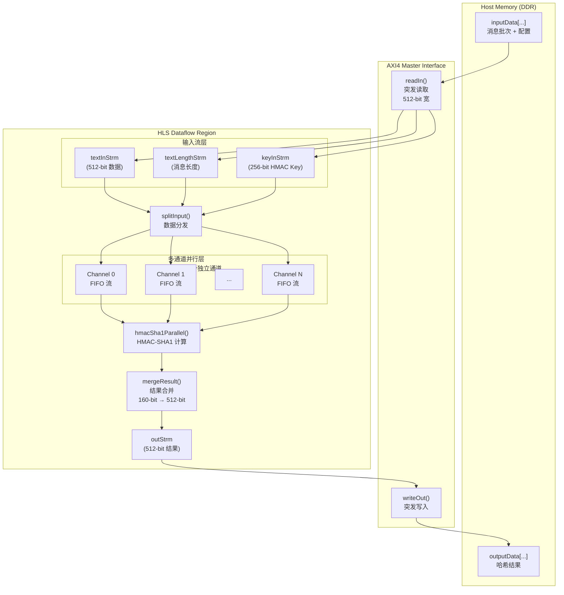

# HMAC-SHA1 Kernel Instance 4 技术深度解析

## 一句话总结

这是一个为 Xilinx FPGA 设计的 HLS（高层次综合）内核，通过**多通道并行流水线**架构，以硬件加速方式实现 HMAC-SHA1 消息认证码计算。它将原本串行的密码学运算拆解为可并行化的流式处理阶段，在吞吐量和资源利用率之间取得了精妙的平衡。

---

## 问题域与设计动机

### 为什么要专门做这个模块？

在数据中心、网络安全设备和区块链验证等场景中，HMAC-SHA1 的计算密集度往往成为系统瓶颈。传统的 CPU 实现虽然灵活，但在处理大批量短消息（如 API 鉴权令牌、TLS 握手验证）时，指令流水线和分支预测的效率极低。

**朴素方案的问题**：
- 顺序处理：SHA1 的 Merkle-Damgård 结构本质是串行的，无法直接并行化
- 内存带宽瓶颈：频繁的主存访问导致计算单元空闲
- 启动开销：每条消息的上下文初始化成本固定，短消息场景下占比过高

**关键洞察**：虽然单条消息的 SHA1 无法并行，但 HMAC（基于哈希的消息认证码）涉及"嵌套哈希"（inner hash + outer hash），且不同消息之间完全独立。因此，我们可以在**消息间并行**（多通道）和**流水线阶段间并行**（数据流架构）两个维度上展开加速。

---

## 核心抽象与心智模型

想象这个内核是一个**高度自动化的分拣-处理-组装工厂**：

1. **进货码头（`readIn`）**：大货车（AXI 总线突发传输）运来原材料（输入消息块），被卸货到分类传送带（FIFO 流）。
2. **分拣中心（`splitInput`）**：中央控制系统根据配置，将混合的货物流分发到**多条并行生产线**（`_channelNumber` 个通道）。每条生产线独立处理一批消息，彼此互不干扰。
3. **加工车间（`hmacSha1Parallel`）**：每条生产线上，HMAC-SHA1 计算单元像流水线工人一样，对经过的消息进行哈希运算。这里是真正的"重工业"——SHA1 压缩函数（80 轮位运算）。
4. **质检打包（`mergeResult`）**：各条生产线产出的哈希值（160 位）被收集、对齐，打包成标准货箱（512 位 AXI 数据宽度）。
5. **出货码头（`writeOut`）**：打包好的产品通过大货车（突发写回）运回仓库（输出内存）。

**关键抽象**：所有组件通过 `hls::stream`（FIFO）连接，形成**确定性数据流图**。没有共享可变状态，没有锁竞争——这在硬件层面实现了"无锁并发"。

---

## 架构全景与数据流



### 关键组件角色

#### 1. `sha1_wrapper` —— 策略适配器
```cpp
template <int msgW, int lW, int hshW>
struct sha1_wrapper {
    static void hash(...) {
        xf::security::sha1<msgW>(...);
    }
};
```
这是一个**策略模式（Strategy Pattern）**的实现。它不直接实现 SHA1，而是作为 `xf::security::hmac` 的适配器，将 Xilinx 安全库的 SHA1 接口桥接到 HMAC 模板中。这种间接层允许在编译时选择不同的哈希算法（如 SHA256）而不修改 HMAC 核心逻辑。

#### 2. `readIn` —— 内存到流的 DMA 引擎
负责从 AXI 总线高效加载数据。关键设计：
- **突发传输（Burst）**：利用 `_burstLength` 模板参数，合并多次读取为一次长突发，最大化总线带宽利用率。
- **配置解析**：前 `_channelNumber` 个 512-bit 块包含元数据（消息长度、批次数量、HMAC 密钥），而非实际消息数据。
- **双缓冲隐式**：通过 FIFO 深度（`fifoDepth`）实现生产-消费解耦。

#### 3. `splitInput` —— 数据分发路由器
将统一的输入流分割到多个并行通道。核心逻辑：
- **消息级并行**：每条消息被分配到特定通道，不同消息之间无依赖，可并行处理。
- **密钥分发**：同一条 HMAC 密钥被广播到所有通道（通过 `keyStrm` 数组）。
- **末端标记（End-of-Message）**：使用 `eMsgLenStrm` 布尔流标记每条消息结束，实现变长消息处理。

#### 4. `hmacSha1Parallel` —— 计算农场
```cpp
#pragma HLS dataflow
for (int i = 0; i < _channelNumber; i++) {
    #pragma HLS unroll
    test_hmac_sha1(...);
}
```
这是**空间并行（Spatial Parallelism）**的核心：
- `#pragma HLS unroll`：将循环展开为 `_channelNumber` 个独立的硬件实例。
- `test_hmac_sha1`：调用 `xf::security::hmac`，内部实现 HMAC 的两层哈希（`H(K XOR opad || H(K XOR ipad || message))`）。
- **数据流（Dataflow）**：允许上游和下游阶段与当前阶段并行执行，形成流水线。

#### 5. `mergeResult` —— 结果收集与对齐
- **宽度转换**：HMAC-SHA1 输出为 160 位，但 AXI 总线为 512 位。`mergeResult` 将多个 160 位结果打包到 512 位宽的字中（`512/160 = 3.2`，实际实现为顺序填充）。
- **突发对齐**：使用 `burstLenStrm` 跟踪打包后的突发长度，确保 `writeOut` 能生成符合 AXI 协议的高效突发写。

#### 6. `writeOut` —— 流到内存的 DMA 引擎
与 `readIn` 对称，负责将结果流写回 DDR。关键特性：
- **突发写合并**：累积到 `_burstLength` 个 512-bit 字后才发起 AXI 写，最大化总线效率。
- **零长度终止**：`burstLenStrm` 中的 `0` 值作为传输完成信号。

---

## 数据流全链路追踪

以**单批次、单消息、`_channelNumber=4`**为例，追踪一个 1024 字节消息的完整生命周期：

### Phase 1: 主机准备（Host Setup）
主机在 DDR 中准备以下数据结构（按 512-bit 对齐）：
```
[Block 0] Metadata for Channel 0:
  - [511:448] textLength = 1024 (bytes)
  - [447:384] textNum = 1 (messages)
  - [255:0]   HMAC Key (256-bit)
[Block 1..3] Metadata for Channels 1..3 (duplicated for simplicity)
[Block 4..]  Message Payload (1024 bytes = 16 x 512-bit blocks)
```

### Phase 2: AXI 读取与配置解析（`readIn`）
1. **配置扫描**：读取前 4 个 512-bit 块（`_channelNumber=4`），提取 `textLength=1024`、`textNum=1`、Key。
2. **突发计算**：`totalAxiBlock = 1 * 1024 * 4 / 64 = 64` 个 512-bit 块需要读取。
3. **突发传输**：以 `_burstLength`（如 16）为单位，发起 AXI 突发读取，将 64 个块泵入 `textInStrm` FIFO。

**流状态**：
- `textInStrm`：64 个 512-bit 消息块
- `textLengthStrm`：1 个 entry（1024）
- `textNumStrm`：1 个 entry（1）
- `keyInStrm`：1 个 entry（256-bit key）

### Phase 3: 输入分发（`splitInput`）
函数消费上游流，生成 `_channelNumber` 组独立流：

1. **消息长度广播**：`msgLenStrm[0..3]` 均写入 1024。
2. **密钥分发**：256-bit key 被拆分为 8 个 32-bit 字，分别写入 `keyStrm[0..3]`。
3. **末端标记**：`eMsgLenStrm[0..3]` 写入 `false`（表示消息开始）。
4. **数据拆分**：64 个 512-bit 块被 `splitText` 处理。每个 512-bit 块被切分为 4 份（`_channelNumber=4`），每份 128-bit（4 x 32-bit），分别进入 `msgStrm[0..3]`。

**流状态（每通道）**：
- `msgStrm[i]`：16 个 512-bit 等效数据（64 总块 / 4 通道 = 16 每通道）
- `msgLenStrm[i]`：1024
- `keyStrm[i]`：8 个 32-bit key 块
- `eMsgLenStrm[i]`：false（消息有效）

### Phase 4: 并行 HMAC-SHA1 计算（`hmacSha1Parallel`）
这是硬件并行度最高的阶段：

1. **`#pragma HLS unroll`**：生成 4 个独立的 `test_hmac_sha1` 实例，每个对应一个通道。
2. **每个实例内部**：
   - 调用 `xf::security::hmac<...>`，内部实现 RFC 2104 标准 HMAC：
     - Inner Hash：`SHA1(Key XOR ipad || message)`
     - Outer Hash：`SHA1(Key XOR opad || inner_hash)`
   - SHA1 核心：80 轮位运算（非线性函数、循环移位、模加）
3. **结果输出**：160-bit HMAC 值写入 `hshStrm[i]`，`eHshStrm[i]` 标记有效。

**性能特征**：
- 4 条消息同时计算，理论吞吐量为单通道的 4 倍
- 每个 `test_hmac_sha1` 内部采用细粒度流水线（`#pragma HLS dataflow`）

### Phase 5: 结果合并与对齐（`mergeResult`）
将 4 个通道的 160-bit 结果打包为 512-bit AXI 字：

1. **轮询收集**：`while (unfinish != 0)` 循环检查 4 个通道的 `eHshStrm`。
2. **打包策略**：每个 160-bit 哈希值被放入 512-bit 容器（`ap_uint<512>`）的 [159:0] 位域。理论上 512/160 = 3.2，无法完全填满，实际实现采用顺序填充（3 个哈希 = 480 bit，剩余 32 bit 空置）。
3. **突发长度跟踪**：累积 `_burstLength`（如 16）个 512-bit 字后，向 `burstLenStrm` 写入突发长度，通知下游发起 AXI 突发写。
4. **终止标记**：所有通道完成后，写入 `burstLen=0` 通知 `writeOut` 结束。

### Phase 6: AXI 写回（`writeOut`）
将打包后的结果流写回 DDR：

1. **突发写循环**：读取 `burstLenStrm`，当不为 0 时，连续读取 `burstLen` 个 512-bit 字，写入 `outputData` 数组。
2. **地址递增**：`counter` 跟踪全局写入位置，确保结果按顺序存放。
3. **完成**：`burstLen=0` 时优雅退出。

---

## 核心组件深度剖析

### `sha1_wrapper` —— 编译时多态的哈希策略

```cpp
template <int msgW, int lW, int hshW>
struct sha1_wrapper {
    static void hash(...) {
        xf::security::sha1<msgW>(...);
    }
};
```

**设计意图**：这是 C++ 模板元编程与 HLS 协同设计的典范。`sha1_wrapper` 不是一个普通的运行时包装器，而是一个**类型级别的适配器**。

- **策略模式（Policy Pattern）**：`xf::security::hmac` 模板接受 `HashPolicy` 作为模板参数。`sha1_wrapper` 就是这个 Policy，允许在不修改 HMAC 核心代码的情况下，替换为 `sha256_wrapper` 或其他哈希算法。
- **编译时解析**：`hash` 是静态方法，所有类型参数（`msgW=32`, `lW=64`, `hshW=160`）在编译时确定，HLS 工具可以生成最优的硬连线逻辑，没有运行时虚函数开销。
- **接口标准化**：统一了不同哈希算法的函数签名，使上层 `hmac` 模板可以泛化调用。

### `readIn` —— 内存到流的 DMA 控制器

**内存所有权模型**：
- **输入**：`ap_uint<512>* ptr` 指向主机分配的 DDR 缓冲区。该模块**借用**此指针，不拥有所有权，不负责释放。
- **输出**：多个 `hls::stream` 对象。这些流在数据流区域内由 HLS 运行时管理，生命周期与函数调用绑定，自动清理。

**关键实现细节**：
1. **配置解析阶段**：首先读取 `_channelNumber` 个 512-bit 配置块。注意代码中的注释："actually the same textLength, msgNum"，意味着所有通道配置相同，这是为了简化输入表结构。
2. **突发长度计算**：`totalAxiBlock = textNum * textLength * _channelNumber / 64`。这里除以 64 是因为 `textLength` 以字节计，而每个 AXI 块 512 位 = 64 字节。
3. **流水线控制**：`#pragma HLS pipeline II = 1` 确保每个时钟周期读取一个 512-bit 块，维持最大内存带宽。

**边界条件**：
- 如果 `totalAxiBlock` 不是 `_burstLength` 的整数倍，最后一次突发会缩短（`readLen = totalAxiBlock - i`）。
- 输入缓冲区必须至少容纳 `_channelNumber` 个配置块 + `totalAxiBlock` 个数据块，否则发生越界访问（未显式检查，属于前置条件）。

### `splitInput` —— 流分发与数据重排

这是架构中**最关键的控制逻辑**，负责将统一输入流转换为多通道并行格式。

**数据转换语义**：
- **输入**：`textInStrm` 包含 512-bit 宽的消息数据，按时间顺序排列（消息 0 的所有块，然后是消息 1...）。
- **输出**：`msgStrm[0.._channelNumber-1]`，每个流包含分配给该通道的消息数据，宽度降为 32-bit（`ap_uint<32>`）以适应 SHA1 处理单元。

**关键算法 - 数据拆分（`splitText`）**：
```cpp
ap_uint<512> axiWord = textStrm.read();
for (unsigned int i = 0; i < _channelNumber; i++) {
    for (unsigned int j = 0; j < (512 / _channelNumber / 32); j++) {
        msgStrm[i].write(axiWord(i * GRP_WIDTH + j * 32 + 31, ...));
    }
}
```
这里发生**位域重排**：
- 每个 512-bit 输入字被视为 `_channelNumber` 个并行组（`GRP_WIDTH = 512 / _channelNumber`）。
- 每组再细分为 32-bit 字（SHA1 的字大小）。
- 因此，通道 `i` 获得输入字的第 `i` 个切片中的所有 32-bit 字。

**示例**（`_channelNumber=4`，`GRP_WIDTH=128`）：
- 输入字：`[B3(128bit) | B2(128bit) | B1(128bit) | B0(128bit)]`
- 通道 0 获得：`B0[31:0], B0[63:32], B0[95:64], B0[127:96]`（4 个 32-bit 字）
- 通道 1 获得：`B1` 的 4 个字，依此类推。

**控制流逻辑**：
- 外层循环 `LOOP_TEXTNUM` 遍历消息批次。
- 内层循环处理每条消息的 `textLength`。
- 每个消息开始时，向所有通道的 `msgLenStrm` 和 `keyStrm` 写入长度和密钥，并设置 `eMsgLenStrm` 为 `false`。
- 批次结束时，所有通道的 `eMsgLenStrm` 写入 `true`，通知下游没有更多消息。

### `hmacSha1Parallel` —— 空间并行计算阵列

这是内核的**计算心脏**，体现了 HLS 硬件设计的核心哲学：**用面积换吞吐量**。

**展开（Unroll）语义**：
```cpp
#pragma HLS dataflow
for (int i = 0; i < _channelNumber; i++) {
    #pragma HLS unroll
    test_hmac_sha1(...);
}
```
- `#pragma HLS unroll` 指示综合工具完全展开循环。如果 `_channelNumber=4`，则生成 4 个完全独立的 `test_hmac_sha1` 硬件实例，每个有自己的输入 FIFO、计算逻辑和输出 FIFO。
- `#pragma HLS dataflow` 允许这 4 个实例与上下游模块形成动态调度流水线，只要输入数据就绪就开始计算，无需等待其他通道。

**HMAC-SHA1 内部机制**：
`test_hmac_sha1` 调用 `xf::security::hmac`，其实现遵循 RFC 2104：
1. **密钥填充**：256-bit 密钥与 `ipad`（0x36 重复）和 `opad`（0x5C 重复）异或。
2. **内部哈希**：`SHA1((K XOR ipad) || message)`，生成 160-bit 中间哈希。
3. **外部哈希**：`SHA1((K XOR opad) || inner_hash)`，生成最终 160-bit HMAC。

**关键约束**：`hmac` 函数内部可能有其自己的流水线约束（如 II=1），要求输入数据以特定速率到达。`sha1_wrapper` 作为策略适配器，确保接口匹配。

### `mergeResult` —— 多路归并与宽度对齐

此模块解决**多生产者单消费者**问题，并进行**数据宽度转换**。

**轮询调度（Round-Robin）逻辑**：
```cpp
while (unfinish != 0) {
    for (int i = 0; i < _channelNumber; i++) {
        // 检查通道 i 是否有数据
        bool e = eHshStrm[i].read();
        if (!e) { 
            // 读取 160-bit 哈希
            ap_uint<160> hsh = hshStrm[i].read();
            // 打包到 512-bit 容器
            ap_uint<512> tmp = 0;
            tmp.range(159, 0) = hsh;
            outStrm.write(tmp);
        } else {
            unfinish[i] = 0; // 标记通道完成
        }
    }
}
```
- **公平性**：每个通道按固定顺序（0→1→2→3）检查，避免某个通道饿死。
- **动态性**：只有当通道有数据时才实际读取（通过 `eHshStrm` 判断），实现异步汇合。

**突发打包**：
- `counter` 跟踪已打包的 512-bit 字数。
- 当达到 `_burstLength` 时，向 `burstLenStrm` 写入该长度，通知 `writeOut` 发起一次 AXI 突发写。
- 最后，如果剩余不足一个突发长度，写入实际剩余数量，再写入 0 标记结束。

### `writeOut` —— AXI 写回控制器

对称于 `readIn`，负责将结果流写回 DDR：

```cpp
unsigned int burstLen = burstLenStrm.read();
while (burstLen != 0) {
    for (unsigned int i = 0; i < burstLen; i++) {
        #pragma HLS pipeline II = 1
        ptr[counter] = outStrm.read();
        counter++;
    }
    burstLen = burstLenStrm.read();
}
```

**关键约束**：`#pragma HLS pipeline II = 1` 确保每个时钟周期写回一个 512-bit 字，维持最大写带宽。

---

## 设计权衡与决策分析

### 1. 并行粒度：消息级并行 vs 块级并行

**选择**：消息级并行（多通道，每通道处理独立消息）。

**权衡分析**：
- **替代方案**：块级并行（单消息内，SHA1 的块级并行）。SHA1 的压缩函数虽可流水线化，但消息块间存在依赖（ chaining variables），无法完全并行。
- **当前优势**：
  - 实现简单，无需处理单消息内的状态同步。
  - 适合批量短消息场景（如 API 鉴权），吞吐随通道数线性增长。
- **代价**：
  - 单条长消息无法利用多通道加速（该消息被绑定到单一通道）。
  - 面积随通道数线性增长（`_channelNumber=4` 意味着 4 套 HMAC 逻辑）。

### 2. 数据流架构 vs 控制流架构

**选择**：纯数据流（`hls::stream` + `dataflow`）。

**权衡分析**：
- **替代方案**：共享内存 + 标志位同步（CPU 风格）。使用 BRAM 作为消息缓冲区，通过轮询标志位协调生产者-消费者。
- **当前优势**：
  - **确定时序**：FIFO 天然提供反压（backpressure），上游模块在 FIFO 满时自动停顿，无需显式同步逻辑。
  - **模块化**：各阶段（read/split/compute/merge/write）编译为独立的数据流进程，可独立优化（pipeline/unroll）。
  - **无死锁**：无显式锁，避免循环依赖导致的死锁（只要数据流图无环）。
- **代价**：
  - **FIFO 深度敏感**：过浅的 FIFO 导致频繁停顿，过深浪费 BRAM 资源。代码中使用 `fifoDepth = _burstLength * fifobatch`（如 16*4=64）进行权衡。
  - **顺序约束**：`mergeResult` 的轮询逻辑要求所有通道大致同速，否则快通道需等待慢通道，造成 FIFO 积压。

### 3. AXI 突发长度与 FIFO 深度的匹配

**选择**：`_burstLength` 模板参数（如 16），FIFO 深度为 `_burstLength * 4`。

**权衡分析**：
- **理论最优**：突发长度应匹配 AXI 总线仲裁器和 DDR 控制器的最优突发大小（通常为 16 或 32 拍，每拍 512-bit）。
- **实际约束**：
  - **延迟隐藏**：较大的突发减少 AXI 地址阶段开销，但增加延迟（需等待更多数据）。
  - **资源权衡**：FIFO 深度与突发长度成正比，加倍突发长度意味着加倍 BRAM 使用。
- **代码策略**：通过 `fifobatch=4` 提供 4 倍突发深度的缓冲，确保即使下游处理出现短暂停顿，上游的突发读取也能持续进行。

### 4. 密钥处理：广播 vs 独立流

**选择**：单 `keyInStrm` 输入，在 `splitInput` 中广播到所有通道。

**权衡分析**：
- **场景假设**：当前设计假设同一批次消息使用相同的 HMAC 密钥（这是 HMAC 加速器的典型用例，如验证一批 API 请求的签名）。
- **优化**：只需一个 256-bit 密钥输入，减少输入带宽和配置复杂度。
- **局限性**：如果需要在同一批次中验证不同密钥的消息，当前架构无法支持（需修改 `splitInput` 使每个通道从独立配置块读取密钥）。

---

## 使用指南与扩展点

### 配置参数（编译时常量）

模块通过以下模板参数和宏进行配置：

| 参数 | 位置 | 建议范围 | 说明 |
|------|------|----------|------|
| `_channelNumber` | `CH_NM` 宏 | 1-16 | 并行通道数。受限于 FPGA LUT/FF 资源和 BRAM 用于 FIFO。超过 8 时需注意布局布线压力。 |
| `_burstLength` | `BURST_LEN` 宏 | 4-64 | AXI 突发长度。应匹配目标平台的 DDR 控制器最优突发大小（Alveo 卡通常为 16 或 32）。 |
| `fifobatch` | 硬编码（4） | 2-8 | FIFO 深度乘数。`fifoDepth = _burstLength * fifobatch`。增加可减少反压，但消耗更多 BRAM。 |

**配置示例**（适用于 Alveo U250）：
```cpp
#define CH_NM 4
#define BURST_LEN 16
// 结果：4 并行通道，每次突发 16 个 512-bit 字，FIFO 深度 64
```

### 输入缓冲区布局要求

主机必须按以下格式准备 `inputData`：

```
[0]: 配置块 0
    - [511:448] textLength (64-bit, 字节为单位)
    - [447:384] textNum (64-bit, 消息数量)
    - [255:0]   HMAC Key (256-bit)
[1]: 配置块 1 (CH_NM >= 2 时需要)
    ... 重复配置块 0 的内容 ...
[CH_NM-1]: 配置块 CH_NM-1
[CH_NM]: 数据块 0 (消息 0 的前 64 字节)
[CH_NM+1]: 数据块 1
...
[CH_NM + totalAxiBlock - 1]: 最后一个数据块
```

**重要约束**：
- `textLength` 必须是 64 的倍数（因为 AXI 宽度为 512 位 = 64 字节）。代码中没有显式检查非对齐输入，非对齐会导致错误解析。
- `textNum` 是**每个通道**的消息数量，总消息数为 `textNum * CH_NM`。
- 所有消息必须具有相同的 `textLength`（由配置块设计决定）。

### 扩展点：支持变长消息

当前架构要求同一批次所有消息长度相同。如需支持变长消息，需修改以下组件：

1. **输入格式**：每个消息前添加长度头，或使用（长度，指针）描述符表。
2. **`splitInput`**：不再使用固定的 `textLength`，而是从输入流动态读取每条消息的长度，并相应控制内层循环次数。
3. **`mergeResult`**：需处理不同长度消息产生的哈希结果（虽然哈希输出长度固定为 160 位，但消息完成时间不同，需确保顺序或添加标识符）。

### 扩展点：替换哈希算法

如需从 SHA1 升级到 SHA256：

1. **修改 `sha1_wrapper`**：
   ```cpp
   struct sha256_wrapper {
       static void hash(...) {
           xf::security::sha256<msgW>(...); // 假设库提供 SHA256
       }
   };
   ```
2. **更新 HMAC 调用**：
   ```cpp
   xf::security::hmac<32, 64, 256, 32, 64, sha256_wrapper>(...);
   // 注意：输出宽度从 160 改为 256
   ```
3. **调整输出流宽度**：
   `hshStrm` 从 `ap_uint<160>` 改为 `ap_uint<256>`，`mergeResult` 中的打包逻辑需相应调整（256-bit 哈希无法整齐放入 512-bit 容器，需处理对齐）。

---

## 陷阱与边缘情况

### 1. FIFO 深度不足导致的死锁

**症状**：仿真或硬件执行挂起，无输出。
**原因**：`hmacSha1Parallel` 阶段处理速度可能慢于 `splitInput` 分发速度。如果 `msgStrm[i]` 的 FIFO 深度不足以缓冲整个消息，而 `splitInput` 试图写入已满的 FIFO，且 `hmacSha1Parallel` 因下游 `hshStrm` 满而停滞，则形成循环依赖死锁。
**预防**：确保 `msgDepth = fifoDepth * (512 / 32 / CH_NM)` 足够大，能容纳至少一条完整消息的所有 32-bit 字。对于 1024 字节消息和 CH_NM=4，需要 256 个 32-bit 字每通道，FIFO 深度应 >256。

### 2. 未对齐的文本长度

**症状**：输出哈希值错误，或 `readIn` 中的 `totalAxiBlock` 计算产生分数，导致读取过量或不足。
**原因**：`textLength` 以字节计，但 AXI 宽度为 64 字节。如果 `textLength` 不是 64 的倍数，`totalAxiBlock` 的整数除法会截断余数，导致数据丢失。
**约束**：调用者必须保证 `textLength % 64 == 0`。代码中无运行时检查，违反此约束属于未定义行为。

### 3. 密钥一致性问题

**症状**：多通道模式下，各通道计算结果不一致，或只有通道 0 结果正确。
**原因**：`readIn` 仅将第一个配置块（`i==0`）的内容写入 `textLengthStrm` 等流，但 `splitInput` 将同一密钥广播到所有通道。如果主机错误地为每个通道配置了不同密钥（期望每个通道使用自己的密钥），实际所有通道都会使用通道 0 的密钥。
**预期行为**：当前设计假设同一批次所有消息使用相同 HMAC 密钥。如需每通道不同密钥，需修改 `readIn` 使所有配置块都入流，并修改 `splitInput` 使每通道从对应配置块读取密钥。

### 4. 突发长度与 DDR 控制器不匹配

**症状**：实测带宽远低于理论峰值，或 AXI 总线出现大量窄传输（narrow bursts）。
**原因**：`_burstLength` 设置与目标 FPGA 板卡的 DDR 控制器最优突发大小不匹配。例如，Alveo U280 的 HBM 控制器偏好 64-byte 对齐的突发，而某些 DDR 控制器可能对长于 16 拍的突发效率下降。
**调优建议**：根据目标平台的《性能调优指南》调整 `BURST_LEN`。通常 16 或 32 是安全选择。在 HLS 仿真阶段使用 `cosim` 验证 AXI 协议合规性。

### 5. 资源耗尽与布局布线失败

**症状**：Vivado 实现阶段报告 LUT/FF/BRAM 利用率超过 100%，或布线拥塞（congestion）导致时序收敛失败。
**原因**：`_channelNumber` 设置过高，导致 `hmacSha1Parallel` 展开过多 SHA1 计算单元。每个 SHA1 实例包含大量的组合逻辑（80 轮迭代，每轮多个 32-bit 加法、位运算、查找表），且内部需要存储 512-bit 消息块和 160-bit 内部状态。
**缓解策略**：
- 降低 `CH_NM`（如从 8 降到 4 或 2）。
- 在 HLS 阶段使用 `#pragma HLS allocation` 限制 SHA1 函数实例数量（以吞吐量为代价换取面积）。
- 启用 HLS 的 `latency` 约束，允许工具以增加迭代间隔（II）为代价共享计算资源。

---

## 依赖关系与调用约定

### 本模块依赖的外部组件

| 依赖 | 类型 | 说明 |
|------|------|------|
| `xf::security::sha1` | Xilinx 安全库 | SHA1 核心实现，位于 `xf_security` 库。要求包含 `xf_security/sha1.hpp`。 |
| `xf::security::hmac` | Xilinx 安全库 | HMAC 框架，位于 `xf_security/hmac.hpp`。依赖 `sha1_wrapper` 作为策略参数。 |
| `ap_int.h` | HLS 基础库 | 提供 `ap_uint<N>` 任意精度整数类型，是 HLS 与 C++ 的桥梁。 |
| `hls_stream.h` | HLS 基础库 | 提供 `hls::stream` FIFO 抽象，用于数据流建模。 |
| `kernel_config.hpp` | 项目配置 | 包含 `CH_NM`（通道数）、`BURST_LEN`（突发长度）、`GRP_SIZE` 等编译时常量。 |

### 依赖本模块的调用者

`hmacSha1Kernel_4` 作为**顶层内核（Top Kernel）**，被 Vitis 运行时（XRT）直接调用。典型的调用链路如下：

```
Host Application (C++/Python)
    └── XRT (Xilinx Runtime)
        └── xcl::Kernel
            └── hmacSha1Kernel_4 (本模块)
                └── Platform/Shell (Alveo/U50 等板卡)
```

**契约与期望**：
- **缓冲区对齐**：`inputData` 和 `outputData` 必须至少 512-bit（64 字节）对齐，建议 4KB 页对齐以获得最佳性能。
- **数据持久性**：调用期间，`inputData` 必须保持有效（不被主机释放），直到内核完成信号返回。
- **同步语义**：本内核是同步阻塞式的（从 XRT 视角），调用返回意味着所有结果已写回 `outputData`。

### 模块间接口契约（数据流契约）

模块内部各阶段通过 `hls::stream` 连接，形成**显式数据流图**。这些流在综合后变为 FIFO，具有以下契约：

| 流名称 | 数据类型 | 深度（典型值） | 生产者 | 消费者 | 契约说明 |
|--------|----------|----------------|--------|--------|----------|
| `textInStrm` | `ap_uint<512>` | 64 | `readIn` | `splitInput` | 原始消息数据，按 512-bit 对齐。深度需容纳至少一个突发长度。 |
| `msgStrm[CH_NM]` | `ap_uint<32>` | 256 | `splitInput` | `hmacSha1Parallel` | 分发后的 32-bit 消息字，每通道独立。深度需容纳整消息（避免死锁）。 |
| `keyStrm[CH_NM]` | `ap_uint<32>` | 32 | `splitInput` | `hmacSha1Parallel` | 256-bit 密钥拆分为 8 个 32-bit 字，每消息开始时写入。 |
| `hshStrm[CH_NM]` | `ap_uint<160>` | 16 | `hmacSha1Parallel` | `mergeResult` | HMAC-SHA1 结果（160-bit）。每消息产生一个。 |
| `outStrm` | `ap_uint<512>` | 64 | `mergeResult` | `writeOut` | 打包后的结果，可能包含 3 个 160-bit 哈希（480 bit）加填充。 |

**死锁预防**：
- **生产者-消费者速率匹配**：`splitInput` 的生产速率必须与 `hmacSha1Parallel` 的消费速率匹配。如果 HMAC 计算慢于数据分发，`msgStrm` 将填满并反压 `splitInput`，进而反压 `readIn`，最终 AXI 读停滞——这是正常的反压机制，非错误。
- **避免循环依赖**：数据流图必须是无环有向图（DAG）。当前设计满足此约束。

---

## 性能特征与调优建议

### 理论吞吐量模型

设：
- `CH_NM` = 通道数（如 4）
- `F_max` = 目标时钟频率（如 300 MHz）
- `L_msg` = 平均消息长度（字节）
- `C_sha1` = SHA1 处理每字节所需周期（与 HLS 调度有关，约 1-2 周期/字节，取决于流水线深度）

**单通道吞吐量**：
$$T_{single} = \frac{F_{max}}{C_{sha1} \times L_{msg}} \text{ (messages/sec)}$$

**总吞吐量**：
$$T_{total} = CH\_NM \times T_{single}$$

**示例**（`CH_NM=4`, `F_max=300MHz`, `C_sha1=1.5`, `L_msg=1024`）：
- 单通道：$300e6 / (1.5 \times 1024) \approx 195,000$ msg/s
- 总计：$4 \times 195,000 \approx 780,000$ msg/s

### 关键路径与瓶颈分析

**典型瓶颈**：
1. **SHA1 计算延迟**：`hmacSha1Parallel` 中的 80 轮 SHA1 压缩函数是计算密集型，可能成为关键路径。如果单周期无法完成一轮，HLS 会自动插入流水线寄存器，增加启动间隔（II）。
2. **AXI 带宽**：如果 `F_max` 很高而 AXI 总线位宽固定（512-bit），内存带宽可能成为瓶颈。计算所需内存带宽：
   $$BW = CH\_NM \times L_{msg} \times F_{max} \text{ (bytes/sec, per channel)}$$
   确保低于平台 DDR 带宽（如 Alveo U250 约为 77 GB/s）。

**调优建议**：
- **增加 `CH_NM`**：最直接的吞吐提升方法，但面积成本线性增长。建议根据 FPGA 资源利用率（LUT、FF、BRAM）选择最大可行值（通常为 4 或 8）。
- **优化 HLS 指令**：在 `test_hmac_sha1` 内部尝试 `#pragma HLS pipeline II=1` 或 `#pragma HLS latency min/max` 约束，以平衡频率和资源。
- **调整突发长度**：针对目标平台的 DDR 控制器特性，通过 `BURST_LEN` 参数实验最优值（通常 16 或 32）。

---

## 总结：给新贡献者的关键检查清单

当你需要修改或调试此模块时，请按以下顺序检查：

1. **配置一致性**：`CH_NM` 和 `BURST_LEN` 在 `kernel_config.hpp`、主机代码和本文件之间是否一致？
2. **输入格式**：主机准备的 `inputData` 是否遵循 "`_channelNumber` 个配置块 + 数据块" 的顺序？密钥是否在配置块的前 256 位？
3. **FIFO 深度**：修改 `CH_NM` 或消息长度后，是否重新计算了 `msgDepth` 以避免死锁？
4. **内存对齐**：`inputData` 和 `outputData` 是否 64 字节对齐？XRT 缓冲区创建时是否使用了 `xrt::bo::flags::cacheable` 等优化标志？
5. **结果验证**：`outputData` 中的 160-bit 哈希值位于每个 512-bit 字的低 160 位，高位清零。主机提取时是否使用了正确的位掩码（`result & ((1<<160)-1)`）？

**调试技巧**：
- 使用 HLS C 仿真（`csim`）验证算法正确性，再综合（`csynth`）检查资源估计，最后协同仿真（`cosim`）验证时序。
- 在硬件调试时，利用 Xilinx `xrt.ini` 中的 `Debug` 标志和 `xbutil` 工具检查内核是否因 FIFO 空/满而停顿（`ap_idle`, `ap_ready`, `ap_done` 信号）。

---

## 参考链接

- **父模块文档**：[HMAC-SHA1 Kernel Wrapper Instances 3 & 4](security_crypto_and_checksum-hmac_sha1_authentication_benchmarks-hmac_sha1_kernel_wrapper_instances_3_4.md)
- **兄弟模块**：[Kernel Instance 3](security_crypto_and_checksum-hmac_sha1_authentication_benchmarks-hmac_sha1_kernel_wrapper_instances_3_4-kernel_instance_3.md)（如有，通常是不同通道数或突发长度的变体）
- **上层集成**：[HMAC-SHA1 Authentication Benchmarks](security_crypto_and_checksum-hmac_sha1_authentication_benchmarks.md)
- **Xilinx 参考**：Vitis HLS 用户指南（UG1399），Vitis 安全库文档（xf_security）
