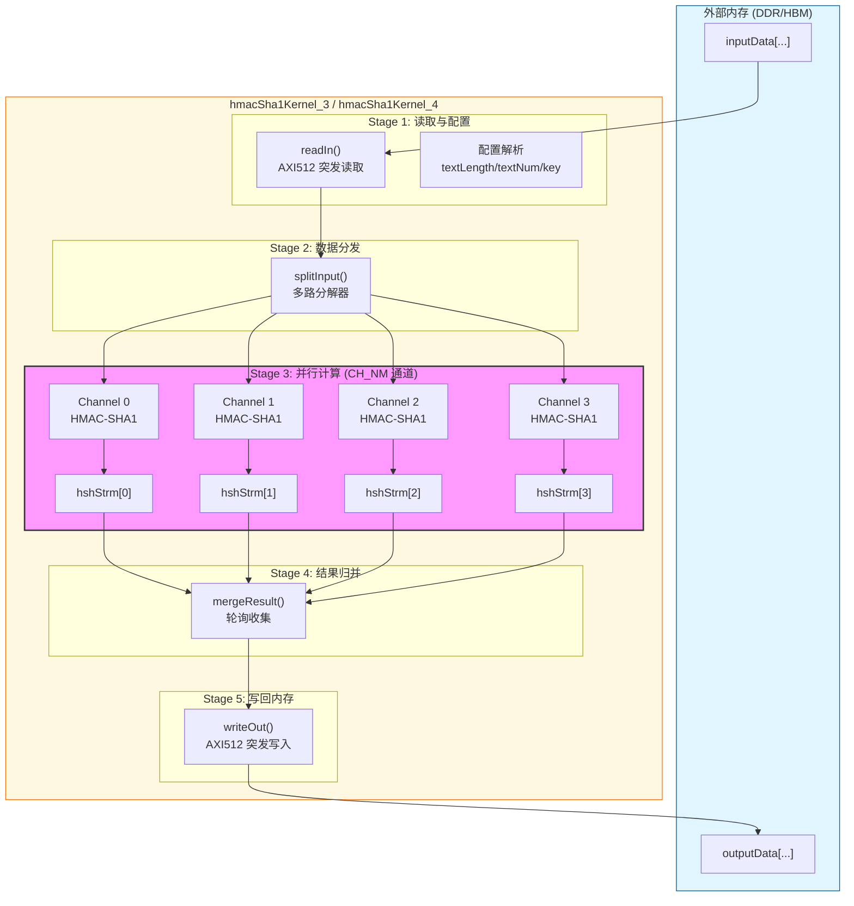

# HMAC-SHA1 内核包装器实例 3 与 4 技术深度解析

## 一句话概括

这是一个为 FPGA 高吞吐场景设计的**批量 HMAC-SHA1 认证加速内核**，通过多通道并行流水线处理大量消息块，在硬件层面实现了类似于"多车道高速公路并行过收费站"的批处理架构——每条车道独立处理一条消息流，但共享统一的调度与内存接口。

---

## 问题空间与设计动机

### 我们试图解决什么？

在数据中心或网络安全场景中，HMAC-SHA1 认证往往成为吞吐瓶颈：

1. **计算密集性**：SHA-1 的核心是 80 轮压缩函数，每轮涉及位运算与模加，CPU 单核处理大流量时难以满足 100Gbps+ 线速要求。
2. **消息碎片化**：实际流量中消息长度不一，小到几十字节的控制包，大到数 KB 的数据块，传统逐消息处理模式存在严重的分支预测失败与缓存失效。
3. **密钥切换开销**：HMAC 需要为每条消息使用密钥，频繁的密钥加载与上下文切换在软件层面开销巨大。

### 为什么选择硬件加速？

本模块属于 Xilinx Vitis Security Library 的 L1 基准测试层，目标是在 Alveo 等 FPGA 加速卡上实现**确定性的低延迟高吞吐**。与 GPU 方案相比，FPGA 允许：

- **细粒度流水线**：将 SHA-1 的 80 轮展开为级联的寄存器链，每周期推进一轮。
- **流式内存访问**：通过 AXI 突发传输(burst)连续读取数据，避免随机访存导致的缓存未命中。
- **多通道空间并行**：复制多份 HMAC 引擎，每个引擎独立处理一条消息流。

---

## 架构全景：数据流与组件交互

### 心智模型：工厂流水线

想象一个现代化的邮件分拣工厂：

- **原料入口** (`readIn`): 集装箱卡车(AXI 总线)运载着成托盘的包裹(512-bit AXI 块)，在这里被拆解为单个包裹流。
- **分拣台** (`splitInput`): 根据目的地标签(通道号)将包裹分发给 4 条并行传送带(多通道流)。
- **安检机** (`hmacSha1Parallel`): 每条传送带末端是一台独立的 X 光安检机(HMAC-SHA1 引擎)，对包裹进行安全检查(哈希计算)。
- **汇合包装** (`mergeResult`): 各传送带的检查结果被收集，重新打包为大托盘(512-bit 块)。
- **发货码头** (`writeOut`): 托盘装车运回仓库(内存)。

### 架构图



### 核心组件职责

| 组件 | 类型 | 职责描述 |
|------|------|----------|
| `hmacSha1Kernel_3/4` | 顶层函数 | 内核入口，编排数据流流水线，定义接口约束(pragma) |
| `sha1_wrapper` | 模板结构体 | 策略模式适配器，将 `xf::security::sha1` 绑定到 HMAC 模板接口 |
| `test_hmac_sha1` | 静态函数 | 单通道 HMAC-SHA1 计算封装，桥接流式接口与算法库 |
| `readIn` | 静态模板函数 | AXI 内存到流转换器，处理突发传输与配置解析 |
| `splitInput` | 静态模板函数 | 数据分发器，将宽总线数据分发给多通道窄流 |
| `hmacSha1Parallel` | 静态模板函数 | 并行计算调度器，实例化多份 HMAC 引擎 |
| `mergeResult` | 静态模板函数 | 结果收集器，轮询多通道输出并打包 |
| `writeOut` | 静态模板函数 | 流到 AXI 内存转换器，执行突发写回 |

---

## 关键设计决策与权衡

### 1. 多通道并行 vs. 单通道深度流水线

**选择的方案**: 空间并行（多通道复制）+ 数据流流水线

**权衡分析**:
- **替代方案**: 单通道但将 SHA-1 的 80 轮展开为 80 级流水线，实现单消息单周期吞吐。
- **选择理由**: HMAC-SHA1 需要两次 SHA-1 计算（inner hash + outer hash），且需要处理多消息并发。多通道架构允许独立处理不同消息，避免单通道下的数据依赖性停滞。对于变长消息，多通道提供了天然的"任务级并行"。
- **代价**: 资源消耗随通道数线性增长（LUT、FF、BRAM）。当 `CH_NM=4` 时，资源消耗约为单通道的 4 倍，但吞吐提升接近 4 倍（理想情况下）。

### 2. 流式接口 (hls::stream) vs. 内存数组

**选择的方案**: 全流式内部架构

**权衡分析**:
- **替代方案**: 内部使用数组缓冲，函数间通过数组传递。
- **选择理由**: 
  - **数据流并行**: `hls::stream` 配合 `#pragma HLS dataflow` 允许上游函数在生产出第一个数据块后立即开始处理，无需等待整个数组填满。这实现了功能级流水线并行。
  - **资源效率**: 流映射为 FIFO（BRAM 或 LUTRAM），深度可精确控制，避免了大数组的静态分配浪费。
  - **时序隔离**: 流天然解耦上下游的时序，简化时序收敛。
- **代价**: 
  - 流只能被读取一次（consume-once），调试时难以重复观测中间状态。
  - 需要仔细管理深度（depth），过浅导致流水线停滞，过深浪费资源。

### 3. 突发传输 (Burst) 优化策略

**选择的方案**: 显式突发读写 + 中间缓冲

**权衡分析**:
- **机制**: `readIn` 和 `writeOut` 函数内部显式处理 `_burstLength` 参数，将随机访存聚类为突发。
- **设计细节**:
  - 输入侧：一次性读取 `_channelNumber` 个配置块，然后按 `_burstLength` 为单位读取数据。
  - 输出侧：`mergeResult` 将 160-bit 哈希值打包到 512-bit AXI 字中，积累到 `_burstLen` 个后触发突发写。
- **权衡**:
  - **优势**: 最大化 AXI 总线效率，避免小数据包（160-bit 哈希）单独写导致的总线效率低下（512-bit 总线利用率仅 31%）。打包后利用率接近 100%（3 x 160 = 480 < 512，实际可能略低但远优于 31%）。
  - **代价**: 增加了延迟（需要积累 `_burstLen` 个结果），对于低延迟敏感场景可能不适用。但本模块目标为吞吐最大化，延迟可接受。

### 4. 模板参数化 vs. 运行时配置

**选择的方案**: 编译时模板参数 (`_channelNumber`, `_burstLength`) + 运行时流配置

**权衡分析**:
- **设计**: 
  - 硬件结构参数（通道数、突发长度）作为模板参数，编译时确定，生成专用硬件。
  - 运行时参数（消息长度、消息数量、密钥）通过 AXI 流在 `readIn` 阶段读取。
- **理由**:
  - **面积效率**: 模板参数允许 HLS 工具生成最优化的控制逻辑（如固定次数的循环展开），避免运行时开销。
  - **灵活性**: 运行时配置允许同一比特流处理不同长度和数量的消息，避免为每种消息长度重新编译。
- **限制**: 改变通道数或突发长度需要重新综合，无法在运行时调整。

---

## 子模块架构

本模块包含两个功能相同的内核实例，分别对应物理文件 `hmacSha1Kernel3.cpp` 和 `hmacSha1Kernel4.cpp`。这种分离允许在同一 FPGA 上部署多个独立实例，实现更粗粒度的任务级并行（例如，一个实例处理控制面，另一个处理数据面，或简单地双倍增吞吐）。

### 子模块划分

| 子模块 | 对应文件 | 核心函数 | 职责简述 |
|--------|----------|----------|----------|
| `kernel_instance_3` | [hmacSha1Kernel3.cpp](security_crypto_and_checksum-hmac_sha1_authentication_benchmarks-hmac_sha1_kernel_wrapper_instances_3_4-kernel_instance_3.md) | `hmacSha1Kernel_3` | 第 3 号内核实例，实现完整 HMAC-SHA1 流水线 |
| `kernel_instance_4` | [hmacSha1Kernel4.cpp](security_crypto_and_checksum-hmac_sha1_authentication_benchmarks-hmac_sha1_kernel_wrapper_instances_3_4-kernel_instance_4.md) | `hmacSha1Kernel_4` | 第 4 号内核实例，结构与实例 3 完全一致，支持并行部署 |

两个子模块共享相同的设计模式与数据流架构，差异仅在于顶层函数名称与物理位置。下文的技术解析适用于两者。

---

## 跨模块依赖与接口契约

### 上游依赖（输入）

| 依赖项 | 类型 | 接口形式 | 契约要求 |
|--------|------|----------|----------|
| `xf::security::sha1` | 算法库 | 头文件 `xf_security/sha1.hpp` | 提供单消息 SHA-1 压缩函数 |
| `xf::security::hmac` | 算法库 | 头文件 `xf_security/hmac.hpp` | 模板化 HMAC 实现，需绑定哈希策略类 |
| `kernel_config.hpp` | 本地配置 | 头文件 | 定义 `CH_NM`(通道数), `BURST_LEN`, `GRP_SIZE` 等宏 |
| Host 驱动程序 | 运行时 | AXI-MM 接口 | 按约定格式准备输入数据缓冲区（配置头 + 数据体） |

### 下游依赖（输出）

| 依赖项 | 类型 | 接口形式 | 数据格式 |
|--------|------|----------|----------|
| Host 内存 | 运行时 | AXI-MM (gmem0_1) | 512-bit 对齐输出缓冲区，存储 160-bit 哈希值（低位对齐，高位补零） |

### 数据布局契约（Host 侧必须遵守）

输入数据缓冲区 `inputData` 必须按以下布局准备：

```
[0] 配置块 0 (512-bit):
    [511:448] textLength  (64-bit): 单条消息长度（字节）
    [447:384] textNum     (64-bit): 消息批次数量
    [255:0]   key         (256-bit): HMAC 密钥（低位对齐）
[1] 配置块 1 (CH_NM 个，内容相同，物理冗余)
...
[CH_NM-1] 配置块 CH_NM-1
[CH_NM] 数据块 0: 文本数据（按 512-bit 打包，小端序）
...
[CH_NM + textNum*textLength*CH_NM/64 - 1] 最后一个数据块
```

**关键契约**：
- 数据总大小必须是 64 字节（512 bit）的整数倍。
- `textLength` 必须能被 `GRP_SIZE`（由 `kernel_config.hpp` 定义，通常为 4 或 8）整除，以适配内部数据宽度转换。

---

## 新贡献者须知：陷阱与边缘情况

### 1. 流的 consume-once 特性

所有 `hls::stream` 对象都是单次消费的。在仿真或调试时，一旦从流中读取一次数据，该数据即被消耗。如果你需要在 C-sim 中打印中间值用于调试，必须手动将数据"扇出"(fan-out)到多个流，或使用 `hls::stream::copy()` 保存副本。

**危险代码模式**：
```cpp
// 错误：试图读取两次进行打印
auto val = myStream.read();
std::cout << val; 
// ... 后续逻辑再次需要 val，但流已空！
```

### 2. HLS 数据流的死锁风险

`#pragma HLS dataflow` 要求函数间的流保持**平衡**。如果上游函数生产速度远快于下游消费，而流深度（depth）设置不足，将导致上游停滞（stall）。反之，如果下游试图从空流读取，将产生未定义行为或死锁。

**关键参数**：
- `fifoDepth = _burstLength * fifobatch`：必须足够吸收突发传输的波动。
- `msgDepth`：与通道数和消息长度相关，确保 `splitInput` 生产的所有数据不会淹没 HMAC 引擎。

### 3. 密钥与消息长度的一致性

在 `splitInput` 中，密钥被广播到所有通道，且每条消息都使用**相同**的密钥（根据注释 "key is also the same to simplify input table"）。如果你的应用场景需要**每条消息使用不同密钥**，当前实现**不支持**，需要修改 `splitInput` 逻辑，从输入流中逐消息提取密钥。

### 4. 哈希输出的位宽对齐

`hmacSha1Parallel` 输出的 `ap_uint<160>` 是 160-bit，但 AXI 总线宽度是 512-bit。在 `mergeResult` 中，这 160-bit 被放置在 512-bit 字的**低位**（`tmp.range(159, 0)`），高位补零。Host 侧读取后必须只取低 20 字节（160 bit），剩余字节为填充垃圾值。

### 5. 模板参数与硬件生成

`_channelNumber` 和 `_burstLength` 是模板参数，意味着：
- 它们必须在**编译时**确定，生成比特流后无法更改。
- 如果需要支持不同通道数（如从 4 通道改为 8 通道），必须重新运行 Vitis HLS 综合与实现流程。

这与运行时参数（如 `textLength`）形成鲜明对比，后者可以在不改变硬件的情况下，通过 Host 程序动态调整。

---

## 性能调优指引

### 瓶颈识别

如果实测吞吐低于理论值，常见瓶颈位置及诊断方法：

| 瓶颈位置 | 症状 | 诊断方法 | 优化方向 |
|----------|------|----------|----------|
| 内存带宽 | AXI 总线利用率低，突发长度不足 | 查看 HLS 报告中的 burst 长度统计 | 增大 `BURST_LEN`，检查对齐 |
| 流深度不足 | 流水线频繁 stall，II 无法保持 | HLS 波形查看 stream full/empty 信号 | 增大对应流的 `depth` 参数 |
| HMAC 引擎 | 通道利用率不均，某些通道空闲 | 检查消息分配是否均匀 | 调整任务分配策略，或增加通道数 |
| 合并逻辑 | 输出速率波动大，有突发延迟 | `mergeResult` 的轮询开销 | 优化轮询策略，或使用优先级队列 |

### 推荐的调参流程

1. **基准测试**：使用已知长度（如 1KB）的消息，测量单通道吞吐。
2. **流深度调优**：逐步增加 `fifoDepth` 和 `msgDepth`，直到 stall 不再减少。
3. **突发长度优化**：测试不同 `BURST_LEN`（16, 32, 64, 128），找到内存带宽与延迟的最佳平衡。
4. **通道数扩展**：在资源允许范围内（查看 LUT/FF/BRAM 利用率），逐步增加 `CH_NM`，验证线性扩展性。

---

## 总结

`hmac_sha1_kernel_wrapper_instances_3_4` 是一个经过深度优化的 HLS 内核，专为 FPGA 上的高吞吐 HMAC-SHA1 计算设计。其核心设计哲学是：

1. **空间并行优于时间复用**：通过多通道复制而非复杂的状态机复用，换取确定性的吞吐。
2. **流式数据流优于随机访存**：全流水线设计，数据一旦进入即被连续处理，无停顿。
3. **编译时优化优于运行时灵活**：关键参数模板化，生成专用硬件，追求极致效率。

理解这些设计抉择，有助于在实际应用中做出正确的权衡：何时使用此内核（批量大、吞吐敏感），何时选择软件方案（小批量、延迟敏感、密钥频繁变化）。


