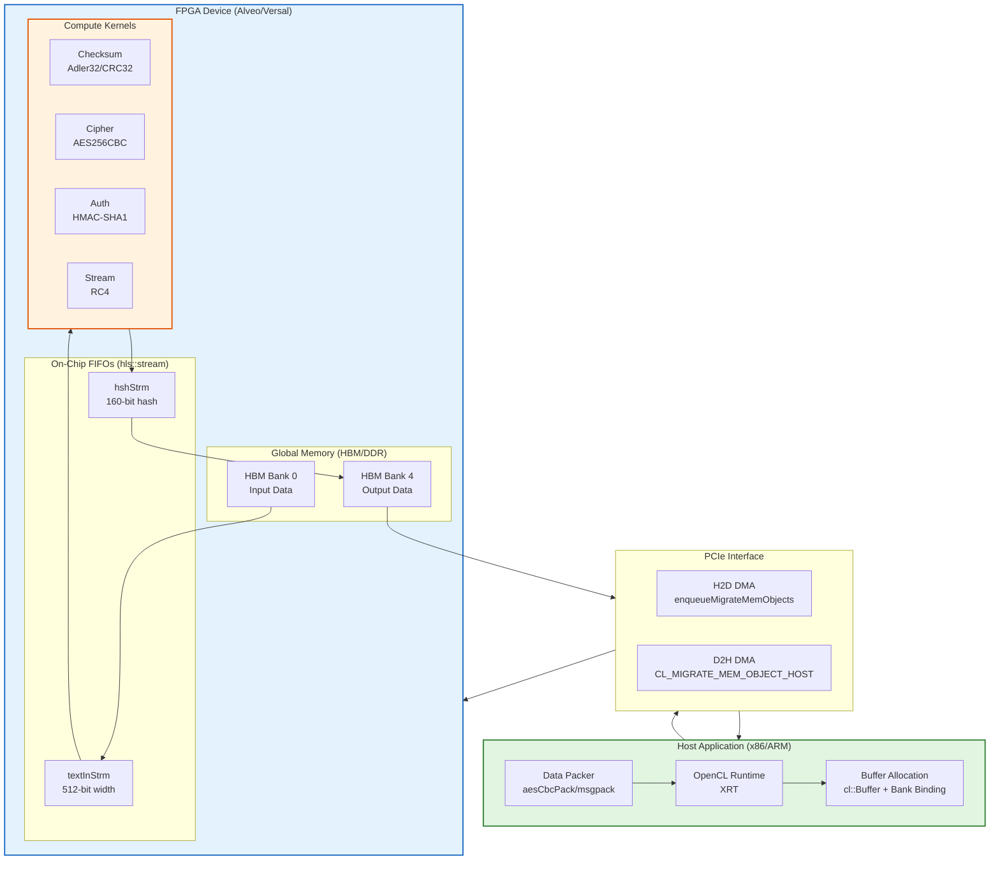

# security_crypto_and_checksum 模块深度解析

## 一句话概括

这是一个**FPGA硬件安全加速库**，将传统的软件加密/校验算法（AES、HMAC、CRC等） offload 到 Xilinx FPGA 的专用内核上，通过 HBM/DDR 高带宽内存和 OpenCL 运行时，实现比 CPU 高数量级的吞吐性能。

---

## 问题空间：为什么需要这个模块？

想象你在构建一个**网络数据面**（data plane）应用——比如 100Gbps 的 SSL/TLS 卸载网关、海量日志的实时完整性校验、或者加密存储系统。

**纯软件方案的痛点：**
- **计算密集型瓶颈**：AES-256-CBC 在消费级 CPU 上单核只能跑到 ~1-2 Gbps，要跑满 100G 网络需要 50+ 个物理核
- **延迟抖动**：CPU 缓存未命中、进程抢占、内核态切换导致微秒级的不确定性
- **功耗与成本**：为加密任务购买高主频服务器，单位瓦特算力极低

**FPGA 硬件加速的解决思路：**
将算法固化成**数据流架构**（dataflow architecture）——数据像水流过管道一样流经加密核，无需 CPU 干预，每个时钟周期都能处理固定字长的数据。

本模块正是 Xilinx Vitis Security Library 的 L1（内核级）参考实现，提供了可直接集成到 FPGA 比特流中的加密原语。

---

## 核心抽象：如何理解这个模块的思维方式？

### 类比：工厂流水线模型

想象这个模块是一家**高度自动化的加密工厂**：

1. **原料入库（Host→FPGA Memory）**：
   主机（Host）将待加密数据打包，通过 PCIe 搬运到 FPGA 的 HBM/DDR 仓库（内存银行）。这不是简单的 memcpy，而是显式管理的 DMA 传输，通过 `cl_mem_ext_ptr_t` 指定目标内存银行（bank）。

2. **流水线加工（Kernel Dataflow）**：
   FPGA 内核（Kernel）启动后，数据流经三个连续工位：
   - **读取工位**：从 HBM 批量读取 512-bit 数据块到片上 FIFO
   - **计算工位**：AES/HMAC/CRC 等运算在脉动阵列（systolic array）或展开循环中执行
   - **写回工位**：结果流回 HBM
   
   三个工位通过 `hls::stream` 和 `#pragma HLS DATAFLOW` 实现**并行流水线**，吞吐取决于最慢工位（通常是计算）。

3. **成品出库（FPGA→Host）**：
   主机通过阻塞式 `enqueueMigrateMemObjects` 读取结果，或使用 ping-pong 双缓冲实现**双工重叠**（下一批数据入库时，上一批正在加工）。

### 关键设计隐喻

- **"批处理优先"（Batch Processing）**：
  内核不为单条消息优化，而是要求主机将数千条小消息打包成连续内存块（通过 `aesCbcPack` 等工具），一次性喂给 FPGA。这摊薄了 PCIe 往返延迟。

- **"内存银行即 NUMA"（Memory Bank Affinity）**：
  HBM 被划分为 16-32 个独立银行（HBM[0], HBM[1]...），错误地放置数据会导致银行冲突（bank conflict），性能骤降。`.cfg` 文件显式声明 `sp=Kernel.m_axi_gmem0:HBM[0]` 进行 NUMA-aware 绑定。

- **"流式接口即类型系统"（Stream Interface as Contract）**：
  `hls::stream<ap_uint<512>>` 不仅是队列，更是**同步契约**——它强制上下游以固定粒度（512-bit）握手，天然实现反压（back-pressure）和流量控制，无需显式锁。

---

## 架构全景图与数据流



### 关键数据流路径详解

#### 路径1：AES256-CBC 批量加密（高吞吐批量处理）

**场景**：加密 1000 条独立消息，每条 1KB，使用不同 IV/Key。

1. **主机打包阶段**：
   ```cpp
   xf::security::internal::aesCbcPack<256> packer;
   for (int i = 0; i < msg_num; i++) {
       packer.addOneMsg(msg, msg_len, ivec, key);
   }
   packer.finishPack();  // 写入包头：消息数量
   ```
   打包后的数据布局：
   ```
   [16B Header: msg_num] 
   [16B: len0] [16B: IV0] [32B: Key0] [padded msg0]
   [16B: len1] [16B: IV1] [32B: Key1] [padded msg1]
   ...
   ```

2. **OpenCL 内存分配与银行绑定**：
   ```cpp
   cl_mem_ext_ptr_t inMemExt = {0, inputData, kernel()};
   cl::Buffer in_buff(context, CL_MEM_EXT_PTR_XILINX | CL_MEM_USE_HOST_PTR, 
                      in_pack_size, &inMemExt);
   ```
   `CL_MEM_EXT_PTR_XILINX` 扩展配合 `.cfg` 文件中的 `sp=...:HBM[0]`，确保缓冲区物理上位于指定的 HBM 银行。

3. **三阶段流水线执行**：
   ```cpp
   q.enqueueMigrateMemObjects(inBuffs, 0, nullptr, &h2d_evts[0]);      // H2D
   q.enqueueTask(kernel, &h2d_evts, &krn_evts[0]);                   // Compute  
   q.enqueueMigrateMemObjects(outBuffs, CL_MIGRATE_MEM_OBJECT_HOST, 
                              &krn_evts, &d2h_evts[0]);               // D2H
   ```
   通过 OpenCL Event 依赖链（`&h2d_evts` → `&krn_evts` → `&d2h_evts`），隐式建立了生产者-消费者同步，无需显式锁。

4. **结果解包**：
   输出数据采用与输入对称的布局，主机通过读取包头获知消息数量，逐条验证长度和解密结果。

#### 路径2：HMAC-SHA1 多核并行（计算密集型认证）

**场景**：对同一大批量消息生成 HMAC-SHA1 摘要，利用 FPGA 的并行计算单元。

**关键差异点**：

1. **多内核实例化**：
   `.cfg` 文件未显示，但主机代码创建了 4 个独立内核实例：
   ```cpp
   cl::Kernel kernel0(program, "hmacSha1Kernel_1");
   cl::Kernel kernel1(program, "hmacSha1Kernel_2");
   // ... kernel2, kernel3
   ```
   每个内核对应一个 `.cpp` 文件（`hmacSha1Kernel1.cpp` 至 `hmacSha1Kernel4.cpp`），内容几乎相同但各自独立编译，允许工具链分别优化。

2. **Ping-Pong 双缓冲流水线**：
   ```cpp
   for (int i = 0; i < num_rep; i++) {
       int use_a = i & 1;  // 交替使用 A/B 缓冲区
       // 写入 Ping 缓冲区，同时读取 Pong 缓冲区的上一轮结果
       q.enqueueMigrateMemObjects(ib, 0, &read_events[i-2], &write_events[i][0]);
       q.enqueueTask(kernel, &write_events[i], &kernel_events[i][0]);
       q.enqueueMigrateMemObjects(ob, CL_MIGRATE_MEM_OBJECT_HOST, 
                                  &kernel_events[i], &read_events[i][0]);
   }
   ```
   通过 Event 依赖链的精心编排，实现**三级流水线**：第 i 轮的 D2H 读取、第 i-1 轮的 Kernel 计算、第 i-2 轮的 H2D 写入，三者并行重叠，隐藏 PCIe 延迟。

3. **通道级并行（Channel Parallelism）**：
   每个内核内部通过 `#pragma HLS DATAFLOW` 展开 4 个独立处理通道（`CH_NM=4`），每条通道拥有独立的 HMAC-SHA1 计算流水线，共享同一个 AXI 读取接口但通过 `hls::stream` 解耦。

---

## 关键设计决策与权衡

### 1. 批处理（Batching）vs 低延迟（Low Latency）

**决策**：强制要求主机将消息打包成批，内核一次处理数百至数千条消息。

**权衡分析**：
- **优点**：
  - 摊薄 PCIe 往返开销（单次 H2D/D2H 传输大块数据比多次小传输更高效）
  - 内核内部可使用更激进的流水线并行（单条消息的 IV/Key 切换开销被批量均摊）
- **缺点**：
  - 引入了批处理延迟（必须等积累足够消息才能启动一次传输）
  - 不适合单次低延迟请求（如单个 TLS 握手的单次加密）

**为何选此方案**：
本模块定位为**数据面吞吐型**（data plane throughput-oriented）而非控制面交互型。对于需要低延迟的场景，应使用不同的微架构（如缓存常驻的 IV/Key、专用控制路径）。

### 2. 显式内存银行管理 vs 自动内存放置

**决策**：通过 `.cfg` 连接文件显式声明每个 AXI 端口绑定的 HBM 银行，主机代码使用 `CL_MEM_EXT_PTR_XILINX` 扩展配合 `cl_mem_ext_ptr_t` 结构体指定缓冲区目标银行。

**权衡分析**：
- **优点**：
  - 最大化内存带宽（不同 HBM 银行可并行访问，理论总带宽 = 单银行带宽 × 银行数）
  - 避免银行冲突（bank conflict）导致的流水线停顿
  - 确定性延迟（无运行时银行分配的不确定性）
- **缺点**：
  - 增加开发复杂度（开发者必须理解 HBM 物理拓扑，手动计算数据分布）
  - 降低可移植性（`.cfg` 文件与特定 FPGA 卡型号强相关，U50/U250/U280 的 HBM 容量/银行数不同）

**为何选此方案**：
在数据中心 FPGA 部署中，**性能可预测性**优先于开发便利性。银行冲突导致的 10-100x 性能下降在云计算环境中不可接受。通过工具链（Vitis Analyzer）可视化银行访问热力图，可验证放置策略正确性。

### 3. 多内核实例 vs 单内核多引擎

**决策**：对于 HMAC-SHA1 等高计算密度任务，使用 4 个独立的内核实例（`hmacSha1Kernel_1` 至 `_4`），每个实例编译为独立的 `.xo` 对象，通过同一 `.xclbin` 加载。

**权衡分析**：
- **优点**：
  - 工具链可对每个内核独立优化（时钟频率、流水线 II、资源分配）
  - 天然支持任务级并行（4 个主机线程各自驱动一个内核，无锁竞争）
  - 故障隔离（单内核崩溃不影响其他实例）
- **缺点**：
  - 资源开销增加（每个内核独立的控制逻辑、AXI 接口、状态机）
  - 代码重复（4 个几乎相同的 `.cpp` 文件，维护负担）
  - 负载均衡复杂性（需主机显式分配任务给各内核，避免某些内核空闲）

**替代方案对比（单内核多引擎）**：
在一个内核内部实例化 4 个处理引擎（PE），共享同一个 AXI 读取接口，通过 `hls::stream` 分发数据。优点是资源复用、代码单一；缺点是工具链优化粒度粗、单引擎故障影响全部、难以独立调频。

**为何选此方案**：
对于 L1 基准测试（benchmark）场景，**可调试性和性能可审计性**优先。独立内核允许使用 Vitis Analyzer 精确追踪每个实例的时间线，验证负载均衡效果。生产部署中可根据资源利用率权衡合并。

---

## 子模块导航

本模块按算法类型划分为四个独立子系统，每个子系统包含特定的内核实现、主机驱动和平台配置：

### [checksum_integrity_benchmarks](security_crypto_and_checksum-checksum_integrity_benchmarks.md)
**Adler32 与 CRC32 校验和加速**

- **职责**：为大规模数据完整性校验提供 FPGA 卸载（zlib/gzip 格式的校验和计算）
- **关键设计**：每时钟周期处理 64-128 字节，通过滑动窗口算法维持滚动状态
- **适用场景**：压缩库（zlib）后端、网络包校验、文件系统完整性校验

### [aes256_cbc_cipher_benchmarks](security_crypto_and_checksum-aes256_cbc_cipher_benchmarks.md)
**AES-256-CBC 分组密码加速**

- **职责**：提供高吞吐量的对称加密/解密能力，支持每条消息独立的 IV 和 Key
- **关键设计**：批处理打包（aesCbcPack）摊薄 PCIe 开销；CBC 模式的链式依赖通过轮间流水线隐藏
- **适用场景**：存储加密、TLS 批量数据加密、数据库透明加密（TDE）

### [hmac_sha1_authentication_benchmarks](security_crypto_and_checksum-hmac_sha1_authentication_benchmarks.md)
**HMAC-SHA1 消息认证码加速**

- **职责**：并行计算大量消息的 HMAC-SHA1 摘要，支持每消息独立 Key
- **关键设计**：4 内核实例 + 每内核 4 通道的 16 路并行；SHA1 的 80 轮运算展开为 5 级流水线
- **适用场景**：API 请求签名验证、消息完整性认证、Kerberos/HTTP 摘要认证后端

### [rc4_stream_cipher_benchmark_host](security_crypto_and_checksum-rc4_stream_cipher_benchmark_host.md)
**RC4 流密码加速**

- **职责**：提供 RC4 密钥流生成和异或加密的高速卸载
- **关键设计**：S-Box 状态机并行更新；单字节/多字节吞吐模式可配置
- **适用场景**：遗留系统兼容（RC4 已废弃但仍有需求）、WEP/WPA 兼容模式、流式数据实时加解密

---

## 横向关注点（Cross-Cutting Concerns）

### 1. 内存管理契约

所有子模块共享相同的**三层内存模型**：

| 层级 | 类型 | 生命周期管理者 | 访问延迟 | 容量量级 |
|------|------|--------------|----------|----------|
| L0: 主机内存 | `std::vector` / `posix_memalign` | Host RAII | ~100ns | 数十 GB |
| L1: 设备全局内存 | `cl::Buffer` + HBM Bank | OpenCL Context | ~1μs | 4-16 GB |
| L2: 片上内存 | `hls::stream` / local arrays | Kernel Dataflow | ~1ns | 数十 KB |

**所有权转移语义**：
- `CL_MEM_USE_HOST_PTR`：零拷贝模式，主机指针直接映射到 FPGA 地址空间，**主机必须保证指针在内核执行期间有效**
- `CL_MEM_EXT_PTR_XILINX` + `cl_mem_ext_ptr_t`：显式指定目标 HBM 银行，**银行索引必须与 .cfg 文件中的 sp= 声明一致**

### 2. 错误处理策略

**内核级错误**：
- HLS 内核不抛出异常，错误通过**输出数据哨兵值**或**状态寄存器**（`s_axilite` 接口）报告
- 校验和内核：输出累加器溢出检测（罕见但可能）
- 加密内核：填充错误（padding error）无法在内核检测，需主机验证输出格式

**主机级错误**：
- OpenCL API 返回 `cl_int` 错误码，通过 `xf::common::utils_sw::Logger` 封装为可读日志
- 内存分配失败（`posix_memalign` 返回非零）立即抛出 `std::bad_alloc`
- 内核执行超时依赖 OpenCL 驱动层的看门狗（通常数秒），模块内无显式超时处理

**黄金验证（Golden Check）**：
所有基准测试主机代码遵循**自验证模式**：
1. 预计算或从文件加载 OpenSSL 生成的参考结果（Golden）
2. FPGA 执行相同操作
3. 逐字节比对，统计错误数量
4. 通过 `logger.info(TEST_PASS)` 或 `logger.error(TEST_FAIL)` 输出结果

### 3. 性能调优指南

**HBM 银行放置策略**：
```
黄金法则：将输入和输出分别放置在不同 HBM 银行组
- U50: HBM[0-7] 为 Bank Group 0, HBM[8-15] 为 Bank Group 1
- 最优配置：输入→HBM[0], 输出→HBM[8]，利用双独立通道
- 最差配置：输入/输出共享 HBM[0]，触发银行冲突
```

**批大小（Batch Size）选择**：
- **过小**（<100 条消息）：PCIe 传输开销主导，有效吞吐 < 1GB/s
- **适中**（1K-10K 条）：计算与传输平衡，典型吞吐 5-15GB/s
- **过大**（>100K 条）：主机内存占用过高，内核 FIFO 深度成为瓶颈

**流水线深度（Dataflow Stages）**：
内核通过 `#pragma HLS DATAFLOW` 实现任务级并行。阶段数增加可提高吞吐，但：
- 每增加一个阶段，消耗 ~2-4KB 的 BRAM（用于 hls::stream FIFO）
- 阶段间握手延迟累积，对短消息不利
- 典型平衡：3-5 阶段（Read → Process → Write）

---

## 子模块详细文档

以下各子模块均有独立详细文档，涵盖其特定算法实现、内核微架构和主机驱动用法：

| 子模块 | 核心算法 | 关键内核文件 | 主机基准测试 |
|--------|----------|--------------|--------------|
| [checksum_integrity_benchmarks](security_crypto_and_checksum-checksum_integrity_benchmarks.md) | Adler32, CRC32 | `adler32_kernel.hpp`, `crc32_kernel.hpp` | `adler32/host/main.cpp`, `crc32/host/main.cpp` |
| [aes256_cbc_cipher_benchmarks](security_crypto_and_checksum-aes256_cbc_cipher_benchmarks.md) | AES-256-CBC Encrypt/Decrypt | `aes256CbcEncryptKernel`, `aes256CbcDecryptKernel` | `aes256CbcEncrypt/host/main.cpp`, `aes256CbcDecrypt/host/main.cpp` |
| [hmac_sha1_authentication_benchmarks](security_crypto_and_checksum-hmac_sha1_authentication_benchmarks.md) | HMAC-SHA1 | `hmacSha1Kernel_1`~`_4` (4 实例) | `hmac_sha1/host/main.cpp` |
| [rc4_stream_cipher_benchmark_host](security_crypto_and_checksum-rc4_stream_cipher_benchmark_host.md) | RC4 Stream Cipher | `rc4EncryptKernel_1` | `rc4Encrypt/host/main.cpp` |

---

## 新手上路：关键陷阱与最佳实践

### ❌ 常见错误

1. **内存对齐陷阱**：
   ```cpp
   // 错误：普通 malloc 可能导致非页面对齐，HBM DMA 会失败
   unsigned char* data = malloc(size);
   
   // 正确：必须使用 posix_memalign 4096 字节对齐
   void* ptr = nullptr;
   posix_memalign(&ptr, 4096, size);
   ```

2. **HBM 银行索引越界**：
   ```cpp
   // U50 只有 HBM[0-15]，使用 HBM[16] 会导致编译/运行时错误
   sp=MyKernel.m_axi_gmem0:HBM[20]  // 错误！
   ```

3. **忘记 finish() 同步**：
   ```cpp
   q.enqueueTask(kernel);
   // 错误：立即读取结果，内核可能尚未开始执行
   
   q.enqueueTask(kernel);
   q.finish();  // 正确：阻塞直到所有队列命令完成
   ```

### ✅ 推荐模式

1. **资源获取即初始化（RAII）模式**：
   ```cpp
   struct FpgaBuffer {
       cl::Buffer buf;
       void* host_ptr;
       ~FpgaBuffer() { if (host_ptr) free(host_ptr); }
   };
   ```

2. **批大小自适应**：
   ```cpp
   size_t optimal_batch = (total_msgs > 10000) ? 5000 : total_msgs / 2;
   // 根据可用 HBM 容量动态调整，避免 OOM
   ```

3. **验证模式分离**：
   ```cpp
   #ifdef HLS_TEST
       // C-sim 模式：直接调用内核函数，无需 OpenCL
       hmacSha1Kernel_1(input, output);
   #else
       // HW 模式：完整 OpenCL 流程
   #endif
   ```

---

## 与外部模块的关系

本模块是 Vitis Security Library 的 L1（内核级）实现，向上层提供以下接口：

- **L2 中间件层**（如 `xf::security::aesCbcEncrypt` C++ 封装）：提供更友好的 RAII API，隐藏 OpenCL 细节
- **L3 应用层**（如 DPDK/SSL 卸载插件）：集成到网络协议栈，实现透明加速
- **外部工具链依赖**：
  - [Vitis Core Development Kit](https://www.xilinx.com/products/design-tools/vitis/vitis-platform.html)：提供 XRT OpenCL 运行时
  - [Vitis HLS](https://www.xilinx.com/products/design-tools/vitis/vitis-hls.html)：C++ 到 RTL 的高层次综合
  - [Xilinx OpenCL 扩展](https://xilinx.github.io/XRT/master/html/opencl_extension.html)：HBM 银行绑定、扩展指针等

---

## 延伸阅读与资源

- **官方文档**：
  - [Vitis Security Library 用户指南](https://xilinx.github.io/Vitis_Libraries/security/)
  - [XRT 开发者文档](https://xilinx.github.io/XRT/)
  
- **关键技术标准**：
  - [FIPS-197 (AES)](https://csrc.nist.gov/publications/detail/fips/197/final)
  - [RFC 2104 (HMAC)](https://tools.ietf.org/html/rfc2104)
  - [RFC 1321 (MD5, 已废弃)](https://tools.ietf.org/html/rfc1321) / [RFC 6234 (SHA)](https://tools.ietf.org/html/rfc6234)

- **相关模块索引**：
  - [data_compression_gzip_system](data_compression_gzip_system.md)：使用本模块的 Adler32/CRC32 作为 gzip 压缩的完整性校验
  - [codec_acceleration_and_demos](codec_acceleration_and_demos.md)：图像编解码可能使用 AES 加密保护内容

---

*文档版本：v1.0*  
*维护者：Vitis Security Library 团队*  
*最后更新：基于 Vitis 2023.2 版本*
