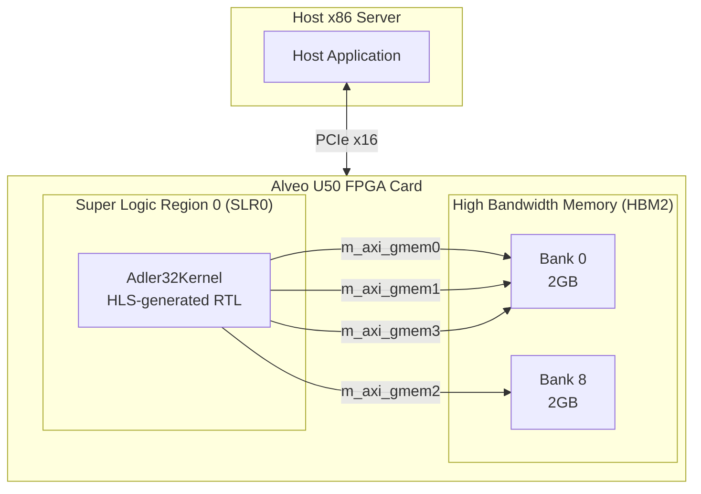

# adler32_kernel_connectivity 模块深度解析

## 开篇：30秒理解

想象你正在设计一座桥梁——不是连接两岸的公路桥，而是连接**软件算法**与**硬件电路**的接口桥。`adler32_kernel_connectivity` 模块正是这样一座桥的配置蓝图。它本身不是可执行代码，而是告诉 Xilinx Vitis 编译器："Adler32 校验和算法的硬件内核应该如何连接 FPGA 的高带宽内存（HBM）、放置在芯片的哪个区域，以及暴露哪些数据接口"。简单来说，这是硬件加速器的"接线图"。

---

## 架构全景：硬件接口的拓扑地图



### 组件角色解析

**1. Adler32Kernel（计算核心）**
这是经过 Xilinx HLS（高层次综合）工具从 C++ 代码转换而来的硬件 RTL 电路。它的职责是并行计算 Adler-32 校验和——一种比 CRC32 更快但安全性稍低的哈希算法，广泛用于 zlib、gzip 等压缩工具。该内核被配置为单实例（`nk=1`），意味着在 FPGA 上只部署一个计算引擎。

**2. AXI4-Master 接口（数据搬运通道）**
内核暴露了 4 个 AXI4 主设备接口（`m_axi_gmem0` 到 `m_axi_gmem3`），这是与片外内存通信的高速公路。每个接口独立地发起读/写事务，允许内核同时访问多个内存区域而不互相阻塞。这种多端口设计是典型的 HPC 加速器模式——通过增加内存通道数来提升带宽，而非依赖单个超宽总线。

**3. HBM 内存银行（数据存储层）**
Alveo U50 配备 8GB HBM2 内存，被划分为 16 个独立的 512MB "银行"（Bank）。本配置使用 Bank 0 和 Bank 8：
- **Bank 0**：承载 3 个 AXI 接口（gmem0, gmem1, gmem3），通常是数据源、参数区和结果区的混合使用
- **Bank 8**：专用于 gmem2，可能是独立的大数据缓冲区（如输入文件的超大块）

这种分离策略避免了银行争用——如果所有接口都映射到同一银行，HBM 控制器会成为瓶颈；分散到不同银行允许并行访问。

**4. SLR0 物理布局（芯片级位置）**
UltraScale+ FPGA 被划分为多个 Super Logic Regions（SLRs），每个 SLR 有自己的时钟域和布线资源。强制将内核放置在 SLR0 有两个目的：
- **HBM 邻近性**：U50 的 HBM 物理上靠近 SLR0/SLR1 边界，缩短物理走线延迟
- **主机接口**：PCIe 硬核通常在 SLR0，内核靠近 PCIe 有利于主机-设备控制信号的低延迟握手

---

## 核心组件详解

### 配置文件解析（conn_u50.cfg）

```cfg
[connectivity]
sp=Adler32Kernel.m_axi_gmem0:HBM[0]
sp=Adler32Kernel.m_axi_gmem1:HBM[0]
sp=Adler32Kernel.m_axi_gmem2:HBM[8]
sp=Adler32Kernel.m_axi_gmem3:HBM[0]
slr=Adler32Kernel:SLR0
nk=Adler32Kernel:1:Adler32Kernel
```

**1. 端口映射指令（`sp=` - Set Port）**
每条 `sp=` 指令建立一个 AXI4 主设备接口与 HBM 银行之间的硬连线关系。这种映射在编译时确定，生成的是物理 FPGA 比特流中的布线配置，而非运行时可更改的路由表。这意味着一旦烧录，gmem0 永远访问 Bank 0，直到重新编译。

**2. SLR 放置指令（`slr=`）**
将逻辑内核锁定到特定 SLR 区域。这类似于 NUMA 架构中的处理器亲和性（affinity）设置——告诉工具链"这个内核必须运行在这个物理区域"。这在多内核设计中尤为重要，可以避免工具链将内核放在远离其内存接口的远端 SLR，造成时序违规或布线拥塞。

**3. 内核实例化指令（`nk=`）**
`nk=Adler32Kernel:1:Adler32Kernel` 表示：实例化 1 个内核，类型为 Adler32Kernel，实例名也为 Adler32Kernel。这个 3 段式参数的格式是 `nk=<kernel_type>:<instance_count>:<instance_base_name>`。如果只实例化 1 个，第三个参数通常与类型名相同；如果实例化多个（如 `:4:Adler32Kernel`），工具会生成 Adler32Kernel_1, Adler32Kernel_2 等实例名。

---

## 依赖关系与数据流分析

### 上游依赖（谁配置并使用此模块）

本模块没有传统意义上的"调用者"，而是被 **Xilinx Vitis 编译工具链** 在构建流程中消费：

1. **Vitis Linker (`v++ --link`)**：解析此 `.cfg` 文件，将其中的连接性约束转化为 Vivado 的 Tcl 脚本，指导 FPGA 比特流的最终布线
2. **主机应用程序**：运行时通过 [OpenCL](security_crypto_and_checksums-checksum_integrity_benchmarks-host_benchmark_timing_structs.md) 或 XRT（Xilinx Runtime）API 打开由本配置生成的 `.xclbin` 文件，将缓冲区映射到配置中指定的 HBM 银行
3. **上层模块**：作为 `security_crypto_and_checksums` → `checksum_integrity_benchmarks` 的子模块，与 [crc32_kernel_connectivity](security_crypto_and_checksums-checksum_integrity_benchmarks-crc32_kernel_connectivity.md) 模块共同构成完整性校验的硬件加速套件

### 下游依赖（此模块配置了什么）

本模块是"终点"配置，不直接调用其他代码模块，但它定义了硬件的物理接口契约，影响以下运行时行为：

| 配置项 | 运行时影响 |
|--------|-----------|
| `sp=gmem0:HBM[0]` | 主机应用调用 `clCreateBuffer` 时，必须将 Buffer 定位到 Bank 0 标志（`XCL_MEM_TOPOLOGY` 扩展）|
| `slr=SLR0` | 内核与 PCIe 控制器处于相同时钟域，控制寄存器访问延迟较低 |
| `nk=1` | 主机只能创建 1 个内核实例，队列深度由 XRT 管理 |

### 数据流：从主机到 HBM 再到内核

```
Host DRAM (x86)
       |
       | PCIe DMA (C2H - Card to Host)
       v
FPGA HBM Bank 0/8  <---  由 .cfg 文件中的 sp= 指令静态映射
       |
       | AXI4 Read Burst (由 m_axi 接口发起)
       v
Adler32Kernel  (计算校验和)
       |
       | AXI4 Write Burst
       v
FPGA HBM Bank 0  (结果写回)
       |
       | PCIe DMA (H2C - Host to Card)
       v
Host DRAM (取回结果)
```

关键设计洞察：这是一个**分离式架构**——主机不直接"调用"内核，而是通过 XRT 运行时进行缓冲区对象交换。`.cfg` 文件在此扮演"地址翻译表"的角色，告诉工具链哪些虚拟地址范围对应物理 HBM 银行。

---

## 设计决策与权衡分析

### 1. 多 AXI 接口 vs. 单宽接口：并行性换取布线复杂度

**选择**：使用 4 个独立的 `m_axi` 接口（gmem0-3）分别映射到 HBM 银行。

**替代方案**：使用 1 个超宽的 AXI 接口（如 512-bit）通过内部交叉开关（interconnect）访问所有内存区域。

**权衡分析**：
- **多接口优势**：
  - **真正的并行访问**：gmem0 和 gmem2 可以同时发起读操作，访问 Bank 0 和 Bank 8，带宽叠加
  - **避免仲裁延迟**：无需通过 AXI Interconnect 的轮询仲裁，延迟确定性好
  - **HLS 友好**：HLS 工具可以为每个接口独立调度访存指令，优化机会更多
- **多接口劣势**：
  - **布线拥塞**：4 个 AXI 总线（每个含地址、数据、控制信号）在 FPGA 布线资源中占用更多物理走线
  - **SLR 跨越**：如果内核与 HBM 控制器不在同一 SLR，多个 AXI 跨 SLR 布线会消耗大量资源
  - **主机复杂度**：主机代码需要管理多个 Buffer 对象和内存银行分配

**为何适合此场景**：Adler-32 算法需要同时访问输入数据流、校验和累加器状态、以及可能的字典/查找表。多接口允许这些异构数据源并行供给计算单元，最大化流水线吞吐。

### 2. HBM 银行 0 与 8 的分离：物理并行性优化

**选择**：将 gmem2 映射到 HBM Bank 8，其余映射到 Bank 0。

**物理背景**：Alveo U50 的 HBM 是 3D 堆叠内存，16 个伪银行（pseudo-bank）映射到 8 个物理堆叠。Bank 0-7 和 Bank 8-15 通常位于不同的物理 DRAM 通道。

**权衡分析**：
- **优势**：Bank 0 和 Bank 8 拥有独立的 HBM 控制器和物理通道，可以同时处理事务，实现真正的**双通道并行**
- **劣势**：跨银行访问引入了**NUMA 效应**（非均匀内存访问）。如果主机代码错误地假设所有 HBM 延迟相同，可能会遇到性能抖动
- **设计意图**：gmem2 很可能专用于大型只读输入缓冲区（如待压缩文件），而 gmem0/1/3 处理频繁读写的状态或元数据。将大流量数据隔离到独立银行，避免与细粒度访问争用

### 3. SLR0 放置：邻近性优先策略

**选择**：强制内核位于 SLR0。

**物理背景**：Alveo U50 的 UltraScale+ FPGA 分为多个 SLR（Super Logic Region），类似多核 CPU 的 NUMA 节点但由芯片物理布局决定。HBM 控制器通常集成在 SLR0 或 SLR1 附近，PCIe 硬 IP 也在 SLR0。

**权衡分析**：
- **优势**：
  - **延迟最小化**：靠近 HBM 控制器意味着 AXI 信号走线短，时序更容易收敛（满足建立/保持时间）
  - **PCIe 亲和性**：内核与 PCIe 控制寄存器在同一时钟域，主机控制命令（启动、同步、中断）延迟更低
- **劣势**：
  - **资源竞争**：SLR0 通常是多个硬核（PCIe、HBM 控制器、Ethernet）的聚集地，留给可编程逻辑的空间相对紧张
  - **扩展性限制**：如果将来需要放置多个内核，SLR0 可能容量不足，必须跨 SLR 迁移，带来时序挑战

**为何适合此场景**：Adler-32 是一个相对轻量级的校验和算法，不需要占用大量 DSP 或 BRAM 资源，放在资源相对紧张但连接性极佳的 SLR0 是合理的权衡。

---

## 使用指南与实战示例

### 配置语法速查

| 指令 | 语法 | 语义 | 运行时影响 |
|------|------|------|-----------|
| `sp=` | `sp=<kernel>.<interface>:<resource>` | Set Port：映射 AXI 接口到内存资源 | 决定 `clCreateBuffer` 必须使用的内存拓扑标志 |
| `slr=` | `slr=<kernel>:<slr_id>` | Set Logic Region：锁定内核到 SLR | 影响控制寄存器访问延迟和时序收敛难度 |
| `nk=` | `nk=<type>:<count>:<base_name>` | Number of Kernels：实例化数量 | 决定主机可创建的 `cl_kernel` 对象数量和队列深度 |

### 典型主机代码集成模式

```cpp
// 1. 包含 XRT 运行时头文件
#include <xrt/xrt_device.h>
#include <xrt/xrt_kernel.h>
#include <xrt/xrt_bo.h>  // Buffer Object

// 2. 打开由 conn_u50.cfg 参与编译生成的 .xclbin
std::string xclbin_path = "adler32_kernel.xclbin";
xrt::device device(0);  // 打开第一个 Alveo 卡
auto uuid = device.load_xclbin(xclbin_path);

// 3. 实例化内核对象（必须与 .cfg 中的 nk= 配置匹配）
// nk=Adler32Kernel:1:Adler32Kernel  ->  类型和实例名都是 Adler32Kernel
xrt::kernel kernel(device, uuid, "Adler32Kernel");

// 4. 创建缓冲区并显式指定内存拓扑（关键！必须与 sp= 映射一致）
// gmem0-3 都连接到 HBM[0] 或 HBM[8]，需要使用 XCL_MEM_TOPOLOGY 扩展
size_t input_size = 1024 * 1024 * 100;  // 100MB 输入数据
xrt::bo input_buf(device, input_size, xrt::bo::flags::host_only, kernel.group_id(0));
// group_id(0) 对应 m_axi_gmem0 接口

// 5. 数据拷贝到设备 HBM
void* host_ptr = input_buf.map();
memcpy(host_ptr, source_data, input_size);
input_buf.sync(xrt::bo::direction::host_to_device);

// 6. 运行内核（异步执行）
// 参数顺序必须与内核 C++ 函数签名匹配
auto run = kernel(input_buf, output_buf, input_size);
run.wait();  // 阻塞等待完成

// 7. 回传结果并清理
output_buf.sync(xrt::bo::direction::device_to_host);
```

### 常见错误与陷阱

**1. 内存拓扑不匹配（最频繁错误）**
```cpp
// 错误：未指定 HBM 银行标志，XRT 可能默认分配到 DDR
xrt::bo wrong_buf(device, size);  // 可能分配到 DDR 而非 HBM

// 正确：显式使用 xrt::bo::flags::device_only 并配合 group_id 指定拓扑
xrt::bo right_buf(device, size, xrt::bo::flags::device_only, kernel.group_id(0));
```
如果缓冲区创建在错误的内存银行，内核启动时将无法正确访问数据，产生静默错误或事务超时。

**2. SLR 跨越延迟假设**
虽然本配置将内核固定在 SLR0，但如果未来修改配置将内核移到 SLR2（远离 HBM 控制器），而主机代码仍假设低延迟访问控制寄存器，可能会导致时序违例或性能下降。

**3. 多实例命名混淆**
如果 `nk=` 配置改为 `nk=Adler32Kernel:4:Adler32Kernel`，实例名会自动变为 Adler32Kernel_1、Adler32Kernel_2 等。主机代码必须动态构造内核名或使用 `xrt::kernel` 的枚举接口，硬编码 `"Adler32Kernel"` 将找不到实例。

---

## 设计哲学与扩展思考

### 为何使用独立配置文件而非 C++ 内嵌 Pragma？

Xilinx 提供两种定义硬件接口的方式：
1. **C++ 内联 Pragma**：在 HLS 源码中使用 `#pragma HLS INTERFACE ...`，直观但修改硬件接口需要重新综合 HLS
2. **外部连接性配置（本模块方式）**：使用 `.cfg` 文件分离硬件拓扑定义与算法实现

**选择 `.cfg` 方式的优势**：
- **关注点分离**：算法工程师专注优化 C++ 内核代码，平台工程师专注内存拓扑优化
- **平台可移植性**：同一内核 RTL 可搭配不同 `.cfg` 文件部署到 U200（DDR 内存）、U50（HBM）、U280（更大 HBM）而不重新综合 HLS
- **敏捷调优**：内存银行分配、SLR 位置等物理优化可在不触碰源码的情况下迭代测试

### 扩展到多内核流水线的模式

本模块目前配置单内核（`nk=1`），但设计时已考虑扩展性。若要构建多阶段流水线（如 Adler32 → Deflate 压缩 → 加密），可采用以下 `.cfg` 扩展模式：

```cfg
# 阶段 1：Adler32 校验和计算（本模块）
nk=Adler32Kernel:2:Adler32Stage  # 双实例并行处理

# 阶段 2：下游处理（假设存在）
nk=DeflateEncoder:2:DeflateStage

# 内核间直接数据流（无需回主机）
stream_connect=Adler32Stage_1.output:DeflateStage_1.input
stream_connect=Adler32Stage_2.output:DeflateStage_2.input
```

这种扩展需要本模块当前使用的 `sp=` 端口映射与 `stream_connect` 流式连接协同工作，体现了从"内存接口"向"流式流水线"演进的硬件架构思维。

---

## 参考与链接

- **同级校验和模块**：[crc32_kernel_connectivity](security_crypto_and_checksums-checksum_integrity_benchmarks-crc32_kernel_connectivity.md) - CRC32 的类似配置，可对比不同算法对 HBM 银行分配的策略差异
- **上层主机支持**：[host_benchmark_timing_structs](security_crypto_and_checksums-checksum_integrity_benchmarks-host_benchmark_timing_structs.md) - 主机端如何与此配置定义的硬件接口交互
- **硬件平台参考**：Xilinx Alveo U50 数据手册 - 理解 HBM 物理布局与 SLR 位置关系的关键文档
