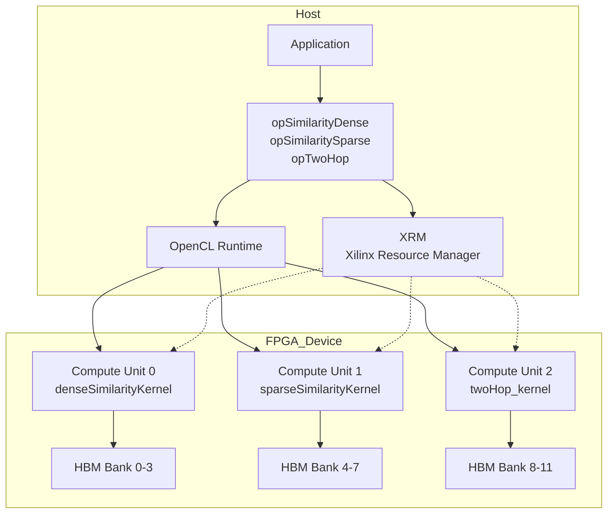

# Similarity and Two-Hop Operations 模块深度解析

## 概述：图相似性计算的硬件加速抽象层

`similarity_and_twohop_operations` 模块是 Xilinx FPGA 图分析库（xf::graph::L3）的核心组件，负责在硬件加速环境下执行**向量相似性计算**（dense/sparse）和**二跳邻居查询**（two-hop）。

简单理解：如果你有一个巨大的向量集合（比如十亿级别的用户特征向量），需要快速找出与给定向量最相似的 Top-K 个结果，这个模块就是干这个的——只不过它用 FPGA 来做，比 CPU/GPU 快一到两个数量级。

---

## 1. 问题空间与设计动机

### 1.1 我们到底在解决什么问题？

在推荐系统、知识图谱、生物信息学中，频繁出现这类查询：

- **相似性搜索**：给定一个查询向量 $q$，在数据库 $D = \{v_1, v_2, ..., v_n\}$ 中找到与 $q$ 最相似的 Top-K 个向量
- **二跳邻居**：给定节点 $u$，找出所有满足 $u \rightarrow v \rightarrow w$ 路径的节点 $w$（用于三角形计数、社群发现等）

**核心挑战**：
1. **数据规模**：十亿级节点，边数万亿级，无法装入单块 FPGA 的 HBM
2. **延迟要求**：在线查询需要毫秒级响应
3. **多样性**：Dense 向量（稠密特征，如 Embedding）和 Sparse 向量（稀疏特征，如 One-hot）需要完全不同的存储和计算架构

### 1.2 为什么不用 CPU/GPU？

- **CPU**：内存带宽受限（~50GB/s），随机访问性能差，相似性计算是 memory-bound 任务
- **GPU**：虽然带宽高（~1TB/s），但分支发散严重（sparse 模式下大量线程空闲），且功耗过高（300W+ vs FPGA 50W）

**FPGA 的优势**：
- 自定义数据通路，匹配 Sparse/Dense 不同访存模式
- HBM 多通道并行（32 channels），理论带宽 460GB/s
- 流水线并行，隐藏延迟

---

## 2. 核心抽象与心智模型

理解这个模块，需要建立以下三个层面的抽象：

### 2.1 硬件资源视图：Compute Unit (CU) 池

想象你有一堆 FPGA 加速卡，每张卡上有多个**计算单元（Compute Units, CUs）**。每个 CU 就是一个独立的硬件内核，可以并行执行相似性计算。

```
Device 0 (Alveo U50)
├── CU 0: denseSimilarityKernel (Handle 0, 1, 2... 取决于 dupNm)
├── CU 1: denseSimilarityKernel
└── CU 2: sparseSimilarityKernel

Device 1 (Alveo U50)
├── CU 0: twoHop_kernel
└── CU 1: twoHop_kernel
```

**关键概念**：
- **dupNm (Duplicate Number)**：每个物理 CU 可以逻辑上复制成多个 Handle，用于负载均衡。比如 `dupNm=2` 表示一个物理 CU 对应 2 个逻辑 Handle。
- **cuPerBoard**：每块 FPGA 上的 CU 数量，用于计算 Handle 索引。

### 2.2 数据流视图：Split Graph 与 Buffer 拓扑

当图数据太大无法装入单块 FPGA 的 HBM 时，需要将图**分区（Split/Partition）**。

**Dense 相似性**：
- 图被切成 `splitNm` 个分区
- 每个分区的权重矩阵被进一步切成 4 块（PU: Processing Unit），映射到 HBM 的不同 Bank
- 使用 `XCL_MEM_TOPOLOGY` 强制指定 Buffer 所在的 HBM Bank，避免跨 Bank 访问的性能损失

**Sparse 相似性**：
- 使用 CSR（Compressed Sparse Row）格式存储
- 每个分区包含 `offsets`、`indices`、`weights` 三个数组
- 同样映射到特定 HBM Bank（通过 kernel 实例名判断，如 `twoHop_kernel0` 对应 Bank 3/5）

### 2.3 执行模型：OpenCL Event 链与异步任务队列

所有计算都是**异步**的，基于 OpenCL Event 构建依赖链：

```
Host Memory → [Write Event] → Device Memory → [Kernel Event] → Device Memory → [Read Event] → Host Memory
```

**执行流程**：
1. **Migration (H2D)**：`enqueueMigrateMemObjects` 将输入数据从 Host 搬到 Device，生成 `events_write`
2. **Kernel Execution**：`enqueueTask` 启动 kernel，依赖 `events_write`，生成 `events_kernel`
3. **Migration (D2H)**：将结果搬回 Host，依赖 `events_kernel`，生成 `events_read`
4. **Synchronization**：`events_read[0].wait()` 阻塞直到完成

**L3 层抽象**：使用 `createL3` 模板函数将上述流程封装成 `event<int>` 对象，支持任务队列（`task_queue`）和回调机制。

---

## 3. 关键代码路径与数据流

### 3.1 模块架构图



### 3.2 Dense Similarity 计算流程

以 `opSimilarityDense::compute` 为例：

1. **Handle 定位**：通过三维索引计算 `clHandle* hds`
2. **Buffer 初始化**：`bufferInit` 创建 OpenCL Buffer，设置 Kernel 参数
3. **数据传输**：`migrateMemObj` (H2D) 搬运输入数据
4. **Kernel 执行**：`cuExecute` 提交 kernel 到硬件队列
5. **结果回传**：`migrateMemObj` (D2H) 搬运结果数据
6. **同步等待**：`events_read[0].wait()` 阻塞直到完成
7. **资源释放**：标记 `hds->isBusy = false`

### 3.3 Two-Hop 邻居查询

Two-hop 查询模式与相似性计算不同，它涉及**图遍历**而非**向量距离计算**。

**输入**：
- `pairPart`：查询对数组，每个元素是一个 64-bit 整数，高 32-bit 为源节点，低 32-bit 为目标节点
- `numPart`：查询对的数量
- 图结构 CSR：`offsetsCSR`、`indicesCSR`（一跳），以及预计算的 `offsets`、`indices`（两跳，用于加速）

**执行流程**：
1. **Buffer 初始化**：`bufferInit` 创建 `pairPart` 和 `resPart`（结果数组）的 OpenCL Buffer
2. **Kernel 参数设置**：设置 numPart、pairPart、CSR 偏移/索引、resPart
3. **执行**：Kernel 在 FPGA 上并行处理所有查询对，对每一对 $(u, v)$ 检查是否存在路径 $u \\rightarrow x \\rightarrow v$
4. **结果回传**：`resPart` 包含每个查询对的结果（0/1 或计数）

---

## 4. 关键设计决策与权衡

### 4.1 Dense vs Sparse：为什么分成两个类？

**设计决策**：将相似性计算显式分为 `opSimilarityDense` 和 `opSimilaritySparse`，而非统一接口。

| 维度 | Dense 模式 | Sparse 模式 |
|------|-----------|------------|
| **存储格式** | 稠密矩阵 (weightsDense[4][N]) | CSR (offsets, indices, weights) |
| **内存访问** | 顺序扫描，高带宽利用率 | 随机访问，索引跳转 |
| **Kernel 架构** | 脉动阵列 (systolic array) 并行计算 | 稀疏矩阵向量乘 (SpMV) 优化 |
| **适用场景** | Embedding 向量（固定维度） | 图特征（变长邻域） |

**为什么不做成模板类？**
1. **Kernel 差异太大**：Dense 和 Sparse 的 FPGA kernel 实现完全不同，Host 代码需要匹配不同的 Buffer 布局
2. **内存拓扑不同**：Dense 模式使用 `XCL_MEM_TOPOLOGY` 绑定到特定 HBM Bank，而 Sparse 模式根据 Kernel 实例名动态选择 Bank
3. **API 差异**：Dense 使用 `sourceWeight`（稠密向量），Sparse 使用 `sourceIndice` + `sourceWeight`（稀疏表示）

### 4.2 Handle 索引计算：多级寻址的复杂性

**设计决策**：使用三维索引计算 Handle 位置：`deviceID × cuPerBoard × dupNm + cuID × dupNm + channelID`

```cpp
clHandle* hds = &handles[channelID + cuID * dupNmSimDense + 
                         deviceID * dupNmSimDense * cuPerBoardSimDense];
```

**为什么如此复杂？**
1. **设备级并行**：支持多卡（Device），每张卡有独立的 HBM 和 PCIe 链路
2. **CU 级并行**：每张卡包含多个物理 Compute Units（通常 2-4 个），每个 CU 有独立的 FPGA 逻辑
3. **逻辑复制**：通过 `dupNm`（duplicate number），一个物理 CU 可以虚拟化成多个逻辑 Handle，用于：
   - **双缓冲（Double Buffering）**：一个 Handle 在执行计算时，另一个 Handle 在传输数据，流水线并行
   - **负载均衡**：多个小查询可以分配到同一个物理 CU 的不同逻辑 Handle 上

### 4.3 Buffer 索引的硬编码契约

**设计决策**：在 `bufferInit` 函数中，使用硬编码的 Buffer 索引（如 `buffer[0]` 对应 config，`buffer[18]` 对应 resultID）。

**Dense 模式的 Buffer 布局**：
- `buffer[0]`: config (uint32_t × 64)
- `buffer[1]`: sourceWeight (uint32_t × sourceNUM)
- `buffer[2]` ~ `buffer[2+4×splitNm-1]`: 权重矩阵（4 个 PU 的权重）
- `buffer[18]`: resultID (uint32_t × topK)
- `buffer[19]`: similarity (float × topK)

**权衡分析**：
- **优点**：零运行时开销（无需 map/dictionary 查找），内存布局紧凑，对 FPGA Kernel 友好（固定地址偏移）
- **缺点**：
  - **脆弱性**：修改 Buffer 顺序需要同步修改 Host 和 Kernel 代码，编译期无法检查
  - **可读性差**：`buffer[18]` 比 `resultIDBuffer` 难理解得多
  - **扩展困难**：增加新 Buffer 需要重新编号，可能破坏现有索引

**工程建议**：虽然代码中使用硬编码索引，但在实际开发中，建议维护一个 `enum BufferIndex` 来提供符号名，同时保持运行时开销为零。

### 4.4 XRM（Xilinx Resource Manager）集成

**设计决策**：通过 `openXRM` 类封装 FPGA 资源的分配与释放，而非直接使用 XRT 的 `xclOpen`。

**资源分配流程**：
1. **createHandle** 中调用 `xrm->allocCU()`：向 XRM 请求特定 Kernel（如 `denseSimilarityKernel`）的计算单元
2. **动态命名**：根据 XRM 返回的 `instanceName` 动态构建 Kernel 全名（如 `denseSimilarityKernel:{denseSimilarityKernel_0}`）
3. **Fallback 机制**：如果 XRM 分配失败（`ret != 0`），退回到使用默认实例名 `denseSimilarityKernel` 并附加 CU ID

**资源释放**：
- `freeSimDense` / `freeTwoHop` 中调用 `xrmCuRelease()` 归还 CU
- 确保 OpenCL Buffer、Context、Program 按顺序释放，避免内存泄漏

**权衡**：
- **优点**：支持多租户环境下的资源隔离，动态调度不同 Kernel 到不同 CU，提高 FPGA 利用率
- **缺点**：引入额外的依赖（XRM 库），初始化时间增加（需要与 XRM Daemon 通信），代码复杂度上升（需要处理 `xrmCuResource` 结构体）

---

## 5. 常见陷阱与工程建议

### 5.1 内存对齐与页边界

**陷阱**：未使用 `aligned_alloc` 分配 Host 内存，导致 `CL_MEM_USE_HOST_PTR` 创建 Buffer 失败或性能下降。

**正确做法**：
```cpp
uint32_t* config = aligned_alloc<uint32_t>(64); // 64 字节对齐
// 使用 CL_MEM_USE_HOST_PTR 创建 Buffer
```

### 5.2 Handle 索引计算错误

**陷阱**：在多设备、多 CU、多 Dup 场景下，Handle 索引计算错误导致访问到错误的 OpenCL Context 或 Kernel。

**公式验证**：
```cpp
// 正确顺序：channelID 是最快变化的，deviceID 是最慢变化的
index = channelID + cuID * dupNm + deviceID * dupNm * cuPerBoard;
```

### 5.3 Buffer 生命周期与 Kernel 执行异步竞争

**陷阱**：Host 端在提交 Kernel 后立即释放 Buffer 内存（或让其出作用域），而 Kernel 尚未执行完毕，导致 SegFault 或数据损坏。

**正确做法**：
```cpp
// 必须等待 Event 完成后才能释放资源
events_read[0].wait();
free(config); // 现在安全了
```

### 5.4 图分区不一致性

**陷阱**：`splitNm`（分区数）在 Host 端和 Kernel 端不一致，或 `numVerticesPU` 数组与实际数据大小不匹配，导致 Kernel 访问越界。

**建议**：在 `bufferInit` 中添加断言检查：
```cpp
assert(g.splitNum > 0 && g.splitNum <= MAX_SPLIT_NUM);
assert(g.numVerticesPU[i] > 0);
```

### 5.5 XRM 资源泄漏

**陷阱**：在异常路径（如抛出异常或提前返回）中忘记调用 `xrmCuRelease`，导致 CU 资源泄漏，最终耗尽 FPGA 资源。

**建议**：使用 RAII 模式封装 XRM 资源：
```cpp
class XrmCuGuard {
    xrmContext* ctx_;
    xrmCuResource* resR_;
public:
    XrmCuGuard(xrmContext* ctx, xrmCuResource* resR) : ctx_(ctx), resR_(resR) {}
    ~XrmCuGuard() { xrmCuRelease(ctx_, resR_); }
};
```

---

## 6. 总结

`similarity_and_twohop_operations` 模块是一个高度工程化的 FPGA 加速图计算库，它在以下方面做出了关键权衡：

1. **性能 vs 通用性**：通过 Dense/Sparse/Two-hop 的显式分离，牺牲了一定的代码复用性，换取了极致的硬件性能
2. **复杂度 vs 可控性**：通过 Handle 三级寻址、硬编码 Buffer 索引等机制，增加了代码复杂度，但提供了对 FPGA 硬件的细粒度控制
3. **同步 vs 异步**：基于 OpenCL Event 的异步执行模型，最大化硬件利用率，但需要开发者仔细管理对象生命周期

对于新加入团队的工程师，建议按照以下顺序深入理解本模块：
1. 先阅读 [op_similaritydense](graph-L3-src-op_similaritydense.md) 了解 Dense 模式的基础流程
2. 对比阅读 [op_similaritysparse](graph_analytics_and_partitioning-l3_openxrm_algorithm_operations-similarity_and_twohop_operations-op_similaritysparse.md) 理解 Sparse 模式的差异
3. 最后阅读 [op_twohop](graph-L3-src-op_twohop.md) 理解图遍历的特殊性
4. 结合实际用例，在调试器中跟踪一次完整的 `compute` 调用，观察 Event 链和 Buffer 状态变化
