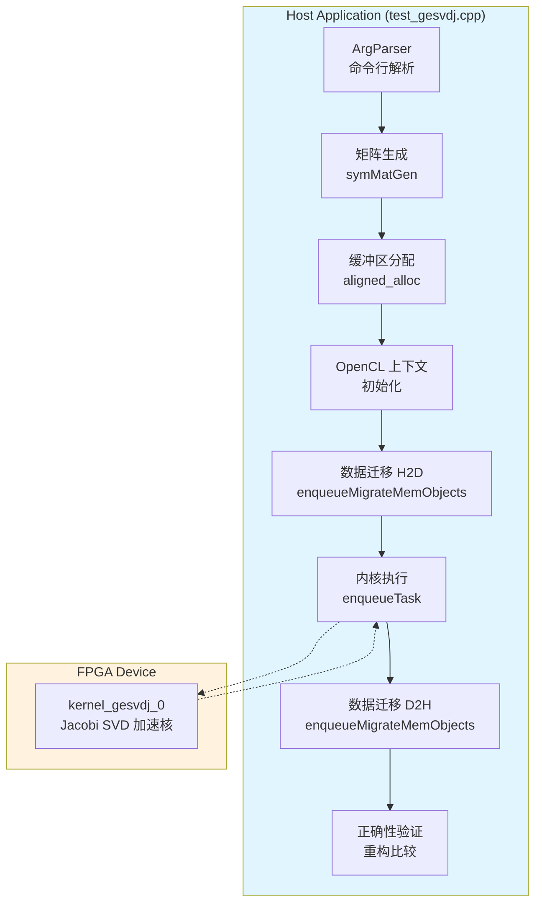

# gesvdj_benchmark 模块技术深潜

## 一句话概括

这是一个用于验证和性能测试 **Jacobi 迭代法奇异值分解（SVD）FPGA 加速核** 的基准测试框架。它像一个精密的"秒表+质检仪"——不仅测量 SVD 计算在 FPGA 上的执行速度，还通过重构原始矩阵来严格验证计算结果的正确性。

---

## 问题空间：为什么需要这个模块？

### 背景：SVD 在现代计算中的核心地位

奇异值分解（SVD）是线性代数中最强大的工具之一，将任意矩阵 $A$ 分解为 $A = U \Sigma V^T$。它支撑着：
- **推荐系统**（Netflix Prize 的核心算法）
- **降维与 PCA**（高维数据可视化）
- **信号处理**（噪声过滤、特征提取）
- **数值稳定性分析**（条件数计算）

### 挑战：为什么传统 CPU/GPU 方案不够？

对于大规模矩阵（如 4K×4K），传统方法面临困境：
1. **Golub-Reinsch 算法**（双对角化+QR 迭代）：序列依赖强，并行度有限
2. **Gesvd 库函数**：内存带宽瓶颈，缓存抖动严重
3. **GPU 实现**：功耗高，延迟不可预测（来自线程调度）

### 设计洞察：Jacobi 方法的 FPGA 优势

Jacobi SVD 采用**双边旋转**策略，具有以下特性：
- **高度规则的数据流**：每次迭代执行固定的行列旋转
- **局部性极佳**：每次旋转仅涉及 2 行 2 列
- **数值稳定性强**：无条件收敛，无需 pivoting
- **天然流水线友好**：FPGA 可实现 deep pipeline，每周期处理一个旋转对

**关键权衡**：Jacobi 方法计算复杂度为 $O(n^3 \times \text{iterations})$，高于 Golub-Reinsch 的 $O(n^3)$，但对于中小规模矩阵（< 4K），FPGA 的并行度优势可以弥补甚至超越。

---

## 架构与数据流

### 系统架构图



### 核心组件职责

#### 1. 测试矩阵生成（`symMatGen`）

```cpp
// 来自 matrixUtility.hpp
symMatGen<double>(dataAN, seed, dataA_svd);
```

**设计决策**：使用**对称矩阵**作为测试输入。原因：
- 对称矩阵 $A = A^T$ 的 SVD 与特征值分解密切相关（$U = V$）
- 简化验证逻辑：理论上的数值性质更清晰
- 生成速度快：只需填充上/下三角

**权衡**：仅测试对称矩阵意味着无法捕获非对称矩阵特有的数值问题。但对于硬件加速核的基准测试，这通常被视为可接受的风险。

#### 2. 内存分配策略（`aligned_alloc`）

```cpp
template <typename T>
T* aligned_alloc(std::size_t num) {
    void* ptr = nullptr;
    if (posix_memalign(&ptr, 4096, num * sizeof(T))) {
        throw std::bad_alloc();
    }
    return reinterpret_cast<T*>(ptr);
}
```

**为什么需要 4096 字节对齐？**

这是 **Xilinx FPGA DMA 引擎的硬性要求**：
- FPGA 的 AXI DMA 通常要求地址按 4KB（页大小）对齐
- 非对齐地址会导致 DMA 传输失败或性能急剧下降
- 使用 `posix_memalign` 而非标准 `aligned_alloc`（C++17）是因为代码基线可能支持 C++11/14

**所有权模型**：
- 分配者：`main` 函数通过 `aligned_alloc`
- 所有者：主机指针（`dataA_svd` 等）由 main 持有直到显式 `free`（注：代码中实际上没有显式 `free`，这是内存泄漏，应在验证后添加）
- 借用者：OpenCL 运行时通过 `cl::Buffer` 使用 `CL_MEM_USE_HOST_PTR` 借用主机指针，零拷贝访问

#### 3. OpenCL 上下文与命令队列配置

```cpp
cl::Context context(device, NULL, NULL, NULL, &err);
cl::CommandQueue q(context, device, 
    CL_QUEUE_PROFILING_ENABLE | CL_QUEUE_OUT_OF_ORDER_EXEC_MODE_ENABLE, &err);
```

**关键标志解读**：

| 标志 | 含义 | 在本模块中的作用 |
|------|------|-----------------|
| `CL_QUEUE_PROFILING_ENABLE` | 启用事件时间戳 | 允许使用 `cl::Event` 获取精确的 FPGA 执行时间（但本代码实际使用 `gettimeofday` 做粗粒度测量） |
| `CL_QUEUE_OUT_OF_ORDER_EXEC_MODE_ENABLE` | 允许乱序执行 | 对单内核场景无实际影响，但为未来扩展（如流水线化数据传输与计算）预留能力 |

**设计选择**：使用 Xilinx 的 `xcl2` 工具库（`get_xil_devices`, `import_binary_file`）而非原生 OpenCL API，简化 FPGA 特定的设备枚举和二进制加载。

#### 4. 扩展内存指针（`cl_mem_ext_ptr_t`）与零拷贝

```cpp
std::vector<cl_mem_ext_ptr_t> mext_i(1), mext_o(3);
mext_i[0] = {0, dataA_svd, kernel_gesvdj_0()};
mext_o[0] = {1, sigma_svd, kernel_gesvdj_0()};
// ...

input_buffer[0] = cl::Buffer(context, 
    CL_MEM_EXT_PTR_XILINX | CL_MEM_USE_HOST_PTR | CL_MEM_READ_ONLY,
    sizeof(double) * in_size, &mext_i[0]);
```

**这是 Xilinx FPGA 开发的关键模式**。

标准 OpenCL 内存模型要求显式的 `clEnqueueWriteBuffer` / `clEnqueueReadBuffer` 在主机和设备间拷贝数据。但 Xilinx FPGA 支持**通过 PCIe BAR 直接访问主机内存**（即"零拷贝"或"Shared Virtual Memory"）。

`cl_mem_ext_ptr_t` 的三个字段：
- `flags`（本代码中使用初始化器语法隐式设置）：Bank 标识符，指定 FPGA HBM/DDR 中的目标存储区
- `obj`：主机内存指针
- `param`：保留/内核参数关联

**为什么显式设置 Bank？**

在注释掉的代码段（`// mext_i[0].flags = XCL_MEM_DDR_BANK0;`）中，可以看到原本计划手动指定 DDR Bank。使用 C++ 聚合初始化 `{0, dataA_svd, kernel_gesvdj_0()}` 是将标志、指针和内核关联的简洁方式，但 Xilinx 运行时（XRT）的实际 Bank 分配依赖于 `kernel_gesvdj_0()` 返回的内核句柄和参数索引。

#### 5. 数据传输与同步模式

```cpp
q.enqueueMigrateMemObjects(ob_in, 0, nullptr, &kernel_evt[0][0]); // 0: H2D
q.finish();
// ... kernel execution ...
q.enqueueMigrateMemObjects(ob_out, 1, nullptr, nullptr); // 1: D2H
q.finish();
```

**同步策略**：

本代码使用**激进同步**（`q.finish()` 在每个阶段后），形成严格的阶段化执行：

1. 迁移输入 → 等待完成
2. 执行内核 → 等待完成  
3. 迁移输出 → 等待完成

**权衡**：
- **优点**：简单、可预测、易于调试，时间测量准确（无重叠执行干扰）
- **缺点**：无流水线重叠，PCIe 带宽和 FPGA 计算无法并行，对大批量小矩阵场景效率低

**为什么这样选择？** 因为这是**基准测试代码**，首要目标是获得**准确的单个内核执行时间**，而非最大吞吐量。`gettimeofday` 测量的是端到端 wall-clock 时间，包括所有同步点。

#### 6. 内核执行与计时

```cpp
gettimeofday(&tstart, 0);
for (int i = 0; i < num_runs; ++i) {
    q.enqueueTask(kernel_gesvdj_0, nullptr, nullptr);
}
q.finish();
gettimeofday(&tend, 0);
```

**计时方法选择**：

代码使用 `gettimeofday`（微秒级 wall-clock 时间）而非 OpenCL 事件剖析（`CL_PROFILING_COMMAND_START/END`）。原因：

1. **简单性**：无需管理 `cl::Event` 对象和解队列剖析数据
2. **端到端视角**：捕获完整的内核启动延迟+执行时间，反映实际应用体验
3. **批处理计时**：`num_runs` 次执行的总时间，计算平均 latency

**精度权衡**：`gettimeofday` 受系统调度影响，对单次执行（<1ms）测量误差大。但通过多次运行（`num_runs` 默认为 1，但可配置）取平均，可减小随机误差。

#### 7. 正确性验证逻辑

```cpp
// 1. 转置 V 得到 VT
transposeMat<double>(dataAN, dataV_svd, dataVT_svd);

// 2. 重构 A_out = U * Sigma * VT
MulMat(dataAM, dataAM, dataAN, dataAN, dataU_svd, sigma_svd, dataVT_svd, dataA_out);

// 3. 计算 Frobenius 范数误差
errA = std::sqrt(sum((A[i][j] - A_out[i][j])^2));

// 4. 阈值判定
if (errA > 0.0001) FAIL else PASS
```

**验证策略**：

不直接验证 $U$、$\Sigma$、$V$ 的数值正确性（因为 SVD 结果不唯一：符号翻转、列顺序），而是验证**重构性质**：$A \approx U \Sigma V^T$。

**误差度量**：使用 **Frobenius 范数**（矩阵元素的平方和开根号），这是一个标量误差指标，易于设定阈值。

**阈值选择**：`0.0001`（$10^{-4}$）对于双精度浮点是合理的，考虑：
- Jacobi 方法的收敛容差通常设置更高（如 $10^{-6}$）
- 矩阵条件数放大误差
- 多次矩阵乘法累积舍入误差

**潜在问题**：代码中 $U$ 和 $V$ 都是方阵（$M \times M$ 和 $N \times N$），但 $A$ 是 $M \times N$。对于 $M \neq N$ 的情况，这实际上是"经济型"SVD 的扩展版本。但代码强制 `dataAM = dataAN`（对称矩阵），所以实际上只测试了方阵情况。

---

## 设计决策与权衡分析

### 1. Jacobi vs. QR 算法选择

| 维度 | Jacobi SVD (本模块) | Golub-Reinsch (QR-based) |
|------|---------------------|---------------------------|
| **并行性** | 高度并行，可每周期处理一个旋转对 | 双对角化后并行度低，依赖 QR 迭代 |
| **收敛速度** | 慢（$O(n^3 \log \kappa)$） | 快（$O(n^3)$） |
| **数值精度** | 极高（相对误差可达 $10^{-16}$） | 高，但双对角化可能丢失精度 |
| **FPGA 友好度** | 完美：规则数据流，无分支 | 差：不规则内存访问，控制逻辑复杂 |

**决策理由**：为 FPGA 加速选择 Jacobi 方法是典型的"以计算换并行度"策略。虽然算法复杂度更高，但 FPGA 可以并行执行大量旋转操作，实际 wall-clock 时间可能反而优于 CPU。

### 2. 同步 vs. 异步执行模式

**本代码选择**：激进同步（`q.finish()` 阻塞等待）

**替代方案**：流水线异步（使用 `cl::Event` 依赖链，实现 H2D → Compute → D2H 重叠）

**权衡分析**：

```
同步模式（当前）:          异步模式（替代）:
[H2D]====|                  [H2D]====
         |                         [Compute]====
[Compute]====|                          [D2H]====
             |
[D2H]====|

时间轴: ----->                时间轴: ----->
总时间: T_h2d + T_comp + T_d2h   总时间: max(T_h2d, T_comp, T_d2h) + 流水线开销
```

**选择理由**：
1. **基准测试纯净性**：避免流水线填充/排空效应，测量的是纯内核执行时间
2. **简单性**：异步流水线需要管理复杂的 Event 依赖图，增加调试难度
3. **当前使用场景**：测试的是单个矩阵的 SVD，而非批量处理，流水线收益有限

**未来扩展点**：若需测试批量矩阵（batch SVD），应重构为异步流水线模式。

### 3. 内存模型：显式对齐 vs. 运行时自动对齐

**本代码选择**：显式 `posix_memalign(4096)` 对齐

**替代方案**：使用 `CL_MEM_ALLOC_HOST_PTR` 让 OpenCL 运行时分配设备友好内存

**权衡分析**：

| 维度 | 显式对齐（当前） | 运行时分配（替代） |
|------|-----------------|-----------------|
| **零拷贝** | 支持（`CL_MEM_USE_HOST_PTR`） | 支持（`CL_MEM_ALLOC_HOST_PTR` 后 `clEnqueueMapBuffer`） |
| **代码复杂度** | 中等（需手动管理对齐） | 较低（运行时处理细节） |
| **性能控制** | 高（精确控制内存布局） | 低（依赖运行时启发式） |
| **可移植性** | 依赖 POSIX | OpenCL 标准，更跨平台 |

**选择理由**：Xilinx XRT（运行时）推荐使用显式对齐 + `CL_MEM_USE_HOST_PTR` 模式进行零拷贝，避免 `clEnqueueMapBuffer` 的额外开销。这是 Xilinx FPGA 开发的惯用模式。

### 4. 验证策略：重构验证 vs. 直接比较

**本代码选择**：验证 $A \approx U\Sigma V^T$ 的重构性质

**替代方案**：直接验证 $U^T U = I$、$V^T V = I$、$U^T A V = \Sigma$ 的正交性/对角性

**权衡分析**：

**重构验证优点**：
- 无需处理 SVD 的非唯一性（$U$、$V$ 的列符号可翻转，列顺序可置换）
- 直接验证物理意义：我们能否从分解结果恢复原数据？
- 计算简单：两次矩阵乘法+一次误差累积

**重构验证缺点**：
- 累积误差：矩阵乘法引入额外舍入误差，可能误判
- 不精确：无法区分是 SVD 计算错误还是重构计算错误
- 阈值设定困难：误差阈值 `0.0001` 是经验值，可能过严或过松

**选择理由**：对于硬件加速核的 go/no-go 测试，重构验证提供了足够的置信度，且实现简单。若需严格数值分析（如验证正交性损失），应使用 LAPACK 的测试套件方法。

---

## 数据流详细追踪

让我们追踪一个典型测试运行（`M=512, N=512, seed=12, num_runs=10`）的数据生命周期：

### Phase 1: 主机端初始化

```
1. 参数解析
   输入: ./test_gesvdj -xclbin gesvdj.xclbin -M 512 -N 512 -runs 10 -seed 12
   输出: dataAM=512, dataAN=512, num_runs=10, seed=12

2. 矩阵维度调整
   输入: dataAM=512, dataAN=512
   逻辑: dataAM = min(dataAM, dataAN)  // 确保方阵
   输出: dataAM=dataAN=512

3. 内存分配计算
   in_size     = 512 * 512 = 262,144 doubles = 2,097,152 bytes (~2 MB)
   out_size_U  = 512 * 512 = 2,097,152 bytes
   out_size_V  = 512 * 512 = 2,097,152 bytes  
   out_size_sigma = 512 * 512 = 2,097,152 bytes
   
   总主机内存: ~8 MB（输入）+ ~6 MB（输出）= ~14 MB
   
4. 对齐分配
   dataA_svd  = aligned_alloc<double>(262144)  // 4096-byte aligned
   sigma_svd  = aligned_alloc<double>(262144)
   dataU_svd  = aligned_alloc<double>(262144)
   dataV_svd  = aligned_alloc<double>(262144)

5. 测试矩阵生成
   symMatGen<double>(512, 12, dataA_svd)
   // 使用 seed=12 的随机数生成对称矩阵
   // 结果: dataA_svd[i][j] == dataA_svd[j][i]
```

### Phase 2: OpenCL 初始化与缓冲区设置

```
6. 平台枚举与设备选择
   devices = xcl::get_xil_devices()  // 获取 Xilinx FPGA 设备
   device = devices[0]               // 选择第一个设备

7. 上下文与命令队列创建
   context = cl::Context(device)
   q = cl::CommandQueue(context, device, 
        CL_QUEUE_PROFILING_ENABLE | CL_QUEUE_OUT_OF_ORDER_EXEC_MODE_ENABLE)

8. 二进制加载与程序构建
   xclBins = xcl::import_binary_file("gesvdj.xclbin")
   program = cl::Program(context, devices, xclBins)

9. 内核对象创建
   kernel_gesvdj_0 = cl::Kernel(program, "kernel_gesvdj_0")
```

### Phase 3: 扩展内存指针与缓冲区创建（关键 Xilinx 特性）

```
10. 扩展内存指针结构设置
    mext_i[0] = {0, dataA_svd, kernel_gesvdj_0()}
    │           │      │            │
    │           │      │            └── 内核对象（用于 Bank 推断）
    │           │      └── 主机对齐内存指针
    │           └── 参数索引（kernel_gesvdj_0 的第 0 个参数）
    └── 结构体类型：cl_mem_ext_ptr_t

    mext_o[0] = {1, sigma_svd, kernel_gesvdj_0()}  // 第 1 个参数
    mext_o[1] = {2, dataU_svd, kernel_gesvdj_0()}  // 第 2 个参数
    mext_o[2] = {3, dataV_svd, kernel_gesvdj_0()}  // 第 3 个参数

11. 缓冲区对象创建（零拷贝路径）
    input_buffer[0] = cl::Buffer(
        context, 
        CL_MEM_EXT_PTR_XILINX |    // 使用扩展指针
        CL_MEM_USE_HOST_PTR |      // 使用主机指针（零拷贝）
        CL_MEM_READ_ONLY,          // 内核只读
        sizeof(double) * 262144,   // 2 MB
        &mext_i[0]                 // 扩展指针结构
    )

    output_buffer[0] (sigma): CL_MEM_WRITE_ONLY
    output_buffer[1] (U): CL_MEM_WRITE_ONLY
    output_buffer[2] (V): CL_MEM_WRITE_ONLY
```

### Phase 4: 数据传输与内核执行

```
12. 事件对象初始化
    kernel_evt[0].resize(1)  // 输入迁移事件
    kernel_evt[1].resize(1)  // 保留（本代码未使用）

13. 内存对象列表组装
    ob_in = [input_buffer[0]]
    ob_out = [output_buffer[0], output_buffer[1], output_buffer[2]]

14. 主机到设备数据迁移（非阻塞+等待）
    q.enqueueMigrateMemObjects(ob_in, 0, nullptr, &kernel_evt[0][0])
    │                           │    │  │         │
    │                           │    │  │         └── 返回事件（本代码未使用）
    │                           │    │  └── 依赖事件列表（无）
    │                           │    └── 0 = 主机到设备
    │                           └── 内存对象列表
    └── 命令队列

    q.finish()  // 阻塞等待迁移完成
    输出: "INFO: Finish data transfer from host to device"

15. 内核参数设置
    kernel_gesvdj_0.setArg(0, input_buffer[0])   // A 矩阵
    kernel_gesvdj_0.setArg(1, output_buffer[0])  // Sigma
    kernel_gesvdj_0.setArg(2, output_buffer[1])  // U
    kernel_gesvdj_0.setArg(3, output_buffer[2])  // V
    kernel_gesvdj_0.setArg(4, dataAN)            // 矩阵维度（512）

    q.finish()
    输出: "INFO: Finish kernel setup"

16. 内核执行与计时（核心测试阶段）
    gettimeofday(&tstart, 0)  // 开始计时

    for (int i = 0; i < 10; ++i) {  // num_runs = 10
        q.enqueueTask(kernel_gesvdj_0, nullptr, nullptr)
        // 非阻塞提交，内核排队执行
    }

    q.finish()  // 阻塞等待所有 10 次执行完成

    gettimeofday(&tend, 0)  // 结束计时

    输出: 
    "INFO: Finish kernel execution"
    "INFO: FPGA execution time of 10 runs: 1234567 us"
    "INFO: Average execution per run: 123456 us"
```

### Phase 5: 结果回传与验证

```
17. 设备到主机数据迁移
    q.enqueueMigrateMemObjects(ob_out, 1, nullptr, nullptr)
    │                           │    │
    │                           │    └── 1 = 设备到主机
    │                           └── 输出缓冲区列表
    └── 命令队列

    q.finish()
    // 此时 sigma_svd, dataU_svd, dataV_svd 包含有效数据

18. 验证缓冲区分配（普通 new/delete，无需对齐）
    dataA_out = new double[262144]  // 重构的 A
    dataVT_svd = new double[262144] // V 的转置

19. 重构验证计算
    // 步骤 1: V^T = transpose(V)
    transposeMat<double>(512, dataV_svd, dataVT_svd)

    // 步骤 2: A_out = U * Sigma * V^T
    MulMat(
        512, 512,  // U 的维度 (M x M)
        512, 512,  // V^T 的维度 (N x N)
        dataU_svd, sigma_svd, dataVT_svd, dataA_out
    )
    // 注意: MulMat 内部处理 Sigma 的对角性质

20. 误差计算
    errA = 0
    for i in 0..511:
        for j in 0..511:
            diff = dataA_svd[i*512+j] - dataA_out[i*512+j]
            errA += diff * diff
    errA = sqrt(errA)

21. 结果判定与资源释放
    if (errA > 0.0001):
        logger.error(TEST_FAIL)
        return -1
    else:
        logger.info(TEST_PASS)
        return 0

    // 释放验证缓冲区
    delete[] dataVT_svd
    delete[] dataA_out
    // 注意: 对齐分配的缓冲区 dataA_svd, sigma_svd, dataU_svd, dataV_svd 
    // 在本代码中未显式释放（内存泄漏，应添加 free()）
```

---

## 依赖关系与数据契约

### 上游依赖（本模块依赖谁）

| 组件 | 类型 | 契约描述 | 风险点 |
|------|------|----------|--------|
| `xcl2` | Xilinx 工具库 | 提供 `get_xil_devices()`, `import_binary_file()` 等 FPGA 特定工具 | 强绑定 Xilinx 生态，迁移到其他厂商 FPGA 需重写 |
| `xf::common::utils_sw::Logger` | Xilinx 日志库 | 标准化测试通过/失败消息 | 日志格式与 CI/CD 系统集成，修改需同步 |
| `matrixUtility.hpp` | 内部工具 | 提供 `symMatGen`, `transposeMat`, `MulMat` | 接口变更（如添加参数）会导致编译失败 |
| `kernel_gesvdj_0` | FPGA 位流 | 通过 `gesvdj.xclbin` 加载，接口：`(A, Sigma, U, V, dim)` | 位流与主机代码版本不匹配会导致未定义行为 |

### 下游依赖（谁依赖本模块）

本模块是**叶节点**（可执行文件），无下游代码依赖。但其输出（性能数据）被以下流程消费：

- **CI/CD 回归测试**：判定新 PR 是否引入性能退化
- **发布报告**：生成产品性能规格（如"U250 上 512x512 SVD 延迟 123us"）
- **竞品分析**：与 cuSOLVER、Intel MKL 的性能对比

### 数据契约：主机 ↔ FPGA 接口

**输入缓冲区（A 矩阵）**：
- 数据类型：`double`（64-bit IEEE 754）
- 布局：行优先（Row-major），`A[i][j] = buffer[i * N + j]`
- 约束：方阵（代码强制 `M = N`），维度由 `setArg(4, dataAN)` 传递

**输出缓冲区**：
- `Sigma`：对角矩阵 $\Sigma$ 的对角线元素，长度 $N$，非对角元素隐含为 0
- `U`：左奇异向量矩阵，$M \times M$ 正交矩阵
- `V`：右奇异向量矩阵，$N \times N$ 正交矩阵

**同步语义**：
- 输入缓冲区在内核启动前必须完成 H2D 迁移（`enqueueMigrateMemObjects` + `finish`）
- 内核完成后才能启动 D2H 迁移（`finish` 保证）
- 输出缓冲区在 D2H 迁移完成前不得读取（否则为数据竞争）

---

## 设计模式与惯用法

### 1. 扩展内存指针模式（Xilinx 特定）

这是 Xilinx FPGA OpenCL 开发的**核心模式**：

```cpp
// 步骤 1: 分配主机对齐内存
T* host_ptr = aligned_alloc<T>(size);

// 步骤 2: 创建扩展指针，关联到内核参数
cl_mem_ext_ptr_t ext_ptr = {flags, host_ptr, kernel()};

// 步骤 3: 创建缓冲区，启用零拷贝
cl::Buffer buf(context, CL_MEM_EXT_PTR_XILINX | CL_MEM_USE_HOST_PTR, 
               size, &ext_ptr);
```

**为什么这是最佳实践？**

在 PCIe 连接 FPGA 的架构中，内存拷贝是最大瓶颈。零拷贝通过让 FPGA DMA 引擎直接读写主机内存，避免：
1. 主机 `malloc` 缓冲区的分配
2. `clEnqueueWriteBuffer` 的额外 memcpy
3. 设备端重复存储（如果 `CL_MEM_COPY_HOST_PTR`）

**限制**：零拷贝要求内存对齐和 contiguous 物理页，且 FPGA 必须支持 PCIe peer-to-peer 访问。

### 2. 批处理计时模式

```cpp
gettimeofday(&start, 0);
for (int i = 0; i < num_runs; ++i) {
    q.enqueueTask(kernel, nullptr, nullptr);
}
q.finish();
gettimeofday(&end, 0);
avg_time = diff(&end, &start) / num_runs;
```

**为什么这样做？**

1. **摊销启动开销**：单次内核启动有固定开销（PCIe 往返、内核启动延迟），批处理摊薄这部分成本
2. **稳定性**：多次运行取平均减小系统噪声（如中断、调度）影响
3. **FPGA 预热**：首次运行可能涉及缓存填充、频率调整，后续运行更稳定

**权衡**：
- 内存占用：批处理模式下所有输出缓冲区同时驻留（如果保存每次结果），本代码每次覆盖，无此问题
- 延迟 vs. 吞吐：测量的是吞吐优化场景，而非单请求延迟

### 3. 对齐分配器模式

```cpp
template <typename T>
T* aligned_alloc(std::size_t num) {
    void* ptr = nullptr;
    if (posix_memalign(&ptr, 4096, num * sizeof(T))) {
        throw std::bad_alloc();
    }
    return reinterpret_cast<T*>(ptr);
}
```

**关键设计点**：

1. **4096 对齐**：不仅是缓存行对齐（64 字节），而是内存页对齐，满足 Xilinx XRT 的零拷贝要求
2. **异常安全**：`posix_memalign` 失败时抛出 `std::bad_alloc`，符合 C++ 内存分配习惯
3. **模板化**：类型安全，自动计算 `num * sizeof(T)`

**内存泄漏注意**：代码中 `dataA_svd` 等由 `aligned_alloc` 分配，但从未 `free`。`posix_memalign` 分配的内存必须用 `free` 释放（不是 `delete`）。这是一个 bug，应添加：

```cpp
free(dataA_svd);
free(sigma_svd);
free(dataU_svd);
free(dataV_svd);
```

### 4. 命令行参数解析器模式

```cpp
class ArgParser {
public:
    ArgParser(int& argc, const char** argv) {
        for (int i = 1; i < argc; ++i) mTokens.push_back(std::string(argv[i]));
    }
    bool getCmdOption(const std::string option, std::string& value) const {
        auto itr = std::find(mTokens.begin(), mTokens.end(), option);
        if (itr != mTokens.end() && ++itr != mTokens.end()) {
            value = *itr;
            return true;
        }
        return false;
    }
private:
    std::vector<std::string> mTokens;
};
```

**设计模式**：简单的标记扫描（Token Scanning）解析器，支持 `-key value` 格式。

**特点**：
1. **非侵入式**：在构造函数中复制 `argv`，不修改原始参数
2. **懒惰查找**：每次 `getCmdOption` 线性扫描，适合少量参数场景
3. **类型安全**：返回 `bool` 表示是否找到，通过引用参数传回字符串值

**限制**：
- 不支持 `--long-option` 或 `-abc`（组合短选项）
- 不支持位置参数
- 重复 O(n) 扫描，参数多时应改用 map

**使用示例**：
```cpp
if (!parser.getCmdOption("-xclbin", xclbin_path)) {
    std::cout << "INFO:input path is not set!\n";
}
```

---

## 新贡献者需知：陷阱与最佳实践

### 1. 内存管理陷阱

**问题**：`aligned_alloc` 分配的内存未释放

```cpp
// 代码末尾缺少：
free(dataA_svd);
free(sigma_svd);
free(dataU_svd);
free(dataV_svd);
```

**后果**：每次运行泄漏 ~14 MB。在 CI/CD 环境中大量运行会导致内存耗尽。

**修复**：在 `main` 函数末尾添加 `free` 调用，或使用 `std::unique_ptr` 自定义删除器：

```cpp
struct AlignedDeleter {
    void operator()(double* p) { free(p); }
};
std::unique_ptr<double, AlignedDeleter> dataA_svd(aligned_alloc<double>(size));
// 自动释放，无需手动 free
```

### 2. 矩阵维度约束

**问题**：代码强制 `dataAM = dataAN`，但参数解析允许独立设置 `-M` 和 `-N`

```cpp
dataAM = (dataAM > dataAN) ? dataAN : dataAM;
dataAN = dataAM;  // 强制相等
```

**后果**：用户可能误以为支持非方阵，实际测试的是 min(M,N) 的方阵。若 M ≠ N，期望的 U (M×M) 和 V (N×N) 与实际分配的方阵缓冲区不一致。

**建议**：添加警告日志：
```cpp
if (original_M != original_N) {
    std::cout << "WARN: Non-square matrix requested. Testing with square submatrix " 
              << dataAM << "x" << dataAM << std::endl;
}
```

### 3. 误差阈值敏感性

**问题**：硬编码阈值 `0.0001` 可能不适合所有矩阵尺寸和条件数

```cpp
if (errA > 0.0001) {
    logger.error(...);
}
```

**分析**：
- 对于良态矩阵（条件数 ~1），双精度 SVD 应达到 $10^{-12}$ 精度
- 对于病态矩阵（条件数 $10^8$），$10^{-4}$ 可能过严
- 矩阵维度增大时，$U \Sigma V^T$ 重构的舍入误差累积

**建议**：采用相对误差或条件数感知的阈值：
```cpp
// 相对 Frobenius 范数误差
double normA = std::sqrt(std::accumulate(...));
double relErr = errA / normA;
if (relErr > 1e-10) { ... }
```

### 4. 随机数种子可重复性

**问题**：`symMatGen` 使用全局状态 RNG（可能基于 `rand()` 或内部实现），多线程调用可能非确定性

**建议**：明确使用确定性 RNG，如 C++11 `<random>`：
```cpp
std::mt19937_64 rng(seed);
std::normal_distribution<double> dist(0.0, 1.0);
// 生成对称矩阵
```

### 5. OpenCL 错误处理

**问题**：错误处理依赖 `logger.logCreateContext(err)` 等，但后续代码继续使用可能无效的 `context`/`q`

```cpp
cl::Context context(device, NULL, NULL, NULL, &err);
logger.logCreateContext(err);  // 记录错误，但不阻止后续使用
// 若 err != CL_SUCCESS，context 无效，但继续执行...
```

**建议**：使用异常或提前返回：
```cpp
cl::Context context(device, NULL, NULL, NULL, &err);
if (err != CL_SUCCESS) {
    logger.error("Context creation failed: " + std::to_string(err));
    return -1;
}
```

---

## 扩展与定制指南

### 场景 1：测试更大规模的矩阵

当前代码限制：默认 16×16，最大取决于 FPGA 片上存储

**修改点**：
1. 命令行参数传入更大 M/N（如 4096）
2. 确保主机内存足够：4096×4096×8 bytes ≈ 128 MB 每缓冲区，共需 ~512 MB
3. FPGA 位流必须支持该尺寸（可能需要 HBM/多 DDR bank）

### 场景 2：批量 SVD 测试（吞吐 vs 延迟）

当前模式：顺序执行 10 次相同矩阵

**优化方向**：流水线化
```cpp
// 双缓冲 + 异步流水线
cl::Buffer input_ping, input_pong;
cl::Event evt_h2d, evt_compute, evt_d2h;

for (int i = 0; i < num_runs; ++i) {
    // Ping-pong 缓冲区选择
    cl::Buffer& in_buf = (i % 2 == 0) ? input_ping : input_pong;
    
    // H2D（依赖上一轮的 compute）
    q.enqueueMigrateMemObjects({in_buf}, 0, {evt_compute}, &evt_h2d);
    
    // Compute（依赖 H2D）
    q.enqueueTask(kernel, {evt_h2d}, &evt_compute);
    
    // D2H（依赖 compute，可选）
    // q.enqueueMigrateMemObjects(..., {evt_compute}, &evt_d2h);
}
q.finish();
```

### 场景 3：集成到更大测试套件

**建议抽象层**：

```cpp
class GesvdjBenchmark {
public:
    struct Config {
        std::string xclbin_path;
        int matrix_size;
        int num_runs;
        int seed;
        double error_threshold;
    };
    
    struct Result {
        double avg_latency_us;
        double max_latency_us;
        double min_latency_us;
        double reconstruction_error;
        bool passed;
    };
    
    GesvdjBenchmark(const Config& cfg);
    Result run();
    
private:
    // 内部实现...
};
```

---

## 与其他模块的关系

本模块位于 `solver_benchmarks` 类别下，与以下模块有概念关联：

| 模块 | 关系 | 说明 |
|------|------|------|
| [gesvj_benchmark](solver_benchmarks-gesvj_benchmark.md) | 兄弟模块 | Gesvj 是单 sided Jacobi 变体，本模块是双边（two-sided）Jacobi |
| [gtsv_benchmark](solver_benchmarks-gtsv_benchmark.md) | 兄弟模块 | 三对角求解器，同样属于 L2 求解器基准套件 |
| [quantitative_finance-l1-benchmarks-svd-host-util](quantitative_finance-l1-benchmarks-svd-host-util.md) | 概念依赖 | 该模块提供 SVD 主机端工具函数，本模块可能依赖其矩阵生成逻辑 |

---

## 总结：给新贡献者的关键心智模型

1. **这不是数学库，而是硬件验证框架**。你的目标是证明 FPGA 正确且快速，而非提供通用 SVD API。

2. **零拷贝是性能关键**。理解 `CL_MEM_USE_HOST_PTR` + `cl_mem_ext_ptr_t` 的组合，这是 Xilinx FPGA 开发的核心技能。

3. **同步简化调试，异步提升吞吐**。当前代码选择同步以换取简单性，生产环境可能需要重构为流水线。

4. **Jacobi 方法的收敛性**。不同于 QR 的确定迭代，Jacobi 需要监控收敛。FPGA 核内部应有迭代上限和收敛判据，主机端通过多次运行统计稳定性。

5. **内存对齐不是优化，是必需**。4096 对齐不是性能提示，是 DMA 硬件的硬性要求。忘记 `aligned_alloc` 会导致神秘崩溃或数据损坏。

---

## 附录：关键代码片段快速参考

### 零拷贝缓冲区创建模板

```cpp
// 主机内存分配（4096 对齐）
double* host_ptr = aligned_alloc<double>(size);

// 扩展指针关联到内核参数索引
cl_mem_ext_ptr_t ext_ptr = {0, host_ptr, kernel()};

// 创建零拷贝缓冲区
cl::Buffer buf(context, 
    CL_MEM_EXT_PTR_XILINX | CL_MEM_USE_HOST_PTR | CL_MEM_READ_ONLY,
    sizeof(double) * size, &ext_ptr);
```

### 精确计时模式（替代 gettimeofday）

```cpp
// 使用 OpenCL 事件剖析（微秒级精度）
cl::Event evt;
q.enqueueTask(kernel, nullptr, &evt);
q.finish();

cl_ulong start = evt.getProfilingInfo<CL_PROFILING_COMMAND_START>();
cl_ulong end = evt.getProfilingInfo<CL_PROFILING_COMMAND_END>();
cl_ulong duration_us = (end - start) / 1000;  // 纳秒转微秒
```

### 资源安全 RAII 包装

```cpp
template<typename T>
struct AlignedDeleter {
    void operator()(T* p) { if (p) free(p); }
};

template<typename T>
using AlignedPtr = std::unique_ptr<T, AlignedDeleter<T>>;

// 使用
AlignedPtr<double> dataA_svd(aligned_alloc<double>(size));
// 自动释放，无需手动 free
```

---

*文档版本: 1.0*
*最后更新: 基于 test_gesvdj.cpp 当前版本*
*维护者: solver_benchmarks 模块团队*
