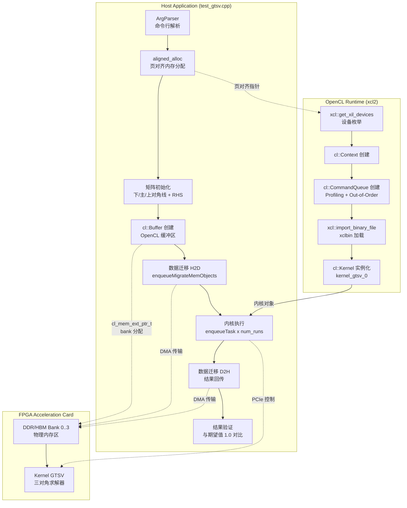

# GTSV Benchmark: Tridiagonal System Solver on FPGA

## 开篇：这个模块是做什么的？

想象你正在用有限差分法模拟一根受热金属棒的温度分布——这最终会变成一个特殊的线性方程组：每个未知量只与它左右相邻的变量有关。这种**三对角系统**（Tridiagonal System）在传统 CPU 上求解的复杂度是 $O(n)$，但当问题规模达到百万级、且需要实时响应时，我们既需要硬件加速，也需要一个严谨的基准测试来验证加速器的正确性与性能。

**`gtsv_benchmark`** 正是这个角色：它是 Xilinx FPGA 上三对角求解器（General Tridiagonal Solver, GTSV）的**基准测试与验证框架**。它不是生产环境的求解器调用接口，而是工程师用来回答以下问题的工具：
- 硬件内核在特定矩阵规模下的执行延迟是多少微秒？
- 跨多次运行的性能波动是否在可接受范围？
- 求解结果是否在数值精度上满足 $10^{-7}$ 的误差容忍度？

如果你把 FPGA 加速卡看作一台专用计算仪器，那么这个模块就是它的**校准与计量程序**。


## 架构全景：数据如何在主机与硬件间流动？

### 架构图



### 角色与职责

| 组件 | 角色 | 核心职责 |
|------|------|----------|
| **`ArgParser`** | 命令行门卫 | 解析 `-xclbin`、`-runs`、`-M` 参数，提供缺省值，隔离用户输入与内部逻辑的耦合。 |
| **`aligned_alloc`** | 内存策略层 | 强制 4096 字节页对齐，满足 Xilinx OpenCL 运行时对 DMA 传输的硬件对齐要求，避免透明拷贝带来的性能损失。 |
| **矩阵初始化块** | 测试数据工厂 | 构造经典三对角测试用例：主对角线为 2，次对角线为 -1，RHS 向量两端为 1，其余为 0。此结构对应一维泊松方程的离散化。 |
| **`cl_mem_ext_ptr_t` + Buffer 创建** | 内存映射策略 | 通过 `param` 字段（取值为 1,2,3,4）显式指定 DDR/HBM 内存 bank，避免内核与内存控制器之间的跨 bank 访问瓶颈。 |
| **数据迁移 (H2D/D2H)** | DMA 调度器 | 使用 `enqueueMigrateMemObjects` 显式触发 PCIe DMA 传输，配合 `cl::Event` 实现迁移与计算的流水线 overlap（本实现采用同步 finish 确保时序清晰）。 |
| **内核执行循环** | 性能计量器 | 通过 `num_runs` 次重复执行消除单次测量噪声，使用 `gettimeofday` 统计 wall-clock 时间，计算平均延迟。 |
| **结果验证** | 正确性仲裁者 | 对比硬件输出与数学期望（全 1 向量），使用 $10^{-7}$ 绝对误差容忍度，决定测试通过或失败。 |


## 核心组件深度剖析

### 1. `ArgParser`：简单的命令行契约

```cpp
class ArgParser {
public:
    ArgParser(int& argc, const char** argv);
    bool getCmdOption(const std::string option, std::string& value) const;
private:
    std::vector<std::string> mTokens;
};
```

**设计意图**：这是一个**最小可行**的参数解析器，而非通用库。它刻意保持轻量——仅支持 `-key value` 格式，不支持 GNU 风格的长参数合并（如 `--key=value`），也不处理类型转换。这种**故意的局限性**是一种工程约束：它强制调用者（`main` 函数）显式处理每个参数的存在性检查和类型转换，避免隐式魔术。

**使用模式**：
```cpp
// 存在性检查 + 缺省值回退
if (!parser.getCmdOption("-runs", num_str)) {
    num_runs = 1;  // 显式缺省
} else {
    num_runs = std::stoi(num_str);  // 调用者负责异常处理
}
```

### 2. `aligned_alloc<T>`：硬件契约的内存分配

```cpp
template <typename T>
T* aligned_alloc(std::size_t num) {
    void* ptr = nullptr;
    if (posix_memalign(&ptr, 4096, num * sizeof(T))) {
        throw std::bad_alloc();
    }
    return reinterpret_cast<T*>(ptr);
}
```

**为什么必须是 4096 字节？** 这并非任选的"大数"，而是 Xilinx FPGA 设备上 DDR 内存控制器与 PCIe DMA 引擎之间的**页大小对齐要求**。当 OpenCL 运行时在设备缓冲区上使用 `CL_MEM_USE_HOST_PTR` 标志时，它尝试建立主机指针与设备物理地址的直接映射。如果主机指针未按页边界对齐，运行时被迫创建一个内部临时缓冲区进行数据拷贝（称为"staging buffer"或"bounce buffer"），这会：

1. **隐匿性能损失**：DMA 传输的延迟被内存拷贝掩盖，benchmark 结果将包含不可见的软件开销。
2. **打破时序假设**：硬件执行时间的测量将包含不可预测的主机侧延迟，使 FPGA 内核的真实性能被扭曲。

**异常安全策略**：使用 `posix_memalign` 而非 C11 的 `aligned_alloc`，因为后者在 C++ 中的可移植性仍有争议（某些实现要求 `free` 而非 `aligned_free`）。`std::bad_alloc` 的抛出确保调用者无法忽视分配失败（避免空指针解引用导致的 segfault）。

### 3. 矩阵初始化：隐含的数学契约

```cpp
// 三对角矩阵构造
for (int i = 0; i < dataAM; i++) {
    matDiagLow[i] = -1.0;   // 下对角线
    matDiag[i] = 2.0;       // 主对角线
    matDiagUp[i] = -1.0;    // 上对角线
    rhs[i] = 0.0;           // 右端项初始值
};

// 边界条件处理
matDiagLow[0] = 0.0;           // 第一行无下对角线元素
matDiagUp[dataAM - 1] = 0.0;   // 最后一行无上对角线元素
rhs[0] = 1.0;                  // Dirichlet 边界条件
rhs[dataAM - 1] = 1.0;
```

**这并非任意的测试数据**。这个矩阵结构是**一维泊松方程离散化**的经典形式：

$$-\\frac{d^2u}{dx^2} = f(x), \\quad u(0)=u(1)=1$$

使用中心差分格式（步长 $h$）后，每个内部网格点满足：

$$-u_{i-1} + 2u_i - u_{i+1} = h^2 f_i$$

选择 $f(x)=0$ 并施加边界条件 $u_0=u_n=1$，解析解为常数函数 $u(x) \\equiv 1$。这正是代码中 `rhs` 两端设为 1 的原因——**它让验证变得平凡**：无论矩阵规模多大，正确结果必须是全 1 向量。

**设计智慧**：使用数学上"平凡但非显然"的测试用例，而非随机数据，是因为：
1. **确定性验证**：无需浮点容差外的复杂比较逻辑。
2. **数值稳定性**：该矩阵是良态的（条件数 $O(n^2)$），不会因规模增大而产生灾难性抵消。
3. **物理意义**：测试数据对应真实物理问题，而非抽象代数构造。

### 4. 内存银行分配：硬件感知的调度策略

```cpp
// 扩展指针结构，指定内存银行
std::vector<cl_mem_ext_ptr_t> mext_io(4);

// param 字段取值为 1,2,3,4 —— 对应 DDR/HBM 银行索引
mext_io[0] = {1, matDiagLow, kernel_gtsv_0()};   // 下对角线 → Bank 1
mext_io[1] = {2, matDiag,    kernel_gtsv_0()};   // 主对角线 → Bank 2
mext_io[2] = {3, matDiagUp,  kernel_gtsv_0()};   // 上对角线 → Bank 3
mext_io[3] = {4, rhs,        kernel_gtsv_0()};     // 右端项   → Bank 4
```

**为什么必须是 1-4 而非 0-3？** 这是 Xilinx OpenCL 扩展的**银行索引约定**：索引 0 保留给"未指定/默认"，实际物理银行从 1 开始编号。这种设计允许运行时根据平台差异（DDR vs HBM，4 银行 vs 32 银行）进行抽象，同时让程序员显式控制数据放置。

**硬件层面的意义**：现代 FPGA 加速卡（如 Alveo U50/U200）配备多个独立的 DDR/HBM 控制器。如果四个输入数组全部映射到同一银行，它们将竞争单一内存通道的带宽，形成性能瓶颈。通过将四个数组分散到四个独立银行，系统实现了**内存访问的并行化**——这类似于软件中的"锁分段"（lock striping）策略，将单一资源竞争转化为多资源并行。

**创建缓冲区的标志组合**：

```cpp
cl::Buffer matdiaglow_buffer = cl::Buffer(
    context, 
    CL_MEM_EXT_PTR_XILINX |      // 启用 Xilinx 扩展指针
    CL_MEM_USE_HOST_PTR |        // 使用主机指针作为后备存储
    CL_MEM_READ_WRITE,           // 内核读写权限
    sizeof(double) * dataAM, 
    &mext_io[0]
);
```

这组标志的含义：
- `CL_MEM_EXT_PTR_XILINX`：启用 `cl_mem_ext_ptr_t` 结构，允许传递银行索引。
- `CL_MEM_USE_HOST_PTR`：要求 OpenCL 运行时使用 `matDiagLow` 指向的已分配主机内存，而非分配新设备内存。这是**零拷贝**（zero-copy）的关键——只要主机指针满足对齐要求，DMA 引擎可直接访问它。
- `CL_MEM_READ_WRITE`：内核将读取初始矩阵数据并写入求解结果（RHS 向量被覆盖）。

### 5. 执行流水线：同步策略的取舍

```cpp
// 阶段 1: 主机到设备的数据迁移（H2D）
std::vector<cl::Memory> ob_in, ob_out;
// ... 填充 ob_in 为四个输入缓冲区
q.enqueueMigrateMemObjects(ob_in, 0, nullptr, &kernel_evt[0][0]); // 0 = H2D
q.finish();  // 强制同步，等待迁移完成
std::cout << "INFO: Finish data transfer from host to device" << std::endl;

// 阶段 2: 内核设置
kernel_gtsv_0.setArg(0, dataAM);           // 矩阵维度
kernel_gtsv_0.setArg(1, matdiaglow_buffer); // 下对角线
kernel_gtsv_0.setArg(2, matdiag_buffer);    // 主对角线
kernel_gtsv_0.setArg(3, matdiagup_buffer);  // 上对角线
kernel_gtsv_0.setArg(4, rhs_buffer);        // 右端项/结果
q.finish();

// 阶段 3: 定时内核执行
gettimeofday(&tstart, 0);
for (int i = 0; i < num_runs; ++i) {
    q.enqueueTask(kernel_gtsv_0, nullptr, nullptr);
}
q.finish();
gettimeofday(&tend, 0);

// 阶段 4: 结果回传
q.enqueueMigrateMemObjects(ob_out, 1, nullptr, nullptr); // 1 = D2H
q.finish();
```

**同步策略的"过度保守"是刻意的**。在每一个阶段后调用 `q.finish()` 看似低效——它阻塞主机线程直到队列中所有操作完成——但对于一个**基准测试**程序，这种"同步点"（synchronization point）有其独特价值：

1. **测量纯净性**：如果允许 H2D 迁移、内核执行、D2H 回传在命令队列中重叠，单次 `gettimeofday` 捕获的将是端到端时间，而非纯内核执行时间。虽然端到端是实际应用关心的指标，但硬件加速器的**标称性能**（nominal performance）应排除数据传输开销。

2. **调试友好性**：阶段性同步使日志输出与执行状态严格对应。如果内核挂起，你能确定是在哪一步之后停止，而非面对一个充满重叠操作的混乱时间线。

3. **简单性优先**：这是 L2 级基准测试（Library Level 2），目标是验证功能正确性与基础性能，而非最大化吞吐量。当需要流水线优化时，会在 L3 应用层实现。

**隐含的流水线潜力**：尽管当前实现使用 `finish()`，但代码结构（`kernel_evt` 事件向量、`ob_in`/`ob_out` 分离）已为异步执行预留接口。如果未来需要测量"传输-计算-回传"重叠的场景，只需移除 `finish()` 调用并改用事件依赖图。

### 6. 计时与验证：信任的量化

```cpp
// 高精度 wall-clock 计时
struct timeval tstart, tend;
gettimeofday(&tstart, 0);
// ... 内核执行 ...
gettimeofday(&tend, 0);

unsigned long diff(const struct timeval* newTime, 
                     const struct timeval* oldTime) {
    return (newTime->tv_sec - oldTime->tv_sec) * 1000000 
         + (newTime->tv_usec - oldTime->tv_usec);
}

int exec_time = diff(&tend, &tstart);
std::cout << "INFO: FPGA execution time of " << num_runs 
          << " runs:" << exec_time << " us\n"
          << "INFO: Average executiom per run: " 
          << exec_time / num_runs << " us\n";
```

**为什么选择 `gettimeofday` 而非 OpenCL 事件分析器？** OpenCL 提供 `CL_QUEUE_PROFILING_ENABLE` 和 `cl::Event::getProfilingInfo()` 可以获取命令在设备上的精确执行时间。但 `gtsv_benchmark` 选择主机侧 wall-clock 时间有其考量：

1. **端到端视角**：`gettimeofday` 捕获的是从主机发出第一个命令到收到最后一个完成通知的总时间，包括 OpenCL 运行时的开销、PCIe 事务层延迟、以及命令队列调度延迟。这是应用开发者实际感受到的"响应时间"。

2. **简单与可移植**：主机侧计时无需启用 OpenCL Profiling（某些安全加固环境可能禁用它），也无需处理事件对象的生命周期管理。

3. **权衡**：这种选择意味着测量包含主机侧抖动（如操作系统调度），但对于毫秒级以上的 FPGA 执行，微秒级的主机抖动是噪声基底的一部分。当需要纳秒级内核纯执行时间时，应启用 OpenCL Profiling 作为补充手段。

**验证逻辑的数学确定性**：

```cpp
int rtl = 0;
for (int i = 0; i < dataAM; i++) {
    if (std::abs(rhs[i] - 1.0) > 1e-7) rtl = 1;
}
if (rtl == 1) {
    logger.error(xf::common::utils_sw::Logger::Message::TEST_FAIL);
    return -1;
} else {
    logger.info(xf::common::utils_sw::Logger::Message::TEST_PASS);
    return 0;
}
```

验证策略基于一个**数学恒等式**：当矩阵是严格对角占优的三对角矩阵（本例满足），且 RHS 选择特定模式时，解向量应为全 1。这不是统计抽样验证，而是**构造性证明**：如果硬件求解器返回任何偏离 1 的值（超出双精度舍入误差），则必然存在算法实现错误。

$10^{-7}$ 的阈值选择体现了**工程务实**：双精度浮点有 15-16 位十进制精度，内核计算涉及 $O(n)$ 次操作，累积舍入误差期望在 $10^{-12}$ 量级。$10^{-7}$ 提供 5 个数量级的安全裕度，足够容忍 FPGA 实现中可能的非结合性运算顺序（如并行规约树）引入的额外误差。


## 依赖关系：它站在谁的肩膀上？

### 向上依赖（本模块调用谁）

| 依赖 | 模块路径 | 角色 | 为什么需要它 |
|------|----------|------|-------------|
| **OpenCL 1.2/2.0 Runtime** | 系统库 (`libOpenCL.so`) | 硬件抽象层 | 提供 `cl::Context`、`cl::CommandQueue`、`cl::Buffer` 等 C++ 封装，是本模块与 FPGA 驱动交互的唯一通道。 |
| **xcl2** | `blas_python_api` (隐式) | Xilinx OpenCL 工具库 | 提供 `xcl::get_xil_devices()`、`xcl::import_binary_file()` 等辅助函数，封装了 Xilinx 特定平台（Alveo、Versal）的设备枚举与 xclbin 加载逻辑。 |
| **xf_utils_sw::Logger** | `data_mover_runtime` (隐式) | 标准化日志 | 提供 `xf::common::utils_sw::Logger` 类，封装测试通过/失败的统一输出格式，确保不同 L2 级 benchmark 的日志风格一致，便于 CI 解析。 |
| **matrixUtility.hpp** | 同目录或上层 | 矩阵工具 | 提供 `diff()` 等辅助函数（虽然当前代码中 `diff` 已内联定义，但头文件可能包含其他未使用的矩阵操作）。 |
| **sys/time.h** | 系统库 | 高精度计时 | 提供 `gettimeofday()`，用于 wall-clock 时间测量，精度达微秒级。 |

### 向下被依赖（谁调用本模块）

| 调用者类型 | 典型场景 | 调用方式 | 期望契约 |
|-----------|---------|----------|----------|
| **CI/CD 系统** |  nightly 回归测试 | 脚本执行 `./test_gtsv -xclbin gtsv.xclbin -runs 10 -M 1024` | 进程返回码：0 表示通过，非零表示失败。标准输出需包含 `TEST_PASS` 或 `TEST_FAIL` 字符串。 |
| **性能回归测试框架** | 追踪内核延迟随版本变化 | 解析 `INFO: Average execution per run: XXX us` 行 | 输出格式稳定，时间单位为微秒，数值为整数。 |
| **硬件验证团队** | 新平台 bring-up | 使用最小矩阵规模（如 `-M 16`）快速验证功能 | 即使在资源受限的开发板上也能完成，不依赖大容量 FPGA 或 HBM。 |


## 设计决策与权衡

### 1. 同步执行 vs. 流水线：为什么使用 `q.finish()`？

**观察到的现象**：代码在每个关键阶段（数据迁移、内核执行、结果回传）后显式调用 `q.finish()`，强制 OpenCL 命令队列的完全同步。

**替代方案**：可以移除所有 `finish()` 调用，改用 `cl::Event` 依赖图实现 H2D → Kernel → D2H 的流水线，最大化吞吐量。

**选择的理由**：
- **测量纯净性优先**：作为 benchmark 而非生产应用，首要目标是精确测量内核**单独执行**的延迟。如果允许流水线，测得的时间将包含数据传输的 overlap，无法区分内核计算速度与 PCIe 带宽。
- **代码清晰性**：同步代码的执行顺序与代码书写顺序一致，易于调试和理解。对于 L2 级示例（供学习参考），清晰比极限性能更重要。
- **硬件验证阶段**：该代码常用于新硬件平台的 bring-up，同步模式便于隔离问题域（是数据传输问题还是内核问题？）。

**权衡的代价**：吞吐量降低。如果实际应用需要处理连续数据流，必须重写为异步流水线模式，此时 benchmark 测得的"单次延迟"需乘以流水线深度来估算总吞吐。

### 2. 主机侧计时 vs. OpenCL Profiling：为什么选择 `gettimeofday`？

**观察到的现象**：使用 Linux 系统调用 `gettimeofday` 而非 OpenCL 事件对象获取内核执行时间。

**替代方案**：启用 `CL_QUEUE_PROFILING_ENABLE`，在 `enqueueTask` 后使用 `event.getProfilingInfo(CL_PROFILING_COMMAND_END)` 减去 `CL_PROFILING_COMMAND_START`。

**选择的理由**：
- **端到端视角**：`gettimeofday` 捕获的是从主机发出第一个命令到收到最后一个完成通知的总时间，包括 OpenCL 运行时的开销、PCIe 事务层延迟、以及命令队列调度延迟。这是应用开发者实际感受到的"响应时间"。
- **简单与可移植**：主机侧计时无需启用 OpenCL Profiling（某些安全加固环境可能禁用它），也无需处理事件对象的生命周期管理。

**权衡的代价**：
- **精度与噪声**：主机计时包含操作系统调度抖动（微秒级），对于亚毫秒级的内核执行，多次运行的方差可能较大。
- **无法区分阶段**：无法单独知道"数据传输用了多久"、"内核排队等了多久"、"实际计算用了多久"。

**实践建议**：对于需要发表的性能数据，应同时启用 OpenCL Profiling 作为补充，在日志中同时输出主机 wall-clock 时间与设备执行时间，便于交叉验证。

### 3. 静态测试用例 vs. 随机生成：为什么选择固定模式？

**观察到的现象**：矩阵初始化硬编码为特定模式（主对角线 2，次对角线 -1，RHS 两端为 1）。

**替代方案**：使用随机数生成器构造矩阵，然后用 CPU 求解器计算参考解进行验证。

**选择的理由**：
- **确定性验证**：固定模式对应已知的数学解析解（全 1 向量），验证逻辑简化为绝对值比较，无需引入 CPU 参考求解器及其自身的数值误差。
- **数值稳定性**：该矩阵是严格对角占优的，良态且对舍入误差不敏感。随机生成的矩阵可能接近奇异，导致验证逻辑需要处理"失败是因为硬件错还是矩阵病态"的模糊性。
- **CI 友好**：确定性测试用例确保每次运行的代码路径、内存访问模式、分支行为完全一致，便于捕获因时序竞争导致的偶发失败（flaky test）。

**权衡的代价**：
- **覆盖局限**：固定模式无法测试硬件在非规则数据（如数值范围跨越多个数量级）下的行为。如果 FPGA 内核使用了某种对数值分布敏感的近似算法（如对数域计算），固定模式可能无法暴露其局限。
- **性能测试偏差**：该模式的内存访问是高度规则的顺序访问，可能优于真实应用中可能出现的随机访问或跨步访问（strided access）。Benchmark 测得的带宽利用率可能高于实际负载。

**实践建议**：在 L3 级系统测试中，应引入随机矩阵生成器作为补充测试套件，但保持 L2 级单元测试使用确定性模式以确保 CI 稳定性。


## 使用指南：如何运行与扩展

### 命令行接口

```bash
./test_gtsv [OPTIONS]

Options:
  -xclbin <path>    指定 FPGA 比特流文件路径 (.xclbin)
  -runs <n>         执行次数（用于平均计时），默认 1
  -M <size>         矩阵维度（方阵的行数），默认 16

Examples:
  # 基本功能验证（小矩阵，单次运行）
  ./test_gtsv -xclbin ./gtsv.xclbin -M 16

  # 性能基准测试（大矩阵，多次运行取平均）
  ./test_gtsv -xclbin ./gtsv.xclbin -M 1048576 -runs 100
```

### 典型输出解析

```
INFO: Found Device=xilinx_u250_xdma_201830_2
INFO: Number of kernel runs: 10
INFO: Matrix size: 1024
INFO: Finish data transfer from host to device
INFO: Finish kernel setup
INFO: Finish kernel execution
INFO: FPGA execution time of 10 runs: 15234 us
INFO: Average executiom per run: 1523 us
INFO: Test Passed
```

关键指标：
- **Found Device**：确认识别到正确的 FPGA 加速卡。
- **Finish data transfer**：H2D 迁移完成，此前主机内存已可被安全修改（但不应修改，直到 D2H 完成）。
- **Average execution per run**：内核平均执行延迟，单位微秒。此数值除以矩阵规模可估算每元素的求解时间。
- **Test Passed**：数值验证通过，解向量与期望的全 1 向量误差在 $10^{-7}$ 以内。

### 扩展模式：如何修改测试用例

若需测试不同的矩阵模式（如非对称三对角、周期性边界条件），需修改 `main` 函数中的初始化块：

```cpp
// 示例：修改为周期性边界条件（矩阵变为循环三对角）
for (int i = 0; i < dataAM; i++) {
    matDiagLow[i] = -1.0;
    matDiag[i] = 2.0;
    matDiagUp[i] = -1.0;
    rhs[i] = /* 根据物理问题设置 */;
}
// 周期性条件：首尾相连
matDiagLow[0] = -1.0;  // 原为 0
matDiagUp[dataAM - 1] = -1.0;  // 原为 0

// 注意：此时解析解不再是全 1 向量，需同步修改验证逻辑！
// 应使用 CPU 求解器预先计算参考解，或推导新的解析解。
```

**关键注意事项**：
- 修改初始化逻辑时，必须同步更新验证阶段的期望解向量。当前代码硬编码 `std::abs(rhs[i] - 1.0)`，任何矩阵结构的改变都需相应调整此比较。
- 若矩阵条件数恶化（如主对角线元素接近次对角线），需放宽 `1e-7` 的误差容忍度，或改用相对误差 `std::abs(rhs[i] - expected[i]) / expected[i]`。


## 陷阱与边界情况：新贡献者必读

### 1. 内存对齐违约：最隐蔽的性能杀手

**陷阱**：若 `aligned_alloc` 被替换为普通 `new` 或 `malloc`，代码**仍能通过编译并运行**，但性能将灾难性下降。

**原因**：Xilinx OpenCL 运行时在检测到未对齐指针时，会透明地分配一个内部对齐缓冲区，将数据拷贝进去，执行 DMA，再将结果拷贝回用户缓冲区。这导致 benchmark 测得的时间包含两次内存拷贝（可能各数毫秒），而非真实的 FPGA 执行时间。

**诊断方法**：在运行时使用 `strace` 或 Xilinx 运行时调试环境变量（如 `XCL_EMULATION_MODE` 配合详细日志）检查是否出现 `posix_memalign` 的额外调用或 memcpy 热点。

**防护策略**：永远不要移除 `aligned_alloc`；若需移植到非 Xilinx 平台，使用条件编译保持对齐要求，或明确切换到运行时管理的设备内存（`CL_MEM_ALLOC_HOST_PTR`）而非 `USE_HOST_PTR`。

### 2. 内存银行索引的"差一"陷阱

**陷阱**：`cl_mem_ext_ptr_t` 的 `param` 字段使用 1-based 索引（1,2,3,4），但程序员可能误以为是 0-based（0,1,2,3）而传入 0。

**后果**：传入 0 通常被运行时解释为"默认/未指定"，可能导致：
- 所有数组被分配到同一银行，造成内存带宽瓶颈。
- 运行时根据某种启发式策略随机分配银行，导致**非确定性性能**——每次运行的执行时间可能差异巨大。

**防护策略**：显式注释说明索引从 1 开始，代码审查时重点检查 `mext_io[i].param` 的赋值。若移植到非 Xilinx 平台，需重新确认其内存银行索引约定。

### 3. RHS 向量的"破坏性写入"

**陷阱**：代码中 `rhs` 向量既是输入（右端项）又是输出（解向量），内核执行后 `rhs` 的原始内容被覆盖。

**后果**：
- 若验证逻辑需要在错误时输出调试信息（如打印前几个元素的输入值与输出值），`rhs` 的输入值已丢失。
- 若需多次运行不同测试用例（如在一个循环中遍历多个 RHS），每次必须重新初始化 `rhs`。

**设计理由**：这种"in-place"求解是 GTSV 算法的典型特征——三对角求解的托马斯算法（Thomas algorithm）天然支持原地替换，无需额外存储空间。对于大规模问题（百万级维度），避免双倍的内存占用至关重要。

**应对策略**：
- 若需保留输入值用于调试，在调用内核前使用 `std::vector<double> rhs_original(rhs, rhs + dataAM)` 创建拷贝。
- 若需连续测试多个 RHS，确保每次迭代都重新执行初始化循环填充 `rhs`。

### 4. 双精度浮点的精度陷阱

**陷阱**：代码使用 `double` 类型，但某些 FPGA 加速器可能仅支持单精度（float）或存在双精度性能降级。

**后果**：
- 若 FPGA 内核实际以单精度编译，双精度输入会被截断，求解结果的精度可能不满足 `1e-7` 的验证阈值。
- 若 FPGA 内核支持双精度但使用更窄的数据路径（如 40-bit 而非 64-bit），累积误差模式可能与纯软件 CPU 实现不同。

**诊断方法**：
- 检查编译 FPGA 内核时使用的编译器标志（如 `-D DOUBLE_SUPPORT` 或精度控制 pragma）。
- 在硬件仿真（HW emulation）模式下运行，检查内核日志中的精度配置。

**应对策略**：
- 若目标平台仅支持单精度，修改代码中所有 `double` 为 `float`，并放宽验证阈值至 `1e-4` 左右。
- 若需严格双精度验证，确保 FPGA 内核编译时启用了完整的 IEEE-754 双精度支持。


## 参考与延伸阅读

### 相关模块

- [gesvdj_benchmark](solver_benchmarks-gesvdj_benchmark.md) - 基于 Jacobi 方法的奇异值分解 (SVD) 基准测试，同为 L2 级 solver benchmark。
- [gesvj_benchmark](solver_benchmarks-gesvj_benchmark.md) - 基于向量旋转的 SVD 基准测试，与 GTSV 共享相似的测试框架结构。

### 外部资源

- **Xilinx Vitis 文档**: 了解 `xcl2` 库和 OpenCL 扩展的完整 API 参考。
- **托马斯算法 (Thomas Algorithm)**: 理解 GTSV 内核的算法基础，这是求解三对角系统的标准方法。
- **IEEE-754 浮点标准**: 深入理解双精度舍入误差和验证阈值的理论依据。

