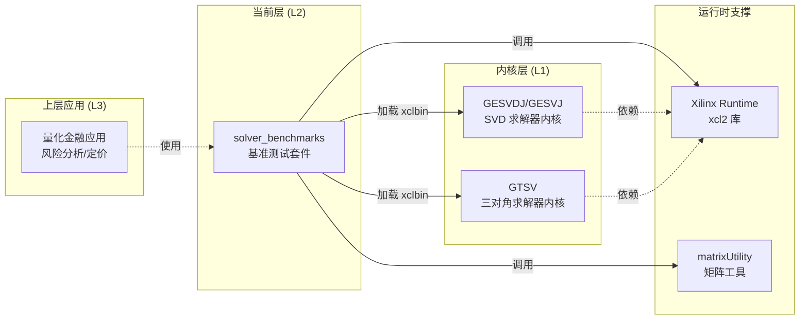

# solver_benchmarks 模块详解

## 一句话概述

`solver_benchmarks` 是用于评测 FPGA 线性代数求解器性能的基准测试套件。它像一个"标准化赛道"——为求解器内核（SVD、三对角求解器等）提供统一的测试场景、数据生成、性能计时和结果验证，确保你测得的是内核的真实性能，而非测试代码的开销。

---

## 为什么要存在这个模块？

### 问题背景：FPGA 加速计算的"测不准"困境

在 CPU/GPU 上跑基准测试相对简单——计时函数前后包一下就行。但 FPGA 异构计算引入了额外的复杂度：

1. **数据传输的开销迷雾**：数据需要从主机内存→FPGA DDR→计算单元。如果不分离"数据传输时间"和"纯计算时间"，你会误以为慢速的数据搬运是内核的问题。

2. **初始化的"冷启动"陷阱**：OpenCL 上下文创建、xclbin 加载、内核对象实例化这些操作开销巨大（毫秒级），但只需执行一次。如果把这些算进每次内核运行，测得的"平均性能"会被严重拉低。

3. **预热与缓存效应**：现代系统有页缓存、TLB、DDR 预取等机制。第一次运行往往比后续慢。如果不进行多次运行取平均，结果不可复现。

4. **正确性验证的负担**：线性代数运算容易累积浮点误差。如何定义"通过"？绝对误差还是相对误差？阈值设多少？每个测试都需要自己实现验证逻辑，导致重复代码。

### 设计动机：提供一个"开箱即用"的评测框架

`solver_benchmarks` 的核心理念是：**让开发者只需关注内核本身的创新，而不必重复编写测试基础设施**。它通过以下方式解决问题：

| 问题 | 解决方案 |
|------|----------|
| 时间测量混淆 | 明确分离 H2D/D2H 传输、内核执行、总时间；使用 `gettimeofday` 而非内核事件（后者只测纯计算） |
| 初始化开销 | 上下文/xclbin 准备放在计时外；支持 `-runs` 参数批量运行取平均 |
| 数据生成 | 使用 `matrixUtility.hpp` 的 `symMatGen`、`matGen` 统一生成测试数据 |
| 正确性验证 | 重构验证：`A_out = U * Σ * V^T`，计算 Frobenius 范数误差 `errA`，阈值 `1e-4` |
| 内存对齐 | 强制 4KB 对齐 (`posix_memalign`)，满足 Xilinx FPGA 的 DMA 要求 |

---

## 心智模型：像一个"黑盒性能实验室"

想象 `solver_benchmarks` 是一个**自动化测试实验室**：

```
┌─────────────────────────────────────────────────────────────────────┐
│                    solver_benchmarks "实验室"                        │
├─────────────────────────────────────────────────────────────────────┤
│  [样本制备区]   生成/加载测试矩阵（对称矩阵、一般矩阵、三对角矩阵）     │
│      ↓                                                            │
│  [装载区]      内存对齐分配 → 拷贝到 FPGA DDR（H2D 传输）            │
│      ↓                                                            │
│  [试验区]      启动内核（多次运行取平均）                             │
│      ↓                                                            │
│  [回收区]      结果传回主机（D2H 传输）                               │
│      ↓                                                            │
│  [质检区]      重构验证：A ≈ U·Σ·Vᵀ，计算误差                        │
└─────────────────────────────────────────────────────────────────────┘
```

**核心抽象**：
1. **Test Harness（测试夹具）**：每个 `test_*.cpp` 是一个独立的夹具，对应一种求解器（GESVDJ、GESVJ、GTSV）。
2. **Standard Workflow（标准流程）**：所有夹具遵循相同的 6 步流程（初始化→数据准备→H2D→执行→D2H→验证）。
3. **Pluggable Verifier（可插拔验证器）**：验证逻辑与计时逻辑解耦，支持自定义误差阈值。

---

## 架构与数据流

### 模块层级结构

`solver_benchmarks` 位于整个系统的 L2（Level 2）层，意味着它构建在 L1 内核实现之上，为上层 L3 应用提供基准测试能力：

```
quantitative_finance_engines (父模块)
    └── solver_benchmarks (当前模块 - L2 基准测试层)
            ├── gesvdj/          (Jacobi SVD 求解器测试)
            │   └── test_gesvdj.cpp
            ├── gesvj/           (对称 Jacobi SVD 求解器测试)
            │   └── test_gesvj.cpp
            └── gtsv/            (三对角求解器测试)
                └── test_gtsv.cpp
```

### 核心数据结构

```cpp
// 时间测量结构 - 标准 Unix 时间戳
struct timeval {
    time_t      tv_sec;   // 秒
    suseconds_t tv_usec;  // 微秒
};

// 使用示例（来自代码中的实际用法）
struct timeval tstart, tend;
gettimeofday(&tstart, 0);
// ... 执行内核 ...
gettimeofday(&tend, 0);
int exec_time = diff(&tend, &tstart);  // 计算微秒级差值
```

**设计选择说明**：
- 使用 `timeval` 而非 `std::chrono`：这是 Xilinx 示例代码的惯例，保持与底层 C 运行时兼容
- 微秒级精度：对于典型的 FPGA 内核（执行时间 10-1000ms），微秒级精度足够且开销更低
- 墙钟时间而非 CPU 时间：测量包含数据传输的真实用户体验，而非纯 CPU 计算时间

---

## 关键设计决策与权衡

### 1. 计时策略：`gettimeofday` vs OpenCL Event Profiling

**选择的方案**：使用 `gettimeofday` 测量**端到端墙钟时间**，而非 OpenCL 事件（`CL_PROFILING_COMMAND_START/END`）。

**权衡分析**：

| 方案 | 优势 | 劣势 | 适用场景 |
|------|------|------|----------|
| `gettimeofday` (选中) | 测量包含调度、数据传输延迟的真实用户体验 | 包含 OS 调度抖动，精度约微秒级 | 系统级性能基准、端到端验证 |
| OpenCL Events | 精确到纳秒级，纯内核执行时间 | 不包含内核启动开销、驱动排队延迟 | 内核微优化、算法效率分析 |

**设计理由**：这个模块的定位是**L2 系统级基准测试**，而非 L1 内核微优化。开发者最关心的是"从主机发出请求到拿到结果"的总延迟。`gettimeofday` 能捕获到 OpenCL 运行时队列调度、驱动开销等真实世界中不可忽视的延迟。

### 2. 内存模型：显式 4KB 对齐 + `CL_MEM_USE_HOST_PTR`

**选择的方案**：使用 `posix_memalign(&ptr, 4096, ...)` 强制页对齐，并通过 `CL_MEM_USE_HOST_PTR` 实现零拷贝（zero-copy）数据传输。

**权衡分析**：

| 特性 | 实现方式 | 优势 | 风险 |
|------|----------|------|------|
| 对齐分配 | `posix_memalign(4096)` | 满足 Xilinx DMA 的页对齐要求，避免运行时复制 | 分配失败时抛出 `bad_alloc`，需捕获处理 |
| 零拷贝映射 | `CL_MEM_USE_HOST_PTR` | 避免额外的设备内存分配，减少一次数据复制 | 主机指针必须在整个内核执行期间保持有效（生命周期约束） |
| 扩展指针 | `cl_mem_ext_ptr_t` | 支持指定 DDR bank 映射，优化多 bank 场景带宽 | 需要 Xilinx 特定的扩展，可移植性降低 |

### 3. 验证策略：重构验证 vs 参考实现对比

**选择的方案**：对 SVD 结果进行重构验证（`A ≈ U·Σ·V^T`），而非与 CPU 参考实现逐元素对比。

**权衡分析**：

| 方案 | 优势 | 劣势 |
|------|------|------|
| 重构验证 (选中) | 无需依赖外部库（如 Intel MKL、OpenBLAS）；验证 SVD 的数学定义本身 | 浮点误差累积，需要设定合理阈值（1e-4） |
| CPU 参考对比 | 直接对比结果，容易发现算法实现错误 | 引入外部依赖；CPU 和 FPGA 可能产生不同的数值结果（非唯一性） |

**关键洞察**：SVD 的分解结果不唯一——`U` 和 `V` 的列向量可以乘以 -1 仍是合法解。重构验证绕过了"哪个解是对的"的哲学问题，只验证数学关系是否成立。

---

## 新贡献者须知：陷阱与最佳实践

### 常见陷阱

#### 1. 指针生命周期陷阱（最常见！）

```cpp
// ❌ 错误：buffer 还在使用，但指针已释放
{
    double* temp = aligned_alloc<double>(100);
    cl::Buffer buf(context, CL_MEM_USE_HOST_PTR, ..., temp);
    // buffer 还在作用域内...
} // temp 被释放！但 buffer 还在映射它 → 未定义行为

// ✅ 正确：确保 buffer 先销毁或解除映射
cl::Buffer buf;  // 声明在外面
double* data = aligned_alloc<double>(100);
{
    buf = cl::Buffer(context, CL_MEM_USE_HOST_PTR, ..., data);
    // 使用 buffer...
}
// 确保 enqueueMigrateMemObjects(D2H) 完成后再释放 data
q.finish();
free(data);  // 现在安全了
```

#### 2. 计时范围陷阱

```cpp
// ❌ 错误：把初始化也算进内核时间
gettimeofday(&tstart, 0);
cl::Kernel kernel(program, "kernel");  // 昂贵的对象创建！
q.enqueueTask(kernel);
q.finish();
gettimeofday(&tend, 0);

// ✅ 正确：只测量数据传输和执行
// ... 初始化上下文、加载 xclbin、创建 kernel ...
gettimeofday(&tstart, 0);  // 从这里开始计时
q.enqueueMigrateMemObjects(ob_in, 0);  // H2D
q.finish();
for (int i = 0; i < num_runs; ++i) {
    q.enqueueTask(kernel);
}
q.finish();
q.enqueueMigrateMemObjects(ob_out, 1);  // D2H
q.finish();
gettimeofday(&tend, 0);  // 到这里结束计时
```

#### 3. 矩阵维度混淆

```cpp
// ⚠️ 注意：不同求解器的维度约定
// GESVDJ (对称矩阵): M x M (方阵)
dataAM = (dataAM > dataAN) ? dataAN : dataAM;
dataAN = dataAM;  // 强制相等

// GESVJ (一般矩阵): M x N (可以不相等)
// 不需要强制相等

// GTSV (三对角): M x 1 (向量)
// 只传一个维度 dataAM
```

### 调试技巧

1. **启用 OpenCL 调试层**：设置环境变量 `XCL_EMULATION_MODE=sw_emu` 先用软件仿真验证正确性，再上板测试。

2. **逐步验证数据流**：
   - 步骤 1：先验证 H2D 传输正确（传一个已知矩阵，读回看是否一致）
   - 步骤 2：验证内核执行（打印 kernel 内部的中间结果）
   - 步骤 3：验证 D2H 传输（检查传回的数据）

3. **使用 logger 输出**：代码中已集成 `xf::common::utils_sw::Logger`，它会自动输出标准化的测试通过/失败信息，与 CI 系统集成。

---

## 子模块详情

`solver_benchmarks` 包含三个独立的基准测试套件，每个对应一种线性代数求解器：

| 子模块 | 求解器类型 | 数学问题 | 典型应用场景 |
|--------|-----------|----------|-------------|
| [gesvdj_benchmark](solver_benchmarks-gesvdj_benchmark.md) | Jacobi SVD | 对称矩阵的 SVD 分解 | PCA、降维、信号处理 |
| [gesvj_benchmark](solver_benchmarks-gesvj_benchmark.md) | 对称 Jacobi SVD | 一般矩阵的 SVD 分解 | 推荐系统、潜语义分析 |
| [gtsv_benchmark](solver_benchmarks-gtsv_benchmark.md) | 三对角求解器 | 三对角线性系统 Ax = b | PDE 离散化、样条插值 |

每个子模块的详细文档包含：
- 求解器的数学原理简介
- 内核参数详解（buffer 绑定、标量参数）
- 内存布局与 DDR bank 分配策略
- 验证算法的误差分析
- 性能调优建议（矩阵尺寸选择、batch 策略）

---

## 与其他模块的关系



**关键依赖说明**：

1. **向上（L3 应用层）**：`solver_benchmarks` 为量化金融引擎提供**可重现的性能基线**。当上层应用比较不同算法（如"应该用 SVD 还是 QR？"）时，依赖本模块的评测数据做决策。

2. **向下（L1 内核层）**：本模块通过加载 xclbin 文件与内核交互。它**不直接依赖**内核源代码，只依赖编译后的二进制。这种解耦允许内核迭代优化，而测试框架保持不变。

3. **横向（运行时支撑）**：
   - `xcl2`：Xilinx 封装的 OpenCL 工具库，简化设备发现、二进制加载等样板代码
   - `matrixUtility`：提供矩阵生成、乘法、转置等通用操作，被多个 benchmark 复用

---

## 总结：给新贡献者的备忘录

### 当你要添加新的求解器 benchmark 时：

1. **复制现有模板**：以 `test_gesvdj.cpp` 或 `test_gtsv.cpp` 为起点，保持相同的结构和命名约定。

2. **修改内核名称和参数**：
   - 替换 `kernel_gesvdj_0` 为你的内核名
   - 根据 L1 内核的接口定义调整 `setArg()` 调用

3. **调整数据生成**：
   - 矩阵生成：调用 `symMatGen()`（对称）、`matGen()`（一般）或自定义
   - 向量生成：直接初始化或使用随机生成

4. **实现验证逻辑**：
   - 选择重构验证（如 SVD 的 `A ≈ U·Σ·V^T`）
   - 或对比预计算的参考结果
   - 设置合理的误差阈值（推荐 1e-4 ~ 1e-6）

5. **测试并调优**：
   - 先软件仿真（`sw_emu`）验证正确性
   - 再上板测试，使用 `-runs 10` 或更高获取稳定的平均值
   - 调整矩阵尺寸测试不同工作负载

### 最关键的 3 条守则：

1. **内存生命周期**：`CL_MEM_USE_HOST_PTR` 的指针必须在 buffer 销毁后才释放
2. **计时范围**：只包含数据传输和执行，不包含初始化
3. **验证合理性**：浮点误差不可避免，重构验证比逐元素对比更鲁棒

---

*"The goal of benchmark is not to prove how fast we are, but to understand where we are slow."*

