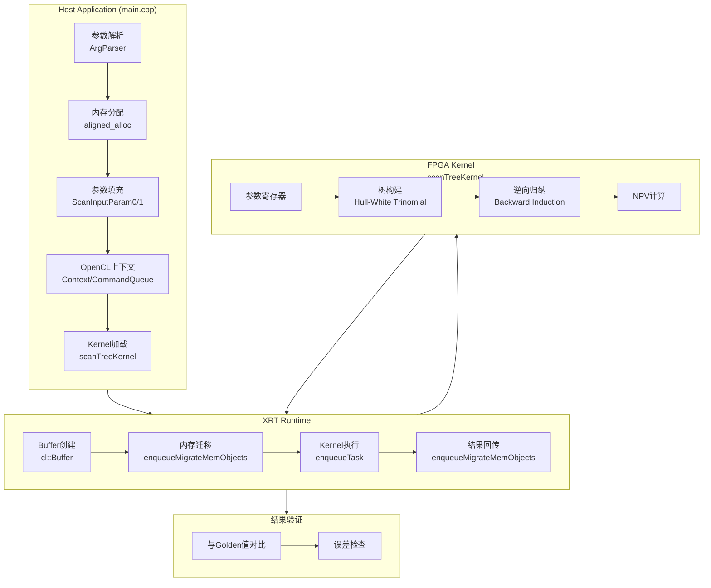

# Tree Cap/Floor Engine HW 模块技术深度解析

## 概述：这颗"计算心脏"在做什么

想象你是一位金融工程师，需要为一份**利率上限/下限期权（Cap/Floor）**定价。这类衍生品的核心是：在未来一系列时间点，如果市场利率高于（Cap）或低于（Floor）约定利率，卖方需要向买方支付差额。定价的关键在于模拟未来利率的随机演化路径，并在每个节点上计算期权的期望收益。

**Tree Cap/Floor Engine** 就是解决这个问题的专用硬件加速模块。它实现了**Hull-White 单因子短期利率模型**的**三叉树（Trinomial Tree）**数值解法，将原本需要在 CPU 上运行数分钟的蒙特卡洛模拟或有限差分计算，压缩到毫秒级完成。

为什么需要专用硬件？金融计算的特点是：
1. **计算密集**：每个时间节点需要求解偏微分方程，涉及大量矩阵运算
2. **内存瓶颈**：树形结构需要频繁访问非连续内存，CPU 缓存命中率低
3. **实时性要求**：交易场景需要在微秒级响应市场变化

FPGA 的解决方案是：将利率树的核心计算逻辑固化在硬件电路中，通过流水线并行处理多个时间步，同时使用片上 BRAM 缓存中间结果，避免外部内存的访问延迟。

---

## 核心概念：理解这颗"计算心脏"的思维方式

### 思维模型一：利率树的空间折叠

Hull-White 模型的三叉树可以想象成一个**三维网格**：
- **X轴（时间）**：从当前时刻到期权到期日，被离散为 `timestep` 个区间
- **Y轴（利率状态）**：每个时间点，短期利率可能处于多个离散状态，形成树的"层"
- **Z轴（概率分支）**：从每个利率状态出发，有三条分支（上升/持平/下降），每条分支对应一个转移概率

树上的每个节点存储的是：**在该利率状态下，从该时刻到期权到期日，期权的期望收益现值**。定价过程从到期日（叶子节点）开始，通过**逆向归纳（Backward Induction）**向根节点回推：每个节点的值 = 下一时刻三个分支节点值的概率加权平均，再按当前利率折现。

### 思维模型二：计算流水线的时间切片

FPGA 的实现将这个三维树结构"拍平"成**一维流水线**：

1. **参数注入阶段**：Host 将模型参数（均值回归速度 `a`、波动率 `sigma`、远期利率曲线等）写入 FPGA 的寄存器
2. **树构建阶段**：硬件根据 Hull-White 公式，实时计算每个时间步的利率节点位置和转移概率，无需存储整棵树，只需维护当前层和下一层
3. **逆向求解阶段**：从到期日开始，硬件流水线并行处理多个节点的折现计算，利用片上缓存存储中间结果
4. **结果回传阶段**：计算完成的 NPV（净现值）通过 DMA 传回 Host 内存

这个模型的关键是**计算与通信的重叠**：当第 N 个时间步在 FPGA 上计算时，第 N-1 个时间步的结果正在传回 Host，而第 N+1 个时间步的参数正在从 Host 下发——形成三条并行的流水线。

---

## 架构全景：数据如何在系统中流动



### 组件角色与职责

**1. Host Application (main.cpp)**
- **角色**：系统 orchestrator，负责整个计算生命周期的管理
- **核心职责**：
  - 解析命令行参数（`-xclbin` 指定 FPGA 二进制文件路径）
  - 分配页对齐的 Host 内存（`aligned_alloc`）用于 DMA 零拷贝传输
  - 填充 Hull-White 模型参数（均值回归速度 `a`、波动率 `sigma`、利率期限结构等）
  - 设置 OpenCL 上下文、命令队列、加载 xclbin 并创建 Kernel 对象

**2. XRT Runtime**
- **角色**：Host 与 FPGA 之间的通信中间件，抽象了底层硬件细节
- **核心职责**：
  - `cl::Buffer` 创建：将 Host 内存映射到 FPGA 的地址空间，支持零拷贝访问
  - `enqueueMigrateMemObjects`：显式控制 Host 与 FPGA 之间的数据迁移（H2D/D2H）
  - `enqueueTask`：提交 Kernel 执行命令到 FPGA，支持事件依赖和异步执行
  - Profiling 支持：通过 `CL_QUEUE_PROFILING_ENABLE` 记录 Kernel 执行时间戳

**3. FPGA Kernel (scanTreeKernel)**
- **角色**：实际执行 Hull-White 树模型计算的硬件加速器
- **核心职责**：
  - 接收 Host 下发的模型参数（存储在片上寄存器）
  - 根据 Hull-White 公式构建三叉利率树，计算每个节点的利率值和转移概率
  - 执行逆向归纳算法，从到期日节点向根节点回推，计算每个节点的 NPV
  - 将最终计算结果（NPV 数组）写回 DDR，等待 Host 读取

**4. Result Validation**
- **角色**：确保硬件计算结果与预期理论值一致
- **核心职责**：
  - 将 FPGA 输出的 NPV 与预计算的 "Golden" 值进行对比
  - 检查误差是否在可接受范围内（`minErr = 10e-10`）
  - 输出详细的误差信息，帮助调试数值精度问题

---

## 核心组件深度解析

### 1. 参数结构体：ScanInputParam0 与 ScanInputParam1

代码中使用了两个输入参数结构体来传递 Hull-White 模型的配置。虽然具体定义未在提供的代码中展示，但从使用方式可以推断其字段：

```cpp
// 产品级参数（每个交易实例不同）
struct ScanInputParam0 {
    DT x0;           // 初始短期利率
    DT nominal;      // 名义本金
    DT spread;       // 利差（用于浮动端计算）
    DT initTime[12]; // 时间网格点（年化）
};

// 模型级参数（同一批交易共享）
struct ScanInputParam1 {
    int index;       // 实例索引
    int type;        // 产品类型（Cap=0, Floor=1）
    DT fixedRate;    // 固定行权利率
    int timestep;    // 时间步数（树的高度）
    int initSize;    // 时间网格点数
    DT a;            // Hull-White 均值回归速度
    DT sigma;        // Hull-White 波动率
    DT flatRate;     // 用于贴现的平坦利率
    int exerciseCnt[5];   // 行权时间点索引
    int fixedCnt[5];      // 固定端现金流时间点
    int floatingCnt[10];  // 浮动端现金流时间点
};
```

**设计意图**：将参数分为两个结构体是出于内存布局和访问模式的优化考虑。
- `ScanInputParam0` 包含每个交易实例特有的产品级参数（名义本金、初始利率等），在 FPGA 上会存储在可重加载的寄存器组中。
- `ScanInputParam1` 包含模型级参数（Hull-White 的 `a`、`sigma` 等），同一批定价任务共享这些参数，可以存储在片上常量缓存中，减少 DDR 访问。

**为什么这样分**：FPGA 的内存层次结构中，片上 BRAM 的访问延迟是 1 个时钟周期，而 DDR 的访问延迟是数百个周期。将高频访问的模型参数放在 BRAM，将低频访问的产品参数放在 DDR，可以最大化计算吞吐量。

### 2. 内存管理：页对齐与零拷贝 DMA

```cpp
// Host 内存分配
ScanInputParam0* inputParam0_alloc = aligned_alloc<ScanInputParam0>(1);
ScanInputParam1* inputParam1_alloc = aligned_alloc<ScanInputParam1>(1);
DT* output[cu_number];
for (int i = 0; i < cu_number; i++) {
    output[i] = aligned_alloc<DT>(N * K);
}
```

```cpp
// FPGA Buffer 创建与内存映射
for (int i = 0; i < cu_number; i++) {
    inputParam0_buf[i] = cl::Buffer(context, 
        CL_MEM_EXT_PTR_XILINX | CL_MEM_USE_HOST_PTR | CL_MEM_READ_WRITE,
        sizeof(ScanInputParam0), &mext_in0[i]);
    // ...
}
```

**内存所有权模型**：

| 资源 | 分配者 | 所有者 | 生命周期 |
|------|--------|--------|----------|
| `inputParam0_alloc` | Host (`aligned_alloc`) | Host | `main()` 开始到结束 |
| `cl::Buffer` | XRT Runtime | XRT (RAII) | `cl::Buffer` 对象作用域 |
| FPGA 片上寄存器 | FPGA Kernel | Kernel 执行期间 | Kernel 启动到完成 |
| DDR 内存 | FPGA 硬件 | XRT (通过 Buffer 抽象) | Buffer 映射期间 |

**零拷贝 DMA（Zero-Copy DMA）原理**：

传统 DMA 需要三步：1) Host 分配内存 → 2) 复制到 DMA 缓冲区 → 3) DMA 传输到设备。零拷贝通过页对齐和虚拟内存映射，让 FPGA 直接访问 Host 物理内存，消除了第二步的拷贝开销。

`CL_MEM_USE_HOST_PTR` 标志告诉 XRT："不要分配新的设备内存，而是直接将 Host 指针映射到 FPGA 的地址空间"。`CL_MEM_EXT_PTR_XILINX` 是 Xilinx 扩展，允许通过 `cl_mem_ext_ptr_t` 结构体指定内存扩展属性（如 HBM 堆栈分配）。

**为什么用 `aligned_alloc`**：PCIe DMA 引擎要求传输的 Host 内存必须位于页边界（通常 4KB 对齐）。`malloc` 不保证对齐，而 `aligned_alloc` 可以指定对齐要求，确保 `CL_MEM_USE_HOST_PTR` 能正常工作。

### 3. 参数初始化：金融模型的具体配置

```cpp
// 时间步数配置（影响树的深度和精度）
int timestep = 10;
if (run_mode == "hw_emu") {
    timestep = 10; // 硬件仿真模式减少步数以加快验证
}

// 参考价格（用于验证 FPGA 计算结果的正确性）
double golden;
if (timestep == 10) golden = 164.38820137859625;
if (timestep == 50) golden = 164.3881769326398;
// ...

// Hull-White 模型参数
double fixedRate = 0.049995924285639641;  // 固定行权利率 (~5%)
DT a = 0.055228873373796609;               // 均值回归速度
DT sigma = 0.0061062754654949824;          // 波动率
DT flatRate = 0.04875825;                  // 用于贴现的平坦利率

// 时间结构（利率期限结构的关键节点）
double initTime[12] = {0, 1, 1.4958904109589042, 2, 2.4986301369863013, ...};

// 现金流时间点索引
int exerciseCnt[5] = {0, 2, 4, 6, 8};    // 行权时间点
int fixedCnt[5] = {0, 2, 4, 6, 8};       // 固定端支付时间点
int floatingCnt[10] = {0, 1, 2, 3, 4, 5, 6, 7, 8, 9}; // 浮动端观察点
```

**这些参数的金融意义**：

**Hull-White 模型** 是描述短期利率随机演化的经典模型，其随机微分方程为：

$$dr(t) = a(\\theta(t) - r(t))dt + \\sigma dW(t)$$

其中：
- $a$（均值回归速度）：利率偏离长期均衡水平后，以多快的速度回归。较大的 $a$ 意味着利率波动更"稳定"
- $\\sigma$（波动率）：利率的瞬时波动幅度，直接决定期权的时间价值
- $\\theta(t)$（时变漂移项）：拟合当前的利率期限结构，确保模型与市场价格一致

**时间结构参数** 定义了产品的现金流特征：
- `initTime`：利率期限结构的关键节点，用于构建贴现曲线
- `exerciseCnt`：Cap/Floor 的每个"caplet/floorlet"行权时间点
- `fixedCnt` 和 `floatingCnt`：分别对应固定端和浮动端的现金流交换时间点

这些参数共同决定了一棵多大规模的树需要构建，以及需要在哪些节点上计算现金流。

---

## 常见陷阱与调试指南

### 1. 内存对齐问题

**症状**：`enqueueMigrateMemObjects` 返回 `CL_MEM_OBJECT_ALLOCATION_FAILURE` 或数据损坏。

**原因**：Host 指针未页对齐，`CL_MEM_USE_HOST_PTR` 要求内存必须位于 4KB 边界。

**解决**：始终使用 `aligned_alloc` 而非 `malloc`/`new`：

```cpp
// 错误
ScanInputParam0* ptr = new ScanInputParam0();  // 不保证对齐

// 正确  
ScanInputParam0* ptr = aligned_alloc<ScanInputParam0>(1);  // 页对齐
```

### 2. xclbin 与平台不匹配

**症状**：`cl::Program` 创建失败，返回 `CL_INVALID_BINARY` 或设备无法找到。

**原因**：
- xclbin 是为不同 FPGA 平台编译的（如 U50 vs U280）
- 使用了硬件仿真 xclbin 在真实硬件上运行
- xclbin 使用的 XRT 版本与 Host 安装的版本不兼容

**解决**：
1. 确认 `xclbin` 的平台与当前 FPGA 卡匹配（`xbutil examine` 查看设备信息）
2. 检查 `XCL_EMULATION_MODE` 环境变量，确保与 xclbin 类型一致
3. 使用与编译 xclbin 相同版本的 XRT 库

### 3. 资源竞争与死锁

**症状**：程序挂起，无输出，必须强制终止。

**原因**：
- 多个线程共享同一个 `cl::CommandQueue` 且未同步
- 使用了 `CL_QUEUE_OUT_OF_ORDER_EXEC_MODE_ENABLE` 但未正确处理事件依赖
- Kernel 内部有死锁（如 AXI Stream 的阻塞读写不匹配）

**解决**：
1. 每个线程使用独立的 `cl::CommandQueue`，或添加互斥锁保护队列访问
2. 乱序队列中使用 `cl::Event` 建立明确的依赖关系
3. 检查 Kernel HLS 代码，确保所有 AXI Stream 的读写配对，无无限阻塞

### 4. 数值精度问题

**症状**：计算结果与 Golden 值偏差超过阈值，但偏差很小（如 1e-9）。

**原因**：
- FPGA 和 CPU 的浮点舍入模式不同（FPGA 可能使用不同的舍入方式或融合乘加）
- 代数变换引入的数值稳定性差异
- 编译器优化改变了运算顺序

**解决**：
1. 分析误差模式：如果是系统性偏差（所有结果都偏大或偏小），可能是代数变换问题；如果是随机偏差，可能是舍入模式问题
2. 在 HLS 中使用 `hls::` 命名空间的数学函数，确保与 C++ 标准库一致的行为
3. 放宽误差阈值：如果 1e-9 的偏差在金融上无意义（< 0.01% 的定价误差），可以调整 `minErr`
4. 使用 Kahan 求和等数值稳定算法在 FPGA 中实现累加操作

---

## 扩展与定制

### 添加新的定价模型

当前实现基于 Hull-White 模型。如果需要支持其他短期利率模型（如 Cox-Ingersoll-Ross 或 Black-Karasinski），需要：

1. **修改 Kernel HLS 代码**：
   - 调整树构建逻辑（CIR 需要确保利率非负，树的节点位置和概率计算不同）
   - 修改逆向归纳的折现公式

2. **更新 Host 参数结构**：
   ```cpp
   struct ScanInputParam1 {
       // ... 现有字段 ...
       int modelType;  // 新增：0=HullWhite, 1=CIR, 2=BlackKarasinski
       DT modelParams[4];  // 模型特定参数（如 CIR 的均值水平、回归速度等）
   };
   ```

3. **重新编译 xclbin**：
   ```bash
   v++ -k scanTreeKernel -t hw --platform xilinx_u50_gen3x16_xdma_201920_3 ...
   ```

### 支持多批次流式处理

对于需要连续定价大量交易的场景（如实时风险报告），可以实现流式处理框架，使用双缓冲池和异步提交机制，实现 Host 参数准备、PCIe 传输、FPGA 计算和结果处理的流水线并行。

---

## 总结：为何这样设计

Tree Cap/Floor Engine 的架构是**领域专用计算**的典型案例——为了金融衍生品定价这一特定问题，在灵活性、性能和开发效率之间做出了精准的权衡：

**1. 领域抽象层次**
- **高层**：Host 代码使用金融术语（Cap/Floor、Hull-White、NPV），量化工程师可以直接理解和修改参数
- **中层**：OpenCL/XRT 提供标准的异构计算抽象，屏蔽了底层 PCIe 协议细节
- **底层**：FPGA Kernel 使用 HLS 从 C++ 综合，算法工程师可以用熟悉的语言描述并行硬件逻辑

**2. 性能优化策略**
- **计算并行**：多 CU 同时处理独立定价任务，实现数据级并行
- **流水线并行**：Host 参数准备、PCIe 传输、FPGA 计算、结果回传通过双缓冲重叠执行
- **内存优化**：页对齐零拷贝消除 DMA 拷贝开销，HBM/DDR Bank 分区并行访问最大化带宽
- **数值精度**：双精度浮点确保与 CPU 参考实现的一致性，严格的 Golden 值验证确保生产可靠性

**3. 工程实践智慧**
- **渐进式验证**：支持 SW Emulation（纯软件）、HW Emulation（RTL 仿真）、HW（真实硬件）三种模式，允许从算法正确性验证逐步过渡到性能优化
- **防御式编程**：命令行参数检查、内存对齐验证、数值结果 Golden 值对比，层层防护确保生产环境稳定
- **可观测性**：详细的 Profiling 数据（Kernel 执行时间、PCIe 传输时间、队列等待时间）为性能调优提供数据支撑

**新成员上手指南**：

1. **先跑通流程**：从 SW Emulation 模式开始，不依赖 FPGA 硬件，验证代码理解和环境配置
2. **理解数据流**：修改参数（如 `timestep`、`a`、`sigma`），观察执行时间和结果变化，建立直观感受
3. **阅读 HLS 代码**：在理解 Host 代码后，查看 `tree_engine_kernel.hpp` 理解硬件实现细节
4. **性能调优**：使用 XRT Profiling 工具分析瓶颈，尝试调整 CU 数量、内存 Bank 分配等
5. **生产部署**：理解 Golden 值验证机制，确保数值精度满足业务要求

---

## 参考文档与链接

- [Xilinx Vitis 开发文档](https://docs.xilinx.com/v/u/en-US/ug1393-vitis-application-acceleration)
- [XRT API 参考](https://xilinx.github.io/XRT/master/html/xrt_native_apis.html)
- [Hull-White 模型数学原理](https://en.wikipedia.org/wiki/Hull%E2%80%93White_model)
- [QuantLib 金融计算库](https://www.quantlib.org/)
- 相关模块：
  - [tree_swap_engine](tree_swap_engine.md) - 利率互换定价引擎
  - [swaption_tree_engines](swaption_tree_engines_single_factor_short_rate_models.md) - 利率互换期权定价引擎
