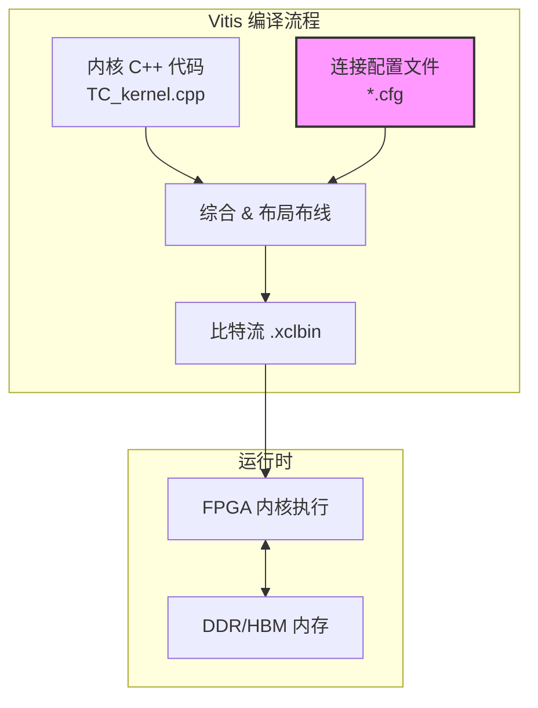
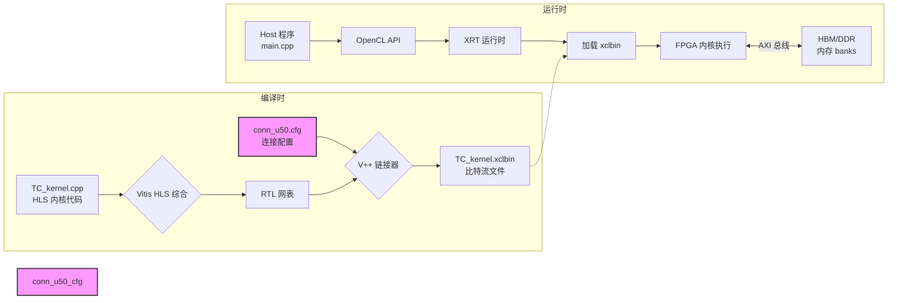
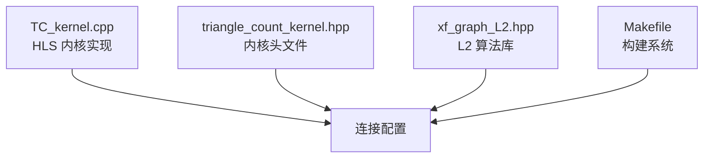
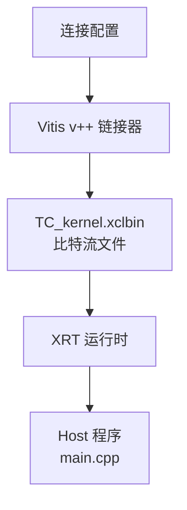

# Triangle Count Alveo Kernel Connectivity Profiles

## 一句话概述

本模块为 Xilinx Alveo 加速卡上的三角形计数（Triangle Counting）图算法内核提供 **物理内存接口到内核端口的映射配置**——简单来说，它告诉 Vitis 编译器："内核的每个数据端口应该连接到板卡上的哪一块内存"。

---

## 问题空间：为什么需要这个模块？

### 图算法的内存访问挑战

三角形计数是典型的 **内存密集型图算法**。想象一个社交网络图：每个节点代表一个人，边代表好友关系。三角形计数回答的问题是："这个网络中有多少个'三角形'（即三个人互为好友的小圈子）？"

算法需要反复遍历图的邻接表（CSR/CSC 格式），涉及大量随机内存访问：
- 对每条边 $(u, v)$，需要获取 $u$ 和 $v$ 的邻居列表
- 对两个邻居列表求交集，判断是否存在共同邻居 $w$ 形成三角形 $(u, v, w)$

**性能瓶颈不在于计算，而在于内存带宽和延迟。**

### Alveo 卡的内存层次

Xilinx Alveo 加速卡提供多种内存资源，不同型号差异很大：

| 卡型号 | 内存类型 | 容量 | 带宽特性 | 适用场景 |
|--------|----------|------|----------|----------|
| U200/U250 | DDR4 (4 组) | 64 GB | 高容量、中等带宽 | 大图、数据量超过 HBM 容量 |
| U50 | HBM2 (32 伪通道) | 8 GB | 高带宽、低延迟 | 中等规模图、高带宽需求 |

**关键洞察**：三角形计数算法需要同时访问多个数据缓冲区（CSR 偏移数组、列索引数组、中间结果等）。为了最大化内存带宽，应该将这些缓冲区分散到不同的内存 bank 上，实现并行访问。

### Vitis 编译器的连接阶段

在 Vitis 流程中，编译器需要明确的指令来连接内核端口到物理内存。这就是 `*.cfg` 连接配置文件的作用：

```
[connectivity]
sp=TC_kernel.m_axi_gmem0_0:DDR[0]  # 将内核的 m_axi_gmem0_0 端口映射到 DDR bank 0
```

没有这些配置，编译器无法知道如何布线，会导致编译失败或次优的连接方案（比如所有端口争抢同一个内存 bank）。

---

## 心智模型：连接配置即"内存布线蓝图"

想象你正在设计一个数据中心的数据管道：

- **内核（TC_kernel）** 是一个处理车间，有多个装卸码头（AXI 端口）
- **DDR/HBM bank** 是分布在厂区周围的仓库
- **连接配置文件** 就是物流部门的布线规划图，规定每个装卸码头应该连接到哪个仓库

```
        ┌─────────────────────────────────────────────────────────┐
        │                    TC_kernel (FPGA)                      │
        │  ┌─────────┐  ┌─────────┐  ┌─────────┐  ┌─────────┐       │
        │  │m_axi_0  │  │m_axi_1  │  │m_axi_2  │  │m_axi_3  │       │
        │  │offsetsG1│  │rowsG1   │  │offsetsG2│  │rowsG2   │       │
        │  └────┬────┘  └────┬────┘  └────┬────┘  └────┬────┘       │
        │       │            │            │            │            │
        │  ┌────┴────┐  ┌────┴────┐  ┌────┴────┐  ┌────┴────┐       │
        │  │m_axi_4  │  │m_axi_5  │  │m_axi_6  │  │         │       │
        │  │offsetsG3│  │rowsG3   │  │TC       │  │         │       │
        │  └────┬────┘  └────┬────┘  └────┬────┘  └─────────┘       │
        └───────┼────────────┼────────────┼─────────────────────────┘
                │            │            │
                ▼            ▼            ▼
        ┌─────────────────────────────────────────────────────────┐
        │              DDR[0] / HBM[0:1, 2:3, ...]                   │
        │         (64-bit AXI 总线连接)                              │
        └─────────────────────────────────────────────────────────┘
```

**配置文件的精髓**：通过将不同的数据端口分散到不同的内存 bank，我们实现了**内存访问的并行化**——就像给每个仓库分配专属的装卸码头，避免所有卡车挤在同一个门口排队。

---

## 架构详解

### 模块职责边界



**本模块的定位**：位于编译时配置的"胶水层"——它不实现算法逻辑，也不参与运行时执行，而是**在编译阶段指导硬件布线工具如何将内核连接到物理内存资源**。

### 核心组件

| 配置文件 | 目标平台 | 内存架构 | 核心设计决策 |
|----------|----------|----------|--------------|
| `conn_u200_u250.cfg` | Alveo U200/U250 | 4x DDR4 | 所有端口集中到 DDR[0]，依赖 DDR 控制器内部的 bank 并行性 |
| `conn_u50.cfg` | Alveo U50 | HBM2 (32 伪通道) | 端口分散到多个 HBM 伪通道对 (0:1, 2:3, ...)，最大化 HBM 并行带宽 |

### 配置语法解析

以 `conn_u50.cfg` 为例，逐行解读：

```cfg
[connectivity]                                    # 连接配置段开始
sp=TC_kernel.m_axi_gmem0_0:HBM[0:1]              # 端口 m_axi_gmem0_0 → HBM 伪通道 0-1
sp=TC_kernel.m_axi_gmem0_1:HBM[2:3]              # 端口 m_axi_gmem0_1 → HBM 伪通道 2-3
sp=TC_kernel.m_axi_gmem0_2:HBM[4:5]              # 端口 m_axi_gmem0_2 → HBM 伪通道 4-5
sp=TC_kernel.m_axi_gmem0_3:HBM[6:7]              # 端口 m_axi_gmem0_3 → HBM 伪通道 6-7
sp=TC_kernel.m_axi_gmem0_4:HBM[8:9]              # 端口 m_axi_gmem0_4 → HBM 伪通道 8-9
sp=TC_kernel.m_axi_gmem0_5:HBM[10:11]            # 端口 m_axi_gmem0_5 → HBM 伪通道 10-11
sp=TC_kernel.m_axi_gmem0_6:HBM[12:13]            # 端口 m_axi_gmem0_6 → HBM 伪通道 12-13
slr=TC_kernel:SLR0                               # 内核放置在 SLR0 (Super Logic Region)
nk=TC_kernel:1:TC_kernel                         # 实例化 1 个 TC_kernel，命名为 TC_kernel
```

**关键配置项说明**：

| 配置项 | 语法 | 含义 |
|--------|------|------|
| `sp` (Scalar Processor) | `sp=kernel.port:memory` | 将内核的 AXI 端口映射到指定的物理内存 |
| `slr` | `slr=kernel:SLR` | 指定内核放置的 Super Logic Region（影响时序和资源分配）|
| `nk` | `nk=kernel:num:instance_name` | 实例化指定数量的内核副本 |

---

## 数据流分析：从配置到硬件执行

### 端到端数据流



### 配置如何影响硬件布线

Vitis 编译流程中的链接阶段（`v++ -l`）会将 HLS 生成的 RTL 网表与平台 shell 集成，生成最终的比特流。连接配置文件在这个阶段发挥关键作用：

1. **端口映射**：`sp=kernel.port:memory` 指令告诉链接器将内核的 AXI master 端口连接到指定的物理内存接口。

2. **NoC/DDR 控制器配置**：对于 HBM 平台，配置还涉及 Network-on-Chip 的路由设置，确保数据能从内核端口高效到达目标 HBM 伪通道。

3. **时序约束**：`slr` 指令影响布局和时序收敛，将内核放置在特定的 SLR 可以减少跨 SLR 布线带来的延迟。

### 运行时内存访问模式

连接配置直接影响运行时的内存访问效率：

```
场景：三角形计数算法访问 CSR 格式的图数据

CSR 格式数据结构：
- offsets[]: 每个顶点的邻居列表在 rows[] 中的起始/结束位置
- rows[]: 实际的邻居顶点 ID 列表

算法访问模式（以顶点 u 的邻居列表遍历为例）：
1. 读取 offsets[u] 和 offsets[u+1] → 得到邻居列表范围 [begin, end)
2. 顺序读取 rows[begin...end-1] → 得到所有邻居顶点

内存访问特征：
- offsets[]: 顺序扫描（访问模式可预测，适合预取）
- rows[]: 随机访问（不同顶点的邻居列表分散存储）

并行化策略：
- 多个 AXI 端口分别绑定到不同的 HBM 伪通道
- 不同端口可以同时访问不同的内存 bank，避免争用
- 例如：offsetsG1 和 rowsG1 绑定到 HBM[0:1]，offsetsG2 和 rowsG2 绑定到 HBM[2:3]...
```

---

## 设计权衡与决策

### 1. DDR vs HBM：为什么需要两套配置？

| 维度 | DDR (U200/U250) | HBM (U50) |
|------|-----------------|-----------|
| **容量** | 64 GB | 8 GB |
| **带宽** | ~77 GB/s (单 bank) | ~460 GB/s (总计) |
| **延迟** | 较高 (~100ns) | 较低 (~50ns) |
| **配置策略** | 集中式 (所有端口 → DDR[0]) | 分散式 (端口分散到多个 HBM 伪通道) |

**决策逻辑**：
- **U200/U250**：DDR 容量大但单 bank 带宽有限。配置选择集中式映射，因为：
  1. DDR 控制器内部有 bank-level parallelism，分散到多个物理 bank 即可
  2. 简化配置，减少连接复杂度
  3. 大图场景优先保证容量可用性

- **U50**：HBM 容量小但带宽极高。配置选择分散式映射，因为：
  1. HBM 有 32 个伪通道，需要显式绑定才能利用并行性
  2. 三角形计数是带宽密集型，必须最大化利用 HBM 带宽
  3. U50 的 8GB 容量限制了能处理的图规模，需要通过高带宽弥补

### 2. 端口数量与内存资源的权衡

观察 `TC_kernel` 的端口配置：
- 7 个 `m_axi` 端口：offsetsG1, rowsG1, offsetsG2, rowsG2, offsetsG3, rowsG3, TC
- 1 个 `s_axilite` 控制端口（用于传递 vertexNum, edgeNum 等标量参数）

**为什么是 7 个数据端口？** 这与三角形计数算法的内存访问模式相关：

```
算法需要同时访问的图数据结构：
1. Graph G1 的 CSR 表示 (offsetsG1, rowsG1)
2. Graph G2 的 CSR 表示 (offsetsG2, rowsG2) - 可能是 G1 的转置或其他变体
3. Graph G3 的中间数据结构 (offsetsG3, rowsG3) - 预处理后的数据
4. TC 结果缓冲区

使用独立端口的理由：
- 每个端口绑定到独立的内存资源，避免 AXI 总线争用
- 允许内核同时发起多个内存事务，提高并行性
- 对 HBM 平台尤为重要：每个伪通道有独立的控制器，分散端口 = 分散带宽压力
```

### 3. 为什么不使用统一的配置？

你可能会问："为什么不能写一套通用配置，让 Vitis 自动适配不同平台？"

**技术限制**：
1. **内存资源命名差异**：DDR 使用 `DDR[0]`, `DDR[1]`... 命名，HBM 使用 `HBM[0:1]`, `HBM[2:3]`...（伪通道对）
2. **连接粒度不同**：DDR 通常以整个控制器为单位，HBM 以伪通道对为单位
3. **时序约束差异**：不同板卡的 SLR 布局、时钟域划分不同

**工程权衡**：
- 维护多套配置看似冗余，但提供了对每类平台的精细控制
- 允许针对特定平台的特性做优化（如 U50 的 HBM 分散策略）
- 避免"通用配置"带来的隐藏假设和意外行为

---

## 使用指南：如何与这个模块交互

### 作为使用者：在 Vitis 项目中使用这些配置

#### 场景 1：使用默认配置编译

```bash
# 针对 U250 平台编译（使用 conn_u200_u250.cfg）
cd L2/benchmarks/triangle_count
make run TARGET=hw PLATFORM=xilinx_u250_xdma_201830_2
```

Makefile 会自动根据 `PLATFORM` 变量选择对应的连接配置文件。

#### 场景 2：在自定义项目中使用这些配置

如果你在自己的 Vitis 项目中使用 `TC_kernel`，需要在链接阶段指定连接配置：

```bash
# 编译内核（综合）
v++ -c -t hw -k TC_kernel \
    --platform xilinx_u50_gen3x16_xdma_201920_3 \
    -o TC_kernel.xo \
    TC_kernel.cpp

# 链接生成比特流（关键：使用连接配置）
v++ -l -t hw \
    --platform xilinx_u50_gen3x16_xdma_201920_3 \
    --config conn_u50.cfg \    # <-- 连接配置文件
    -o TC_kernel.xclbin \
    TC_kernel.xo
```

#### 场景 3：修改配置以适配自定义内存布局

假设你需要调整 U50 配置，将 `offsetsG1` 和 `rowsG1` 绑定到不同的 HBM 伪通道：

```cfg
# 原始配置
sp=TC_kernel.m_axi_gmem0_0:HBM[0:1]
sp=TC_kernel.m_axi_gmem0_1:HBM[2:3]

# 修改后：将 ports 分散到更多伪通道
sp=TC_kernel.m_axi_gmem0_0:HBM[0:1]
sp=TC_kernel.m_axi_gmem0_1:HBM[4:5]   # 改为 HBM[4:5]，避免与 offsetsG1 争用
```

**注意事项**：
- 修改配置后必须重新运行 `v++ -l` 链接阶段
- 确保分配的 HBM 伪通道存在于目标平台（U50 有 0-31 共 32 个伪通道）
- 不合理的绑定可能导致编译错误或次优性能

### 作为开发者：理解配置与代码的对应关系

#### 内核代码中的端口声明

```cpp
// TC_kernel.cpp
extern "C" void TC_kernel(
    int vertexNum,
    int edgeNum,
    uint512 offsetsG1[V],    // --> 对应 m_axi_gmem0_0
    uint512 rowsG1[E],       // --> 对应 m_axi_gmem0_1
    uint512 offsetsG2[V],    // --> 对应 m_axi_gmem0_2
    uint512 rowsG2[E],       // --> 对应 m_axi_gmem0_3
    uint512 offsetsG3[V*2],  // --> 对应 m_axi_gmem0_4
    uint512 rowsG3[E],       // --> 对应 m_axi_gmem0_5
    uint64_t TC[N]           // --> 对应 m_axi_gmem0_6
) {
    // ...
}
```

Vitis HLS 会自动为每个指针参数生成一个 `m_axi` 端口，命名为 `m_axi_gmem0_N`。

#### 配置到端口的映射

```
内核参数        AXI 端口              配置绑定                    物理内存
─────────────────────────────────────────────────────────────────────────────────
offsetsG1  →  m_axi_gmem0_0  →  HBM[0:1] (U50) / DDR[0] (U250)  →  Bank 0/1
rowsG1     →  m_axi_gmem0_1  →  HBM[2:3] (U50) / DDR[0] (U250)  →  Bank 2/3
offsetsG2  →  m_axi_gmem0_2  →  HBM[4:5] (U50) / DDR[0] (U250)  →  Bank 4/5
rowsG2     →  m_axi_gmem0_3  →  HBM[6:7] (U50) / DDR[0] (U250)  →  Bank 6/7
offsetsG3  →  m_axi_gmem0_4  →  HBM[8:9] (U50) / DDR[0] (U250)  →  Bank 8/9
rowsG3     →  m_axi_gmem0_5  →  HBM[10:11] (U50) / DDR[0] (U250) →  Bank 10/11
TC         →  m_axi_gmem0_6  →  HBM[12:13] (U50) / DDR[0] (U250) →  Bank 12/13
```

**为什么 U50 要分散到这么多 HBM 伪通道？**

HBM 的优势在于高并行度——32 个伪通道可以独立工作。将不同端口分散到不同伪通道，可以实现真正的并行内存访问。如果所有端口都绑定到同一个伪通道对，就会因争用而损失带宽。

**为什么 U250 可以集中到 DDR[0]？**

DDR4 的并行粒度更大——一个 DDR 控制器内部有多个 bank，可以一定程度并行。U250 的设计目标是支持大图（需要大容量），牺牲一部分并行度换取容量可用性是可以接受的权衡。此外，DDR 控制器内部的 bank 调度器可以部分缓解争用问题。

---

## 设计权衡深度分析

### 权衡 1：端口分散度 vs 配置复杂度

| 策略 | U50 (分散) | U250 (集中) |
|------|-----------|-------------|
| **优点** | 最大化内存并行带宽 | 配置简单，易于维护 |
| **缺点** | 配置复杂，容易出错 | 内存争用风险 |
| **适用** | 带宽敏感型应用 | 容量优先型应用 |

**为什么 U50 选择了分散策略？**
- HBM 的高带宽只有在充分利用所有伪通道时才能实现
- 三角形计数是典型的带宽瓶颈应用
- 8GB HBM 容量限制了图规模，必须在带宽上做足优化

**为什么 U250 选择了集中策略？**
- DDR 容量大（64GB），目标是支持大图
- DDR 的 bank-level parallelism 可以在一定程度上缓解争用
- 简化配置，降低维护成本

### 权衡 2：伪通道配对策略

观察 U50 配置：`HBM[0:1]`, `HBM[2:3]`, `HBM[4:5]`... 为什么是成对绑定？

```
HBM2 架构（以 U50 为例）：
- 4 个 HBM 堆叠 (Stack 0-3)
- 每个 Stack 有 8 个伪通道 (Pseudo Channel, PC)
- 总计 32 个伪通道，编号 0-31

物理布局：
Stack 0: PC 0-7
Stack 1: PC 8-15
Stack 2: PC 16-23
Stack 3: PC 24-31

为什么配置使用 [0:1], [2:3] 而不是 [0], [1]？
- HBM 伪通道是 64-bit 接口
- 配对使用 [N:N+1] 可以组成 128-bit 接口，提高带宽利用率
- 配对在同一个 Stack 内，降低跨 Stack 访问延迟
```

**设计洞察**：伪通道配对是 HBM 优化的常见技巧，但这也带来了限制——端口数量必须是偶数，且总带宽受限于 Stack 数量。

### 权衡 3：SLR 放置策略

`slr=TC_kernel:SLR0` 指定内核放置在 Super Logic Region 0。

```
Alveo 卡架构（以 U250 为例）：
- 3 个 SLR (Super Logic Region)
- SLR0: 靠近 PCIe 接口，通常是 shell 所在位置
- SLR1: 中间区域
- SLR2: 远端区域
- DDR 控制器分布在各 SLR 附近

为什么选择 SLR0？
- 靠近 PCIe 接口，减少 host-kernel 控制路径延迟
- 靠近部分 DDR 控制器（如 DDR[0]）
- shell 资源在 SLR0，减少跨 SLR 布线

潜在限制：
- 资源密度限制：如果 SLR0 资源紧张，可能需要放到 SLR1
- 时序收敛：跨 SLR 的长路径可能导致时序问题
```

**设计决策**：将内核放在 SLR0 是保守且合理的默认选择，但在资源受限或时序紧张时，可能需要调整为 SLR1。

---

## 依赖关系与模块交互

### 上游依赖



- **TC_kernel.cpp**：定义内核的 AXI 端口，配置中的端口名必须与这里的指针参数一一对应
- **triangle_count_kernel.hpp**：定义内核接口（函数签名、参数类型、宏定义如 `V`, `E`）
- **xf_graph_L2.hpp**：L2 级算法库，提供 `triangleCount<>()` 函数的实现
- **Makefile**：控制 Vitis 编译流程，根据 `PLATFORM` 变量选择对应的 `.cfg` 文件

### 下游使用者



配置文件的直接使用者是 Vitis 的 `v++` 链接器，在链接阶段（`v++ -l`）解析配置，生成最终的 FPGA 比特流。运行时，这些连接关系已经固化在硬件中，Host 程序通过 XRT 运行时加载比特流即可。

### 与 triangle_count 其他模块的协作

```
triangle_count_benchmarks_and_platform_kernels/
├── triangle_count_host_timing_support/        # Host 端计时和性能分析
├── triangle_count_alveo_kernel_connectivity_profiles/  # <-- 本模块
└── triangle_count_versal_kernel_connectivity_profile/  # Versal 平台配置

triangle_count_algorithm_implementation/
├── TC_kernel.cpp                              # 内核实现（需要本配置）
├── triangle_count_kernel.hpp                # 内核接口定义
└── triangle_count.hpp (L2 library)           # L2 算法库实现
```

**协作关系**：
- `triangle_count_host_timing_support` 提供 Host 端的性能分析功能，但它假设内核已经通过本模块的配置正确连接到内存
- `TC_kernel.cpp` 中的 HLS 代码定义了 AXI 端口，本模块的配置必须精确匹配这些端口名
- `triangle_count.hpp`（L2 库）实现了具体的三角形计数算法，但算法的高效执行依赖于本模块提供的内存带宽

---

## 新贡献者注意事项

### 常见陷阱与调试技巧

#### 陷阱 1：端口名不匹配

**问题**：修改了 `TC_kernel.cpp` 中的指针参数名，但没有同步更新 `.cfg` 文件。

```cpp
// 修改后的 TC_kernel.cpp
void TC_kernel(..., uint512 new_offsets[V], ...)  // 改名为 new_offsets
```

```cfg
# 未更新的 conn_u50.cfg
sp=TC_kernel.m_axi_gmem0_0:HBM[0:1]  # 端口名仍是 m_axi_gmem0_0，但内核中的参数名变了
```

**症状**：Vitis 编译失败，报错类似 `ERROR: [VPL 60-806] Failed to finish platform linker` 或找不到端口。

**调试**：
1. 检查 `TC_kernel.cpp` 中的指针参数顺序和名称
2. 确认 `.cfg` 中的端口名与 HLS 生成的 RTL 端口名匹配（通常是 `m_axi_gmem0_N` 格式，N 是参数顺序）
3. 查看 HLS 综合报告，确认端口名和位宽

#### 陷阱 2：内存资源越界

**问题**：配置了不存在的 HBM 伪通道。

```cfg
# 错误配置：U50 只有伪通道 0-31
sp=TC_kernel.m_axi_gmem0_0:HBM[32:33]  # HBM 32 不存在！
```

**症状**：Vitis 编译失败，报错 `ERROR: [VPL 60-1426] Failed to validate the platform configuration` 或类似 HBM 资源不存在的错误。

**调试**：
1. 查阅目标平台的文档，确认 HBM 伪通道数量
2. 使用 `platforminfo` 工具查询平台信息：`platforminfo <platform.xpfm> -f -j | grep hbm`
3. 确认配置中的伪通道编号在有效范围内（通常是 0-31）

#### 陷阱 3：端口数量与内核不匹配

**问题**：`.cfg` 中配置的端口数量与 `TC_kernel` 实际的 AXI 端口数量不一致。

```cfg
# 配置中只定义了 6 个端口
sp=TC_kernel.m_axi_gmem0_0:HBM[0:1]
sp=TC_kernel.m_axi_gmem0_1:HBM[2:3]
...
sp=TC_kernel.m_axi_gmem0_5:HBM[10:11]
# 缺少 m_axi_gmem0_6！
```

**症状**：Vitis 编译失败，提示某些 AXI 端口未绑定到内存资源，或生成的比特流运行时访问错误地址。

**调试**：
1. 检查 `TC_kernel.cpp` 中有多少个指针参数（排除标量参数）
2. 确认 `.cfg` 中有对应的 `sp=` 行，端口名从 `m_axi_gmem0_0` 到 `m_axi_gmem0_N`
3. 注意：Vitis HLS 可能自动合并某些端口（宽位总线拆分），需要查看综合报告确认实际端口数

### 扩展指南：添加新平台的支持

如果你需要为新的 Alveo 卡（如 U55C、U200 的变体）添加连接配置，步骤如下：

1. **研究目标平台的内存架构**：
   ```bash
   # 查询平台信息
   platforminfo /path/to/platform.xpfm -f -j | jq '.memories'
   ```

2. **确定内存资源命名**：
   - DDR 平台通常使用 `DDR[0]`, `DDR[1]`...
   - HBM 平台通常使用 `HBM[0:1]`, `HBM[2:3]`...（伪通道对）

3. **创建新的 .cfg 文件**：
   ```cfg
   # conn_u55c.cfg (示例)
   [connectivity]
   sp=TC_kernel.m_axi_gmem0_0:HBM[0:1]
   sp=TC_kernel.m_axi_gmem0_1:HBM[2:3]
   ...
   slr=TC_kernel:SLR0
   nk=TC_kernel:1:TC_kernel
   ```

4. **更新 Makefile 或构建系统**：
   确保根据 `PLATFORM` 变量正确选择新的配置文件。

5. **验证**：
   ```bash
   # 编译测试
   make run TARGET=hw PLATFORM=xilinx_u55c_gen3x16_xdma_base_1
   ```

---

## 总结：本模块的核心价值

对于刚加入团队的新成员，理解本模块的关键在于把握 **"配置即布线"** 的核心思想：

1. **这不是算法代码，是硬件布线规划**：这些 `.cfg` 文件不实现任何算法逻辑，它们指导 Vitis 编译器如何将 HLS 内核的 AXI 端口物理连接到 Alveo 卡的内存资源。

2. **性能优化的关键环节**：内存带宽是三角形计数等图算法的瓶颈。正确的连接配置能最大化利用 HBM/DDR 的并行带宽，错误的配置会导致端口争用、带宽浪费。

3. **平台特定的定制化**：没有"通用配置"，U50 的 HBM 分散策略和 U250 的 DDR 集中策略反映了不同硬件架构的优化思路。

4. **编译时决定，运行时固化**：这些配置只在 `v++ -l` 链接阶段使用，一旦比特流生成，连接关系就固化在硬件中，运行时无法更改。

**上手建议**：
- 修改配置前先理解目标平台的内存架构（HBM 伪通道 vs DDR bank）
- 确保 `.cfg` 中的端口名与 `TC_kernel.cpp` 中的指针参数一一对应
- 编译错误时，优先检查端口名拼写、内存资源是否存在、端口数量是否匹配
- 性能调优时，考虑调整端口到内存的绑定方式，观察带宽利用率变化

---

## 参考链接

- [Vitis 连接配置文档](https://docs.xilinx.com/r/en-US/ug1393-vitis-application-acceleration/Connectivity-Configuration-File)
- [Alveo U50 产品手册](https://www.xilinx.com/products/boards-and-kits/alveo/u50.html)
- [Alveo U250 产品手册](https://www.xilinx.com/products/boards-and-kits/alveo/u250.html)
- [三角形计数算法 L2 库文档](triangle_count_benchmarks_and_platform_kernels.md)
- [TC_kernel 实现详解](TC_kernel.md)（内核实现模块）
- [三角形计数 Host 端支持](triangle_count_host_timing_support.md)
