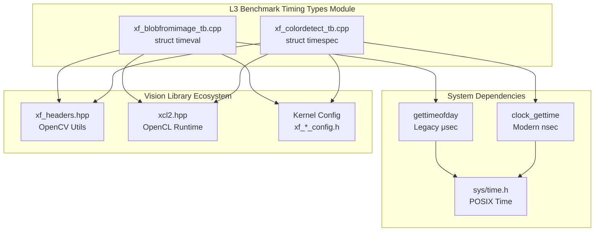

# l3_benchmark_timing_types 模块技术深度解析

## 概述：这到底是什么？

`l3_benchmark_timing_types` 是 AMD/Xilinx 视觉库 L3（应用层）基准测试框架的**时间测量基础设施**。简单来说，这就是给 FPGA 加速内核性能测试用的"秒表"——它提供了精确测量软件参考实现和硬件加速实现执行延迟的能力。

这个模块不像传统的库那样提供封装好的 C++ 类，而是直接在测试平台（testbench）代码中使用 POSIX 标准的时间结构——`struct timeval` 和 `struct timespec`。这种设计选择体现了一个关键洞察：**在性能测试场景中，直接使用底层时间原语比封装层更具透明性和可移植性**。

## 核心抽象：心理模型

### 计时器的两个"档位"

想象你手上有两块精度不同的秒表：

1. **微秒级秒表** (`struct timeval` + `gettimeofday`)
   - 精度：微秒 (μs)
   - 适用场景：粗略的性能估算、兼容性要求高的旧代码
   - 特点：简单、历史悠久，但**受系统时钟调整影响**（NTP 同步会改变时间值）

2. **纳秒级秒表** (`struct timespec` + `clock_gettime`)
   - 精度：纳秒 (ns) 
   - 适用场景：精确的 FPGA 内核延迟测量
   - 特点：使用 `CLOCK_MONOTONIC`，**保证单调递增**，不受 NTP 回拨影响

### 架构角色：测量基础设施

```
┌─────────────────────────────────────────────────────────────┐
│                    L3 Benchmark Testbench                    │
│  ┌──────────────┐     ┌──────────────┐     ┌─────────────┐  │
│  │  OpenCV Ref  │     │  FPGA Kernel │     │   Timing    │  │
│  │  (Software)  │     │  (Hardware)  │     │   Types     │  │
│  └──────┬───────┘     └──────┬───────┘     └──────┬──────┘  │
│         │                    │                     │          │
│         └────────┬───────────┴─────────┬──────────┘          │
│                  │                     │                      │
│           gettimeofday()       clock_gettime()              │
│         (xf_blobfromimage)   (xf_colordetect)              │
│                                                              │
│  Result: Latency measurements in ms/us/ns                   │
└─────────────────────────────────────────────────────────────┘
```

## 组件深度解析

### 1. `struct timeval` 在 xf_blobfromimage_tb.cpp 中的应用

**定位**：`vision/L3/benchmarks/blobfromimage/xf_blobfromimage_tb.cpp`

**使用模式**：
```cpp
#include <sys/time.h>

int main() {
    struct timeval start_pp_sw, end_pp_sw;
    double lat_pp_sw = 0.0f;
    
    // ... FPGA 执行 ...
    
    gettimeofday(&start_pp_sw, 0);
    // 软件参考实现：OpenCV 预处理流程
    cv::resize(...);
    cv::cvtColor(...);
    // ... 像素级处理 ...
    gettimeofday(&end_pp_sw, 0);
    
    // 计算微秒级延迟
    lat_pp_sw = (end_pp_sw.tv_sec * 1e6 + end_pp_sw.tv_usec) - 
                (start_pp_sw.tv_sec * 1e6 + start_pp_sw.tv_usec);
    std::cout << "Software pre-processing latency " << lat_pp_sw / 1000 << "ms" << std::endl;
}
```

**设计意图**：
- **精度需求**：BlobFromImage 是深度学习预处理步骤（Resize + Normalize + Layout transform），对微秒级精度足够
- **兼容性**：`gettimeofday` 在旧版 POSIX 系统中广泛支持
- **计算简单**：直接转换为毫秒便于人类阅读

**所有权与生命周期**：
- `timeval` 结构体在栈上分配（RAII），无需手动管理
- 生命周期限制在测量代码块内，离开作用域自动释放
- **线程安全**：`gettimeofday` 是线程安全函数，但 `timeval` 实例本身不是线程共享的（每个线程应有独立实例）

### 2. `struct timespec` 在 xf_colordetect_tb.cpp 中的应用

**定位**：`vision/L3/benchmarks/colordetect/xf_colordetect_tb.cpp`

**使用模式**：
```cpp
#include <sys/time.h>  // 包含 timespec 和 clock_gettime

int main() {
    double acc_latency = 0.0f;
    double avg_latency = 0.0f;
    struct timespec start_time;
    struct timespec end_time;
    
    // 使用 CLOCK_MONOTONIC 确保时间单调递增，不受 NTP 影响
    clock_gettime(CLOCK_MONOTONIC, &start_time);

    for (int i = 0; i < ITER; i++) {
        // 参考函数：颜色检测算法
        colordetect(in_img, ocv_ref, low_thresh.data(), high_thresh.data());
    }
    
    clock_gettime(CLOCK_MONOTONIC, &end_time);
    
    // 计算秒级差值 + 纳秒级差值，转换为秒
    float diff_latency = (end_time.tv_nsec - start_time.tv_nsec) / 1e9 + 
                         end_time.tv_sec - start_time.tv_sec;

    avg_latency = diff_latency / ITER;
    printf("%f\n", (float)(avg_latency * 1000.f));  // 输出毫秒
}
```

**设计意图**：
- **纳秒级精度**：Color Detection 是计算密集型图像处理（HSV 转换 + 多阈值分割 + 形态学操作），需要精确测量
- **单调时钟**：`CLOCK_MONOTONIC` 是关键选择——它保证即使系统管理员调整时间（NTP 同步），测量的时间间隔也是准确的。这对**长时间运行的基准测试**至关重要。
- **迭代平均**：代码执行 `ITER` 次循环取平均值，减少噪音。纳秒级精度支持这种统计方法。

**所有权与生命周期**：
- 与 `timeval` 相同，栈分配，RAII 管理
- `timespec` 结构简单（两个 `long` 字段），拷贝开销极小
- **并发安全**：`clock_gettime` 是系统调用，线程安全；每个线程应有独立的 `timespec` 实例

**精度与性能考量**：
- `clock_gettime` 是系统调用，有上下文切换开销（约 20-100ns）。对于极短代码段（<1μs），这种开销可能占主导。但在 L3 基准测试中，测量的是整个图像处理流水线（毫秒级），这种开销可以忽略。

## 依赖关系与数据流

### 调用关系图



### 向上依赖（谁调用这个模块）

严格来说，这不是一个传统"被调用"的模块——它**是**测试平台代码本身。但从架构视角看，以下实体依赖这些计时模式：

1. **L3 Vision Benchmarks**（L3 视觉基准测试集）
   - `blobfromimage`：深度学习预处理（Resize + Normalize）
   - `colordetect`：HSV 颜色空间分割
   - 以及其它使用相同时序模式的测试平台

2. **CI/CD Performance Regression Testing**（性能回归测试流水线）
   - 这些计时结构产生的毫秒/微秒输出被自动化脚本解析
   - 用于检测 FPGA 构建的性能退化

### 向下依赖（这个模块调用谁）

1. **POSIX Standard C Library**（标准 C 库）
   - `<sys/time.h>`：提供 `timeval`, `timespec`, `gettimeofday`, `clock_gettime`
   - 这是唯一的"真实"依赖——体现了 Unix 哲学：做好一件事，使用标准工具

2. **OpenCV**（通过 `xf_headers.hpp`）
   - 不直接参与计时，但计时围绕 OpenCV 操作展开
   - `cv::Mat` 操作的时间是被测量的主体

3. **OpenCL Runtime**（通过 `xcl2.hpp`）
   - 类似地，FPGA 内核执行时间通过 `cl::Event` 的 profiling API 测量（与 POSIX 计时互补）

## 设计决策与权衡

### 1. 为什么选择 POSIX 原语而非 C++ `<chrono>`？

**观察到的选择**：使用 C 语言 `struct timeval` / `struct timespec` 和 POSIX 系统调用。

**替代方案**：现代 C++11 的 `std::chrono` 库，提供类型安全的时间点和时长。

**权衡分析**：

| 维度 | POSIX 原语 (选中) | C++ `<chrono>` (未选中) |
|------|------------------|------------------------|
| **可移植性** | 在 Linux/Unix 系统上稳定存在，嵌入式 FPGA 环境（PetaLinux）经过充分验证 | 需要完整的 C++11 运行时库，在某些嵌入式交叉编译环境中支持可能不完整 |
| **精度控制** | 直接暴露 `CLOCK_MONOTONIC` 等时钟 ID，显式选择单调时钟避免 NTP 干扰 | 默认使用系统时钟，需要显式指定 `steady_clock` 才能达到类似效果 |
| **与现有代码集成** | 与 OpenCV C API 和遗留测试平台代码风格一致 | 需要类型转换才能与 C 结构体互操作 |
| **性能开销** | 纯系统调用，无异常处理开销 | 模板元编程可能产生代码膨胀，异常安全机制有轻微开销 |

**结论**：在 FPGA 加速库的基准测试环境中，**确定性和可移植性优先于现代 C++ 的抽象安全**。POSIX 原语提供了跨不同 Linux 发行版和嵌入式环境的已知行为，这对需要可重复性能测量的 CI/CD 流水线至关重要。

### 2. 为什么混用 `timeval` 和 `timespec`？

**观察**：`blobfromimage` 使用 `timeval`（微秒），`colordetect` 使用 `timespec`（纳秒）。

**这不是设计，而是演进**：
- `timeval` + `gettimeofday` 是传统的 Unix 计时方式，但在现代 POSIX 中已标记为**废弃**（因为受系统时钟调整影响）
- `timespec` + `clock_gettime(CLOCK_MONOTONIC)` 是现代推荐做法，提供纳秒精度和单调性保证

**为何未统一**：基准测试代码通常复制-修改于早期模板。`blobfromimage` 可能基于更旧的模板，而 `colordetect` 采用了更新的最佳实践。

**新贡献者应遵循的原则**：**始终优先使用 `timespec` + `clock_gettime(CLOCK_MONOTONIC)`**。仅在需要与遗留代码接口且修改范围过大时，才考虑使用 `timeval`。

### 3. 为什么在测试平台层计时而非内核层？

**架构观察**：这些计时位于主机端（Host-side）C++ 测试平台代码中，而非 FPGA 内核（Kernel）内部。

**对比方案**：
- **主机端计时**（当前）：测量从主机调用到结果返回的端到端延迟，包括 PCIe 传输、内核执行、内存拷贝
- **内核端计时**：使用 FPGA 内部计数器，仅测量内核逻辑执行时间，不包括数据传输

**设计理由**：
1. **用户感知性能**：L3 基准测试的目标是测量**应用级性能**——即用户调用 API 到获得结果的总时间。这与仅测量内核计算时间的 L1/L2 底层基准形成对比。
2. **数据移动开销真实性**：在真实视觉处理流水线中，图像数据从主机内存到 FPGA HBM/DDR 的传输时间是总延迟的重要组成。主机端计时自然包含这部分开销。
3. **OpenCL Profiling API 的补充**：虽然 `xcl2.hpp` 提供了 OpenCL 事件级别的纳秒级计时（通过 `CL_PROFILING_COMMAND_END/START`），但 POSIX 计时提供了与软件参考实现（OpenCV）统一的时间基准，便于生成对比报告。

## 关键实现细节与陷阱

### 精度转换的数值稳定性

在 `xf_blobfromimage_tb.cpp` 中：
```cpp
lat_pp_sw = (end_pp_sw.tv_sec * 1e6 + end_pp_sw.tv_usec) - 
            (start_pp_sw.tv_sec * 1e6 + start_pp_sw.tv_usec);
```

**潜在溢出风险**：`tv_sec` 是 `time_t`（通常是 64 位有符号整数），乘以 `1e6`（即 1,000,000）在 32 位系统上可能发生溢出。不过在现代 64 位 FPGA 主机环境中，这不是问题。

**更好做法**（来自 `xf_colordetect_tb.cpp`）：
```cpp
float diff_latency = (end_time.tv_nsec - start_time.tv_nsec) / 1e9 + 
                     end_time.tv_sec - start_time.tv_sec;
```

这里**先算纳秒差再转换秒**，避免了秒级大数相乘的精度损失。

### 单调性保证（Monotonicity）

在 `xf_colordetect_tb.cpp` 中明确使用了 `CLOCK_MONOTONIC`：
```cpp
clock_gettime(CLOCK_MONOTONIC, &start_time);
```

**关键区别**：
- `CLOCK_REALTIME`（默认）：墙上时钟，可被 NTP 守护进程调整，可能回跳（jump backward）
- `CLOCK_MONOTONIC`：从某个未指定的起点（通常是系统启动）开始计时，保证单调递增，不受系统时间调整影响

**为什么这对基准测试至关重要**：
想象一个长时间运行的基准测试（比如压力测试持续数小时）。如果在这期间 NTP 同步发生，将系统时间回拨了 10 秒，使用 `CLOCK_REALTIME` 会计算出 **负的延迟**（`end < start`），导致测试失败。`CLOCK_MONOTONIC` 消除了这类不确定性。

### 迭代平均的统计意义

在 `xf_colordetect_tb.cpp` 中：
```cpp
for (int i = 0; i < ITER; i++) {
    colordetect(...);
}
// 计算平均
avg_latency = diff_latency / ITER;
```

**设计考量**：
- **冷启动效应**：第一次调用可能涉及缓存预热、动态库延迟绑定（lazy binding）、页表建立等，耗时通常高于稳态
- **减少抖动**：单次测量可能受操作系统调度干扰（上下文切换、中断处理），多次平均获得期望值
- **方差估计**：虽然代码中没有计算标准差，但迭代设计允许后续扩展统计置信度计算

**注意事项**：
- `ITER` 通常定义为宏（如 `#define ITER 100`），在编译时确定
- 如果 `ITER` 过大，总测试时间过长可能引入系统状态漂移（内存碎片化、后台进程累积）

## 使用指南与最佳实践

### 何时使用哪种计时类型？

| 场景 | 推荐类型 | 理由 |
|------|---------|------|
| 新开发的基准测试 | `timespec` + `clock_gettime(CLOCK_MONOTONIC)` | 现代最佳实践，纳秒精度，单调性保证 |
| 修改/扩展遗留代码 | 保持与现有代码一致 | 避免在同一文件中混用两种模式，除非统一重构 |
| 跨平台可移植性优先 | `std::chrono::steady_clock` | 如果 C++11 可用且项目允许，比 POSIX 更具可移植性（Windows/Unix 通用） |
| 测量绝对时间戳 | `timespec` + `CLOCK_REALTIME` | 需要将时间戳与外部系统（日志、数据库）关联时使用 |

### 正确测量模式的代码模板

**模板 A：单次长时间运行的任务**（适合初始化、大图像处理）
```cpp
#include <sys/time.h>
#include <cstdio>

struct timespec start, end;
clock_gettime(CLOCK_MONOTONIC, &start);

// ... 被测量的代码 ...

clock_gettime(CLOCK_MONOTONIC, &end);
double elapsed_ms = (end.tv_sec - start.tv_sec) * 1000.0 + 
                    (end.tv_nsec - start.tv_nsec) / 1e6;
printf("Elapsed: %.3f ms\n", elapsed_ms);
```

**模板 B：多次迭代取平均**（适合精细的算法微基准）
```cpp
const int WARMUP = 10;   // 预热迭代，不计入统计
const int ITER = 100;    // 正式测量迭代

struct timespec start, end;

// 预热阶段（消除冷启动效应）
for (int i = 0; i < WARMUP; i++) {
    kernel_function();
}

clock_gettime(CLOCK_MONOTONIC, &start);
for (int i = 0; i < ITER; i++) {
    kernel_function();
}
clock_gettime(CLOCK_MONOTONIC, &end);

// 计算每次迭代的平均时间
double total_time = (end.tv_sec - start.tv_sec) + 
                    (end.tv_nsec - start.tv_nsec) / 1e9;
double avg_time = total_time / ITER;
```

### 避免的常见陷阱

**陷阱 1：整数溢出**
```cpp
// 危险：32 位系统上 tv_sec * 1000000 可能溢出
long usec = end.tv_sec * 1000000 + end.tv_usec;  // 危险！

// 安全：先转换为 64 位类型
long long usec = (long long)end.tv_sec * 1000000 + end.tv_usec;
```

**陷阱 2：跨时钟类型比较**
```cpp
// 错误：混合 REALTIME 和 MONOTONIC
clock_gettime(CLOCK_REALTIME, &start);
// ... 
clock_gettime(CLOCK_MONOTONIC, &end);  // 错误！基准点不同
```

**陷阱 3：忽略 `gettimeofday` 已废弃**
```cpp
// 编译器警告：'gettimeofday' is deprecated
// 在现代 POSIX 中应使用 clock_gettime
gettimeofday(&tv, NULL);
```

## 与其他模块的关系

### 上游使用者（谁依赖这些计时模式）

1. **vision/L3/benchmarks/** 下的所有测试平台
   - 这些测试平台都遵循相同模式：使用 POSIX 计时测量 OpenCV 参考实现 vs FPGA 内核实现
   - 输出格式通常兼容（毫秒浮点数），便于自动化脚本收集

2. **性能回归测试框架**（外部 CI/CD）
   - Jenkins/GitLab CI 脚本解析这些测试平台的标准输出（`printf` 的毫秒值）
   - 时序类型选择影响输出精度和格式一致性

### 下游依赖（这个模块依赖谁）

1. **POSIX C Library** (`libc`, `sys/time.h`)
   - 唯一的硬依赖，保证在 Linux/Unix 系统上可用
   - Windows 上需要 MinGW/Cygwin 或适配层

2. **OpenCV**（间接）
   - 计时的对象是 OpenCV 操作，但 OpenCV 本身不暴露计时接口
   - 这种设计保持了关注点分离：OpenCV 做图像处理，POSIX 做时间测量

### 与 OpenCL Profiling 的互补关系

注意这些测试平台还使用了 OpenCL 事件分析（通过 `xcl2.hpp`）：
```cpp
// 在 xf_colordetect_tb.cpp 中同时存在：
// 1. POSIX 主机端计时（clock_gettime）
// 2. OpenCL 设备端计时（cl::Event::getProfilingInfo）
```

**为什么两者都需要**：
- **POSIX 计时**：测量端到端延迟，包括 PCIe 传输、主机端内存拷贝、OpenCL 运行时开销
- **OpenCL Profiling**：精确测量 FPGA 内核执行时间（仅内核逻辑，不含数据传输）

两者相减可得出**数据传输开销**和**运行时开销**：
```
主机端 POSIX 时间 ≈ PCIe 上传 + 内核执行(OpenCL时间) + PCIe 下载 + 运行时开销
```

## 扩展性与未来方向

### 潜在的现代化改造

1. **C++17/20 的 `std::chrono` 迁移**
   ```cpp
   // 现代 C++ 替代方案
   #include <chrono>
   
   auto start = std::chrono::steady_clock::now();
   kernel();
   auto end = std::chrono::steady_clock::now();
   auto ms = std::chrono::duration<double, std::milli>(end - start).count();
   ```
   - 优点：类型安全、跨平台（Windows/Linux 通用）、零开销抽象
   - 阻碍：遗留代码大量使用 POSIX，统一迁移需要大量回归测试

2. **统计增强**
   当前仅计算平均值，可扩展为：
   - 计算标准差（识别运行间抖动）
   - 中位数和百分位数（抵抗离群值）
   - 置信区间（统计显著性检验）

3. **与 Google Benchmark 集成**
   对于微基准（函数级），迁移到 `google/benchmark` 库：
   - 自动处理预热、统计、报告生成
   - 但对于端到端系统测试（当前场景），简单的 POSIX 计时仍然更合适

## 总结：给新贡献者的关键要点

1. **这是测试基础设施，不是业务逻辑**：这些计时类型存在的唯一目的是**精确测量性能**。它们不处理图像、不控制 FPGA、只做一件事：告诉你代码运行了多久。

2. **两种模式，一种哲学**：无论你看到 `timeval` 还是 `timespec`，它们都遵循相同模式：
   - 记录开始时间（栈上分配结构体）
   - 执行被测操作
   - 记录结束时间
   - 转换为统一单位（通常是毫秒浮点数）

3. **单调时钟是底线**：如果你只能记住一件事，记住：**对于性能测量，永远使用 `CLOCK_MONOTONIC`**。不要使用实时时钟（`CLOCK_REALTIME`），不要依赖 `gettimeofday`，它们会在夏令时调整或 NTP 同步时产生负值或跳变。

4. **与 OpenCL Profiling 区分**：这些 POSIX 计时测量的是**主机端视角**的端到端延迟（包括 PCIe 传输），而 OpenCL 事件（`cl::Event::getProfilingInfo`）测量的是**设备端视角**的纯内核执行时间。两者相减可得到数据传输开销——这是优化 FPGA 加速比的关键指标。

5. **不要过度工程**：这些代码故意保持简单——没有封装类、没有模板元编程、没有虚函数。原因：**可靠性 > 灵活性**。基准测试代码是诊断工具，它需要显然正确、一眼能看懂、不会产生隐藏行为。如果你发现自己在考虑"是否应该用策略模式抽象计时后端"，停下来——用简单的 `clock_gettime` 调用即可。
