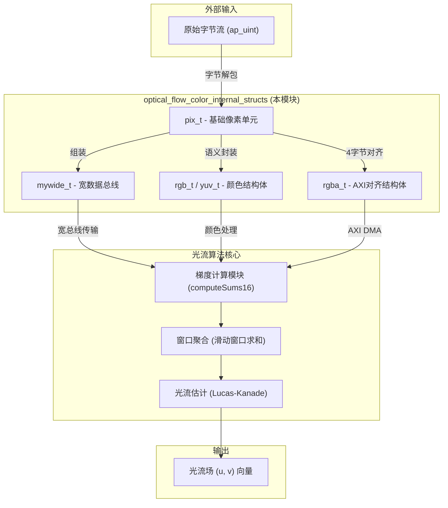
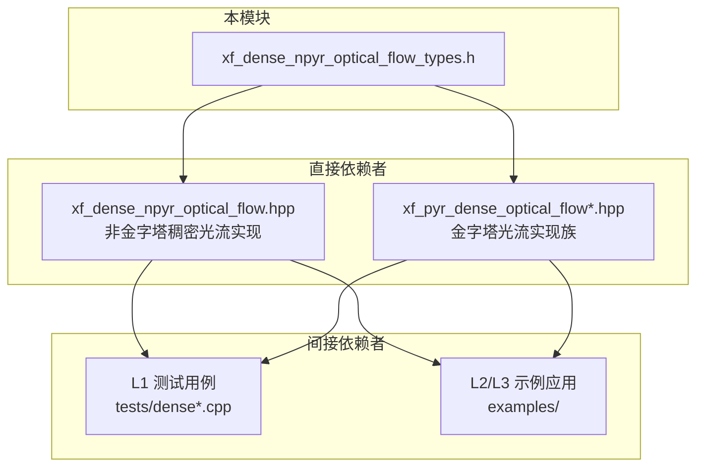

# optical_flow_color_internal_structs 技术深度解析

## 概述：为何这个模块存在

想象你正在设计一个实时视频分析系统，需要在一秒内处理数千帧图像，计算每一像素在两帧之间的运动向量——这就是**光流计算**（Optical Flow）的核心任务。这个模块 `optical_flow_color_internal_structs` 并非直接实现算法，而是为整个光流计算子系统奠定**数据表示层的基础**。

在 FPGA 加速计算领域，数据如何在硬件和软件之间流动、如何对齐、如何打包，直接决定了系统能达到的吞吐率。本模块定义的每一个结构体（`rgb_t`、`yuv_t`、`rgba_t`、`hsv_t`）都承载着**硬件友好的布局设计**意图——它们是软件算法与 FPGA 硬件实现之间的"通用语言"。

## 心智模型：理解这个模块的抽象层次

想象一个**视频处理流水线**就像一座工厂：

- **原材料入口**：原始像素数据以字节流的形式涌入
- **预处理车间**：将原始字节流组装成语义明确的"颜色样本"（RGB、YUV 等）
- **核心加工区**：光流算法对这些颜色样本进行梯度计算、窗口聚合
- **包装出货**：将计算结果打包成标准格式输出

本模块处于**预处理车间**的层级。它定义了"颜色样本"的标准容器——就像工厂里统一规格的零件盒，确保上下游工序能无缝衔接。

关键抽象概念：

1. **像素类型（`pix_t`）**：最基础的原子单位，定义为 `unsigned char`（8 位无符号整数）。这是硬件数据通路的"位宽"决定的基础单位。

2. **颜色空间结构体**：将 3 个或 4 个 `pix_t` 打包成语义整体（如 RGB 的三个通道）。注意这里使用 C 语言的 `typedef struct` 而非 C++ 的类——这是为了**保证 POD（Plain Old Data）语义**，确保内存布局完全可预测，没有隐藏的成员（如虚表指针）。

3. **宽数据总线模板（`mywide_t`）**：这是一个关键的**硬件优化抽象**。在 FPGA 中，数据以 AXI 流（AXI Stream）的形式传输，总线宽度直接影响吞吐率。`mywide_t<BYTES_PER_CYCLE>` 模板允许在编译时配置"每个时钟周期传输多少字节"——这是典型的**HLS（High-Level Synthesis）编程模式**，用 C++ 模板实现硬件的参数化设计。

## 架构图与数据流



### 数据流详解

**1. 输入层：原始字节流**

来自外部内存或视频捕获设备的原始数据以 `ap_uint<N>`（Xilinx HLS 的任意位宽整数类型）的形式到达。这些数据只是无意义的字节序列，尚未被解释为颜色值。

**2. 转换层：类型解包（本模块的核心作用）**

本模块提供的数据结构在这一层发挥作用：

- **`pix_t`**：将原始字节解释为 8 位无符号整数（0-255），这是像素强度的数值表示。
- **`mywide_t<BYTES_PER_CYCLE>`**：将多个 `pix_t` 打包成一个宽数据字。例如，在 64 位 AXI 总线上，`mywide_t<8>` 可以一次性传输 8 个像素。这是**吞吐率优化的关键**——在 FPGA 中，时钟频率有限，提高并行度（总线宽度）是提升性能的主要手段。
- **`rgb_t`、`yuv_t` 等**：将 3 个 `pix_t` 赋予语义（红/绿/蓝或亮度/色度）。这是为了支持不同颜色空间的处理算法。

**3. 处理层：光流算法核心**

数据流入 `xf_dense_npyr_optical_flow.hpp` 中实现的算法（如 `computeSums16` 函数）：

- 读取 `mywide_t` 格式的像素流
- 计算图像梯度（空间导数）
- 在滑动窗口内聚合梯度信息
- 求解 Lucas-Kanade 方程得到光流向量

**4. 输出层：光流场**

最终输出是每个像素的二维位移向量 `(u, v)`，表示该像素在相邻帧之间的运动。

## 依赖关系与调用图

### 谁依赖本模块？



**直接依赖者说明**：

1. **`xf_dense_npyr_optical_flow.hpp`**（非金字塔稠密光流）
   - 使用 `mywide_t` 进行宽总线像素流传输
   - 使用 `pix_t` 作为内部像素缓冲区（`img1Win`、`img2Win` 等）的元素类型
   - 算法核心 `computeSums16` 函数操作 `pix_t` 数组

2. **`xf_pyr_dense_optical_flow*.hpp`**（金字塔光流家族）
   - 包含多尺度金字塔光流实现
   - 在图像金字塔的每一层使用相同的底层像素类型
   - `xf_pyr_dense_optical_flow_scale.hpp` 处理图像缩放时使用 `pix_t` 作为采样单位

**间接依赖者说明**：

- **L1 测试用例**：在 `vision/L1/tests/` 目录下，测试程序包含本头文件来声明测试数据类型。
- **L2/L3 示例应用**：高层应用通过包含光流实现头文件间接使用本模块的类型定义。

---

### 本模块依赖谁？

本模块是一个**基础头文件**，设计为**尽可能少地依赖其他模块**，以确保：

1. **可移植性**：可以在不引入整个 Vitis Libraries 依赖树的情况下单独使用
2. **编译速度**：最小化头文件包含链
3. **稳定性**：不依赖可能变化的上层接口

**实际依赖**：

```c
// 无任何 #include！
```

本头文件**零依赖**——它不包含任何其他头文件。这是有意为之的设计：

- 使用 C 语言内建类型 `unsigned char` 而非 `<stdint.h>` 的 `uint8_t`，避免引入标准头文件
- 使用 C++ 基础模板特性，不依赖 STL

**前置条件**：

虽然本头文件零依赖，但**使用者**需要确保：

1. **编译器支持 C++98 或更高版本**（模板、typedef 等特性）
2. **在 Xilinx HLS 环境中使用时**：需要包含 `ap_int.h` 等 HLS 特定的头文件来配合本模块的类型使用（但这些是**使用者的责任**，不是本模块的依赖）

### 数据流详解

**1. 输入层：原始字节流**

来自外部内存或视频捕获设备的原始数据以 `ap_uint<N>`（Xilinx HLS 的任意位宽整数类型）的形式到达。这些数据只是无意义的字节序列，尚未被解释为颜色值。

**2. 转换层：类型解包（本模块的核心作用）**

本模块提供的数据结构在这一层发挥作用：

- **`pix_t`**：将原始字节解释为 8 位无符号整数（0-255），这是像素强度的数值表示。
- **`mywide_t<BYTES_PER_CYCLE>`**：将多个 `pix_t` 打包成一个宽数据字。例如，在 64 位 AXI 总线上，`mywide_t<8>` 可以一次性传输 8 个像素。这是**吞吐率优化的关键**——在 FPGA 中，时钟频率有限，提高并行度（总线宽度）是提升性能的主要手段。
- **`rgb_t`、`yuv_t` 等**：将 3 个 `pix_t` 赋予语义（红/绿/蓝或亮度/色度）。这是为了支持不同颜色空间的处理算法。

**3. 处理层：光流算法核心**

数据流入 `xf_dense_npyr_optical_flow.hpp` 中实现的算法（如 `computeSums16` 函数）：

- 读取 `mywide_t` 格式的像素流
- 计算图像梯度（空间导数）
- 在滑动窗口内聚合梯度信息
- 求解 Lucas-Kanade 方程得到光流向量

**4. 输出层：光流场**

最终输出是每个像素的二维位移向量 `(u, v)`，表示该像素在相邻帧之间的运动。

## 核心组件深度解析

### `pix_t` —— 原子像素单元

```c
typedef unsigned char pix_t;
```

**设计意图**：

在计算机视觉领域，8 位无符号整数是表示像素强度的标准。选择 `unsigned char` 而非 `uint8_t`（虽然两者在大多数平台上等价）是出于**可移植性考虑**——`unsigned char` 是 C 语言标准保证存在的类型，而 `uint8_t` 需要 `<stdint.h>`。

**硬件映射**：

在 FPGA 实现中，`pix_t` 映射到 8 位寄存器或存储器单元。这是 HLS 工具（Vitis HLS）能够直接识别的基本数据类型。

**使用约定**：

- 像素值范围：0（黑）到 255（白/最大强度）
- 不支持负值或浮点表示（固定点运算在后续处理阶段使用）

---

### `mywide_t<BYTES_PER_CYCLE>` —— 宽数据总线模板

```c
template <int BYTES_PER_CYCLE>
struct mywide_t {
    pix_t data[BYTES_PER_CYCLE];
};
```

**设计意图**：

这是典型的**HLS 编程模式**——用 C++ 模板实现硬件的参数化。`BYTES_PER_CYCLE` 是一个编译时常量，决定了每个时钟周期可以传输多少字节。

**硬件映射**：

在生成的 RTL（寄存器传输级）代码中，`mywide_t<8>` 会被展开为 64 位（8 字节 × 8 位）的数据总线。这直接映射到 AXI Stream 接口的数据通道。

**关键参数选择**：

- `BYTES_PER_CYCLE = 1`：串行传输，低吞吐率，低资源占用
- `BYTES_PER_CYCLE = 4`：32 位总线，适合标准 AXI4-Stream
- `BYTES_PER_CYCLE = 8`：64 位总线，高吞吐率，适合 4K 视频处理

**使用模式**：

在 `readMatRows16` 等函数中，`mywide_t` 通过 HLS 流（`hls::stream`）进行传递：

```cpp
hls::stream<mywide_t<XF_NPIXPERCYCLE(NPC)> > pixStream;
```

这里的 `XF_NPIXPERCYCLE` 是一个宏，根据 `NPC`（每时钟周期像素数）计算 `BYTES_PER_CYCLE`。

---

### `rgb_t` —— RGB 颜色空间表示

```c
typedef struct __rgb { pix_t r, g, b; } rgb_t;
```

**设计意图**：

RGB 是计算机图形和显示设备的标准颜色空间。`rgb_t` 提供了一种紧凑的、硬件友好的方式来表示一个像素的颜色值。

**内存布局**：

```
地址偏移：  +0    +1    +2
           ┌────┬────┬────┐
           │  r │  g │  b │
           └────┴────┴────┘
           <─── 3 字节 ───>
```

总大小：3 字节（24 位）。注意这不是 2 的幂，对于某些 DMA 传输可能需要填充。

**使用场景**：

- 直接驱动 RGB 显示器
- 与 OpenCV 等库的 `cv::Vec3b` 类型互操作
- 作为颜色空间转换（如 RGB → YUV）的输入

---

### `rgba_t` —— AXI 对齐的 RGBA 结构体

```c
typedef struct __rgba {
    pix_t r, g, b;
    pix_t a; // can be unused
} rgba_t;
```

**设计意图**：

这是本模块中**最关键的设计决策**之一。注释明确指出："Packed structs on axi need to be powers-of-2"（AXI 总线上的打包结构体必须是 2 的幂）。

**AXI 总线对齐要求**：

Xilinx AXI DMA 引擎和 HLS 生成的 RTL 代码通常要求数据宽度为 2 的幂（8、16、32、64 位等）。`rgb_t`（3 字节 = 24 位）不符合这一要求，会导致：

1. DMA 传输效率降低（需要非对齐访问）
2. HLS 无法直接将结构体映射到 AXI Stream 接口
3. 需要额外的字节填充逻辑

**解决方案**：添加 Alpha 通道

通过添加第 4 个字节（`a` 通道），`rgba_t` 达到 4 字节（32 位），满足 2 的幂要求。在光流计算场景中，Alpha 通道通常未被使用（注释说明 "can be unused"），但其存在使得数据结构可以直接用于 AXI DMA 传输。

**内存布局**：

```
地址偏移：  +0    +1    +2    +3
           ┌────┬────┬────┬────┐
           │  r │  g │  b │  a │
           └────┴────┴────┴────┘
           <──── 4 字节 ────>
```

总大小：4 字节（32 位），天然对齐到 32 位边界。

**使用场景**：

- AXI DMA 传输（尤其是与 DDR 内存交互）
- 与 GPU 或显示控制器的接口（通常期望 RGBA 格式）
- 需要与 32 位处理器架构对齐的场景

---

### `yuv_t` —— YUV 颜色空间表示

```c
typedef struct __yuv { pix_t y, u, v; } yuv_t;
```

**设计意图**：

YUV（也称 YCbCr）是视频压缩和传输的标准颜色空间。与 RGB 不同，YUV 将亮度（Y）与色度（U、V）分离，支持**色度子采样**（如 4:2:0，即 U、V 分辨率减半），大幅减少数据量。

**内存布局**：

与 `rgb_t` 相同，3 字节结构：

```
地址偏移：  +0    +1    +2
           ┌────┬────┬────┐
           │  y │  u │  v │
           └────┴────┴────┘
```

**设计权衡**：

注意 `yuv_t` 也是 3 字节，不符合 AXI 对齐要求。但在光流计算中，YUV 通常在输入阶段就被转换为内部处理格式（如灰度或 RGB），因此不需要 `yuva_t` 这样的变体。如果需要 YUV 的 AXI 对齐版本，可以在应用层手动填充或使用 `rgba_t` 承载 YUV+Alpha。

**使用场景**：

- 视频解码器输入（H.264/H.265 解码后通常是 YUV）
- 与摄像头传感器的直接接口（许多传感器输出 YUV）
- 色度子采样与亮度通道分离处理

---

### `hsv_t` —— HSV 颜色空间表示

```c
typedef struct __hsv { pix_t h, s, v; } hsv_t;
```

**设计意图**：

HSV（Hue 色相、Saturation 饱和度、Value 明度）是一种**直觉化**的颜色空间，更接近人类对颜色的感知方式。相比 RGB，HSV 更适合基于颜色的图像分割、颜色跟踪等任务。

**在光流计算中的角色**：

值得注意的是，光流算法通常在**灰度空间**或**RGB 空间**中计算梯度，HSV 在光流流水线中的使用相对较少。`hsv_t` 的存在更多是为了**完整性**——作为视觉库的一部分，支持可能需要颜色空间转换的应用场景（如在光流结果可视化时，将运动向量映射到 HSV 颜色空间进行着色）。

**内存布局**：

同样是 3 字节结构：

```
地址偏移：  +0    +1    +2
           ┌────┬────┬────┐
           │  h │  s │  v │
           └────┴────┴────┘
```

各分量的典型范围（应用层约定，本结构体只负责存储）：
- H（色相）：0-179（OpenCV 约定，对应 0-360 度的一半，适配 8 位存储）
- S（饱和度）：0-255
- V（明度）：0-255


## 设计决策与权衡分析

### 1. 为何使用 C 风格结构体而非 C++ 类？

**选择**：使用 `typedef struct { ... } name_t;` 而非 `class` 或带方法的 C++ `struct`。

**理由**：

1. **POD 语义**：C 风格结构体保证是 POD 类型，内存布局完全平坦，没有虚表指针、没有构造函数/析构函数的开销。这对于 HLS 工具链至关重要——HLS 需要将 C++ 代码综合为 RTL，复杂的 C++ 特性（虚函数、异常等）难以综合。

2. **跨语言兼容性**：这些类型可能需要在 C 代码、OpenCL 内核、甚至 RTL 测试平台中使用。C 风格结构体具有最广泛的兼容性。

3. **确定性内存布局**：编译器对 C 风格结构体的布局规则简单明确（按成员声明顺序排列），便于计算偏移量和进行 DMA 传输。

**权衡**：

- **失去封装性**：无法在结构体内置方法进行有效性检查（如确保 RGB 值在 0-255 范围内）。
- **失去类型安全**：C 风格的 `typedef` 只是别名，编译器不会阻止 `rgb_t` 和 `yuv_t` 的无意混用。

**缓解措施**：通过命名约定（`_t` 后缀）和文档约定来弥补，依赖代码审查确保正确使用。

### 2. 为何 `rgba_t` 采用 4 字节而非紧凑的 3 字节？

**选择**：`rgba_t` 显式添加未使用的 Alpha 通道，将结构体从 3 字节扩展到 4 字节。

**理由**：

1. **AXI 总线对齐**：Xilinx AXI DMA 引擎在传输非 2 的幂宽度数据时需要复杂的字节使能逻辑，降低效率。4 字节（32 位）是最常用的 AXI 数据宽度之一。

2. **HLS 工具链优化**：Vitis HLS 在处理 2 的幂宽度数组和结构体时能生成更高效的 RTL（如使用块 RAM 的 native 端口宽度）。

3. **处理器架构对齐**：在 ARM 或 MicroBlaze 等 32 位处理器上访问 4 字节对齐的数据只需一个指令周期，而访问 3 字节数据可能需要多个字节访问和位运算。

**权衡**：

- **内存开销**：对于 RGB 图像，使用 `rgba_t` 存储会浪费 25% 的内存（每像素 4 字节 vs 3 字节）。在 4K 分辨率（3840×2160）下，这意味着单帧多占用约 7.9 MB 内存。

**缓解措施**：

- **双轨策略**：在内存存储时使用紧凑的 `rgb_t`（3 字节）或平面格式（Planar，将 R、G、B 分三个数组存储）；仅在 AXI DMA 传输或硬件加速处理时临时转换为 `rgba_t`。
- **压缩存储**：在 DDR 内存中存储压缩的 RGB 数据，在送入 FPGA 加速卡前通过硬件解压单元展开为 RGBA。

### 3. 为何使用模板而非宏定义宽数据类型？

**选择**：使用 `template <int BYTES_PER_CYCLE> struct mywide_t` 而非 `#define WIDE_TYPE ...`。

**理由**：

1. **类型安全**：模板参数 `BYTES_PER_CYCLE` 是编译期常量，如果使用宏，可能会在不同编译单元产生不一致的定义。模板确保了类型的一致性。

2. **作用域控制**：模板定义遵循 C++ 的作用域规则，而宏是全局文本替换，可能意外地影响其他代码。

3. **IDE 和工具支持**：现代 C++ 工具链（如 clangd、IntelliSense）对模板的支持远好于宏，能提供更好的自动补全和类型检查。

**实际使用模式**：

在 `xf_dense_npyr_optical_flow.hpp` 中，`mywide_t` 通常与 `XF_NPIXPERCYCLE` 宏配合使用：

```cpp
mywide_t<XF_NPIXPERCYCLE(NPC)> tmpData;
```

这里 `NPC`（Number of Pixels per Clock）是一个模板参数，表示每个时钟周期处理多少像素。对于 8 位像素，`XF_NPIXPERCYCLE(NPC)` 就是 `NPC`。这种设计允许光流算法根据目标帧率和时钟频率，在编译时选择并行度。

## 新贡献者需要警惕的陷阱

### 1. 内存对齐陷阱

**问题**：假设 `rgb_t` 是 4 字节（因为 3 个 `unsigned char` 加一个填充字节）。

**现实**：`rgb_t` 是严格的 3 字节结构体。编译器不会在结构体末尾自动填充字节，除非你明确要求（如使用 `rgba_t`）。

**后果**：

```cpp
rgb_t pixels[10];
size_t size = sizeof(pixels);  // 结果是 30，不是 40！

// 错误：假设每个像素 4 字节，导致 DMA 传输错误
DMA_Transfer(pixels, 10 * 4);  // 实际只传输了 30 字节，但告诉 DMA 40 字节
```

**解决方案**：

- 始终使用 `sizeof()` 计算实际大小，不要假设
- DMA 传输时使用 `sizeof(rgb_t)` 而非硬编码数字
- 如需 AXI 对齐，显式使用 `rgba_t` 而非 `rgb_t`

### 2. 颜色空间混淆陷阱

**问题**：将 YUV 数据当作 RGB 处理，或反之。

**示例**：

```cpp
// 错误：将 YUV 数据直接当作 RGB 渲染
yuv_t yuv_pixel = GetPixelFromCamera();  // 摄像头输出 YUV
rgb_t rgb_pixel;
rgb_pixel.r = yuv_pixel.y;  // 语义错误！Y 不等于 R
rgb_pixel.g = yuv_pixel.u;  // U 是色度，不是 G
rgb_pixel.b = yuv_pixel.v;  // V 是色度，不是 B
SetPixelOnScreen(rgb_pixel);  // 颜色完全错误！
```

**正确的颜色空间转换**：

```cpp
// 正确的 YUV 到 RGB 转换
yuv_t yuv = GetPixelFromCamera();
rgb_t rgb;
// 标准 YUV 到 RGB 转换公式
rgb.r = yuv.y + 1.402 * (yuv.v - 128);
rgb.g = yuv.y - 0.344 * (yuv.u - 128) - 0.714 * (yuv.v - 128);
rgb.b = yuv.y + 1.772 * (yuv.u - 128);
SetPixelOnScreen(rgb);
```

**注意**：本模块只提供数据结构定义，不提供转换函数。颜色空间转换逻辑在上层模块（如专门的色彩空间转换模块）中实现。

### 3. 模板实例化膨胀陷阱

**问题**：在多个编译单元中使用不同的 `BYTES_PER_CYCLE` 参数实例化 `mywide_t`，导致代码膨胀。

**示例**：

```cpp
// file1.cpp
mywide_t<1> stream1;  // 实例化 mywide_t<1>

// file2.cpp
mywide_t<2> stream2;  // 实例化 mywide_t<2>

// file3.cpp
mywide_t<4> stream3;  // 实例化 mywide_t<4>

// file4.cpp
mywide_t<8> stream4;  // 实例化 mywide_t<8>
```

**后果**：

- 编译时间增加
- 可执行文件体积增大（虽然对于简单的结构体模板，实例化开销相对较小）
- 在 FPGA 比特流中，每个实例化会产生不同的硬件模块，可能增加资源消耗

**解决方案**：

- **统一配置**：在项目范围内约定使用固定的几个 `BYTES_PER_CYCLE` 值（如 1、2、4、8），避免随意定义新值。

- **类型别名**：在项目的公共头文件中定义标准别名：

```cpp
// common_types.hpp
#include "xf_dense_npyr_optical_flow_types.h"

using PixelStream1B = mywide_t<1>;
using PixelStream2B = mywide_t<2>;
using PixelStream4B = mywide_t<4>;
using PixelStream8B = mywide_t<8>;
```

这样所有代码都使用相同的类型别名，确保实例化一致性。

## 相关模块与延伸阅读

### 相邻模块

1. **[optical_flow_color_public_types](vision_core_types_and_benchmarks-optical_flow_color_public_types.md)**：
   - 如果存在，可能提供更高级的颜色类型封装
   - 可能包含颜色空间转换函数

2. **[l3_benchmark_timing_types](vision_core_types_and_benchmarks-l3_benchmark_timing_types.md)**：
   - L3 层的基准测试类型定义
   - 用于测量光流算法性能的计时结构体

### 父模块

**[vision_core_types_and_benchmarks](vision_core_types_and_benchmarks.md)**：
- 视觉核心类型和基准测试模块族
- 包含多个与光流、图像处理相关的子模块

## 总结

`optical_flow_color_internal_structs` 是一个看似简单但设计精巧的基础模块。它没有复杂的算法，也没有华丽的接口——它只是定义了几个基本的数据结构：像素类型、颜色空间结构体、宽数据总线模板。

然而，正是这些看似简单的定义，承载着**硬件加速计算的核心设计哲学**：

1. **内存布局决定硬件效率**：`rgba_t` 的 4 字节对齐不是随意选择，而是为了匹配 AXI 总线的 2 的幂宽度要求。

2. **编译时配置优于运行时**：`mywide_t` 的模板参数化允许在编译时确定总线宽度，生成最优的 RTL 电路，而非在运行时承担配置开销。

3. **POD 类型保证硬件友好**：C 风格结构体的选择放弃了 C++ 的封装便利，换取了确定的内存布局和跨语言兼容性——这是与 FPGA 硬件直接对话的必要条件。

对于新加入团队的开发者，理解这个模块的关键不在于记住每个结构体的定义，而在于领会其背后的**设计权衡**：为什么是这样而非那样？这种对设计意图的把握，将帮助你在面对新问题时做出一致的、符合系统架构哲学的决策。