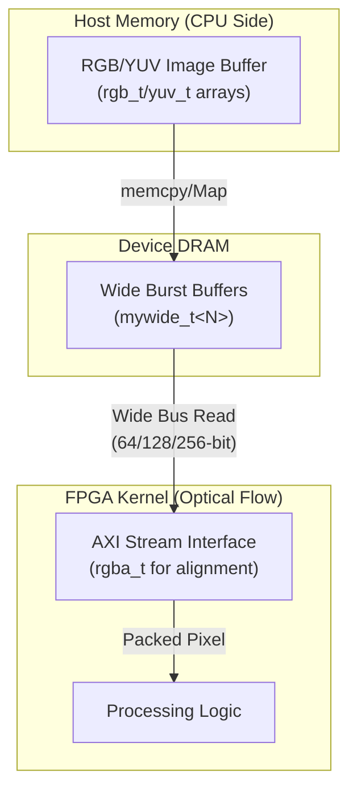

# optical_flow_color_public_types 模块深度解析

## 导语：像素世界的通用语言

想象一下，你正在设计一条从摄像头到 FPGA 加速核的"数字 conveyor belt（传送带）"。在这条传送带上流动的不是包裹，而是**像素**——每个像素都携带着颜色信息，但不同环节对"如何打包这些信息"有着截然不同的要求。主机内存喜欢简单的 RGB 三元组；视频解码器输出的是 YUV 格式；而 FPGA 内核为了最大化带宽利用率，希望一次处理 32 字节甚至更宽的数据块。

`optical_flow_color_public_types` 正是这个场景下的"包装规范手册"。它不提供具体的图像处理算法，而是定义了**光流计算 pipeline 中所有参与者必须共同遵守的像素类型契约**。这些类型就像是集装箱的标准尺寸——无论里面装的是什么，只要箱子符合标准，就能在 pipeline 的各个环节顺畅流转。

---

## 架构视角：数据如何在光流 Pipeline 中流动

在深入代码之前，让我们先建立对系统架构的直觉。这个模块位于光流加速库的 L1（内核级）与 L3（应用级）的交界处，充当着**硬件友好的类型层（Hardware-Friendly Type Layer）**。

### 架构角色解析



1. **Host 侧的松散格式**：在 CPU 内存中，图像通常以 `rgb_t` 或 `yuv_t` 的数组形式存储。这些结构紧凑（3 字节/像素），适合软件处理，但不利于硬件的突发传输（burst transfer）。

2. **DRAM 的宽数据对齐层**：`mywide_t<BYTES_PER_CYCLE>` 是一个关键的模板结构，它将多个像素打包成与 FPGA 数据总线宽度匹配的数据块。想象它就像货运卡车上的标准化托盘——无论货物形状如何，都先放在托盘上，这样叉车（DMA 引擎）才能高效搬运。

3. **Kernel 侧的 AXI 友好格式**：`rgba_t` 是一个设计精妙的 4 字节结构，专门为了满足 AXI 总线的对齐要求。虽然光流算法可能不需要 Alpha 通道，但 4 字节对齐确保了每个像素都落在 AXI 的 word boundary 上，避免了跨字访问的性能惩罚。

---

## 组件深度剖析

现在让我们逐个审视这些类型定义，理解它们的设计意图与使用约束。

### `pix_t` —— 像素的原子单位

```c
typedef unsigned char pix_t;
```

这行看似简单的 typedef 实际上是一个**架构决策的锚点**。它确立了整个光流 pipeline 使用 8-bit 无符号整数表示单个颜色通道。这意味着：

- **值域契约**：每个通道的范围严格限定在 0-255，不支持 HDR（高动态范围）或浮点精度的颜色表示。
- **内存密度**：每个通道 1 字节，最大化存储效率，适合嵌入式 FPGA 的有限片上内存（BRAM/URAM）。
- **计算简化**：光流算法中的梯度计算、匹配代价函数等，都基于 8-bit 整数运算设计，避免了浮点单元（DSP48）的消耗。

**新成员注意**：如果你需要处理 10-bit 或 12-bit RAW 图像数据，不能直接复用 `pix_t`，而需要扩展或替换这个基础类型定义。

---

### `rgb_t`, `yuv_t`, `hsv_t` —— 色彩空间的三种方言

```c
typedef struct __rgb { pix_t r, g, b; } rgb_t;
typedef struct __yuv { pix_t y, u, v; } yuv_t;
typedef struct __hsv { pix_t h, s, v; } hsv_t;
```

这三个结构体代表了计算机视觉中最常用的三种颜色表示方式。它们的共存说明了这个光流库支持**多源输入**的灵活性：

| 类型 | 适用场景 | 在光流中的优势 | 在光流中的劣势 |
|------|----------|----------------|----------------|
| `rgb_t` | 通用图像处理，显示器输出 | 直观，与硬件直接对应 | 光照敏感，阴影会产生虚假运动 |
| `yuv_t` | 视频编解码（H.264/265），广播 | Y 通道单独提取亮度，适合灰度光流 | 色度子采样（4:2:0）导致 UV 分辨率低 |
| `hsv_t` | 颜色分割，物体跟踪 | 对光照变化鲁棒（H 通道） | 色相环绕（0°=360°）导致边界不连续 |

**关键设计洞察**：这三个 struct 都使用了 **packed 内存布局**（没有 padding）。在 32 位系统上，`rgb_t` 和 `yuv_t` 各占 3 字节，`hsv_t` 同样 3 字节。这不是巧合——**这是为了在与外部视频 IP 核或软核处理器交互时，精确控制内存布局**。

**新成员注意**：
- 当你将这些 struct 放入数组时，注意**没有 padding** 意味着它们不是 "自然对齐" 的。`rgb_t[2]` 在内存中占据 6 字节，而不是 8 字节。如果你用指针运算 `&arr[1]`，编译器知道跳过 3 字节，但如果你直接做 `(char*)ptr + sizeof(rgb_t)` 强制转换后读取，要确保理解这个布局。
- `hsv_t` 的 `h` 通道是 0-255 的量化值，对应 0-360° 色相的离散化（每步约 1.4°）。如果你需要更精确的色相处理，需要在更高层进行插值。

---

### `rgba_t` —— AXI 对齐的精妙妥协

```c
typedef struct __rgba {
    pix_t r, g, b;
    pix_t a; // can be unused
} rgba_t;
```

这是整个模块中最具**工程智慧**的类型定义。表面上看，它只是 RGB 加上 Alpha 通道，但注释中的 `// can be unused` 暴露了更深层的意图。

**AXI 总线对齐的硬性约束**：
Xilinx FPGA 的 AXI4-Stream 和 AXI4-Memory Mapped 接口强烈偏好数据宽度为 2 的幂次（32-bit, 64-bit, 128-bit...）。`rgb_t` 是 3 字节，如果直接连接到 AXI，每个像素会跨越 word boundary，导致：
1. 需要两次总线访问才能读取一个像素
2. 复杂的 byte-enable 逻辑来屏蔽无关字节
3. 严重的带宽浪费（读 8 字节只用了 3 字节）

**`rgba_t` 的解决方案**：
通过添加第 4 个字节（Alpha），`rgba_t` 成为 4 字节结构，完美对齐到 32-bit word boundary。即使光流算法不使用 Alpha 通道，硬件仍然可以高效地以 1 pixel/cycle 或更高的速率传输数据。

**新成员注意**：
- 如果你在 Kernel 中声明 `rgba_t pixel = input.read();`，即使忽略 `pixel.a`，硬件也能在一个时钟周期完成读取。
- 如果你需要将一个 `rgb_t` 数组转换为 `rgba_t` 以适应 AXI 接口，需要在主机代码或数据搬移层显式添加 padding，这个过程称为 **"4-byte packing"** 或 **"pixel padding"**。

---

### `mywide_t<BYTES_PER_CYCLE>` —— 带宽最大化的模板武器

```c
template <int BYTES_PER_CYCLE>
struct mywide_t {
    pix_t data[BYTES_PER_CYCLE];
};
```

这是整个模块中**唯一使用 C++ 模板特性**的定义，它的存在揭示了光流 pipeline 对内存带宽的极致追求。

**`mywide_t` 的设计哲学**：
通过模板参数 `BYTES_PER_CYCLE`，这个结构可以实例化为任意宽度的数据块：
- `mywide_t<64>`：64 字节/周期，对应 512-bit AXI 总线
- `mywide_t<32>`：32 字节/周期，对应 256-bit AXI 总线
- `mywide_t<16>`：16 字节/周期，对应 128-bit AXI 总线

**新成员注意**：
- `mywide_t` 本身是一个聚合体（aggregate），可以用列表初始化：`mywide_t<32> chunk = {0};`
- 模板参数 `BYTES_PER_CYCLE` 必须与目标 FPGA 平台的 AXI 总线宽度匹配，否则会导致 HLS 生成额外的数据宽度转换逻辑，消耗 LUT 并增加延迟。

---

## 关键设计决策与权衡

### 1. C Struct vs C++ Class

本模块选择使用 C-style struct（POD）而非 C++ class，主要原因：
- **HLS 兼容性**：简单 struct 在 Vitis HLS 中可预测性更高
- **C 互操作性**：C 和 C++ 代码都可以直接使用
- **内存布局透明**：无 vtable，无隐藏成员

### 2. 编译期模板参数 (`mywide_t`)

使用非类型模板参数而非运行期参数：
- **HLS 要求**：数组大小必须是编译期常量
- **硬件效率**：编译期确定的宽度可生成固定总线接口
- **零运行时开销**：无动态分配或虚函数

### 3. RGBA 的填充设计（空间换时间）

使用 4 字节 `rgba_t` 而非紧凑的 3 字节 `rgb_t`：
- **带宽优化**：33% 存储开销换取 2 倍内存访问效率
- **AXI 对齐**：避免跨 word boundary 访问
- **前向兼容**：为未来透明物体处理预留 Alpha 字段

---

## 边缘情况与常见陷阱

### 1. 结构体打包与对齐

**风险**：不同编译器可能导致意外的 padding。

**缓解**：
```cpp
static_assert(sizeof(rgba_t) == 4, "rgba_t must be exactly 4 bytes");
static_assert(alignof(rgba_t) == 1, "rgba_t should not require alignment");
```

### 2. 有符号 vs 无符号溢出

**风险**：`pix_t` 的回绕可能导致错误的梯度值。

**示例**：
```cpp
pix_t c = 100, d = 200;
pix_t diff2 = c - d; // 结果: 156 (回绕！不是 -100)
```

**缓解**：
```cpp
signed char diff = static_cast<signed char>(curr) - static_cast<signed char>(prev);
// 或使用更宽的整数类型
int diff = static_cast<int>(curr) - static_cast<int>(prev);
```

### 3. 宽总线访问的非对齐

**风险**：`mywide_t` 要求严格的对齐（通常需要 4KB 对齐）。

**错误示例**：
```cpp
// 错误：使用普通的 new/malloc，不保证对齐
std::vector<mywide_t<64>> buffer(num_blocks);  // 危险！
```

**正确示例**：
```cpp
// 正确：使用对齐的分配器
std::vector<mywide_t<64>, boost::alignment::aligned_allocator<mywide_t<64>, 4096>> 
    buffer(num_blocks);

// 或使用 XRT 的 Buffer Object（自动处理对齐）
xrt::bo buffer(device, size, xrt::bo::flags::host_only, kernel.group_id(0));
```

---

## 总结与关键要点

`optical_flow_color_public_types` 是一个看似简单但设计精妙的模块。它通过以下几个关键决策支撑了整个光流加速 pipeline：

1. **统一的像素原子单位**（`pix_t`）：确立 8-bit 无符号整数作为基础，平衡精度与资源效率。

2. **多色彩空间支持**（`rgb_t`, `yuv_t`, `hsv_t`）：提供灵活性以适配不同输入源，同时保持紧凑的内存布局。

3. **硬件对齐优化**（`rgba_t`）：以 33% 的存储开销换取 2 倍的内存访问效率，是"空间换时间"的经典案例。

4. **带宽最大化模板**（`mywide_t`）：利用 C++ 模板实现编译期参数化，确保 FPGA 硬件以最优总线宽度运行。

**给新成员的最后建议**：
- 始终关注**内存对齐**：无论是 AXI 接口的 4-byte 对齐，还是 DMA 的 4KB 对齐，不对齐是性能杀手。
- 理解**模板实例化的静态性**：`mywide_t<64>` 和 `mywide_t<32>` 是不同的类型，不能互相赋值或比较。
- 警惕**无符号整数的回绕**：在计算像素差值时，始终考虑是否需要转换为有符号类型。
- 保持**类型的纯粹性**：这个模块只定义数据，不定义操作。颜色空间转换、数据打包等逻辑属于其他模块。

---

## 参考链接

- 相关模块：
  - [optical_flow_color_internal_structs](vision_core_types_and_benchmarks-optical_flow_color_internal_structs.md) - 内部结构定义
  - [aie_data_mover_configuration](vision_core_types_and_benchmarks-aie_data_mover_configuration.md) - AI 引擎数据搬移配置
  - [l3_benchmark_timing_types](vision_core_types_and_benchmarks-l3_benchmark_timing_types.md) - 性能测试类型定义