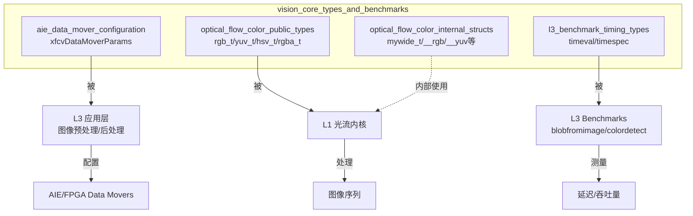

# vision_core_types_and_benchmarks 模块深度解析

## 一句话概括

这个模块是 Xilinx Vision Library 的"类型基础设施"——它定义了跨层（L1/L3）共享的核心数据结构，包括 AIE 数据搬运配置、光流计算的颜色空间表示，以及基准测试的时序测量类型。如果说视觉算法是建筑，这个模块就是地基中的钢筋骨架。

---

## 问题空间与设计动机

### 我们面对什么挑战？

在异构视觉加速平台上（AIE/FPGA/CPU 混合架构），开发者面临三类碎片化问题：

1. **数据格式碎片化**：同一张图像在不同处理阶段可能以 RGB、YUV、HSV 或 RGBA 表示，每种格式的内存布局、位宽、通道顺序都不同
2. **硬件配置碎片化**：AIE（AI Engine）数据搬运器（Data Mover）需要复杂的参数配置（输入/输出图像尺寸、平铺策略等），这些配置需要跨主机代码和内核代码共享
3. **性能测量碎片化**：不同层级（L1 内核级、L3 应用级）的基准测试需要一致的时序测量原语，但又要适配不同平台（Linux `timeval` vs `timespec`）

### 为什么选择集中式类型定义？

**替代方案 A：每个模块自给自足**  
让 L1 的光流内核自己定义 `rgb_t`，让 L3 的预处理自己定义颜色结构。问题是：当 L3 的预处理输出要传递给 L1 的光流内核时，需要显式的格式转换层，增加不必要的内存拷贝和延迟。

**替代方案 B：完全依赖 OpenCV 类型**  
OpenCV 的 `cv::Vec3b` 和 `cv::Mat` 是标准选择。但在 AIE/FPGA 内核代码中，OpenCV 头文件过于沉重，且许多类型对硬件综合不友好（虚函数、动态内存）。

**选定的方案：轻量级、头文件-only 的类型层**  
这个模块提供的类型都是 POD（Plain Old Data）结构体，没有构造函数/析构函数，没有虚函数，内存布局明确且可预测。它们可以被安全地用于：
- 主机代码（与 OpenCV 互操作）
- AIE 内核代码（C++/AIE 编译器）
- HLS 内核代码（高层次综合）

---

## 架构全景与数据流



### 核心组件职责

**1. xfcvDataMoverParams（AIE 数据搬运配置）**  
这是 AIE 架构中的"物流调度单"。在异构视觉管线中，图像数据通常太大无法一次性装入 AIE 本地内存，需要被切分成"平铺"（tiles）。这个结构体定义了：
- 输入图像尺寸（原始分辨率）
- 输出图像尺寸（可能是上采样/下采样后的）
- 数据搬运方向（TILER = 主机→AIE，STITCHER = AIE→主机）

**关键洞察**：`xfcvDataMoverParams` 是跨主机-内核边界的共享契约。主机代码填充它，AIE 内核读取它，两者必须对头文件版本严格一致，否则内存布局错配会导致难以调试的数据损坏。

**2. 光流颜色类型（rgb_t/yuv_t/hsv_t/rgba_t）**  
这些是光流计算的"原材料格式"。密集光流算法需要比较连续帧的像素值，但"像素值"的表示方式直接影响计算的稳定性和精度：

- **RGB**：最直观的显示格式，但对光照变化敏感（R/G/B 通道同时受亮度影响）
- **YUV**：将亮度（Y）与色度（UV）分离，光流计算通常只在 Y 通道上进行，减少计算量
- **HSV**：色相/饱和度/亮度分离，对彩色跟踪任务更稳定
- **RGBA**：带 Alpha 通道的 RGB，用于需要透明度的混合场景

**设计权衡**：这些类型都是 `pix_t`（`unsigned char`）的聚合体，而非模板化的泛型类型。这是刻意的选择——光流内核针对 8-bit 图像优化，使用模板会增加编译时间而不带来实际收益。

**3. L3 基准测试时序类型（timeval/timespec）**  
这些是性能测量的"秒表"。L3 级基准测试（如 `blobfromimage` 和 `colordetect`）需要精确测量端到端延迟，但测量方式需适配不同平台：

- **`struct timeval`**：传统 Linux 类型（秒 + 微秒），用于较旧的代码路径
- **`struct timespec`**：更高精度的 POSIX 类型（秒 + 纳秒），用于需要亚微秒精度的场景

**关键细节**：这些类型来自系统头文件（`<sys/time.h>`），不是本模块定义，但本模块的基准代码显式使用它们进行时间测量。

---

## 关键设计决策与权衡

### 决策 1：POD 结构体 vs. 封装类

**选择**：所有颜色类型和参数结构体都是纯 POD（没有构造函数、析构函数、虚函数）。

**权衡分析**：
- **替代方案**：使用带有构造函数和验证逻辑的封装类，例如 `RgbPixel` 类在构造时检查值范围
- **优点（POD）**：
  - 内存布局可预测（C 兼容）
  - 可以用作 AIE/HLS 内核的接口类型（硬件编译器无法处理复杂 C++ 特性）
  - 零开销（没有虚表指针，没有 RTTI）
- **缺点（POD）**：
  - 没有内建的验证，无效值（如 H 色相 > 255）只能在运行时静默产生错误结果
  - 需要显式初始化（`rgb_t pixel = {0, 0, 0};`），缺少默认构造函数会导致未初始化内存风险

**为何选择 POD**：这个库的目标硬件（AIE/FPGA）要求类型必须在硬件语言（AIE C++/HLS C++）中可用。虚函数和异常处理在这些环境中不受支持或开销过大。POD 是唯一的可行选择。

### 决策 2：静态类型 vs. 动态颜色格式

**选择**：颜色格式（RGB/YUV/HSV）是编译期确定的独立类型，而非运行期枚举。

**权衡分析**：
- **替代方案**：使用带有 `enum ColorFormat { RGB, YUV, HSV }` 的通用 `Image` 类，在运行期切换处理逻辑
- **优点（静态类型）**：
  - 编译期类型检查：无法意外将 YUV 图像传递给期望 RGB 的函数
  - 零运行时开销：不需要虚分派或 switch 语句来选择格式特定的代码路径
  - 内联优化：编译器可以看到具体类型，生成针对该格式的优化代码
- **缺点（静态类型）**：
  - 代码膨胀：每个模板实例化（`process<rgb_t>`、`process<yuv_t>`）生成独立机器码，增加二进制大小
  - 灵活性降低：无法在运行期根据用户输入动态选择格式（需要重新编译或用工厂模式包装）

**为何选择静态类型**：这是一个嵌入式视觉库，处理的是已知格式的实时视频流。在编译期知道格式允许激进的优化（SIMD 向量化、循环展开），这对实现实时性能至关重要。代码膨胀是可接受的，因为通常只使用少数几种格式（主要是 RGB 和 YUV）。

### 决策 3：全局设备状态 vs. 依赖注入

**选择**：`xfcvDataMovers_common.h` 使用全局静态变量（`gpDhdl`、`gHeader`、`gpTop`）来管理 XRT（Xilinx Runtime）设备状态。

**权衡分析**：
- **替代方案**：使用依赖注入模式，将设备句柄显式传递给每个需要它的函数或类
- **优点（全局状态）**：
  - 简洁的 API：函数签名保持简洁，不需要在每个调用点传递设备句柄
  - 单设备假设：代码明确假设只有一个加速设备（常见于嵌入式场景），全局状态反映这一现实
- **缺点（全局状态）**：
  - 测试困难：单元测试需要管理全局状态，测试间可能相互干扰（需要显式重置）
  - 线程安全：全局变量在无锁情况下不是线程安全的，多线程访问需要同步（虽然当前代码看起来是单线程设计）
  - 隐藏依赖：代码的依赖关系不明显，阅读函数实现时才发现它隐式使用全局设备状态

**为何选择全局状态**：这是典型的嵌入式/加速器编程风格。Xilinx 的 XRT 设计假设一个进程管理一个设备，全局状态反映了底层硬件的单例性质。这种选择优先考虑了 API 简洁性，牺牲了测试隔离性（在嵌入式基准测试中可接受）。

---

## 内存所有权与生命周期分析

### xfcvDataMoverParams 结构体

```cpp
struct xfcvDataMoverParams {
    cv::Size mInputImgSize;   // cv::Size 拥有其宽/高值（值语义）
    cv::Size mOutputImgSize;  // 同上
    // ...
};
```

**所有权模型**：
- `xfcvDataMoverParams` 是聚合体（aggregate），其成员 `cv::Size` 是值类型
- 当 `xfcvDataMoverParams` 被复制时，`cv::Size` 成员也被复制（深拷贝语义，虽然 `cv::Size` 只包含两个 `int`）
- 没有动态内存分配，所有内存都在栈上或作为对象的一部分

**生命周期**：
- 与包含它的作用域绑定。典型用法：
  ```cpp
  cv::Size inSize(1920, 1080);
  xfcvDataMoverParams params(inSize);  // 在栈上构造
  // ... 传递给 AIE 数据搬运器 ...
  } // params 在这里销毁（平凡析构，无特殊逻辑）
  ```

### 颜色类型（rgb_t/yuv_t/hsv_t/rgba_t）

```cpp
typedef struct __yuv { pix_t y, u, v; } yuv_t;
typedef struct __rgb { pix_t r, g, b; } rgb_t;
```

**所有权模型**：
- POD（Plain Old Data）结构体，只包含三个 `unsigned char`（`pix_t` 是 `unsigned char` 的别名）
- 没有指针成员，没有动态内存
- 复制操作是平凡的（`memcpy` 语义）

**生命周期与内存布局**：
- 大小固定：`rgb_t` 占 3 字节，`rgba_t` 占 4 字节（注意 `__rgba` 被填充为 4 字节以适应 AXI 总线宽度）
- 注意内存对齐：虽然 `rgb_t` 是 3 字节，但通常会被填充到 4 字节边界以优化访问
- 在 AIE/FPGA 内核中使用这些类型时，必须确保主机端和内核端使用相同的头文件定义，否则内存布局错配会导致数据解释错误

### 全局设备状态（gpDhdl, gHeader, gpTop）

```cpp
static xrt::device gpDhdl(nullptr);
static std::vector<char> gHeader;
static const axlf* gpTop = nullptr;
static xrt::uuid xclbin_uuid;
```

**所有权模型**：
- `gpDhdl`：`static` 存储期的 `xrt::device` 对象，拥有对 Xilinx 设备的 RAII 句柄
- `gHeader`：`static std::vector<char>`，拥有从 XCLBIN 文件加载的二进制头数据的动态内存
- `gpTop`：原始指针（`const axlf*`），指向 `gHeader` 内部数据的某处，**不拥有内存**，只是借用视图

**关键所有权陷阱**：
- `gpTop` 指向 `gHeader.data()` 的某个偏移。如果 `gHeader` 被重新分配（如 `push_back` 导致 `vector` 扩容），`gpTop` 将变成悬空指针
- 当前代码中 `gHeader` 在初始化后似乎不再修改，但这一不变式没有强制约束

**生命周期**：
- 这些全局对象在程序启动时构造（`gpDhdl` 初始化为空），在 `deviceInit()` 中被填充
- 程序终止时，`gHeader` 的析构函数自动释放内存，`gpDhdl` 的析构函数关闭设备句柄
- 没有显式的清理函数，依赖进程退出时的全局析构

---

## 数据流与依赖分析

### 数据流 1：AIE 数据搬运配置

```
主机应用程序
    ↓ 构造
xfcvDataMoverParams params(inSize, outSize);
    ↓ 传递给
AIE 数据搬运器运行时
    ↓ 解析为
AIE 硬件寄存器配置（平铺尺寸、步幅等）
    ↓ 控制
DDR ↔ AIE 本地内存之间的实际 DMA 传输
```

**关键依赖**：`xfcvDataMoverParams` 必须匹配 AIE 内核期望的内存布局。如果主机传递 `cv::Size(1920, 1080)` 但内核编译时期望 `1920x1088`（对齐到 16 字节边界），数据将错位。

### 数据流 2：光流颜色类型转换

```
输入图像（BGR 格式，来自摄像头/文件）
    ↓ cv::cvtColor
OpenCV 转换为 RGB/YUV/HSV
    ↓ 像素级拷贝到
xf::rgb_t / xf::yuv_t 缓冲区
    ↓ 传递给
密集光流 AIE 内核
    ↓ 计算
光流矢量场（每个像素的运动矢量）
```

**类型安全注意**：`rgb_t` 和 `yuv_t` 是不同的 C 类型，但都是 3 字节的 unsigned char 数组。编译器不会阻止你将 `yuv_t*` 传递给期望 `rgb_t*` 的函数（类型不安全）。这是为了与 C 兼容而接受的权衡。

### 数据流 3：基准测试时序测量

```
测试台代码（xf_blobfromimage_tb.cpp）
    ↓ 声明
struct timeval start_pp_sw, end_pp_sw;
    ↓ 记录
gettimeofday(&start_pp_sw, 0);  // 内核启动前
    ↓ 执行
FPGA 加速内核
    ↓ 记录
gettimeofday(&end_pp_sw, 0);    // 内核完成后
    ↓ 计算
(lat_pp_sw = end - start) / 1000  // 转换为毫秒
```

**平台可移植性注意**：`timeval` 来自 `<sys/time.h>`，是 Linux 特定的。Windows 需要不同的实现。`timespec`（来自同一文件）提供纳秒级精度，但仅在较新的 POSIX 系统上可用。

---

## 关键设计决策详解

### 决策 4：使用 typedef struct 而非 C++ class

**代码表现**：
```cpp
// 选择的方式（C 兼容）
typedef struct __rgb { pix_t r, g, b; } rgb_t;

// 替代方式（纯 C++）
struct RgbPixel {
    pix_t r, g, b;
    RgbPixel(pix_t r=0, pix_t g=0, pix_t b=0) : r(r), g(g), b(b) {}
    bool operator==(const RgbPixel& other) const { return r==other.r && g==other.g && b==other.b; }
};
```

**权衡分析**：
- **优点（C 风格）**：
  - 可以在 AIE C++ 代码和旧版 C 代码中使用
  - 内存布局完全可预测（没有隐藏的虚表指针或填充字节的不确定性）
  - 可以使用 C 的聚合初始化语法：`rgb_t pixel = {255, 128, 0};`
- **缺点（C 风格）**：
  - 没有类型安全：可以将任何 3 字节的东西当作 `rgb_t`
  - 没有方法/行为封装：颜色空间转换（RGB→HSV）必须是自由函数，不能是 `rgb_t` 的方法
  - 没有默认初始化：`rgb_t pixel;` 创建未初始化内存（包含垃圾值）

**选择 C 风格的原因**：这个库的目标包括可以被 HLS（高层次综合）和 AIE 编译器处理。这些工具链对 C++ 特性支持有限（特别是虚函数、异常、RTTI）。C 风格的 POD 类型是唯一安全的选择。

### 决策 5：全局设备状态 vs. 显式上下文

**代码表现**（来自 `xfcvDataMovers_common.h`）：
```cpp
// 全局状态（模块级私有）
static xrt::device gpDhdl(nullptr);
static std::vector<char> gHeader;
static const axlf* gpTop = nullptr;

// 初始化函数填充全局状态
void deviceInit(std::string xclBin) {
    if (!bool(gpDhdl)) {
        gpDhdl = xrt::device(0);
        xclbin_uuid = gpDhdl.load_xclbin(xclBin);
        // ... 填充 gHeader 和 gpTop
    }
}
```

**权衡分析**：
- **优点（全局状态）**：
  - API 简洁：应用代码只需调用 `deviceInit(xclbin)` 一次，后续所有 AIE 操作自动使用已初始化设备
  - 符合硬件现实：嵌入式系统通常只有一个加速器设备，全局状态反映这一物理约束
  - 减少参数传递：不需要将设备句柄传递到每个函数调用
- **缺点（全局状态）**：
  - 测试困难：单元测试无法并行运行多个设备配置（全局状态会冲突）
  - 隐藏依赖：代码的依赖关系不明显，函数看起来"纯"但实际上依赖全局状态
  - 生命周期管理：没有显式的 `deviceClose()`，依赖进程退出时的全局析构，可能导致资源释放顺序问题

**选择全局状态的原因**：这是典型的嵌入式/加速器库设计。目标用例是单个进程独占单个加速器设备（U50/U200 等 Alveo 卡）。在这种场景下，全局状态简化了 API 而引入的问题有限。

**使用警告**：
- 不要在同一个进程内尝试用不同 XCLBIN 多次调用 `deviceInit()`，这会导致未定义行为（全局状态已被初始化，检查条件会跳过重新初始化）
- 多线程场景下，对全局设备状态的访问需要外部同步（当前代码没有内置锁）

---

## 子模块概览

本模块包含四个子模块，每个负责特定类型的定义：

### 1. [aie_data_mover_configuration](vision_core_types_and_benchmarks-aie_data_mover_configuration.md)

包含 `xfcvDataMoverParams` 结构体及其相关定义，用于配置 AIE 数据搬运器的平铺/缝合参数。这是主机代码与 AIE 内核之间的"物流调度协议"。

### 2. [optical_flow_color_public_types](vision_core_types_and_benchmarks-optical_flow_color_public_types.md)

包含公开的颜色空间类型定义：`rgb_t`、`yuv_t`、`hsv_t`、`rgba_t`。这些是光流算法处理的标准像素格式，也是库与外部代码（OpenCV）的接口类型。

### 3. [optical_flow_color_internal_structs](vision_core_types_and_benchmarks-optical_flow_color_internal_structs.md)

包含内部使用的结构体定义：`mywide_t`（宽向量类型）、`__rgb`、`__yuv` 等（带双下划线的内部表示）。这些是内核实现的细节，不推荐外部代码直接使用。

### 4. [l3_benchmark_timing_types](vision_core_types_and_benchmarks-l3_benchmark_timing_types.md)

包含 L3 级基准测试使用的时序测量类型：`timeval` 和 `timespec` 的使用模式。这些不是类型定义本身（它们来自系统头文件），而是对其在本模块中使用模式的文档化。

---

## 新贡献者须知

### 危险区域：类型版本不匹配

**场景**：你修改了 `rgb_t` 的定义（比如添加了一个 alpha 通道字段），重新编译了主机代码，但忘记重新编译 AIE 内核。

**后果**：主机以为 `rgb_t` 是 4 字节，AIE 内核以为它是 3 字节。数据在 DMA 传输后错位，光流计算产生完全错误的结果（通常是噪点），且不会触发显式错误——你只是得到了"坏数据"。

**防御措施**：
- 任何对 `vision/L1/include/` 下类型定义的修改，必须触发所有 L1/L2/L3 组件的重编译
- 使用版本化结构体（在 `xfcvDataMoverParams` 风格的结构体中包含版本字段），在运行时检查兼容性

### 隐式契约：内存对齐

**场景**：你在主机端用 `new rgb_t[100]` 分配像素缓冲区，直接传递给 AIE DMA。

**风险**：`new` 分配的内存保证对齐到 `alignof(rgb_t)`（通常是 1 字节，因为 `rgb_t` 是 3 字节结构体）。但 AIE DMA 通常要求 16 字节或 32 字节对齐的缓冲区，以优化总线效率。

**正确做法**：使用对齐的分配器，如：
```cpp
// 使用 posix_memalign 或 C++17 的 aligned_alloc
void* aligned_buffer;
posix_memalign(&aligned_buffer, 64, width * height * sizeof(rgb_t));
// 使用 aligned_buffer 进行 DMA
```

### 时序测量陷阱

**场景**：你在 Windows 上编译 `xf_blobfromimage_tb.cpp`，发现 `gettimeofday` 未定义。

**解释**：`gettimeofday` 是 POSIX 函数（Linux/Unix），Windows 使用不同的 API（`QueryPerformanceCounter`）。本模块的基准代码假设 Linux 环境。

**解决方案**：如果需要跨平台，使用条件编译：
```cpp
#ifdef _WIN32
#include <windows.h>
// 使用 QueryPerformanceCounter
#else
#include <sys/time.h>
// 使用 gettimeofday/timespec_get
#endif
```

### AIE 数据搬运器配置约束

**场景**：你设置 `xfcvDataMoverParams` 的输入尺寸为 1920x1080，但 AIE 内核崩溃或产生错误结果。

**可能原因**：
1. **平铺对齐约束**：AIE 数据搬运器通常要求图像宽度是某个数（如 16、32 或 64）的倍数，以优化 SIMD 效率。1080 可能不是对齐边界。
2. **内存跨步（Stride）与宽度**：如果图像在内存中的跨步（每行实际字节数）与宽度不同（例如有填充字节），`mInputImgSize` 应该反映逻辑图像尺寸，而数据搬运器需要额外的跨步参数（可能在别处配置）。

**调试建议**：
- 检查 AIE 内核的编译日志，确认它期望的图像尺寸和对齐要求
- 使用已知工作尺寸（如 1920x1088，1088 是 16 的倍数）测试，观察问题是否消失

---

## 跨模块依赖关系

### 上游依赖（本模块依赖谁）

| 依赖模块 | 使用方式 | 说明 |
|---------|---------|------|
| OpenCV (cv::Size, cv::Mat) | 在 `xfcvDataMoverParams` 中使用 `cv::Size` | 与 OpenCV 生态集成，但限制了在非 OpenCV 环境中的使用 |
| XRT (xrt::device, xrt::uuid) | 在 `deviceInit()` 中使用 | Xilinx Runtime，用于设备管理和 XCLBIN 加载 |
| POSIX (sys/time.h) | 在 L3 基准测试中使用 `timeval`/`timespec` | 假设 Linux/POSIX 环境 |

### 下游依赖（谁依赖本模块）

| 被依赖模块 | 使用方式 | 说明 |
|-----------|---------|------|
| L1 AIE Kernels | 包含本模块的头文件使用颜色类型 | AIE 光流内核使用 `rgb_t`/`yuv_t` 作为像素类型 |
| L3 Benchmarks | 包含本模块的头文件使用时序类型 | blobfromimage、colordetect 等基准测试使用本模块的时序测量模式 |
| 主机端预处理代码 | 使用 `xfcvDataMoverParams` 配置 AIE 数据流 | 设置图像尺寸、平铺参数等 |

---

## 总结：模块的架构角色

`vision_core_types_and_benchmarks` 是 Xilinx Vision Library 的**类型基础设施层**。它解决了异构视觉加速中的"语言不通"问题：

- **在主机代码与 AIE 内核之间**：`xfcvDataMoverParams` 提供了双方都能理解的配置协议
- **在算法与图像格式之间**：`rgb_t`/`yuv_t` 等类型定义了算法的输入契约
- **在性能分析与优化之间**：`timeval`/`timespec` 测量模式提供了统一的性能评估语言

这个模块的代码量不大，但它是整个库的地基。对它的任何修改都需要极其谨慎，因为涟漪效应会波及整个 L1/L3 代码库。理解这个模块，就是理解 Xilinx Vision Library 如何桥接软件抽象与硬件现实。
