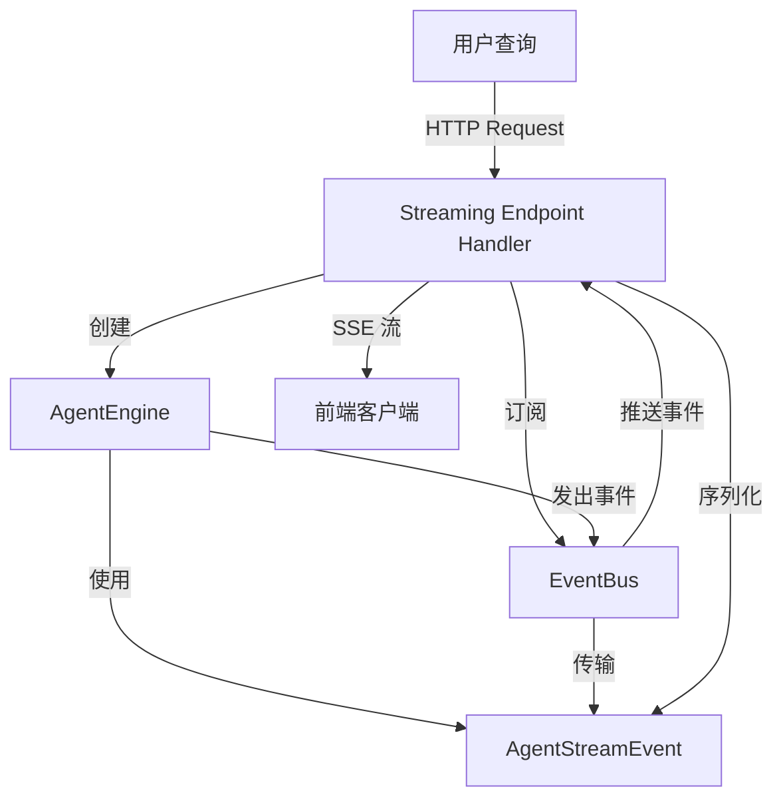

# Agent Stream Event Contracts 模块技术深度解析

## 目录
1. [概述](#概述)
2. [架构与数据流动](#架构与数据流动)
3. [核心组件深度解析](#核心组件深度解析)
4. [设计决策与权衡](#设计决策与权衡)
5. [使用与扩展](#使用与扩展)
6. [边缘情况与注意事项](#边缘情况与注意事项)

## 概述

`agent_stream_event_contracts` 模块定义了智能体（Agent）执行过程中流式事件的契约（contracts）。这些事件契约在整个系统中充当了智能体执行状态与外部世界（主要是前端客户端）之间的标准化通信协议。

### 问题背景

在现代智能体应用中，当用户发送一个查询后，智能体会经历一个复杂的思考和行动过程（通常称为 ReAct 循环）：

1. **思考阶段**：LLM 分析用户问题，决定下一步行动
2. **行动阶段**：调用各种工具（知识检索、网络搜索、数据库查询等）
3. **观察阶段**：收集工具执行结果
4. **迭代**：重复上述过程直到问题解决或达到最大迭代次数

如果用户必须等到整个过程结束才能看到任何反馈，体验会非常差。用户可能会：
- 因为长时间没有响应而取消查询
- 无法理解智能体正在做什么
- 缺乏对智能体决策过程的信任

**`agent_stream_event_contracts` 解决的核心问题是：如何以标准化、可扩展的方式，将智能体执行过程中的每一步实时传递给客户端？**

这个模块就像是智能体系统的"直播摄像机"，它定义了一套清晰的镜头语言（事件类型），让智能体的思考和行动过程可以实时、透明地展现在用户面前。

## 架构与数据流动

### 架构概览

`AgentStreamEvent` 模块在整个系统架构中处于核心契约层的位置。它连接了以下几个关键组件：

1. **AgentEngine**（智能体引擎）：事件的生产者
2. **EventBus**（事件总线）：事件的传输通道
3. **HTTP Handlers**（处理器层）：事件的消费者和转发者
4. **前端客户端**：最终的事件接收者

让我们看一下这个数据流动的 Mermaid 图：



### 数据流动详解

让我们追踪一个完整的事件从产生到被前端接收的完整路径：

1. **事件产生**：在 `AgentEngine.executeLoop` 方法中，智能体执行的每个阶段都会产生相应的事件。
   - 思考阶段：发出 `thought` 事件
   - 工具调用阶段：发出 `tool_call` 事件
   - 工具结果阶段：发出 `tool_result` 事件
   - 最终答案阶段：发出 `final_answer` 事件

2. **事件传输**：这些事件通过 `EventBus.Emit` 方法发布到事件总线上。

3. **事件订阅**：在 HTTP 处理器层（如 `agent_streaming_endpoint_handler`），处理器提前订阅了这些事件类型。

4. **事件转换与发送**：当处理器接收到事件后，它会将内部事件结构转换为 `AgentStreamEvent`，然后通过 SSE（Server-Sent Events）协议发送给前端。

## 核心组件深度解析

### AgentStreamEvent 结构体

`AgentStreamEvent` 是整个模块的核心，它定义了智能体流式事件的标准化格式：

```go
type AgentStreamEvent struct {
    Type      string                 `json:"type"`      // 事件类型
    Content   string                 `json:"content"`   // 增量内容
    Data      map[string]interface{} `json:"data"`      // 附加结构化数据
    Done      bool                   `json:"done"`      // 是否为最后一个事件
    Iteration int                    `json:"iteration"` // 当前迭代次数
}
```

让我们深入分析每个字段的设计意图：

#### Type 字段
```go
Type string `json:"type"`
```

**设计意图**：标识事件的类型，让接收者知道如何解析和展示这个事件。

**可能的值**（根据注释和相关代码）：
- `"thought"`：智能体的思考过程
- `"tool_call"`：工具调用通知
- `"tool_result"`：工具执行结果
- `"final_answer"`：最终答案
- `"error"`：错误事件
- `"references"`：知识引用

**设计亮点**：使用字符串而不是枚举类型，提供了最大的灵活性。新增事件类型不需要修改契约定义，前端可以优雅地处理未知类型。

#### Content 字段
```go
Content string `json:"content"`
```

**设计意图**：存储事件的主要内容，通常是人类可读的文本。

**使用场景**：
- 对于 `"thought"` 事件：存储 LLM 的思考内容
- 对于 `"final_answer"` 事件：存储最终答案的增量文本
- 对于 `"tool_result"` 事件：存储工具的输出摘要

**设计亮点**：内容设计为"增量"的，这意味着对于长文本（如最终答案），可以分多次发送，每次发送一部分，实现打字机效果。

#### Data 字段
```go
Data map[string]interface{} `json:"data"`
```

**设计意图**：存储事件的结构化数据，用于需要机器处理的场景。

**使用示例**：
- 对于 `"tool_call"` 事件：可能包含工具名称、参数等信息
- 对于 `"references"` 事件：可能包含引用的文档列表、相似度分数等
- 对于 `"error"` 事件：可能包含错误代码、堆栈跟踪等调试信息

**设计权衡**：使用 `map[string]interface{}` 提供了最大的灵活性，但也牺牲了类型安全。这是一个典型的"灵活性 vs 类型安全"的权衡，在这种契约场景下，灵活性通常更重要。

#### Done 字段
```go
Done bool `json:"done"`
```

**设计意图**：标识这是否是某个逻辑流的最后一个事件。

**使用场景**：
- 对于 `"final_answer"` 事件：当 `Done` 为 `true` 时，表示答案已经全部发送完毕
- 对于 `"error"` 事件：通常 `Done` 为 `true`，表示执行因错误而终止

**设计亮点**：这个字段让前端可以明确知道何时可以关闭流或显示完成状态，避免了不确定的等待。

#### Iteration 字段
```go
Iteration int `json:"iteration"`
```

**设计意图**：标识当前事件属于智能体执行的第几次迭代（ReAct 循环的轮数）。

**设计价值**：
- 前端可以按迭代次数对事件进行分组展示
- 用户可以清晰地看到智能体解决问题的步骤
- 便于调试和性能分析

### 相关接口

除了 `AgentStreamEvent`，这个模块还定义了两个关键接口：

#### AgentEngine 接口

```go
type AgentEngine interface {
    Execute(
        ctx context.Context,
        sessionID, messageID, query string,
        llmContext []chat.Message,
    ) (*types.AgentState, error)
}
```

**设计意图**：定义智能体执行引擎的核心契约。

**关键点**：
- 注意 `Execute` 方法并不直接返回 `AgentStreamEvent` 流，而是返回 `AgentState`
- 事件是通过 `EventBus` 异步发送的，这是一个重要的设计决策

#### AgentService 接口

```go
type AgentService interface {
    CreateAgentEngine(
        ctx context.Context,
        config *types.AgentConfig,
        chatModel chat.Chat,
        rerankModel rerank.Reranker,
        eventBus *event.EventBus,
        contextManager ContextManager,
        sessionID string,
    ) (AgentEngine, error)
    
    ValidateConfig(config *types.AgentConfig) error
}
```

**设计意图**：定义创建和配置智能体引擎的服务契约。

**关键点**：
- `CreateAgentEngine` 接收 `EventBus` 作为参数，这是事件能够从引擎传输到外部的关键
- 这种依赖注入的设计使得 `AgentEngine` 与事件传输机制解耦

## 设计决策与权衡

在这个模块的设计中，有几个关键的决策值得深入分析：

### 1. 事件契约 vs 直接返回流

**决策**：`AgentEngine.Execute` 不直接返回事件流，而是通过 `EventBus` 发送事件。

**为什么这样设计**：
- **解耦**：智能体引擎不需要知道谁在消费事件
- **多播**：多个消费者可以同时接收事件（如日志记录、监控、前端）
- **灵活性**：事件消费可以是同步的也可以是异步的

**权衡**：
- 增加了系统的复杂性
- 事件的顺序需要额外保证
- 调试变得稍微困难，因为控制流不是线性的

### 2. 通用的 Data 字段 vs 类型安全的事件结构

**决策**：使用 `map[string]interface{}` 作为 Data 字段，而不是为每种事件类型定义单独的结构体。

**为什么这样设计**：
- **灵活性**：新增事件类型或在现有事件中添加新字段不需要修改契约
- **演进性**：前后端可以独立演进，旧版本可以忽略新字段
- **简单性**：避免了类型爆炸问题

**权衡**：
- 失去了编译时类型检查
- 需要额外的文档来约定 Data 字段的结构
- 序列化和反序列化的开销略大

### 3. 基于类型的事件区分 vs 基于字段的事件区分

**决策**：使用单独的 `Type` 字段来区分事件类型，而不是通过字段的存在性来判断。

**为什么这样设计**：
- **清晰**：事件类型一目了然
- **高效**：不需要检查多个字段来确定事件类型
- **可扩展**：新增事件类型简单直接

**类比**：这就像 HTTP 的 `Content-Type` 头，或者文件扩展名，它告诉接收者"这是什么"，而不是让接收者去猜。

### 4. 迭代次数作为一级字段

**决策**：将 `Iteration` 作为 `AgentStreamEvent` 的直接字段，而不是放在 `Data` 中。

**为什么这样设计**：
- **普遍性**：几乎所有智能体事件都与特定迭代相关
- **便利性**：前端经常需要按迭代分组，放在顶层更方便
- **清晰度**：强调了智能体执行的迭代本质

这是一个"高频使用提升为一级公民"的设计模式的典型例子。

## 使用与扩展

### 如何在代码中使用 AgentStreamEvent

虽然 `AgentStreamEvent` 主要是作为数据传输结构，但理解它在系统中的使用方式很重要：

1. **在 AgentEngine 中产生事件**（通过 EventBus）：
   ```go
   // 示例：发出思考事件
   e.eventBus.Emit(ctx, event.Event{
       ID:        generateEventID("thought"),
       Type:      event.EventAgentThought,
       SessionID: sessionID,
       Data: event.AgentThoughtData{
           Content:   thoughtContent,
           Iteration: iteration,
       },
   })
   ```

2. **在 Handler 中接收并转换事件**：
   ```go
   // 伪代码：订阅事件并转换为 AgentStreamEvent
   eventBus.On(event.EventAgentThought, func(ctx context.Context, e event.Event) error {
       thoughtData := e.Data.(event.AgentThoughtData)
       streamEvent := AgentStreamEvent{
           Type:      "thought",
           Content:   thoughtData.Content,
           Iteration: thoughtData.Iteration,
       }
       // 发送给前端
       sendToClient(streamEvent)
       return nil
   })
   ```

### 扩展点

`agent_stream_event_contracts` 模块的设计考虑了以下扩展点：

1. **新增事件类型**：只需在 `Type` 字段中使用新的字符串值，无需修改代码结构
2. **在事件中添加新数据**：利用 `Data` 字段的灵活性，可以添加任意结构化数据
3. **自定义事件处理器**：通过 `EventBus` 的订阅机制，可以添加新的事件消费者

## 边缘情况与注意事项

### 1. 事件顺序保证

**潜在问题**：由于事件可能通过异步方式处理，事件到达前端的顺序可能与发出顺序不一致。

**缓解措施**：
- `Iteration` 字段可以帮助前端重新排序
- 对于同类型的增量事件（如 `final_answer`），应该包含序列号或确保按顺序发送
- 在关键路径上使用同步事件处理

### 2. 错误处理与恢复

**潜在问题**：如果事件流中断，前端如何恢复？

**设计考虑**：
- `Done` 字段可以帮助检测不完整的流
- 建议前端实现重连机制，基于 `sessionID` 和 `messageID` 恢复状态
- 后端应该能够根据 ID 重新发送缺失的事件（如果有存储）

### 3. 数据大小限制

**潜在问题**：`Data` 字段可能包含大量数据（如完整的工具结果），这可能导致：
- 事件过大，影响传输性能
- 前端处理困难

**最佳实践**：
- 对于大数据，考虑分块发送
- 在 `Data` 中只包含元数据，实际内容通过单独的 API 获取
- 设置合理的大小限制，并在超过时进行截断或分页

### 4. 版本兼容性

**潜在问题**：随着系统演进，事件契约可能会变化，如何确保前后向兼容？

**建议**：
- 遵循语义化版本控制原则
- 只新增字段，不删除或重命名字段
- 在 `Data` 字段中使用版本标识
- 前端应该优雅地处理未知的事件类型和字段

## 总结

`agent_stream_event_contracts` 模块虽然代码量不大，但它在整个智能体系统中扮演着至关重要的角色。它通过定义一套清晰、灵活、可扩展的事件契约，解决了智能体执行过程实时可视化的核心问题。

这个模块的设计体现了几个重要的软件设计原则：
- **关注点分离**：事件契约与事件传输机制分离
- **开放/封闭原则**：对扩展开放，对修改关闭
- **灵活性优先**：在类型安全和灵活性之间选择了灵活性

对于新加入团队的开发者，理解这个模块的关键是要认识到它不仅是一个数据结构定义，更是智能体系统与外部世界通信的"语言"。掌握了这个语言，就能更好地理解整个系统的工作原理。

## 参考资料

- [Agent Engine](agent-engine-orchestration.md) - 智能体引擎的实现
- [Event Bus](event-bus-core-contracts.md) - 事件总线系统
- [Chat Streaming](chat-streaming-option-contracts.md) - 聊天流相关契约
