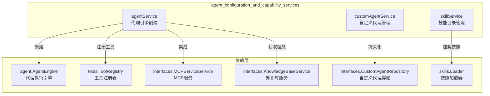

# agent_configuration_and_capability_services 模块深度解析

## 1. 模块概述

`agent_configuration_and_capability_services` 模块是系统中负责管理智能代理（Agent）配置、生命周期和能力扩展的核心服务层。它就像一个"代理的指挥中心"——不仅负责创建和配置代理实例，还管理代理的自定义配置、技能目录和能力集成。

想象一下，如果把智能代理比作一个多功能工具箱，那么这个模块就是工具箱的设计师和管理者：它决定工具箱里有哪些工具（技能）、工具如何组织（配置）、以及工具箱如何适应不同的工作场景（自定义代理）。

### 核心职责
- **代理引擎创建与配置**：组装完整的代理运行时环境，包括工具注册、技能加载、知识库集成等
- **自定义代理管理**：提供用户自定义代理的创建、更新、删除和查询功能
- **技能目录管理**：管理预加载技能的发现、加载和元数据查询
- **能力集成协调**：协调 MCP 服务、知识库、Web 搜索等外部能力与代理的集成

## 2. 架构设计

### 2.1 核心组件关系图



### 2.2 架构叙事

这个模块采用了清晰的职责分离设计，三个核心服务各自专注于不同的领域：

1. **agentService** 是模块的"组装工厂"，它负责将各种组件（工具、技能、知识库、MCP 服务）装配成一个可运行的代理引擎。它不关心代理配置从哪里来，只关心如何根据配置创建一个功能完整的代理。

2. **customAgentService** 是模块的"配置仓库管理员"，它专注于自定义代理的生命周期管理——创建、存储、检索、更新和删除。它知道如何处理内置代理和自定义代理的区别，如何处理代理共享，以及如何确保配置的完整性。

3. **skillService** 是模块的"技能图书管理员"，它管理着预加载技能的目录，知道技能在哪里，如何发现它们，以及如何加载它们的元数据。

这种设计的关键优势在于：每个服务都有明确的边界，依赖关系清晰，易于测试和扩展。

## 3. 核心组件深度解析

### 3.1 agentService - 代理引擎的组装工厂

`agentService` 是整个模块的核心，它的主要职责是根据配置创建一个完整的代理引擎。这就像组装一辆汽车：你需要引擎、轮子、刹车系统、电子设备等，而 `agentService` 就是那个装配线。

#### 核心方法：CreateAgentEngine

这是 `agentService` 最重要的方法，它的工作流程如下：

1. **配置验证**：首先验证代理配置的有效性，确保最大迭代次数在合理范围内
2. **工具注册表创建**：创建一个空的工具注册表
3. **基础工具注册**：根据配置注册各种工具（知识库搜索、Web 搜索、数据分析等）
4. **MCP 工具集成**：根据租户配置和代理设置，注册 MCP 服务提供的工具
5. **知识库信息收集**：获取配置的知识库详细信息，用于构建系统提示词
6. **选中文档处理**：处理用户通过 @ 提及的文档
7. **代理引擎创建**：组装所有组件，创建代理引擎
8. **技能管理器初始化**：如果启用了技能，初始化技能管理器

#### 关键设计决策

**工具注册的条件性过滤**：
- 当没有配置知识库时，自动过滤掉知识库相关工具
- 当没有知识库且没有启用 Web 搜索时，连 todo_write 工具也会被禁用
- 这种设计确保了代理只能使用与其配置匹配的工具，避免了无效的工具调用

**MCP 服务的三种模式**：
- `all`：使用租户所有启用的 MCP 服务（默认）
- `selected`：仅使用配置中指定的 MCP 服务
- `none`：完全禁用 MCP 服务
- 这种灵活性允许不同场景下的精细控制

**技能沙箱的环境配置**：
- 通过环境变量 `WEKNORA_SANDBOX_MODE` 控制沙箱模式（docker/local/disabled）
- 支持自定义 Docker 镜像和超时时间
- 这种设计使技能执行环境可以根据部署环境灵活调整

### 3.2 customAgentService - 自定义代理的管家

`customAgentService` 专注于自定义代理的生命周期管理，它处理代理的创建、检索、更新和删除，同时特别处理内置代理和自定义代理的区别。

#### 内置代理 vs 自定义代理

系统中有两种类型的代理：
- **内置代理**：系统预定义的代理，用户不能修改其基本信息（名称、描述、头像），但可以自定义其配置
- **自定义代理**：用户创建的代理，用户可以完全控制其所有属性

这种设计允许系统提供开箱即用的代理体验，同时允许用户根据需要自定义。

#### 核心方法解析

**GetAgentByID**：
- 首先检查是否是内置代理
- 如果是内置代理，先尝试从数据库获取自定义配置
- 如果数据库中没有，则返回默认的内置代理配置
- 这种"覆盖"模式允许用户自定义内置代理而不影响其他租户

**UpdateAgent**：
- 对内置代理和自定义代理采用不同的处理逻辑
- 内置代理只能更新配置，不能修改基本信息
- 自定义代理可以更新所有字段
- 这种分离确保了内置代理的核心标识不会被意外修改

**ListAgents**：
- 返回顺序：内置代理在前，自定义代理在后
- 内置代理使用数据库中的自定义配置（如果存在），否则使用默认配置
- 这种设计确保了用户始终能看到所有可用的代理

### 3.3 skillService - 技能目录的管理者

`skillService` 相对简单，它专注于预加载技能的管理。它的设计体现了"延迟初始化"的思想——只有在真正需要时才会初始化技能加载器。

#### 关键特性

**目录发现机制**：
- 首先检查环境变量 `WEKNORA_SKILLS_DIR`
- 然后尝试可执行文件相对路径
- 接着尝试当前工作目录
- 最后使用默认路径
- 这种多层 fallback 机制确保了在不同部署环境下都能找到技能目录

**线程安全的初始化**：
- 使用读写锁确保初始化过程的线程安全
- 一旦初始化完成，后续操作使用读锁提高性能
- 这种设计平衡了安全性和性能

## 4. 数据流动与关键操作

### 4.1 代理引擎创建流程

让我们追踪一个完整的代理引擎创建流程：

```
1. 上层调用 CreateAgentEngine
   ↓
2. ValidateConfig - 验证配置有效性
   ↓
3. NewToolRegistry - 创建工具注册表
   ↓
4. registerTools - 注册基础工具
   ├─ 根据配置过滤允许的工具
   ├─ 逐个创建并注册工具实例
   └─ 每个工具都注入其需要的依赖
   ↓
5. MCP 工具注册（如果启用）
   ├─ 从上下文中获取租户 ID
   ├─ 根据 MCP 选择模式获取服务列表
   └─ 通过 tools.RegisterMCPTools 注册
   ↓
6. getKnowledgeBaseInfos - 获取知识库信息
   ├─ 遍历配置的知识库 ID
   ├─ 获取知识库详细信息
   ├─ 获取文档数量和最近文档
   └─ 构建 KnowledgeBaseInfo 列表
   ↓
7. getSelectedDocumentInfos - 获取选中文档信息
   ├─ 获取知识元数据（包括共享知识库）
   └─ 构建 SelectedDocumentInfo 列表
   ↓
8. NewAgentEngine - 创建代理引擎
   ↓
9. initializeSkillsManager（如果启用技能）
   ├─ 配置沙箱环境
   ├─ 创建技能管理器
   ├─ 初始化（发现技能）
   └─ 注册技能相关工具
   ↓
10. 返回完整的代理引擎
```

### 4.2 自定义代理创建流程

```
1. 上层调用 CreateAgent
   ↓
2. 验证名称非空
   ↓
3. 生成 UUID（如果未提供）
   ↓
4. 从上下文获取租户 ID
   ↓
5. 设置创建和更新时间戳
   ↓
6. 确保代理模式已设置（默认为 QuickAnswer）
   ↓
7. 标记为非内置代理
   ↓
8. EnsureDefaults - 设置默认值
   ↓
9. repo.CreateAgent - 持久化到数据库
   ↓
10. 返回创建的代理
```

## 5. 设计决策与权衡

### 5.1 内置代理的"覆盖"设计

**决策**：内置代理的基本信息不能修改，但配置可以覆盖。

**权衡分析**：
- ✅ **优点**：
  - 确保系统核心代理的标识一致性
  - 允许用户根据需要调整内置代理的行为
  - 不同租户可以有不同的自定义配置
- ❌ **缺点**：
  - 增加了代码复杂性，需要区分"基本信息"和"配置"
  - 用户可能会困惑为什么有些字段不能修改

**替代方案**：
- 完全禁止修改内置代理：用户体验差，无法满足定制需求
- 允许完全修改内置代理：可能导致系统行为不可预测，租户间体验不一致

### 5.2 工具的条件性注册

**决策**：根据代理配置动态决定注册哪些工具。

**权衡分析**：
- ✅ **优点**：
  - 避免代理看到不相关的工具，减少困惑
  - 防止无效的工具调用（比如在没有知识库时调用知识库搜索）
  - 简化了简单场景下的代理体验
- ❌ **缺点**：
  - 增加了工具注册逻辑的复杂性
  - 可能导致配置相似的代理有不同的工具集，造成困惑

### 5.3 技能服务的延迟初始化

**决策**：技能服务在第一次使用时才初始化，而不是在创建时。

**权衡分析**：
- ✅ **优点**：
  - 减少启动时间，特别是在不需要技能的场景
  - 避免在技能目录不存在时的启动错误
  - 资源按需使用
- ❌ **缺点**：
  - 第一次使用时有额外的延迟
  - 问题可能在运行时才暴露，而不是启动时

## 6. 扩展点与定制化

### 6.1 工具注册扩展

`agentService` 的 `registerTools` 方法是一个重要的扩展点。要添加新工具，需要：

1. 在 `tools` 包中创建新的工具实现
2. 在 `registerTools` 方法中添加对应的 case
3. 确保工具的依赖通过 `agentService` 的字段注入

### 6.2 自定义代理的默认值

`customAgentService` 使用 `EnsureDefaults` 方法设置默认值。可以通过修改这个方法来调整新代理的默认行为。

### 6.3 技能目录的自定义

通过环境变量 `WEKNORA_SKILLS_DIR` 可以自定义技能目录的位置，这在不同的部署环境中非常有用。

## 7. 常见陷阱与注意事项

### 7.1 租户上下文的重要性

几乎所有的方法都依赖于从上下文中获取租户 ID。如果上下文缺少租户 ID，操作会失败。

**解决方案**：确保在调用这些服务之前，上下文中已经正确设置了租户 ID。

### 7.2 内置代理的特殊处理

内置代理有很多特殊的逻辑，容易出错：
- 不能修改基本信息
- 不能删除
- 查询时需要检查数据库和注册表两个地方

**建议**：在处理内置代理相关逻辑时，仔细阅读代码，确保理解所有特殊情况。

### 7.3 技能沙箱的配置

技能沙箱的配置完全依赖环境变量，如果配置不当，技能执行可能会失败或存在安全风险。

**建议**：
- 在生产环境中始终使用 Docker 沙箱模式
- 不要使用过于宽松的沙箱配置
- 定期更新沙箱镜像以修复安全漏洞

### 7.4 MCP 服务的可用性

MCP 工具的注册依赖于 `mcpServiceService` 和 `mcpManager`，如果这些依赖为 nil，MCP 工具会被跳过。

**注意**：这是一种优雅降级，但也可能导致 MCP 工具神秘地消失，需要检查日志来诊断。

## 8. 与其他模块的关系

### 8.1 依赖模块

- **agent_runtime_and_tools**：提供代理引擎、工具定义和技能管理的核心抽象
- **data_access_repositories**：提供自定义代理的持久化支持
- **core_domain_types_and_interfaces**：定义核心数据模型和服务接口
- **platform_infrastructure_and_runtime**：提供配置、事件总线等基础设施

### 8.2 被依赖模块

- **application_services_and_orchestration**：使用此模块创建代理引擎和管理代理配置
- **http_handlers_and_routing**：通过 HTTP API 暴露代理管理功能

## 9. 子模块指南

本模块包含以下子模块，详细信息请参考各自的文档：

- [agent_lifecycle_and_runtime_configuration_service](agent_configuration_and_capability_services-agent_lifecycle_and_runtime_configuration_service.md)：代理生命周期和运行时配置服务
- [custom_agent_profile_and_behavior_configuration_service](agent_configuration_and_capability_services-custom_agent_profile_and_behavior_configuration_service.md)：自定义代理配置服务
- [agent_skill_catalog_and_capability_management_service](agent_configuration_and_capability_services-agent_skill_catalog_and_capability_management_service.md)：代理技能目录和能力管理服务

## 10. 总结

`agent_configuration_and_capability_services` 模块是连接代理配置和代理运行时的桥梁。它的设计体现了几个重要的原则：

1. **职责分离**：三个核心服务各自专注于不同的领域
2. **灵活性与约束的平衡**：既提供了丰富的自定义选项，又有适当的约束防止错误
3. **优雅降级**：在依赖不可用时能够继续工作，只是功能受限
4. **租户隔离**：所有操作都考虑了租户上下文，确保数据安全

理解这个模块的关键是理解它如何将各种组件组装成一个完整的代理，以及它如何管理代理配置的生命周期。
