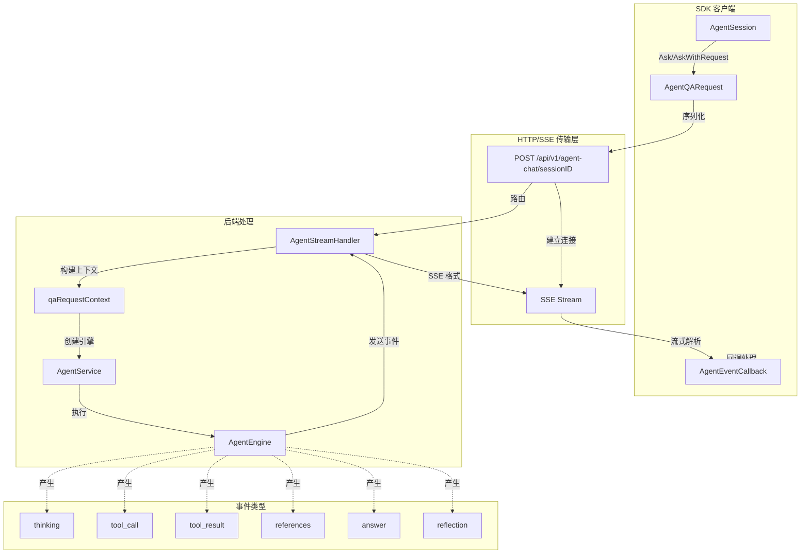

# Agent Conversation API

## 概述：为什么需要这个模块

想象你正在构建一个智能助手应用 —— 用户提出问题后，助手需要思考、检索知识库、调用工具、最终给出答案。这个过程不是一蹴而就的，而是**分阶段流式呈现**的：用户希望看到助手在"思考"、看到它"检索到了什么"、看到它"调用了哪个工具"，最后才看到完整答案。

`agent_conversation_api` 模块正是为了解决这个**实时流式对话**问题而存在的。它不是简单的 HTTP 请求 - 响应封装，而是一个**SSE（Server-Sent Events）流处理器**，负责：

1. **将复杂的 Agent 执行过程拆解为可观察的事件流** —— 思考、工具调用、工具结果、引用、答案、反思，每种事件类型都有明确语义
2. **在客户端提供统一的回调接口** —— 调用方只需关心"收到什么事件"，无需处理底层的 SSE 解析、连接管理、错误恢复
3. **抽象会话维度的对话状态** —— `AgentSession` 封装了会话 ID，让连续对话像"打电话"一样自然，无需每次重复会话上下文

如果采用 naive 的方案（比如轮询或长连接），你会面临：连接状态管理复杂、事件顺序难以保证、前端需要手动解析 SSE 格式、错误处理分散在各处。这个模块的设计洞察是：**将流式对话建模为事件驱动的状态机，通过回调函数将事件"推送"给调用方**，从而让上层业务逻辑保持简洁。

---

## 架构与数据流



### 架构角色解析

这个模块在整体架构中扮演 **SDK 层网关** 的角色：

| 层级 | 组件 | 职责 |
|------|------|------|
| **调用方** | 前端应用 / 业务服务 | 发起对话请求，处理事件回调 |
| **本模块** | `AgentSession`, `AgentQARequest`, `AgentStreamResponse` | 请求构建、SSE 解析、事件分发 |
| **后端** | `AgentStreamHandler`, `AgentEngine` | 会话管理、Agent 执行、事件生成 |
| **底层** | `EventBus`, `StreamManager` | 事件总线、流状态管理 |

### 数据流追踪：一次完整的 Agent 对话

让我们追踪一个典型请求的端到端流程：

1. **请求发起**：调用方创建 `AgentQARequest`，设置 `Query`、`KnowledgeBaseIDs`、`AgentEnabled` 等参数
2. **会话包装**：`AgentSession.AskWithRequest()` 将请求转发给 `Client.AgentQAStreamWithRequest()`
3. **HTTP 请求**：`Client` 构建 POST 请求到 `/api/v1/agent-chat/{sessionID}`，携带 JSON 负载
4. **后端路由**：`AgentStreamHandler` 接收请求，从 `qaRequestContext` 中提取会话、租户、Agent 配置
5. **引擎执行**：`AgentService.CreateAgentEngine()` 创建执行引擎，开始流式处理
6. **事件生成**：Agent 执行过程中，通过 `EventBus` 发出 `AgentThoughtData`、`AgentToolCallData` 等事件
7. **SSE 编码**：`AgentStreamHandler` 将事件转换为 `AgentStreamResponse`，以 `data: {...}\n\n` 格式写入响应流
8. **客户端解析**：`processAgentSSEStream()` 逐行读取，识别 `data:` 前缀，反序列化为 `AgentStreamResponse`
9. **回调触发**：每解析完一个事件，立即调用 `AgentEventCallback`，调用方可更新 UI 或记录日志
10. **流结束**：当 `Done=true` 的响应到达，或连接关闭，流处理完成

这个设计的关键在于**流式处理的反向压力（backpressure）由调用方控制** —— 如果回调函数返回 error，流处理会立即停止，这为调用方提供了细粒度的控制能力。

---

## 核心组件深度解析

### `AgentQARequest`：对话请求的完整契约

**设计意图**：这个结构体是客户端向后端表达"我想要什么"的完整声明。它不是简单的查询字符串，而是一个**能力开关面板** —— 每个字段都对应后端的一个功能模块。

```go
type AgentQARequest struct {
    Query            string          `json:"query"`                        // 必填：用户问题
    KnowledgeBaseIDs []string        `json:"knowledge_base_ids,omitempty"` // 可选：指定知识库范围
    KnowledgeIDs     []string        `json:"knowledge_ids,omitempty"`      // 可选：指定具体知识条目
    AgentEnabled     bool            `json:"agent_enabled"`                // 开关：是否启用 Agent 模式
    AgentID          string          `json:"agent_id,omitempty"`           // 可选：自定义 Agent 配置
    WebSearchEnabled bool            `json:"web_search_enabled"`           // 开关：是否启用联网搜索
    SummaryModelID   string          `json:"summary_model_id,omitempty"`   // 可选：覆盖摘要模型
    MentionedItems   []MentionedItem `json:"mentioned_items,omitempty"`    // 可选：@提及的资源
    DisableTitle     bool            `json:"disable_title,omitempty"`      // 开关：禁用自动标题生成
    MCPServiceIDs    []string        `json:"mcp_service_ids,omitempty"`    // 已弃用：MCP 服务白名单
}
```

**关键字段解析**：

- **`AgentEnabled`**：这是整个请求的"模式开关"。当为 `false` 时，后端会走普通聊天流程（直接调用 LLM）；当为 `true` 时，会进入 Agent 引擎，触发规划、工具调用、反思等复杂行为。这个设计让**同一套 API 可以兼容简单聊天和复杂 Agent 两种场景**。

- **`MentionedItems`**：这是用户显式指定上下文的方式。想象用户在聊天中输入"@产品文档 这个功能怎么用"，`MentionedItem` 就是解析后的结构化表示。`Type` 字段区分 `"kb"`（知识库）和 `"file"`（文件），`KBType` 进一步区分 `"document"` 或 `"faq"`。这种分层设计让后端可以**精确控制检索范围**，而不是盲目搜索全部知识库。

- **`KnowledgeBaseIDs` vs `KnowledgeIDs`**：前者是"在这个知识库里找"，后者是"直接用这几条知识"。这是**检索粒度**的区分 —— 前者触发语义搜索，后者是直接注入上下文。理解这个差异对于调试检索效果至关重要。

**使用陷阱**：
- `Query` 为空会导致请求被拒绝（在 `AgentQAStreamWithRequest` 中有显式校验）
- `MCPServiceIDs` 已弃用，新代码应使用 `AgentID` 中配置的 MCP 服务
- `AgentEnabled=true` 但 `AgentID` 为空时，后端会使用租户默认 Agent 配置

---

### `AgentStreamResponse`：流式事件的数据载体

**设计意图**：这个结构体是后端向前端推送的**最小事件单元**。它不是完整的对话历史，而是"此刻发生了什么"的快照。理解它的关键是认识到：**每个响应都是状态机的一个转移**。

```go
type AgentStreamResponse struct {
    ID                  string                 `json:"id"`                   // 事件 ID（通常与消息 ID 一致）
    ResponseType        AgentResponseType      `json:"response_type"`        // 事件类型
    Content             string                 `json:"content,omitempty"`    // 当前内容片段
    Done                bool                   `json:"done"`                 // 是否结束
    KnowledgeReferences []*SearchResult        `json:"knowledge_references"` // 知识引用
    Data                map[string]interface{} `json:"data,omitempty"`       // 扩展数据
}
```

**事件类型枚举**（`AgentResponseType`）：

| 类型 | 含义 | 典型 `Content` | 典型 `Data` |
|------|------|---------------|-------------|
| `thinking` | Agent 正在思考/规划 | "让我先分析一下这个问题..." | `{"step": "planning"}` |
| `tool_call` | 准备调用工具 | "调用知识搜索工具" | `{"tool_name": "knowledge_search", "input": {...}}` |
| `tool_result` | 工具执行完成 | "找到 3 条相关知识" | `{"results": [...]}` |
| `references` | 检索到的引用 | 空 | `{"references": [...]}` |
| `answer` | 最终答案（流式） | "根据检索结果..."（片段） | 空 |
| `reflection` | 反思/修正 | "等等，我可能需要..." | `{"reason": "..."}` |
| `error` | 执行错误 | "工具调用失败" | `{"error": "..."}` |

**设计权衡**：

1. **`Content` 是字符串而非结构化数据**：这看似限制了表达能力，但实际上是为了**流式拼接的便利性**。`answer` 类型的内容会分多次推送，每次 `Content` 是答案的一个片段，前端直接拼接即可得到完整文本。如果需要结构化数据（如工具参数），放在 `Data` 字段中。

2. **`Done` 字段的存在**：这是**流结束的信号**。调用方应该在这个事件到达后清理资源、更新 UI 状态。注意：`Done=true` 的事件可能同时携带 `Content`（最后一段答案），处理时不要忽略。

3. **`Data` 是 `map[string]interface{}`**：这是**扩展性设计**。不同事件类型可以携带不同的元数据，而无需修改结构体定义。代价是调用方需要自己断言类型，容易出错。建议配合 `ResponseType` 使用类型安全的辅助函数。

---

### `AgentEventCallback`：事件驱动的回调接口

**设计意图**：这是整个模块的**扩展点**。通过回调函数，调用方可以决定"收到事件后做什么"，而模块本身只负责"何时调用回调"。这是典型的**控制反转（IoC）**模式。

```go
type AgentEventCallback func(*AgentStreamResponse) error
```

**回调的生命周期**：

```
SSE 流开始
    ↓
[循环] 读取一行 → 解析事件 → 调用 callback(event)
    ↓                              ↓
    ←───── 如果返回 error ────────←
    ↓
callback 返回 nil → 继续下一事件
    ↓
流结束或连接关闭
```

**关键行为**：
- 回调返回 `nil`：继续处理下一个事件
- 回调返回 `error`：**立即停止流处理**，error 会向上传递给 `AgentQAStreamWithRequest` 的调用方

这个设计让调用方可以实现**条件中断**逻辑。例如：
```go
callback := func(event *AgentStreamResponse) error {
    if event.ResponseType == "error" {
        return fmt.Errorf("agent error: %s", event.Content)
    }
    if event.Done {
        log.Println("对话完成")
    }
    return nil
}
```

**潜在陷阱**：
- 回调函数中**不应执行耗时操作**（如网络请求、数据库写入），因为这会阻塞 SSE 流的读取，可能导致后端超时
- 回调中抛出的 panic **不会被捕获**，会导致整个流处理崩溃
- 如果需要异步处理事件，应该在回调中启动 goroutine，而不是直接执行

---

### `AgentSession`：会话维度的对话封装

**设计意图**：这个结构体是一个**门面（Facade）模式**的实现。它将"会话 ID"这个状态封装起来，让调用方无需在每次请求时重复传递。想象它像一个"电话听筒" —— 拿起听筒（创建 `AgentSession`）后，你只需要说话（调用 `Ask`），无需每次拨号（传递 sessionID）。

```go
type AgentSession struct {
    client    *Client
    sessionID string
}

func (as *AgentSession) Ask(ctx context.Context, query string, callback AgentEventCallback) error
func (as *AgentSession) AskWithRequest(ctx context.Context, request *AgentQARequest, callback AgentEventCallback) error
func (as *AgentSession) GetSessionID() string
```

**两种询问方式**：

1. **`Ask()`**：快捷方法，使用默认配置（`AgentEnabled=true`）。适用于简单场景，用户只关心问题本身。
2. **`AskWithRequest()`**：完整方法，允许自定义 `AgentQARequest` 的所有字段。适用于需要精细控制的场景，如指定知识库、启用联网搜索等。

**设计权衡**：
- **优点**：简化了连续对话的代码，会话状态集中管理
- **缺点**：`AgentSession` 本身**不是线程安全的**，多个 goroutine 共享同一个实例可能导致竞态条件
- **建议**：每个对话线程创建独立的 `AgentSession` 实例，或在外部加锁保护

---

### `processAgentSSEStream`：SSE 协议的解析引擎

**设计意图**：这个私有方法实现了**SSE 协议的状态机解析**。它不是简单地按行分割，而是理解 SSE 的事件边界（空行分隔）和前缀格式（`data:`、`event:`）。

```go
func (c *Client) processAgentSSEStream(reader io.Reader, callback AgentEventCallback) error {
    scanner := bufio.NewScanner(reader)
    var dataBuffer string

    for scanner.Scan() {
        line := scanner.Text()

        // 空行表示事件结束
        if line == "" {
            if dataBuffer != "" {
                var streamResponse AgentStreamResponse
                if err := json.Unmarshal([]byte(dataBuffer), &streamResponse); err != nil {
                    return fmt.Errorf("failed to parse SSE data: %w", err)
                }
                if err := callback(&streamResponse); err != nil {
                    return err
                }
                dataBuffer = ""
            }
            continue
        }

        // 处理 data: 前缀
        if strings.HasPrefix(line, "data:") {
            dataBuffer = strings.TrimSpace(line[5:])
        }
        // event: 前缀目前被忽略（保留用于未来扩展）
    }
    // ...
}
```

**解析逻辑**：

1. **逐行扫描**：使用 `bufio.Scanner` 按行读取，这是处理流式数据的标准方式
2. **事件边界检测**：空行（`line == ""`）标志一个完整事件的结束，此时 `dataBuffer` 中累积了完整的 JSON 数据
3. **前缀剥离**：`data:` 前缀后的内容才是有效负载，`event:` 前缀目前被忽略（但保留解析逻辑，为未来扩展留空间）
4. **JSON 反序列化**：将累积的 JSON 字符串解析为 `AgentStreamResponse`
5. **回调触发**：解析成功后立即调用 callback，实现"收到即处理"的流式体验

**设计洞察**：
- 使用 `dataBuffer` 累积数据而非直接解析每一行，是因为**单个事件的 JSON 可能跨多行**（虽然当前实现中每个事件是单行 JSON，但这种设计更健壮）
- `event:` 前缀被解析但未被使用，这是**预留扩展点** —— 如果未来需要区分不同类型的事件（如 `event: thinking`、`event: answer`），可以直接利用这个字段，而无需修改协议

**边界情况处理**：
- 如果 SSE 流在事件中间断开（没有空行结束），最后一个事件会被**丢弃**（`dataBuffer` 不为空但未触发回调）
- 如果 JSON 解析失败，会返回 error，调用方可以决定重试或报错
- 网络错误（`scanner.Err()`）会被包装后返回，调用方可以检查是否是超时或连接重置

---

## 依赖关系分析

### 本模块调用的组件

| 依赖 | 调用方式 | 原因 |
|------|---------|------|
| `client.Client` | `c.doRequest()`, `c.processAgentSSEStream()` | HTTP 请求执行和 SSE 流处理的基础设施 |
| `context.Context` | 所有公开方法的第一个参数 | 支持请求取消和超时控制 |
| `encoding/json` | `json.Unmarshal()` | SSE 事件数据反序列化 |
| `bufio.Scanner` | 逐行读取 SSE 流 | 高效的流式文本解析 |

### 调用本模块的组件

| 调用方 | 使用场景 | 期望行为 |
|--------|---------|---------|
| **前端应用**（通过 SDK） | 用户对话界面 | 实时显示 Agent 思考过程，更新消息列表 |
| **业务服务** | 自动化问答流程 | 捕获 `answer` 事件，存储到数据库 |
| **测试代码** | 集成测试 | 验证 Agent 行为，断言事件顺序 |

### 后端对应组件（数据契约）

本模块的请求/响应结构与后端组件严格对应：

| 客户端组件 | 后端对应 | 数据流向 |
|-----------|---------|---------|
| `AgentQARequest` | `qaRequestContext` | 请求负载 → 上下文提取 |
| `AgentStreamResponse` | `AgentStreamHandler` 发送的事件 | 事件生成 → SSE 编码 → 客户端解析 |
| `AgentEventCallback` | `EventBus` 订阅者 | 后端事件 → 前端回调 |

**契约约束**：
- `AgentQARequest.Query` 必须非空，否则后端会返回 400 错误
- `AgentStreamResponse.ResponseType` 必须是预定义的 7 种类型之一，否则前端可能无法正确渲染
- `SessionID` 必须是已存在的会话，否则 `AgentStreamHandler` 会返回 404

---

## 设计决策与权衡

### 1. 为什么选择 SSE 而非 WebSocket？

**选择**：SSE（Server-Sent Events）

**权衡分析**：

| 维度 | SSE | WebSocket |
|------|-----|-----------|
| **协议复杂度** | 基于 HTTP，简单 | 独立协议，需要握手 |
| **双向通信** | 单向（服务器→客户端） | 双向 |
| **重连机制** | 浏览器自动支持 | 需要手动实现 |
| **防火墙穿透** | 容易（标准 HTTP 端口） | 可能被拦截 |
| **SDK 实现复杂度** | 低（逐行解析） | 高（消息帧处理） |

**决策理由**：Agent 对话场景是**典型的单向流** —— 客户端发送一个请求，然后被动接收事件流。不需要客户端在流中发送额外消息（所有参数在请求时已确定）。SSE 的简单性和自动重连特性更适合这个场景。

**代价**：如果未来需要"在流中取消某个工具调用"或"动态调整 Agent 行为"，SSE 无法支持，需要升级到 WebSocket 或额外的控制通道。

---

### 2. 为什么使用回调而非 Channel？

**选择**：回调函数（`AgentEventCallback`）

**权衡分析**：

| 维度 | 回调 | Channel |
|------|------|---------|
| **调用方控制力** | 高（可决定何时返回 error） | 中（需要 select 监听） |
| **背压处理** | 隐式（回调阻塞会减慢流） | 显式（channel 缓冲区） |
| **错误传播** | 直接返回 error | 需要额外的 error channel |
| **代码可读性** | 直观（事件→处理） | 需要理解 channel 语义 |
| **并发安全** | 调用方负责 | 需要额外同步 |

**决策理由**：回调模式更符合**事件驱动**的直觉，调用方可以立即处理事件并决定是否继续。Channel 模式虽然更符合 Go 的并发哲学，但会增加 API 的使用复杂度（需要管理 channel 生命周期、处理关闭信号等）。

**代价**：回调中执行耗时操作会阻塞流处理，调用方需要自己管理异步逻辑。

---

### 3. 为什么 `AgentSession` 不实现 `io.Closer`？

**观察**：`AgentSession` 没有 `Close()` 方法，资源清理依赖 `context.Context` 的取消。

**设计理由**：
- `AgentSession` 本身**不持有长期资源**（如连接、文件句柄），它只是 `Client` 的轻量级包装
- 每次 `Ask()` 调用都会创建新的 HTTP 请求，请求结束时资源自动释放
- 使用 `context.Context` 统一控制生命周期，调用方可以通过 `context.WithTimeout()` 或 `context.WithCancel()` 主动终止

**潜在问题**：如果调用方忘记取消 context，且后端流一直不结束（如卡住），客户端会**无限期等待**。建议始终使用带超时的 context：
```go
ctx, cancel := context.WithTimeout(context.Background(), 5*time.Minute)
defer cancel()
```

---

### 4. 为什么 `MCPServiceIDs` 被标记为弃用？

**观察**：`AgentQARequest.MCPServiceIDs` 有 `// deprecated` 注释。

**演进原因**：
- 早期设计：MCP 服务在请求时动态指定，灵活性高但配置分散
- 当前设计：MCP 服务在 `AgentConfig` 中预配置，通过 `AgentID` 选择，配置集中管理

**迁移路径**：
```go
// 旧方式（弃用）
req := &AgentQARequest{
    Query:         "问题",
    MCPServiceIDs: []string{"mcp-1", "mcp-2"},
}

// 新方式
req := &AgentQARequest{
    Query:   "问题",
    AgentID: "agent-with-mcp-config", // Agent 配置中已包含 MCP 服务
}
```

---

## 使用指南与示例

### 基础用法：简单对话

```go
// 创建客户端
client := client.NewClient("https://api.example.com", "your-token")

// 创建会话（假设已存在）
session := client.NewAgentSession("session-123")

// 定义回调处理事件
callback := func(event *client.AgentStreamResponse) error {
    switch event.ResponseType {
    case client.AgentResponseTypeThinking:
        fmt.Printf("🤔 思考中：%s\n", event.Content)
    case client.AgentResponseTypeAnswer:
        fmt.Printf("💬 回答：%s\n", event.Content)
    case client.AgentResponseTypeDone:
        fmt.Println("✅ 对话完成")
    }
    return nil
}

// 发起对话
ctx := context.Background()
err := session.Ask(ctx, "如何使用这个产品？", callback)
if err != nil {
    log.Fatalf("对话失败：%v", err)
}
```

### 高级用法：自定义请求配置

```go
req := &client.AgentQARequest{
    Query:            "最新的产品文档是什么？",
    KnowledgeBaseIDs: []string{"kb-456"},
    AgentEnabled:     true,
    WebSearchEnabled: true,
    MentionedItems: []client.MentionedItem{
        {ID: "file-789", Name: "产品手册.pdf", Type: "file"},
    },
}

callback := func(event *client.AgentStreamResponse) error {
    if event.ResponseType == client.AgentResponseTypeReferences {
        for _, ref := range event.KnowledgeReferences {
            fmt.Printf("📚 引用：%s (得分：%.2f)\n", ref.Title, ref.Score)
        }
    }
    return nil
}

err := session.AskWithRequest(ctx, req, callback)
```

### 错误处理与超时

```go
ctx, cancel := context.WithTimeout(context.Background(), 2*time.Minute)
defer cancel()

callback := func(event *client.AgentStreamResponse) error {
    if event.ResponseType == client.AgentResponseTypeError {
        return fmt.Errorf("agent 错误：%s", event.Content)
    }
    return nil
}

err := session.Ask(ctx, "问题", callback)
if err != nil {
    if errors.Is(err, context.DeadlineExceeded) {
        log.Println("请求超时")
    } else {
        log.Printf("对话失败：%v", err)
    }
}
```

### 流式中断

```go
var answerBuffer strings.Builder
maxAnswerLength := 1000

callback := func(event *client.AgentStreamResponse) error {
    if event.ResponseType == client.AgentResponseTypeAnswer {
        answerBuffer.WriteString(event.Content)
        if answerBuffer.Len() > maxAnswerLength {
            // 答案太长，主动中断
            return fmt.Errorf("答案超过长度限制")
        }
    }
    return nil
}

err := session.Ask(ctx, "问题", callback)
if err != nil && strings.Contains(err.Error(), "长度限制") {
    log.Println("主动中断流")
}
```

---

## 边界情况与陷阱

### 1. 空查询校验

`AgentQAStreamWithRequest` 会显式校验 `Query` 非空：
```go
if strings.TrimSpace(request.Query) == "" {
    return fmt.Errorf("agent QA query cannot be empty")
}
```
**陷阱**：如果 `Query` 只包含空格，也会被拒绝。调用方应在构建请求前 trim 用户输入。

---

### 2. SSE 流不完整事件

如果网络在事件中间断开（没有空行结束），最后一个事件会被丢弃：
```go
// processAgentSSEStream 中
if err := scanner.Err(); err != nil {
    return fmt.Errorf("failed to read SSE stream: %w", err)
}
// dataBuffer 中可能还有未处理的数据，但不会被回调
```
**影响**：如果 `Done=true` 的事件丢失，调用方可能不知道对话已完成。

**缓解**：在回调中记录收到的事件数量，如果流意外结束且没有 `Done` 事件，视为异常。

---

### 3. 回调中的 panic

回调中的 panic **不会被捕获**：
```go
callback := func(event *client.AgentStreamResponse) error {
    panic("oops") // 这会导致整个流处理崩溃
}
```
**建议**：在回调内部使用 `defer recover()` 保护关键逻辑：
```go
callback := func(event *client.AgentStreamResponse) error {
    defer func() {
        if r := recover(); r != nil {
            log.Printf("回调 panic: %v", r)
        }
    }()
    // 处理逻辑
}
```

---

### 4. 会话 ID 有效性

`AgentSession` 不验证 `sessionID` 是否有效，错误会在第一次 `Ask()` 调用时由后端返回（404 或 403）。

**建议**：在创建 `AgentSession` 前，确保会话已通过 [`session_lifecycle_api`](session_lifecycle_api.md) 创建。

---

### 5. 并发安全

`AgentSession` **不是线程安全的**：
```go
session := client.NewAgentSession("session-123")
go session.Ask(ctx, "问题 1", callback1) // 竞态条件
go session.Ask(ctx, "问题 2", callback2) // 竞态条件
```
**原因**：虽然 `AgentSession` 本身只有只读字段，但多个并发请求共享同一个 `Client` 实例，底层 HTTP 客户端可能有状态。

**建议**：每个并发对话创建独立的 `AgentSession` 实例。

---

## 相关模块参考

- **[session_lifecycle_api](session_lifecycle_api.md)**：会话的创建、标题生成、停止等生命周期管理
- **[session_streaming_and_llm_calls_api](session_streaming_and_llm_calls_api.md)**：底层流式响应和 LLM 工具调用契约
- **[message_trace_and_tool_events_api](message_trace_and_tool_events_api.md)**：消息历史和工具事件的持久化模型
- **[agent_runtime_and_tools](agent_runtime_and_tools.md)**：后端 Agent 引擎和工具执行逻辑

---

## 总结

`agent_conversation_api` 模块的核心价值在于**将复杂的 Agent 流式对话抽象为简单的事件回调**。它的设计哲学是：

1. **流式优先**：所有响应都是流式的，调用方可以实时处理每个事件
2. **事件驱动**：通过回调函数将控制权交给调用方，实现灵活的定制
3. **会话封装**：`AgentSession` 隐藏会话 ID 管理，简化连续对话代码
4. **协议透明**：SSE 解析细节被封装，调用方只需关心业务事件

理解这个模块的关键是认识到：**它不是简单的 HTTP 客户端包装，而是一个事件流处理器**。每次 `Ask()` 调用都是一次"订阅事件流"的操作，回调函数是"事件处理器"，`AgentStreamResponse` 是"事件消息"。掌握这个心智模型，就能自然地理解模块的所有设计决策。
