# Agent Engine Orchestration 模块深度解析

## 一、模块定位：为什么需要这个模块？

想象你正在设计一个能够"思考 - 行动 - 观察"循环的智能助手。用户问了一个复杂问题，比如"帮我分析上个季度的销售数据，找出表现最好的产品，并生成一份报告"。这个问题无法通过单次 LLM 调用解决——它需要：

1. **查询数据库**获取销售数据
2. **分析数据**找出最佳产品
3. **可能再次查询**获取产品详情
4. **综合信息**生成最终报告

这就是 **ReAct（Reasoning + Acting）范式**要解决的问题。`agent_engine_orchestration` 模块的核心使命就是**实现并编排这个循环**。

### 朴素方案为什么不够？

一个 naive 的实现可能是：
```go
// 伪代码：朴素方案
for i := 0; i < maxIterations; i++ {
    response := llm.Call(messages, tools)
    if response.HasToolCalls() {
        result := executeTool(response.ToolCalls)
        messages = append(messages, result)
    } else {
        return response.Content
    }
}
```

这个方案有几个致命问题：

1. **无法流式输出**：用户必须等待整个循环结束才能看到任何内容，体验极差
2. **缺乏可观测性**：中间思考过程、工具调用详情对调用方完全黑盒
3. **状态管理混乱**：多轮对话的上下文如何持久化？如何压缩？
4. **扩展性差**：如何支持技能（Skills）的动态加载？如何支持工具执行后的反思（Reflection）？

### 本模块的设计洞察

`AgentEngine` 的设计围绕三个核心洞察：

1. **事件驱动架构**：将 ReAct 循环的每个阶段（思考、工具调用、工具结果、最终答案）都转化为事件，通过 `EventBus` 发布。这样前端可以实时渲染思考过程，后端可以灵活订阅和处理。

2. **状态显式化**：`AgentState` 显式记录每一轮的思考、工具调用、知识引用。这不仅是调试的需要，更是为了支持"中断 - 恢复"、"多会话共享上下文"等高级场景。

3. **上下文管理解耦**：LLM 的上下文窗口是有限的，但对话历史可能很长。模块通过 `ContextManager` 接口将上下文压缩、持久化的责任外包，自身只负责"写消息"。

---

## 二、架构全景

```mermaid
flowchart TB
    subgraph Client["调用方 (Handler/API Layer)"]
        A[AgentStreamHandler]
    end

    subgraph Engine["Agent Engine 核心"]
        B[AgentEngine]
        B1[Execute 入口]
        B2[executeLoop 主循环]
        B3[streamThinkingToEventBus]
        B4[streamFinalAnswerToEventBus]
        B5[appendToolResults]
    end

    subgraph Tools["工具层"]
        C[ToolRegistry]
        C1[ExecuteTool]
        C2[GetFunctionDefinitions]
        D[BaseTool 实现]
        D1[KnowledgeSearchTool]
        D2[WebSearchTool]
        D3[DatabaseQueryTool]
    end

    subgraph Events["事件系统"]
        E[EventBus]
        E1[EventAgentThought]
        E2[EventAgentToolCall]
        E3[EventAgentToolResult]
        E4[EventAgentFinalAnswer]
        E5[EventAgentComplete]
    end

    subgraph Context["上下文管理"]
        F[ContextManager]
        F1[AddMessage]
        F2[GetContext]
        F3[CompressionStrategy]
    end

    subgraph LLM["LLM 后端"]
        G[chat.Chat 接口]
        G1[ChatStream]
        G2[OpenAIProvider]
        G3[QwenProvider]
    end

    subgraph Skills["技能系统 (可选)"]
        H[skills.Manager]
        H1[GetAllMetadata]
        H2[Progressive Disclosure]
    end

    A -->|Execute| B1
    B1 --> B2
    B2 -->|Think| B3
    B2 -->|Act| C1
    B2 -->|Observe| B5
    B2 -->|Finalize| B4
    
    B3 -->|streamLLMToEventBus| G1
    B4 -->|streamLLMToEventBus| G1
    
    C --> D
    C1 --> D
    
    B3 -->|emit| E
    B4 -->|emit| E
    C1 -->|emit| E
    
    B5 -->|AddMessage| F1
    B3 -->|AddMessage| F1
    
    B -->|optional| H
    H -->|SkillsMetadata| B3

    style B fill:#e1f5fe
    style B2 fill:#b3e5fc
    style E fill:#fff3e0
    style F fill:#f3e5f5
```



### 数据流 walkthrough：一次完整的 Agent 执行

让我们追踪一个用户查询 `"查询知识库中关于 API 限流的内容"` 的完整数据流：

```
┌─────────────────────────────────────────────────────────────────────────┐
│ 1. 调用方 (Handler) 调用 AgentEngine.Execute()                            │
│    输入：sessionID, messageID, query, llmContext (历史消息)              │
└─────────────────────────────────────────────────────────────────────────┘
                                    │
                                    ▼
┌─────────────────────────────────────────────────────────────────────────┐
│ 2. 初始化 AgentState                                                     │
│    - CurrentRound = 0                                                   │
│    - RoundSteps = []                                                    │
│    - IsComplete = false                                                 │
└─────────────────────────────────────────────────────────────────────────┘
                                    │
                                    ▼
┌─────────────────────────────────────────────────────────────────────────┐
│ 3. 构建 System Prompt                                                    │
│    - 注入 KnowledgeBaseInfo (知识库元数据)                               │
│    - 注入 SelectedDocumentInfo (@提及的文档)                             │
│    - 如果启用 Skills：注入 SkillsMetadata (Level 1 Progressive Disclosure)│
└─────────────────────────────────────────────────────────────────────────┘
                                    │
                                    ▼
┌─────────────────────────────────────────────────────────────────────────┐
│ 4. 构建 LLM Messages                                                     │
│    [system] System Prompt                                               │
│    [user]   历史消息 1                                                   │
│    [assistant] 历史消息 2                                                │
│    ...                                                                  │
│    [user]   当前查询："查询知识库中关于 API 限流的内容"                      │
└─────────────────────────────────────────────────────────────────────────┘
                                    │
                                    ▼
┌─────────────────────────────────────────────────────────────────────────┐
│ 5. 构建 Tool Definitions                                                │
│    从 ToolRegistry 获取所有可用工具的 FunctionDefinition                  │
│    例如：[knowledge_search, web_search, database_query, ...]           │
└─────────────────────────────────────────────────────────────────────────┘
                                    │
                                    ▼
┌─────────────────────────────────────────────────────────────────────────┐
│ 6. executeLoop 开始 (ReAct 循环)                                         │
│                                                                         │
│    ┌───────────────────────────────────────────────────────────────┐   │
│    │ Round 1: Think 阶段                                            │   │
│    │ streamThinkingToEventBus() 调用 LLM ChatStream                 │   │
│    │                                                                │   │
│    │ LLM 返回：                                                      │   │
│    │   Content: "我需要先搜索知识库..."                              │   │
│    │   ToolCalls: [{ID: "call_123", Name: "knowledge_search", ...}] │   │
│    │                                                                │   │
│    │ 流式发射事件：                                                  │   │
│    │   EventAgentThought (Content 分块)                              │   │
│    │   EventAgentToolCall (ToolCall 预通知)                          │   │
│    └───────────────────────────────────────────────────────────────┘   │
│                                    │                                    │
│                                    ▼                                    │
│    ┌───────────────────────────────────────────────────────────────┐   │
│    │ Round 1: Act 阶段                                              │   │
│    │ ToolRegistry.ExecuteTool("knowledge_search", args)            │   │
│    │                                                                │   │
│    │ 发射事件：                                                      │   │
│    │   EventAgentToolResult (Output, Success, Duration)            │   │
│    │   EventAgentTool (内部监控)                                    │   │
│    │                                                                │   │
│    │ 如果启用 Reflection：                                           │   │
│    │   streamReflectionToEventBus() → EventAgentReflection         │   │
│    └───────────────────────────────────────────────────────────────┘   │
│                                    │                                    │
│                                    ▼                                    │
│    ┌───────────────────────────────────────────────────────────────┐   │
│    │ Round 1: Observe 阶段                                          │   │
│    │ appendToolResults() 将工具结果添加到 messages：                 │   │
│    │   [assistant] Thought + ToolCalls                             │   │
│    │   [tool] Tool Result (role="tool", tool_call_id="call_123")   │   │
│    │                                                                │   │
│    │ 同时写入 ContextManager：                                       │   │
│    │   contextManager.AddMessage(sessionID, assistantMsg)          │   │
│    │   contextManager.AddMessage(sessionID, toolMsg)               │   │
│    └───────────────────────────────────────────────────────────────┘   │
│                                    │                                    │
│                                    ▼                                    │
│    ┌───────────────────────────────────────────────────────────────┐   │
│    │ Round 2: 继续循环...                                           │   │
│    │ (如果 LLM 返回 finish_reason="stop" 且无 ToolCalls，则退出)      │   │
│    └───────────────────────────────────────────────────────────────┘   │
└─────────────────────────────────────────────────────────────────────────┘
                                    │
                                    ▼
┌─────────────────────────────────────────────────────────────────────────┐
│ 7. 如果达到 MaxIterations 仍未完成：                                     │
│    streamFinalAnswerToEventBus() 合成最终答案                           │
│    将所有工具结果作为上下文，让 LLM 生成综合回答                          │
└─────────────────────────────────────────────────────────────────────────┘
                                    │
                                    ▼
┌─────────────────────────────────────────────────────────────────────────┐
│ 8. 发射完成事件                                                         │
│    EventAgentComplete (FinalAnswer, KnowledgeRefs, AgentSteps)         │
└─────────────────────────────────────────────────────────────────────────┘
                                    │
                                    ▼
┌─────────────────────────────────────────────────────────────────────────┐
│ 9. 返回 AgentState 给调用方                                              │
└─────────────────────────────────────────────────────────────────────────┘
```

---

## 三、核心组件深度解析

### 3.1 `AgentEngine` 结构体

```go
type AgentEngine struct {
    config               *types.AgentConfig
    toolRegistry         *tools.ToolRegistry
    chatModel            chat.Chat
    eventBus             *event.EventBus
    knowledgeBasesInfo   []*KnowledgeBaseInfo
    selectedDocs         []*SelectedDocumentInfo
    contextManager       interfaces.ContextManager
    sessionID            string
    systemPromptTemplate string
    skillsManager        *skills.Manager
}
```

**设计意图分析**：

| 字段 | 职责 | 为什么这样设计？ |
|------|------|-----------------|
| `config` | 控制 Agent 行为（MaxIterations, Temperature, ReflectionEnabled 等） | 将可变配置与引擎逻辑分离，支持运行时调整 |
| `toolRegistry` | 工具注册与执行 | 集中管理所有工具，支持动态注册和清理 |
| `chatModel` | LLM 后端抽象 | 解耦具体 LLM 提供商（OpenAI/Qwen/DeepSeek 等） |
| `eventBus` | 事件发布 | 实现观察者模式，调用方可以订阅任意事件类型 |
| `knowledgeBasesInfo` / `selectedDocs` | 上下文注入 | 支持 RAG 和@提及功能，在 System Prompt 中注入 |
| `contextManager` | 上下文持久化 | 将"写历史"的责任外包，引擎只负责生成消息 |
| `skillsManager` | 技能管理（可选） | 支持 Progressive Disclosure 模式，动态暴露技能 |

**关键设计决策**：

1. **依赖注入而非内部创建**：所有依赖（`toolRegistry`, `chatModel`, `eventBus`）都通过构造函数注入。这使得单元测试可以轻松替换为 mock 实现。

2. **可选的 Skills 支持**：`skillsManager` 是可选的，通过 `NewAgentEngineWithSkills` 构造函数创建。这体现了**渐进式增强**的设计思想——基础功能不依赖技能系统，但需要时可以无缝集成。

3. **SessionID 作为实例字段**：`sessionID` 在引擎创建时确定，贯穿整个执行过程。这确保了所有事件都能正确关联到会话，避免了在方法调用链中传递 sessionID 的繁琐。

---

### 3.2 `Execute()` 方法：入口与生命周期管理

```go
func (e *AgentEngine) Execute(
    ctx context.Context,
    sessionID, messageID, query string,
    llmContext []chat.Message,
) (*types.AgentState, error)
```

**核心职责**：

1. **日志与可观测性**：记录执行开始、查询内容、上下文长度等关键信息
2. **状态初始化**：创建 `AgentState` 作为执行状态的容器
3. **System Prompt 构建**：根据是否启用 Skills 选择不同的构建策略
4. **消息组装**：将 System Prompt、历史消息、当前查询组合成 LLM 输入
5. **工具准备**：从 `ToolRegistry` 获取工具定义
6. **执行循环**：调用 `executeLoop` 运行 ReAct 循环
7. **错误处理**：捕获异常并发射 `EventError` 事件
8. **资源清理**：通过 `defer e.toolRegistry.Cleanup(ctx)` 确保工具资源释放

**为什么返回 `*AgentState` 而不是直接返回答案？**

这是一个重要的设计选择。返回完整的 `AgentState` 而非简单的 `FinalAnswer` 字符串，有以下好处：

- **可追溯性**：调用方可以访问完整的执行轨迹（`RoundSteps`），用于调试、审计或向用户展示思考过程
- **知识引用**：`KnowledgeRefs` 字段包含所有引用的知识片段，支持答案的溯源
- **状态持久化**：可以将 `AgentState` 序列化存储，支持后续的分析或恢复

---

### 3.3 `executeLoop()`：ReAct 循环的核心实现

这是整个模块最复杂也最关键的方法。让我们分解它的逻辑：

#### 循环结构

```go
for state.CurrentRound < e.config.MaxIterations {
    // 1. Think: 调用 LLM
    response := e.streamThinkingToEventBus(...)
    
    // 2. Check: 判断是否完成
    if response.FinishReason == "stop" && len(response.ToolCalls) == 0 {
        state.FinalAnswer = response.Content
        state.IsComplete = true
        break
    }
    
    // 3. Act: 执行工具调用
    for _, tc := range response.ToolCalls {
        result := e.toolRegistry.ExecuteTool(...)
        // 发射事件、记录日志、可选反思
    }
    
    // 4. Observe: 将工具结果添加到消息历史
    messages = e.appendToolResults(ctx, messages, step)
    
    state.CurrentRound++
}
```

**设计洞察**：

1. **MaxIterations 作为安全阀**：防止无限循环。如果 LLM 陷入"调用工具→得到结果→再次调用相同工具"的死循环，这个限制可以强制终止。

2. **FinishReason 的双重判断**：只有当 `finish_reason="stop"` **且** `len(tool_calls)=0` 时才认为完成。这是因为 LLM 可能在最后一次调用中同时返回答案和工具调用（虽然不常见）。

3. **每轮独立的事件 ID**：`streamThinkingToEventBus` 为每次思考生成唯一的 `thinkingID`，所有该轮的思考分块共享这个 ID。这使得前端可以将分块正确分组渲染。

#### 工具执行与事件发射

```go
// 工具调用前：发射预通知事件
e.eventBus.Emit(ctx, event.Event{
    ID:   tc.ID + "-tool-call",
    Type: event.EventAgentToolCall,
    Data: event.AgentToolCallData{
        ToolCallID: tc.ID,
        ToolName:   tc.Function.Name,
        Arguments:  args,
    },
})

// 执行工具
result, err := e.toolRegistry.ExecuteTool(ctx, tc.Function.Name, args)

// 工具调用后：发射结果事件
e.eventBus.Emit(ctx, event.Event{
    ID:   tc.ID + "-tool-result",
    Type: event.EventAgentToolResult,
    Data: event.AgentToolResultData{
        ToolCallID: tc.ID,
        Output:     result.Output,
        Success:    result.Success,
        Data:       result.Data, // 结构化数据
    },
})
```

**为什么需要两个事件（ToolCall + ToolResult）？**

- **ToolCall 事件**：在工具执行**前**发射，通知前端"即将执行某个工具"。前端可以显示加载状态或工具图标。
- **ToolResult 事件**：在工具执行**后**发射，包含实际输出。前端可以渲染工具返回的内容（如搜索结果、数据库查询结果）。

这种设计支持**细粒度的 UI 更新**。例如，前端可以在工具执行时显示 spinner，执行完成后显示结果卡片。

#### 可选的反思机制

```go
if e.config.ReflectionEnabled && result != nil {
    reflection, err := e.streamReflectionToEventBus(...)
    if err != nil {
        logger.Warnf(ctx, "Reflection failed: %v", err)
    } else if reflection != "" {
        step.ToolCalls[lastIdx].Reflection = reflection
    }
}
```

**反思的作用**：

反思是 ReAct 范式的扩展。在每次工具调用后，让 LLM 评估结果是否满足需求、下一步应该如何行动。这可以提高复杂任务的准确性，但会增加延迟和 token 消耗。

**设计权衡**：

- **默认关闭**：反思通过 `config.ReflectionEnabled` 控制，默认关闭。这是因为大多数简单查询不需要反思，开启会显著增加响应时间。
- **失败不中断**：反思失败只记录警告，不中断主流程。这体现了**优雅降级**的设计原则。

---

### 3.4 `streamThinkingToEventBus()`：流式思考

这个方法封装了与 LLM 的流式交互，并将思考过程实时发射到 EventBus。

```go
func (e *AgentEngine) streamThinkingToEventBus(
    ctx context.Context,
    messages []chat.Message,
    tools []chat.Tool,
    iteration int,
    sessionID string,
) (*types.ChatResponse, error)
```

**关键实现细节**：

1. **统一的流式接口**：内部调用 `streamLLMToEventBus` 通用方法，避免代码重复。

2. **ToolCall 预通知**：当 LLM 流式返回 ToolCall 信息时，立即发射 `EventAgentToolCall` 事件，即使工具尚未执行。这让前端可以提前准备 UI。

3. **思考分块聚合**：通过回调函数累积 `fullContent`，最终返回完整的思考内容。

**为什么使用回调而非直接返回 channel？**

```go
fullContent, toolCalls, err := e.streamLLMToEventBus(
    ctx, messages, opts,
    func(chunk *types.StreamResponse, fullContent string) {
        // 在回调中发射事件
        e.eventBus.Emit(...)
    },
)
```

这种设计将"流式读取"和"事件发射"解耦：
- `streamLLMToEventBus` 只负责从 LLM 读取流
- 回调函数决定如何处理每个 chunk（发射事件、记录日志等）

这使得 `streamFinalAnswerToEventBus` 可以复用相同的底层逻辑，只需传入不同的回调。

---

### 3.5 `appendToolResults()`：上下文管理的关键

这个方法负责将工具调用和结果添加到消息历史，并同步到 `ContextManager`。

```go
func (e *AgentEngine) appendToolResults(
    ctx context.Context,
    messages []chat.Message,
    step types.AgentStep,
) []chat.Message
```

**消息格式遵循 OpenAI 规范**：

```go
// Assistant 消息（包含 ToolCalls）
assistantMsg := chat.Message{
    Role:      "assistant",
    Content:   step.Thought,
    ToolCalls: []chat.ToolCall{...},
}

// Tool 结果消息
toolMsg := chat.Message{
    Role:       "tool",
    Content:    result.Output,
    ToolCallID: toolCall.ID,
    Name:       toolCall.Name,
}
```

**为什么同时维护内存中的 `messages` 和持久化的 `ContextManager`？**

- **内存 `messages`**：用于当前 ReAct 循环的 LLM 调用，是"热"数据
- **ContextManager**：用于跨请求的上下文持久化，是"冷"数据

这种分离有以下好处：

1. **性能**：每轮循环不需要从存储读取历史，直接使用内存中的 `messages`
2. **灵活性**：`ContextManager` 可以实现压缩、截断等策略，而不影响当前循环
3. **容错**：即使 `ContextManager.AddMessage` 失败，当前循环仍可继续（只记录警告）

---

### 3.6 `streamFinalAnswerToEventBus()`：兜底策略

当 ReAct 循环达到 `MaxIterations` 仍未完成时，这个方法负责合成最终答案。

```go
func (e *AgentEngine) streamFinalAnswerToEventBus(
    ctx context.Context,
    query string,
    state *types.AgentState,
    sessionID string,
) error
```

**实现策略**：

1. **收集所有工具结果**：遍历 `state.RoundSteps`，提取所有工具的输出
2. **构建综合上下文**：将工具结果作为 `user` 消息添加到 LLM 输入
3. **明确提示要求**：在 prompt 中要求 LLM 基于实际检索内容回答、标注来源、结构化组织

**设计考量**：

- **不丢弃已做的工作**：即使达到最大迭代次数，之前所有工具调用的结果仍然有用。这个方法确保这些信息被用于生成最终答案。
- **流式输出**：即使是兜底答案，也通过流式发射事件，保持用户体验一致。

---

## 四、依赖关系分析

### 4.1 模块依赖图

```
agent_engine_orchestration (本模块)
│
├── 调用方（上游）
│   └── internal.handler.session.agent_stream_handler.AgentStreamHandler
│       └── 通过 HTTP SSE 将事件转发给前端
│
├── 核心依赖（平级）
│   ├── internal.agent.tools.registry.ToolRegistry
│   │   └── 管理所有工具的定义和执行
│   │
│   ├── internal.event.event.EventBus
│   │   └── 事件发布/订阅系统
│   │
│   ├── internal.models.chat.chat.Chat (接口)
│   │   └── 具体实现：OpenAIProvider, QwenProvider, etc.
│   │
│   └── internal.types.interfaces.context_manager.ContextManager (接口)
│       └── 具体实现：contextManager (带压缩策略)
│
├── 可选依赖
│   └── internal.agent.skills.manager.Manager
│       └── 技能元数据管理（Progressive Disclosure）
│
└── 被调用方（下游）
    ├── 各种 Tool 实现
    │   ├── KnowledgeSearchTool
    │   ├── WebSearchTool
    │   ├── DatabaseQueryTool
    │   └── ...
    │
    └── LLM Provider 实现
        ├── OpenAIProvider
        ├── QwenProvider
        └── ...
```

### 4.2 数据契约

#### 输入契约

| 参数 | 类型 | 说明 | 约束 |
|------|------|------|------|
| `ctx` | `context.Context` | 请求上下文 | 必须携带超时和取消信号 |
| `sessionID` | `string` | 会话 ID | 用于关联事件和上下文 |
| `messageID` | `string` | 消息 ID | 用于更新特定消息 |
| `query` | `string` | 用户查询 | 不能为空 |
| `llmContext` | `[]chat.Message` | 历史消息 | 可能为空（首轮对话） |

#### 输出契约

```go
type AgentState struct {
    CurrentRound  int              // 当前轮次
    RoundSteps    []AgentStep      // 所有步骤
    IsComplete    bool             // 是否完成
    FinalAnswer   string           // 最终答案
    KnowledgeRefs []*SearchResult  // 知识引用
}
```

#### 事件契约

| 事件类型 | 数据结构 | 发射时机 |
|---------|---------|---------|
| `EventAgentThought` | `AgentThoughtData` | LLM 流式返回思考内容时 |
| `EventAgentToolCall` | `AgentToolCallData` | 工具执行前 |
| `EventAgentToolResult` | `AgentToolResultData` | 工具执行后 |
| `EventAgentReflection` | `AgentReflectionData` | 反思流式返回时（可选） |
| `EventAgentFinalAnswer` | `AgentFinalAnswerData` | 最终答案流式返回时 |
| `EventAgentComplete` | `AgentCompleteData` | 整个执行完成时 |
| `EventError` | `ErrorData` | 发生错误时 |

---

## 五、设计决策与权衡

### 5.1 同步执行 vs 异步执行

**当前选择**：`Execute()` 是同步方法，内部循环也是同步的。

**权衡分析**：

| 方案 | 优点 | 缺点 |
|------|------|------|
| 同步（当前） | 实现简单、状态管理清晰、错误处理直接 | 阻塞调用方 goroutine、长任务可能超时 |
| 异步 | 不阻塞调用方、支持后台执行 | 状态管理复杂、需要额外的完成通知机制 |

**为什么选择同步？**

1. **SSE 流式输出**：虽然 `Execute()` 是同步的，但通过 `EventBus` 实时发射事件，前端可以即时看到进展。调用方（Handler）在 `Execute()` 返回前已经通过事件获得了所有必要信息。

2. **超时控制**：通过 `context.Context` 的超时机制，可以控制最大执行时间。

3. **简化状态管理**：异步执行需要额外的状态存储和查询机制，增加了复杂度。

**潜在改进**：对于超长任务（如批量处理），可以考虑将 `Execute()` 改为异步，通过任务队列管理。

---

### 5.2 事件驱动 vs 直接返回

**当前选择**：通过 `EventBus` 发射事件，而非直接返回结果。

**权衡分析**：

| 方案 | 优点 | 缺点 |
|------|------|------|
| 事件驱动（当前） | 解耦生产者和消费者、支持多订阅者、流式输出自然 | 增加间接层、需要管理事件生命周期 |
| 直接返回 | 简单直接、性能略高 | 难以支持流式、调用方需要轮询或长连接 |

**为什么选择事件驱动？**

1. **流式用户体验**：用户可以看到思考过程、工具调用进度，而不是等待最终结果。

2. **多订阅者支持**：除了前端，还可以有监控、日志、审计等订阅者。

3. **统一的事件模型**：整个系统使用统一的事件模型，便于理解和扩展。

---

### 5.3 上下文管理：内置 vs 外包

**当前选择**：通过 `ContextManager` 接口外包上下文管理。

**权衡分析**：

| 方案 | 优点 | 缺点 |
|------|------|------|
| 外包（当前） | 职责分离、可替换实现、支持压缩策略 | 增加接口依赖、需要处理失败情况 |
| 内置 | 实现简单、无额外依赖 | 难以支持复杂策略、耦合度高 |

**为什么选择外包？**

1. **上下文压缩**：对话历史可能很长，需要智能压缩（如滑动窗口、摘要）。这是独立的关注点，不应与 Agent 逻辑耦合。

2. **存储策略**：上下文可以存储在内存、Redis、数据库等不同后端。外包使得切换存储策略无需修改 Agent 代码。

3. **优雅降级**：如果 `ContextManager.AddMessage` 失败，Agent 仍可继续执行（只记录警告）。

---

### 5.4 工具调用：串行 vs 并行

**当前选择**：同一轮内的多个工具调用是**串行**执行的。

```go
for i, tc := range response.ToolCalls {
    result := e.toolRegistry.ExecuteTool(ctx, tc.Function.Name, args)
    // 处理结果...
}
```

**权衡分析**：

| 方案 | 优点 | 缺点 |
|------|------|------|
| 串行（当前） | 实现简单、结果顺序确定、便于调试 | 总延迟是各工具延迟之和 |
| 并行 | 总延迟降低（取决于最慢的工具） | 结果顺序不确定、错误处理复杂 |

**为什么选择串行？**

1. **依赖关系**：某些工具调用可能依赖前一个工具的结果（虽然 LLM 通常不会这样调用）。

2. **可观测性**：串行执行使得日志和事件顺序清晰，便于调试。

3. **简单优先**：大多数情况下，LLM 每轮只调用一个工具。并行的收益有限，但复杂度显著增加。

**潜在改进**：可以分析工具调用图，对无依赖的工具并行执行。

---

### 5.5 反思机制：每工具 vs 每轮

**当前选择**：反思在**每个工具调用后**执行（如果启用）。

**权衡分析**：

| 方案 | 优点 | 缺点 |
|------|------|------|
| 每工具（当前） | 细粒度评估、及时纠正错误 | token 消耗大、延迟高 |
| 每轮 | token 消耗少、延迟低 | 可能错过纠正机会 |

**为什么选择每工具？**

1. **及时纠正**：如果某个工具调用失败或结果不理想，可以立即反思并调整策略。

2. **可选性**：通过 `config.ReflectionEnabled` 控制，默认关闭，需要时开启。

---

## 六、使用指南

### 6.1 基本使用

```go
// 1. 创建依赖
toolRegistry := tools.NewToolRegistry()
toolRegistry.RegisterTool(knowledge_search.NewKnowledgeSearchTool(...))
toolRegistry.RegisterTool(web_search.NewWebSearchTool(...))

chatModel := openai.NewChatModel(config)

eventBus := event.NewEventBus()
eventBus.Subscribe(event.EventAgentThought, func(e event.Event) {
    // 处理思考事件
    data := e.Data.(event.AgentThoughtData)
    fmt.Printf("Thinking: %s\n", data.Content)
})

contextManager := contextmanager.New(...)

// 2. 创建 AgentEngine
engine := agent.NewAgentEngine(
    &types.AgentConfig{
        MaxIterations: 10,
        Temperature:   0.7,
        ReflectionEnabled: false,
    },
    chatModel,
    toolRegistry,
    eventBus,
    knowledgeBasesInfo,
    selectedDocs,
    contextManager,
    sessionID,
    "", // systemPromptTemplate (使用默认)
)

// 3. 执行
state, err := engine.Execute(
    ctx,
    sessionID,
    messageID,
    "查询知识库中关于 API 限流的内容",
    llmContext, // 历史消息
)

if err != nil {
    // 处理错误
}

fmt.Printf("Final Answer: %s\n", state.FinalAnswer)
fmt.Printf("Total Rounds: %d\n", state.CurrentRound)
```

### 6.2 启用技能支持

```go
skillsManager := skills.NewManager(
    skills.WithSkillDirs("/path/to/skills"),
    skills.WithEnabled(true),
)

engine := agent.NewAgentEngineWithSkills(
    config,
    chatModel,
    toolRegistry,
    eventBus,
    knowledgeBasesInfo,
    selectedDocs,
    contextManager,
    sessionID,
    "",
    skillsManager,
)
```

### 6.3 配置选项

```go
type AgentConfig struct {
    MaxIterations     int     // 最大迭代次数（默认：10）
    Temperature       float64 // LLM 温度（默认：0.7）
    ReflectionEnabled bool    // 是否启用反思（默认：false）
    Thinking          bool    // 是否启用思考模式（模型特定）
    WebSearchEnabled  bool    // 是否启用网络搜索
}
```

---

## 七、边界情况与注意事项

### 7.1 最大迭代次数达到

**现象**：`state.CurrentRound == config.MaxIterations` 但 `state.IsComplete == false`

**处理**：`streamFinalAnswerToEventBus()` 会被调用，基于已有工具结果合成答案。

**建议**：
- 监控 `max_iterations_reached` 日志，如果频繁出现，可能需要增加 `MaxIterations` 或优化工具设计
- 检查 LLM 是否陷入循环（重复调用相同工具）

### 7.2 工具执行失败

**现象**：`ToolResult.Success == false` 或 `ToolResult.Error != ""`

**处理**：
- 错误信息会被添加到工具结果中
- LLM 在下一轮可以看到错误信息，可能尝试其他策略
- 如果所有工具都失败，最终答案可能质量较低

**建议**：
- 工具应提供清晰的错误信息，帮助 LLM 理解失败原因
- 考虑实现工具重试机制

### 7.3 上下文管理器失败

**现象**：`contextManager.AddMessage()` 返回错误

**处理**：只记录警告，不中断执行。

**风险**：如果上下文无法持久化，后续请求可能丢失历史。

**建议**：
- 监控 `Failed to add * message to context` 日志
- 确保 `ContextManager` 实现有适当的错误恢复机制

### 7.4 事件总线阻塞

**现象**：事件发射阻塞，导致 Agent 执行变慢

**原因**：如果事件处理器执行时间过长，可能阻塞 EventBus（取决于实现）

**建议**：
- 事件处理器应快速返回，耗时操作应异步处理
- 考虑使用异步 EventBus 实现

### 7.5 内存泄漏风险

**风险点**：
- `llmContext` 可能包含大量历史消息
- `state.RoundSteps` 随迭代次数增长

**建议**：
- 使用 `ContextManager` 的压缩策略控制上下文大小
- 定期清理完成的会话状态

### 7.6 并发安全

**注意**：`AgentEngine` 实例**不是**并发安全的。

**正确用法**：
```go
// ✓ 每个请求创建新实例
engine := NewAgentEngine(...)
state, err := engine.Execute(...)

// ✗ 不要在多个 goroutine 中共享同一实例
engine := NewAgentEngine(...)
go engine.Execute(...)  // 危险！
go engine.Execute(...)  // 危险！
```

---

## 八、相关模块参考

- [tool_definition_and_registry](tool_definition_and_registry.md)：工具注册与执行机制
- [agent_system_prompt_context_contracts](agent_system_prompt_context_contracts.md)：System Prompt 构建与上下文注入
- [agent_skills_lifecycle_and_skill_tools](agent_skills_lifecycle_and_skill_tools.md)：技能系统详解
- [conversation_context_and_memory_services](conversation_context_and_memory_services.md)：上下文管理与压缩策略
- [event_bus_and_agent_runtime_event_contracts](event_bus_and_agent_runtime_event_contracts.md)：事件系统详解

---

## 九、总结

`agent_engine_orchestration` 模块是整个 Agent 系统的**编排核心**。它通过以下设计实现了灵活、可观测、可扩展的 ReAct 循环：

1. **事件驱动架构**：将执行过程分解为可订阅的事件，支持流式输出和多订阅者
2. **状态显式化**：`AgentState` 记录完整执行轨迹，支持调试、审计和恢复
3. **依赖注入**：所有依赖通过构造函数注入，便于测试和替换
4. **职责分离**：上下文管理、工具执行、LLM 调用等职责清晰分离
5. **优雅降级**：工具失败、反思失败、上下文写入失败都不中断主流程

理解这个模块的关键是把握 **ReAct 循环的节奏**：Think → Act → Observe → Repeat。每一轮循环都是 LLM 思考、工具执行、结果观察的完整闭环，而 `EventBus` 将这个闭环的每个步骤实时暴露给外部观察者。
