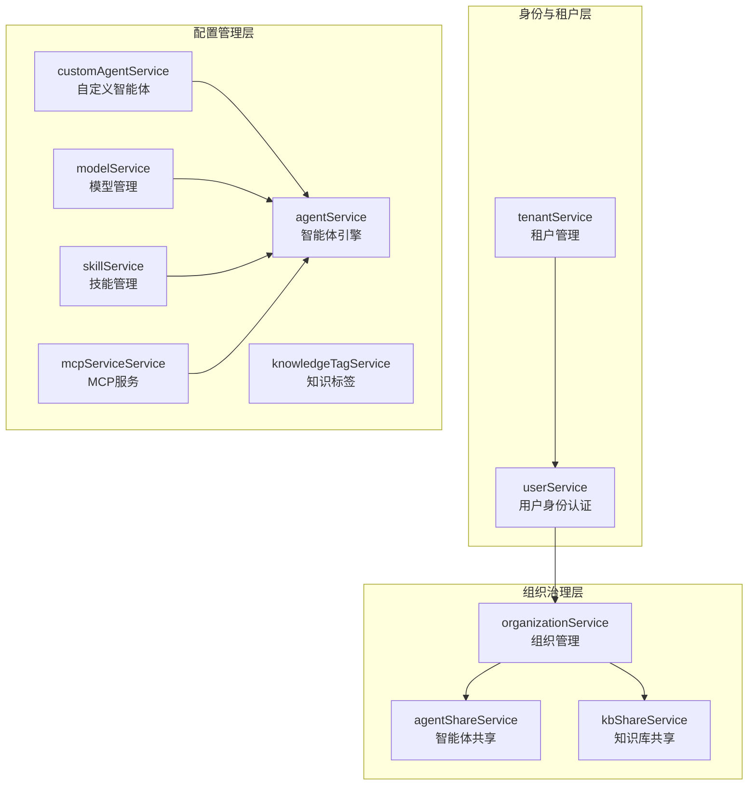
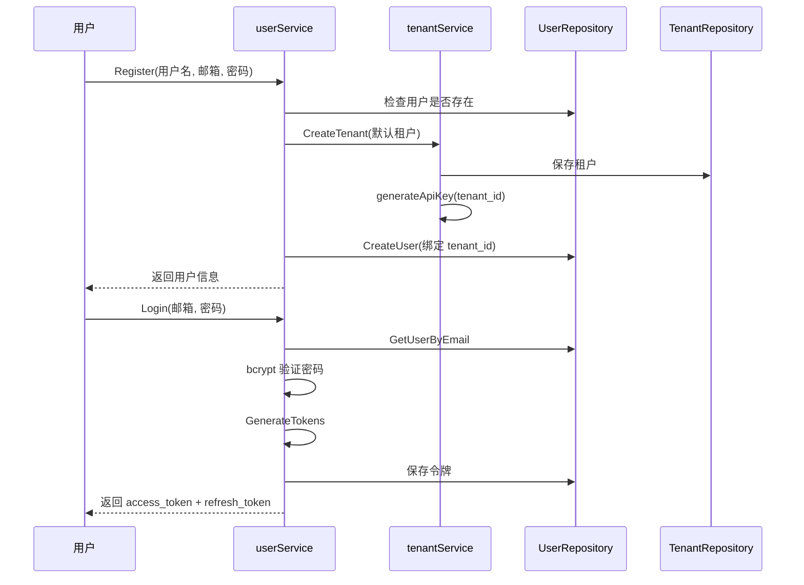
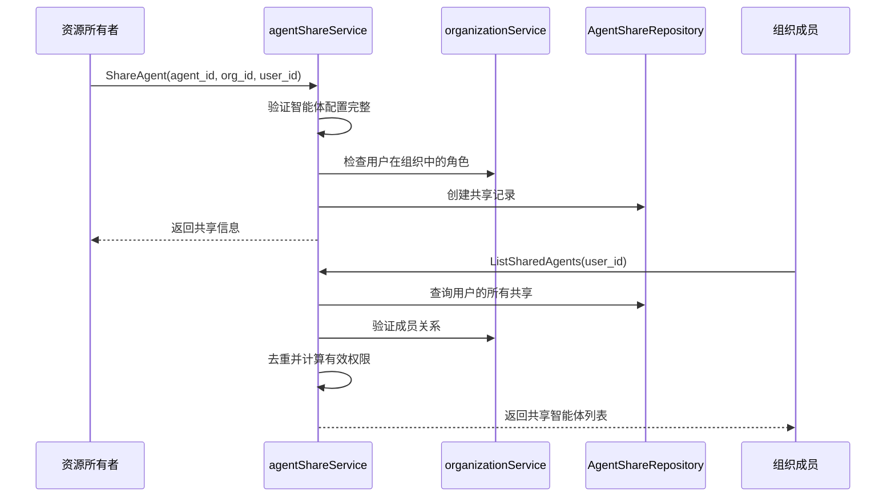
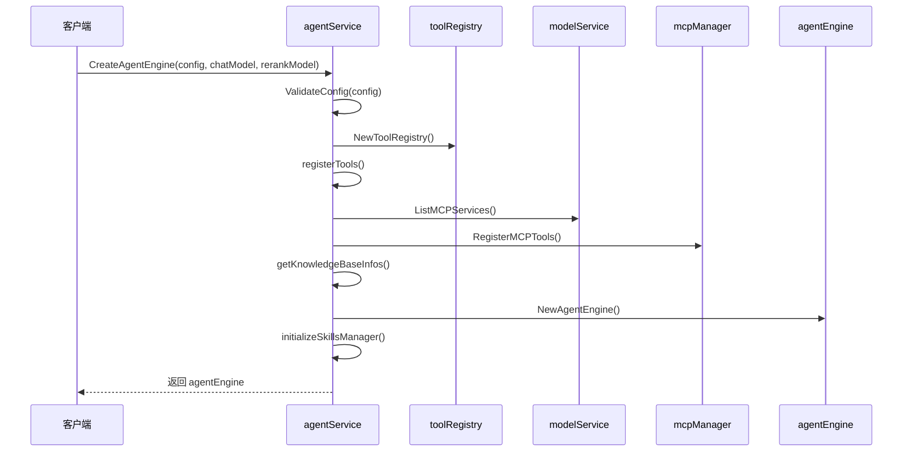
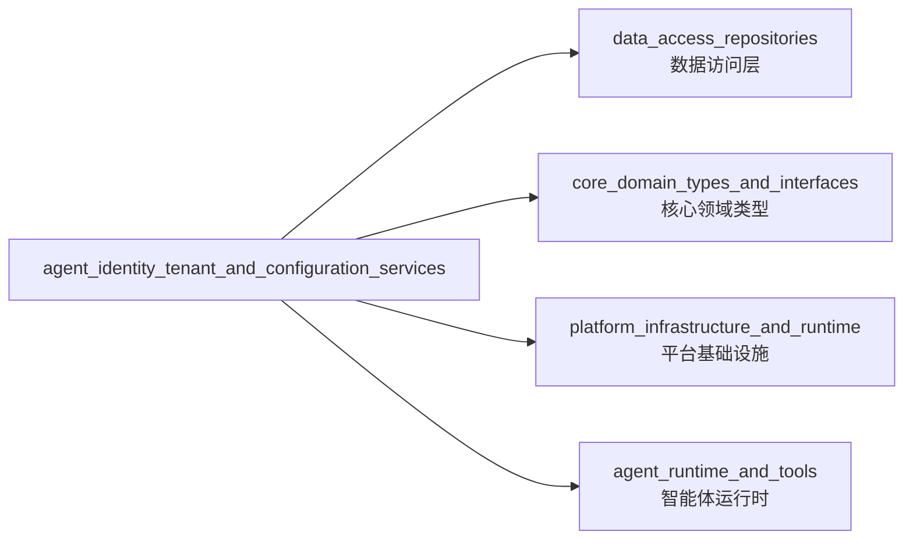
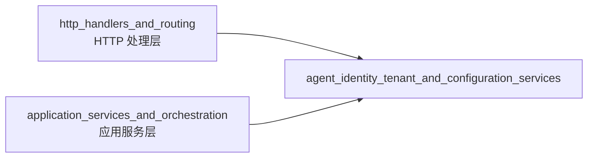

# agent_identity_tenant_and_configuration_services 模块深度解析

## 模块概览

`agent_identity_tenant_and_configuration_services` 模块是整个系统的核心控制层，负责管理身份认证、租户隔离、组织治理、智能体配置、模型管理以及资源共享等关键功能。它就像一个**数字城市的市政中心**，管理着所有实体（用户、租户、组织、智能体）的身份、权限和资源配置，确保整个系统安全、有序地运行。

这个模块解决的核心问题是：**如何在一个多租户、多组织的复杂系统中，安全地管理身份、权限和配置，同时实现资源的灵活共享？**

## 架构设计

### 核心组件关系图



### 分层架构说明

这个模块采用了清晰的**三层架构**：

1. **身份与租户层**：作为系统的基础，提供租户隔离和用户身份认证功能。
   - `tenantService`：管理租户的生命周期、API密钥生成与验证
   - `userService`：处理用户注册、登录、JWT令牌管理

2. **组织治理层**：构建在身份层之上，提供组织级别的资源共享和权限管理。
   - `organizationService`：组织创建、成员管理、邀请码机制
   - `agentShareService`：智能体的组织间共享
   - `kbShareService`：知识库的组织间共享

3. **配置管理层**：提供核心业务实体的配置和能力管理。
   - `customAgentService`：自定义智能体的创建、配置、复制
   - `agentService`：智能体引擎的组装和工具注册
   - `modelService`：模型的管理和初始化
   - `skillService`：技能的发现和加载
   - `mcpServiceService`：MCP（Model Context Protocol）服务的管理
   - `knowledgeTagService`：知识标签的管理

## 核心设计决策

### 1. 租户隔离作为第一原则

**设计选择**：系统采用严格的租户隔离模型，所有核心数据都绑定到 `tenant_id`。

**为什么这样设计**：
- 多租户SaaS系统的基本要求：不同客户的数据必须完全隔离
- 简化权限模型：默认情况下，用户只能访问自己租户的数据
- 安全性：即使出现权限漏洞，也能限制在单个租户范围内

**实现细节**：
```go
// tenantService 的 API Key 生成机制
func (r *tenantService) generateApiKey(tenantID uint64) string {
    // 将 tenant_id 加密到 API Key 中
    // 这样可以从 API Key 直接提取租户 ID，无需额外查询
}
```

**权衡考虑**：
- ✅ 优点：数据隔离清晰，权限模型简单
- ❌ 缺点：跨租户资源共享需要额外的机制（如共享服务）

### 2. 组织作为资源共享的桥梁

**设计选择**：引入 "组织" 概念作为跨租户资源共享的中间层。

**为什么这样设计**：
- 纯租户隔离太严格，无法满足团队协作场景
- 需要一个机制让不同租户的用户可以共享智能体和知识库
- 组织提供了自然的权限边界和管理结构

**实现细节**：
```go
// 组织共享的权限模型
// 1. 只有组织成员可以访问共享资源
// 2. 权限受限于：(a) 共享时设置的权限 (b) 用户在组织中的角色
effectivePermission := share.Permission
if !member.Role.HasPermission(share.Permission) {
    effectivePermission = member.Role
}
```

**权衡考虑**：
- ✅ 优点：灵活的资源共享，清晰的权限边界
- ❌ 缺点：增加了概念复杂度，需要维护组织成员关系

### 3. 智能体配置的双层模型

**设计选择**：将智能体分为 "内置智能体" 和 "自定义智能体"，内置智能体的配置可以被租户覆盖但不能被删除。

**为什么这样设计**：
- 系统需要提供开箱即用的智能体体验
- 不同租户可能需要调整内置智能体的配置
- 内置智能体应该作为系统基础设施存在，不能被意外删除

**实现细节**：
```go
// customAgentService 的 GetAgentByID 方法
if types.IsBuiltinAgentID(id) {
    // 先尝试从数据库获取（可能有自定义配置）
    agent, err := s.repo.GetAgentByID(ctx, id, tenantID)
    if err == nil {
        return agent, nil  // 返回自定义配置
    }
    // 没有自定义配置，返回默认内置智能体
    return types.GetBuiltinAgent(id, tenantID), nil
}
```

**权衡考虑**：
- ✅ 优点：开箱即用，允许定制，系统稳定性高
- ❌ 缺点：逻辑较复杂，需要处理两种状态

### 4. 资源共享的权限叠加模型

**设计选择**：用户对共享资源的有效权限是 "共享权限" 和 "组织角色" 的交集（取较低值）。

**为什么这样设计**：
- 资源所有者可能希望限制共享的权限级别
- 组织管理员需要控制成员在组织中的操作范围
- 两者的交集提供了最安全的权限模型

**实现细节**：
```go
// kbShareService 中的权限计算
effectivePermission := share.Permission
if !member.Role.HasPermission(share.Permission) {
    effectivePermission = member.Role
}
```

**权衡考虑**：
- ✅ 优点：双重安全控制，权限不会意外放大
- ❌ 缺点：用户可能困惑为什么权限没有生效

### 5. API Key 的自包含设计

**设计选择**：将 tenant_id 加密到 API Key 中，使 API Key 可以自验证。

**为什么这样设计**：
- 避免每次 API 调用都要查询数据库验证 API Key
- 提高性能，减少数据库压力
- 简化密钥管理逻辑

**实现细节**：
```go
// API Key 格式：sk-{base64(nonce + aes-gcm(tenant_id))}
// 可以直接从 API Key 提取 tenant_id，无需查询数据库
func (r *tenantService) ExtractTenantIDFromAPIKey(apiKey string) (uint64, error) {
    // 解密 API Key 获取 tenant_id
}
```

**权衡考虑**：
- ✅ 优点：性能好，无需数据库查询
- ❌ 缺点：密钥无法在不改变 tenant_id 的情况下撤销（需要配合令牌撤销机制）

## 核心数据流

### 用户注册与登录流程



### 智能体共享流程



### 智能体引擎创建流程



## 子模块详解

### 身份与租户管理

这是系统的基础层，负责租户和用户身份的核心管理。

- **[identity_tenant_and_organization_management](application_services_and_orchestration-agent_identity_tenant_and_configuration_services-identity_tenant_and_organization_management.md)**：租户的创建、查询、更新、删除，API Key 的生成与验证，用户注册、登录、密码管理、JWT 令牌生成与验证，以及组织创建、成员管理、邀请码、加入请求审批

### 资源共享与访问服务

构建在身份层之上，提供灵活的组织协作和资源共享机制。

- **[resource_sharing_and_access_services](application_services_and_orchestration-agent_identity_tenant_and_configuration_services-resource_sharing_and_access_services.md)**：智能体的组织间共享、权限管理、禁用控制，以及知识库的组织间共享、权限验证

### 智能体配置与能力服务

系统的核心业务层，提供智能体的完整配置和能力管理。

- **[agent_configuration_and_capability_services](application_services_and_orchestration-agent_identity_tenant_and_configuration_services-agent_configuration_and_capability_services.md)**：智能体引擎的创建、工具注册、技能初始化，自定义智能体的创建、配置、复制、删除，以及技能的发现、加载、元数据管理

### 模型与标签配置服务

提供 AI 模型和知识标签的管理能力。

- **[model_and_tag_configuration_services](application_services_and_orchestration-agent_identity_tenant_and_configuration_services-model_and_tag_configuration_services.md)**：模型的注册、状态管理、初始化（聊天、嵌入、重排序），以及知识标签的创建、更新、删除、使用统计

### MCP 服务配置管理

提供 MCP（Model Context Protocol）服务的管理能力。

- **[mcp_service_configuration_management](application_services_and_orchestration-agent_identity_tenant_and_configuration_services-mcp_service_configuration_management.md)**：MCP 服务的配置、连接管理、工具发现

## 与其他模块的依赖关系

### 依赖其他模块



**关键依赖说明**：

1. **data_access_repositories**：所有服务都依赖对应的 Repository 接口进行数据持久化
   - `TenantRepository`、`UserRepository`、`OrganizationRepository` 等
   - 这种依赖倒置设计使得服务层不直接依赖具体的数据库实现

2. **core_domain_types_and_interfaces**：定义了所有核心领域模型和服务接口
   - `types.Tenant`、`types.User`、`types.CustomAgent` 等数据模型
   - `interfaces.TenantService`、`interfaces.UserService` 等服务接口

3. **platform_infrastructure_and_runtime**：提供基础设施支持
   - `mcp.MCPManager`：MCP 连接管理
   - `config.Config`：系统配置
   - `event.EventBus`：事件总线

4. **agent_runtime_and_tools**：智能体运行时支持
   - `agent.AgentEngine`：智能体引擎
   - `tools.ToolRegistry`：工具注册表
   - `skills.Manager`：技能管理器

### 被其他模块依赖



**关键被依赖说明**：

1. **http_handlers_and_routing**：所有的管理 API 都依赖这些服务
   - 租户管理 API → `tenantService`
   - 用户认证 API → `userService`
   - 智能体管理 API → `customAgentService`、`agentService`

2. **application_services_and_orchestration**：会话和对话服务依赖智能体配置
   - 会话创建时需要通过 `agentService` 创建智能体引擎
   - 对话执行时需要通过 `modelService` 获取模型实例

## 新贡献者指南

### 常见陷阱与注意事项

1. **租户上下文的传递**
   - ❌ 错误：直接使用传入的 tenant_id，不从 context 中获取
   - ✅ 正确：始终从 `ctx.Value(types.TenantIDContextKey)` 获取 tenant_id
   - **原因**：防止权限提升攻击，确保用户只能访问自己租户的数据

2. **内置智能体的处理**
   - ❌ 错误：假设所有智能体都在数据库中
   - ✅ 正确：使用 `types.IsBuiltinAgentID()` 检查，并处理默认配置
   - **原因**：内置智能体可能没有数据库记录，使用默认配置

3. **共享资源的权限检查**
   - ❌ 错误：只检查共享权限，不检查组织角色
   - ✅ 正确：使用两者的交集作为有效权限
   - **原因**：组织管理员可能限制了成员的权限级别

4. **API Key 的验证**
   - ❌ 错误：只解析 API Key，不验证是否被撤销
   - ✅ 正确：解析后检查令牌状态（如果有撤销机制）
   - **原因**：虽然 API Key 自包含，但仍需支持撤销

5. **异步任务的上下文**
   - ❌ 错误：直接使用请求的 context 执行异步任务
   - ✅ 正确：使用 `logger.CloneContext(ctx)` 创建新的上下文
   - **原因**：请求 context 可能会被取消，导致异步任务中断

### 扩展点与定制建议

1. **自定义认证方式**
   - 扩展点：`userService.ValidateToken()`
   - 建议：保留 JWT 作为主要方式，添加额外的验证逻辑（如 IP 白名单）

2. **自定义组织权限模型**
   - 扩展点：`types.OrgMemberRole.HasPermission()`
   - 建议：保持现有的 viewer/editor/admin 三级模型，可添加更细粒度的权限

3. **自定义智能体工具注册**
   - 扩展点：`agentService.registerTools()`
   - 建议：通过配置而不是代码修改来控制工具的启用/禁用

4. **自定义 API Key 格式**
   - 扩展点：`tenantService.generateApiKey()` 和 `ExtractTenantIDFromAPIKey()`
   - 建议：保持自包含设计，避免依赖数据库查询

### 调试技巧

1. **租户上下文丢失**
   - 检查中间件是否正确设置了 `types.TenantIDContextKey`
   - 验证 context 是否在 goroutine 之间正确传递

2. **共享权限不生效**
   - 检查用户是否真的在组织中
   - 验证共享记录的 `SourceTenantID` 是否正确
   - 确认有效权限计算逻辑是否被正确调用

3. **内置智能体配置不保存**
   - 确认 `IsBuiltin` 标志是否正确设置
   - 检查 `updateBuiltinAgent()` 方法是否被调用

4. **MCP 服务连接失败**
   - 验证 `transport_type` 不是 `stdio`（已禁用）
   - 检查 `mcpManager` 是否正确初始化
   - 查看服务配置中的 URL、认证信息是否正确

## 总结

`agent_identity_tenant_and_configuration_services` 模块是整个系统的 "控制中心"，它通过清晰的分层架构和精心设计的权限模型，解决了多租户系统中的身份管理、资源共享和配置管理问题。

这个模块的设计体现了几个重要的原则：
- **安全第一**：租户隔离、权限叠加、自验证 API Key
- **灵活性与可控性平衡**：内置智能体可配置但不可删除，资源共享有双重权限控制
- **性能考虑**：API Key 自包含，避免不必要的数据库查询

对于新贡献者，理解这个模块的关键是把握 "租户 → 组织 → 用户 → 资源" 的层次关系，以及每个层次的职责边界。
