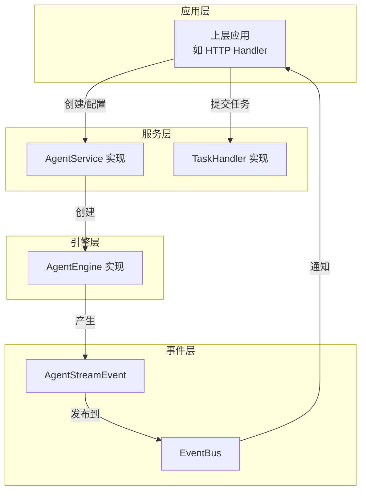

# Agent Orchestration Service and Task Interfaces 模块文档

## 1. 模块概述

想象一下，你正在指挥一支交响乐团。不同的乐器（工具）需要在正确的时间以正确的方式演奏，而指挥（Agent）需要协调一切，确保最终呈现出和谐的音乐（回答）。这正是 `agent_orchestration_service_and_task_interfaces` 模块的核心职责——它定义了 Agent 系统的"指挥台"和"乐谱"。

### 1.1 解决的核心问题

在构建智能 Agent 系统时，我们面临几个关键挑战：
- **如何统一 Agent 的执行接口**：不同类型的 Agent（如搜索 Agent、推理 Agent、工具调用 Agent）可能有不同的实现，但需要一致的交互方式
- **如何管理 Agent 的生命周期**：从配置创建、执行到结果返回，需要清晰的生命周期管理
- **如何处理流式输出**：现代 LLM 应用通常需要实时流式返回思考过程、工具调用和最终答案
- **如何解耦配置与执行**：Agent 的配置（如提示词、工具集）应该与实际执行逻辑分离

这个模块通过定义一组核心接口，为整个 Agent 系统提供了抽象层，使得：
- 不同的 Agent 实现可以互换使用
- 上层应用不需要关心 Agent 的内部实现细节
- 系统可以轻松扩展新的 Agent 类型

### 1.2 在系统中的位置

这个模块位于 `core_domain_types_and_interfaces` → `agent_conversation_and_runtime_contracts` → `agent_runtime_and_tool_call_contracts` 下，是整个 Agent 系统的核心契约层。它不包含具体的实现，而是定义了：
- Agent 服务应该提供什么功能
- Agent 引擎应该如何执行
- 流式事件应该以什么格式传递
- 异步任务应该如何处理

这些接口被系统的其他部分（如 `agent_runtime_and_tools`、`application_services_and_orchestration`）依赖，是连接抽象设计与具体实现的桥梁。

## 2. 核心组件详解

### 2.1 AgentStreamEvent - 流式事件的数据结构

#### 设计意图

`AgentStreamEvent` 是 Agent 与外部世界通信的"信使"。它设计为一个通用的事件结构，可以承载各种类型的 Agent 输出：
- 思考过程（thought）
- 工具调用（tool_call）
- 工具结果（tool_result）
- 最终答案（final_answer）
- 错误信息（error）
- 参考文献（references）

#### 字段解析

```go
type AgentStreamEvent struct {
    Type      string                 // 事件类型，决定了如何处理这个事件
    Content   string                 // 增量内容，用于流式输出
    Data      map[string]interface{} // 结构化数据，用于传递复杂信息
    Done      bool                   // 是否为最后一个事件
    Iteration int                    // 当前迭代次数，用于多轮思考
}
```

**设计权衡**：
- 使用 `map[string]interface{}` 作为 `Data` 字段提供了最大的灵活性，但也牺牲了类型安全。这是一个有意的选择，因为不同类型的事件可能需要携带完全不同的数据结构。
- `Iteration` 字段支持多轮思考和工具调用，这是 ReAct（Reasoning + Acting）模式的核心。

### 2.2 AgentEngine - Agent 执行引擎接口

#### 设计意图

`AgentEngine` 是 Agent 的"大脑"接口。它定义了如何执行一个 Agent，接收对话历史并返回执行结果。这个接口的设计遵循了单一职责原则——只负责 Agent 的执行逻辑。

#### 方法解析

```go
type AgentEngine interface {
    Execute(
        ctx context.Context,
        sessionID, messageID, query string,
        llmContext []chat.Message,
    ) (*types.AgentState, error)
}
```

**参数说明**：
- `ctx`：上下文，用于传递取消信号、超时等
- `sessionID`、`messageID`：用于追踪和日志记录
- `query`：用户的原始查询
- `llmContext`：对话历史上下文

**返回值**：
- `*types.AgentState`：Agent 执行后的状态
- `error`：执行过程中的错误

**设计权衡**：
- 接口非常简洁，只定义了一个 `Execute` 方法。这使得实现者可以自由选择内部架构（如同步执行、异步执行、状态机等）。
- 返回 `AgentState` 而不是直接返回最终答案，这支持了更复杂的执行模式，如暂停和恢复。

### 2.3 AgentService - Agent 服务接口

#### 设计意图

`AgentService` 是 Agent 系统的"工厂"和"配置中心"接口。它负责：
- 创建 AgentEngine 实例
- 验证 Agent 配置

这个接口将 Agent 的创建逻辑与使用逻辑分离，遵循了依赖倒置原则。

#### 方法解析

```go
type AgentService interface {
    CreateAgentEngine(
        ctx context.Context,
        config *types.AgentConfig,
        chatModel chat.Chat,
        rerankModel rerank.Reranker,
        eventBus *event.EventBus,
        contextManager ContextManager,
        sessionID string,
    ) (AgentEngine, error)

    ValidateConfig(config *types.AgentConfig) error
}
```

**参数说明**：
- `config`：Agent 的配置，包含提示词、工具集等
- `chatModel`、`rerankModel`：AI 模型依赖
- `eventBus`：事件总线，用于发布 Agent 执行过程中的事件
- `contextManager`：上下文管理器，用于管理对话历史

**设计权衡**：
- `CreateAgentEngine` 接收多个依赖项，这使得 AgentEngine 的实现可以通过构造函数注入这些依赖，而不需要自己创建。这提高了可测试性和灵活性。
- 单独的 `ValidateConfig` 方法允许在创建 AgentEngine 之前验证配置，提供了早期错误检测的能力。

### 2.4 TaskHandler - 异步任务处理器接口

#### 设计意图

`TaskHandler` 是系统处理异步任务的通用接口。它基于 `asynq` 库，为各种后台任务（如文档处理、知识库构建、评估任务等）提供了统一的处理方式。

#### 方法解析

```go
type TaskHandler interface {
    Handle(ctx context.Context, t *asynq.Task) error
}
```

**设计意图**：
- 这个接口非常简洁，使得任何需要处理异步任务的组件都可以实现它。
- 使用 `asynq.Task` 作为参数，利用了成熟的任务队列库，而不是重新发明轮子。

## 3. 架构与数据流

### 3.1 整体架构图



### 3.2 典型数据流

让我们追踪一个典型的 Agent 执行流程：

1. **初始化阶段**：
   - 上层应用（如 HTTP Handler）调用 `AgentService.CreateAgentEngine`
   - `AgentService` 验证配置并创建 `AgentEngine` 实例
   - 所有依赖（chatModel、rerankModel、eventBus、contextManager）被注入到 `AgentEngine`

2. **执行阶段**：
   - 应用调用 `AgentEngine.Execute`
   - `AgentEngine` 开始处理查询，可能进行多轮思考和工具调用
   - 每一步都会产生 `AgentStreamEvent` 并发布到 `EventBus`
   - 流式事件实时传递给客户端

3. **完成阶段**：
   - `AgentEngine` 返回最终的 `AgentState`
   - 应用可以选择将结果保存到数据库或返回给客户端

### 3.3 异步任务流程

对于后台任务（如大规模文档处理）：
1. 应用创建 `asynq.Task` 并提交到任务队列
2. 调度器将任务分发给合适的 `TaskHandler`
3. `TaskHandler.Handle` 执行实际的任务逻辑
4. 任务完成后，状态被更新，可能触发后续任务

## 4. 设计决策与权衡

### 4.1 接口 vs 具体实现

**决策**：定义清晰的接口，将实现分离到其他模块

**原因**：
- 这使得系统的不同部分可以独立演进
- 便于进行单元测试（可以 mock 接口）
- 支持多种实现（如不同的 AgentEngine 用于不同场景）

**权衡**：
- 增加了一定的抽象复杂度
- 需要更多的代码组织工作

### 4.2 事件驱动架构

**决策**：使用 `AgentStreamEvent` 和 `EventBus` 进行通信

**原因**：
- 支持实时流式输出，这是现代 LLM 应用的关键特性
- 解耦了 Agent 的执行和结果的消费
- 支持多个订阅者（如日志记录、监控、UI 更新）

**权衡**：
- 事件顺序和一致性需要仔细处理
- 调试可能更复杂（需要追踪事件流）

### 4.3 灵活的事件数据结构

**决策**：使用 `map[string]interface{}` 作为 `AgentStreamEvent.Data`

**原因**：
- 最大的灵活性，可以承载任何类型的数据
- 不需要为每种事件类型定义单独的结构

**权衡**：
- 失去了类型安全
- 需要在运行时进行类型断言和检查
- 文档变得更加重要

### 4.4 依赖注入

**决策**：通过 `CreateAgentEngine` 的参数注入所有依赖

**原因**：
- 明确声明了 AgentEngine 需要什么
- 便于测试（可以注入 mock 依赖）
- 提高了代码的可理解性

**权衡**：
- 构造函数可能变得很长
- 需要上层组件管理依赖的生命周期

## 5. 与其他模块的关系

### 5.1 依赖关系

这个模块是一个"纯契约"模块，它几乎不依赖其他模块（除了一些基础类型），而是被其他模块依赖：

- **被依赖**：`agent_runtime_and_tools` 模块会实现这些接口
- **被依赖**：`application_services_and_orchestration` 模块会使用这些接口
- **依赖**：`event` 模块（用于 EventBus）
- **依赖**：`chat` 模块（用于聊天模型接口）
- **依赖**：`rerank` 模块（用于重排序模型接口）

### 5.2 扩展点

这个模块设计了几个清晰的扩展点：

1. **自定义 AgentEngine**：实现 `AgentEngine` 接口来创建新的 Agent 执行逻辑
2. **自定义 AgentService**：实现 `AgentService` 接口来改变 Agent 的创建和配置方式
3. **自定义 TaskHandler**：实现 `TaskHandler` 接口来处理新类型的异步任务

## 6. 使用指南与注意事项

### 6.1 实现 AgentEngine

当实现 `AgentEngine` 时：
- 确保正确处理 `context.Context` 的取消和超时
- 合理使用 `AgentStreamEvent` 的不同类型来传递信息
- 在发生错误时，应该发布一个 `error` 类型的事件并设置 `Done = true`
- 考虑使用状态机模式来管理复杂的执行流程

### 6.2 实现 AgentService

当实现 `AgentService` 时：
- `ValidateConfig` 应该尽早失败，提供清晰的错误信息
- `CreateAgentEngine` 应该确保所有依赖都被正确注入
- 考虑使用工厂模式或构建者模式来创建复杂的 AgentEngine 实例

### 6.3 常见陷阱

1. **忘记发布事件**：`AgentEngine` 的实现者有时会忘记发布 `AgentStreamEvent`，导致客户端收不到更新
2. **事件顺序问题**：确保事件按照逻辑顺序发布，特别是在多线程或异步环境中
3. **忽略 context**：不尊重 `context.Context` 的取消信号可能导致资源泄漏
4. **Data 字段滥用**：过度使用 `map[string]interface{}` 可能导致代码难以维护，考虑在必要时定义更具体的结构

### 6.4 性能考虑

- 对于高频事件，考虑合并或批处理
- 注意 `AgentStreamEvent` 的大小，避免在 `Data` 字段中放置过大的数据
- 在实现 `TaskHandler` 时，考虑任务的幂等性，因为任务可能会重试

## 7. 子模块

这个模块包含以下子模块，每个子模块都有更详细的文档：

- [agent_orchestration_service_contracts](core_domain_types_and_interfaces-agent_conversation_and_runtime_contracts-agent_runtime_and_tool_call_contracts-agent_orchestration_service_and_task_interfaces-agent_orchestration_service_contracts.md)：Agent 服务的详细契约
- [agent_stream_event_contracts](core_domain_types_and_interfaces-agent_conversation_and_runtime_contracts-agent_runtime_and_tool_call_contracts-agent_orchestration_service_and_task_interfaces-agent_stream_event_contracts.md)：流式事件的详细定义和使用指南
- [task_handler_execution_contracts](core_domain_types_and_interfaces-agent_conversation_and_runtime_contracts-agent_runtime_and_tool_call_contracts-agent_orchestration_service_and_task_interfaces-task_handler_execution_contracts.md)：任务处理器的执行契约和最佳实践

## 8. 总结

`agent_orchestration_service_and_task_interfaces` 模块是整个 Agent 系统的"脊梁"。它通过定义一组清晰的接口和数据结构，为 Agent 的创建、执行和通信提供了统一的抽象。

这个模块的设计体现了几个重要的软件架构原则：
- **依赖倒置原则**：高层模块和低层模块都依赖于抽象
- **接口隔离原则**：定义了小而专注的接口
- **事件驱动架构**：支持松耦合的组件交互

理解这个模块对于理解整个 Agent 系统至关重要。它不仅仅是一组接口定义，更是系统设计思想的体现——如何构建一个灵活、可扩展、可维护的智能 Agent 系统。
