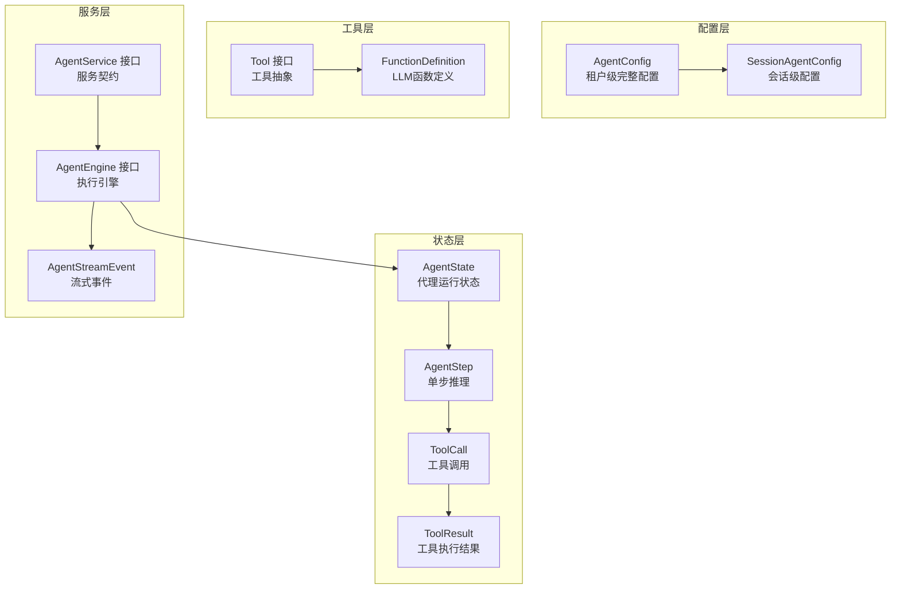

# Agent Runtime and Tool Call Contracts 模块文档

## 概述

想象一个智能助手，它能够自主思考、调用工具、执行动作，最终给出答案。这正是本模块所定义的核心抽象——**Agent Runtime and Tool Call Contracts** 模块为整个系统提供了智能代理（Agent）的运行时模型、工具调用契约和状态管理的基础架构。

### 核心问题

在构建智能代理系统时，我们需要解决几个关键问题：
1. **状态跟踪**：如何记录代理在多轮推理过程中的思考、工具调用和结果？
2. **配置管理**：如何在租户级、会话级和运行时级灵活配置代理行为？
3. **工具抽象**：如何定义统一的工具接口，使代理能够调用任意类型的工具？
4. **事件流**：如何将代理的思考过程和动作实时流式传输给客户端？

本模块通过定义清晰的数据结构和接口契约，为这些问题提供了标准解决方案。

## 架构概览

### 架构说明

这个模块采用了**分层契约设计**，从底层到上层依次是：

1. **配置层**：定义代理行为的配置结构
   - `AgentConfig`：租户级的完整配置，包含所有代理运行参数
   - `SessionAgentConfig`：会话级配置，只存储会话特定的覆盖项

2. **状态层**：跟踪代理执行过程中的完整状态
   - `AgentState`：整体状态管理器，跟踪当前轮次、步骤集合和最终答案
   - `AgentStep`：单次 ReAct 循环（思考-行动-观察）的记录
   - `ToolCall` + `ToolResult`：工具调用及其执行结果的完整记录

3. **工具层**：定义工具的标准接口
   - `Tool` 接口：所有工具必须实现的统一契约
   - `FunctionDefinition`：向 LLM 描述工具的结构

4. **服务层**：定义代理执行的服务契约
   - `AgentEngine`：代理执行引擎的核心接口
   - `AgentService`：创建和管理代理引擎的服务接口
   - `AgentStreamEvent`：流式事件的数据结构

## 核心设计决策

### 1. 分层配置：租户级与会话级分离

**设计选择**：将配置分为 `AgentConfig`（完整租户级配置）和 `SessionAgentConfig`（轻量级会话级覆盖）。

**为什么这样设计**：
- **灵活性**：租户可以定义默认行为，而会话可以根据需要覆盖特定设置
- **存储效率**：会话只存储差异项，避免重复存储完整配置
- **渐进式配置**：系统可以在运行时合并多层配置，实现灵活的配置优先级

**权衡**：
- ✅ 优点：配置复用性高，存储高效
- ⚠️ 缺点：配置解析逻辑相对复杂，需要处理多层合并

### 2. ReAct 模式的结构化表示

**设计选择**：使用 `AgentStep` 显式建模 ReAct（Reasoning-Acting）循环的每个迭代。

**为什么这样设计**：
- **可观测性**：完整记录代理的思考过程、工具调用和结果，便于调试和审计
- **可恢复性**：状态可以持久化和恢复，支持长时间运行的代理任务
- **用户体验**：可以向用户展示代理的"思考过程"，提高透明度和信任度

**类比**：这就像科学家的实验笔记本——不仅记录最终结论，还记录每一步的假设、实验和观察结果。

### 3. 统一工具接口

**设计选择**：定义 `Tool` 接口，要求所有工具实现统一的方法签名。

**为什么这样设计**：
- **插件化架构**：新工具可以无缝集成，无需修改代理核心逻辑
- **LLM 友好**：`FunctionDefinition` 提供了标准化的方式向 LLM 描述工具
- **类型安全**：通过 JSON Schema 验证工具参数，减少运行时错误

### 4. 流式事件模型

**设计选择**：使用 `AgentStreamEvent` 定义标准化的事件类型，支持实时推送代理状态。

**为什么这样设计**：
- **实时反馈**：用户可以立即看到代理的思考过程，而不是等待最终答案
- **前端友好**：事件类型明确，前端可以根据不同事件类型渲染不同的 UI
- **兼容性**：事件结构简单，易于在不同传输协议（WebSocket、SSE）上实现

## 核心组件详解

### AgentConfig 和 SessionAgentConfig

这两个结构体构成了代理配置的核心。`AgentConfig` 是完整的配置模型，包含：
- 迭代控制（`MaxIterations`）
- 反思机制（`ReflectionEnabled`）
- 工具白名单（`AllowedTools`）
- LLM 参数（`Temperature`）
- 知识库访问（`KnowledgeBases`、`KnowledgeIDs`）
- 系统提示（`SystemPrompt` 及兼容性字段）
- 网络搜索（`WebSearchEnabled`、`WebSearchMaxResults`）
- 多轮对话（`MultiTurnEnabled`、`HistoryTurns`）
- MCP 服务（`MCPSelectionMode`、`MCPServices`）
- 思考模式（`Thinking`）
- 技能系统（`SkillsEnabled`、`SkillDirs`、`AllowedSkills`）

**关键方法**：`ResolveSystemPrompt()` 实现了向后兼容的提示词解析逻辑。

### AgentState、AgentStep 和 ToolCall

这三个结构体共同记录了代理的完整执行轨迹：

- **AgentState**：全局状态管理器，跟踪当前轮次、所有步骤、完成状态和最终答案
- **AgentStep**：单次迭代的记录，包含思考内容（`Thought`）、工具调用列表（`ToolCalls`）和时间戳
- **ToolCall**：单个工具调用的记录，包含 ID、名称、参数、结果、反思和执行时长

**设计亮点**：`AgentStep.GetObservations()` 提供了向后兼容的观察结果提取方法。

### Tool 接口和 FunctionDefinition

`Tool` 接口是工具抽象的核心，定义了：
- `Name()`：工具唯一标识
- `Description()`：人类可读的描述
- `Parameters()`：JSON Schema 形式的参数定义
- `Execute()`：执行逻辑

`FunctionDefinition` 则是向 LLM 描述工具的结构，与 OpenAI 的函数调用格式兼容。

### AgentEngine 和 AgentService 接口

这两个接口定义了代理执行的服务契约：
- **AgentEngine**：负责实际执行代理逻辑，接收对话历史并返回状态
- **AgentService**：负责创建和配置代理引擎，验证配置

### AgentStreamEvent

定义了标准化的流式事件，支持多种事件类型：
- `thought`：思考内容
- `tool_call`：工具调用
- `tool_result`：工具结果
- `final_answer`：最终答案
- `error`：错误
- `references`：引用

## 子模块说明

本模块包含以下子模块，每个子模块都有详细的文档：

- [agent_runtime_state_and_configuration_contracts](core_domain_types_and_interfaces-agent_conversation_and_runtime_contracts-agent_runtime_and_tool_call_contracts-agent_runtime_state_and_configuration_contracts.md)：运行时状态和配置契约
- [tool_calling_and_function_contracts](core_domain_types_and_interfaces-agent_conversation_and_runtime_contracts-agent_runtime_and_tool_call_contracts-tool_calling_and_function_contracts.md)：工具调用和函数契约
- [agent_orchestration_service_and_task_interfaces](core_domain_types_and_interfaces-agent_conversation_and_runtime_contracts-agent_runtime_and_tool_call_contracts-agent_orchestration_service_and_task_interfaces.md)：编排服务和任务接口

## 与其他模块的关系

本模块是整个代理系统的**契约层**，被以下模块依赖：

- [agent_core_orchestration_and_tooling_foundation](../agent_runtime_and_tools-agent_core_orchestration_and_tooling_foundation.md)：实际实现代理执行逻辑
- [chat_pipeline_plugins_and_flow](../application_services_and_orchestration-chat_pipeline_plugins_and_flow.md)：在聊天管道中集成代理功能
- [session_message_and_streaming_http_handlers](../http_handlers_and_routing-session_message_and_streaming_http_handlers.md)：通过 HTTP API 暴露代理功能

## 使用指南和注意事项

### 配置合并策略

当使用会话级配置时，系统会采用以下合并策略：
1. 从租户配置读取默认值
2. 用会话配置覆盖特定字段（如 `KnowledgeBases`、`WebSearchEnabled`）
3. 运行时可以根据需要进一步调整

### 向后兼容性

模块特别注意了向后兼容性：
- `SystemPromptWebEnabled` 和 `SystemPromptWebDisabled` 已标记为弃用，但仍被支持
- `AgentStep.GetObservations()` 保持了对旧代码的兼容性

### 状态持久化

`AgentState` 和相关结构体设计为可序列化的，可以：
- 存储在数据库中（实现了 `driver.Valuer` 和 `sql.Scanner`）
- 通过网络传输
- 用于调试和审计

### 扩展点

模块提供了清晰的扩展点：
- 实现 `Tool` 接口来添加新工具
- 实现 `AgentEngine` 接口来创建自定义执行引擎
- 实现 `AgentService` 接口来自定义代理创建逻辑

## 总结

`agent_runtime_and_tool_call_contracts` 模块是整个智能代理系统的**基础契约层**，它定义了代理的状态模型、配置结构、工具接口和服务契约。通过清晰的分层设计和向后兼容的考虑，这个模块为构建灵活、可扩展的智能代理系统提供了坚实的基础。
