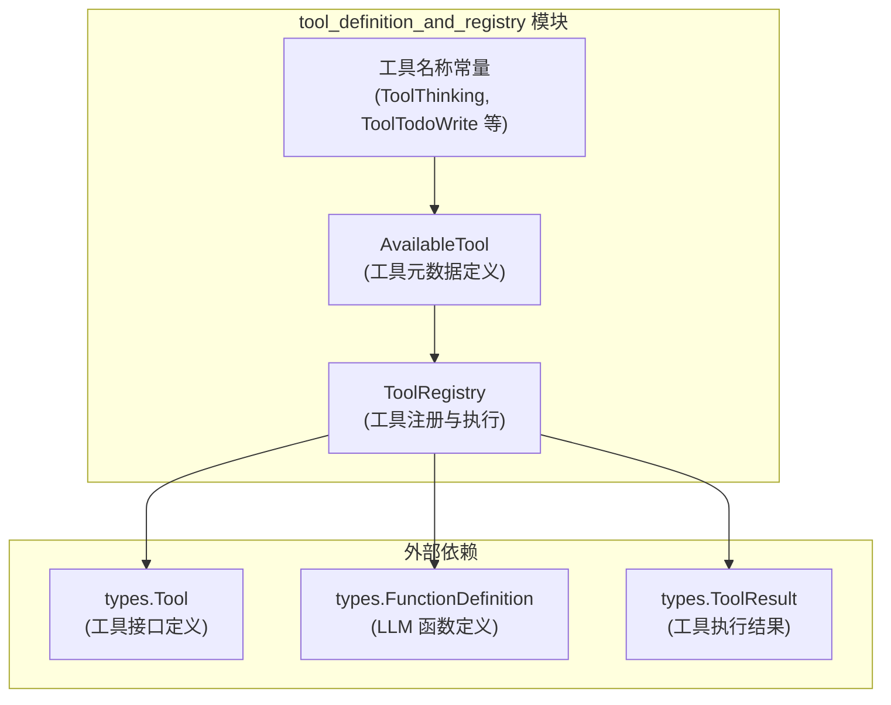
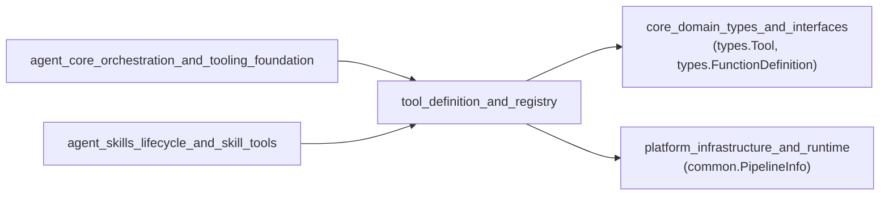

# tool_definition_and_registry 模块技术深度解析

## 模块概览

想象一个餐厅的厨房，厨师需要各种工具来完成不同的菜品。每个工具都有特定的用途，厨师需要知道在哪里能找到它们、如何使用它们，以及什么时候适合使用哪个工具。`tool_definition_and_registry` 模块就像是这个厨房的"工具管理系统"——它定义了所有可用的工具，维护了一个工具目录，并提供了查找和使用这些工具的标准方式。

在 Agent 运行时系统中，这个模块扮演着至关重要的角色：它解决了"如何让 Agent 以安全、可管理的方式使用各种功能"的问题。没有这个模块，Agent 可能会直接调用任意功能，导致系统混乱、安全漏洞和难以维护的代码。

## 核心问题与解决方案

### 问题空间

在构建 Agent 系统时，我们面临几个关键挑战：

1. **工具发现与管理**：Agent 需要知道有哪些工具可用，以及它们的功能是什么
2. **安全执行**：需要防止工具名称冲突导致的安全风险（例如，恶意插件覆盖核心工具）
3. **标准化接口**：不同的工具可能有不同的实现方式，但需要统一的调用方式
4. **LLM 友好的描述**：需要向 LLM 提供工具的结构化描述，以便它能正确选择和使用工具

### 解决方案

`tool_definition_and_registry` 模块通过两个核心组件解决了这些问题：

1. **`AvailableTool`**：定义了工具的元数据（名称、标签、描述），用于 UI 展示和设置
2. **`ToolRegistry`**：提供了工具的注册、查找和执行机制，确保安全的工具管理

## 架构设计

### 核心组件关系图



### 数据流向

让我们通过一个典型的工具执行流程来理解数据如何在系统中流动：

1. **工具注册阶段**：
   - 系统启动时，各个工具实现通过 `ToolRegistry.RegisterTool()` 注册自己
   - `ToolRegistry` 内部使用 map 存储工具，采用"先注册者胜"的策略防止冲突

2. **工具发现阶段**：
   - Agent 初始化时，调用 `ToolRegistry.GetFunctionDefinitions()` 获取所有工具的结构化描述
   - 这些描述被发送给 LLM，让它知道有哪些工具可用以及如何使用

3. **工具执行阶段**：
   - LLM 决定使用某个工具后，Agent 调用 `ToolRegistry.ExecuteTool()`
   - `ToolRegistry` 查找工具、验证存在性、执行工具并记录执行日志
   - 执行结果返回给 Agent，再传递给 LLM 进行下一步处理

## 关键设计决策

### 1. "先注册者胜"的工具注册策略

**决策**：在 `RegisterTool` 方法中，如果工具名称已存在，则保留现有工具而不覆盖。

**原因分析**：
- **安全性**：这是一个明确的安全设计决策（注释中提到了 GHSA-67q9-58vj-32qx）
- **防止劫持**：防止恶意插件或第三方代码通过注册相同名称的工具来覆盖核心工具
- **可预测性**：确保系统行为的可预测性——核心工具总是优先被使用

**权衡**：
- 优点：安全性高，防止工具劫持
- 缺点：如果确实需要替换工具，需要先确保旧工具未被注册，这增加了一定的复杂性

### 2. 元数据与实现分离

**决策**：将工具的元数据（`AvailableTool`）与实际实现（`types.Tool` 接口）分离。

**原因分析**：
- **关注点分离**：UI 层只需要知道工具的名称、标签和描述，不需要知道实现细节
- **灵活性**：可以独立更新工具的 UI 描述而不影响执行逻辑
- **多语言支持**：便于实现工具标签和描述的本地化（虽然当前代码中只有中文）

**权衡**：
- 优点：清晰的职责划分，便于维护和扩展
- 缺点：需要保持两个地方的同步（`AvailableToolDefinitions` 函数和实际注册的工具）

### 3. 集中式工具执行与日志记录

**决策**：所有工具执行都通过 `ToolRegistry.ExecuteTool()` 进行，并在该方法中统一记录日志。

**原因分析**：
- **可观察性**：确保所有工具执行都被记录，便于调试和监控
- **一致性**：统一的错误处理和结果包装
- **审计追踪**：提供完整的工具使用记录，便于安全审计

**权衡**：
- 优点：全面的可观察性，一致的执行模型
- 缺点：`ToolRegistry` 需要了解执行上下文（如 `context.Context`），增加了一定的耦合

## 子模块介绍

### tool_availability_contracts

这个子模块定义了工具可用性的契约，包括哪些工具在什么情况下可用。它与 `AvailableTool` 结构紧密相关，帮助系统理解工具的展示和使用限制。

[查看详细文档](./tool_availability_contracts.md)

### tool_registration_and_resolution

这个子模块专注于工具的注册和解析机制，是 `ToolRegistry` 的核心实现。它处理工具的生命周期管理、名称解析和安全注册策略。

[查看详细文档](./tool_registration_and_resolution.md)

## 与其他模块的关系

### 依赖关系



### 关键交互点

1. **与 agent_engine_orchestration 的交互**：
   - Agent 引擎使用 `ToolRegistry` 获取工具定义并执行工具
   - 这是最主要的消费者，依赖模块提供完整的工具管理功能
   - 相关文档：[agent_engine_orchestration](./agent_engine_orchestration.md)

2. **与 core_domain_types_and_interfaces 的交互**：
   - 依赖 `types.Tool` 接口定义工具的契约
   - 使用 `types.FunctionDefinition` 向 LLM 描述工具
   - 通过 `types.ToolResult` 标准化工具执行结果

3. **与 agent_skills_lifecycle_and_skill_tools 的交互**：
   - 技能系统注册技能相关的工具（如 `ToolExecuteSkillScript` 和 `ToolReadSkill`）
   - 这些工具只有在技能功能启用时才可用
   - 相关文档：[skill_execution_tool](./skill_execution_tool.md)，[skill_reading_tool](./skill_reading_tool.md)

## 实际使用指南

### 注册新工具

要注册一个新工具，需要：

1. 实现 `types.Tool` 接口
2. 在启动时通过 `ToolRegistry.RegisterTool()` 注册
3. 在 `AvailableToolDefinitions()` 中添加元数据（如果需要在 UI 中展示）

```go
// 1. 实现工具
type MyTool struct{}

func (t *MyTool) Name() string {
    return "my_tool"
}

func (t *MyTool) Description() string {
    return "这是我的自定义工具"
}

func (t *MyTool) Parameters() json.RawMessage {
    return json.RawMessage(`{"type": "object", "properties": {}}`)
}

func (t *MyTool) Execute(ctx context.Context, args json.RawMessage) (*types.ToolResult, error) {
    // 工具实现
    return &types.ToolResult{Success: true}, nil
}

// 2. 注册工具
registry := tools.NewToolRegistry()
registry.RegisterTool(&MyTool{})
```

### 执行工具

```go
// 获取工具定义（用于 LLM）
definitions := registry.GetFunctionDefinitions()

// 执行工具
result, err := registry.ExecuteTool(ctx, "my_tool", json.RawMessage(`{}`))
if err != nil {
    // 处理错误
}
```

## 注意事项与陷阱

### 1. 工具名称同步

**陷阱**：`AvailableToolDefinitions()` 中的工具列表需要与实际注册的工具保持同步。如果添加了新工具但忘记在这个函数中添加，UI 将不会显示该工具。

**建议**：考虑使用代码生成或运行时检查来确保同步。

### 2. 先注册者胜策略

**陷阱**：由于采用"先注册者胜"的策略，如果两个不同的组件尝试注册相同名称的工具，后注册的那个会被静默忽略。

**建议**：
- 在注册工具前检查是否已存在
- 使用唯一的工具名称前缀（如 `myorg_mytool`）
- 在开发环境中添加警告日志

### 3. 工具清理的特殊性

**陷阱**：`Cleanup` 方法目前只针对 `DataAnalysisTool` 进行了特殊处理，不是通用的清理机制。

**建议**：如果需要为其他工具添加清理逻辑，需要修改 `Cleanup` 方法或设计更通用的清理机制。

### 4. 上下文传递

**陷阱**：`ExecuteTool` 方法接收 `context.Context` 参数，工具实现需要正确处理上下文的取消和超时。

**建议**：在工具实现中始终检查 `ctx.Done()`，并在适当的时候提前返回。

## 总结

`tool_definition_and_registry` 模块是 Agent 系统的核心基础设施之一，它通过简洁而强大的设计解决了工具管理的关键问题。它的"先注册者胜"策略提供了安全性，元数据与实现分离提供了灵活性，集中式执行提供了可观察性。

理解这个模块的设计思想和权衡，对于构建安全、可扩展的 Agent 系统至关重要。无论是添加新工具、修改现有工具，还是理解工具执行流程，这个模块都是不可或缺的基础。
