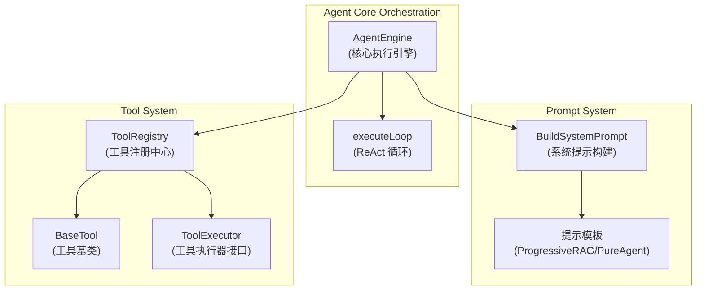

# Agent Core Orchestration and Tooling Foundation

## 模块概述

这个模块是整个智能代理系统的核心引擎，它实现了一个基于 ReAct (Reasoning + Acting) 模式的智能代理。想象一下，这个模块就像是一个经验丰富的研究助手：它不仅能理解你的问题，还能主动规划解决路径，使用各种工具（如搜索、数据库查询、文档分析等）收集信息，并在过程中不断反思和调整策略，最终给出有根有据的答案。

## 架构概览

让我们先通过一个 Mermaid 图表来理解这个模块的核心组件和它们之间的关系：



### 核心组件职责

1. **AgentEngine**：整个代理的大脑，负责协调整个执行流程
2. **ToolRegistry**：工具的中央注册表，管理所有可用工具的生命周期
3. **BuildSystemPrompt**：动态构建系统提示，根据知识库、技能、网络搜索状态等配置调整提示
4. **BaseTool/ToolExecutor**：工具的基础抽象，定义了工具的标准接口

## 核心设计理念

### 1. ReAct 模式的深度实现

这个模块的核心是 ReAct 模式，但它不是简单的"思考-行动"循环，而是实现了一个更精细的"侦察-计划-执行"流程：

- **初步侦察**：强制进行"深度阅读"测试，先获取知识库的初步认知
- **战略决策与规划**：根据侦察结果决定是直接回答还是制定详细计划
- **纪律性执行与深度反思**：每个任务完成后都必须进行深度反思
- **最终综合**：只有在所有任务完成后才生成最终答案

这种设计的权衡是：
- ✅ 优点：答案更准确、有依据，避免幻觉
- ⚠️ 缺点：执行时间更长，Token 消耗更多

### 2. 渐进式 RAG (Progressive RAG)

不同于传统的一次性检索，这个模块实现了渐进式检索：
- 先进行初步搜索获取方向
- 然后通过 `list_knowledge_chunks` 进行深度阅读
- 根据深度阅读结果决定下一步检索策略
- 不断迭代直到获得足够信息

### 3. 工具的中心化管理与安全注册

ToolRegistry 采用了"先注册者获胜"的策略，这是一个安全设计：
```go
// 从 registry.go 中的关键代码
func (r *ToolRegistry) RegisterTool(tool types.Tool) {
    name := tool.Name()
    if _, exists := r.tools[name]; exists {
        return  // 先注册的工具保持不变
    }
    r.tools[name] = tool
}
```

这种设计防止了工具名称冲突导致的安全问题（GHSA-67q9-58vj-32qx）。

## 主要数据流程

让我们追踪一个典型的用户查询从输入到输出的完整流程：

1. **初始化阶段**
   - 创建 AgentEngine 实例，配置工具注册表、聊天模型、事件总线等
   - 构建系统提示，包含知识库信息、技能元数据、网络搜索状态等

2. **执行循环启动**
   ```
   用户查询 → 构建消息历史 → 获取工具定义 → 进入 executeLoop
   ```

3. **思考阶段 (Think)**
   - 调用 LLM 进行思考，流式输出思考过程到事件总线
   - 收集工具调用请求

4. **行动阶段 (Act)**
   - 执行 LLM 请求的工具调用
   - 通过 ToolRegistry 找到对应的工具并执行
   - 将工具结果添加到消息历史

5. **观察阶段 (Observe)**
   - 将工具结果写入上下文管理器
   - 检查是否完成，如未完成则继续下一轮循环

6. **完成阶段**
   - 生成最终答案（如果达到最大迭代次数则强制生成）
   - 发出完成事件，包含所有步骤和知识引用

## 关键子模块

这个模块可以进一步分解为以下几个核心子模块：

### 1. [Agent Engine Orchestration](agent_runtime_and_tools-agent_core_orchestration_and_tooling_foundation-agent_engine_orchestration.md)
负责整个代理的执行流程协调，是整个系统的指挥中心。这个子模块包含 `AgentEngine` 结构体和核心的 ReAct 循环实现。

### 2. [Agent System Prompt Context Contracts](agent_runtime_and_tools-agent_core_orchestration_and_tooling_foundation-agent_system_prompt_context_contracts.md)
定义了系统提示的构建方式和上下文契约，包括知识库信息、技能元数据等的表示。这个子模块处理动态提示构建和模板渲染。

### 3. [Tool Definition and Registry](agent_runtime_and_tools-agent_core_orchestration_and_tooling_foundation-tool_definition_and_registry.md)
管理工具的定义、注册和解析，是工具生态系统的基础设施。这个子模块实现了安全的工具注册机制和函数定义导出。

### 4. [Tool Execution Abstractions](agent_runtime_and_tools-agent_core_orchestration_and_tooling_foundation-tool_execution_abstractions.md)
提供工具执行的抽象层，定义了工具的标准接口和执行机制。这个子模块包含工具的基类实现和通用辅助函数。

## 设计权衡与决策

在这个模块的设计过程中，团队做出了几个关键的权衡决策：

### 1. 流式输出 vs 批处理输出
**决策**：采用完全流式输出架构
**原因**：
- 用户体验：用户可以实时看到代理的思考过程
- 错误恢复：如果某个步骤失败，可以更早地发现和处理
- 资源利用：流式处理可以更高效地利用内存和网络资源
**权衡**：
- ✅ 优点：更好的用户体验、更快的首次响应时间
- ⚠️ 缺点：实现复杂度更高，需要处理更多的边界情况

### 2. 事件驱动架构 vs 直接调用
**决策**：采用事件总线（EventBus）进行组件通信
**原因**：
- 解耦：AgentEngine 不需要知道具体的输出处理器
- 可扩展性：可以轻松添加新的事件订阅者
- 可测试性：可以更容易地 mock 和验证事件
**权衡**：
- ✅ 优点：高度解耦、易于扩展
- ⚠️ 缺点：调试难度增加，事件流不那么直观

### 3. 严格的工具使用策略 vs 灵活的工具使用
**决策**：实现严格的"深度阅读"强制策略
**原因**：
- 答案质量：强制深度阅读可以避免基于搜索摘要的浅层回答
- 可追溯性：确保所有答案都有实际的文档内容作为依据
**权衡**：
- ✅ 优点：更高的答案质量和可信度
- ⚠️ 缺点：增加了 Token 消耗和响应时间

### 4. 先注册者获胜的工具注册策略 vs 后注册覆盖
**决策**：采用先注册者获胜的策略
**原因**：
- 安全性：防止恶意工具通过名称冲突覆盖合法工具
- 可预测性：工具行为在启动时就确定，不会在运行时意外改变
**权衡**：
- ✅ 优点：更安全、行为更可预测
- ⚠️ 缺点：灵活性降低，需要更仔细的工具名称管理

## 新贡献者注意事项

### 1. 事件流的一致性
当修改 AgentEngine 时，务必保持事件流的一致性。所有的思考内容、工具调用和结果都应该通过 EventBus 发出，并且事件 ID 的生成方式要保持一致（使用 `generateEventID` 函数）。

### 2. 提示模板的修改
修改提示模板时要非常小心，特别是 `ProgressiveRAGSystemPrompt`。这个模板包含了复杂的指令，小的改动可能会导致代理行为的显著变化。建议：
- 在修改前备份原始模板
- 在测试环境中充分测试修改后的行为
- 关注代理是否仍然遵循"深度阅读"等关键策略

### 3. 工具注册的安全性
添加新工具时，确保：
- 工具名称是唯一的，不会与现有工具冲突
- 工具的参数 schema 是严格的，可以防止恶意输入
- 工具的 Execute 方法实现了适当的错误处理

### 4. 上下文管理的重要性
`contextManager` 负责维护对话历史，修改相关代码时要确保：
- 消息格式符合 OpenAI 的工具调用格式
- 工具结果正确地附加到消息历史中
- 不会意外地泄漏敏感信息到上下文中

### 5. 最大迭代次数的考虑
`MaxIterations` 配置是防止无限循环的重要安全措施。修改相关逻辑时，确保：
- 仍然有防止无限循环的机制
- 达到最大迭代次数时的行为是合理的（生成最终答案而不是直接失败）

## 跨模块依赖关系

这个模块与系统中的其他几个关键模块有紧密的依赖关系：

1. **[Core Domain Types and Interfaces](../core_domain_types_and_interfaces.md)**：
   - 依赖：`types.AgentConfig`、`types.AgentState`、`types.Tool` 等核心类型定义
   - 交互：通过这些类型契约与其他模块解耦

2. **[Agent Skills Lifecycle and Skill Tools](../agent_runtime_and_tools-agent_skills_lifecycle_and_skill_tools.md)**：
   - 依赖：技能管理器（`skills.Manager`）和技能元数据
   - 交互：支持渐进式技能披露，通过 `read_skill` 工具加载技能

3. **[Event Bus and Agent Runtime Event Contracts](../platform_infrastructure_and_runtime-event_bus_and_agent_runtime_event_contracts.md)**：
   - 依赖：事件总线（`event.EventBus`）和事件类型定义
   - 交互：发出所有代理执行事件，供其他模块订阅处理

4. **[Chat Completion Backends and Streaming](../model_providers_and_ai_backends-chat_completion_backends_and_streaming.md)**：
   - 依赖：聊天模型接口（`chat.Chat`）
   - 交互：调用 LLM 进行思考和生成答案

理解这些依赖关系对于在更大的系统上下文中工作是很重要的。
