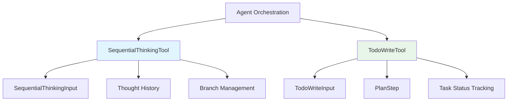

# Agent Reasoning and Planning State Tools 模块深度解析

## 概述

想象一下，你正在协助一位研究员解决一个复杂的问题。他们需要追踪自己的思考过程，记录每一步的推理，并管理多个研究任务。如果没有合适的工具，他们可能会忘记之前的思路，或者在多个任务之间迷失方向。

`agent_reasoning_and_planning_state_tools` 模块正是为了解决这个问题而设计的。它为 AI 代理提供了两个核心工具：
- **SequentialThinkingTool**：一个动态的、反思性的问题解决工具，帮助代理记录和管理自己的思考过程
- **TodoWriteTool**：一个结构化的任务列表管理工具，专门用于跟踪检索和研究任务

这两个工具协同工作，使得 AI 代理能够像人类研究员一样：有条理地思考、系统地规划任务、并透明地展示整个推理过程。

## 架构总览

这个模块的架构非常简洁但功能强大：

1. **SequentialThinkingTool**：
   - 维护思考历史记录
   - 支持分支思考和修订
   - 动态调整思考步骤数量
   - 生成假设并验证

2. **TodoWriteTool**：
   - 创建和管理检索任务列表
   - 跟踪任务状态（pending/in_progress/completed）
   - 确保任务按顺序执行
   - 防止过早总结

## 核心设计决策

### 1. 思考与任务的分离

**决策**：将思考过程（SequentialThinkingTool）与任务管理（TodoWriteTool）完全分离。

**为什么这样设计**：
- 思考过程是内在的、反思性的，而任务管理是外在的、执行性的
- 分离使得每个工具都能专注于自己的核心职责
- 便于独立测试和优化每个工具

**权衡**：
- ✅ 清晰的职责分离
- ✅ 更好的可维护性
- ❌ 需要协调两个工具的使用
- ❌ 增加了代理的使用复杂度

### 2. 动态思考而非线性思考

**决策**：SequentialThinkingTool 支持动态调整思考步骤、修订之前的想法、以及分支思考。

**为什么这样设计**：
- 现实世界的问题解决很少是完全线性的
- 需要能够在获得新信息后重新评估之前的结论
- 支持探索多个可能的解决方案路径

**权衡**：
- ✅ 更符合人类的思维模式
- ✅ 能够处理复杂、不确定的问题
- ❌ 增加了状态管理的复杂度
- ❌ 可能导致思考过程过于分散

### 3. TodoWriteTool 专注于检索任务

**决策**：TodoWriteTool 专门用于跟踪检索和研究任务，不包括总结或综合任务。

**为什么这样设计**：
- 检索任务是可以明确执行和验证的
- 总结和综合是思考过程的一部分，应该由 SequentialThinkingTool 处理
- 避免任务类型的混淆和重叠

**权衡**：
- ✅ 清晰的任务边界
- ✅ 确保检索任务得到充分执行
- ❌ 需要代理正确理解任务类型的区别
- ❌ 可能导致某些任务难以归类

## 子模块概览

### 1. 顺序推理工具合约与执行

这个子模块包含 SequentialThinkingTool 及其相关的数据结构。它负责管理动态思考过程，支持思考的修订、分支和历史记录。

**核心组件**：
- `SequentialThinkingTool`：主要的工具实现
- `SequentialThinkingInput`：输入参数定义

[详细查看子模块文档](agent_runtime_and_tools-agent_reasoning_and_planning_state_tools-sequential_reasoning_tool_contracts_and_execution.md)

### 2. 规划状态模型与步骤定义

这个子模块定义了任务规划的数据结构，包括 PlanStep 和相关的状态管理。

**核心组件**：
- `PlanStep`：单个计划步骤的定义
- 任务状态枚举（pending/in_progress/completed）

[详细查看子模块文档](agent_runtime_and_tools-agent_reasoning_and_planning_state_tools-planning_state_models_and_step_definitions.md)

### 3. Todo 计划状态写入工具

这个子模块包含 TodoWriteTool 的实现，负责创建和管理检索任务列表。

**核心组件**：
- `TodoWriteTool`：主要的工具实现
- `TodoWriteInput`：输入参数定义

[详细查看子模块文档](agent_runtime_and_tools-agent_reasoning_and_planning_state_tools-todo_plan_state_write_tool.md)

## 跨模块依赖

这个模块在整个系统中处于相对独立的位置，但与以下模块有重要交互：

1. **agent_core_orchestration_and_tooling_foundation**：
   - 依赖：使用 BaseTool 作为基础抽象
   - 交互：工具注册和执行流程

2. **frontend_contracts_and_state**：
   - 依赖：生成的工具结果需要符合前端展示合约
   - 交互：通过 display_type 字段指定展示类型

## 使用指南和注意事项

### 何时使用哪个工具？

**使用 SequentialThinkingTool 的场景**：
- 需要分解复杂问题
- 规划和设计需要修订的空间
- 问题的范围最初可能不清晰
- 需要多步骤解决方案

**使用 TodoWriteTool 的场景**：
- 复杂的多步骤检索任务
- 需要 3 个或更多不同步骤的操作
- 用户明确要求使用待办事项列表
- 用户提供多个任务

### 常见陷阱和注意事项

1. **不要在思考中提及工具名称**：
   - ❌ 错误："我将使用 grep_chunks 搜索关键词"
   - ✅ 正确："我将在知识库中搜索关键词"

2. **不要在 TodoWriteTool 中包含总结任务**：
   - ❌ 错误："总结研究结果"
   - ✅ 正确："搜索知识库获取 WeKnora 功能信息"

3. **确保任务状态正确更新**：
   - 一次只应有一个任务处于 in_progress 状态
   - 完成任务后立即标记为 completed
   - 只有在所有任务完成后才能进行总结

4. **思考过程的灵活性**：
   - 不要害怕修订之前的想法
   - 可以调整 total_thoughts 的数量
   - 可以表达不确定性和探索替代方案
