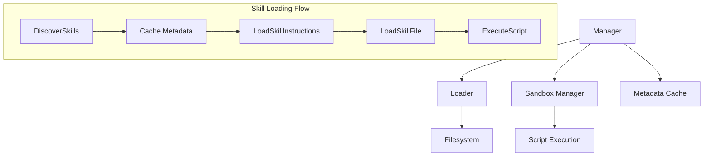

# Skill Loading and Lifecycle Management 模块深度解析

## 1. 模块概述

**Skill Loading and Lifecycle Management** 模块负责技能的发现、加载和生命周期管理，它是 Agent 系统的关键组成部分。

### 问题背景
想象一下，一个 Agent 系统需要能够动态地加载各种"技能"——比如数据分析、文档处理、API 调用等。如果每次都要重启系统才能加载新技能，或者技能之间没有良好的隔离，就会导致系统的可扩展性和安全性大打折扣。

本模块就是为了解决这些问题而设计的：它提供了一种渐进式的技能加载机制，确保技能能够安全、高效地被发现、加载和执行，同时保持系统的稳定性。

### 核心价值
- **渐进式加载**：先加载轻量级的元数据，再根据需要加载完整内容
- **安全性**：通过沙箱执行和路径验证确保技能不会危及系统安全
- **灵活性**：支持配置允许的技能列表，实现精细的权限控制

## 2. 架构设计

### 核心组件关系图



### 架构说明

这个模块采用了**分层协作**的设计模式：

1. **Loader 层**：负责与文件系统交互，发现技能目录，解析 SKILL.md 文件，并提供渐进式加载能力。
2. **Manager 层**：作为业务协调层，管理技能的生命周期，处理权限控制，并与沙箱执行系统集成。
3. **缓存机制**：通过内存缓存提高元数据访问性能，避免重复的文件系统操作。

这种设计实现了关注点分离：Loader 只关心如何从文件系统加载技能，而 Manager 则负责业务逻辑、安全控制和生命周期管理。

## 3. 核心设计决策

### 3.1 渐进式披露模式（Progressive Disclosure）

**设计选择**：技能加载分为三个层次：
- **Level 1**：只加载元数据（名称、描述等）
- **Level 2**：加载完整的技能说明
- **Level 3**：加载技能目录中的其他文件

**原因分析**：
- **性能优化**：系统启动时只需要加载轻量级的元数据，减少了 I/O 开销
- **按需加载**：只有当真正需要使用某个技能时，才会加载其完整内容
- **内存效率**：对于不常用的技能，不会占用过多内存

### 3.2 技能发现机制

**设计选择**：通过扫描指定目录下的子目录，寻找 SKILL.md 文件来发现技能。

**替代方案对比**：
- **配置文件注册**：需要手动维护配置文件，不够灵活
- **数据库存储**：增加了系统复杂度，不便于技能的本地开发和测试
- **当前方案**：自动发现，便于部署和扩展，技能可以直接作为文件夹分发

### 3.3 安全执行模型

**设计选择**：
- 路径遍历防护：验证文件路径是否在技能目录内
- 沙箱执行：通过 Sandbox Manager 执行技能脚本，隔离执行环境
- 白名单机制：支持配置允许的技能列表

**安全考量**：
技能本质上是第三方代码，必须假设它们是不可信的。通过多层安全机制，即使某个技能存在安全问题，也不会影响整个系统的安全。

## 4. 子模块概览

### 4.1 技能源加载（Skill Source Loading）

负责从文件系统发现和加载技能的原始数据。

- **核心组件**：[Loader](agent_runtime_and_tools-agent_skills_lifecycle_and_skill_tools-skill_loading_and_lifecycle_management-skill_source_loading.md)
- **主要职责**：技能发现、文件解析、渐进式加载
- **关键操作**：
  - `DiscoverSkills()`：扫描目录发现技能元数据
  - `LoadSkillInstructions()`：加载完整技能说明
  - `LoadSkillFile()`：加载技能目录中的其他文件

### 4.2 技能生命周期管理（Skill Lifecycle Management）

管理技能的完整生命周期，包括权限控制、缓存管理和执行协调。

- **核心组件**：
  - [Manager](agent_runtime_and_tools-agent_skills_lifecycle_and_skill_tools-skill_loading_and_lifecycle_management-skill_lifecycle_management.md)：主要协调器
  - [ManagerConfig](agent_runtime_and_tools-agent_skills_lifecycle_and_skill_tools-skill_loading_and_lifecycle_management-skill_lifecycle_management.md)：配置结构
  - [SkillInfo](agent_runtime_and_tools-agent_skills_lifecycle_and_skill_tools-skill_loading_and_lifecycle_management-skill_lifecycle_management.md)：技能信息结构
- **主要职责**：生命周期管理、权限控制、沙箱执行协调
- **关键操作**：
  - `Initialize()`：初始化并发现所有技能
  - `LoadSkill()`：加载技能完整内容
  - `ExecuteScript()`：在沙箱中执行技能脚本

## 5. 数据流程

### 技能发现与加载流程

1. **初始化阶段**
   ```
   Manager.Initialize() 
   → Loader.DiscoverSkills() 
   → 扫描目录寻找 SKILL.md 
   → 解析元数据 
   → 缓存元数据
   ```

2. **技能使用阶段**
   ```
   Manager.LoadSkill(skillName)
   → 权限验证
   → Loader.LoadSkillInstructions(skillName)
   → 检查缓存
   → 加载完整 SKILL.md
   → 返回 Skill 对象
   ```

3. **脚本执行阶段**
   ```
   Manager.ExecuteScript()
   → 权限验证
   → 加载脚本文件
   → 路径安全检查
   → 沙箱执行
   → 返回执行结果
   ```

## 6. 与其他模块的交互

### 依赖关系

- **Skill Definition Models**：定义了技能的数据模型（Skill、SkillMetadata 等）
- **Sandbox Execution**：提供安全的脚本执行环境
- **Agent Core Orchestration**：使用技能管理器来增强 Agent 的能力

### 集成点

这个模块是 Agent 技能系统的核心，它为上层提供了：
- 技能目录服务：提供可用技能的元数据
- 技能加载服务：按需加载技能内容
- 技能执行服务：安全地执行技能脚本

## 7. 使用指南与注意事项

### 配置要点

1. **技能目录配置**：
   - 设置合适的 `SkillDirs`，确保技能目录结构规范
   - 每个技能应该是一个独立的目录，包含 SKILL.md 文件

2. **权限控制**：
   - 在生产环境中，建议使用 `AllowedSkills` 白名单机制
   - 只允许加载经过验证的技能

### 常见陷阱

1. **路径安全**：
   - 不要绕过 `LoadSkillFile()` 的路径验证机制
   - 确保技能目录权限设置正确，防止未授权访问

2. **性能考量**：
   - 技能发现是 I/O 密集型操作，避免在热点路径频繁调用
   - 合理使用缓存，避免重复加载相同技能

3. **错误处理**：
   - 注意 `DiscoverSkills()` 会跳过无法访问的目录，不要假设所有技能都能被发现
   - 脚本执行可能失败，需要妥善处理执行结果

### 扩展建议

- 如果需要支持从其他来源（如数据库、远程仓库）加载技能，可以扩展 `Loader` 接口
- 对于大型系统，可以考虑实现技能版本管理和热更新机制
- 可以添加技能依赖管理，支持技能之间的依赖关系
