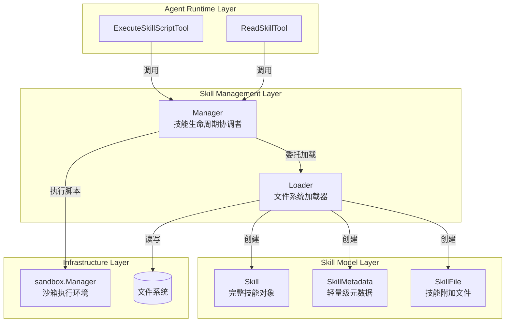

# Agent Skills 生命周期与技能工具

## 概述

想象一下，你正在构建一个通用型 AI 助手，但你希望它能够根据不同场景"变身"为专家——有时是财务分析师，有时是代码审查员，有时又是项目协调员。你不想为每种场景重新训练模型，也不想把所有专业知识都硬编码在系统提示词中。这就是 `agent_skills_lifecycle_and_skill_tools` 模块要解决的问题。

这个模块实现了 Claude 的**渐进式披露（Progressive Disclosure）**模式，让 Agent 能够按需加载专业技能。它的核心思想是：
- **Level 1（元数据）**：启动时只加载技能的名称和描述，避免系统提示词膨胀
- **Level 2（指令）**：当需要某个技能时，才加载完整的操作指南
- **Level 3（资源）**：根据需要加载技能目录中的额外文件和脚本

这种设计既保持了 Agent 的轻量级，又赋予了它无限的专业扩展能力。

## 架构概览



### 架构说明

这个模块采用了清晰的分层架构：

1. **工具层（Tool Layer）**：`ExecuteSkillScriptTool` 和 `ReadSkillTool` 是 Agent 可以直接调用的工具，它们提供了友好的接口让 Agent 与技能系统交互。

2. **管理层（Management Layer）**：`Manager` 是整个系统的协调者，它负责：
   - 技能的发现和缓存
   - 权限控制（允许列表）
   - 委托 `Loader` 进行文件系统操作
   - 协调 `Sandbox` 执行脚本

3. **加载层（Loading Layer）**：`Loader` 专注于文件系统操作，它实现了渐进式加载模式，能够：
   - 发现技能目录并提取元数据
   - 按需加载完整技能指令
   - 安全地加载技能目录中的附加文件

4. **模型层（Model Layer）**：`Skill`、`SkillMetadata` 和 `SkillFile` 定义了技能的数据结构，它们分别对应渐进式披露的三个级别。

## 核心设计决策

### 1. 渐进式披露 vs 一次性加载

**选择**：采用渐进式披露模式，分三级加载技能内容。

**权衡分析**：
- ✅ **优点**：
  - 系统提示词保持精简，只包含可用技能的元数据
  - 减少 Token 消耗，降低成本
  - 提高响应速度，只加载需要的内容
- ❌ **缺点**：
  - 增加了系统复杂度，需要管理多个加载阶段
  - Agent 需要额外调用工具才能获取完整技能信息

**为什么这样选择**：
在实际应用中，Agent 一次会话通常只会用到少数几个技能。如果一次性加载所有技能的完整内容，系统提示词会迅速膨胀，既增加成本又影响模型理解能力。渐进式披露在保持系统轻量的同时，提供了完整的扩展能力。

### 2. 文件系统存储 vs 数据库存储

**选择**：技能以文件系统目录结构存储，每个技能一个目录，包含 `SKILL.md` 和其他资源文件。

**权衡分析**：
- ✅ **优点**：
  - 人类可读可编辑，无需特殊工具
  - Git 友好，便于版本控制和协作
  - 无需数据库依赖，部署简单
- ❌ **缺点**：
  - 查询和索引能力有限
  - 并发写入冲突需要额外处理

**为什么这样选择**：
技能是相对静态的内容，主要由人类编写和维护。文件系统存储提供了最佳的可编辑性和可维护性，符合技能的使用场景。

### 3. 沙箱执行 vs 直接执行

**选择**：所有技能脚本都在沙箱环境中执行。

**权衡分析**：
- ✅ **优点**：
  - 安全性高，防止恶意脚本破坏系统
  - 资源隔离，避免脚本消耗过多资源
- ❌ **缺点**：
  - 增加了执行开销
  - 限制了脚本的能力（如网络访问）

**为什么这样选择**：
技能脚本来自不可信来源（至少在设计上假设如此），安全是首要考虑。沙箱执行提供了必要的安全保障，即使脚本存在问题也不会影响主系统。

## 子模块说明

### 技能定义模型（skill_definition_models）

这个子模块定义了技能的数据结构和验证规则，是整个系统的基础。它包含 `Skill`、`SkillMetadata` 和 `SkillFile` 等核心类型，以及 `ParseSkillFile` 等解析函数。

**核心概念**：
- `SkillFileName = "SKILL.md"`：技能定义文件的固定名称
- YAML frontmatter：用于存储技能元数据
- 三级加载模型：元数据 → 指令 → 资源文件

[查看详细文档 →](agent_runtime_and_tools-agent_skills_lifecycle_and_skill_tools-skill_definition_models.md)

### 技能加载与生命周期管理（skill_loading_and_lifecycle_management）

这是模块的核心，负责技能的发现、加载和生命周期管理。它包含 `Loader`（文件系统操作）和 `Manager`（生命周期协调）两个核心组件。

**核心流程**：
1. 启动时 `Manager.Initialize()` 调用 `Loader.DiscoverSkills()` 发现所有技能
2. Agent 通过 `ReadSkillTool` 调用 `Manager.LoadSkill()` 加载完整技能
3. Agent 通过 `ExecuteSkillScriptTool` 调用 `Manager.ExecuteScript()` 执行脚本

[查看详细文档 →](agent_runtime_and_tools-agent_skills_lifecycle_and_skill_tools-skill_loading_and_lifecycle_management.md)

### 技能执行工具（skill_execution_tool）

这个子模块提供了 `ExecuteSkillScriptTool`，让 Agent 能够在沙箱环境中执行技能脚本。它处理输入解析、参数验证、执行协调和结果格式化。

**安全特性**：
- 路径遍历防护
- 文件类型验证（只允许执行脚本文件）
- 沙箱环境隔离

[查看详细文档 →](agent_runtime_and_tools-agent_skills_lifecycle_and_skill_tools-skill_execution_tool.md)

### 技能读取工具（skill_reading_tool）

这个子模块提供了 `ReadSkillTool`，让 Agent 能够按需读取技能内容。它支持读取完整技能指令或特定附加文件，并格式化返回结果。

**用户体验优化**：
- 自动列出技能目录中的可用文件
- 标记可执行脚本
- 清晰的结果格式

[查看详细文档 →](agent_runtime_and_tools-agent_skills_lifecycle_and_skill_tools-skill_reading_tool.md)

## 跨模块依赖

### 输入依赖

- **[sandbox.Manager](platform_infrastructure_and_runtime-sandbox_execution_and_script_safety.md)**：技能脚本需要在沙箱中执行，`Manager` 依赖 `sandbox.Manager` 接口
- **[BaseTool](agent_runtime_and_tools-agent_core_orchestration_and_tooling_foundation-tool_definition_and_registry.md)**：技能工具继承自 `BaseTool`，融入工具系统

### 输出依赖

- **[Tool 接口](agent_runtime_and_tools-agent_core_orchestration_and_tooling_foundation-tool_execution_abstractions.md)**：`ReadSkillTool` 和 `ExecuteSkillScriptTool` 实现了工具接口，可供 Agent 调用
- **[types.ToolResult](core_domain_types_and_interfaces-agent_conversation_and_runtime_contracts.md)**：工具执行结果返回标准格式

## 新贡献者注意事项

### 1. 技能目录结构约定

每个技能必须是一个独立目录，包含：
```
my-skill/
├── SKILL.md          # 必需：技能定义文件
├── scripts/           # 可选：脚本目录
│   └── helper.py
└── docs/             # 可选：额外文档
    └── reference.md
```

`SKILL.md` 必须以 YAML frontmatter 开头：
```markdown
---
name: my-skill
description: 这是一个示例技能的描述
---

# 技能指令

这里是详细的操作指南...
```

### 2. 安全注意事项

- **路径遍历防护**：`Loader.LoadSkillFile()` 已经实现了路径遍历防护，但修改相关代码时要格外小心
- **文件类型验证**：只执行通过 `IsScript()` 验证的文件类型
- **沙箱配置**：确保沙箱配置正确，不要放宽不必要的限制

### 3. 性能考虑

- `DiscoverSkills()` 是 O(n) 操作，技能目录不要太深或包含太多无关文件
- 技能内容缓存是内存中的，注意大技能文件的内存占用
- `Reload()` 会清空缓存并重新发现所有技能，避免频繁调用

### 4. 常见陷阱

- **技能名称验证**：技能名称有严格限制（字母、数字、连字符），违反会导致加载失败
- **frontmatter 格式**：YAML frontmatter 必须正确闭合，否则解析失败
- **相对路径**：技能中的文件引用使用相对于技能目录的路径，不要使用绝对路径

## 总结

`agent_skills_lifecycle_and_skill_tools` 模块通过渐进式披露模式，为 Agent 提供了灵活而强大的技能扩展能力。它的设计平衡了功能性、安全性和性能，让 Agent 能够在保持轻量的同时，按需获取专业能力。

无论是构建专家系统、自动化工作流还是增强 Agent 的特定能力，这个模块都提供了坚实的基础。理解它的设计思想和实现细节，将帮助你更好地扩展和定制 Agent 的能力。
