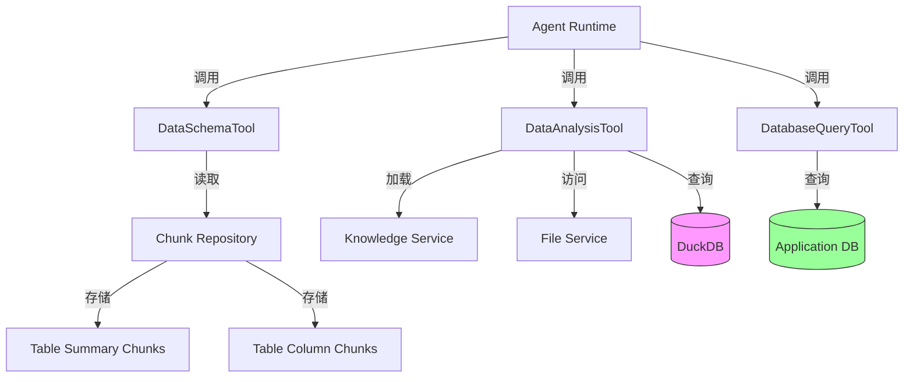

# data_and_database_introspection_tools 模块深度解析

## 1. 模块概述

在企业级知识管理和数据分析系统中，数据探索是一个核心挑战。用户需要能够：
- 快速了解结构化数据文件（CSV、Excel）的结构和内容
- 对这些数据进行灵活的查询和分析
- 安全地访问系统内部的元数据信息

`data_and_database_introspection_tools` 模块正是为解决这些问题而设计的。它提供了一套完整的工具链，使智能代理能够像数据分析师一样工作：先探索数据结构，再执行分析查询，最后获取有价值的洞察。

**想象一下**：这个模块就像给智能代理配备了一个"数据实验室"。`DataSchemaTool` 是实验室的"显微镜"，帮助代理看清数据的微观结构；`DataAnalysisTool` 是"实验台"，可以进行各种数据分析实验；而 `DatabaseQueryTool` 则是"档案室"，提供对系统元数据的安全访问。

## 2. 架构设计

### 2.1 核心架构图



### 2.2 架构详解

这个模块采用了"工具分离"的设计理念，将数据探索的三个关键环节解耦为独立的工具：

1. **DataSchemaTool（模式发现层）**：负责快速获取数据文件的结构信息
   - 不直接访问原始文件，而是从已索引的 chunk 中提取元数据
   - 提供轻量级的模式信息，适合初始探索

2. **DataAnalysisTool（数据计算层）**：负责对数据文件进行实际的计算和分析
   - 使用 DuckDB 作为内存中的分析引擎
   - 支持完整的 SQL 查询能力
   - 管理会话生命周期和资源清理

3. **DatabaseQueryTool（元数据访问层）**：负责安全地访问系统内部数据库
   - 提供对知识库、文档、chunk 等元数据的查询能力
   - 自动注入租户隔离条件
   - 严格的安全验证机制

### 2.3 数据流向

**典型的数据分析流程**：
```
用户问题 
  → Agent 调用 DataSchemaTool（了解数据结构）
  → Agent 调用 DataAnalysisTool（执行分析查询）
  → 返回分析结果
```

**元数据查询流程**：
```
用户问题 
  → Agent 调用 DatabaseQueryTool
  → 工具验证 SQL 并注入 tenant_id
  → 执行查询并返回结果
```

## 3. 核心设计决策

### 3.1 使用 DuckDB 作为分析引擎

**决策**：选择 DuckDB 而不是 SQLite 或其他内存数据库

**原因**：
- DuckDB 是列式存储，特别适合数据分析查询
- 原生支持 CSV 和 Excel 读取，无需额外转换
- 支持复杂的分析函数（窗口函数、聚合等）
- 内存中处理，性能优秀

**权衡**：
- ✅ 优点：分析性能好，功能强大
- ❌ 缺点：内存占用较高，不适合超大规模数据集

### 3.2 会话级别的表隔离

**决策**：每个会话创建独立的表，并在会话结束时清理

**原因**：
- 防止不同会话之间的数据污染
- 自动管理资源，避免内存泄漏
- 简化错误恢复（会话结束即清理）

**实现**：
```go
// 使用 knowledge ID 生成唯一表名
func (t *DataAnalysisTool) TableName(knowledge *types.Knowledge) string {
    return "k_" + strings.ReplaceAll(knowledge.ID, "-", "_")
}

// 记录创建的表以便清理
func (t *DataAnalysisTool) Cleanup(ctx context.Context) {
    for _, tableName := range t.createdTables {
        // DROP TABLE 语句
    }
}
```

### 3.3 多层安全验证

**决策**：在多个层面实施安全控制，而不是依赖单一验证

**DataAnalysisTool 的安全措施**：
1. 只读查询限制（只允许 SELECT/SHOW/DESCRIBE 等）
2. SQL 注入防护（使用 `utils.ValidateSQL`）
3. 表名白名单（只允许访问已加载的表）
4. 单语句限制（防止多语句攻击）

**DatabaseQueryTool 的安全措施**：
1. 自动注入 tenant_id 条件
2. 只读查询限制
3. 表名白名单
4. 注入风险检查

**设计哲学**："深度防御"——即使一层被突破，其他层仍然提供保护。

### 3.4 双模式数据模式获取

**决策**：提供两种获取数据模式的方式（chunk 索引和 DuckDB 直接读取）

**DataSchemaTool**：
- 从预索引的 chunk 中读取
- 快速、低开销
- 依赖知识摄入过程

**DataAnalysisTool.LoadFromTable**：
- 直接从 DuckDB 读取
- 更准确、实时
- 需要加载数据文件

**权衡**：在性能和准确性之间取得平衡，让 Agent 根据场景选择。

## 4. 子模块说明

### 4.1 schema_discovery_and_introspection

这个子模块专注于数据结构的发现和元数据的提取。它是整个数据分析流程的"眼睛"，帮助系统理解它正在处理什么样的数据。

**核心功能**：
- 从预索引的 chunk 中提取表结构信息
- 提供表名、列名、数据类型等元数据
- 支持跨租户的知识库访问

**主要组件**：
- `DataSchemaTool`：主要的模式发现工具
- `DataSchemaInput`：输入参数定义

详见：[schema_discovery_and_introspection](agent_runtime_and_tools-data_and_database_introspection_tools-schema_discovery_and_introspection.md)

### 4.2 database_query_execution

这个子模块处理对系统内部数据库的安全查询。它是智能代理访问系统元数据的"安全通道"。

**核心功能**：
- 安全的 SQL 查询执行
- 自动租户隔离
- 严格的权限控制
- 查询结果格式化

**主要组件**：
- `DatabaseQueryTool`：数据库查询工具
- `DatabaseQueryInput`：输入参数定义

详见：[database_query_execution](agent_runtime_and_tools-data_and_database_introspection_tools-database_query_execution.md)

### 4.3 tabular_data_analysis_and_structural_models

这个子模块是数据处理的"计算引擎"，负责实际的数据加载、查询执行和结果分析。

**核心功能**：
- CSV/Excel 文件加载到 DuckDB
- SQL 查询执行
- 表结构管理
- 会话生命周期管理

**主要组件**：
- `DataAnalysisTool`：数据分析工具
- `TableSchema`：表结构模型
- `ColumnInfo`：列信息模型
- `DataAnalysisInput`：输入参数定义

详见：[tabular_data_analysis_and_structural_models](agent_runtime_and_tools-data_and_database_introspection_tools-tabular_data_analysis_and_structural_models.md)

## 5. 依赖关系

### 5.1 内部依赖

```
data_and_database_introspection_tools
├── 依赖于 → core_domain_types_and_interfaces
│   ├── types.Knowledge
│   ├── types.ChunkType
│   └── types.Pagination
├── 依赖于 → data_access_repositories
│   └── interfaces.ChunkRepository
├── 依赖于 → application_services_and_orchestration
│   └── interfaces.KnowledgeService
│   └── interfaces.FileService
└── 依赖于 → platform_infrastructure_and_runtime
    └── utils.ValidateSQL
    └── utils.ValidateAndSecureSQL
```

### 5.2 外部依赖

- **GORM**：用于 DatabaseQueryTool 的数据库访问
- **database/sql**：用于 DataAnalysisTool 的 DuckDB 访问
- **DuckDB**：内存分析数据库（通过 SQL 接口）

## 6. 使用指南

### 6.1 典型使用场景

**场景 1：探索新数据集**
```go
// 1. 先获取数据结构
schemaTool := NewDataSchemaTool(knowledgeService, chunkRepo)
schemaResult, _ := schemaTool.Execute(ctx, json.RawMessage(`{"knowledge_id": "xxx"}`))

// 2. 再执行分析查询
analysisTool := NewDataAnalysisTool(knowledgeService, fileService, db, sessionID)
analysisResult, _ := analysisTool.Execute(ctx, json.RawMessage(`{"knowledge_id": "xxx", "sql": "SELECT COUNT(*) FROM xxx"}`))

// 3. 会话结束时清理
defer analysisTool.Cleanup(ctx)
```

**场景 2：查询系统元数据**
```go
queryTool := NewDatabaseQueryTool(gormDB)
result, _ := queryTool.Execute(ctx, json.RawMessage(`{"sql": "SELECT id, name FROM knowledge_bases LIMIT 10"}`))
```

### 6.2 注意事项和陷阱

1. **会话管理**：
   - ⚠️ 始终记得调用 `DataAnalysisTool.Cleanup()`，否则会造成内存泄漏
   - 💡 最好使用 `defer` 确保清理

2. **SQL 编写**：
   - ⚠️ DataAnalysisTool 中，SQL 里的表名需要使用 knowledge_id，工具会自动替换
   - ⚠️ DatabaseQueryTool 中，不要在 WHERE 子句中包含 tenant_id，会自动注入

3. **安全限制**：
   - ⚠️ 所有工具都只允许只读查询
   - ⚠️ 某些"危险"函数被禁止使用（如 `range()` 等）

4. **性能考虑**：
   - 💡 对于大数据集，建议使用 `LIMIT` 子句限制返回结果
   - 💡 DataSchemaTool 比 DataAnalysisTool 更轻量，优先使用

## 7. 扩展点和未来方向

### 7.1 当前扩展点

1. **自定义文件类型支持**：
   - 可以扩展 `DataAnalysisTool.LoadFromKnowledge` 支持更多格式
   - 当前支持 CSV、XLSX、XLS

2. **安全规则定制**：
   - `utils.ValidateSQL` 和 `utils.ValidateAndSecureSQL` 提供了选项配置
   - 可以调整允许的表、函数等

3. **结果格式化**：
   - `formatQueryResults` 方法可以被重写或扩展
   - 支持不同的输出格式

### 7.2 未来可能的改进

1. **支持更多数据源**：
   - Parquet、ORC 等列式存储格式
   - JSON 和 JSONL 文件
   - 直接从数据库连接加载数据

2. **增强的分析能力**：
   - 内置常用的统计函数
   - 数据可视化支持
   - 自动洞察生成

3. **性能优化**：
   - 查询结果缓存
   - 增量数据加载
   - 分布式查询支持

## 8. 总结

`data_and_database_introspection_tools` 模块是连接智能代理和数据洞察的桥梁。它通过精心设计的三个工具，覆盖了从数据探索到分析执行的完整流程，同时在安全性、性能和易用性之间取得了良好的平衡。

这个模块的设计体现了几个重要的软件工程原则：
- **关注点分离**：每个工具只负责一个明确的职责
- **深度防御**：多层安全机制保护系统
- **资源管理**：明确的生命周期管理防止泄漏
- **用户友好**：为 Agent 提供简单一致的接口

理解这个模块的关键是理解它如何让 Agent"思考"数据：先看结构，再做分析，最后获取结果——就像人类数据分析师一样。
