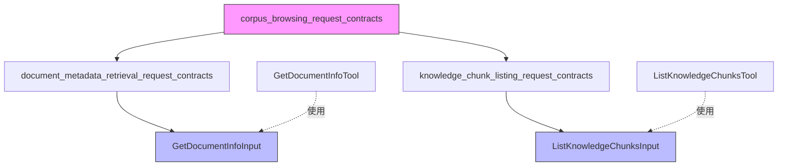
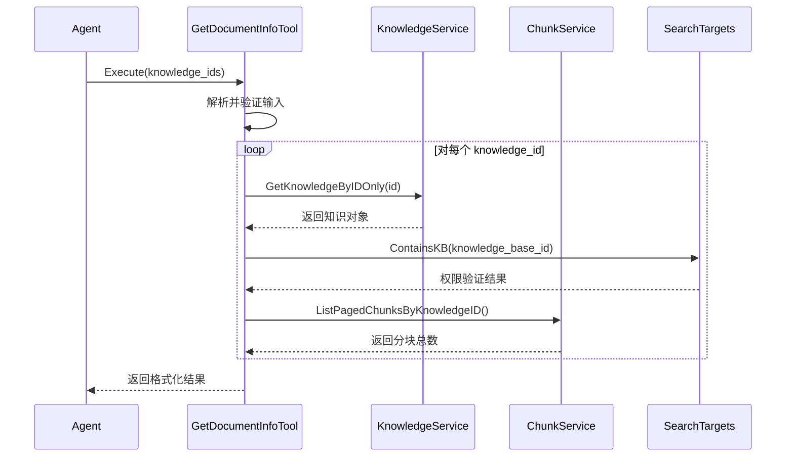
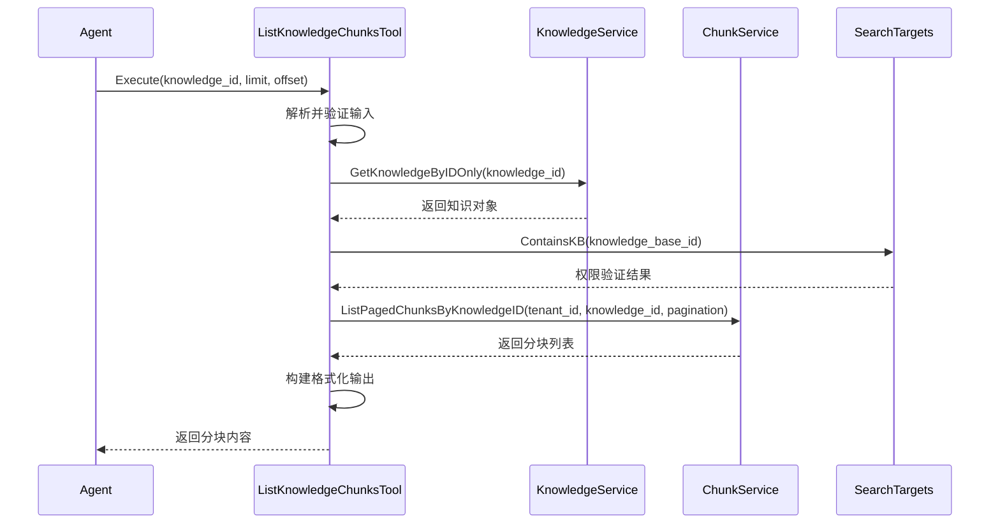

# corpus_browsing_request_contracts 模块深度解析

## 1. 模块概述

在智能助手与知识库交互的场景中，仅仅通过搜索找到相关文档往往是不够的。用户经常需要：
- 了解文档的基本信息（是否存在、处理状态、大小等）
- 查看文档的完整分块内容，而不只是搜索结果中的片段
- 在搜索结果的基础上，深入阅读某个特定文档的全部内容

**corpus_browsing_request_contracts** 模块正是为了解决这一问题而存在的。它定义了一套标准化的请求契约，使得智能助手能够以结构化的方式"浏览"知识库中的文档和分块，就像人类用户在文件系统中浏览文件一样。

想象一下这个模块是智能助手的"文档浏览器"——它不负责搜索（那是搜索引擎的工作），而是负责在你知道要找哪个文档后，帮你打开它、查看它的详细信息、以及阅读它的完整内容。

## 2. 核心组件与架构

### 2.1 组件关系图



### 2.2 核心组件详解

#### 2.2.1 GetDocumentInfoInput - 文档元数据检索请求

`GetDocumentInfoInput` 是文档元数据检索工具的输入契约，它定义了如何请求一个或多个文档的详细信息。

**设计意图**：
- 支持批量查询：一次可以获取多个文档的信息，减少网络往返
- 简洁的输入：只需要文档ID列表，符合"已知文档ID，查看详情"的使用场景

**核心字段**：
```go
type GetDocumentInfoInput struct {
    KnowledgeIDs []string `json:"knowledge_ids"` // 文档ID数组，支持批量查询
}
```

#### 2.2.2 ListKnowledgeChunksInput - 知识分块列表请求

`ListKnowledgeChunksInput` 是知识分块列表工具的输入契约，它定义了如何请求某个文档的完整分块内容。

**设计意图**：
- 分页支持：通过 limit 和 offset 实现分页浏览，避免一次性返回过多数据
- 灵活性：允许用户指定每页数量和起始位置

**核心字段**：
```go
type ListKnowledgeChunksInput struct {
    KnowledgeID string `json:"knowledge_id"` // 文档ID
    Limit       int    `json:"limit"`        // 每页分块数量（默认20，最大100）
    Offset      int    `json:"offset"`       // 起始位置（默认0）
}
```

## 3. 数据流程与交互

### 3.1 文档元数据检索流程

当智能助手需要获取文档信息时，数据流程如下：

1. **输入解析**：从 JSON 解析 `GetDocumentInfoInput`，提取 `knowledge_ids`
2. **参数验证**：确保 ID 列表非空且不超过 10 个
3. **并发查询**：
   - 对每个文档 ID，并发调用 `knowledgeService.GetKnowledgeByIDOnly` 获取文档元数据
   - 验证文档所属知识库是否在 `searchTargets` 中（权限检查）
   - 调用 `chunkService` 获取该文档的分块数量
4. **结果聚合**：收集成功和失败的结果，格式化输出



### 3.2 知识分块列表流程

当智能助手需要查看某个文档的完整分块内容时，数据流程如下：

1. **输入解析**：从 JSON 解析 `ListKnowledgeChunksInput`
2. **参数验证**：确保 `knowledge_id` 有效
3. **文档查询**：调用 `knowledgeService.GetKnowledgeByIDOnly` 获取文档信息
4. **权限验证**：检查文档所属知识库是否在 `searchTargets` 中
5. **分块查询**：使用文档的实际 `tenant_id` 调用 `chunkService` 获取分页分块
6. **结果格式化**：构建友好的输出格式，包含分块内容和关联图片信息



## 4. 关键设计决策

### 4.1 批量查询与并发处理

**决策**：`GetDocumentInfoInput` 支持批量查询，并在实现中使用并发处理。

**为什么这样设计**：
- 性能优化：当需要查询多个文档信息时，并发查询可以显著减少总等待时间
- 成本考虑：减少网络往返次数，降低系统开销

**权衡**：
- ✅ 优点：更好的性能，更快的响应时间
- ⚠️ 缺点：实现复杂度增加，需要处理部分失败的情况
- 🎯 限制：最多只能查询 10 个文档，防止过载

### 4.2 跨租户共享知识库支持

**决策**：使用 `GetKnowledgeByIDOnly` 而不是带租户过滤的查询，并在获取分块时使用文档的实际 `tenant_id`。

**为什么这样设计**：
- 支持共享知识库：允许一个租户访问另一个租户共享的知识库
- 数据隔离：仍然通过 `searchTargets` 进行权限验证，确保安全

**权衡**：
- ✅ 优点：灵活的共享机制，支持多租户协作
- ⚠️ 缺点：需要小心处理租户上下文，避免权限泄漏
- 🔒 保障：通过 `searchTargets.ContainsKB` 确保只有授权的知识库可以访问

### 4.3 分页设计

**决策**：`ListKnowledgeChunksInput` 使用 `limit` 和 `offset` 进行分页，而不是基于页码的设计。

**为什么这样设计**：
- 灵活性：`offset` 提供了更细粒度的控制，可以从任意位置开始
- 兼容性：符合常见的 API 设计模式，易于理解和使用

**权衡**：
- ✅ 优点：灵活，直观
- ⚠️ 缺点：对于非常大的偏移量，性能可能会下降（但在这个场景下不太可能，因为文档分块数量有限）
- 🎯 限制：最大 `limit` 为 100，防止一次性返回过多数据

## 5. 与其他模块的关系

### 5.1 依赖模块

- **document_metadata_retrieval_tool**：使用 `GetDocumentInfoInput` 作为输入契约
- **knowledge_chunk_listing_tool**：使用 `ListKnowledgeChunksInput` 作为输入契约
- **core_domain_types_and_interfaces**：依赖 `types.Knowledge`、`types.Chunk` 等核心领域模型
- **data_access_repositories**：通过接口依赖知识库和分块的存储服务

### 5.2 协作流程

典型的使用场景是：
1. 用户提问 → 智能助手使用 `knowledge_search` 找到相关文档
2. 智能助手使用 `GetDocumentInfoInput` 查询这些文档的详细信息
3. 根据需要，智能助手使用 `ListKnowledgeChunksInput` 查看某个文档的完整分块内容

## 6. 使用指南与注意事项

### 6.1 使用场景

**GetDocumentInfoInput 适用于**：
- 需要确认文档是否存在
- 需要查看文档的基本信息（标题、大小、处理状态等）
- 批量查询多个文档的元数据

**ListKnowledgeChunksInput 适用于**：
- 需要阅读某个文档的完整内容
- 需要查看搜索结果中某个片段的上下文
- 需要了解文档的分块结构

### 6.2 常见陷阱

1. **忘记权限检查**：直接使用文档 ID 查询时，确保通过 `searchTargets` 验证权限
2. **忽略分页**：对于长文档，一次性获取所有分块可能不现实，记得使用分页
3. **并发安全**：在扩展 `GetDocumentInfoInput` 时，注意并发处理的线程安全
4. **租户上下文**：处理跨租户共享知识库时，确保使用文档的实际 `tenant_id`

### 6.3 扩展建议

如果需要扩展这个模块，可以考虑：
- 添加更多过滤条件（如按分块类型、时间范围等）
- 支持更复杂的分页（如基于游标的分页）
- 添加缓存机制，减少对底层服务的压力
- 支持导出文档内容为其他格式

## 7. 子模块说明

本模块包含两个子模块，分别处理不同的浏览需求：

- **[document_metadata_retrieval_request_contracts](agent_runtime_and_tools-knowledge_access_and_corpus_navigation_tools-corpus_document_and_chunk_browsing-corpus_browsing_request_contracts-document_metadata_retrieval_request_contracts.md)**：专注于文档元数据检索的请求契约
- **[knowledge_chunk_listing_request_contracts](agent_runtime_and_tools-knowledge_access_and_corpus_navigation_tools-corpus_document_and_chunk_browsing-corpus_browsing_request_contracts-knowledge_chunk_listing_request_contracts.md)**：专注于知识分块列表的请求契约

这两个子模块在单独的文档中详细介绍。
