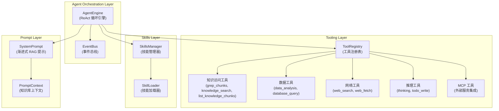

# Agent Runtime and Tools

## 模块概览

`agent_runtime_and_tools` 是整个系统的核心编排层，实现了一个基于 ReAct (Reasoning + Acting) 范式的智能代理引擎。这个模块负责协调 LLM 思考、工具调用、知识检索和响应生成的完整流程。

**核心价值**：它将复杂的多步骤问题分解为 "思考-行动-观察" 的迭代循环，让 AI 能够像人类研究员一样工作——先理解问题，制定计划，使用工具检索信息，反思结果，最后给出完整答案。

**类比**：你可以把这个模块想象成一个研究团队的指挥中心。AgentEngine 是项目经理，负责规划整体流程；Tools 是各个领域的专家（搜索专家、数据分析师、网络爬虫等）；Skills 是可重用的专业方法论。整个系统协同工作，解决复杂的信息检索和分析任务。

## 架构总览

### 架构解读

这个模块采用了清晰的四层架构：

1. **编排层（Orchestration Layer）**：由 `AgentEngine` 主导，实现 ReAct 循环。它负责状态管理、流程控制和事件分发。
2. **工具层（Tooling Layer）**：提供各种专业能力的工具集，从知识检索到数据分析，再到网络搜索。
3. **技能层（Skills Layer）**：实现"渐进式披露"（Progressive Disclosure）模式，允许按需加载专业方法论。
4. **提示层（Prompt Layer）**：构建动态的系统提示，注入知识库上下文、技能元数据等信息。

**数据流向**：用户查询 → AgentEngine（构建上下文）→ LLM 思考 → 工具调用 → 结果观察 → 下一轮思考 → 最终答案。

## 核心设计决策

### 1. ReAct 范式作为核心编排模式

**选择**：采用 ReAct (Reasoning + Acting) 模式，而不是简单的单次 LLM 调用。

**为什么这样设计**：
- **复杂问题处理**：许多查询需要多步检索和推理，单次调用无法完成
- **可解释性**：每一步思考和行动都可见，便于调试和理解
- **容错性**：如果某一步出错，可以在下一步反思和修正
- **渐进式信息收集**：可以根据中间结果调整检索策略

**权衡**：
- ✅ 优点：更强的问题解决能力，更透明的决策过程
- ❌ 缺点：更高的延迟（多次 LLM 调用），更多的 token 消耗

### 2. 工具优先的"证据优先"（Evidence-First）哲学

**选择**：系统被设计为**从不**依赖 LLM 的参数知识，所有答案必须基于检索到的证据。

**为什么这样设计**：
- **准确性**：LLM 会产生幻觉（hallucination），检索到的文档是真实可信的
- **可追溯性**：每个答案都有引用来源（chunk_id, doc_name）
- **领域适配**：可以针对特定领域的知识库工作，无需重新训练模型

**实现细节**：
- 系统提示明确禁止使用内部知识
- 强制要求"深度阅读"（Deep Read）：搜索后必须调用 `list_knowledge_chunks` 查看完整内容
- 要求内联引用，每个事实声明必须紧跟来源

### 3. 渐进式 RAG（Progressive Agentic RAG）

**选择**：不是一次性检索所有可能相关的内容，而是采用"侦察-计划-执行"的三阶段流程。

**流程**：
1. **初步侦察**：先用 `grep_chunks` 和 `knowledge_search` 进行试探性检索
2. **深度阅读**：对找到的 ID 调用 `list_knowledge_chunks` 获取完整内容
3. **战略决策**：根据深度阅读结果决定是直接回答还是制定复杂计划

**为什么这样设计**：
- **避免信息过载**：先了解信息地形，再决定深入方向
- **上下文效率**：有限的上下文窗口中，只放入最相关的完整内容
- **自适应检索**：可以根据初步结果调整检索策略

### 4. 技能系统的渐进式披露（Progressive Disclosure）

**选择**：技能系统采用三级披露模式：
- **Level 1**：只在系统提示中显示技能名称和描述（元数据）
- **Level 2**：当需要时，调用 `read_skill` 加载完整指令
- **Level 3**：如果需要，使用 `execute_skill_script` 运行配套脚本

**为什么这样设计**：
- **提示空间优化**：不需要的技能不会占用宝贵的上下文
- **按需加载**：只有在相关时才加载完整指令
- **可扩展性**：可以添加数十个技能而不影响默认行为

### 5. 事件驱动的流式输出

**选择**：AgentEngine 不直接返回结果，而是通过 EventBus 发出事件，由外部处理器监听并流式传输给用户。

**事件类型**：
- `agent_thought`：思考内容（流式）
- `agent_tool_call`：工具调用开始
- `agent_tool_result`：工具调用结果
- `agent_final_answer`：最终答案（流式）
- `agent_complete`：执行完成

**为什么这样设计**：
- **解耦**：引擎不需要知道是 HTTP 流式、WebSocket 还是其他输出方式
- **实时性**：思考过程可以实时展示给用户，降低感知延迟
- **可观测性**：多个订阅者可以监听事件用于日志、监控、调试等

## 子模块概览

这个模块被组织成多个高内聚、低耦合的子模块：

| 子模块 | 职责 | 关键组件 |
|--------|------|----------|
| [agent_core_orchestration_and_tooling_foundation](agent_runtime_and_tools-agent_core_orchestration_and_tooling_foundation.md) | 核心引擎、工具注册和执行抽象 | AgentEngine, ToolRegistry, BaseTool |
| [agent_skills_lifecycle_and_skill_tools](agent_runtime_and_tools-agent_skills_lifecycle_and_skill_tools.md) | 技能的发现、加载和执行 | SkillsManager, SkillLoader, Skill |
| [knowledge_access_and_corpus_navigation_tools](agent_runtime_and_tools-knowledge_access_and_corpus_navigation_tools.md) | 知识库检索和文档浏览工具 | grep_chunks, knowledge_search, list_knowledge_chunks |
| [data_and_database_introspection_tools](agent_runtime_and_tools-data_and_database_introspection_tools.md) | 数据查询和分析工具 | data_analysis, database_query, data_schema |
| [web_and_mcp_connectivity_tools](agent_runtime_and_tools-web_and_mcp_connectivity_tools.md) | 网络搜索和外部服务集成 | web_search, web_fetch, MCPTool |
| [agent_reasoning_and_planning_state_tools](agent_runtime_and_tools-agent_reasoning_and_planning_state_tools.md) | 推理和计划工具 | sequential_thinking, todo_write |

## 与其他模块的依赖关系

`agent_runtime_and_tools` 是一个**消费者**模块，它依赖系统的多个核心服务，但被设计为与具体实现解耦：

### 主要依赖

1. **Chat Model** (`chat.Chat`)：LLM 提供商接口，用于思考和生成
   - 用于：流式思考、最终答案生成、反思
   - 集成点：`AgentEngine.streamThinkingToEventBus`、`AgentEngine.streamFinalAnswerToEventBus`

2. **Knowledge Services** (`interfaces.KnowledgeService`, `interfaces.KnowledgeBaseService`)：知识库访问
   - 用于：文档检索、分块获取
   - 集成点：多个知识工具（`knowledge_search`, `list_knowledge_chunks` 等）

3. **Chunk Service** (`interfaces.ChunkService`)：分块访问
   - 用于：获取完整分块内容
   - 集成点：`list_knowledge_chunks` 工具

4. **Web Search Service** (`interfaces.WebSearchService`)：网络搜索
   - 用于：实时信息检索
   - 集成点：`web_search` 工具

5. **Event Bus** (`event.EventBus`)：事件分发
   - 用于：流式输出、可观测性
   - 集成点：`AgentEngine` 所有执行步骤

6. **Context Manager** (`interfaces.ContextManager`)：对话上下文管理
   - 用于：持久化对话历史
   - 集成点：`AgentEngine.appendToolResults`

7. **Sandbox Manager** (`sandbox.Manager`)：沙箱执行
   - 用于：安全执行技能脚本
   - 集成点：`SkillsManager.ExecuteScript`

### 设计原则：依赖倒置

注意所有依赖都是通过**接口**注入的，而不是具体实现。这使得：
- 可以轻松编写单元测试（使用 mock 实现）
- 可以替换服务实现而不影响代理逻辑
- 模块保持聚焦于自身职责，不关心服务如何实现

## 关键使用场景与流程

### 典型的 ReAct 执行流程

让我们通过一个具体例子来看系统如何工作：

**用户查询**："比较 WeKnora 和 LangChain 的 RAG 实现，列出它们的优缺点"

1. **初始化**：
   - `AgentEngine` 接收查询
   - 构建包含知识库信息的系统提示
   - 初始化对话消息列表

2. **第一轮思考（Think）**：
   - 调用 LLM，提供工具列表
   - LLM 决定：这是复杂任务，需要先搜索，再制定计划
   - 流式输出思考内容给用户

3. **第一轮行动（Act）**：
   - 调用 `todo_write` 创建研究计划：
     1. 搜索知识库中的 WeKnora 信息
     2. 使用 web_search 查找 LangChain 资料
     3. 比较两者架构
   - 标记任务 1 为 in_progress

4. **第二轮观察（Observe）**：
   - 工具结果添加到消息历史
   - 进入下一轮循环

5. **第二轮思考（Think）**：
   - LLM 看到 todo_write 结果，继续执行计划
   - 决定调用 `grep_chunks(["WeKnora", "RAG", "architecture"])`

6. **第二轮行动（Act）**：
   - 执行 `grep_chunks`，找到相关文档 ID
   - **关键**：根据系统提示的"深度阅读"规则，**必须**调用 `list_knowledge_chunks` 查看完整内容

7. **第二轮观察（Observe）**：
   - `list_knowledge_chunks` 返回完整文档内容
   - 添加到消息历史

...（这个循环继续，执行计划中的每个任务）...

N. **最终综合**：
    - 所有检索任务完成后
    - LLM 综合所有收集的信息
    - 流式输出最终答案，包含内联引用
    - 发出 `agent_complete` 事件

### 技能使用流程

当启用技能时，流程略有不同：

1. **Level 1 - 发现**：
   - 系统提示中包含所有可用技能的名称和描述
   - LLM "看到"有一个 "产品比较分析" 技能与当前任务匹配

2. **Level 2 - 加载**：
   - LLM 决定使用该技能，调用 `read_skill(skill_name="product_comparison")`
   - 完整的技能指令加载到对话中

3. **Level 3 - 应用**：
   - LLM 按照技能指令进行比较分析
   - 如果需要，调用 `execute_skill_script` 运行辅助脚本
   - 按照技能指定的格式输出结果

## 新贡献者注意事项

### 常见陷阱

1. **跳过"深度阅读"**：
   - ❌ 错误：搜索后直接根据摘要回答
   - ✅ 正确：始终调用 `list_knowledge_chunks` 查看完整内容
   - 为什么：搜索摘要可能不完整或有误导性

2. **工具名称泄露**：
   - ❌ 错误：在思考中说"我将使用 grep_chunks"
   - ✅ 正确：说"我将搜索关键词"
   - 为什么：用户不应该知道底层工具，关注要做什么而不是怎么做

3. **跳过 KB 直接使用网络搜索**：
   - ❌ 错误：一上来就 web_search
   - ✅ 正确：先 grep_chunks，再 knowledge_search，最后才 web_search
   - 为什么：知识库内容更可靠、更相关，也更省钱

4. **在 todo_write 中添加综合任务**：
   - ❌ 错误：任务包括"总结发现"、"生成最终答案"
   - ✅ 正确：只包括检索任务，综合由 thinking 工具处理
   - 为什么：职责分离，todo_write 跟踪检索，thinking 处理综合

### 扩展点

#### 添加新工具

1. 在 `internal/agent/tools/` 创建新文件，遵循现有模式
2. 实现 `types.Tool` 接口（Name, Description, Parameters, Execute）
3. 在注册时添加到 `ToolRegistry`
4. 在 `definitions.go` 的 `AvailableToolDefinitions` 中添加 UI 定义
5. 在 `DefaultAllowedTools` 中考虑是否默认启用

#### 添加新技能

1. 在技能目录创建子文件夹
2. 创建 `SKILL.md`，包含 YAML frontmatter 和指令
3. 可选：添加配套脚本和资源文件
4. 技能会在启动时自动发现，无需代码更改

#### 自定义系统提示

1. 提供自定义 `systemPromptTemplate` 给 `NewAgentEngine`
2. 使用支持的占位符：`{{knowledge_bases}}`、`{{web_search_status}}`、`{{current_time}}`
3. 占位符会在运行时自动替换

## 总结

`agent_runtime_and_tools` 模块是整个系统的大脑，它通过 ReAct 模式将 LLM 的推理能力与各种工具的执行能力结合起来。其核心设计理念——证据优先、渐进式检索、技能的按需披露——都指向一个目标：**让 AI 像一个谨慎、彻底的研究员那样工作**。

这个模块不是一个简单的"问答机器"，而是一个**研究引擎**。它不会急于给出答案，而是先侦察、再计划、然后深入调查，最后基于确凿证据给出完整、可追溯的结论。
