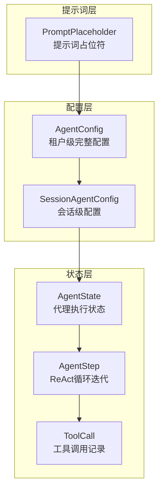

# Agent Runtime State and Configuration Contracts

## 概述

这个模块定义了代理运行时的核心契约和数据结构，它就像是代理系统的"宪法"——规定了代理如何思考、行动、记忆和配置。在一个复杂的多代理系统中，这个模块确保了所有组件对"代理是什么"和"代理如何工作"有统一的理解。

想象一下，你正在构建一个自动驾驶系统：`AgentState` 是汽车的仪表盘，显示当前位置、速度和行程历史；`AgentConfig` 是汽车的配置文件，定义了最大速度、燃油效率和安全设置；而 `AgentStep` 则是每一步的驾驶决策记录。这个模块为整个代理系统提供了这样的基础架构。

## 架构概览



这个架构体现了清晰的分层设计：

1. **配置层**：定义代理的行为参数，从租户级的完整配置（`AgentConfig`）到会话级的覆盖配置（`SessionAgentConfig`）
2. **状态层**：跟踪代理的执行过程，从整体状态（`AgentState`）到单个迭代步骤（`AgentStep`）再到具体的工具调用（`ToolCall`）
3. **提示词层**：提供可扩展的提示词模板系统（`PromptPlaceholder`）

## 核心组件详解

### AgentConfig - 代理的完整配置

`AgentConfig` 是代理配置的"单一事实来源"，它包含了代理执行所需的所有参数。这个结构设计体现了**渐进式披露**和**向后兼容**的设计原则。

```go
type AgentConfig struct {
    MaxIterations     int      // ReAct循环的最大迭代次数
    ReflectionEnabled bool     // 是否启用反思功能
    AllowedTools      []string // 允许使用的工具列表
    Temperature       float64  // LLM温度参数
    // ... 更多配置字段
}
```

**设计亮点**：
- **统一系统提示词**：从旧的双字段设计（`SystemPromptWebEnabled`/`SystemPromptWebDisabled`）迁移到统一的 `SystemPrompt` 字段，使用占位符来动态处理不同状态
- **数据库序列化支持**：实现了 `driver.Valuer` 和 `sql.Scanner` 接口，可以直接存储到数据库
- **MCP服务选择**：提供了灵活的MCP服务选择机制（"all"、"selected"、"none"）

### AgentState - 代理的执行状态

`AgentState` 跟踪代理在整个执行过程中的状态，就像飞机的黑匣子一样记录着每一个决策和行动。

```go
type AgentState struct {
    CurrentRound  int             // 当前轮次
    RoundSteps    []AgentStep     // 当前轮次的所有步骤
    IsComplete    bool            // 是否已完成
    FinalAnswer   string          // 最终答案
    KnowledgeRefs []*SearchResult // 收集的知识引用
}
```

这个结构设计考虑了**多轮对话**和**复杂推理**的需求：
- 支持多轮对话（`CurrentRound`）
- 保存完整的推理轨迹（`RoundSteps`）
- 收集知识引用以便后续验证（`KnowledgeRefs`）

### AgentStep - ReAct循环的单步记录

`AgentStep` 代表了ReAct（Reasoning + Acting）循环中的一次完整迭代，包含了思考过程和行动结果。

```go
type AgentStep struct {
    Iteration int        // 迭代编号（0索引）
    Thought   string     // LLM的推理/思考（思考阶段）
    ToolCalls []ToolCall // 此步骤中调用的工具（行动阶段）
    Timestamp time.Time  // 此步骤发生的时间
}
```

**设计亮点**：
- **清晰的阶段分离**：`Thought` 表示推理阶段，`ToolCalls` 表示行动阶段
- **向后兼容**：`GetObservations()` 方法为旧代码提供兼容性支持
- **时间戳记录**：每个步骤都有精确的时间记录，便于调试和性能分析

### PromptPlaceholder - 提示词模板系统

`PromptPlaceholder` 提供了一个类型安全的提示词模板系统，允许在运行时动态替换提示词中的变量。

```go
type PromptPlaceholder struct {
    Name        string // 占位符名称（不带大括号）
    Label       string // 简短标签
    Description string // 占位符描述
}
```

**设计亮点**：
- **按字段类型分类**：`PlaceholdersByField()` 函数根据不同的提示词字段类型返回可用的占位符
- **多语言支持**：标签和描述支持本地化（当前示例包含中文）
- **完整的占位符目录**：`AllPlaceholders()` 和 `PlaceholderMap()` 提供了全局的占位符索引

## 设计决策分析

### 1. 配置分层 vs 单一配置

**选择**：采用了 `AgentConfig`（租户级）和 `SessionAgentConfig`（会话级）的分层设计

**权衡**：
- ✅ **优点**：允许在不同级别上灵活配置，租户可以设置默认值，会话可以覆盖特定参数
- ⚠️ **缺点**：增加了配置合并的复杂性，需要明确的优先级规则

**原因**：在多租户系统中，这种分层设计是必要的——它既保证了租户的统一管理能力，又提供了会话级的灵活性。

### 2. 统一系统提示词 vs 条件提示词

**选择**：从双字段设计迁移到统一的 `SystemPrompt` 字段，使用占位符处理动态行为

**权衡**：
- ✅ **优点**：更灵活、更可扩展，不需要为每种可能的状态组合创建单独的字段
- ⚠️ **缺点**：需要实现占位符替换逻辑，增加了一定的复杂性

**原因**：随着功能的增加（如MCP服务、技能等），为每种状态组合创建单独的提示词字段是不可持续的。统一的提示词+占位符设计更具扩展性。

### 3. 完整状态跟踪 vs 最小状态

**选择**：保存完整的执行轨迹（`AgentState` → `AgentStep` → `ToolCall`）

**权衡**：
- ✅ **优点**：完整的可观测性，便于调试、分析和用户反馈
- ⚠️ **缺点**：内存和存储开销较大，需要考虑清理策略

**原因**：在AI代理系统中，可解释性和可调试性是关键。完整的状态跟踪不仅有助于开发调试，也为用户提供了透明度。

## 数据流分析

让我们追踪一个典型的代理执行流程：

1. **配置初始化**：
   - 从租户配置加载 `AgentConfig`
   - 从会话配置加载 `SessionAgentConfig`
   - 合并两者，会话配置覆盖租户配置的特定字段

2. **状态创建**：
   - 创建初始的 `AgentState`，`CurrentRound` 设置为0，`IsComplete` 为false

3. **ReAct循环执行**：
   - 对于每次迭代：
     - 创建新的 `AgentStep`，记录 `Thought`
     - 执行工具调用，创建 `ToolCall` 记录
     - 将 `AgentStep` 添加到 `AgentState.RoundSteps`

4. **完成判断**：
   - 检查是否达到 `MaxIterations` 或代理得出最终答案
   - 如果完成，设置 `IsComplete` 为true，保存 `FinalAnswer`

## 与其他模块的关系

这个模块是代理系统的核心契约，被多个上层模块依赖：

- **[agent_core_orchestration_and_tooling_foundation](../agent_core_orchestration_and_tooling_foundation.md)**：使用这些契约来 orchestrate 代理的执行
- **[agent_orchestration_service_and_task_interfaces](../agent_orchestration_service_and_task_interfaces.md)**：依赖这些契约来定义服务接口
- **[chat_completion_and_streaming_contracts](../chat_completion_and_streaming_contracts.md)**：与这些契约协作处理流式响应

## 使用指南和注意事项

### 配置合并策略

当合并 `AgentConfig` 和 `SessionAgentConfig` 时，遵循以下优先级：
1. 会话级配置覆盖租户级配置
2. 对于列表类型（如 `KnowledgeBases`），会话配置完全替换租户配置
3. 对于布尔类型，会话配置的显式设置覆盖租户配置

### 向后兼容性

- `SystemPromptWebEnabled` 和 `SystemPromptWebDisabled` 已被标记为废弃，新代码应使用 `SystemPrompt` 字段
- `ResolveSystemPrompt()` 方法提供了向后兼容的提示词解析逻辑
- `GetObservations()` 方法为旧代码提供了兼容性支持

### 性能考虑

- `AgentState` 可能会变得很大，特别是在长时间运行的对话中
- 考虑实现状态清理策略，只保留最近的N个步骤
- 对于持久化存储，考虑使用压缩或增量存储

### 扩展点

- 可以通过添加新的 `PromptPlaceholder` 来扩展提示词系统
- `AgentConfig` 可以通过添加新字段来支持新的代理功能
- 可以实现自定义的配置合并逻辑来满足特定需求

## 子模块文档

- [agent_runtime_state_and_step_models](core-domain-types-and-interfaces-agent-conversation-and-runtime-contracts-agent-runtime-and-tool-call-contracts-agent-runtime-state-and-configuration-contracts-agent-runtime-state-and-step-models.md)：详细介绍状态模型和步骤记录
- [agent_configuration_scopes](core-domain-types-and-interfaces-agent-conversation-and-runtime-contracts-agent-runtime-and-tool-call-contracts-agent-runtime-state-and-configuration-contracts-agent-configuration-scopes.md)：深入探讨配置范围和合并策略
- [prompt_placeholder_contracts](core-domain-types-and-interfaces-agent-conversation-and-runtime-contracts-agent-runtime-and-tool-call-contracts-agent-runtime-state-and-configuration-contracts-prompt-placeholder-contracts.md)：完整的提示词占位符系统文档
