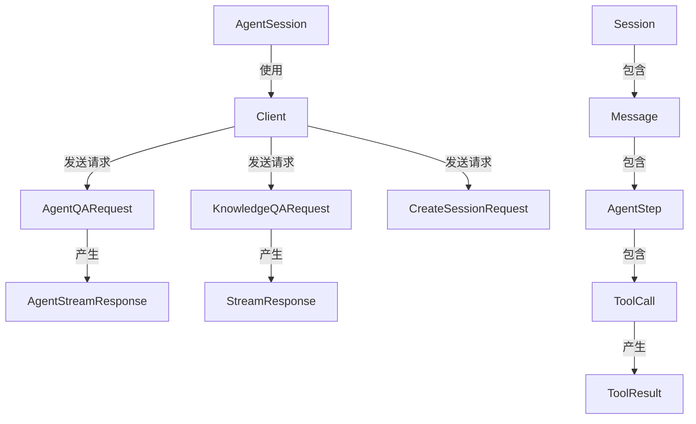

# Agent Session and Message API 模块

## 概述

想象一下，你正在构建一个智能对话系统，用户可以与 AI 助手进行多轮对话，AI 可以调用工具、搜索知识库、甚至上网查找信息。你需要一个系统来管理这些对话的生命周期、记录每一条消息、处理流式响应，并让 AI 的思考过程透明可见。这就是 `agent_session_and_message_api` 模块要解决的问题。

这个模块是整个 SDK 客户端库的核心对话层，它提供了一套完整的 API，让开发者能够：
- 创建和管理对话会话（Session）
- 发送查询并接收流式响应
- 查看 AI 的推理过程和工具调用
- 检索历史消息和引用内容

## 架构概览



这个模块的架构可以分为三个主要层次：

1. **会话管理层**：由 `Session`、`CreateSessionRequest` 等组件组成，负责会话的创建、查询、更新和删除。会话现在是独立于知识库的容器，所有配置在查询时通过自定义代理提供。

2. **对话交互层**：由 `AgentSession`、`AgentQARequest`、`KnowledgeQARequest` 等组件组成，负责发送查询并处理响应。这里支持两种主要模式：
   - 代理模式（Agent Mode）：AI 可以自主决策、调用工具、进行多步推理
   - 知识库问答模式：直接基于知识库内容回答问题

3. **消息和事件层**：由 `Message`、`AgentStep`、`ToolCall`、`AgentStreamResponse` 等组件组成，负责表示对话中的各种事件和数据结构。这一层让 AI 的思考过程完全透明，开发者可以看到每一步推理、工具调用和结果。

## 核心设计决策

### 1. 会话与知识库解耦

**设计选择**：会话不再绑定到特定的知识库，而是作为纯对话容器存在。

**原因**：
- 灵活性：用户可以在同一个会话中切换不同的知识库
- 简化：会话管理更简单，不需要在创建时就确定所有配置
- 向前兼容：为未来的多知识库对话和动态配置打下基础

**权衡**：
- 每次查询都需要指定知识库，增加了请求的复杂度
- 但换来的是更大的灵活性和更好的用户体验

### 2. 流式响应作为一等公民

**设计选择**：所有对话 API 都优先支持 SSE（Server-Sent Events）流式响应。

**原因**：
- 用户体验：用户可以实时看到 AI 的回复，而不是等待完整响应
- 长响应处理：对于长回答，可以逐步展示，避免超时
- 交互性：可以在生成过程中展示思考过程和工具调用

**实现方式**：
- 使用回调函数模式，每个事件触发一次回调
- 保留 `done` 标志来标识流的结束
- 支持多种事件类型（思考、工具调用、结果、引用等）

### 3. 透明的代理思考过程

**设计选择**：完整暴露 AI 的 ReAct（Reasoning + Acting）循环，包括思考过程、工具调用和结果。

**原因**：
- 可调试性：开发者可以理解 AI 为什么做出某个决策
- 可信度：用户可以看到 AI 的推理过程，增加对结果的信任
- 可扩展性：可以基于思考过程构建更复杂的交互模式

**数据结构**：
- `AgentStep`：表示一次 ReAct 循环迭代
- `ToolCall`：表示一次工具调用
- `ToolResult`：表示工具执行结果
- `AgentStreamResponse`：流式传输这些事件

## 子模块概览

这个模块可以进一步划分为以下子模块：

- **[session_lifecycle_api](session_lifecycle_api.md)**：会话的创建、查询、更新、删除等生命周期管理
- **[session_qa_and_search_api](session_qa_and_search_api.md)**：知识库问答和搜索功能
- **[session_streaming_and_llm_calls_api](session_streaming_and_llm_calls_api.md)**：流式响应处理和 LLM 工具调用
- **[message_trace_and_tool_events_api](message_trace_and_tool_events_api.md)**：消息历史和工具事件追踪
- **[agent_conversation_api](agent_conversation_api.md)**：代理对话的高级封装

每个子模块都有其专门的职责，共同构成了完整的对话 API 体系。详细信息请参考各子模块的文档。

## 跨模块依赖

这个模块是 `sdk_client_library` 的核心组件之一，它与其他模块的关系如下：

- 依赖于 `core_client_runtime` 提供的底层 HTTP 客户端功能
- 与 `knowledge_and_chunk_api` 配合使用，提供知识库相关的对话能力
- 为上层应用提供完整的对话交互接口

## 使用指南

### 创建会话

```go
client := NewClient(/* 配置 */)
session, err := client.CreateSession(ctx, &CreateSessionRequest{
    Title: "我的对话",
    Description: "关于产品文档的对话",
})
```

### 发送代理查询

```go
agentSession := client.NewAgentSession(session.ID)
err := agentSession.Ask(ctx, "如何使用这个 API？", func(resp *AgentStreamResponse) error {
    switch resp.ResponseType {
    case AgentResponseTypeThinking:
        fmt.Println("AI 正在思考:", resp.Content)
    case AgentResponseTypeAnswer:
        fmt.Print(resp.Content)
    case AgentResponseTypeDone:
        fmt.Println("\n完成")
    }
    return nil
})
```

### 检索历史消息

```go
messages, err := client.GetRecentMessages(ctx, session.ID, 10)
for _, msg := range messages {
    fmt.Printf("%s: %s\n", msg.Role, msg.Content)
}
```

## 注意事项和陷阱

1. **流式响应的错误处理**：回调函数返回的错误会中断流处理，确保你只在真正需要停止时返回错误。

2. **会话 ID 的管理**：会话 ID 是字符串，确保在使用前检查其非空。

3. **消息的时间过滤**：使用 `LoadMessages` 时，时间格式必须是 RFC3339Nano。

4. **代理模式的配置**：使用 `AgentQARequest` 时，`AgentEnabled` 字段必须设置为 true 才能启用代理模式。

5. **SSE 流的解析**：内部使用 `bufio.Scanner` 解析 SSE 流，对于超大响应可能需要调整缓冲区大小。
