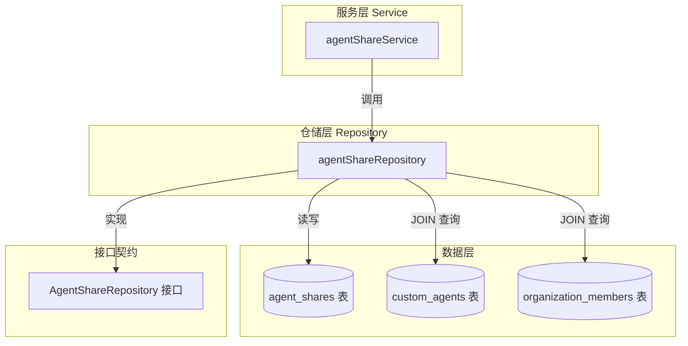

# agent_share_access_repository 模块技术深度解析

## 概述：为什么需要这个模块？

想象一个多租户 SaaS 系统：租户 A 创建了一个强大的客服 Agent，现在想把它分享给合作组织 B 使用。但这里有个关键问题——**Agent 的所有权仍然属于租户 A，组织 B 只是获得了访问权限**。这种"所有权与访问权分离"的场景，正是 `agent_share_access_repository` 模块存在的根本原因。

这个模块的核心职责是**管理 Agent 共享关系的持久化层**。它不决定"谁可以共享给谁"（这是服务层的业务逻辑），也不处理"共享后如何访问"（这是权限校验层的职责），它只专注于一件事：**可靠地记录和维护 Agent 与组织之间的共享关系**。

为什么不能简单地用一张表随便 CRUD？因为这里有几个容易被忽视的复杂性：
1. **软删除语义**：共享关系删除后需要可恢复，且查询时必须自动过滤已删除的记录
2. **重复共享防护**：同一个 Agent 不能重复共享给同一个组织
3. **跨表一致性**：查询共享记录时，必须确保对应的 Agent 本身没有被删除
4. **多维度查询**：需要支持按 Agent 查、按组织查、按用户查、批量查询等多种场景

这个模块通过 Repository 模式封装了所有这些复杂性，让上层服务只需关注业务逻辑，而不必关心数据库查询的细节。

---

## 架构定位与数据流

### 模块在系统中的位置



### 数据流分析

**核心数据模型 `AgentShare` 的结构关系：**

```
┌─────────────────────────────────────────────────────────────┐
│                      AgentShare 记录                          │
├─────────────────────────────────────────────────────────────┤
│  id (PK)                                                    │
│  agent_id          ─────────────┐                           │
│  source_tenant_id  ───────┐     │  联合唯一约束              │
│  organization_id   ───┐   │     │  (防止重复共享)            │
│  deleted_at        │  │   │     │                           │
│  ...               │  │   │     │                           │
└────────────────────┼──┼───┼─────┘                           │
                     │  │   │                                  │
                     │  │   └──→ organizations 表              │
                     │  │       (通过 Preload 加载)             │
                     │  │                                      │
                     │  └──────→ tenants 表 (隐式关联)          │
                     │                                         │
                     └─────────→ custom_agents 表              │
                               (JOIN 确保 Agent 未删除)          │
```

**典型查询路径：**

1. **按组织查询共享 Agent** (`ListByOrganization`)：
   ```
   用户请求 → Service → Repository → 
   JOIN custom_agents (过滤 deleted_at) → 
   Preload Agent + Organization → 返回结果
   ```

2. **按用户查询可访问的共享 Agent** (`ListSharedAgentsForUser`)：
   ```
   用户请求 → Service → Repository → 
   JOIN organization_members (WHERE user_id = ?) →
   JOIN organizations (过滤 deleted_at) →
   JOIN custom_agents (过滤 deleted_at) → 返回结果
   ```

---

## 核心组件深度解析

### `agentShareRepository` 结构体

```go
type agentShareRepository struct {
    db *gorm.DB
}
```

**设计意图**：这是一个典型的 Repository 模式实现，只依赖一个 `*gorm.DB` 实例。这种极简设计有几个好处：

1. **依赖最小化**：除了数据库连接，不依赖任何其他组件，便于单元测试
2. **无状态设计**：每个方法都是纯函数式的，不维护内部状态，线程安全
3. **接口隔离**：通过 `interfaces.AgentShareRepository` 接口暴露能力，隐藏实现细节

**关键设计决策**：为什么选择结构体而不是接口内联方法？
- Go 的接口是隐式的，结构体实现接口方法后自动满足接口契约
- 这种设计允许未来扩展（比如添加缓存层、日志中间件）而不改变接口

---

### 核心方法详解

#### 1. `Create` —— 带防重复的创建

```go
func (r *agentShareRepository) Create(ctx context.Context, share *types.AgentShare) error
```

**为什么需要先查后创？**

 naive 做法是直接 `INSERT`，依赖数据库唯一索引报错。但这里选择先 `COUNT` 再 `CREATE`：

```go
// 先检查是否存在
r.db.WithContext(ctx).Model(&types.AgentShare{}).
    Where("agent_id = ? AND source_tenant_id = ? AND organization_id = ? AND deleted_at IS NULL", ...).
    Count(&count)
if count > 0 {
    return ErrAgentShareAlreadyExists
}
// 再创建
return r.db.WithContext(ctx).Create(share).Error
```

**设计权衡**：
- **优点**：可以返回语义化的错误 `ErrAgentShareAlreadyExists`，上层服务可以给出友好的错误提示
- **缺点**：存在竞态条件（两个并发请求可能同时通过检查），需要上层服务加锁或依赖数据库唯一索引兜底
- **为什么这样选**：在共享 Agent 这种低频操作场景，可读性优于极致的并发性能

**关键细节**：查询条件包含 `deleted_at IS NULL`，这意味着**已删除的共享记录不算数**，可以重新创建。这是软删除语义的重要体现。

---

#### 2. `GetByAgentAndOrg` —— 按联合键查询

```go
func (r *agentShareRepository) GetByAgentAndOrg(ctx context.Context, agentID string, orgID string) (*types.AgentShare, error)
```

**为什么需要这个方法？**

`GetByID` 已经可以按主键查询，但业务场景中更常见的是"查询某个 Agent 是否已共享给某个组织"。这个方法封装了这个高频查询模式。

**注意**：这个方法**没有过滤 `deleted_at`**，这意味着它可以查到已删除的记录。这是有意为之的设计：
- 上层服务可以根据需要决定是否接受已删除的记录
- 某些场景（如恢复已删除的共享）需要访问已删除的数据

---

#### 3. `DeleteByAgentIDAndSourceTenant` —— 级联软删除

```go
func (r *agentShareRepository) DeleteByAgentIDAndSourceTenant(ctx context.Context, agentID string, sourceTenantID uint64) error
```

**使用场景**：当 Agent 被删除时，需要清理所有相关的共享记录。

**为什么需要 `sourceTenantID` 参数？**

因为 `agent_id` 本身不是全局唯一的（不同租户可以有相同 ID 的 Agent），必须联合 `source_tenant_id` 才能唯一确定一个 Agent。这反映了系统的多租户架构设计。

**软删除语义**：这个方法调用的是 GORM 的 `Delete`，默认会设置 `deleted_at` 字段而不是物理删除。这意味着：
- 共享关系可以恢复
- 所有查询方法必须显式过滤 `deleted_at IS NULL`

---

#### 4. `ListByOrganization` —— 带 JOIN 的复杂查询

```go
func (r *agentShareRepository) ListByOrganization(ctx context.Context, orgID string) ([]*types.AgentShare, error)
```

**这个方法的复杂性被严重低估了**。让我们拆解它的 SQL 逻辑：

```go
Joins("JOIN custom_agents ON custom_agents.id = agent_shares.agent_id AND custom_agents.tenant_id = agent_shares.source_tenant_id AND custom_agents.deleted_at IS NULL").
Preload("Agent").
Preload("Organization").
Where("agent_shares.organization_id = ? AND agent_shares.deleted_at IS NULL", orgID)
```

**为什么要 JOIN `custom_agents` 表？**

这是一个**数据一致性保护机制**。想象这个场景：
1. 租户 A 把 Agent X 共享给组织 B
2. 租户 A 删除了 Agent X
3. 组织 B 查询共享列表时，不应该看到已删除的 Agent

通过 JOIN 并过滤 `custom_agents.deleted_at IS NULL`，确保**只返回仍然有效的 Agent 的共享记录**。

**设计权衡**：
- **优点**：数据一致性由数据库保证，不会查到"僵尸"共享记录
- **缺点**：查询性能略低（需要 JOIN），但在这个低频场景可以接受
- **替代方案**：可以在删除 Agent 时异步清理共享记录，但会增加系统复杂性

---

#### 5. `ListByOrganizations` —— 批量查询优化

```go
func (r *agentShareRepository) ListByOrganizations(ctx context.Context, orgIDs []string) ([]*types.AgentShare, error)
```

**为什么需要批量查询？**

当用户属于多个组织时，需要一次性查询所有组织的共享 Agent，避免 N+1 查询问题。

**关键优化点**：
```go
if len(orgIDs) == 0 {
    return nil, nil
}
```

这个看似简单的检查避免了 `WHERE IN ()` 导致的 SQL 语法错误。这是一个常见的坑，很多开发者会忘记处理空切片的情况。

---

#### 6. `CountByOrganizations` —— 聚合查询

```go
func (r *agentShareRepository) CountByOrganizations(ctx context.Context, orgIDs []string) (map[string]int64, error)
```

**使用场景**：在组织列表页面显示每个组织的共享 Agent 数量。

**设计亮点**：
```go
out := make(map[string]int64)
for _, o := range orgIDs {
    out[o] = 0  // 初始化为 0
}
for _, r := range rows {
    out[r.OrgID] = r.Count
}
```

这个设计确保**即使某个组织没有共享记录，也会在返回结果中出现（计数为 0）**。这对前端展示非常重要——不需要额外处理缺失的 key。

---

#### 7. `ListSharedAgentsForUser` —— 基于用户权限的查询

```go
func (r *agentShareRepository) ListSharedAgentsForUser(ctx context.Context, userID string) ([]*types.AgentShare, error)
```

**这是最复杂的查询方法**，涉及 4 表 JOIN：

```
agent_shares 
  → JOIN custom_agents (确保 Agent 有效)
  → JOIN organization_members (找到用户所属组织)
  → JOIN organizations (确保组织有效)
```

**查询逻辑**：
1. 找到用户所属的所有组织
2. 找到这些组织的所有共享记录
3. 过滤已删除的共享和已删除的 Agent

**设计意图**：这个方法是"用户视角"的查询——用户不关心共享关系的技术细节，只关心"我能访问哪些共享 Agent"。

---

#### 8. `GetShareByAgentIDForUser` —— 带排除条件的单条查询

```go
func (r *agentShareRepository) GetShareByAgentIDForUser(ctx context.Context, userID, agentID string, excludeTenantID uint64) (*types.AgentShare, error)
```

**为什么需要 `excludeTenantID` 参数？**

这是一个精细的权限控制设计。场景：
- 用户属于租户 A，也加入了组织 B
- 租户 A 有一个 Agent X
- 组织 B 也有一个共享的 Agent X（来自租户 C）

当用户在组织 B 的上下文中查询时，应该看到租户 C 共享的 Agent X，而不是租户 A 自己的 Agent X。`excludeTenantID` 参数用于排除用户当前租户的 Agent，只显示真正的"共享"Agent。

**设计洞察**：这个参数反映了系统对"共享"的精确定义——**跨租户的访问授权才算共享，同租户内的访问是原生权限**。

---

## 依赖关系分析

### 上游依赖（谁调用这个模块）

| 调用方 | 调用场景 | 期望的契约 |
|--------|----------|------------|
| [`agentShareService`](agent_share_service.md) | 所有共享业务逻辑 | 返回的 `AgentShare` 已预加载关联数据 |
| [`organizationService`](organization_service.md) | 组织管理相关查询 | 批量查询方法支持高效聚合 |
| HTTP Handlers | API 请求处理 | 错误类型可区分（NotFound vs AlreadyExists） |

### 下游依赖（这个模块调用谁）

| 被调用方 | 调用原因 | 耦合程度 |
|----------|----------|----------|
| `gorm.DB` | 数据库操作 | 紧耦合（直接依赖 GORM API） |
| `types.AgentShare` | 数据模型 | 紧耦合（依赖具体结构） |
| `context.Context` | 超时和取消控制 | 松耦合（标准库接口） |

### 数据契约

**输入契约**：
- `AgentShare` 结构体必须包含 `AgentID`、`SourceTenantID`、`OrganizationID` 字段
- 所有查询方法必须传入有效的 `context.Context`

**输出契约**：
- 查询不存在时返回 `ErrAgentShareNotFound`（不是 `nil`）
- 重复创建时返回 `ErrAgentShareAlreadyExists`
- 成功查询时 `Agent` 和 `Organization` 关联已预加载（针对 List 方法）

---

## 设计决策与权衡

### 1. 软删除 vs 硬删除

**选择**：软删除（使用 `deleted_at` 字段）

**原因**：
- 共享关系可能需要恢复（误操作场景）
- 需要保留审计日志（谁在什么时候共享了什么）
- 级联删除时，软删除比硬删除更安全

**代价**：
- 所有查询必须显式过滤 `deleted_at IS NULL`
- 表数据会随时间增长（需要定期归档）
- 唯一索引需要包含 `deleted_at` 条件

**风险点**：如果开发者忘记加 `deleted_at IS NULL` 条件，会查到已删除的数据。这是一个常见的 bug 来源。

---

### 2. Repository 模式 vs 直接 GORM

**选择**：Repository 模式（封装 GORM）

**原因**：
- 隔离业务逻辑与数据库细节
- 便于单元测试（可以 mock Repository 接口）
- 统一错误处理和数据转换逻辑

**代价**：
- 增加了一层抽象，调试时需要跳转
- 新增查询方法需要修改接口和实现

**扩展点**：未来可以在 Repository 层添加缓存、日志、指标收集等横切关注点，而不影响服务层代码。

---

### 3. 预加载策略

**选择**：在 List 方法中自动 `Preload("Agent").Preload("Organization")`

**原因**：
- 避免 N+1 查询问题
- 上层服务通常都需要这些关联数据
- 减少服务层代码复杂度

**代价**：
- 即使不需要关联数据，也会执行额外的 JOIN
- 对于只需要计数的场景（如 `CountByOrganizations`），预加载是浪费的

**改进空间**：可以提供 `ListByOrganizationWithoutPreload` 变体，让调用者按需选择。

---

### 4. 错误处理策略

**选择**：定义特定的错误类型（`ErrAgentShareNotFound`、`ErrAgentShareAlreadyExists`）

**原因**：
- 上层服务可以根据错误类型给出不同的响应
- 比直接返回 `gorm.ErrRecordNotFound` 更语义化
- 便于日志记录和监控

**代价**：
- 需要维护错误类型列表
- 新增错误场景需要添加新的错误类型

---

## 使用指南与示例

### 基本使用模式

```go
// 1. 创建仓储实例
repo := NewAgentShareRepository(db)

// 2. 创建共享记录
share := &types.AgentShare{
    AgentID:        "agent-123",
    SourceTenantID: 1001,
    OrganizationID: "org-456",
}
err := repo.Create(ctx, share)
if errors.Is(err, ErrAgentShareAlreadyExists) {
    // 处理重复共享
}

// 3. 查询组织的共享 Agent
shares, err := repo.ListByOrganization(ctx, "org-456")
for _, share := range shares {
    fmt.Println(share.Agent.Name)  // Agent 已预加载
}

// 4. 删除共享
err = repo.Delete(ctx, share.ID)  // 软删除
```

### 批量查询优化

```go
// 用户属于多个组织时，使用批量查询
orgIDs := []string{"org-1", "org-2", "org-3"}
shares, err := repo.ListByOrganizations(ctx, orgIDs)

// 获取每个组织的共享数量
counts, err := repo.CountByOrganizations(ctx, orgIDs)
// counts["org-1"] = 5  (即使 org-1 没有共享，也会返回 0)
```

### 用户权限查询

```go
// 查询用户可访问的所有共享 Agent
shares, err := repo.ListSharedAgentsForUser(ctx, userID)

// 查询用户对特定 Agent 的访问权限（排除自己租户的）
share, err := repo.GetShareByAgentIDForUser(ctx, userID, agentID, currentTenantID)
if errors.Is(err, ErrAgentShareNotFound) {
    // 用户无权访问该 Agent
}
```

---

## 边界情况与注意事项

### 1. 并发创建竞态条件

**问题**：两个并发请求同时调用 `Create`，可能都通过 `COUNT` 检查，导致重复插入。

**缓解措施**：
- 数据库层面应添加唯一索引：`UNIQUE INDEX idx_agent_org (agent_id, source_tenant_id, organization_id, deleted_at)`
- 上层服务在调用 `Create` 前应加锁或使用事务

**检测方式**：捕获 `Create` 返回的错误，如果是数据库唯一索引冲突，按 `ErrAgentShareAlreadyExists` 处理。

---

### 2. 软删除数据泄露

**问题**：开发者忘记加 `deleted_at IS NULL` 条件，查到已删除的共享记录。

**防护措施**：
- 代码审查时重点检查 WHERE 条件
- 考虑使用 GORM 的软删除插件（`gorm.Model`），自动过滤 `deleted_at`
- 单元测试覆盖已删除数据的查询场景

---

### 3. JOIN 查询性能

**问题**：`ListByOrganization` 和 `ListSharedAgentsForUser` 涉及多表 JOIN，数据量大时可能变慢。

**优化建议**：
- 确保 `agent_id`、`source_tenant_id`、`organization_id`、`deleted_at` 字段有合适的索引
- 监控慢查询日志，必要时添加覆盖索引
- 考虑读写分离，将复杂查询路由到只读副本

---

### 4. 空切片处理

**问题**：`ListByOrganizations` 和 `CountByOrganizations` 接收空切片时，`WHERE IN ()` 会导致 SQL 语法错误。

**已处理**：代码中已有 `if len(orgIDs) == 0` 检查。

**注意事项**：调用方应确保传入非空切片，或接受返回 `nil` 的结果。

---

### 5. 多租户 ID 唯一性

**问题**：`agent_id` 不是全局唯一的，必须联合 `source_tenant_id` 才能唯一标识一个 Agent。

**防护措施**：
- 所有涉及 `agent_id` 的查询，必须同时使用 `source_tenant_id`
- `DeleteByAgentIDAndSourceTenant` 方法名明确体现了这个要求
- 代码审查时检查是否有遗漏 `source_tenant_id` 的查询

---

## 相关模块参考

- [agentShareService](agent_share_service.md) — 使用本仓储的服务层，实现共享业务逻辑
- [organizationService](organization_service.md) — 组织管理服务，调用本仓储查询组织维度的共享
- [AgentShare 类型定义](core_domain_types_and_interfaces.md) — `types.AgentShare` 结构体详解
- [AgentShareRepository 接口](core_domain_types_and_interfaces.md) — 接口契约定义

---

## 总结

`agent_share_access_repository` 是一个设计精良的 Repository 模式实现，它：

1. **职责单一**：只负责 Agent 共享关系的持久化，不掺杂业务逻辑
2. **接口清晰**：通过接口隔离实现与上层服务的解耦
3. **数据一致**：通过 JOIN 查询确保共享记录与 Agent 状态一致
4. **语义丰富**：定义特定错误类型，便于上层处理
5. **扩展友好**：无状态设计，便于添加缓存、日志等横切关注点

对于新加入的开发者，理解这个模块的关键是把握**软删除语义**和**多租户联合键**这两个核心概念。所有看似复杂的设计决策，都源于对这两个概念的严格遵守。
