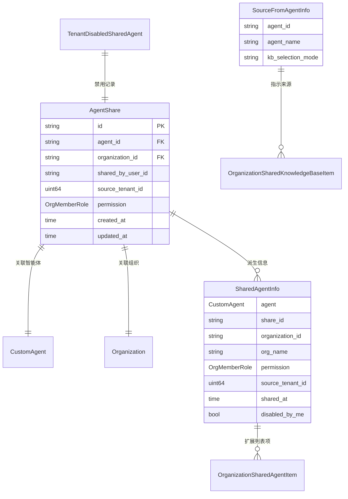

# agent_share_domain_and_source_models 模块技术深度文档

## 1. 模块概述

`agent_share_domain_and_source_models` 模块是组织资源共享子系统的核心数据模型层，专门负责定义智能体（Agent）共享的领域模型和数据结构。在多租户、多组织的协作环境中，这个模块解决了一个关键问题：如何让不同租户的用户通过组织安全地共享和使用智能体，同时保持清晰的访问控制和来源追踪。

想象一下组织就像一个共享工作空间，智能体共享就像是将你的工具放到这个共享空间里，但需要精确控制谁能使用、怎么使用，还要记录这个工具来自哪里。这个模块就是定义这些"工具共享记录"和"使用规则"的蓝图。

## 2. 核心架构

### 2.1 架构角色定位

这个模块在整个系统架构中扮演着**数据契约定义者**的角色：
- 它是数据层的"标准语言"，定义了智能体共享的核心数据结构
- 为上层服务提供数据模型支持
- 与知识库共享模型共同构成组织资源共享的基础设施

### 2.2 核心组件关系图



## 3. 核心组件深度解析

### 3.1 AgentShare - 智能体共享记录

**设计意图**：这是整个模块的核心实体，代表一次智能体到组织的共享操作。它不仅仅是一个关联记录，还承载了权限控制、来源追踪和审计的重要职责。

**内部机制**：
- 使用复合外键 `(AgentID, SourceTenantID)` 关联 `CustomAgent`，这是因为智能体在不同租户间可能有相同 ID，必须结合租户 ID 才能唯一标识
- `SourceTenantID` 字段是跨租户共享的关键，它记录了智能体的原始归属，确保在跨组织使用时能正确追踪资源来源
- 支持软删除（`DeletedAt`），这对于审计和历史记录非常重要，即使撤销共享也能保留操作历史

**关键字段解析**：
```go
type AgentShare struct {
    ID             string         // 共享记录唯一标识
    AgentID        string         // 被共享的智能体ID
    OrganizationID string         // 目标组织ID
    SharedByUserID string         // 执行共享操作的用户ID
    SourceTenantID uint64         // 智能体所属的原始租户ID（关键！）
    Permission     OrgMemberRole  // 共享权限级别（viewer/editor/admin）
    // ... 时间戳和关联字段
}
```

**为什么需要 SourceTenantID？**
这是一个关键的设计决策。在多租户系统中，资源通常与租户隔离。当智能体被共享到组织后，组织内的其他租户用户需要访问这个智能体，系统必须知道：
1. 这个智能体属于哪个原始租户（用于权限验证和资源访问）
2. 即使智能体被删除或共享被撤销，也能保留历史记录的完整性
3. 支持跨租户的资源引用和统计

### 3.2 SourceFromAgentInfo - 知识库来源指示器

**设计意图**：这是一个巧妙的设计，用于处理"间接可见"的知识库。当一个智能体被共享到组织，而这个智能体配置了某些知识库时，这些知识库对组织成员来说是"通过智能体可见"的，但并没有直接的知识库共享记录。这个结构体就是用来表示这种间接关系的。

**使用场景**：
- 当用户在组织中查看共享知识库列表时，有些知识库不是直接共享的，而是通过某个共享智能体"带进来"的
- 这种情况下，需要显示"来自智能体 XXX"的提示，并且这些知识库是只读的
- `KBSelectionMode` 字段告诉前端智能体对知识库的选择策略（全部/选中/无），用于在界面上显示友好的提示信息

**为什么不直接创建知识库共享记录？**
这是一个重要的设计权衡：
1. **权限隔离**：通过智能体间接访问的知识库应该受到智能体配置的限制，而不是直接授予用户访问权限
2. **配置同步**：如果智能体的知识库配置发生变化，用户可见的知识库列表应该自动同步，而不需要手动更新共享记录
3. **用户体验**：明确区分"直接共享给我"和"通过智能体可用"两种情况，避免用户混淆

### 3.3 SharedAgentInfo - 共享智能体详情

**设计意图**：这是一个聚合数据结构，用于在列表和详情页面展示共享智能体的完整信息。它将 `AgentShare` 记录、`CustomAgent` 实体、组织信息以及用户个人偏好组合在一起，提供一站式的数据视图。

**关键点**：
- `DisabledByMe` 字段是用户级别的偏好设置，允许用户在自己的界面中隐藏某些共享智能体，而不影响其他用户
- 包含了共享者信息（`SharedByUserID`、`SharedByUsername`），这对于协作场景中的溯源和沟通很重要
- 将权限、来源、时间等审计信息集中展示

### 3.4 TenantDisabledSharedAgent - 租户级禁用记录

**设计意图**：这是一个租户级别的配置记录，用于记录某个租户在其上下文中"禁用"了某个共享智能体。与 `SharedAgentInfo.DisabledByMe` 不同，这个是租户级别的设置。

**使用场景**：
- 租户管理员可以在租户级别隐藏某些共享智能体，使其不在租户用户的下拉列表中显示
- 这是一个软隐藏机制，不删除共享记录，只是在界面上不显示
- 使用复合主键 `(TenantID, AgentID, SourceTenantID)` 确保唯一性

## 4. 数据流向与交互

### 4.1 智能体共享流程

1. **共享创建**：
   - 用户通过 API 发起共享请求 → 创建 `AgentShare` 记录
   - 系统验证权限 → 保存到 `agent_shares` 表
   - 触发组织内的通知和索引更新

2. **共享列表查询**：
   - 用户请求组织内的共享智能体列表
   - 服务层查询 `AgentShare` 记录，关联 `CustomAgent` 和 `Organization`
   - 组装 `SharedAgentInfo`，检查 `TenantDisabledSharedAgent` 和用户个人偏好
   - 返回 `OrganizationSharedAgentItem` 列表

3. **智能体使用**：
   - 用户选择共享智能体 → 系统验证 `AgentShare` 中的权限
   - 检查用户在组织中的角色，计算有效权限（`min(Permission, UserRoleInOrg)`）
   - 通过 `SourceTenantID` 访问原始租户的智能体资源

## 5. 设计决策与权衡

### 5.1 复合外键 vs 单一外键

**选择**：使用 `(AgentID, SourceTenantID)` 作为复合外键关联 `CustomAgent`

**原因**：
- 在多租户系统中，智能体 ID 在租户内唯一，但跨租户可能重复
- 必须结合租户 ID 才能全局唯一标识一个智能体
- 这样设计即使将来智能体 ID 生成策略改变，也能保持兼容性

**权衡**：
- ✅ 保证了跨租户引用的正确性
- ❌ 增加了关联查询的复杂度
- ❌ 要求调用者必须同时提供两个字段

### 5.2 软删除 vs 硬删除

**选择**：使用 GORM 的软删除机制

**原因**：
- 审计需求：需要保留谁在什么时候共享了什么的完整历史
- 数据恢复：误操作时可以恢复共享记录
- 历史追溯：即使智能体被删除，历史对话中的引用仍然可以追溯

**权衡**：
- ✅ 满足审计和历史需求
- ❌ 数据库会积累历史数据，需要定期归档
- ❌ 查询时需要注意过滤已删除记录

### 5.3 权限模型：共享权限 vs 组织角色

**选择**：有效权限 = `min(共享权限, 用户在组织中的角色)`

**原因**：
- 共享者可以控制智能体的最大权限（例如只共享查看权限）
- 组织管理员可以控制成员在组织内的最大能力（例如新成员只能查看）
- 两者取较小值，确保权限不会超出任何一方的限制

**示例**：
- 如果共享权限是 editor，但用户在组织中是 viewer → 有效权限是 viewer
- 如果共享权限是 viewer，但用户在组织中是 admin → 有效权限是 viewer

## 6. 使用指南与最佳实践

### 6.1 创建智能体共享

```go
// 错误示例：缺少 SourceTenantID
share := &types.AgentShare{
    AgentID:        "agent-123",
    OrganizationID: "org-456",
    SharedByUserID: "user-789",
    Permission:     types.OrgRoleViewer,
}

// 正确示例：包含完整信息
share := &types.AgentShare{
    ID:             uuid.NewString(), // 确保生成唯一ID
    AgentID:        "agent-123",
    OrganizationID: "org-456",
    SharedByUserID: "user-789",
    SourceTenantID: currentUserTenantID, // 关键！设置原始租户ID
    Permission:     types.OrgRoleViewer,
    CreatedAt:      time.Now(),
    UpdatedAt:      time.Now(),
}
```

### 6.2 权限验证

```go
// 验证用户是否有足够权限使用共享智能体
func HasPermission(share *types.AgentShare, userRole types.OrgMemberRole, required types.OrgMemberRole) bool {
    // 计算有效权限：取共享权限和用户组织角色的较小值
    effectivePermission := share.Permission
    if !userRole.HasPermission(share.Permission) {
        effectivePermission = userRole
    }
    
    // 检查有效权限是否满足要求
    return effectivePermission.HasPermission(required)
}
```

## 7. 注意事项与常见陷阱

### 7.1 常见陷阱

1. **忘记设置 SourceTenantID**
   - 症状：共享的智能体无法访问，或者关联查询失败
   - 解决方案：创建 `AgentShare` 时始终设置 `SourceTenantID`

2. **忽略权限的双重限制**
   - 症状：用户声称有权限但无法使用，或者权限超出预期
   - 解决方案：始终计算有效权限 = min(共享权限, 用户组织角色)

### 7.2 边界情况

1. **智能体被删除后**
   - 共享记录仍然保留，但关联查询会返回 nil
   - 前端需要优雅处理这种情况，显示"智能体已删除"

2. **跨多个组织共享同一个智能体**
   - 每个组织有独立的 `AgentShare` 记录
   - 权限和配置相互隔离

## 8. 总结

`agent_share_domain_and_source_models` 模块虽然只是数据模型定义，但它承载了组织智能体共享的核心业务语义。通过精心设计的数据结构，它解决了多租户环境下智能体共享的权限控制、来源追踪、审计等关键问题。

这个模块的设计体现了几个重要原则：
- **显式性**：通过 `SourceTenantID` 等字段显式表达业务语义，而不是隐式推断
- **完整性**：支持软删除、审计字段等，确保数据历史的完整性
- **灵活性**：通过 `SourceFromAgentInfo` 等结构处理复杂的间接关系
- **权限谨慎**：采用双重权限限制模型，确保安全

对于新加入的开发者来说，理解这个模块的关键在于理解多租户、组织、共享这三个核心概念的交互关系，以及为什么需要那些看起来"多余"的字段（如 `SourceTenantID`）。
