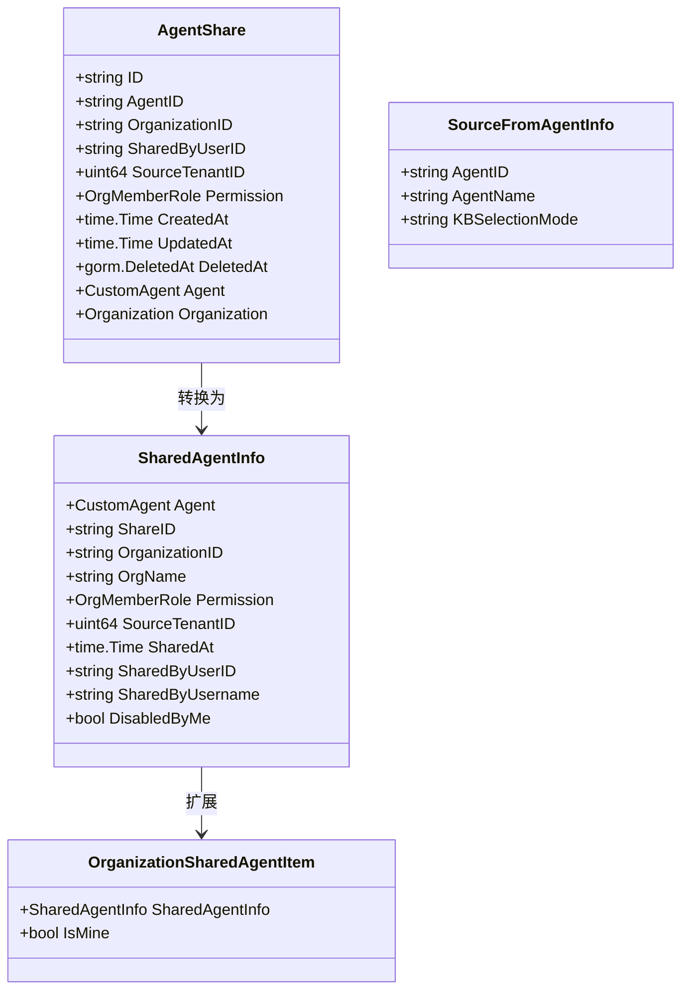
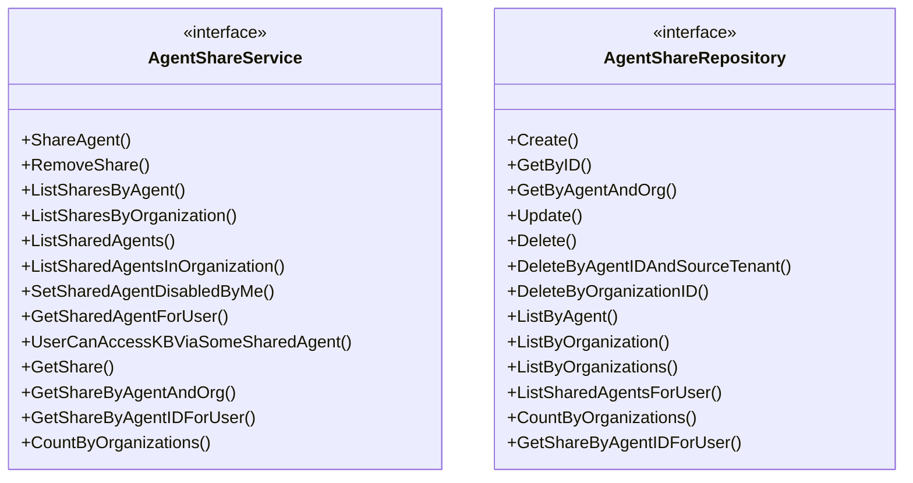

# Agent Sharing Contracts 模块

## 概述

**Agent Sharing Contracts** 模块定义了在组织内部共享智能体（Agent）的数据模型和接口契约。它解决了跨租户智能体协作的核心问题：如何安全、可控地在多个用户和组织之间共享智能体配置，同时保持清晰的权限边界和审计追踪。

想象一下这个场景：一个团队在组织中创建了一个配置精良的智能体，包含了特定的知识库访问权限、工具配置和行为设置。现在他们希望团队成员甚至其他团队也能使用这个智能体，但又不想让每个人都复制一份配置（因为维护成本太高）。这个模块就是为了解决这个问题而存在的——它提供了一套标准化的机制，让智能体可以像共享文件一样在组织内流转，但保留了完整的权限控制。

## 核心概念与架构

### 核心数据模型



### 接口契约



## 架构设计与数据流

### 核心设计思想

这个模块的设计遵循了**契约优先**（Contract-First）的原则，通过清晰的接口定义将数据模型、服务层和存储层解耦。这种设计有几个关键优势：

1. **关注点分离**：数据模型只负责定义数据结构，服务接口定义业务操作，仓储接口定义数据访问
2. **可测试性**：通过接口可以轻松创建 Mock 实现进行单元测试
3. **扩展性**：可以在不修改核心逻辑的情况下添加新的实现

### 数据流向

当用户共享一个智能体时，数据流向如下：

1. **创建共享**：调用 `AgentShareService.ShareAgent()` → 创建 `AgentShare` 记录 → `AgentShareRepository.Create()` 持久化
2. **查询共享**：`AgentShareService.ListSharedAgents()` → `AgentShareRepository.ListSharedAgentsForUser()` → 组装 `SharedAgentInfo`
3. **权限检查**：通过 `OrgMemberRole` 权限模型，结合用户在组织中的角色和共享权限，计算有效权限

### 关键组件解析

#### AgentShare：核心共享记录

`AgentShare` 是整个模块的核心数据结构，它记录了一次智能体共享的完整信息：

- **AgentID** + **SourceTenantID**：唯一标识被共享的智能体（因为不同租户可能有相同 ID 的智能体）
- **OrganizationID**：共享到的目标组织
- **SharedByUserID**：谁执行了共享操作（审计追踪）
- **Permission**：授予的权限级别（viewer/editor/admin）
- **DeletedAt**：软删除标记，支持撤销共享后保留历史记录

这个设计的一个关键细节是使用了复合外键 `(AgentID, SourceTenantID)` 来关联 `CustomAgent`，这确保了跨租户环境下的数据完整性。

#### SharedAgentInfo：共享视图模型

`SharedAgentInfo` 是为前端展示设计的视图模型，它聚合了：
- 智能体本身的信息
- 共享元数据（谁共享的、什么时候共享的、权限是什么）
- 用户偏好（是否禁用了这个智能体）

这里的 `DisabledByMe` 字段是一个有趣的设计——它允许用户在个人层面"隐藏"某个共享智能体，而不会影响其他用户。这种设计平衡了组织级共享和个人级偏好。

#### OrganizationSharedAgentItem：组织范围视图

`OrganizationSharedAgentItem` 扩展了 `SharedAgentInfo`，增加了 `IsMine` 字段，用于在组织级列表中区分"我创建的"和"别人共享的"智能体。这个看似简单的字段实际上体现了一个重要的 UX 决策：在共享空间中，用户需要快速识别哪些资源是自己的。

## 设计决策与权衡

### 1. 软删除 vs 硬删除

**选择**：使用 `gorm.DeletedAt` 实现软删除

**原因**：
- 审计需求：需要保留谁在什么时候共享/撤销了智能体的历史记录
- 可恢复性：误操作可以恢复
- 数据完整性：避免级联删除带来的复杂性

**权衡**：
- 数据库会积累"已删除"记录，需要定期清理
- 查询时需要记得过滤 `DeletedAt` 字段

### 2. 权限模型：双重权限检查

**设计**：有效权限 = min(共享权限, 用户在组织中的角色)

**示例**：
- 如果智能体被共享为 `editor`，但用户在组织中只是 `viewer`，则有效权限是 `viewer`
- 如果智能体被共享为 `viewer`，但用户在组织中是 `admin`，则有效权限还是 `viewer`

**原因**：
- 安全性：共享者不能授予超出用户在组织中应有权限的访问权
- 清晰性：权限逻辑直观，易于理解和调试

**权衡**：
- 有时会造成"为什么我不能编辑"的困惑（因为用户只看共享权限，没看组织角色）
- 需要在 UI 中同时显示两种权限

### 3. SourceFromAgentInfo：间接知识库可见性

**设计**：通过 `SourceFromAgentInfo` 表示某个知识库是"通过共享智能体可见的"，而不是直接共享的

**原因**：
- 智能体通常配置了知识库访问权限，当智能体被共享时，这些知识库也应该"间接"可见
- 直接共享每个知识库会太繁琐，且难以保持与智能体配置的同步
- 用户需要知道这个知识库是"来自哪个智能体"的

**权衡**：
- 增加了查询逻辑的复杂性
- 需要处理"直接共享"和"间接可见"两种情况的 UI 差异

### 4. TenantDisabledSharedAgent：租户级禁用

**设计**：单独的表记录租户对共享智能体的禁用状态

**原因**：
- 禁用是租户级的偏好，不应该影响共享记录本身
- 一个智能体可能被共享到多个组织，每个租户应该有独立的禁用设置
- 需要快速查询"哪些智能体被禁用了"（用于过滤对话下拉列表）

**权衡**：
- 增加了一个表，查询时需要 Join
- 需要保持 `AgentShare` 和 `TenantDisabledSharedAgent` 的一致性

## 使用指南与注意事项

### 典型使用场景

#### 1. 共享智能体到组织

```go
// 创建共享
share, err := agentShareService.ShareAgent(
    ctx,
    agentID,           // 要共享的智能体 ID
    orgID,             // 目标组织 ID
    userID,            // 执行者 ID
    tenantID,          // 执行者的租户 ID
    OrgRoleViewer,     // 权限级别
)
```

**注意**：
- 执行者必须对智能体有足够的权限（通常是 admin）
- 执行者必须是组织的成员且有共享权限（通常是 admin 或 editor）

#### 2. 获取用户可访问的共享智能体

```go
// 获取当前用户所有可访问的共享智能体
sharedAgents, err := agentShareService.ListSharedAgents(
    ctx,
    userID,
    currentTenantID,
)
```

**返回的 `SharedAgentInfo` 包含**：
- 智能体配置
- 共享信息（谁共享的、什么时候）
- 有效权限
- 是否被当前用户禁用

#### 3. 禁用/启用共享智能体

```go
// 禁用某个共享智能体（不在对话下拉列表中显示）
err := agentShareService.SetSharedAgentDisabledByMe(
    ctx,
    tenantID,
    agentID,
    sourceTenantID,
    true,  // disabled
)
```

**注意**：
- 这只是隐藏智能体，不会撤销共享
- 其他用户仍然可以看到和使用这个智能体

### 常见陷阱与注意事项

1. **忘记 SourceTenantID**：
   - `AgentShare` 同时需要 `AgentID` 和 `SourceTenantID` 来唯一标识智能体
   - 只使用 `AgentID` 可能会在跨租户场景下找到错误的智能体

2. **权限计算**：
   - 不要只检查 `AgentShare.Permission`，还要结合用户在组织中的角色
   - 使用 `min(共享权限, 组织角色)` 计算有效权限

3. **软删除过滤**：
   - 查询时要记得过滤 `DeletedAt` 字段
   - GORM 会自动处理，但如果手写 SQL 要注意

4. **SourceFromAgentInfo 的处理**：
   - 当知识库通过智能体间接可见时，用户不能直接访问这个知识库（除非也有直接共享）
   - UI 上要显示"来自智能体 XXX"的提示

5. **TenantDisabledSharedAgent 的一致性**：
   - 当 `AgentShare` 被删除时，相关的 `TenantDisabledSharedAgent` 也应该清理
   - 否则会积累无用数据

## 与其他模块的关系

### 依赖关系

- **上游依赖**：
  - [organization_resource_sharing_and_access_control_contracts](core_domain_types_and_interfaces-identity_tenant_organization_and_configuration_contracts-organization_resource_sharing_and_access_control_contracts.md)：提供组织和成员基础模型
  - [custom_agent_and_skill_capability_contracts](core_domain_types_and_interfaces-identity_tenant_organization_and_configuration_contracts-custom_agent_and_skill_capability_contracts.md)：提供 `CustomAgent` 模型
  - [share_permission_and_listing_contracts](core_domain_types_and_interfaces-identity_tenant_organization_and_configuration_contracts-organization_resource_sharing_and_access_control_contracts-share_permission_and_listing_contracts.md)：提供共享权限基础契约

- **下游依赖**：
  - `agent_sharing_access_service`：实现 `AgentShareService` 接口
  - `agent_share_access_repository`：实现 `AgentShareRepository` 接口
  - [organization_shared_agent_access_handlers](http_handlers_and_routing-agent_tenant_organization_and_model_management_handlers-organization_shared_agent_access_handlers.md)：提供 HTTP 接口

### 协作模式

```
HTTP Handler → AgentShareService → AgentShareRepository → Database
                                    ↓
                            权限检查（调用 OrganizationService）
                                    ↓
                            智能体验证（调用 CustomAgentService）
```

## 子模块说明

本模块包含以下子模块，详细文档请参考各自页面：

- [agent_share_domain_and_source_models](agent_sharing_contracts-agent_share_domain_and_source_models.md)：核心领域模型定义
- [shared_agent_response_and_listing_models](agent_sharing_contracts-shared_agent_response_and_listing_models.md)：响应和列表模型
- [agent_sharing_service_and_repository_interfaces](agent_sharing_contracts-agent_sharing_service_and_repository_interfaces.md)：服务和仓储接口

## 总结

**Agent Sharing Contracts** 模块是组织级智能体协作的基础设施。它通过清晰的契约定义、完善的权限模型和灵活的共享机制，解决了跨租户智能体共享的复杂性。

这个模块的设计体现了几个核心原则：
1. **契约优先**：接口定义清晰，实现与使用解耦
2. **安全第一**：双重权限检查，最小权限原则
3. **用户体验**：支持个人偏好（禁用）、清晰的归属标识
4. **可审计性**：软删除、完整的操作记录

对于新贡献者，理解这个模块的关键是抓住"共享记录"和"视图模型"的区别，以及双重权限检查的设计思想。
