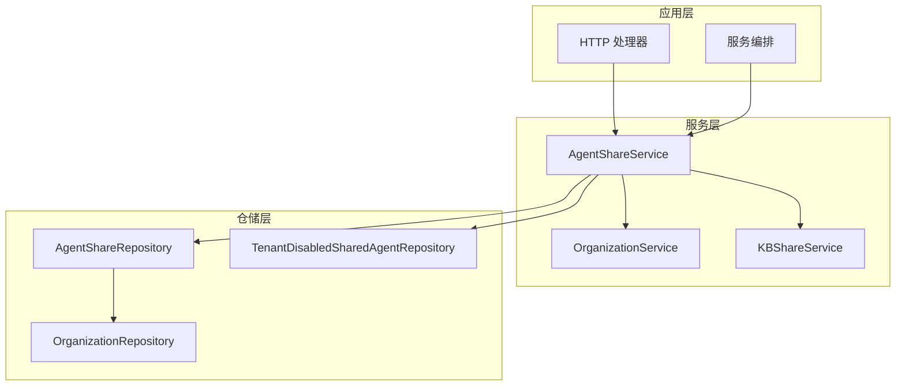

# Agent 共享服务与仓库接口

## 概述

`agent_sharing_service_and_repository_interfaces` 模块是系统中负责管理智能体（Agent）在组织间共享机制的核心抽象层。它定义了智能体共享的业务逻辑契约和数据持久化契约，使得智能体可以从源租户安全地共享到目标组织，同时支持复杂的权限控制和跨租户访问场景。

这个模块解决的核心问题是：在多租户、多组织的协作环境中，如何安全、高效地实现智能体资源的共享，同时保持清晰的权限边界和灵活的用户偏好设置。

## 架构

### Mermaid 架构图



### 架构角色与数据流动

该模块采用典型的分层架构，将业务逻辑与数据访问清晰分离：

1. **服务层**：`AgentShareService` 是核心业务接口，负责处理智能体共享的所有业务逻辑，包括权限验证、共享关系管理、跨租户访问控制等。它不仅操作自身的仓储，还会协调 [OrganizationService](organization_governance_membership_and_join_workflow_contracts.md) 和 [KBShareService](knowledge_base_sharing_contracts.md) 来完成复杂的业务场景。

2. **仓储层**：`AgentShareRepository` 和 `TenantDisabledSharedAgentRepository` 负责数据持久化抽象，定义了数据访问的契约但不关心具体实现。这种设计使得底层存储可以灵活切换，而不影响上层业务逻辑。

数据流动的典型路径是：HTTP 请求 → 服务层验证权限 → 仓储层操作数据 → 返回结果。例如，当用户发起智能体共享时，请求会先经过权限检查，确认用户是智能体所有者且是组织管理员，然后创建共享记录，最后返回共享结果。

## 核心组件详解

### AgentShareService 接口

`AgentShareService` 是智能体共享功能的核心业务接口，定义了所有与智能体共享相关的操作。

#### 主要功能分类

**1. 共享管理**
- `ShareAgent`：创建智能体共享关系，这是模块的核心操作。它接收智能体 ID、组织 ID、用户 ID、租户 ID 和权限级别，返回创建的共享记录。
- `RemoveShare`：移除现有的共享关系，需要验证操作人权限。

**2. 查询与列表**
- `ListSharesByAgent`：列出某个智能体的所有共享记录，用于智能体所有者查看共享情况。
- `ListSharesByOrganization`：列出某个组织获得的所有智能体共享。
- `ListSharedAgents`：列出用户可访问的所有共享智能体，这是用户侧查看共享智能体的主要入口。
- `ListSharedAgentsInOrganization`：在特定组织上下文中列出用户可访问的共享智能体。
- `ListSharedAgentsInOrganizations`：批量获取多个组织中用户可访问的共享智能体，用于侧边栏计数等性能敏感场景。

**3. 用户偏好与个性化**
- `SetSharedAgentDisabledByMe`：设置当前租户是否"禁用"某个共享智能体（在对话下拉菜单中隐藏）。这是一个用户偏好设置，不影响其他用户。

**4. 访问控制与解析**
- `GetSharedAgentForUser`：获取用户可访问的共享智能体，用于解析 @ 提及中的智能体范围。
- `UserCanAccessKBViaSomeSharedAgent`：检查用户是否可以通过任何共享智能体访问某个知识库，这是一个间接权限检查，用于"通过智能体可见"列表场景。
- `GetShareByAgentIDForUser`：获取用户可访问的特定智能体的共享记录，排除指定租户（通常是用户自己的租户）。

**5. 统计与计数**
- `CountByOrganizations`：按组织统计共享数量，用于侧边栏显示，排除已删除的智能体。

#### 设计亮点

这个接口的设计体现了几个重要的架构思想：

1. **上下文感知**：几乎所有方法都接收 `userID` 和 `tenantID` 参数，确保操作是在正确的权限上下文中执行的。
2. **批量优化**：提供了 `ListSharedAgentsInOrganizations` 和 `CountByOrganizations` 等批量操作方法，避免 N+1 查询问题。
3. **间接权限检查**：`UserCanAccessKBViaSomeSharedAgent` 这样的方法支持复杂的间接权限场景，使功能更加灵活。
4. **用户偏好分离**：将智能体的"可见性"与"访问权限"分离，用户可以隐藏共享智能体而不影响其实际权限。

### AgentShareRepository 接口

`AgentShareRepository` 是智能体共享的数据访问抽象，定义了持久化层需要实现的操作。

#### 主要功能

**1. CRUD 操作**
- `Create`：创建新的共享记录
- `GetByID`：通过 ID 获取共享记录
- `GetByAgentAndOrg`：通过智能体 ID 和组织 ID 获取共享记录，用于检查重复共享
- `Update`：更新共享记录
- `Delete`：删除共享记录
- `DeleteByAgentIDAndSourceTenant`：删除特定智能体和源租户的所有共享，用于智能体删除时的级联清理
- `DeleteByOrganizationID`：删除特定组织的所有共享，用于组织删除时的级联清理

**2. 列表查询**
- `ListByAgent`：列出智能体的所有共享
- `ListByOrganization`：列出组织的所有共享
- `ListByOrganizations`：批量列出多个组织的所有共享
- `ListSharedAgentsForUser`：列出用户可访问的所有共享智能体

**3. 统计与特殊查询**
- `CountByOrganizations`：按组织统计共享数量
- `GetShareByAgentIDForUser`：获取用户可访问的特定智能体的共享记录，排除指定租户

#### 设计亮点

1. **级联删除支持**：`DeleteByAgentIDAndSourceTenant` 和 `DeleteByOrganizationID` 方法支持资源删除时的级联清理，避免悬空引用。
2. **批量操作**：`ListByOrganizations` 和 `CountByOrganizations` 支持批量操作，优化性能。
3. **用户视角查询**：`ListSharedAgentsForUser` 和 `GetShareByAgentIDForUser` 提供了以用户为中心的查询方法，简化业务逻辑。

### TenantDisabledSharedAgentRepository 接口

这个接口负责管理租户级别的智能体禁用状态，是一个相对独立但与共享功能密切相关的组件。

#### 主要功能

- `ListByTenantID`：列出租户禁用的所有智能体
- `ListDisabledOwnAgentIDs`：列出租户禁用的自有智能体 ID（source_tenant_id = tenant_id）
- `Add`：添加禁用记录
- `Remove`：移除禁用记录

#### 设计意图

这个接口的存在体现了一个重要的设计决策：将访问权限与用户偏好分离。即使一个智能体对用户是可访问的，用户也可以选择在自己的界面中隐藏它。这种设计提供了更好的用户体验，同时保持了权限模型的清晰性。

## 依赖分析

### 上游依赖

该模块被以下组件调用：
- **HTTP 处理器**：处理来自前端的共享管理请求
- **服务编排层**：在复杂业务流程中协调共享操作

### 下游依赖

该模块依赖以下组件：
- **OrganizationService/Repository**：用于验证组织成员身份和权限
- **KBShareService**：用于间接知识库访问检查
- **CustomAgent 相关组件**：用于获取智能体详情

### 数据契约

该模块与其他模块交互时使用的关键数据类型：
- `types.AgentShare`：智能体共享记录
- `types.SharedAgentInfo`：共享智能体信息
- `types.OrganizationSharedAgentItem`：组织内共享智能体项
- `types.CustomAgent`：自定义智能体
- `types.OrgMemberRole`：组织成员角色（权限级别）
- `types.KnowledgeBase`：知识库（用于间接访问检查）

## 设计决策与权衡

### 1. 服务层与仓储层分离

**决策**：将业务逻辑与数据访问分离为 `AgentShareService` 和 `AgentShareRepository` 两个接口。

**权衡**：
- ✅ **优点**：清晰的职责划分，便于单元测试（可以 mock 仓储层测试业务逻辑），支持存储技术切换。
- ❌ **缺点**：增加了接口数量和代码复杂度，简单场景下可能显得过度设计。

**为什么这样选择**：考虑到智能体共享功能涉及复杂的权限检查和多组件协调，这种分离是必要的。它使业务逻辑可以独立演进，同时保持数据访问的稳定性。

### 2. 组织作为共享中介

**决策**：智能体不是直接共享给用户，而是共享给组织，然后通过组织成员身份间接获得访问权限。

**权衡**：
- ✅ **优点**：更好的权限管理粒度，支持组织级别的策略控制，便于批量管理。
- ❌ **缺点**：增加了概念复杂度，直接用户间共享需要先创建组织。

**为什么这样选择**：这与系统的整体组织模型保持一致，并且支持更丰富的协作场景。组织作为共享中介也使得权限继承和撤销更加可控。

### 3. 访问权限与可见性分离

**决策**：通过 `TenantDisabledSharedAgentRepository` 单独管理智能体的可见性，与访问权限分离。

**权衡**：
- ✅ **优点**：用户可以个性化界面，隐藏不常用的智能体，同时不影响实际权限。
- ❌ **缺点**：增加了状态管理复杂度，需要在所有显示共享智能体的地方考虑禁用状态。

**为什么这样选择**：这是一个用户体验驱动的决策。在共享智能体数量较多的场景下，用户需要能够自定义自己的界面，而这种分离提供了这种灵活性。

### 4. 批量操作优先

**决策**：提供多个批量操作方法，如 `ListSharedAgentsInOrganizations` 和 `CountByOrganizations`。

**权衡**：
- ✅ **优点**：显著提升性能，避免 N+1 查询问题，特别适用于侧边栏等需要显示多个组织数据的场景。
- ❌ **缺点**：接口复杂度增加，批量操作的错误处理更复杂。

**为什么这样选择**：性能是用户体验的关键因素，特别是在前端渲染侧边栏等高频操作中。批量操作可以显著减少数据库查询次数，提升响应速度。

### 5. 间接权限检查

**决策**：提供 `UserCanAccessKBViaSomeSharedAgent` 这样的间接权限检查方法。

**权衡**：
- ✅ **优点**：支持"通过智能体可见"这样的灵活场景，用户可以通过共享智能体间接访问知识库。
- ❌ **缺点**：权限模型更复杂，可能导致意外的权限泄露，检查性能可能较低。

**为什么这样选择**：这是为了支持丰富的协作场景。在实际使用中，用户可能需要查看通过某个共享智能体可用的知识库，而这种间接检查提供了这种可能性。

## 使用指南与最佳实践

### 典型使用场景

#### 1. 创建智能体共享

```go
// 假设已有 service AgentShareService
share, err := service.ShareAgent(ctx, agentID, orgID, userID, tenantID, types.OrgMemberRoleViewer)
if err != nil {
    // 处理错误
}
```

**关键点**：
- 确保 `userID` 是智能体的所有者且有足够权限
- 选择合适的 `OrgMemberRole` 来控制权限级别
- 处理可能的错误，如重复共享、权限不足等

#### 2. 列出用户可访问的共享智能体

```go
agents, err := service.ListSharedAgents(ctx, userID, currentTenantID)
if err != nil {
    // 处理错误
}
```

**关键点**：
- 传入正确的 `currentTenantID` 以确保跨租户场景下的正确性
- 结果会自动过滤用户无权访问的智能体

#### 3. 禁用/启用共享智能体

```go
err := service.SetSharedAgentDisabledByMe(ctx, tenantID, agentID, sourceTenantID, true) // 禁用
if err != nil {
    // 处理错误
}
```

**关键点**：
- 需要提供 `sourceTenantID` 来唯一标识智能体
- 这是一个租户级别的设置，会影响该租户下的所有用户

### 扩展与实现建议

#### 实现 AgentShareService

当实现 `AgentShareService` 时，建议：
1. 在所有修改操作前进行严格的权限检查
2. 使用事务确保数据一致性（特别是在涉及多个仓储操作时）
3. 记录关键操作的审计日志
4. 考虑添加缓存层来提升读操作性能

#### 实现 AgentShareRepository

当实现 `AgentShareRepository` 时，建议：
1. 实现软删除机制，保留历史共享记录
2. 为常用查询字段添加索引（如 agent_id, org_id, user_id）
3. 实现批量操作时注意避免内存溢出
4. 考虑添加数据版本控制，支持乐观锁

## 边缘情况与注意事项

### 1. 跨租户访问

**场景**：用户访问来自其他租户的共享智能体。

**注意事项**：
- 确保正确处理 `sourceTenantID`，避免租户隔离被突破
- 注意跨租户的数据访问可能需要特殊的权限检查
- 考虑跨租户操作的性能影响

### 2. 级联删除

**场景**：智能体或组织被删除时的共享记录处理。

**注意事项**：
- 使用 `DeleteByAgentIDAndSourceTenant` 和 `DeleteByOrganizationID` 进行级联清理
- 考虑是物理删除还是软删除，软删除可以保留历史记录但会增加数据量
- 删除操作可能需要通知相关用户

### 3. 权限变更

**场景**：用户在组织中的角色变更，或共享权限级别变更。

**注意事项**：
- 权限变更应实时生效，避免缓存导致的权限不一致
- 考虑权限降级时的用户体验（如正在使用的功能突然不可用）
- 记录所有权限变更，便于审计

### 4. 性能优化

**场景**：大量共享记录时的查询性能。

**注意事项**：
- 使用批量操作方法避免 N+1 查询
- 考虑为频繁查询的结果添加缓存
- 实现分页机制，避免一次返回过多数据
- 注意 `CountByOrganizations` 等统计操作的性能

### 5. 并发安全

**场景**：多个用户同时操作同一个共享记录。

**注意事项**：
- 实现乐观锁或悲观锁机制，避免并发更新冲突
- 考虑使用数据库事务确保操作原子性
- 设计幂等操作，避免重复操作导致的问题

## 相关模块

- [组织管理契约](organization_governance_membership_and_join_workflow_contracts.md)：提供组织和成员管理功能
- [知识库共享契约](knowledge_base_sharing_contracts.md)：类似的知识库共享功能
- [自定义智能体契约](custom_agent_and_skill_capability_contracts.md)：智能体的核心定义
- [租户级共享智能体访问控制契约](tenant_level_shared_agent_access_control_contracts.md)：租户级别的智能体禁用状态管理

## 总结

`agent_sharing_service_and_repository_interfaces` 模块是系统中智能体共享功能的核心抽象层，它通过清晰的接口定义和分层架构，实现了安全、灵活的智能体共享机制。该模块的设计体现了多个重要的架构思想，如服务与仓储分离、权限与可见性分离、批量操作优先等，这些设计决策使得模块既满足了当前的功能需求，又为未来的扩展留下了空间。

对于新加入团队的开发者来说，理解这个模块的关键是把握其核心抽象和设计意图，特别是组织作为共享中介、权限与可见性分离等重要设计决策。在使用和扩展这个模块时，要注意跨租户访问、级联删除、权限变更等边缘情况，确保系统的安全性和稳定性。
