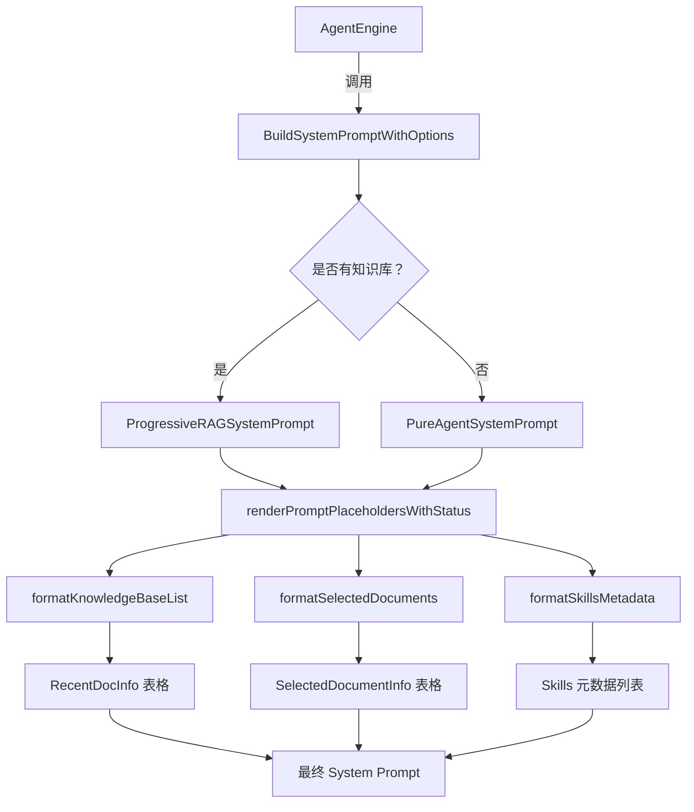

# Agent System Prompt Context Contracts

## 概述：为什么需要这个模块

想象你正在指挥一支特种部队执行任务。在行动前，你需要给队员一份**任务简报**——告诉他们任务背景、可用资源、行动规则和当前环境状态。如果简报太笼统，队员会迷失方向；如果简报塞入过多细节，关键信息会被淹没。

`agent_system_prompt_context_contracts` 模块正是解决这个"任务简报"问题。它负责**动态构建 Agent 的系统提示词（System Prompt）**，将知识库状态、用户选中的文档、可用技能等上下文信息，以结构化的方式注入到 LLM 的初始指令中。

### 核心问题空间

 naive 方案会直接把所有上下文拼接到 prompt 里，但这会引发三个问题：

1. **Token 爆炸**：知识库可能有数百篇文档，全部塞入 prompt 会超出上下文窗口
2. **信息过载**：LLM 面对过多背景信息时，关键指令会被稀释（"lost in the middle"现象）
3. **模式耦合**：Pure Agent 模式（无知识库）和 RAG 模式（有知识库）需要不同的提示词结构

本模块的设计洞察是：**系统提示词应该是一个"渐进式披露"的模板**——只注入必要的元数据（如知识库名称、文档数量、最近更新的文档列表），而非实际内容。内容检索通过工具调用动态完成，这正是 `ProgressiveRAGSystemPrompt` 中强调的"Deep Read"哲学的体现。

---

## 架构与数据流



### 组件角色说明

| 组件 | 架构角色 | 职责 |
|------|----------|------|
| `BuildSystemPromptWithOptions` | **编排器** | 根据运行时状态选择模板、渲染占位符、组装各部分上下文 |
| `KnowledgeBaseInfo` | **上下文载体** | 封装知识库元数据（名称、类型、文档数、最近文档） |
| `SelectedDocumentInfo` | **用户意图信号** | 承载用户通过 @ 提及显式选中的文档信息 |
| `RecentDocInfo` | **时效性提示** | 提供最近添加的文档/FAQ 条目，引导 Agent 关注新鲜内容 |
| `formatSkillsMetadata` | **能力披露器** | 实现"渐进式披露"——先展示技能列表，引导 Agent 调用 `read_skill` 加载详情 |

### 数据流追踪

典型的调用链路如下：

```
AgentEngine.BuildContext()
  → 从 Repository 加载 KnowledgeBase 元数据
  → 构建 []*KnowledgeBaseInfo（包含 RecentDocs）
  → 收集用户 @ 提及的文档 → []*SelectedDocumentInfo
  → 加载可用技能 → []*skills.SkillMetadata
  → 调用 BuildSystemPromptWithOptions(...)
      → 选择模板（Pure vs Progressive RAG）
      → 渲染 {{knowledge_bases}}、{{web_search_status}}、{{current_time}}
      → 追加 formatSelectedDocuments() 输出
      → 追加 formatSkillsMetadata() 输出
  → 返回完整 System Prompt 给 LLM
```

这个模块处于 **Agent 运行时初始化的关键路径**——每次会话创建或上下文重建时都会被调用。它不直接调用外部服务，但严重依赖上游（Repository 层）提供准确的元数据。

---

## 核心组件深度解析

### BuildSystemPromptWithOptions

**设计意图**：这是模块的**主入口函数**，采用"选项对象"模式（`BuildSystemPromptOptions`）而非过多参数，为未来扩展预留空间。

```go
func BuildSystemPromptWithOptions(
    knowledgeBases []*KnowledgeBaseInfo,
    webSearchEnabled bool,
    selectedDocs []*SelectedDocumentInfo,
    options *BuildSystemPromptOptions,  // 可扩展的选项包
    systemPromptTemplate ...string,     // 可变参数支持自定义模板
) string
```

**内部逻辑**：
1. **模板选择**：如果 `knowledgeBases` 为空，使用 `PureAgentSystemPrompt`；否则使用 `ProgressiveRAGSystemPrompt`
2. **占位符渲染**：调用 `renderPromptPlaceholdersWithStatus` 替换 `{{knowledge_bases}}`、`{{web_search_status}}`、`{{current_time}}`
3. **上下文追加**：如果有 `selectedDocs`，追加 `formatSelectedDocuments()` 的输出
4. **技能披露**：如果 `options.SkillsMetadata` 非空，追加 `formatSkillsMetadata()` 的输出

**关键设计决策**：
- **为什么用可变参数 `systemPromptTemplate ...string`**：允许调用方覆盖默认模板，但保持向后兼容（不传则用默认）
- **为什么 `options` 是指针**：避免每次调用都分配新对象，调用方可传 `nil` 表示无额外选项

**副作用**：无（纯函数），但依赖 `time.Now()` 获取当前时间，这在测试时可能需要 mock。

---

### KnowledgeBaseInfo

**设计意图**：封装知识库的**摘要信息**，而非完整内容。这是"渐进式 RAG"的核心——先告诉 Agent"有什么"，具体内容通过工具调用获取。

```go
type KnowledgeBaseInfo struct {
    ID          string
    Name        string
    Type        string // "document" 或 "faq"
    Description string
    DocCount    int
    RecentDocs  []RecentDocInfo // 最近添加的文档（最多 10 篇）
}
```

**为什么包含 `RecentDocs`**：
- 引导 Agent 关注**新鲜内容**（用户最近上传的文档更可能与当前问题相关）
- 避免 Agent 盲目搜索整个知识库，提供"热点"提示
- 限制为 10 篇，控制 token 消耗

**数据流**：由 `agentService` 或 `knowledgeBaseService` 构建，通过 Repository 查询最近创建的 Knowledge 记录。

---

### formatKnowledgeBaseList

**设计意图**：将 `[]*KnowledgeBaseInfo` 转换为**Markdown 表格**，供 LLM 阅读。

**关键实现细节**：
- **FAQ 与文档的差异化展示**：
  - FAQ 类型：显示"问题 | 答案 | Chunk ID"表格
  - 文档类型：显示"文档名 | 类型 | 创建时间 | 文件大小 | 摘要"表格
- **摘要截断**：调用 `formatDocSummary()` 将描述截断至 120 字符，避免表格过宽
- **文件大小格式化**：调用 `formatFileSize()` 转换为人类可读格式（如 "2.5 MB"）

**潜在陷阱**：
- 如果 `RecentDocs` 超过 10 篇，会 silently truncate（只取前 10 篇）
- 空摘要会显示为 "-"，而非空字符串（避免表格对齐问题）

---

### formatSkillsMetadata

**设计意图**：实现**渐进式技能披露**（Progressive Disclosure）——不直接把完整技能指令塞入 prompt，而是展示技能列表和触发条件，引导 Agent 主动调用 `read_skill` 工具加载详情。

**输出示例**：
```markdown
### Available Skills (IMPORTANT - READ CAREFULLY)

**You MUST actively consider using these skills for EVERY user request.**

#### Skill Matching Protocol (MANDATORY)

Before responding to ANY user query, follow this checklist:

1. **SCAN**: Read each skill's description and trigger conditions below
2. **MATCH**: Check if the user's intent matches ANY skill's triggers...
3. **LOAD**: If a match is found, call `read_skill(skill_name="...")` BEFORE generating your response
4. **APPLY**: Follow the skill's instructions...
```

**设计权衡**：
- **为什么不全量注入技能指令**：技能指令可能很长（数百 token），如果同时激活多个技能，会迅速消耗上下文窗口
- **为什么强调"MANDATORY"**：实验表明，LLM 倾向于跳过工具调用以"节省时间"，需要显式约束

---

### PlaceholderDefinition（已弃用）

**历史背景**：早期版本中，这个结构体用于向 UI 暴露可用的占位符（如 `{{knowledge_bases}}`），供用户在自定义 Agent 时参考。

**为什么弃用**：现在统一使用 `types.PromptPlaceholder`，通过 `types.PlaceholdersByField()` 集中管理，避免重复定义。

**当前实现**：
```go
func AvailablePlaceholders() []PlaceholderDefinition {
    placeholders := types.PlaceholdersByField(types.PromptFieldAgentSystemPrompt)
    // 转换为旧结构体（向后兼容）
    ...
}
```

---

## 依赖关系分析

### 上游依赖（被谁调用）

| 调用方 | 调用场景 | 期望行为 |
|--------|----------|----------|
| `internal.agent.engine.AgentEngine` | 会话初始化、上下文重建 | 返回完整的 System Prompt，包含所有必要的上下文 |
| `internal.application.service.agent_service.agentService` | Agent 配置预览 | 可能传入自定义模板测试渲染效果 |

### 下游依赖（调用谁）

| 被调用方 | 用途 | 耦合程度 |
|----------|------|----------|
| `internal/agent/skills.SkillMetadata` | 格式化技能列表 | 松耦合（只读 Name 和 Description） |
| `internal/types.PromptPlaceholder` | 占位符元数据 | 松耦合（通过 `PlaceholdersByField` 查询） |
| `time.Now()` | 获取当前时间 | 紧耦合（测试时需要 mock） |

### 数据契约

**输入契约**：
- `knowledgeBases`：可以为空（Pure Agent 模式），但不应为 `nil`（避免 panic）
- `selectedDocs`：可以为空或 `nil`
- `options`：可以为 `nil`

**输出契约**：
- 始终返回非空字符串
- 如果无知识库且无技能，返回最小化的 `PureAgentSystemPrompt`

---

## 设计决策与权衡

### 1. 模板选择：为什么用两个独立模板而非一个？

**选择**：`PureAgentSystemPrompt` 和 `ProgressiveRAGSystemPrompt` 是两个独立的字符串常量。

**权衡**：
- **优点**：清晰分离两种模式，Pure Agent 模板更简洁（无 KB 相关指令）
- **缺点**：如果修改通用部分（如 Tool Guidelines），需要同步更新两个模板

**替代方案**：使用单一模板 + 条件占位符（如 `{{#if knowledge_bases}}...{{/if}}`），但这会引入模板引擎依赖，增加复杂度。

### 2. 占位符渲染：为什么用 `strings.ReplaceAll` 而非模板引擎？

**选择**：手动字符串替换（`strings.ReplaceAll(result, "{{knowledge_bases}}", kbList)`）。

**权衡**：
- **优点**：零依赖、性能高、易于调试
- **缺点**：不支持复杂逻辑（如循环、条件），但本模块的渲染逻辑足够简单

### 3. 渐进式披露：为什么技能元数据要单独追加？

**选择**：技能列表在占位符渲染后追加（`basePrompt += formatSkillsMetadata(...)`）。

**原因**：
- 技能是**可选的**，不是所有 Agent 都启用技能系统
- 技能列表较长，放在末尾避免干扰核心指令
- 未来可能支持动态加载（如根据用户权限过滤技能）

### 4. RecentDocs 限制为 10 篇

**选择**：`if j >= 10 { break }`

**权衡**：
- **为什么是 10**：经验值——太少（如 3 篇）可能遗漏相关信息，太多（如 50 篇）会消耗过多 token
- **风险**：如果用户短时间内上传大量文档，最早的那批可能不会出现在 RecentDocs 中

---

## 使用示例

### 基础用法：构建 RAG 模式 System Prompt

```go
kbInfos := []*KnowledgeBaseInfo{
    {
        ID:          "kb-001",
        Name:        "产品文档库",
        Type:        "document",
        Description: "包含产品规格、用户手册等",
        DocCount:    150,
        RecentDocs: []RecentDocInfo{
            {
                Title:       "v2.5 更新说明",
                FileName:    "release_notes_v2.5.pdf",
                FileSize:    2 * 1024 * 1024, // 2MB
                CreatedAt:   "2025-01-15T10:30:00Z",
                Description: "新增功能包括...",
            },
        },
    },
}

selectedDocs := []*SelectedDocumentInfo{
    {
        KnowledgeID:     "doc-123",
        KnowledgeBaseID: "kb-001",
        Title:           "API 参考手册",
        FileType:        "pdf",
    },
}

prompt := BuildSystemPrompt(
    kbInfos,
    true,  // webSearchEnabled
    selectedDocs,
)
```

### 高级用法：带技能的 System Prompt

```go
options := &BuildSystemPromptOptions{
    SkillsMetadata: []*skills.SkillMetadata{
        {
            Name:        "customer_service",
            Description: "处理客户投诉和咨询的标准流程",
        },
        {
            Name:        "technical_escalation",
            Description: "技术问题升级流程",
        },
    },
}

prompt := BuildSystemPromptWithOptions(
    kbInfos,
    false, // webSearchEnabled
    nil,   // no selected docs
    options,
)
```

### 自定义模板

```go
customTemplate := `### 角色
你是 {{agent_name}}。

### 可用知识库
{{knowledge_bases}}

### 状态
Web 搜索：{{web_search_status}}
当前时间：{{current_time}}
`

prompt := BuildSystemPrompt(
    kbInfos,
    true,
    nil,
    customTemplate, // 传入自定义模板
)
```

---

## 边界情况与陷阱

### 1. 空知识库列表

**行为**：自动切换到 `PureAgentSystemPrompt`。

**陷阱**：如果调用方期望 RAG 模板但传了空列表，会意外切换到 Pure Agent 模式。

**建议**：调用方应显式检查 `len(knowledgeBases) == 0` 并记录日志。

### 2. RecentDocs 中的空字段

**行为**：
- `Title` 为空时，回退到 `FileName`
- `Description` 为空时，表格中显示 "-"
- `FAQAnswers` 为空时，显示 "-"

**陷阱**：如果 `FileName` 也为空，表格会显示空单元格（虽然当前代码不会发生，但未来扩展时需注意）。

### 3. 时间依赖

**行为**：`time.Now().Format(time.RFC3339)` 硬编码在函数内。

**陷阱**：单元测试难以验证时间相关的输出。

**建议**：未来可考虑注入 `timeProvider` 接口，便于测试。

### 4. 占位符未替换

**行为**：如果模板中包含未定义的占位符（如 `{{unknown_placeholder}}`），会原样保留。

**风险**：LLM 可能困惑于未解析的占位符。

**建议**：在开发环境中添加警告日志，检测未替换的占位符。

### 5. 技能元数据过大

**行为**：`formatSkillsMetadata` 无长度限制。

**风险**：如果技能数量过多（如 50+），会消耗大量 token。

**建议**：未来可考虑限制最大技能数量，或实现分页披露。

---

## 相关模块参考

- [Agent Engine](agent_core_orchestration_and_tooling_foundation.md)：调用本模块构建 System Prompt 的编排器
- [Skill Metadata](agent_skills_lifecycle_and_skill_tools.md)：技能元数据的定义和加载逻辑
- [Prompt Placeholder Contracts](core_domain_types_and_interfaces.md)：占位符的集中定义（`types.PromptPlaceholder`）
- [Context Manager](conversation_context_and_memory_services.md)：管理对话上下文的压缩和存储策略

---

## 扩展指南

### 添加新的占位符

1. 在 `types.PromptPlaceholder` 中注册新占位符元数据
2. 在 `renderPromptPlaceholdersWithStatus` 中添加替换逻辑
3. 更新 `ProgressiveRAGSystemPrompt` 和 `PureAgentSystemPrompt` 模板

### 支持新的上下文类型

如果要添加新的上下文信息（如"用户偏好"），建议：

1. 创建新的 Info 结构体（如 `UserPreferenceInfo`）
2. 创建对应的格式化函数（如 `formatUserPreferences`）
3. 在 `BuildSystemPromptWithOptions` 中通过 `options` 参数传入
4. 在模板中添加新占位符（如 `{{user_preferences}}`）

### 模板国际化

当前模板是硬编码的英文。如需支持多语言：

1. 将模板移至配置文件或数据库
2. 根据用户语言设置加载对应模板
3. 保持占位符语法不变（语言无关）
