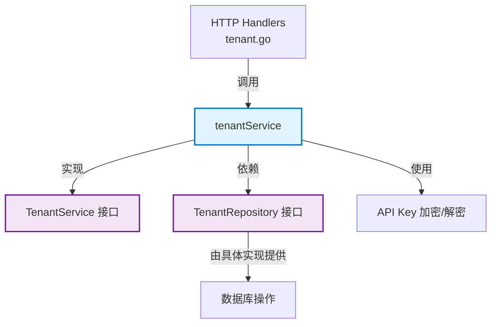

# tenant_lifecycle_and_listing_management 模块深度剖析

## 1. 模块概述

**tenant_lifecycle_and_listing_management** 模块是 WeKnora 系统中负责租户（Tenant）全生命周期管理的核心服务层组件。在多租户架构中，租户是资源隔离、权限控制和配置管理的基本单位，这个模块就像是系统的"租户登记处"，负责创建、查询、更新和删除租户信息，同时还处理 API 密钥的生成和验证，确保每个租户可以安全地与系统交互。

## 2. 核心问题与解决方案

### 2.1 问题空间

在构建多租户 SaaS 系统时，我们面临几个关键挑战：
- **身份验证**：如何让每个租户安全地标识自己，而不需要复杂的用户名密码流程？
- **资源隔离**：如何确保一个租户的数据不会意外泄露给另一个租户？
- **配置个性化**：如何让每个租户拥有自己的检索引擎、存储配额和会话配置？
- **操作可追溯**：如何记录和审计租户的变更操作？

### 2.2 设计洞察

本模块的核心设计思想是：**租户 = 身份 + 配置 + 边界**。通过将租户 ID 加密到 API 密钥中，实现了"密钥即身份"的轻量级认证机制；通过在租户实体中嵌入各种配置（检索引擎、存储配额、上下文配置等），实现了租户级别的个性化设置；通过将租户 ID 作为所有资源的关联外键，实现了数据隔离。

## 3. 架构与数据流程

### 3.1 核心组件架构

以下是该模块的核心架构图：



### 3.2 数据流程详解

#### 租户创建流程
1. **请求接收**：HTTP 层接收创建租户的请求
2. **参数验证**：`tenantService.CreateTenant` 验证租户名称不为空
3. **初始化**：设置初始状态为 "active"，生成临时 API Key，设置创建时间
4. **持久化**：调用 `TenantRepository.CreateTenant` 保存到数据库
5. **正式 API Key 生成**：使用刚获取的租户 ID 生成正式的 API Key
6. **更新**：调用 `TenantRepository.UpdateTenant` 更新包含正式 API Key 的租户信息

#### API Key 验证流程
1. **提取**：从请求中获取 API Key
2. **格式验证**：检查是否以 "sk-" 开头
3. **解密**：使用 AES-GCM 算法解密，提取租户 ID
4. **验证**：确保解密过程无误，未被篡改
5. **返回**：返回提取的租户 ID 供后续使用

## 4. 核心组件深度解析

### 4.1 tenantService 结构体

**作用**：实现 `TenantService` 接口，封装租户管理的所有业务逻辑。

**设计要点**：
- **依赖注入**：通过构造函数 `NewTenantService` 注入 `TenantRepository` 接口，实现了业务逻辑与数据访问的解耦
- **关注点分离**：将加密/解密逻辑封装在私有方法 `generateApiKey` 和 `ExtractTenantIDFromAPIKey` 中
- **防御性编程**：所有公共方法都进行参数验证（如 ID 不为 0，名称不为空等）

**关键方法**：

#### CreateTenant
```go
func (s *tenantService) CreateTenant(ctx context.Context, tenant *types.Tenant) (*types.Tenant, error)
```
**设计意图**：采用"两步走"策略创建租户——先生成临时记录获取 ID，再用 ID 生成正式 API Key。这是因为 API Key 需要包含租户 ID，而租户 ID 只有在数据库插入后才能获得。

**注意**：如果第二步更新 API Key 失败，会留下一个带有临时 API Key 的租户记录，这是一个潜在的一致性问题。

#### generateApiKey
```go
func (r *tenantService) generateApiKey(tenantID uint64) string
```
**设计意图**：这是模块的核心安全机制。通过将租户 ID 加密到 API Key 中，实现了两个重要目标：
1. **无状态认证**：不需要查询数据库就能从 API Key 中提取租户 ID
2. **防篡改**：使用 AES-GCM 认证加密模式，确保 API Key 未被篡改

**加密流程**：
1. 将租户 ID 转换为 8 字节的小端序字节数组
2. 生成 12 字节的随机 nonce（GCM 推荐长度）
3. 使用 AES-GCM 加密租户 ID
4. 将 nonce 和密文拼接后进行 Base64 编码
5. 加上 "sk-" 前缀形成最终的 API Key

#### ExtractTenantIDFromAPIKey
```go
func (r *tenantService) ExtractTenantIDFromAPIKey(apiKey string) (uint64, error)
```
**设计意图**：`generateApiKey` 的逆过程，用于从 API Key 中提取租户 ID。这个方法在认证中间件中被频繁调用，是请求处理流水线中的关键环节。

### 4.2 ListTenantsParams 结构体

**作用**：定义租户列表查询的参数结构，支持分页和过滤。

**注意**：虽然定义了这个结构，但在当前实现中并没有被实际使用。实际的搜索功能是通过 `SearchTenants` 方法实现的，它直接接受单独的参数而不是使用这个结构体。

## 5. 依赖关系分析

### 5.1 入站依赖（被谁调用）

- **HTTP Handler 层**：`internal/handler/tenant.go` 中的处理器函数调用 `tenantService` 的方法来响应 HTTP 请求
- **认证中间件**：`internal/middleware/auth.go` 可能调用 `ExtractTenantIDFromAPIKey` 来验证请求

### 5.2 出站依赖（调用谁）

- **TenantRepository 接口**：`tenantService` 依赖这个接口进行数据持久化操作
- **日志系统**：使用 `internal/logger` 记录操作日志
- **类型系统**：依赖 `internal/types.Tenant` 定义租户数据结构
- **加密库**：使用 Go 标准库的 `crypto/aes`、`crypto/cipher` 等进行加密操作

## 6. 设计决策与权衡

### 6.1 API Key 设计：嵌入租户 ID vs 数据库查询

**决策**：将租户 ID 加密嵌入到 API Key 中

**理由**：
- **性能**：不需要在每次认证时查询数据库，减少了数据库压力
- **无状态**：认证服务可以独立扩展，不依赖共享状态
- **简单性**：简化了认证流程，不需要维护 API Key 到租户 ID 的映射表

**权衡**：
- **密钥不可撤销**：除非改变加密密钥，否则泄露的 API Key 无法单独撤销（只能通过禁用租户来解决）
- **加密密钥管理**：需要安全地管理 `TENANT_AES_KEY`，一旦泄露，所有 API Key 都将受到威胁
- **无法过期**：当前实现没有内置的 API Key 过期机制

### 6.2 租户创建：两步提交 vs 预生成 ID

**决策**：使用两步提交（先创建带临时 API Key 的租户，再更新为正式 API Key）

**理由**：
- **简单性**：依赖数据库的自增 ID 生成机制，不需要额外的 ID 生成服务
- **兼容性**：与大多数 ORM 和数据库的工作方式兼容

**权衡**：
- **一致性风险**：如果第二步失败，系统中会存在带有临时 API Key 的租户记录
- **性能**：需要两次数据库操作而不是一次

### 6.3 错误处理：直接返回 vs 包装错误

**决策**：直接返回底层错误，并添加日志记录

**理由**：
- **简单性**：减少了错误包装的复杂性
- **可观测性**：通过详细的日志记录，可以追踪错误发生的上下文

**权衡**：
- **错误信息泄露**：底层数据库错误可能会泄露给上层（不过当前 HTTP 层应该会处理这个问题）
- **缺乏错误上下文**：调用者难以判断错误的具体类型（是数据库错误、验证错误还是其他错误）

## 7. 使用指南与最佳实践

### 7.1 基本用法

#### 创建租户
```go
tenant := &types.Tenant{
    Name: "example-tenant",
    Description: "An example tenant",
}
createdTenant, err := tenantService.CreateTenant(ctx, tenant)
```

#### 验证 API Key
```go
tenantID, err := tenantService.ExtractTenantIDFromAPIKey("sk-...")
if err != nil {
    // 处理无效的 API Key
}
// 使用 tenantID 进行后续操作
```

### 7.2 配置

- **TENANT_AES_KEY**：环境变量，用于加密 API Key 的 AES 密钥，必须是 16、24 或 32 字节（对应 AES-128、AES-192 或 AES-256）

### 7.3 安全最佳实践

1. **密钥管理**：使用安全的密钥管理系统（KMS）存储 `TENANT_AES_KEY`，不要硬编码或提交到版本控制系统
2. **HTTPS**：始终通过 HTTPS 传输 API Key，防止中间人攻击
3. **租户禁用**：如果 API Key 泄露，立即禁用对应的租户，而不是依赖 API Key 的撤销
4. **定期轮换**：考虑定期轮换 `TENANT_AES_KEY`，并提供机制重新生成所有租户的 API Key

## 8. 边缘情况与注意事项

### 8.1 并发安全

当前实现**不处理**并发更新同一租户的情况。如果两个请求同时更新同一个租户，可能会导致丢失更新。

**缓解措施**：
- 使用数据库事务和乐观锁（如版本号字段）
- 或在应用层实现分布式锁

### 8.2 错误处理

- **API Key 解密失败**：`ExtractTenantIDFromAPIKey` 会返回错误，但不会记录是哪种具体错误（格式错误、编码错误、解密错误等）
- **删除不存在的租户**：`DeleteTenant` 方法会检查租户是否存在，如果不存在会记录警告但不会返回错误

### 8.3 未使用的代码

- `ListTenantsParams` 结构体定义了但没有被使用
- `ListTenants` 方法返回所有租户，但在实际应用中应该使用 `SearchTenants` 进行分页查询

## 9. 扩展与改进建议

1. **API Key 版本控制**：在 API Key 中添加版本号，以便将来可以无缝地迁移到新的加密算法或格式
2. **API Key 过期时间**：考虑在 API Key 中嵌入过期时间，实现自动过期机制
3. **审计日志**：记录所有对租户的变更操作，包括谁在什么时候做了什么修改
4. **软删除**：当前已经使用了 GORM 的软删除功能（`DeletedAt` 字段），确保这个功能在所有删除操作中被正确使用
5. **事务支持**：将租户创建的两步操作包装在一个数据库事务中，确保要么全部成功，要么全部回滚

## 10. 相关模块

- [identity_tenant_and_organization_management](application-services-and-orchestration-agent-identity-tenant-and-configuration-services-identity-tenant-and-organization-management.md)：包含本模块的父模块，提供更广泛的身份和组织管理功能
- [tenant_management_repository](data-access-repositories-identity-tenant-and-organization-repositories-tenant-management-repository.md)：`TenantRepository` 接口的实现模块
- [auth_middleware](platform-infrastructure-and-runtime.md)：使用 `ExtractTenantIDFromAPIKey` 的认证中间件
