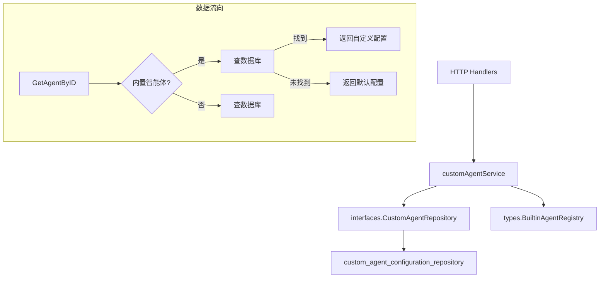

# custom_agent_profile_and_behavior_configuration_service 模块技术深度解析

## 1. 模块概述：问题与解决方案

### 问题背景
在一个复杂的多租户企业级 AI 平台中，如何优雅地处理两类截然不同的智能体（Agent）管理需求：
- **内置智能体（Built-in Agents）**：平台提供的标准智能体，所有租户都能使用，但不能删除或修改基本信息
- **自定义智能体（Custom Agents）**：租户自己创建的智能体，可以完全自由配置和管理

如果使用简单的设计方案，可能会导致：
- 代码重复：为内置和自定义智能体编写两套相似的管理逻辑
- 数据不一致：内置智能体的默认配置与用户自定义配置缺乏统一的查询路径
- 权限漏洞：租户可能意外修改或删除内置智能体

### 设计洞察
本模块采用了**"注册中心-数据库双源查询"**的混合模式：
- 内置智能体的元数据（名称、描述、头像等）从代码中的注册中心获取，保证系统稳定性
- 内置智能体的自定义配置和所有自定义智能体存储在数据库中，保证灵活性
- 查询时优先检查数据库，回退到注册中心，实现透明的配置覆盖

## 2. 核心组件与职责

### customAgentService 结构体
这是模块的核心服务实现，遵循"依赖倒置"原则，通过接口而非具体实现与数据层交互。

```go
type customAgentService struct {
    repo interfaces.CustomAgentRepository
}
```

**设计意图**：
- 将业务逻辑与数据访问解耦
- 便于单元测试（可注入 mock repository）
- 未来可以无缝切换数据存储方案

### 核心操作流程

#### 创建智能体 (CreateAgent)
```
验证必填字段 → 生成 UUID → 从上下文提取租户ID → 设置时间戳 → 
设置默认 AgentMode → 标记为非内置 → 确保默认值 → 存储到数据库
```

**关键点**：
- 强制将 `IsBuiltin` 设为 `false`，防止租户创建内置智能体
- 默认设置 `AgentModeQuickAnswer` 模式，简化新用户体验
- 调用 `EnsureDefaults()` 确保配置完整性

#### 获取智能体 (GetAgentByID)
这是整个模块最精妙的设计之一：
```
验证ID → 提取租户ID → 检查是否为内置ID → 
  是：先查数据库（用户自定义配置） → 
    找到：返回数据库版本（包含自定义配置）
    没找到：从注册中心返回默认版本
  否：直接查数据库
```

**设计意图**：实现了透明的配置覆盖机制，对调用方而言无需关心智能体配置来自何处。

#### 更新智能体 (UpdateAgent)
对于内置智能体，采用了特殊的处理策略：
```
检查是否为内置ID → 
  是：调用 updateBuiltinAgent（仅更新配置，保留基本信息）
  否：检查所有权 → 更新字段 → 保存
```

内置智能体的更新进一步细分为：
- 已有自定义配置记录：仅更新 Config 字段
- 无自定义配置记录：创建新记录，保留默认基本信息

## 3. 数据流向与依赖关系

### 依赖架构图


### 关键调用路径

1. **获取智能体流程**：
   ```
   HTTP 处理器 → customAgentService.GetAgentByID → 
   repo.GetAgentByID → (数据库查找失败时) → types.GetBuiltinAgent
   ```

2. **更新内置智能体配置**：
   ```
   customAgentService.UpdateAgent → updateBuiltinAgent → 
   (检查是否有自定义配置) → repo.CreateAgent 或 repo.UpdateAgent
   ```

3. **列表查询**：
   ```
   customAgentService.ListAgents → repo.ListAgentsByTenantID → 
   合并内置智能体（优先使用数据库中的自定义版本）→ 排序返回
   ```

## 4. 设计决策与权衡

### 1. 内置智能体的双源查询策略
**决策**：优先查数据库，回退到注册中心
- **优势**：透明的配置覆盖，用户体验一致
- **劣势**：每次查询可能需要两次数据访问
- **替代方案**：预加载所有内置智能体到数据库，但会增加初始化复杂度

### 2. 内置智能体配置的"影子记录"模式
**决策**：内置智能体的自定义配置存储为独立的数据库记录
- **优势**：无需修改内置智能体的默认定义，配置与元数据分离
- **劣势**：需要额外处理记录存在性检查
- **设计意图**：类似 Git 的"变基"思想，保持基础版本稳定，只记录变更

### 3. 严格的租户隔离
**决策**：所有操作都从 context 中提取 tenantID 并进行验证
- **优势**：防止跨租户数据访问，安全性高
- **劣势**：调用方必须正确设置 context
- **隐含契约**：`types.TenantIDContextKey` 必须在调用前设置到 context 中

### 4. 列表排序策略
**决策**：内置智能体在前，自定义智能体在后，保持内置智能体的固定顺序
- **优势**：用户体验稳定，常用的内置智能体始终在顶部
- **劣势**：自定义智能体无法插入到内置智能体之间
- **设计意图**：优先级机制，平台推荐的智能体获得更好的可见性

## 5. 使用指南与最佳实践

### 基本使用

```go
// 创建服务
repo := // 实现 CustomAgentRepository 接口的实例
service := NewCustomAgentService(repo)

// 创建智能体
agent := &types.CustomAgent{
    Name:        "我的助手",
    Description: "这是一个自定义智能体",
    Config:      types.AgentConfig{/* 配置 */},
}
createdAgent, err := service.CreateAgent(ctx, agent)

// 获取智能体（自动处理内置/自定义）
agent, err := service.GetAgentByID(ctx, agentID)

// 更新智能体
agent.Name = "新名称"
updatedAgent, err := service.UpdateAgent(ctx, agent)
```

### 上下文要求

**重要**：所有方法都要求 context 中包含 `types.TenantIDContextKey`：

```go
// 正确使用方式
ctx := context.WithValue(context.Background(), types.TenantIDContextKey, tenantID)
agent, err := service.GetAgentByID(ctx, agentID)
```

## 6. 注意事项与陷阱

### 上下文缺失
如果 context 中没有设置 tenantID，所有方法都会返回 `ErrInvalidTenantID`。这是最常见的错误来源。

### 内置智能体的限制
- 不能删除内置智能体（会返回 `ErrCannotDeleteBuiltin`）
- 不能修改内置智能体的基本信息（名称、描述、头像）
- 只能修改内置智能体的 `Config` 字段

### 复制智能体
复制智能体时，即使源是内置智能体，副本也会被标记为非内置（`IsBuiltin: false`），这是设计上的考虑，给用户完全的控制权。

### 时间戳管理
服务会自动管理 `CreatedAt` 和 `UpdatedAt` 字段，调用方设置的值会被覆盖。

## 7. 与其他模块的关系

- **HTTP 层**：被 [custom_agent_profile_management_handlers](http_handlers_and_routing-agent_tenant_organization_and_model_management_handlers-custom_agent_profile_management_handlers.md) 调用
- **数据层**：依赖 [custom_agent_configuration_repository](data_access_repositories-agent_configuration_and_external_service_repositories-custom_agent_configuration_repository.md)
- **共享服务**：与 [agent_sharing_access_service](application_services_and_orchestration-agent_identity_tenant_and_configuration_services-resource_sharing_and_access_services-agent_sharing_access_service.md) 协作处理共享智能体

## 8. 总结

`custom_agent_profile_and_behavior_configuration_service` 模块通过优雅的设计解决了内置与自定义智能体的统一管理问题。它的核心价值在于：

1. **透明的双源查询**：让调用方无需关心智能体配置来源
2. **安全的权限边界**：严格区分内置和自定义智能体的操作权限
3. **灵活的配置覆盖**：允许用户自定义内置智能体的配置而不修改系统默认值
4. **清晰的依赖关系**：通过接口抽象实现了良好的可测试性和扩展性

这种设计在平台级产品中非常常见，平衡了系统稳定性和用户灵活性之间的矛盾。
