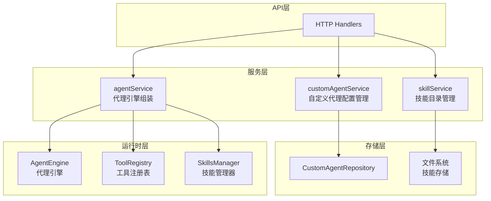

# Agent Configuration and Capability Services 模块深度解析

## 概述

`agent_configuration_and_capability_services` 模块是系统中负责代理配置管理、能力组装和技能目录管理的核心服务层。想象一下这个模块就像一个"代理工厂"和"能力工具箱"——它不仅负责存储和管理代理的配置信息，还能根据需要动态组装代理的运行时环境，包括注册工具、加载技能、配置知识库访问权限等。

这个模块解决的核心问题是：**如何在多租户环境下，灵活、安全、高效地管理多样化的代理配置和能力组合，同时保持良好的可扩展性和可维护性**。

## 架构概览

### 核心组件职责

1. **`agentService`**：代理引擎的组装工厂。负责根据配置创建完整的代理运行时环境，包括工具注册、MCP服务集成、技能加载、知识库信息获取等。

2. **`customAgentService`**：自定义代理配置的生命周期管理。处理代理的创建、读取、更新、删除（CRUD）操作，特别处理内置代理与自定义代理的区分和权限控制。

3. **`skillService`**：预加载技能目录管理。负责发现、加载和提供系统预定义的技能，为代理提供可复用的能力模板。

## 数据流程分析

### 代理创建与运行流程

当用户需要创建一个代理会话时，数据和控制流如下：

1. **配置获取**：`customAgentService.GetAgentByID()` 从存储层读取代理配置（内置代理优先使用默认配置，如有自定义则覆盖）
2. **引擎组装**：`agentService.CreateAgentEngine()` 接收配置，开始组装：
   - 验证配置有效性
   - 创建工具注册表
   - 根据配置注册相应的工具（知识库、Web搜索、数据查询等）
   - 配置MCP服务（如启用）
   - 获取知识库详细信息用于提示词
   - 初始化技能管理器（如启用）
3. **引擎返回**：组装完成的 `AgentEngine` 可直接用于会话处理

### 自定义代理配置更新流程

当用户更新代理配置时：

1. **区分代理类型**：`customAgentService.UpdateAgent()` 首先判断是内置代理还是自定义代理
2. **权限检查**：内置代理只允许更新配置，不允许修改基本信息（名称、描述等）
3. **配置持久化**：自定义配置保存到数据库，下次加载时会覆盖默认配置
4. **默认值确保**：调用 `EnsureDefaults()` 保证配置完整性

## 关键设计决策

### 1. 内置代理与自定义代理的混合管理机制

**设计选择**：内置代理使用注册表定义默认配置，同时允许在数据库中存储租户级别的自定义覆盖。

**为什么这样设计**：
- **灵活性**：内置代理可以作为"模板"，租户可以根据需要调整而无需重新创建
- **版本管理**：系统更新内置代理时，租户的自定义配置可以保留
- **性能优化**：大多数情况下直接使用内存中的注册表配置，避免数据库查询

**替代方案权衡**：
- ❌ 全部存储在数据库：每次加载都需要查询，内置代理更新困难
- ❌ 全部硬编码：完全无法定制，无法满足多租户需求

### 2. 工具注册表的动态构建模式

**设计选择**：`agentService` 在每次创建引擎时动态构建 `ToolRegistry`，而不是使用单例或预构建。

**为什么这样设计**：
- **隔离性**：每个会话的工具配置完全独立，避免交叉污染
- **灵活性**：可以根据每个代理的配置精确控制可用工具集
- **安全性**：可以在运行时根据权限、租户配置等动态过滤工具

**性能考虑**：
- 工具注册本身是轻量级操作，主要是函数指针和配置的组装
- 对于高频场景，可以考虑引入配置化的工具模板缓存

### 3. 技能系统的文件系统基础设计

**设计选择**：技能存储在文件系统中，通过 `skills.Loader` 动态发现和加载，而不是存储在数据库。

**为什么这样设计**：
- **版本控制友好**：技能代码可以像普通代码一样进行版本管理
- **开发体验**：开发者可以直接编辑文件，无需通过API或数据库操作
- **部署简单**：技能可以与应用一起打包部署，也可以独立更新

**权衡**：
- ⚠️ 多租户隔离需要通过目录结构或权限控制实现
- ⚠️ 动态更新需要文件系统监控或服务重启机制

### 4. MCP服务的选择性接入模式

**设计选择**：代理配置中提供 `MCPSelectionMode` 选项，支持 "all"、"selected"、"none" 三种模式。

**为什么这样设计**：
- **精细控制**：不同代理可以按需接入不同的MCP服务，避免能力膨胀
- **安全边界**：可以限制某些代理只能使用特定的外部服务
- **性能优化**：不需要的服务不注册，减少工具列表长度和提示词消耗

## 新开发者注意事项

### 隐式契约与边界情况

1. **租户上下文依赖**：大多数方法都依赖 `context.Context` 中的 `types.TenantIDContextKey`，调用时必须确保上下文已正确设置。

2. **内置代理ID模式**：`types.IsBuiltinAgentID()` 有特定的ID格式判断逻辑，创建自定义代理时应避免使用这些ID。

3. **工具名称一致性**：`registerTools()` 中有工具名称一致性检查，如果工具实际返回的名称与期望不符会记录警告，这可能导致工具无法被正确调用。

4. **知识库信息降级**：`getKnowledgeBaseInfos()` 在获取知识库详情失败时会使用降级策略（仅ID），这可能导致提示词中的知识库信息不完整。

### 常见陷阱

1. **忘记调用 `EnsureDefaults()`**：修改配置后如果不调用此方法，可能导致配置缺失某些字段，在运行时出现问题。

2. **沙箱模式配置错误**：技能执行的沙箱模式通过环境变量配置，错误的配置可能导致技能无法执行或执行在不安全的环境中。

3. **MCP服务依赖**：`agentService` 中的MCP相关代码会检查 `mcpServiceService` 和 `mcpManager` 是否为 nil，在某些部署配置下这些可能不可用。

4. **最大迭代次数限制**：`MAX_ITERATIONS` 常量定义了代理执行的最大迭代次数，配置值超过此限制会被拒绝。

### 扩展点建议

1. **自定义工具注册**：在 `registerTools()` 方法中添加新的工具类型注册逻辑。

2. **配置验证扩展**：在 `ValidateConfig()` 中添加自定义的配置验证规则。

3. **技能加载钩子**：可以在 `initializeSkillsManager()` 前后添加自定义的技能处理逻辑。

## 子模块文档

本模块包含以下子模块，详细信息请参考各自的文档：

- [代理生命周期与运行时配置服务](application_services_and_orchestration-agent_identity_tenant_and_configuration_services-agent_configuration_and_capability_services-agent_lifecycle_and_runtime_configuration_service.md)
- [自定义代理配置与行为服务](application_services_and_orchestration-agent_identity_tenant_and_configuration_services-agent_configuration_and_capability_services-custom_agent_profile_and_behavior_configuration_service.md)
- [代理技能目录与能力管理服务](application_services_and_orchestration-agent_identity_tenant_and_configuration_services-agent_configuration_and_capability_services-agent_skill_catalog_and_capability_management_service.md)

## 跨模块依赖

本模块与以下模块有紧密的依赖关系：

- **[数据访问层](data_access_repositories.md)**：`customAgentService` 依赖 `CustomAgentRepository` 进行配置持久化。
- **[代理运行时](agent_runtime_and_tools.md)**：`agentService` 组装的 `AgentEngine` 和工具来自此模块。
- **[知识库服务](application_services_and_orchestration-knowledge_ingestion_extraction_and_graph_services.md)**：获取知识库信息和内容用于代理配置。
- **[MCP服务](platform_infrastructure_and_runtime-mcp_connectivity_and_protocol_models.md)**：集成外部MCP工具到代理能力中。
