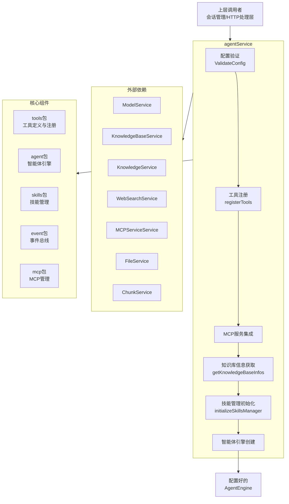

# Agent Lifecycle and Runtime Configuration Service 技术深度解析

## 1. 模块概述

`agent_lifecycle_and_runtime_configuration_service` 模块是整个系统的核心服务之一，主要负责智能体（Agent）的生命周期管理和运行时配置。它就像一个智能体的"总工程师"，负责组装、配置和启动智能体引擎，并管理其各种能力（如工具、技能、知识库等）。

### 问题空间与设计意图

在没有这个模块的情况下，每个智能体实例的创建和配置都会是一个分散且重复的过程。开发者需要手动：
- 初始化各种工具
- 配置知识库
- 管理技能加载
- 设置网络搜索能力
- 处理 MCP 服务集成

这个模块通过提供一个统一的入口点，将所有这些复杂的配置逻辑集中在一起，确保了智能体创建的一致性和可维护性。

## 2. 核心组件解析

### 2.1 agentService 结构体

`agentService` 是模块的核心结构体，它聚合了创建和管理智能体所需的所有依赖项：

```go
type agentService struct {
    cfg                   *config.Config
    modelService          interfaces.ModelService
    mcpServiceService     interfaces.MCPServiceService
    mcpManager            *mcp.MCPManager
    eventBus              *event.EventBus
    db                    *gorm.DB
    webSearchService      interfaces.WebSearchService
    knowledgeBaseService  interfaces.KnowledgeBaseService
    knowledgeService      interfaces.KnowledgeService
    fileService           interfaces.FileService
    chunkService          interfaces.ChunkService
    duckdb                *sql.DB
    webSearchStateService interfaces.WebSearchStateService
}
```

**设计意图**：这个结构体采用了依赖注入模式，将所有外部依赖显式地声明在结构体中，而不是在方法内部硬编码。这种设计有几个关键优势：

1. **可测试性**：可以轻松地模拟这些依赖项进行单元测试
2. **解耦**：服务的实现与外部依赖解耦，使得组件可以独立演进
3. **明确性**：通过查看结构体定义，就能清楚知道这个服务需要哪些外部资源

### 2.2 CreateAgentEngine 方法

这是模块最重要的方法，负责创建并配置完整的智能体引擎。让我们深入分析其工作流程：

```go
func (s *agentService) CreateAgentEngine(
    ctx context.Context,
    config *types.AgentConfig,
    chatModel chat.Chat,
    rerankModel rerank.Reranker,
    eventBus *event.EventBus,
    contextManager interfaces.ContextManager,
    sessionID string,
) (interfaces.AgentEngine, error)
```

**工作流程详解**：

1. **配置验证**：首先验证传入的配置是否有效
2. **工具注册表创建**：初始化工具注册表
3. **核心工具注册**：根据配置注册各种核心工具（知识搜索、网络搜索等）
4. **MCP 服务集成**：根据租户配置和智能体设置集成 MCP 服务
5. **知识库信息获取**：获取知识库详细信息用于系统提示词
6. **技能管理器初始化**：如果启用了技能，初始化技能管理器
7. **智能体引擎创建**：最终创建并返回完整配置的智能体引擎

**关键设计决策**：
- 方法接受大量参数，确保智能体引擎的创建是确定性的
- 使用了事件总线，使得智能体的行为可以被监控和扩展
- 上下文管理器的注入允许灵活的对话上下文管理策略

### 2.3 registerTools 方法

这个方法负责根据智能体配置注册各种工具。它的实现展示了一个精心设计的工具选择和过滤机制：

```go
func (s *agentService) registerTools(
    ctx context.Context,
    registry *tools.ToolRegistry,
    config *types.AgentConfig,
    rerankModel rerank.Reranker,
    chatModel chat.Chat,
    sessionID string,
) error
```

**设计亮点**：

1. **条件工具注册**：根据配置的不同（如是否有知识库、是否启用网络搜索）动态注册工具
2. **工具过滤机制**：在"纯代理模式"下（没有知识库和网络搜索），自动过滤掉不相关的工具
3. **工具注册的可扩展性**：使用 switch 语句处理工具注册，便于添加新工具类型

### 2.4 initializeSkillsManager 方法

技能管理器的初始化是一个复杂的过程，涉及到沙箱环境的配置：

```go
func (s *agentService) initializeSkillsManager(
    ctx context.Context,
    config *types.AgentConfig,
    toolRegistry *tools.ToolRegistry,
) (*skills.Manager, error)
```

**关键设计点**：

1. **沙箱环境配置**：支持 Docker、本地和禁用三种沙箱模式，通过环境变量配置
2. **回退机制**：如果 Docker 沙箱初始化失败，会回退到禁用模式
3. **技能工具注册**：根据沙箱模式有条件地注册技能执行工具

## 3. 架构与数据流程

### 3.1 系统架构图



### 3.2 数据流向

当创建一个智能体引擎时，数据主要按照以下路径流动：

1. **输入配置**：从外部接收 `types.AgentConfig` 配置
2. **依赖注入**：通过 `agentService` 的依赖项获取各种服务
3. **工具注册**：将配置转化为具体的工具实例
4. **知识库信息**：从知识库服务获取详细信息
5. **技能加载**：从技能目录加载技能定义
6. **引擎输出**：最终输出配置好的 `interfaces.AgentEngine`

### 3.3 主要依赖关系

这个模块依赖于多个关键模块：

- **agent**：提供核心的智能体引擎实现
- **tools**：提供各种工具的定义和注册机制
- **skills**：提供技能管理功能
- **mcp**：提供 MCP 服务集成
- **event**：提供事件总线功能
- 各种 service 接口：如 `ModelService`、`KnowledgeBaseService` 等

同时，它被更高层的模块调用，主要是会话生命周期管理和 HTTP 处理层。

## 4. 设计权衡与决策

### 4.1 依赖注入 vs 服务定位

**决策**：采用显式的依赖注入模式

**原因**：
- 提高了代码的可测试性
- 使依赖关系更加明确
- 便于在不同环境中替换实现

**权衡**：
- 增加了构造函数的参数数量
- 调用者需要了解更多的依赖细节

### 4.2 集中式配置 vs 分散式配置

**决策**：采用集中式配置管理

**原因**：
- 确保智能体配置的一致性
- 提供单一的配置验证点
- 便于全局配置管理

**权衡**：
- 配置对象可能变得复杂
- 增加了模块间的耦合度

### 4.3 条件工具注册 vs 统一注册

**决策**：采用条件工具注册

**原因**：
- 避免注册不必要的工具，减少资源消耗
- 提供更精准的智能体能力配置
- 改善用户体验，只显示相关的工具

**权衡**：
- 增加了配置逻辑的复杂度
- 需要更仔细地处理工具间的依赖关系

## 5. 使用指南与注意事项

### 5.1 基本使用

创建智能体引擎的基本流程：

```go
// 1. 创建 agentService 实例
agentSvc := service.NewAgentService(/* 依赖项 */)

// 2. 准备配置
config := &types.AgentConfig{
    KnowledgeBases: []string{"kb1", "kb2"},
    WebSearchEnabled: true,
    SkillsEnabled: true,
    // 其他配置...
}

// 3. 创建智能体引擎
engine, err := agentSvc.CreateAgentEngine(
    ctx,
    config,
    chatModel,
    rerankModel,
    eventBus,
    contextManager,
    sessionID,
)
```

### 5.2 配置要点

- **MaxIterations**：限制智能体的最大迭代次数，默认 5 次，最大 100 次
- **KnowledgeBases**：配置智能体可访问的知识库
- **WebSearchEnabled**：启用/禁用网络搜索功能
- **SkillsEnabled**：启用/禁用技能功能
- **MCPSelectionMode**：控制 MCP 服务的选择模式（"all"、"selected"、"none"）

### 5.3 注意事项与陷阱

1. **nil 检查**：`rerankModel` 可以为 nil（当没有配置知识库时），但 `chatModel` 必须非 nil
2. **租户上下文**：MCP 服务集成依赖于上下文中的租户 ID
3. **知识库容错**：获取知识库信息时有容错机制，即使部分知识库获取失败也会继续
4. **沙箱配置**：技能执行需要正确配置沙箱环境，特别是在生产环境中
5. **工具名称一致性**：注册工具时会检查工具名称是否一致，不一致会记录警告

## 6. 总结

`agent_lifecycle_and_runtime_configuration_service` 模块是整个智能体系统的关键组成部分，它通过集中式的配置和生命周期管理，简化了智能体的创建和维护过程。其设计充分考虑了可扩展性、可测试性和灵活性，是一个优秀的服务层设计范例。

通过深入理解这个模块，开发者可以更好地使用和扩展智能体功能，同时也能从中学习到如何设计一个复杂的服务层组件。
