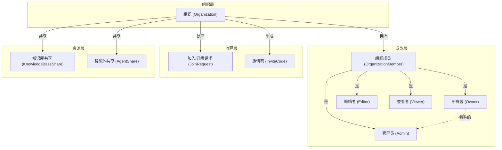

# 组织治理与成员管理模块技术深度解析

## 1. 模块概览

### 问题空间
在大型协作平台中，用户往往需要以团队形式共享知识资源（如知识库、智能体等），并对这些共享资源进行统一的访问控制和管理。简单的用户-资源直接共享模式在以下场景中会遇到问题：
1. 需要批量管理多个用户对资源的访问权限时
2. 团队成员频繁变更，需要动态调整权限时
3. 需要区分不同用户在团队中的角色和职责时

本模块提供了一套完整的组织（Organization）抽象，解决了这些问题：它提供了一个身份容器，将用户聚合为团队，支持角色权限控制、成员邀请审批流程、资源共享等功能，同时确保了跨租户资源协作的安全性。

### 核心价值
- **团队协作抽象**：将多个用户组织成可管理的协作单元
- **灵活权限控制**：提供基于角色的访问控制（RBAC）
- **多种加入机制**：支持邀请码、申请审批、公开搜索等多种加入方式
- **安全边界保障**：在多租户环境下提供安全的资源共享机制

## 2. 架构与核心概念

### 心智模型
可以将组织想象成一个**数字工作空间**：
- **组织**是一个独立的协作空间，有自己的名称、描述、头像
- **所有者（Owner）**是创建组织的用户，拥有最高权限，不能被移除
- **管理员（Admin）**可以管理组织设置、成员和权限
- **编辑者（Editor）**可以编辑共享的知识内容
- **查看者（Viewer）**只能查看和搜索共享资源
- **邀请码**是进入空间的"钥匙"，可以设置有效期
- **加入请求**是访客提交的"入会申请"，需要管理员审批

### 核心组件关系图



### 数据模型核心概念

#### 组织（Organization）
组织是模块的核心实体，包含以下关键属性：
- **身份信息**：ID、名称、描述、头像
- **治理配置**：所有者ID、成员上限、是否需要审批、是否可搜索
- **邀请机制**：邀请码、邀请码有效期、邀请码过期时间

#### 成员角色（OrgMemberRole）
采用三层角色权限体系，权限级别从高到低：
1. **Admin（管理员）**：完全控制组织和共享资源
2. **Editor（编辑者）**：可编辑共享内容，但不能管理设置
3. **Viewer（查看者）**：只能查看和搜索共享资源

权限检查通过 `HasPermission()` 方法实现，采用数值比较（Admin=3, Editor=2, Viewer=1）。

#### 成员（OrganizationMember）
连接用户与组织的桥梁，记录：
- 用户在组织中的角色
- 用户所属的租户ID（支持跨租户协作）

#### 加入请求（OrganizationJoinRequest）
支持两种类型的请求：
1. **Join（加入请求）**：新用户申请加入组织
2. **Upgrade（升级请求）**：现有成员申请提升角色

## 3. 核心组件深度解析

### organizationService 结构体

`organizationService` 是模块的核心服务实现，采用依赖注入模式，依赖四个仓库接口：

```go
type organizationService struct {
    orgRepo        interfaces.OrganizationRepository
    userRepo       interfaces.UserRepository
    shareRepo      interfaces.KBShareRepository
    agentShareRepo interfaces.AgentShareRepository
}
```

**设计意图**：
- 通过接口依赖实现松耦合，便于单元测试
- 将数据访问逻辑委托给仓库层，服务层专注于业务逻辑
- 同时处理组织本身和相关资源共享的清理工作

### 关键业务流程

#### 1. 组织创建流程

创建组织是一个包含事务性操作的流程：

```go
func (s *organizationService) CreateOrganization(ctx context.Context, userID string, tenantID uint64, req *types.CreateOrganizationRequest) (*types.Organization, error)
```

**流程解析**：
1. **参数验证**：检查邀请码有效期、成员上限等参数的合法性
2. **组织创建**：生成唯一ID，设置默认值，创建组织记录
3. **成员添加**：将创建者添加为管理员成员
4. **回滚机制**：如果成员添加失败，删除已创建的组织

**设计亮点**：
- 虽然没有显式的数据库事务，但通过应用层逻辑实现了补偿性事务
- 创建者自动成为管理员，确保组织有初始管理者
- 生成随机邀请码，为后续成员加入提供入口

#### 2. 成员加入机制

模块提供了三种成员加入方式：

##### a) 邀请码加入（JoinByInviteCode）
```go
func (s *organizationService) JoinByInviteCode(ctx context.Context, inviteCode string, userID string, tenantID uint64) (*types.Organization, error)
```

**流程**：
1. 验证邀请码有效性和过期时间
2. 检查组织是否需要审批（需要审批则拒绝直接加入）
3. 检查用户是否已在组织中
4. 检查成员上限
5. 添加用户为查看者角色

##### b) 公开组织加入（JoinByOrganizationID）
```go
func (s *organizationService) JoinByOrganizationID(ctx context.Context, orgID string, userID string, tenantID uint64, message string, requestedRole types.OrgMemberRole) (*types.Organization, error)
```

**特点**：
- 仅适用于可搜索（Searchable=true）的组织
- 根据组织设置决定是直接加入还是提交申请
- 复用邀请码加入的逻辑

##### c) 申请审批加入（SubmitJoinRequest + ReviewJoinRequest）

**申请阶段**：
```go
func (s *organizationService) SubmitJoinRequest(ctx context.Context, orgID string, userID string, tenantID uint64, message string, requestedRole types.OrgMemberRole) (*types.OrganizationJoinRequest, error)
```

**审批阶段**：
```go
func (s *organizationService) ReviewJoinRequest(ctx context.Context, orgID string, requestID string, approved bool, reviewerID string, message string, assignRole *types.OrgMemberRole) error
```

**设计亮点**：
- 统一处理加入请求和升级请求
- 审批时支持覆盖申请人的请求角色
- 记录审批人和审批消息，便于审计

#### 3. 角色权限管理

##### 角色更新（UpdateMemberRole）
```go
func (s *organizationService) UpdateMemberRole(ctx context.Context, orgID string, memberUserID string, role types.OrgMemberRole, operatorUserID string) error
```

**安全检查**：
1. 操作者必须是管理员
2. 不能更改所有者的角色

##### 角色升级请求（RequestRoleUpgrade）
```go
func (s *organizationService) RequestRoleUpgrade(ctx context.Context, orgID string, userID string, tenantID uint64, requestedRole types.OrgMemberRole, message string) (*types.OrganizationJoinRequest, error)
```

**特点**：
- 只能申请更高权限的角色
- 防止重复提交待处理的升级请求
- 记录用户之前的角色，便于审批参考

#### 4. 成员移除与组织删除

##### 成员移除（RemoveMember）
```go
func (s *organizationService) RemoveMember(ctx context.Context, orgID string, memberUserID string, operatorUserID string) error
```

**设计亮点**：
- 区分自我移除（退出）和管理员移除
- 自我移除不需要管理员权限
- 不能移除组织所有者

##### 组织删除（DeleteOrganization）
```go
func (s *organizationService) DeleteOrganization(ctx context.Context, id string, userID string) error
```

**清理逻辑**：
1. 只有所有者可以删除组织
2. 级联删除所有知识库共享记录
3. 级联删除所有智能体共享记录
4. 最后删除组织本身

## 4. 依赖分析

### 入站依赖
- **HTTP 处理器层**：`internal/handler/organization.go` 中的处理器调用服务方法
- **其他服务**：可能被资源共享服务等调用

### 出站依赖
- **OrganizationRepository**：组织数据持久化
- **UserRepository**：用户信息查询
- **KBShareRepository**：知识库共享管理
- **AgentShareRepository**：智能体共享管理

### 数据契约
模块与仓库层之间通过 `types` 包中定义的结构体进行数据交换，主要包括：
- `Organization`：组织实体
- `OrganizationMember`：成员实体
- `OrganizationJoinRequest`：加入请求实体
- `CreateOrganizationRequest` / `UpdateOrganizationRequest`：请求模型

相关的类型定义可以在 [organization 类型定义](../internal/types/organization.go) 中查看。

## 5. 设计决策与权衡

### 1. 角色体系设计

**决策**：采用三级角色（Admin/Editor/Viewer）而非更细粒度的权限矩阵

**理由**：
- 简单直观，易于理解和使用
- 覆盖大多数协作场景的需求
- 降低权限管理的复杂度

**权衡**：
- 优点：实现简单，用户学习成本低
- 缺点：灵活性有限，无法满足非常精细的权限控制需求

### 2. 邀请码有效期选项

**决策**：限制有效期为固定选项（0/1/7/30天）而非任意天数

**理由**：
- 简化用户选择，避免无效值
- 覆盖常见使用场景
- 便于安全策略实施

**权衡**：
- 优点：用户体验简单，减少错误输入
- 缺点：灵活性受限，无法满足特殊有效期需求

### 3. 组织删除时的资源处理

**决策**：删除组织时级联删除所有共享记录，但不删除资源本身

**理由**：
- 资源属于原租户，组织只是共享渠道
- 避免误删除造成的数据丢失
- 符合数据所有权原则

**权衡**：
- 优点：保护数据安全，明确所有权边界
- 缺点：可能造成"孤儿"共享记录（但本设计中通过级联删除避免了）

### 4. 成员上限验证

**决策**：在多个入口点（加入、添加、审批）都进行成员上限验证

**理由**：
- 确保成员上限在任何情况下都不被突破
- 防御性编程，防止绕过验证的情况

**权衡**：
- 优点：安全性高，确保约束有效
- 缺点：代码重复，维护成本略高

## 6. 使用指南与最佳实践

### 常见使用模式

#### 创建组织
```go
org, err := orgService.CreateOrganization(ctx, userID, tenantID, &types.CreateOrganizationRequest{
    Name:        "团队名称",
    Description: "团队描述",
    Avatar:      "https://example.com/avatar.png",
})
```

#### 邀请成员
```go
// 方式1：管理员直接添加
err := orgService.AddMember(ctx, orgID, userID, tenantID, types.OrgRoleViewer)

// 方式2：生成邀请码发给用户
inviteCode, err := orgService.GenerateInviteCode(ctx, orgID, adminUserID)

// 方式3：用户通过公开组织申请加入
org, err := orgService.JoinByOrganizationID(ctx, orgID, userID, tenantID, "申请理由", types.OrgRoleViewer)
```

#### 管理成员角色
```go
// 更新角色
err := orgService.UpdateMemberRole(ctx, orgID, memberUserID, types.OrgRoleEditor, adminUserID)

// 处理加入请求
requests, _ := orgService.ListJoinRequests(ctx, orgID)
for _, req := range requests {
    if req.Status == types.JoinRequestStatusPending {
        err := orgService.ReviewJoinRequest(ctx, orgID, req.ID, true, adminUserID, "欢迎加入！", nil)
    }
}
```

### 配置选项

#### 组织设置选项
- **邀请码有效期**：0（永不过期）、1、7、30天
- **成员上限**：0（无限制）或正整数
- **加入审批**：是否需要管理员审批才能加入
- **可搜索性**：是否允许非成员搜索和发现组织

### 扩展点

虽然当前实现相对固定，但以下是潜在的扩展方向：
1. 自定义角色权限
2. 更丰富的组织设置
3. 组织层级结构
4. 组织活动日志
5. 批量成员管理

## 7. 注意事项与常见陷阱

### 安全注意事项
1. **所有者保护**：所有者不能被移除或角色变更，确保组织始终有管理者
2. **权限检查**：所有管理操作都验证操作者权限，不要绕过服务层直接操作数据库
3. **邀请码安全**：邀请码应通过安全渠道传输，避免在日志中完整记录
4. **跨租户隔离**：注意成员的 TenantID 字段，确保资源访问时的租户隔离

### 操作陷阱
1. **成员上限变更**：降低成员上限时，确保不低于当前成员数
2. **组织删除**：删除组织前考虑备份重要数据，删除后无法恢复
3. **邀请码重新生成**：重新生成邀请码会使旧邀请码失效
4. **角色降级**：降级用户角色时，考虑对用户工作的影响

### 边界情况
1. **空组织**：只有所有者一个成员的组织
2. **成员上限为0**：表示无限制，需要特殊处理
3. **邀请码过期**：处理过期邀请码时的用户体验
4. **并发加入**：高并发下的成员上限检查可能存在竞态条件

## 8. 相关模块

- [组织成员与治理仓库](organization_membership_and_governance_repository.md)：本模块的数据访问层
- [知识库共享访问仓库](knowledge_base_share_access_repository.md)：组织共享知识库的实现
- [智能体共享访问仓库](agent_share_access_repository.md)：组织共享智能体的实现
- [用户身份账户管理](application_services_and_orchestration-agent_identity_tenant_and_configuration_services-identity_tenant_and_organization_management-user_identity_account_management.md)：与组织用户相关的功能

## 9. 总结

`organization_governance_and_membership_management` 模块提供了一个完整的团队协作管理解决方案，它通过组织抽象将用户聚合，提供灵活的角色权限控制、多种加入机制和安全的资源共享基础。

模块设计遵循简洁实用的原则，在灵活性和易用性之间取得了良好平衡。它采用清晰的分层架构，将业务逻辑与数据访问分离，便于维护和测试。通过深入理解这个模块的设计思想和实现细节，开发者可以更好地利用它构建安全、高效的团队协作功能。
